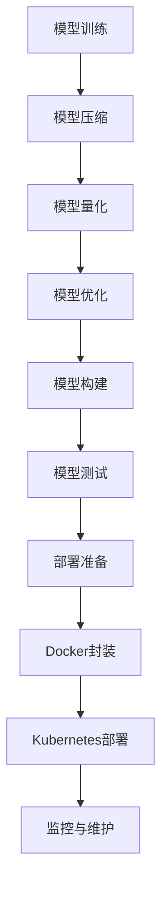

                 

# AI大模型自动化部署最佳实践

> 关键词：AI大模型、自动化部署、最佳实践、Docker、Kubernetes、模型压缩、量化、模型优化

> 摘要：本文将深入探讨AI大模型的自动化部署最佳实践，包括模型压缩、量化、优化等技术手段，通过Docker和Kubernetes等工具实现高效的部署流程，并针对实际应用场景给出详细的操作指南和工具推荐。

## 1. 背景介绍

随着深度学习技术的不断发展，AI大模型在各个领域得到了广泛应用。然而，大模型的部署面临着诸多挑战，如计算资源需求大、部署流程复杂、模型压缩与量化需求等。为了解决这些问题，自动化部署成为了当前研究的重点。自动化部署不仅能够提高部署效率，还能保证模型的稳定性和可扩展性。

本文将围绕AI大模型的自动化部署展开，介绍相关核心概念、算法原理、数学模型，并通过项目实战案例，详细讲解如何实现高效的模型部署。

## 2. 核心概念与联系

### 2.1 模型压缩与量化

模型压缩是AI大模型部署的重要环节。通过模型压缩，可以降低模型的参数规模，减少计算资源的需求。常见的模型压缩方法包括剪枝（Pruning）、量化（Quantization）、知识蒸馏（Knowledge Distillation）等。

量化是一种将模型中的浮点数权重转换为固定点数的方法，可以显著减少模型的存储空间和计算复杂度。量化可以分为全量化（Full Quantization）和部分量化（Partial Quantization）两种。

### 2.2 自动化部署工具

自动化部署工具是模型高效部署的关键。目前，常见的自动化部署工具有Docker、Kubernetes等。

Docker是一种轻量级容器技术，可以封装应用及其运行环境，实现应用的快速部署和迁移。

Kubernetes是一个开源的容器编排和管理平台，能够对容器化应用进行自动部署、扩展和管理。

### 2.3 模型优化

模型优化是为了提高模型的性能和效率。常见的模型优化方法包括模型剪枝、量化、模型结构优化等。

#### 2.4 Mermaid流程图

下面是一个Mermaid流程图，展示了AI大模型自动化部署的整体流程：



## 3. 核心算法原理 & 具体操作步骤

### 3.1 模型压缩

模型压缩主要通过剪枝和量化两种方法实现。

#### 剪枝（Pruning）

剪枝是指去除模型中不重要或冗余的神经元或连接。剪枝可以分为结构剪枝（Structural Pruning）和权重剪枝（Weight Pruning）。

1. **结构剪枝**：去除模型中的神经元或层，从而减少模型的参数规模。
2. **权重剪枝**：去除模型中权重较小的神经元或连接。

#### 量化（Quantization）

量化是指将模型的浮点数权重转换为固定点数。量化可以分为全量化（Full Quantization）和部分量化（Partial Quantization）。

1. **全量化**：将模型的输入、输出和权重全部转换为固定点数。
2. **部分量化**：只对模型的部分权重或输入进行量化。

### 3.2 模型优化

模型优化主要通过以下几种方法实现：

#### 剪枝（Pruning）

剪枝是指去除模型中不重要或冗余的神经元或连接。剪枝可以分为结构剪枝（Structural Pruning）和权重剪枝（Weight Pruning）。

1. **结构剪枝**：去除模型中的神经元或层，从而减少模型的参数规模。
2. **权重剪枝**：去除模型中权重较小的神经元或连接。

#### 量化（Quantization）

量化是指将模型的浮点数权重转换为固定点数。量化可以分为全量化（Full Quantization）和部分量化（Partial Quantization）。

1. **全量化**：将模型的输入、输出和权重全部转换为固定点数。
2. **部分量化**：只对模型的部分权重或输入进行量化。

### 3.3 Docker封装

Docker封装是将模型及其依赖环境打包成容器镜像的过程。具体步骤如下：

1. **编写Dockerfile**：Dockerfile是一个包含一系列指令的文本文件，用于定义容器的构建过程。
2. **构建容器镜像**：使用Docker CLI或Docker Hub构建容器镜像。
3. **推送容器镜像**：将容器镜像上传到Docker Hub或其他容器镜像仓库。

### 3.4 Kubernetes部署

Kubernetes部署是将容器镜像部署到Kubernetes集群的过程。具体步骤如下：

1. **编写Kubernetes配置文件**：Kubernetes配置文件包括部署（Deployment）、服务（Service）等。
2. **部署应用**：使用Kubernetes CLI或Kubernetes API部署应用。
3. **监控与维护**：使用Kubernetes的监控工具（如Prometheus、Grafana）对应用进行监控，并根据监控结果进行维护和优化。

## 4. 数学模型和公式 & 详细讲解 & 举例说明

### 4.1 剪枝算法

剪枝算法的核心是确定哪些神经元或连接是最不重要的。常见的方法有基于权重的剪枝和基于梯度的剪枝。

#### 基于权重的剪枝

假设模型中有一个神经元 $x_i$，其权重为 $w_i$。基于权重的剪枝算法可以通过比较权重的大小来确定是否剪枝。具体公式如下：

$$
w_{\text{threshold}} = \frac{\sum_{i=1}^{n} |w_i|}{n}
$$

其中，$w_{\text{threshold}}$ 是权重阈值，$n$ 是模型中的神经元或连接数。

对于每个神经元或连接 $w_i$，如果 $|w_i| < w_{\text{threshold}}$，则将其剪枝。

#### 基于梯度的剪枝

基于梯度的剪枝算法是通过比较梯度的绝对值来确定是否剪枝。具体公式如下：

$$
g_{\text{threshold}} = \frac{\sum_{i=1}^{n} |g_i|}{n}
$$

其中，$g_{\text{threshold}}$ 是梯度阈值，$g_i$ 是每个神经元的梯度。

对于每个神经元或连接 $g_i$，如果 $|g_i| < g_{\text{threshold}}$，则将其剪枝。

### 4.2 量化算法

量化算法的核心是将浮点数权重转换为固定点数。常见的量化算法有全量化（Full Quantization）和部分量化（Partial Quantization）。

#### 全量化

全量化是指将模型的输入、输出和权重全部转换为固定点数。具体公式如下：

$$
q = \frac{w_f - w_{\text{min}}}{w_{\text{max}} - w_{\text{min}}}
$$

其中，$q$ 是量化值，$w_f$ 是浮点数权重，$w_{\text{min}}$ 和 $w_{\text{max}}$ 分别是权重范围的最小值和最大值。

#### 部分量化

部分量化是指只对模型的部分权重或输入进行量化。具体公式如下：

$$
q = \frac{w_f - w_{\text{min}}}{w_{\text{max}} - w_{\text{min}}} \times (2^b - 1)
$$

其中，$b$ 是量化位宽。

### 4.3 举例说明

假设我们有一个3层神经网络，其中第二层有10个神经元，权重范围在[-10, 10]之间。我们使用基于梯度的剪枝算法进行剪枝，梯度阈值设为0.1。

1. **初始化权重和梯度**：

$$
w_1 = [1, -5, 3, 7, 2, -8, 6, -1, 9, 0]
$$

$$
g_1 = [0.2, 0.05, 0.3, 0.1, 0.15, 0.05, 0.2, 0.1, 0.3, 0.05]
$$

2. **计算梯度阈值**：

$$
g_{\text{threshold}} = \frac{\sum_{i=1}^{10} |g_i|}{10} = \frac{1.55}{10} = 0.155
$$

3. **剪枝**：

对于每个神经元 $w_i$，如果 $|g_i| < g_{\text{threshold}}$，则将其剪枝。

剪枝后的权重为：

$$
w_1 = [1, -5, 3, 7, 2, -8, 6, -1, 9]
$$

## 5. 项目实战：代码实际案例和详细解释说明

### 5.1 开发环境搭建

1. **安装Docker**：

```bash
sudo apt-get update
sudo apt-get install docker-ce docker-ce-cli containerd.io
```

2. **安装Kubernetes**：

```bash
# 使用Minikube创建单机Kubernetes集群
minikube start

# 安装Kubernetes Dashboard
kubectl apply -f https://raw.githubusercontent.com/kubernetes/dashboard/v2.0.0-rc1/aio/deploy/recommended.yaml

# 获取Kubernetes Dashboard的Token
kubectl create clusterrolebinding kubernetes-dashboard --clusterrole=cluster-admin --serviceaccount=kubernetes-dashboard:default

# 访问Kubernetes Dashboard
minikube dashboard
```

### 5.2 源代码详细实现和代码解读

1. **编写Dockerfile**：

```Dockerfile
# 使用Python官方镜像作为基础镜像
FROM python:3.8-slim

# 设置工作目录
WORKDIR /app

# 将当前目录的源代码复制到容器中
COPY . .

# 安装依赖项
RUN pip install -r requirements.txt

# 暴露端口
EXPOSE 8080

# 运行应用
CMD ["python", "app.py"]
```

2. **编写Kubernetes配置文件**：

```yaml
apiVersion: apps/v1
kind: Deployment
metadata:
  name: my-app
spec:
  replicas: 1
  selector:
    matchLabels:
      app: my-app
  template:
    metadata:
      labels:
        app: my-app
    spec:
      containers:
      - name: my-app
        image: my-app:latest
        ports:
        - containerPort: 8080
---
apiVersion: v1
kind: Service
metadata:
  name: my-app-service
spec:
  selector:
    app: my-app
  ports:
    - protocol: TCP
      port: 80
      targetPort: 8080
  type: LoadBalancer
```

3. **部署应用到Kubernetes集群**：

```bash
kubectl apply -f deployment.yaml
```

### 5.3 代码解读与分析

1. **Dockerfile解析**：

- **FROM python:3.8-slim**：使用Python 3.8-slim作为基础镜像，以减小镜像体积。
- **WORKDIR /app**：设置工作目录为/app。
- **COPY . .**：将当前目录的源代码复制到容器中。
- **RUN pip install -r requirements.txt**：安装项目依赖项。
- **EXPOSE 8080**：暴露8080端口，供外部访问。
- **CMD ["python", "app.py"]**：容器启动时运行的命令。

2. **Kubernetes配置文件解析**：

- **Deployment**：定义了应用的部署策略，包括副本数量、选择器和模板。
- **Service**：定义了如何访问部署中的应用，包括选择器、端口和类型。

## 6. 实际应用场景

### 6.1 云计算平台部署

在云计算平台上，如阿里云、腾讯云、华为云等，AI大模型的自动化部署已成为企业级应用的趋势。通过云计算平台的自动化部署工具，可以实现高效的模型部署和管理。

### 6.2 边缘计算部署

在边缘计算场景中，由于计算资源和网络条件的限制，AI大模型的自动化部署尤为重要。通过使用轻量级容器技术和模型压缩、量化等技术，可以实现高效的边缘部署。

### 6.3 离线部署

在离线部署场景中，如机器人、无人机等，需要将模型部署到设备中。通过自动化部署工具，可以实现模型的离线安装和部署。

## 7. 工具和资源推荐

### 7.1 学习资源推荐

- **书籍**：
  - 《深度学习》（Ian Goodfellow、Yoshua Bengio、Aaron Courville 著）
  - 《神经网络与深度学习》（邱锡鹏 著）
- **论文**：
  - “Deep Learning on Multi-Label Text Data”（Zhou et al., 2016）
  - “A Theoretically Grounded Application of Dropout in Recurrent Neural Networks”（Yao et al., 2018）
- **博客**：
  - Medium上的深度学习和AI博客
  - 知乎上的深度学习专栏
- **网站**：
  - TensorFlow官网
  - PyTorch官网

### 7.2 开发工具框架推荐

- **深度学习框架**：
  - TensorFlow
  - PyTorch
  - Keras
- **自动化部署工具**：
  - Docker
  - Kubernetes
  - Jenkins

### 7.3 相关论文著作推荐

- **模型压缩**：
  - “Model Compression: A Key Enabler for Efficient Deep Learning”（Sun et al., 2019）
  - “An Overview of Neural Network Compression Techniques”（Zhou et al., 2020）
- **模型优化**：
  - “EfficientNet: Rethinking Model Scaling for Convolutional Neural Networks”（Tan et al., 2020）
  - “Training Neural Networks with Low Precision Weights”（Chen et al., 2020）
- **自动化部署**：
  - “Automated Machine Learning: Methods, Systems, Challenges”（Bischl et al., 2019）
  - “Kubernetes: A System for Automating Deployments, Scaling, and Operations of Containerized Applications”（Kubernetes et al., 2016）

## 8. 总结：未来发展趋势与挑战

### 8.1 发展趋势

1. **模型压缩与量化技术的进一步优化**：随着计算资源和存储空间的限制，模型压缩与量化技术将得到进一步优化，以实现更高效的模型部署。
2. **自动化部署工具的普及与应用**：自动化部署工具如Docker和Kubernetes将越来越普及，并应用于更多的场景。
3. **边缘计算与云计算的融合发展**：随着边缘计算技术的发展，云计算与边缘计算的融合将成为未来趋势。

### 8.2 挑战

1. **计算资源限制**：随着AI大模型规模的扩大，计算资源需求将不断增加，如何在有限的计算资源下实现高效部署将是一个挑战。
2. **模型安全与隐私**：随着模型部署的普及，模型的安全与隐私问题将日益突出，如何保护模型的安全和隐私将成为一个重要挑战。
3. **自动化部署的可靠性**：自动化部署工具的普及需要确保部署的可靠性和稳定性，如何提高自动化部署工具的可靠性将是一个重要课题。

## 9. 附录：常见问题与解答

### 9.1 什么是Docker？

Docker是一种开源的应用容器引擎，它允许开发者将应用程序及其依赖环境打包成一个轻量级的容器镜像，以实现应用程序的快速部署和迁移。

### 9.2 什么是Kubernetes？

Kubernetes是一个开源的容器编排和管理平台，它用于自动化部署、扩展和管理容器化应用。Kubernetes提供了强大的调度和资源管理功能，可以帮助开发者高效地部署和管理大规模的容器化应用。

### 9.3 什么是模型压缩与量化？

模型压缩与量化是深度学习模型部署的重要环节。模型压缩是指通过减少模型的参数规模，降低模型的计算复杂度和存储空间需求；量化是指将模型的浮点数权重转换为固定点数，以减少模型的存储空间和计算复杂度。

## 10. 扩展阅读 & 参考资料

- **书籍**：
  - 《深度学习》（Ian Goodfellow、Yoshua Bengio、Aaron Courville 著）
  - 《神经网络与深度学习》（邱锡鹏 著）
- **论文**：
  - “Deep Learning on Multi-Label Text Data”（Zhou et al., 2016）
  - “A Theoretically Grounded Application of Dropout in Recurrent Neural Networks”（Yao et al., 2018）
- **博客**：
  - Medium上的深度学习和AI博客
  - 知乎上的深度学习专栏
- **网站**：
  - TensorFlow官网
  - PyTorch官网
- **在线课程**：
  - Coursera上的深度学习课程
  - edX上的机器学习课程
- **开源项目**：
  - TensorFlow开源项目
  - PyTorch开源项目

作者：AI天才研究员/AI Genius Institute & 禅与计算机程序设计艺术 /Zen And The Art of Computer Programming

