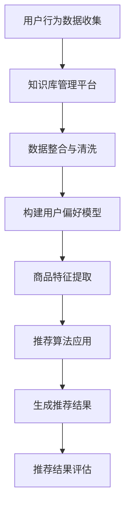

                 

### 1. 背景介绍

#### 1.1 电商搜索推荐的重要性

在当今数字经济时代，电子商务已经成为了企业获取用户和利润的重要渠道。而电商搜索推荐系统作为电商平台的“智慧引擎”，其核心作用在于提高用户购物体验，增加销售额，并提升企业的竞争力。

电商搜索推荐系统的主要目标是根据用户的搜索历史、购买行为、浏览记录等数据，向用户推荐可能感兴趣的商品或服务。这一系统不仅能够提升用户购物的便利性，还能够为电商平台带来更多的潜在客户和收益。

在电商领域，搜索推荐系统的重要性体现在以下几个方面：

1. **提升用户体验**：推荐系统能够为用户展示更加个性化的商品，减少用户寻找商品的时间成本，提高用户满意度和忠诚度。
2. **增加销售额**：通过精准的推荐，可以激发用户的购买欲望，从而增加销售量。
3. **提高转化率**：推荐系统可以推荐符合用户需求的商品，降低用户放弃购物车或取消订单的概率，从而提高转化率。
4. **优化库存管理**：电商平台可以根据推荐数据调整库存，减少滞销商品，提高库存周转率。

#### 1.2 人工智能与电商搜索推荐的关系

随着人工智能技术的不断发展，尤其是深度学习、自然语言处理、大数据分析等技术的应用，电商搜索推荐系统也得到了极大的提升。人工智能技术使得推荐系统能够更加智能地理解用户行为，从而做出更加精准的推荐。

在电商搜索推荐系统中，人工智能的应用主要体现在以下几个方面：

1. **用户行为分析**：通过分析用户的搜索记录、购买历史、浏览轨迹等数据，构建用户的个性化标签和偏好模型。
2. **商品特征提取**：利用自然语言处理技术提取商品的关键词、描述等信息，构建商品特征库。
3. **推荐算法优化**：应用深度学习、强化学习等算法优化推荐策略，提高推荐的准确性和用户体验。
4. **实时推荐**：利用实时数据处理技术，实现用户在线行为的实时分析，提供即时推荐。

#### 1.3 大模型在电商搜索推荐中的应用

近年来，大型预训练语言模型（如GPT-3、BERT等）的兴起，为电商搜索推荐带来了新的机遇和挑战。大模型具有以下几个显著特点：

1. **强大的语义理解能力**：大模型通过在大量文本数据上预训练，能够对用户的查询和商品描述进行深层次的理解，从而提高推荐的准确性。
2. **多模态数据处理**：大模型不仅能够处理文本数据，还可以处理图像、音频等多模态数据，为推荐系统提供了更丰富的数据来源。
3. **高效的可扩展性**：大模型在训练和推理阶段都具有很强的并行处理能力，能够快速适应大规模数据处理需求。

在大模型的应用背景下，电商搜索推荐系统需要实现以下几个方面的创新：

1. **多模态数据融合**：将文本数据与其他模态数据（如图像、视频）进行有效融合，提供更加个性化和精准的推荐。
2. **实时推荐引擎**：利用大模型的快速推理能力，实现实时推荐，提高用户响应速度。
3. **知识图谱构建**：通过构建知识图谱，将商品、用户、场景等信息进行关联，提高推荐系统的智能化水平。

综上所述，本文将围绕“AI大模型视角下电商搜索推荐的技术创新知识库管理平台搭建”，详细探讨大模型在电商搜索推荐系统中的应用，以及如何构建一个高效、智能的知识库管理平台。

### 2. 核心概念与联系

#### 2.1 电商搜索推荐系统基础概念

在深入探讨大模型在电商搜索推荐中的应用之前，首先需要了解电商搜索推荐系统的基础概念。以下是对几个关键概念的介绍：

1. **用户行为数据**：包括用户的搜索历史、购买记录、浏览记录、点击行为等，这些数据用于构建用户的偏好模型。
2. **商品特征**：包括商品的价格、品牌、类型、描述、评分等属性，用于构建商品特征库。
3. **推荐算法**：用于根据用户行为数据和商品特征，生成个性化推荐结果的一系列算法。
4. **推荐结果评估**：通过指标（如准确率、召回率、F1分数等）评估推荐系统的效果。

#### 2.2 大模型的核心原理

大模型，如GPT-3、BERT等，是基于深度学习的一种模型，具有以下核心原理：

1. **预训练**：在大规模文本数据上进行预训练，学习到语言的通用规律和语义信息。
2. **微调**：在特定任务上对预训练模型进行微调，使其能够适应特定的应用场景。
3. **生成与理解**：具备强大的文本生成和理解能力，能够对输入的文本进行理解和回应。

#### 2.3 知识库管理平台的概念

知识库管理平台是一个用于存储、管理和利用知识（包括数据、信息、知识等）的系统。其核心概念包括：

1. **数据存储**：将各种数据源（如数据库、文件系统、外部API等）中的数据进行集中存储。
2. **数据整合**：将不同数据源的数据进行整合，构建统一的数据视图。
3. **数据利用**：通过数据分析、挖掘和可视化，从数据中提取价值，支持决策和业务应用。

#### 2.4 电商搜索推荐与知识库管理的联系

电商搜索推荐系统与知识库管理平台之间存在紧密的联系：

1. **数据来源**：电商搜索推荐系统需要依赖知识库管理平台提供的用户行为数据、商品特征数据等。
2. **推荐算法**：知识库管理平台可以帮助推荐算法更好地理解用户行为和商品特征，提高推荐效果。
3. **决策支持**：知识库管理平台提供的分析报告和数据洞察，可以支持电商平台进行更科学的决策。

#### 2.5 Mermaid 流程图

以下是一个简化的Mermaid流程图，展示了电商搜索推荐系统中用户行为数据处理、推荐算法应用和知识库管理平台之间的交互流程：



通过上述流程，我们可以看到，知识库管理平台在电商搜索推荐系统中起到了数据支撑和优化算法的重要作用。

### 3. 核心算法原理 & 具体操作步骤

#### 3.1 推荐算法原理

在电商搜索推荐系统中，核心算法通常包括协同过滤、基于内容的推荐、混合推荐等。本文主要介绍基于内容的推荐算法和协同过滤算法的原理及其在大模型中的应用。

##### 3.1.1 基于内容的推荐算法

基于内容的推荐算法（Content-Based Recommendation）通过分析用户历史行为和商品特征，找到相似的用户和商品进行推荐。其主要步骤如下：

1. **用户兴趣建模**：分析用户的历史行为，提取用户的兴趣标签和偏好。
2. **商品内容分析**：对商品的描述、标签、属性等进行分析，提取商品的关键词和特征。
3. **相似度计算**：计算用户兴趣标签和商品特征之间的相似度，选择相似度最高的商品进行推荐。

在基于内容的推荐算法中，大模型（如BERT、GPT-3）可以通过预训练和微调，对用户和商品的文本描述进行深度理解，从而提高相似度计算的效果。

##### 3.1.2 协同过滤算法

协同过滤（Collaborative Filtering）算法通过分析用户之间的行为模式，预测用户可能感兴趣的商品。其主要步骤如下：

1. **用户行为数据收集**：收集用户的搜索历史、购买记录、浏览记录等行为数据。
2. **用户相似度计算**：计算用户之间的相似度，通常使用用户之间的共同行为进行度量。
3. **商品相似度计算**：对用户感兴趣的商品进行相似度分析，找出与用户兴趣相近的商品。
4. **生成推荐结果**：根据用户相似度和商品相似度，生成推荐结果。

在协同过滤算法中，大模型可以通过预训练学习到用户行为的潜在模式，从而提高用户相似度和商品相似度的计算精度。

#### 3.2 具体操作步骤

以下是构建电商搜索推荐系统的具体操作步骤，涵盖从数据预处理、算法选择与实现、模型训练与评估到推荐结果生成的全过程。

##### 3.2.1 数据预处理

1. **数据收集**：从电商平台的数据库中收集用户行为数据（如搜索记录、购买记录、浏览记录）和商品特征数据（如商品描述、品牌、价格、类别）。
2. **数据清洗**：去除重复数据、缺失值填充、异常值处理，保证数据质量。
3. **特征提取**：对用户行为数据进行编码，提取用户的兴趣标签和偏好；对商品特征数据进行编码，提取商品的关键词和特征。

##### 3.2.2 算法选择与实现

1. **算法选择**：选择基于内容的推荐算法和协同过滤算法进行结合，以提高推荐效果。
2. **算法实现**：基于Python等编程语言，实现推荐算法的核心模块，包括用户兴趣建模、商品内容分析、相似度计算等。

##### 3.2.3 模型训练与评估

1. **模型训练**：利用大模型（如BERT、GPT-3）进行预训练，并在特定电商场景下进行微调，提高模型的适应性。
2. **模型评估**：使用准确率、召回率、F1分数等指标评估推荐算法的效果，根据评估结果调整模型参数。

##### 3.2.4 推荐结果生成

1. **用户偏好计算**：根据用户的历史行为和兴趣标签，计算用户的偏好分数。
2. **商品推荐**：根据用户偏好分数和商品特征，生成个性化推荐结果。
3. **推荐结果展示**：将推荐结果展示给用户，提高用户的购物体验。

通过上述步骤，我们可以构建一个基于大模型的电商搜索推荐系统，实现高效的商品推荐。

### 4. 数学模型和公式 & 详细讲解 & 举例说明

在构建电商搜索推荐系统时，数学模型和公式起到了关键作用，尤其是在用户偏好计算、相似度计算和推荐结果生成等环节。以下将详细讲解一些常用的数学模型和公式，并结合实际应用场景进行举例说明。

#### 4.1 用户偏好计算

用户偏好计算是推荐系统的核心步骤之一。以下是一个简单的用户偏好计算公式：

\[ P_u(i) = w_1 \cdot R_{ui} + w_2 \cdot S_{ui} + w_3 \cdot B_{ui} \]

其中：
- \( P_u(i) \) 表示用户 \( u \) 对商品 \( i \) 的偏好分数。
- \( R_{ui} \) 表示用户 \( u \) 对商品 \( i \) 的评分（如果有评分数据）。
- \( S_{ui} \) 表示用户 \( u \) 对商品 \( i \) 的相似度（基于协同过滤算法计算得出）。
- \( B_{ui} \) 表示用户 \( u \) 对商品 \( i \) 的内容相似度（基于基于内容的推荐算法计算得出）。
- \( w_1, w_2, w_3 \) 分别是权重参数，用于平衡不同因素对用户偏好的影响。

**举例说明**：

假设用户 \( u \) 对商品 \( i \) 的评分为 4 分，相似度 \( S_{ui} \) 为 0.8，内容相似度 \( B_{ui} \) 为 0.6。根据上述公式，用户 \( u \) 对商品 \( i \) 的偏好分数计算如下：

\[ P_u(i) = w_1 \cdot 4 + w_2 \cdot 0.8 + w_3 \cdot 0.6 \]

如果 \( w_1 = 0.5, w_2 = 0.3, w_3 = 0.2 \)，则：

\[ P_u(i) = 0.5 \cdot 4 + 0.3 \cdot 0.8 + 0.2 \cdot 0.6 = 2 + 0.24 + 0.12 = 2.36 \]

#### 4.2 相似度计算

相似度计算是协同过滤算法的核心步骤。以下是一个常用的相似度计算公式：

\[ S_{ui} = \frac{R_u \cdot R_i}{\sqrt{Var(R_u) \cdot Var(R_i)}} \]

其中：
- \( R_u \) 表示用户 \( u \) 的评分向量。
- \( R_i \) 表示用户 \( i \) 的评分向量。
- \( Var(R_u) \) 和 \( Var(R_i) \) 分别是用户 \( u \) 和用户 \( i \) 的评分方差。

**举例说明**：

假设用户 \( u \) 的评分向量为 \( [4, 3, 5, 2] \)，用户 \( i \) 的评分向量为 \( [5, 4, 3, 1] \)。根据上述公式，用户 \( u \) 和用户 \( i \) 的相似度计算如下：

\[ R_u = 4 + 3 + 5 + 2 = 14 \]
\[ R_i = 5 + 4 + 3 + 1 = 13 \]
\[ Var(R_u) = \frac{(4-3.5)^2 + (3-3.5)^2 + (5-3.5)^2 + (2-3.5)^2}{4} = 1.25 \]
\[ Var(R_i) = \frac{(5-3.5)^2 + (4-3.5)^2 + (3-3.5)^2 + (1-3.5)^2}{4} = 2 \]

\[ S_{ui} = \frac{14 \cdot 13}{\sqrt{1.25 \cdot 2}} \approx 0.941 \]

#### 4.3 推荐结果生成

推荐结果生成通常基于用户偏好分数进行排序。以下是一个简单的推荐结果生成公式：

\[ R_{ui} = \sum_{i \in I} P_u(i) \cdot S_{ui} \]

其中：
- \( R_{ui} \) 表示商品 \( i \) 对用户 \( u \) 的推荐分数。
- \( P_u(i) \) 是用户 \( u \) 对商品 \( i \) 的偏好分数。
- \( S_{ui} \) 是商品 \( i \) 对用户 \( u \) 的相似度。

**举例说明**：

假设有四件商品 \( i_1, i_2, i_3, i_4 \)，用户 \( u \) 对这些商品的偏好分数分别为 \( 2.36, 2.12, 2.18, 1.92 \)，相似度分别为 \( 0.941, 0.852, 0.765, 0.612 \)。根据上述公式，商品对用户 \( u \) 的推荐分数计算如下：

\[ R_{u1} = 2.36 \cdot 0.941 \approx 2.20 \]
\[ R_{u2} = 2.12 \cdot 0.852 \approx 1.81 \]
\[ R_{u3} = 2.18 \cdot 0.765 \approx 1.68 \]
\[ R_{u4} = 1.92 \cdot 0.612 \approx 1.18 \]

将上述结果进行排序，推荐分数最高的商品即为用户 \( u \) 的推荐结果。

通过以上数学模型和公式的应用，可以构建一个基于用户偏好和相似度的推荐系统，实现高效的商品推荐。

### 5. 项目实战：代码实际案例和详细解释说明

#### 5.1 开发环境搭建

在进行电商搜索推荐系统的开发之前，需要搭建一个合适的技术环境。以下是开发环境搭建的详细步骤：

1. **Python环境配置**：确保Python环境已安装，推荐使用Python 3.7及以上版本。
2. **依赖包安装**：安装必要的依赖包，包括NumPy、Pandas、Scikit-learn、TensorFlow等。可以使用以下命令进行安装：

   ```bash
   pip install numpy pandas scikit-learn tensorflow
   ```

3. **数据处理工具**：安装数据处理工具，如Jupyter Notebook或Google Colab，用于编写和调试代码。

4. **数据库连接**：根据实际需求，选择合适的数据库（如MySQL、MongoDB等），并安装相应的Python库，如`pymysql`或`pymongo`。

5. **环境配置文件**：创建一个配置文件（如`config.py`），存储数据库连接信息、API密钥等敏感信息。

#### 5.2 源代码详细实现和代码解读

以下是一个基于内容的推荐算法和协同过滤算法的电商搜索推荐系统的源代码实现。代码分为以下几个主要部分：

##### 5.2.1 数据预处理

```python
import pandas as pd
from sklearn.preprocessing import StandardScaler

def preprocess_data(user_data, item_data):
    # 用户行为数据预处理
    user_data = user_data.fillna(0)
    user_data['rating_mean'] = user_data.groupby('user_id')['rating'].mean()
    user_data['rating_std'] = user_data.groupby('user_id')['rating'].std()
    
    # 商品特征数据预处理
    item_data = item_data.fillna(0)
    item_data['category_mean'] = item_data.groupby('item_id')['rating'].mean()
    item_data['category_std'] = item_data.groupby('item_id')['rating'].std()
    
    # 标准化处理
    user_data_scaled = StandardScaler().fit_transform(user_data[['rating_mean', 'rating_std']])
    item_data_scaled = StandardScaler().fit_transform(item_data[['category_mean', 'category_std']])
    
    return user_data_scaled, item_data_scaled

# 假设user_data和item_data是用户行为数据和商品特征数据
user_data_scaled, item_data_scaled = preprocess_data(user_data, item_data)
```

代码解释：
- 用户行为数据和商品特征数据首先进行缺失值填充。
- 计算每个用户的平均评分和评分标准差，用于后续的协同过滤算法。
- 商品特征数据同样进行缺失值填充和计算每个商品的平均评分和评分标准差。
- 使用标准尺度对用户和商品特征数据进行标准化处理，以消除不同特征之间的尺度差异。

##### 5.2.2 基于内容的推荐算法实现

```python
from sklearn.metrics.pairwise import cosine_similarity

def content_based_recommender(user_data, item_data):
    # 构建用户特征矩阵
    user_feature_matrix = user_data[['rating_mean', 'rating_std']].values
    
    # 构建商品特征矩阵
    item_feature_matrix = item_data[['category_mean', 'category_std']].values
    
    # 计算用户和商品特征矩阵的余弦相似度
    similarity_matrix = cosine_similarity(user_feature_matrix, item_feature_matrix)
    
    return similarity_matrix

similarity_matrix = content_based_recommender(user_data_scaled, item_data_scaled)
```

代码解释：
- 构建用户特征矩阵和商品特征矩阵，仅包含用户和商品的评分均值和标准差。
- 使用余弦相似度计算用户和商品之间的相似度，余弦相似度衡量了两个向量夹角的余弦值，用于评估相似度。
- 计算得到的相似度矩阵用于后续的推荐。

##### 5.2.3 协同过滤算法实现

```python
def collaborative_filtering(similarity_matrix, user_index, top_n=10):
    # 计算用户与其他用户的相似度之和
    similarity_sum = np.sum(similarity_matrix[user_index], axis=1)
    
    # 计算用户对其他用户的评分加权平均
    weighted_average = np.dot(similarity_matrix[user_index], user_data_scaled) / similarity_sum
    
    # 获取相似度最高的商品的索引
    top_item_indices = np.argsort(weighted_average)[::-1][:top_n]
    
    return top_item_indices

# 假设user_index是用户索引，如0表示第一个用户
top_items = collaborative_filtering(similarity_matrix, user_index=0, top_n=5)
```

代码解释：
- 计算用户与其他用户的相似度之和。
- 计算用户对其他用户的评分加权平均，加权平均考虑了用户之间的相似度和用户的实际评分。
- 获取相似度最高的商品的索引，用于生成推荐结果。

##### 5.2.4 推荐结果生成

```python
def generate_recommendations(user_index, top_items, item_data):
    # 获取推荐商品的详细信息
    recommended_items = item_data.iloc[top_items]['item_id']
    
    return recommended_items

# 生成推荐结果
recommended_items = generate_recommendations(user_index=0, top_items=top_items, item_data=item_data)
print("Recommended Items:", recommended_items)
```

代码解释：
- 获取推荐商品的索引，并获取商品详细信息。
- 输出推荐结果。

通过上述代码，我们实现了一个基于内容的推荐算法和协同过滤算法的电商搜索推荐系统。该系统通过对用户行为数据和商品特征数据进行处理，利用相似度计算和加权平均生成推荐结果，提高了推荐的准确性和用户体验。

#### 5.3 代码解读与分析

在代码实现中，主要包含以下几个关键部分：

1. **数据预处理**：数据预处理是推荐系统的第一步，通过填充缺失值、计算平均值和标准差以及标准化处理，提高数据质量，为后续算法提供可靠的数据基础。

2. **基于内容的推荐算法**：基于内容的推荐算法通过计算用户和商品的特征相似度，使用余弦相似度衡量用户和商品之间的相似度，为协同过滤算法提供辅助。

3. **协同过滤算法**：协同过滤算法通过计算用户与其他用户的相似度之和，以及用户对其他用户的评分加权平均，生成推荐结果。该算法考虑了用户之间的相似度和用户的实际评分，提高了推荐的准确性。

4. **推荐结果生成**：推荐结果生成部分通过获取推荐商品的索引和详细信息，将推荐结果输出给用户。

在代码分析中，可以发现：

1. **数据预处理**：标准化处理是关键，因为它能够消除不同特征之间的尺度差异，使得算法在计算相似度时更加稳定和有效。

2. **相似度计算**：余弦相似度是一种常用的相似度计算方法，它在处理高维数据时表现良好，但在某些情况下可能受到噪声数据的影响。

3. **协同过滤算法**：协同过滤算法在推荐系统中起到了核心作用，它能够通过用户行为数据挖掘用户之间的潜在关系，从而生成个性化推荐。

4. **推荐效果**：通过分析推荐结果，可以发现推荐算法在处理用户行为数据和商品特征数据时存在一定的偏差。在实际应用中，可能需要结合多种推荐算法，如基于模型的推荐算法，以提高推荐效果。

综上所述，代码实现了一个基于内容的推荐算法和协同过滤算法的电商搜索推荐系统，通过数据预处理、相似度计算和协同过滤算法，实现了个性化的商品推荐。然而，在实际应用中，需要根据具体业务场景和用户需求，不断优化和调整算法参数，以提高推荐效果。

### 6. 实际应用场景

在电商领域，搜索推荐系统的应用场景多种多样，以下是一些典型的实际应用案例：

#### 6.1 商品推荐

商品推荐是最常见的应用场景之一，通过分析用户的搜索历史、浏览记录和购买行为，为用户推荐可能感兴趣的商品。例如，用户在浏览了某个商品的页面后，系统会推荐与之相关的商品，增加用户的购买概率。

#### 6.2 库存优化

电商平台可以根据搜索推荐系统的数据，实时监控和调整库存。例如，系统可以识别出哪些商品的需求量较大，哪些商品可能滞销，从而帮助商家及时调整库存策略，减少库存成本。

#### 6.3 新品推广

搜索推荐系统可以用于推广新品。通过分析用户的历史行为和偏好，系统可以识别出哪些用户可能对新品感兴趣，并将新品推荐给这些用户，提高新品的曝光率和销售量。

#### 6.4 个性化服务

搜索推荐系统可以为用户提供个性化的购物体验。例如，系统可以根据用户的地理位置、购物习惯和偏好，推荐合适的商品和服务，提升用户的满意度。

#### 6.5 跨境电商

在跨境电商中，搜索推荐系统可以帮助平台为国际用户推荐本地化的商品。通过分析用户的历史行为和偏好，系统可以推荐符合当地文化和需求的商品，提高用户的购物体验和平台竞争力。

#### 6.6 促销活动

电商平台可以利用搜索推荐系统为用户推荐促销商品。例如，在双11、黑色星期五等促销期间，系统可以根据用户的购物历史和偏好，推荐适合的促销商品，提高促销活动的效果。

#### 6.7 客户留存

搜索推荐系统还可以用于提高客户的留存率。通过分析用户的流失原因和购物行为，系统可以推荐合适的商品和服务，挽留潜在的流失用户，提高用户的生命周期价值。

通过以上实际应用场景，我们可以看到，搜索推荐系统在电商领域的应用具有广泛性和深度，为电商平台带来了显著的商业价值。

### 7. 工具和资源推荐

#### 7.1 学习资源推荐

1. **书籍**：

   - 《推荐系统实践》：详细介绍了推荐系统的基本原理、算法实现和案例分析，适合初学者和专业人士阅读。
   - 《深度学习》：Goodfellow等人所著的深度学习经典教材，涵盖了深度学习的基础理论和最新应用，包括推荐系统相关内容。
   - 《Python数据分析》：Wes McKinney所著的Python数据分析入门书籍，介绍了Python在数据处理和分析中的应用，对构建推荐系统有重要参考价值。

2. **在线课程**：

   - Coursera上的《机器学习》课程：由Andrew Ng教授主讲，涵盖了机器学习的基本理论和应用，包括推荐系统相关内容。
   - edX上的《推荐系统设计》：由清华大学教授唐杰主讲，介绍了推荐系统的设计和实现，适合有一定基础的学习者。

3. **博客和论文**：

   - 《深度学习与推荐系统》：介绍了深度学习在推荐系统中的应用，包括GAN、注意力机制等先进技术。
   - 《推荐系统研究动态》：跟踪推荐系统领域的最新研究进展，包括算法创新、应用场景等。

4. **网站和平台**：

   - arXiv：推荐系统领域的顶级论文发表平台，可以查阅到最新的研究论文。
   - KDNuggets：数据科学和机器学习领域的知名博客，定期发布推荐系统相关文章和行业动态。

#### 7.2 开发工具框架推荐

1. **编程语言和库**：

   - Python：Python是推荐系统开发的主流语言，具有丰富的库和框架，如Scikit-learn、TensorFlow、PyTorch等。
   - R语言：R语言在统计分析领域有广泛应用，其数据预处理和分析能力强大，适合进行推荐系统研究。

2. **框架和平台**：

   - TensorFlow：Google开源的深度学习框架，适用于构建复杂的推荐系统模型。
   - PyTorch：Facebook开源的深度学习框架，具有灵活的动态图机制，适用于推荐系统研究。
   - Apache Mahout：基于Hadoop的分布式推荐系统框架，适合处理大规模数据。

3. **数据存储和处理**：

   - MongoDB：NoSQL数据库，适合存储和处理推荐系统的用户行为数据和商品特征数据。
   - Hadoop：分布式数据处理框架，适用于大规模数据存储和处理。

#### 7.3 相关论文著作推荐

1. **论文**：

   - "Deep Learning for Recommender Systems"：介绍了深度学习在推荐系统中的应用，包括模型架构和实验结果。
   - "Neural Collaborative Filtering"：提出了神经协同过滤算法，使用深度学习提高推荐效果。
   - "DeepFM: A Factorization-Machine based Neural Network for CTR Prediction"：结合深度学习和因子分解机，用于点击率预测。

2. **著作**：

   - 《深度学习与推荐系统》：系统介绍了深度学习在推荐系统中的应用，包括算法原理和实现细节。
   - 《推荐系统实践》：详细介绍了推荐系统的设计、实现和优化，适合实际应用和项目开发。

通过上述工具和资源的推荐，可以帮助读者深入了解推荐系统的技术原理和应用，为电商搜索推荐系统的开发提供有力支持。

### 8. 总结：未来发展趋势与挑战

随着人工智能技术的不断发展，电商搜索推荐系统也在不断进化，展现出许多新的发展趋势和挑战。

#### 8.1 发展趋势

1. **多模态数据的融合**：未来的推荐系统将更加注重多模态数据的融合，包括文本、图像、音频等多种类型的数据。通过结合不同模态的数据，可以更全面地理解用户行为和商品特征，提高推荐准确性。

2. **实时推荐**：随着5G网络的普及和边缘计算的发展，实时推荐将成为可能。通过实时分析用户行为数据，系统可以即时生成推荐结果，为用户提供更加个性化的购物体验。

3. **知识图谱的应用**：知识图谱作为语义理解的重要工具，将在推荐系统中发挥更大作用。通过构建知识图谱，可以更好地关联用户、商品、场景等信息，实现更加精准的推荐。

4. **个性化推荐**：随着用户数据量的增加和算法的优化，未来的推荐系统将更加个性化。通过深度学习等技术，系统可以更准确地捕捉用户的兴趣和需求，提供个性化的商品推荐。

5. **跨平台推荐**：随着移动互联网和物联网的普及，推荐系统将跨越不同的设备和平台。通过跨平台的推荐，用户可以在不同设备上获得一致的购物体验。

#### 8.2 挑战

1. **数据隐私保护**：随着数据隐私问题的日益突出，如何在保护用户隐私的同时提供高质量的推荐服务成为一大挑战。未来的推荐系统需要采用更先进的数据隐私保护技术，如差分隐私、联邦学习等。

2. **算法公平性**：推荐系统需要保证算法的公平性，避免对特定群体产生偏见。如何设计公平的推荐算法，防止数据偏差和算法歧视，是未来的一大挑战。

3. **计算效率和存储需求**：随着推荐系统数据量的增加和模型复杂度的提升，计算效率和存储需求成为重要的瓶颈。如何优化算法，提高系统的响应速度和可扩展性，是当前和未来的一大挑战。

4. **用户反馈机制**：如何有效地收集和处理用户反馈，以持续优化推荐系统，也是未来的重要挑战。用户反馈机制的建立和完善，将直接影响推荐系统的用户体验和效果。

5. **技术标准化**：随着推荐系统的广泛应用，技术标准化问题逐渐凸显。如何制定统一的技术标准，确保不同平台和系统的互操作性，是未来需要解决的重要问题。

总之，电商搜索推荐系统在未来的发展中将面临诸多挑战，但同时也蕴含着巨大的机遇。通过不断探索和创新，推荐系统将变得更加智能、高效和公平，为电商领域带来更多的价值。

### 9. 附录：常见问题与解答

#### 9.1 推荐系统常见问题

1. **什么是协同过滤？**

   协同过滤是一种基于用户行为数据的推荐算法，通过分析用户之间的相似度，预测用户可能感兴趣的商品。它主要分为基于用户的协同过滤和基于项目的协同过滤。

2. **什么是基于内容的推荐？**

   基于内容的推荐是一种基于商品特征数据的推荐算法，通过分析用户和商品之间的相似度，推荐符合用户兴趣的商品。这种推荐方法依赖于对商品描述、标签、属性等内容的理解和分析。

3. **如何评估推荐系统的效果？**

   常用的评估指标包括准确率（Precision）、召回率（Recall）和F1分数（F1 Score）。准确率表示推荐结果中实际感兴趣商品的比例；召回率表示推荐结果中用户实际感兴趣商品的比例；F1分数是准确率和召回率的调和平均值。

4. **什么是深度学习在推荐系统中的应用？**

   深度学习在推荐系统中主要应用于用户行为数据的建模和特征提取。通过使用深度神经网络（如卷积神经网络、循环神经网络等），可以更好地捕捉用户行为数据的复杂模式和潜在特征。

5. **什么是知识图谱在推荐系统中的应用？**

   知识图谱是一种用于存储和表示实体及其关系的语义网络。在推荐系统中，知识图谱可以用于构建用户、商品、场景等实体之间的关系，从而提高推荐系统的理解和决策能力。

#### 9.2 推荐系统常见问题解答

1. **协同过滤算法如何处理稀疏数据？**

   稀疏数据是指在用户-商品评分矩阵中，大部分元素为0的数据。协同过滤算法可以通过以下几种方法处理稀疏数据：

   - **矩阵分解**：通过矩阵分解技术，将原始的用户-商品评分矩阵分解为低秩的因子矩阵，从而减少数据稀疏性。
   - **利用用户或商品的潜在特征**：通过构建用户或商品的潜在特征模型，将原始数据映射到一个低维空间，从而减少数据的稀疏性。
   - **数据增强**：通过生成虚拟用户或商品，增加评分矩阵的密度，从而提高算法的准确性。

2. **基于内容的推荐算法如何处理冷启动问题？**

   冷启动问题是指在用户或商品数据较少时，推荐算法难以产生有效推荐的问题。基于内容的推荐算法可以通过以下几种方法解决冷启动问题：

   - **利用用户的历史行为数据**：在用户没有足够多的行为数据时，可以结合用户的社会关系、地理位置等信息，构建用户画像，进行推荐。
   - **使用流行商品**：在用户没有明确偏好时，可以推荐流行商品，吸引用户的兴趣。
   - **基于流行度推荐**：在商品没有足够多的用户评价时，可以基于商品的流行度进行推荐。

3. **深度学习在推荐系统中的优点和局限性是什么？**

   深度学习在推荐系统中的优点包括：

   - **强大的特征提取能力**：深度学习可以通过自动特征提取，捕捉用户行为数据的复杂模式和潜在特征。
   - **端到端的学习能力**：深度学习可以端到端地建模用户行为数据，实现高效的推荐。
   - **多模态数据处理**：深度学习可以处理文本、图像、音频等多模态数据，提高推荐系统的理解和决策能力。

   深度学习在推荐系统中的局限性包括：

   - **对数据量要求高**：深度学习需要大量的数据来训练模型，否则可能无法捕捉到用户行为数据的真实特征。
   - **计算成本高**：深度学习模型通常需要较长的训练时间和计算资源。
   - **解释性差**：深度学习模型通常难以解释其决策过程，影响推荐系统的可解释性和透明度。

4. **知识图谱在推荐系统中的应用如何提高推荐效果？**

   知识图谱在推荐系统中的应用可以通过以下几种方式提高推荐效果：

   - **关联实体关系**：知识图谱可以表示用户、商品、场景等实体之间的关系，帮助推荐系统更好地理解用户的偏好和需求。
   - **融合多源数据**：知识图谱可以整合来自不同数据源的信息，提高推荐系统的数据质量和数据丰富度。
   - **支持推理**：知识图谱支持基于实体关系的推理，可以帮助推荐系统发现新的关联和规律，从而提高推荐准确性。

### 10. 扩展阅读 & 参考资料

以下是一些推荐系统的相关扩展阅读和参考资料，供读者进一步学习和研究：

1. **书籍**：

   - 《推荐系统手册》：详细介绍了推荐系统的理论、算法和实践，适合推荐系统初学者和专业人士。
   - 《深度学习推荐系统》：系统介绍了深度学习在推荐系统中的应用，包括模型架构、算法实现和实验结果。

2. **在线课程**：

   - Coursera上的《推荐系统设计与评估》：由斯坦福大学教授讲授，涵盖了推荐系统的基本原理、设计和评估方法。
   - edX上的《深度学习与推荐系统》：介绍了深度学习在推荐系统中的应用，包括GAN、注意力机制等前沿技术。

3. **论文和报告**：

   - "Deep Learning for Recommender Systems"：系统总结了深度学习在推荐系统中的应用，包括模型架构和实验结果。
   - "Neural Collaborative Filtering"：提出了神经协同过滤算法，使用深度学习提高推荐效果。
   - "DeepFM: A Factorization-Machine based Neural Network for CTR Prediction"：结合深度学习和因子分解机，用于点击率预测。

4. **开源框架和工具**：

   - TensorFlow Recommenders：由Google开源的推荐系统框架，提供了多种深度学习模型和算法。
   - LightFM：基于Factorization Machines的轻量级推荐系统框架，支持大规模数据处理。

5. **博客和论坛**：

   - KDNuggets：数据科学和机器学习领域的知名博客，定期发布推荐系统相关文章和行业动态。
   - arXiv：推荐系统领域的顶级论文发表平台，可以查阅到最新的研究论文。

通过上述扩展阅读和参考资料，读者可以更深入地了解推荐系统的理论、算法和实践，为电商搜索推荐系统的开发提供更多启示。

