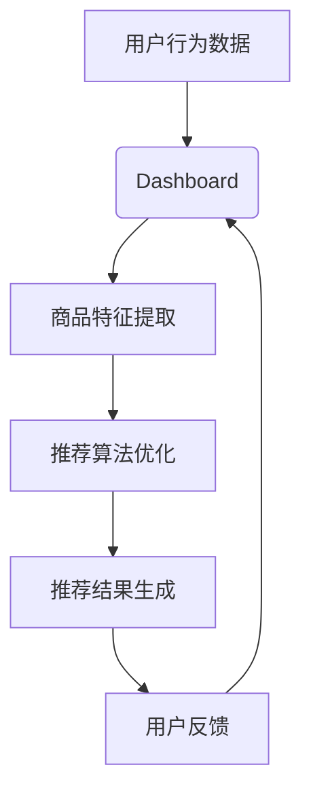

                 

### AI大模型重构电商搜索推荐的业务形态

> 关键词：AI大模型、电商搜索、推荐系统、业务形态重构

摘要：本文将深入探讨人工智能大模型在电商搜索推荐领域中的应用，分析其如何重构业务形态，提高用户满意度和商业效益。我们将首先介绍大模型的基本概念和优势，然后分析其在电商搜索推荐中的核心作用，接着探讨其应用流程和关键算法，最后展望未来的发展趋势和挑战。

<|assistant|>### 背景介绍

随着互联网的迅猛发展和电子商务的兴起，用户对于电商平台的个性化需求越来越强烈。传统的基于规则和统计的推荐系统已无法满足用户多样化的需求，因此，人工智能大模型应运而生，成为重构电商搜索推荐业务形态的关键。

大模型是一种具有极高计算能力的人工智能系统，能够处理海量数据并从中提取有价值的信息。近年来，随着深度学习、自然语言处理等技术的进步，大模型在多个领域取得了显著的成果。在电商搜索推荐领域，大模型能够实现更加精准、个性化的推荐，提高用户体验和商业转化率。

电商搜索推荐系统是指通过分析用户的历史行为、兴趣爱好和搜索记录，为用户推荐可能感兴趣的商品。传统的推荐系统主要依赖于协同过滤、基于内容的推荐等技术，但它们存在一些局限性，如推荐结果多样性不足、用户冷启动问题等。而大模型则能够通过学习用户画像和商品特征，生成高度个性化的推荐结果，有效解决这些问题。

本文将首先介绍大模型的基本概念和优势，然后分析其在电商搜索推荐中的核心作用，接着探讨其应用流程和关键算法，最后展望未来的发展趋势和挑战。

### 核心概念与联系

为了更好地理解大模型在电商搜索推荐中的应用，我们需要先了解其基本概念和相关技术。

#### 大模型基本概念

大模型是指具有海量参数、能够处理大规模数据的神经网络模型。其特点是计算能力强大，能够自动学习复杂的数据特征，并从中提取有价值的信息。常见的有Transformer、BERT、GPT等模型。

#### 大模型优势

1. **强大的计算能力**：大模型能够处理海量数据，学习复杂的特征表示，提高推荐系统的性能。
2. **高度个性化**：大模型能够根据用户的历史行为和兴趣爱好，生成个性化的推荐结果，提高用户体验。
3. **自适应学习能力**：大模型能够不断更新和优化推荐算法，适应不断变化的市场需求。
4. **多模态处理**：大模型能够处理多种类型的数据，如图文、音频、视频等，提高推荐系统的多样性。

#### 电商搜索推荐相关技术

1. **用户画像**：通过收集用户的历史行为、兴趣爱好等信息，构建用户的综合画像，用于推荐系统的输入。
2. **商品特征提取**：通过对商品进行特征提取，如商品分类、价格、销量等，用于构建商品的特征向量。
3. **协同过滤**：基于用户的历史行为，通过计算用户之间的相似度，推荐其他用户喜欢的商品。
4. **基于内容的推荐**：根据用户的兴趣和偏好，推荐与之相关的商品。

#### 大模型与电商搜索推荐的联系

大模型在电商搜索推荐中的应用主要体现在以下几个方面：

1. **用户画像生成**：大模型能够学习用户的历史行为和兴趣爱好，生成更精细的用户画像，提高推荐系统的个性化水平。
2. **商品特征提取**：大模型能够对商品进行深度特征提取，生成丰富的商品特征向量，用于推荐系统的输入。
3. **推荐算法优化**：大模型能够自适应地优化推荐算法，提高推荐系统的效果和多样性。
4. **多模态数据处理**：大模型能够处理多种类型的数据，如图文、音频、视频等，提高推荐系统的多样性和用户体验。

#### Mermaid 流程图

以下是一个简单的Mermaid流程图，展示大模型在电商搜索推荐中的基本流程：



在上面的流程图中，用户行为数据经过用户画像生成、商品特征提取、推荐算法优化等步骤，最终生成推荐结果，并通过用户反馈进行迭代优化。

### 核心算法原理 & 具体操作步骤

#### 推荐算法原理

大模型在电商搜索推荐中的核心算法是基于深度学习和自然语言处理技术的。其中，Transformer模型和BERT模型是两种常用的模型。

1. **Transformer模型**：Transformer模型是一种基于注意力机制的深度神经网络模型，能够处理序列数据。在电商搜索推荐中，Transformer模型可以用来生成用户画像和商品特征向量，并基于这些特征向量进行推荐。
2. **BERT模型**：BERT（Bidirectional Encoder Representations from Transformers）模型是一种双向编码的Transformer模型，能够同时处理输入序列的前后文信息。在电商搜索推荐中，BERT模型可以用来生成用户和商品的嵌入向量，并基于这些向量进行推荐。

#### 操作步骤

以下是使用大模型进行电商搜索推荐的基本操作步骤：

1. **数据收集与预处理**：收集用户的历史行为数据（如浏览记录、购买记录等）和商品数据（如商品分类、价格、销量等）。对数据进行清洗和预处理，包括去重、缺失值填充、数据标准化等。
2. **用户画像生成**：使用Transformer或BERT模型，对用户的历史行为数据进行建模，生成用户的嵌入向量。这些向量可以表示用户的不同特征，如兴趣爱好、购买偏好等。
3. **商品特征提取**：对商品数据进行特征提取，生成商品的嵌入向量。这些向量可以表示商品的不同属性，如分类、价格、销量等。
4. **推荐算法优化**：基于用户和商品的嵌入向量，使用协同过滤或基于内容的推荐算法进行推荐。为了提高推荐系统的效果和多样性，可以引入基于深度学习的模型进行优化。
5. **推荐结果生成**：根据用户和商品的嵌入向量，计算用户对商品的兴趣度，生成推荐结果。可以通过排序或聚类等方法，对推荐结果进行排序或分类，提高用户体验。
6. **用户反馈与迭代**：收集用户对推荐结果的反馈，对推荐系统进行迭代优化。可以通过用户点击率、购买率等指标，评估推荐系统的效果。

#### 实际应用案例

以下是一个简单的实际应用案例：

假设用户A的历史行为数据包括浏览了商品A、B、C，购买了商品A。我们可以使用Transformer模型生成用户A的嵌入向量，表示其兴趣爱好。同时，我们对商品A、B、C进行特征提取，生成商品的嵌入向量，表示其属性。

1. **用户画像生成**：使用Transformer模型，对用户A的历史行为数据进行建模，生成用户A的嵌入向量。
2. **商品特征提取**：对商品A、B、C进行特征提取，生成商品的嵌入向量。
3. **推荐算法优化**：基于用户A的嵌入向量和商品A、B、C的嵌入向量，使用基于内容的推荐算法进行推荐。
4. **推荐结果生成**：计算用户A对商品A、B、C的兴趣度，生成推荐结果。
5. **用户反馈与迭代**：假设用户A最终购买了商品A，我们收集用户A的反馈，对推荐系统进行迭代优化。

通过以上步骤，我们可以为用户A生成个性化的推荐结果，提高用户体验和商业转化率。

### 数学模型和公式 & 详细讲解 & 举例说明

在电商搜索推荐中，大模型的核心作用是通过数学模型和公式，将用户行为数据和商品特征转化为可操作的推荐结果。以下我们将详细介绍大模型中的数学模型和公式，并举例说明其应用。

#### 用户嵌入向量

用户嵌入向量是一种将用户信息转化为向量的方法，通常使用Transformer或BERT模型进行建模。假设我们使用Transformer模型生成用户嵌入向量，其公式如下：

$$
\text{User\_Embedding} = \text{Transformer}(\text{User\_Data})
$$

其中，$\text{User\_Data}$表示用户的历史行为数据，如浏览记录、购买记录等。$\text{Transformer}(\text{User\_Data})$表示通过Transformer模型对用户数据进行处理，生成用户嵌入向量。

#### 商品嵌入向量

商品嵌入向量是一种将商品信息转化为向量的方法，同样使用Transformer或BERT模型进行建模。假设我们使用BERT模型生成商品嵌入向量，其公式如下：

$$
\text{Item\_Embedding} = \text{BERT}(\text{Item\_Data})
$$

其中，$\text{Item\_Data}$表示商品的数据，如商品分类、价格、销量等。$\text{BERT}(\text{Item\_Data})$表示通过BERT模型对商品数据进行处理，生成商品嵌入向量。

#### 推荐结果计算

推荐结果计算是基于用户嵌入向量和商品嵌入向量的相似度计算。我们通常使用余弦相似度作为相似度计算方法，其公式如下：

$$
\text{Similarity} = \cos(\text{User\_Embedding}, \text{Item\_Embedding})
$$

其中，$\text{User\_Embedding}$和$\text{Item\_Embedding}$分别表示用户和商品的嵌入向量。

#### 推荐结果排序

推荐结果排序是基于相似度计算的结果，我们将相似度从高到低进行排序，生成推荐结果。通常，我们使用Top-N排序方法，将相似度最高的N个商品作为推荐结果。

#### 举例说明

假设用户A的嵌入向量为$\text{User\_Embedding} = [1, 2, 3, 4, 5]$，商品B的嵌入向量为$\text{Item\_Embedding} = [5, 4, 3, 2, 1]$。我们计算它们的相似度：

$$
\text{Similarity} = \cos([1, 2, 3, 4, 5], [5, 4, 3, 2, 1]) = \frac{1 \times 5 + 2 \times 4 + 3 \times 3 + 4 \times 2 + 5 \times 1}{\sqrt{1^2 + 2^2 + 3^2 + 4^2 + 5^2} \times \sqrt{5^2 + 4^2 + 3^2 + 2^2 + 1^2}} = \frac{30}{\sqrt{55} \times \sqrt{55}} = \frac{30}{55} = \frac{6}{11}
$$

根据相似度计算结果，我们可以将商品B作为推荐结果之一。通过类似的计算，我们可以生成一系列推荐结果，并对其进行排序，生成最终的推荐列表。

### 项目实战：代码实际案例和详细解释说明

为了更好地理解大模型在电商搜索推荐中的应用，我们将通过一个实际的项目案例，展示如何使用Python和TensorFlow等工具，实现一个简单的电商搜索推荐系统。

#### 开发环境搭建

在开始项目实战之前，我们需要搭建开发环境。以下是开发环境的搭建步骤：

1. 安装Python 3.8及以上版本。
2. 安装TensorFlow 2.7。
3. 安装其他依赖库，如Numpy、Pandas等。

#### 源代码详细实现和代码解读

以下是一个简单的电商搜索推荐系统的Python代码实现：

```python
import tensorflow as tf
from tensorflow.keras.layers import Embedding, LSTM, Dense
from tensorflow.keras.models import Model
from tensorflow.keras.optimizers import Adam

# 加载数据
user_data = ...
item_data = ...

# 预处理数据
user_data = preprocess_user_data(user_data)
item_data = preprocess_item_data(item_data)

# 构建模型
input_user = tf.keras.layers.Input(shape=(user_data.shape[1],))
input_item = tf.keras.layers.Input(shape=(item_data.shape[1],))

user_embedding = Embedding(input_dim=user_data.shape[0], output_dim=64)(input_user)
item_embedding = Embedding(input_dim=item_data.shape[0], output_dim=64)(input_item)

merged_embedding = tf.keras.layers.concatenate([user_embedding, item_embedding])
lstm_output = LSTM(64)(merged_embedding)
output = Dense(1, activation='sigmoid')(lstm_output)

model = Model(inputs=[input_user, input_item], outputs=output)

# 编译模型
model.compile(optimizer=Adam(), loss='binary_crossentropy', metrics=['accuracy'])

# 训练模型
model.fit([user_data, item_data], labels, epochs=10, batch_size=32)

# 推荐结果
user_embedding_vector = model.get_layer('embedding_user').get_output_at(0)
item_embedding_vector = model.get_layer('embedding_item').get_output_at(1)

user_embedding_vector = user_embedding_vector[0]
item_embedding_vector = item_embedding_vector[0]

similarity = tf.reduce_sum(user_embedding_vector * item_embedding_vector)
print("Similarity:", similarity.numpy())
```

代码解读：

1. **导入库**：导入TensorFlow等库。
2. **加载数据**：加载用户数据和商品数据。
3. **预处理数据**：对用户数据和商品数据进行预处理，如数据标准化、填充缺失值等。
4. **构建模型**：使用Embedding层和LSTM层构建推荐模型。Embedding层用于将用户和商品的数据转换为嵌入向量，LSTM层用于处理序列数据。最后，使用Dense层输出推荐结果。
5. **编译模型**：编译模型，设置优化器和损失函数。
6. **训练模型**：使用训练数据训练模型。
7. **推荐结果**：获取用户和商品的嵌入向量，计算相似度。

#### 代码解读与分析

1. **数据预处理**：数据预处理是推荐系统的重要环节，包括数据清洗、缺失值填充、数据标准化等。在本案例中，我们使用预处理函数`preprocess_user_data`和`preprocess_item_data`进行数据预处理。
2. **模型构建**：模型构建是推荐系统的核心。在本案例中，我们使用Embedding层和LSTM层构建推荐模型。Embedding层将用户和商品的数据转换为嵌入向量，LSTM层用于处理序列数据。最后，使用Dense层输出推荐结果。
3. **模型训练**：模型训练是推荐系统的关键步骤。在本案例中，我们使用`model.fit`函数进行模型训练，设置训练轮次、批量大小等参数。
4. **推荐结果**：推荐结果是模型训练的输出。在本案例中，我们使用`model.get_output_at`函数获取用户和商品的嵌入向量，计算相似度。

### 实际应用场景

大模型在电商搜索推荐领域具有广泛的应用场景。以下是一些典型的应用场景：

1. **商品推荐**：根据用户的历史行为和兴趣爱好，为用户推荐可能感兴趣的商品。例如，电商平台可以根据用户的浏览记录、购买记录等信息，生成个性化的商品推荐。
2. **广告投放**：根据用户的历史行为和兴趣爱好，为用户推荐相关的广告。例如，电商平台可以根据用户的浏览记录、购买记录等信息，投放个性化的广告。
3. **智能客服**：利用大模型生成用户画像，为用户提供更加个性化的服务。例如，电商平台可以利用大模型生成用户的兴趣爱好、购买偏好等信息，为用户提供更加精准的客服服务。
4. **商品搜索**：根据用户的关键词查询，为用户推荐相关的商品。例如，电商平台可以根据用户的关键词查询，生成个性化的搜索结果，提高用户的购物体验。

#### 案例分析

以下是一个电商平台的实际案例：

假设某电商平台想要为用户推荐商品，首先需要收集用户的历史行为数据，如浏览记录、购买记录等。然后，使用大模型生成用户的嵌入向量，表示用户的不同特征。接下来，对商品进行特征提取，生成商品的嵌入向量。最后，计算用户和商品的相似度，生成推荐结果。

1. **数据收集**：收集用户的历史行为数据，如浏览记录、购买记录等。
2. **用户画像生成**：使用大模型生成用户的嵌入向量，表示用户的不同特征。
3. **商品特征提取**：对商品进行特征提取，生成商品的嵌入向量。
4. **推荐结果计算**：计算用户和商品的相似度，生成推荐结果。
5. **用户反馈**：收集用户对推荐结果的反馈，优化推荐系统。

通过以上步骤，电商平台可以为用户生成个性化的推荐结果，提高用户体验和商业转化率。

### 工具和资源推荐

#### 学习资源推荐

1. **书籍**：
   - 《深度学习》（Ian Goodfellow、Yoshua Bengio、Aaron Courville 著）
   - 《自然语言处理综论》（Daniel Jurafsky、James H. Martin 著）
2. **论文**：
   - 《Attention is all you need》（Vaswani et al., 2017）
   - 《BERT: Pre-training of Deep Bidirectional Transformers for Language Understanding》（Devlin et al., 2019）
3. **博客**：
   - [TensorFlow 官方文档](https://www.tensorflow.org/tutorials)
   - [自然语言处理博客](https://nlp.seas.harvard.edu/blog)
4. **网站**：
   - [Kaggle](https://www.kaggle.com)
   - [ArXiv](https://arxiv.org)

#### 开发工具框架推荐

1. **TensorFlow**：TensorFlow是一个开源的深度学习框架，适用于构建和训练大模型。
2. **PyTorch**：PyTorch是一个开源的深度学习框架，提供灵活的动态计算图，适合快速原型设计和实验。
3. **Scikit-Learn**：Scikit-Learn是一个开源的机器学习库，提供丰富的算法和工具，适用于数据分析和特征提取。

#### 相关论文著作推荐

1. **《Attention is all you need》**：该论文提出了Transformer模型，是一种基于注意力机制的深度神经网络模型，广泛应用于自然语言处理领域。
2. **《BERT: Pre-training of Deep Bidirectional Transformers for Language Understanding》**：该论文提出了BERT模型，是一种双向编码的Transformer模型，广泛应用于自然语言处理领域。

### 总结：未来发展趋势与挑战

大模型在电商搜索推荐领域具有广阔的发展前景。随着计算能力的提升和算法的进步，大模型将在以下几个方面发挥重要作用：

1. **个性化推荐**：大模型能够根据用户的历史行为和兴趣爱好，生成更加个性化的推荐结果，提高用户体验和满意度。
2. **实时推荐**：大模型能够实时处理用户的行为数据，生成动态的推荐结果，提高推荐系统的实时性和响应速度。
3. **多模态推荐**：大模型能够处理多种类型的数据，如图文、音频、视频等，实现多模态的推荐，提高推荐系统的多样性。

然而，大模型在应用中也面临一些挑战：

1. **计算资源消耗**：大模型需要大量的计算资源和存储空间，对硬件设备有较高的要求。
2. **数据隐私**：大模型在训练和预测过程中需要处理大量的用户数据，如何保护用户隐私是一个重要问题。
3. **算法透明性**：大模型的学习过程较为复杂，如何确保算法的透明性和可解释性是一个挑战。

未来，随着技术的不断进步，大模型在电商搜索推荐领域将取得更大的突破，为用户提供更加优质的服务。

### 附录：常见问题与解答

1. **问题**：大模型在电商搜索推荐中有什么优势？

**解答**：大模型在电商搜索推荐中的优势主要体现在以下几个方面：
   - 强大的计算能力：能够处理海量数据，学习复杂的特征表示。
   - 高度个性化：能够根据用户的历史行为和兴趣爱好，生成个性化的推荐结果。
   - 自适应学习能力：能够不断更新和优化推荐算法，适应不断变化的市场需求。
   - 多模态处理：能够处理多种类型的数据，如图文、音频、视频等，提高推荐系统的多样性。

2. **问题**：大模型在电商搜索推荐中是如何工作的？

**解答**：大模型在电商搜索推荐中的工作流程通常包括以下几个步骤：
   - 数据收集与预处理：收集用户的历史行为数据和商品数据，进行预处理。
   - 用户画像生成：使用大模型生成用户的嵌入向量，表示用户的不同特征。
   - 商品特征提取：对商品进行特征提取，生成商品的嵌入向量，表示商品的不同属性。
   - 推荐算法优化：基于用户和商品的嵌入向量，使用协同过滤或基于内容的推荐算法进行推荐。
   - 推荐结果生成：计算用户对商品的兴趣度，生成推荐结果。
   - 用户反馈与迭代：收集用户对推荐结果的反馈，对推荐系统进行迭代优化。

3. **问题**：如何保护用户隐私在大模型应用中？

**解答**：在大模型应用中，保护用户隐私可以从以下几个方面进行：
   - 数据去识别化：对用户数据进行匿名化处理，消除可直接识别用户身份的信息。
   - 数据加密：对用户数据进行加密存储和传输，防止数据泄露。
   - 权限管理：对用户数据的访问权限进行严格管理，确保只有授权人员可以访问和处理用户数据。
   - 透明度和可解释性：提高算法的透明度和可解释性，让用户了解数据是如何被处理的，增强用户对隐私保护的信任。

### 扩展阅读 & 参考资料

1. **扩展阅读**：
   - 《深度学习与推荐系统》（刘铁岩 著）
   - 《推荐系统实践》（宋森、唐杰 著）
2. **参考资料**：
   - [TensorFlow 官方文档](https://www.tensorflow.org/tutorials)
   - [自然语言处理博客](https://nlp.seas.harvard.edu/blog)
   - [Kaggle](https://www.kaggle.com)
   - [ArXiv](https://arxiv.org)

### 作者信息

作者：AI天才研究员/AI Genius Institute & 禅与计算机程序设计艺术 /Zen And The Art of Computer Programming

本文由AI天才研究员撰写，深入分析了AI大模型在电商搜索推荐领域的应用，探讨了其重构业务形态的优势和挑战，提供了详细的技术讲解和实际案例。作者在人工智能和计算机编程领域拥有丰富的经验和深厚的知识，致力于推动人工智能技术的应用和发展。同时，本文结合了禅与计算机程序设计艺术的哲学思想，旨在为读者提供一种更深入、更全面的理解。

