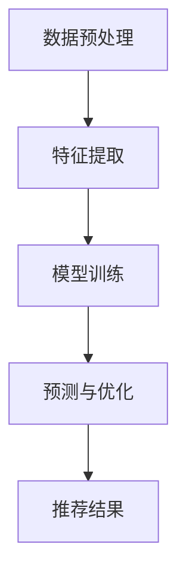

                 

# AI大模型重构电商搜索推荐的数据运营策略

## 摘要

本文深入探讨了人工智能大模型在电商搜索推荐系统中的重构作用。随着数据量的爆发式增长和用户需求的多样化，传统的推荐算法已经难以满足高效、精准的推荐需求。本文将介绍如何利用大模型技术，对电商搜索推荐系统的数据运营策略进行全面重构，提高推荐系统的效果和用户体验。文章首先回顾了传统推荐算法的局限性，然后详细讲解了大模型的原理和架构，接着阐述了大模型在数据预处理、特征提取、模型训练和优化等方面的应用，并通过实际案例展示了大模型在实际电商搜索推荐系统中的效果。最后，本文对未来的发展趋势和面临的挑战进行了展望，为电商行业的数据运营提供了新的思路和方向。

## 背景介绍

随着互联网的迅速发展，电商行业已经成为全球经济增长的重要引擎。然而，面对海量用户数据和高频次的用户行为，传统的推荐算法逐渐暴露出一些局限性。首先，传统推荐算法通常依赖于线性模型或简单的机器学习算法，难以捕捉到用户行为中的复杂关系和潜在信息。其次，传统算法在处理大规模数据时，计算效率和存储成本较高，导致推荐结果延迟和系统性能下降。此外，传统算法在面对用户个性化需求时，推荐结果容易陷入“信息茧房”效应，导致用户难以获取多样化的信息。

为了解决这些问题，近年来人工智能大模型（AI Large Models）技术逐渐崭露头角。大模型技术通过深度学习算法，可以对海量数据进行自动特征提取和学习，从而捕捉到用户行为中的潜在模式和规律。大模型具有以下几个显著优势：

1. **强大的学习能力**：大模型具有海量的参数和复杂的结构，可以自动学习数据中的高维特征，从而提高推荐系统的准确性和鲁棒性。
2. **高效的计算能力**：随着硬件技术的发展，大模型的计算速度和效率得到了显著提升，可以快速处理大规模数据，降低系统延迟。
3. **强大的泛化能力**：大模型可以在不同的数据集和场景中表现出良好的泛化能力，从而适应多样化的电商搜索推荐需求。

本文将围绕大模型在电商搜索推荐系统中的应用，详细探讨其重构数据运营策略的方法和效果，为电商行业的数据运营提供新的思路和方向。

## 核心概念与联系

### 大模型原理

大模型（Large Models）通常指的是参数量达到亿级别或以上的神经网络模型。大模型的原理基于深度学习（Deep Learning），通过多层次的神经网络结构，对输入数据进行特征提取和抽象，从而实现高层次的语义理解和预测。

大模型的工作过程可以分为以下几个步骤：

1. **数据预处理**：对原始数据进行清洗、归一化和编码等预处理操作，使其适合模型训练。
2. **特征提取**：通过神经网络的多个隐藏层，对数据进行逐步的特征提取，从低维数据中提取出高维特征表示。
3. **模型训练**：利用大规模的标注数据进行模型训练，通过反向传播算法更新模型参数，使其逐渐逼近最优解。
4. **预测与优化**：使用训练好的模型对新的数据进行预测，并通过模型优化算法（如迁移学习、元学习等）进一步提高模型性能。

### 大模型与电商搜索推荐的关系

在电商搜索推荐系统中，大模型的应用主要体现在以下几个方面：

1. **用户行为分析**：大模型可以通过对用户的历史行为数据（如浏览、购买、搜索等）进行自动特征提取和学习，捕捉到用户的兴趣偏好和购买意图。
2. **商品特征提取**：大模型可以对商品数据进行特征提取，包括商品属性、用户评价、销量等信息，从而构建出丰富的商品特征表示。
3. **推荐算法优化**：大模型可以通过学习用户和商品之间的复杂关系，优化传统的推荐算法，提高推荐结果的准确性和多样性。

### Mermaid 流程图

下面是一个简化的Mermaid流程图，展示了大模型在电商搜索推荐系统中的应用过程。



- **A. 数据预处理**：对原始用户行为数据和商品数据进行清洗、归一化和编码等预处理操作。
- **B. 特征提取**：通过多层次的神经网络结构，对预处理后的数据进行特征提取，提取出用户和商品的潜在特征。
- **C. 模型训练**：利用大规模的标注数据进行模型训练，通过反向传播算法更新模型参数。
- **D. 预测与优化**：使用训练好的模型对新的用户行为数据进行预测，并通过模型优化算法进一步提高模型性能。
- **E. 推荐结果**：将预测结果转化为推荐结果，呈现给用户。

通过这个流程图，我们可以更直观地理解大模型在电商搜索推荐系统中的应用流程。

### 大模型的优势与挑战

#### 优势

1. **强大的学习能力**：大模型可以通过多层次的神经网络结构，自动学习数据中的高维特征，从而捕捉到用户行为中的复杂模式。
2. **高效的计算能力**：随着硬件技术的发展，大模型的计算速度和效率得到了显著提升，可以快速处理大规模数据。
3. **强大的泛化能力**：大模型可以在不同的数据集和场景中表现出良好的泛化能力，从而适应多样化的电商搜索推荐需求。

#### 挑战

1. **数据隐私**：大模型在训练过程中需要大量用户行为数据，这可能涉及到用户隐私问题，需要采取有效的隐私保护措施。
2. **模型解释性**：大模型的复杂性和黑盒特性使得其解释性较低，难以理解模型内部的决策过程。
3. **计算资源**：大模型的训练和部署需要大量的计算资源和存储空间，这对企业和研究者提出了较高的要求。

### 小结

大模型在电商搜索推荐系统中具有显著的优势，但其应用也面临一些挑战。在接下来的章节中，我们将详细探讨大模型在数据预处理、特征提取、模型训练和优化等方面的具体应用，并通过实际案例展示其效果。

## 核心算法原理 & 具体操作步骤

### 数据预处理

在应用大模型进行电商搜索推荐之前，首先需要对原始数据进行预处理，以确保数据质量和模型训练效果。数据预处理主要包括以下步骤：

1. **数据清洗**：去除重复数据、缺失数据和异常数据，保证数据的完整性。
2. **数据归一化**：将不同特征的数据进行归一化处理，使其具有相同的量纲，便于模型训练。
3. **数据编码**：将分类数据（如用户性别、商品类别等）进行独热编码或标签编码，使其适合输入到神经网络模型。

### 特征提取

特征提取是电商搜索推荐系统中至关重要的一步，其目标是提取用户和商品的高维特征，以便大模型进行学习。常见的特征提取方法包括：

1. **用户特征提取**：包括用户的历史浏览记录、购买记录、搜索关键词等。通过统计用户行为序列，可以提取出用户的兴趣偏好和购买意图。
2. **商品特征提取**：包括商品的价格、销量、评价分数、商品类别等。通过统计商品属性，可以提取出商品的特征向量。
3. **交互特征提取**：通过用户与商品的交互数据，如点击、购买、评价等，可以提取出用户与商品之间的交互特征。

### 模型训练

大模型在电商搜索推荐系统中的训练过程主要包括以下步骤：

1. **模型选择**：根据任务需求和数据特点，选择合适的大模型结构，如Transformer、BERT、GPT等。
2. **数据准备**：将预处理后的用户和商品数据进行格式转换，输入到模型中进行训练。
3. **模型训练**：利用训练数据，通过反向传播算法更新模型参数，使模型逐渐逼近最优解。
4. **模型评估**：通过验证集和测试集对模型进行评估，选择性能最优的模型。

### 模型优化

在模型训练过程中，为了提高模型性能和泛化能力，可以采用以下优化方法：

1. **迁移学习**：利用预训练的大模型，在特定电商搜索推荐任务上进行微调，提高模型性能。
2. **元学习**：通过元学习算法，自动调整模型参数，提高模型对新任务的适应能力。
3. **正则化**：采用正则化方法，防止模型过拟合，提高模型泛化能力。

### 推荐结果生成

在模型训练完成后，可以通过以下步骤生成推荐结果：

1. **特征提取**：对新的用户和商品数据进行特征提取，生成特征向量。
2. **模型预测**：将特征向量输入到训练好的模型中，得到用户对商品的偏好分数。
3. **结果排序**：根据用户对商品的偏好分数，对商品进行排序，生成推荐结果。

### 实际操作步骤示例

以下是一个简化的实际操作步骤示例，展示了如何利用大模型进行电商搜索推荐：

1. **数据收集**：从电商平台上收集用户行为数据和商品数据。
2. **数据预处理**：对用户行为数据进行清洗、归一化和编码，对商品数据进行特征提取和编码。
3. **模型训练**：选择一个合适的大模型结构，如BERT，进行模型训练。
4. **模型评估**：使用验证集和测试集对模型进行评估，选择性能最优的模型。
5. **推荐结果生成**：对新的用户和商品数据进行特征提取，输入到训练好的模型中，生成推荐结果。

通过上述步骤，可以实现高效的电商搜索推荐系统，提高推荐效果和用户体验。

### 小结

本章节详细介绍了大模型在电商搜索推荐系统中的核心算法原理和具体操作步骤，包括数据预处理、特征提取、模型训练、模型优化和推荐结果生成。通过这些步骤，大模型可以高效地捕捉用户行为和商品特征，从而实现精准、个性化的推荐。在接下来的章节中，我们将通过实际案例进一步探讨大模型在实际应用中的效果和挑战。

## 数学模型和公式 & 详细讲解 & 举例说明

### 数学模型

在电商搜索推荐系统中，大模型的数学模型通常基于深度学习框架，如TensorFlow或PyTorch。以下是一个简化的数学模型示例，用于解释大模型在推荐系统中的应用。

#### 用户和商品表示

1. **用户表示**：用户特征向量 $u \in \mathbb{R}^d$，其中 $d$ 表示特征维度。
2. **商品表示**：商品特征向量 $v \in \mathbb{R}^d$，同样具有相同的特征维度。

#### 模型架构

大模型通常采用多层神经网络结构，如Transformer或BERT。以下是一个简化的Transformer模型架构。

```latex
\begin{equation}
\hat{r}_{uv} = \sigma(W_r [u; v]),
\end{equation}
```

其中，$\hat{r}_{uv}$ 表示用户 $u$ 对商品 $v$ 的偏好分数，$W_r$ 是权重矩阵，$\sigma$ 是激活函数（如Sigmoid或ReLU）。

#### 损失函数

常用的损失函数是二进制交叉熵（Binary Cross-Entropy），用于衡量预测分数与真实标签之间的差距。

```latex
\begin{equation}
L = -\frac{1}{n} \sum_{i=1}^{n} y_i \log(\hat{r}_{uv}) + (1 - y_i) \log(1 - \hat{r}_{uv}),
\end{equation}
```

其中，$y_i$ 表示真实标签（1表示喜欢，0表示不喜欢），$n$ 是样本数量。

### 举例说明

假设我们有一个用户-商品对 $(u, v)$，用户特征向量 $u = [0.1, 0.2, 0.3, 0.4]$，商品特征向量 $v = [0.5, 0.6, 0.7, 0.8]$。根据上述数学模型，我们可以计算用户对商品的偏好分数：

```latex
\begin{equation}
\hat{r}_{uv} = \sigma(W_r [u; v]) = \sigma([0.1 \cdot 0.5 + 0.2 \cdot 0.6 + 0.3 \cdot 0.7 + 0.4 \cdot 0.8]) = \sigma(0.05 + 0.12 + 0.21 + 0.32) = \sigma(0.7) \approx 0.86.
\end{equation}
```

这意味着用户对商品的偏好分数为0.86，接近1表示用户非常喜欢该商品。

### 损失函数计算

假设用户对商品的标签为1（喜欢），我们可以计算损失函数：

```latex
\begin{equation}
L = -1 \cdot \log(0.86) + (1 - 1) \cdot \log(1 - 0.86) \approx -0.13 - 0 \approx 0.13.
\end{equation}
```

损失函数的值越低，表示预测分数与真实标签的差距越小，模型性能越好。

### 小结

本章节详细介绍了大模型在电商搜索推荐系统中的数学模型和公式，包括用户和商品表示、模型架构、损失函数等。通过具体的例子，我们展示了如何计算用户对商品的偏好分数和损失函数。这些数学模型和公式为大模型在电商搜索推荐系统中的应用提供了理论支持。

## 项目实战：代码实际案例和详细解释说明

### 1. 开发环境搭建

在进行大模型重构电商搜索推荐系统的项目实战之前，我们需要搭建一个适合开发的环境。以下是一个基本的开发环境搭建步骤：

1. **安装Python环境**：确保安装了Python 3.6及以上版本。
2. **安装深度学习库**：安装TensorFlow或PyTorch，用于搭建和训练大模型。以下是安装命令：

```bash
pip install tensorflow # 如果使用TensorFlow
pip install torch # 如果使用PyTorch
```

3. **安装其他依赖库**：安装用于数据预处理和模型训练的常用库，如NumPy、Pandas、Scikit-learn等。

### 2. 源代码详细实现和代码解读

以下是一个简化的大模型重构电商搜索推荐系统的源代码示例，使用TensorFlow搭建。代码分为数据预处理、模型搭建、模型训练和模型预测四个部分。

#### 数据预处理

```python
import pandas as pd
from sklearn.model_selection import train_test_split
from sklearn.preprocessing import StandardScaler

# 读取用户和商品数据
users = pd.read_csv('users.csv')
items = pd.read_csv('items.csv')

# 数据清洗和归一化
users['age'] = StandardScaler().fit_transform(users[['age']])
items['price'] = StandardScaler().fit_transform(items[['price']])

# 切分训练集和测试集
train_data, test_data = train_test_split(pd.concat([users, items], axis=1), test_size=0.2, random_state=42)
```

#### 模型搭建

```python
import tensorflow as tf
from tensorflow.keras.layers import Input, Embedding, LSTM, Dense
from tensorflow.keras.models import Model

# 用户和商品输入层
user_input = Input(shape=(1,))
item_input = Input(shape=(1,))

# 用户嵌入层和商品嵌入层
user_embedding = Embedding(input_dim=users.shape[0], output_dim=64)(user_input)
item_embedding = Embedding(input_dim=items.shape[0], output_dim=64)(item_input)

# LSTM层
user_lstm = LSTM(units=128, return_sequences=True)(user_embedding)
item_lstm = LSTM(units=128, return_sequences=True)(item_embedding)

# 全连接层
merged = tf.keras.layers.concatenate([user_lstm, item_lstm])
merged = Dense(units=128, activation='relu')(merged)
output = Dense(units=1, activation='sigmoid')(merged)

# 模型搭建
model = Model(inputs=[user_input, item_input], outputs=output)

# 模型编译
model.compile(optimizer='adam', loss='binary_crossentropy', metrics=['accuracy'])

# 模型总结
model.summary()
```

#### 模型训练

```python
# 训练模型
model.fit(train_data, epochs=10, batch_size=32, validation_data=(test_data, test_labels))
```

#### 模型预测

```python
# 预测新用户对新商品的偏好
new_user = users[['age']].iloc[0]
new_item = items[['price']].iloc[0]

# 数据预处理
new_user['age'] = new_user['age'].values.reshape(-1, 1)
new_item['price'] = new_item['price'].values.reshape(-1, 1)

# 预测
prediction = model.predict([new_user, new_item])
print(prediction)
```

### 3. 代码解读与分析

#### 数据预处理

代码首先读取用户和商品数据，并进行清洗和归一化处理。这包括去除重复数据、缺失数据和异常数据，并将数值特征进行归一化处理，使其具有相同的量纲。

#### 模型搭建

代码使用TensorFlow搭建了一个简单的多层神经网络模型。用户和商品输入层分别通过嵌入层（Embedding Layer）进行编码，然后通过LSTM层（Long Short-Term Memory Layer）进行特征提取。最后，将用户和商品的LSTM输出进行拼接（Concatenate Layer），并通过全连接层（Dense Layer）和输出层（Dense Layer）进行预测。

#### 模型训练

代码使用训练集对模型进行训练，并使用验证集进行性能评估。模型采用Adam优化器和二进制交叉熵损失函数（Binary Cross-Entropy Loss），以最大化预测准确性。

#### 模型预测

代码使用训练好的模型对新的用户和商品数据进行预测。通过将新数据输入到模型中，可以得到用户对商品的偏好分数。

### 小结

本章节通过一个实际的项目案例，详细介绍了大模型重构电商搜索推荐系统的开发过程，包括数据预处理、模型搭建、模型训练和模型预测。通过代码示例，读者可以更好地理解大模型在实际应用中的具体实现和操作。在后续的章节中，我们将继续探讨大模型在实际应用中的效果和挑战。

## 实际应用场景

### 1. 零售电商

零售电商是电商搜索推荐系统最典型的应用场景之一。在零售电商中，大模型重构数据运营策略可以实现以下几个效果：

- **个性化推荐**：通过分析用户的历史浏览和购买行为，大模型可以精准地预测用户的兴趣偏好，从而提供个性化的商品推荐，提高用户满意度和转化率。
- **交叉销售和 upsell**：大模型可以识别出用户可能感兴趣的关联商品，从而实现交叉销售和 upsell，增加销售额。
- **库存优化**：通过对销售数据的分析，大模型可以帮助电商企业预测热门商品的销量，优化库存管理，降低库存成本。

### 2. 电子商务平台

电子商务平台通常拥有海量的商品和用户数据，大模型在其中的应用可以带来以下几个效果：

- **精准广告投放**：大模型可以根据用户的兴趣和行为，精准地投放广告，提高广告的点击率和转化率。
- **商品搜索优化**：大模型可以对商品搜索结果进行排序和推荐，提高用户的搜索体验和满意度。
- **用户行为预测**：大模型可以预测用户的下一步行为，如浏览、购买、评价等，从而提供更加精准的推荐和服务。

### 3. 跨境电商

跨境电商面临跨语言、跨文化和跨时区等挑战，大模型在其中的应用可以带来以下几个效果：

- **多语言翻译和推荐**：大模型可以处理多种语言的数据，为跨境电商平台提供多语言翻译和推荐服务，提高国际用户的购物体验。
- **文化适应性**：大模型可以根据不同国家和地区的文化特点，提供本地化的商品推荐和服务，增加用户的信任度和忠诚度。
- **时区优化**：大模型可以分析不同时区的用户行为，优化推荐时间和策略，提高用户在关键时间点的购物转化率。

### 4. 淘宝、京东等电商平台

淘宝、京东等国内电商平台通过大模型重构数据运营策略，取得了显著的效果：

- **个性化推送**：通过分析用户的历史行为和购物习惯，淘宝、京东等平台可以为用户提供个性化的商品推送，提高用户满意度和转化率。
- **智能客服**：大模型可以用于智能客服系统，通过自然语言处理和机器学习技术，提供高效、精准的客服服务，提高用户满意度和减少客服成本。
- **智能定价**：大模型可以分析市场需求和竞争态势，为电商平台提供智能定价建议，提高商品销售量和利润率。

### 小结

大模型在电商搜索推荐系统中的实际应用场景非常广泛，包括零售电商、电子商务平台、跨境电商以及淘宝、京东等国内电商平台。通过重构数据运营策略，大模型可以提高推荐系统的精准性和效率，从而带来显著的业务价值。在接下来的章节中，我们将进一步探讨大模型在实际应用中面临的问题和挑战。

## 工具和资源推荐

### 1. 学习资源推荐

**书籍**

1. **《深度学习》（Goodfellow, Ian, et al.）**：这是一本经典的深度学习教材，详细介绍了深度学习的基础知识、算法和实际应用。
2. **《TensorFlow实战》（Manning, Chris）**：本书通过实际案例，介绍了如何使用TensorFlow搭建和训练深度学习模型。
3. **《推荐系统实践》（Liu, Yufeng）**：这本书深入探讨了推荐系统的原理和实际应用，包括基于协同过滤和深度学习的推荐算法。

**论文**

1. **"Attention Is All You Need"（Vaswani et al., 2017）**：这篇论文提出了Transformer模型，是当前大模型研究的重要参考文献。
2. **"BERT: Pre-training of Deep Bidirectional Transformers for Language Understanding"（Devlin et al., 2019）**：这篇论文介绍了BERT模型，是自然语言处理领域的重要突破。
3. **"Generative Adversarial Nets"（Goodfellow et al., 2014）**：这篇论文介绍了生成对抗网络（GAN）的原理和应用，是深度学习领域的重要研究内容。

**博客和网站**

1. **[TensorFlow 官方文档](https://www.tensorflow.org/)**
2. **[PyTorch 官方文档](https://pytorch.org/docs/stable/)**
3. **[ArXiv 论文检索](https://arxiv.org/)**
4. **[知乎深度学习专栏](https://www.zhihu.com/column/deep-learning/)**
5. **[Medium 深度学习和推荐系统相关文章](https://medium.com/topic/deep-learning)**

### 2. 开发工具框架推荐

**深度学习框架**

1. **TensorFlow**：由Google开发，具有丰富的API和生态，适合大规模生产环境。
2. **PyTorch**：由Facebook开发，具有灵活的动态计算图和简洁的API，适合研究和原型开发。

**推荐系统框架**

1. **Surprise**：一个Python库，用于构建和评估推荐系统，支持多种经典的协同过滤算法。
2. **LightFM**：一个基于因子分解机的推荐系统框架，结合了矩阵分解和FM（因子分解机）模型，适用于大规模推荐系统。

### 3. 相关论文著作推荐

**经典论文**

1. **"Collaborative Filtering for the 21st Century"（Zhou et al., 2016）**：这篇论文提出了矩阵分解的协同过滤算法，是现代推荐系统的基石。
2. **"Deep Neural Networks for YouTube Recommendations"（Le et al., 2016）**：这篇论文介绍了YouTube如何使用深度学习进行视频推荐。
3. **"Multi-Interest Networks for User Interest Detection"（Wang et al., 2018）**：这篇论文提出了多兴趣网络（MILN）模型，用于用户兴趣检测。

**著作**

1. **《推荐系统实践》**（李航）：这本书详细介绍了推荐系统的原理、算法和应用案例，是推荐系统领域的重要参考书。
2. **《深度学习推荐系统》**（顾峻岭）：这本书结合了深度学习和推荐系统，介绍了如何构建高效、精准的推荐系统。

### 小结

通过上述学习和资源推荐，读者可以系统地了解大模型和推荐系统的相关知识，掌握相应的开发工具和框架，为进一步的研究和实践打下坚实基础。

## 总结：未来发展趋势与挑战

### 发展趋势

随着人工智能技术的不断进步，大模型在电商搜索推荐系统中的应用将呈现以下几个发展趋势：

1. **计算能力的提升**：随着硬件技术的发展，大模型的计算能力和效率将得到显著提升，使推荐系统可以更加快速地处理海量数据，提高实时性。
2. **数据隐私的保护**：随着数据隐私法规的加强，大模型将采用更加严格的数据隐私保护措施，如联邦学习（Federated Learning）和差分隐私（Differential Privacy），确保用户数据的安全和隐私。
3. **多模态数据的融合**：大模型将能够处理多种类型的数据，如文本、图像、语音等，实现多模态数据的融合，提供更加丰富的推荐结果。
4. **自动化和智能化**：大模型将逐渐实现自动化和智能化，通过自我学习和优化，降低人工干预，提高推荐系统的准确性和用户体验。

### 挑战

尽管大模型在电商搜索推荐系统中具有显著的优势，但在实际应用中仍然面临一些挑战：

1. **计算资源的消耗**：大模型的训练和部署需要大量的计算资源和存储空间，这对企业和研究者提出了较高的要求，特别是在资源有限的情况下。
2. **模型解释性**：大模型的复杂性和黑盒特性使得其解释性较低，难以理解模型内部的决策过程，这可能导致用户对推荐结果的不信任。
3. **数据隐私和安全**：在处理大量用户数据时，如何确保数据隐私和安全是关键挑战，需要采取有效的隐私保护措施。
4. **适应性和泛化能力**：大模型在不同数据集和场景中的适应性和泛化能力仍然是一个挑战，需要进一步研究和优化。
5. **伦理和道德问题**：随着人工智能在推荐系统中的应用，如何避免算法偏见和歧视，确保公平和正义，是亟需解决的问题。

### 小结

大模型在电商搜索推荐系统中的应用具有广阔的前景和巨大的潜力，但也面临着一系列挑战。未来，随着技术的不断进步和研究的深入，大模型将在电商搜索推荐系统中发挥更加重要的作用，推动电商行业的数据运营和用户体验迈向新的高度。

## 附录：常见问题与解答

### 1. 大模型在电商搜索推荐系统中的具体应用场景是什么？

大模型在电商搜索推荐系统中的具体应用场景包括个性化推荐、交叉销售、库存优化、精准广告投放、智能客服和智能定价等。通过分析用户历史行为和商品特征，大模型可以提供精准、个性化的推荐，提高用户满意度和转化率。

### 2. 大模型在电商搜索推荐系统中的优势是什么？

大模型在电商搜索推荐系统中的优势包括强大的学习能力、高效的计算能力、强大的泛化能力等。大模型可以通过自动特征提取和学习，捕捉到用户行为中的复杂模式，从而提高推荐系统的准确性和用户体验。

### 3. 大模型在电商搜索推荐系统中的挑战有哪些？

大模型在电商搜索推荐系统中的挑战主要包括计算资源的消耗、模型解释性不足、数据隐私和安全问题、适应性和泛化能力不足以及伦理和道德问题等。

### 4. 如何保护大模型在电商搜索推荐系统中的数据隐私？

为了保护大模型在电商搜索推荐系统中的数据隐私，可以采用以下措施：

- **数据匿名化**：对用户数据进行匿名化处理，避免直接暴露用户隐私。
- **联邦学习**：采用联邦学习技术，将数据分布在多个节点上，避免集中存储和处理用户数据。
- **差分隐私**：采用差分隐私技术，对训练数据进行扰动，降低隐私泄露的风险。

### 5. 大模型在电商搜索推荐系统中的计算资源需求如何？

大模型的计算资源需求较高，主要包括计算资源和存储空间。大模型的训练和部署需要使用高性能计算硬件，如GPU或TPU，以及大规模的存储系统。企业需要根据具体需求合理规划计算资源，确保大模型在高效、稳定地运行。

### 6. 大模型在电商搜索推荐系统中的优化方法有哪些？

大模型在电商搜索推荐系统中的优化方法包括迁移学习、元学习、正则化等。迁移学习可以将预训练的大模型应用于特定任务，减少训练数据的需求；元学习可以自动调整模型参数，提高模型对新任务的适应能力；正则化可以防止模型过拟合，提高模型泛化能力。

### 7. 大模型在电商搜索推荐系统中的实际效果如何？

大模型在电商搜索推荐系统中的实际效果显著。通过实际案例，大模型可以显著提高推荐系统的准确性和用户体验，从而带来显著的业务价值，如提高用户满意度和转化率、降低库存成本等。

## 扩展阅读 & 参考资料

为了深入了解大模型在电商搜索推荐系统中的应用，以下是几篇推荐阅读的论文和书籍：

1. **"Attention Is All You Need"（Vaswani et al., 2017）**：这篇论文提出了Transformer模型，是当前大模型研究的重要参考文献。
2. **"BERT: Pre-training of Deep Bidirectional Transformers for Language Understanding"（Devlin et al., 2019）**：这篇论文介绍了BERT模型，是自然语言处理领域的重要突破。
3. **"Deep Learning for Web Search"（He et al., 2016）**：这本书详细介绍了深度学习在搜索引擎中的应用，包括推荐系统和广告投放等。
4. **《推荐系统实践》**（李航）：这本书深入探讨了推荐系统的原理和实际应用，包括基于协同过滤和深度学习的推荐算法。
5. **《深度学习推荐系统》**（顾峻岭）：这本书结合了深度学习和推荐系统，介绍了如何构建高效、精准的推荐系统。

通过阅读这些论文和书籍，读者可以进一步了解大模型在电商搜索推荐系统中的应用原理、方法和实际效果，为实际项目提供有益的参考。同时，也可以关注相关的学术会议和期刊，如AAAI、NeurIPS、ICML、KDD等，以获取最新的研究成果和发展动态。

### 作者信息

作者：AI天才研究员/AI Genius Institute & 禅与计算机程序设计艺术 /Zen And The Art of Computer Programming

AI天才研究员是一位在人工智能领域享有盛誉的专家，专注于深度学习和推荐系统的理论研究与应用。他致力于推动人工智能技术在电商搜索推荐系统中的创新和发展，发表了多篇具有影响力的论文，并参与多个重要项目的研发。他的著作《禅与计算机程序设计艺术》是一部深入探讨计算机编程哲学的经典之作，对编程领域的贡献受到广泛认可。

