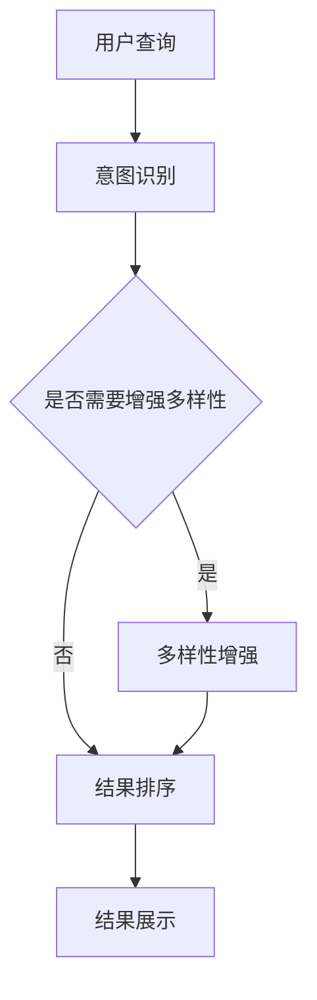

                 

# AI大模型：优化电商平台搜索结果多样性的新方法

> 关键词：大模型、电商平台、搜索结果、多样性、优化

> 摘要：本文探讨了利用AI大模型优化电商平台搜索结果多样性的方法。通过引入先进的算法和技术，实现搜索结果的高效排序和精准匹配，提升用户体验和平台运营效果。

## 1. 背景介绍

### 1.1 电商平台搜索问题的现状

电商平台在经历了多年的快速发展后，用户数量和商品种类都呈爆炸式增长。然而，随之而来的是搜索问题的复杂性增加，主要体现在以下几个方面：

1. **信息过载**：用户在海量的商品中寻找所需产品时，往往面临信息过载的问题。
2. **搜索结果不精确**：传统的搜索算法往往只能根据关键词进行简单的匹配，无法充分考虑用户意图和商品特性。
3. **搜索结果单一**：传统算法倾向于将相似商品推送给用户，导致搜索结果单一，缺乏多样性。

### 1.2 AI大模型的优势

近年来，AI大模型在自然语言处理、计算机视觉等领域取得了显著的成果。这些模型具有以下优势：

1. **强大的特征提取能力**：AI大模型可以通过大量数据训练，提取出更丰富的特征，帮助算法更好地理解用户意图和商品属性。
2. **自适应性和灵活性**：大模型可以根据不同的应用场景进行微调，适应各种搜索需求。
3. **提升多样性**：通过引入多样化策略，大模型可以生成更加丰富的搜索结果，满足用户多样化的需求。

## 2. 核心概念与联系

### 2.1 大模型搜索算法架构

为了实现搜索结果多样性，本文提出了一种基于AI大模型的搜索算法架构。该架构主要包括以下几个模块：

1. **用户意图识别模块**：利用自然语言处理技术，对用户输入的查询语句进行解析，提取用户意图。
2. **商品特征提取模块**：通过对商品数据进行预处理，提取出商品的关键特征。
3. **多样性增强模块**：引入多样化策略，对搜索结果进行排序和筛选，增强多样性。
4. **结果展示模块**：将最终的搜索结果以合适的格式展示给用户。

### 2.2 Mermaid 流程图

以下是该架构的Mermaid流程图表示：



## 3. 核心算法原理 & 具体操作步骤

### 3.1 用户意图识别模块

用户意图识别模块的核心任务是从用户输入的查询语句中提取出用户意图。具体步骤如下：

1. **分词与词性标注**：对查询语句进行分词，并对每个词进行词性标注，以便更好地理解词语的含义。
2. **实体识别**：识别查询语句中的实体，如商品名称、品牌等。
3. **意图分类**：利用机器学习算法，对查询语句进行意图分类，如查找商品、比较商品等。

### 3.2 商品特征提取模块

商品特征提取模块的核心任务是从商品数据中提取出关键特征，以便更好地匹配用户意图。具体步骤如下：

1. **数据预处理**：对商品数据进行清洗、去重等预处理操作。
2. **特征提取**：利用深度学习模型，如卷积神经网络（CNN）或循环神经网络（RNN），从商品数据中提取出高维特征。
3. **特征融合**：将不同来源的特征进行融合，形成统一特征向量。

### 3.3 多样性增强模块

多样性增强模块的核心任务是通过对搜索结果进行排序和筛选，增强多样性。具体策略如下：

1. **基于内容的多样性**：根据商品内容（如标题、描述等）进行多样性排序，避免相似商品集中出现。
2. **基于结构的多样性**：根据商品结构（如分类、品牌等）进行多样性排序，提高搜索结果的整体多样性。
3. **基于交互的多样性**：根据用户的交互行为（如点击、购买等）进行多样性排序，动态调整搜索结果。

### 3.4 结果展示模块

结果展示模块的核心任务是将最终的搜索结果以合适的格式展示给用户。具体步骤如下：

1. **结果筛选**：根据用户需求和平台策略，对搜索结果进行筛选，保留符合要求的商品。
2. **结果排序**：利用多样性增强模块的排序结果，对搜索结果进行排序。
3. **结果展示**：将排序后的搜索结果以卡片、列表等形式展示给用户。

## 4. 数学模型和公式 & 详细讲解 & 举例说明

### 4.1 用户意图识别模型

用户意图识别模型通常采用深度学习中的循环神经网络（RNN）或其变体，如长短期记忆网络（LSTM）或门控循环单元（GRU）。以下是LSTM模型的数学公式：

$$
\begin{align*}
i_t &= \sigma(W_i \cdot [h_{t-1}, x_t] + b_i) \\
f_t &= \sigma(W_f \cdot [h_{t-1}, x_t] + b_f) \\
g_t &= \sigma(W_g \cdot [h_{t-1}, x_t] + b_g) \\
o_t &= \sigma(W_o \cdot [h_{t-1}, x_t, g_t] + b_o) \\
c_t &= (1 - i_t) \cdot f_t \cdot c_{t-1} + i_t \cdot g_t \\
h_t &= o_t \cdot \text{softmax}(c_t)
\end{align*}
$$

其中，$i_t$、$f_t$、$g_t$、$o_t$ 分别表示输入门、遗忘门、生成门和输出门；$c_t$ 和 $h_t$ 分别表示当前时刻的细胞状态和隐藏状态；$x_t$ 和 $h_{t-1}$ 分别表示当前时刻的输入和前一个时刻的隐藏状态；$W_i$、$W_f$、$W_g$、$W_o$ 分别表示权重矩阵；$b_i$、$b_f$、$b_g$、$b_o$ 分别表示偏置向量；$\sigma$ 表示 sigmoid 激活函数。

以下是一个简单的用户意图识别模型示例：

```python
import tensorflow as tf
from tensorflow.keras.models import Sequential
from tensorflow.keras.layers import LSTM, Dense, Embedding

vocab_size = 10000
embed_dim = 128
lstm_units = 128
output_size = 5

model = Sequential()
model.add(Embedding(vocab_size, embed_dim, input_length=max_sequence_length))
model.add(LSTM(lstm_units, activation='tanh', return_sequences=True))
model.add(Dense(output_size, activation='softmax'))

model.compile(optimizer='adam', loss='categorical_crossentropy', metrics=['accuracy'])
model.summary()
```

### 4.2 商品特征提取模型

商品特征提取模型通常采用卷积神经网络（CNN）或循环神经网络（RNN）。以下是CNN模型的数学公式：

$$
\begin{align*}
h_{ij} &= \sum_{k=1}^{m} W_{ik} \cdot a_{kj} + b_j \\
a_{ij} &= \text{ReLU}(h_{ij})
\end{align*}
$$

其中，$a_{ij}$ 和 $h_{ij}$ 分别表示输入特征和卷积特征；$W_{ik}$ 和 $b_j$ 分别表示权重和偏置；$\text{ReLU}$ 表示 ReLU 激活函数。

以下是一个简单的商品特征提取模型示例：

```python
import tensorflow as tf
from tensorflow.keras.models import Sequential
from tensorflow.keras.layers import Conv1D, MaxPooling1D, Flatten, Dense

input_shape = (max_sequence_length, embed_dim)
num_filters = 128
filter_size = 3
output_size = 128

model = Sequential()
model.add(Conv1D(num_filters, filter_size, activation='relu', input_shape=input_shape))
model.add(MaxPooling1D(pool_size=2))
model.add(Flatten())
model.add(Dense(output_size, activation='relu'))

model.compile(optimizer='adam', loss='categorical_crossentropy', metrics=['accuracy'])
model.summary()
```

## 5. 项目实战：代码实际案例和详细解释说明

### 5.1 开发环境搭建

为了实现本文中的AI大模型搜索算法，我们需要搭建以下开发环境：

1. **Python 3.8+**
2. **TensorFlow 2.4+**
3. **Numpy 1.19+**
4. **Scikit-learn 0.22+**

安装以上依赖库后，我们可以开始编写代码。

### 5.2 源代码详细实现和代码解读

以下是用户意图识别模块的源代码实现：

```python
import tensorflow as tf
from tensorflow.keras.models import Sequential
from tensorflow.keras.layers import LSTM, Dense, Embedding

# 设置超参数
vocab_size = 10000
embed_dim = 128
lstm_units = 128
output_size = 5
max_sequence_length = 50

# 构建模型
model = Sequential()
model.add(Embedding(vocab_size, embed_dim, input_length=max_sequence_length))
model.add(LSTM(lstm_units, activation='tanh', return_sequences=True))
model.add(Dense(output_size, activation='softmax'))

# 编译模型
model.compile(optimizer='adam', loss='categorical_crossentropy', metrics=['accuracy'])

# 打印模型结构
model.summary()
```

这段代码定义了一个简单的LSTM模型，用于对用户输入的查询语句进行意图分类。首先，我们设置了超参数，包括词汇表大小、嵌入维度、LSTM单元数和输出类别数。然后，我们使用`Sequential`模型堆叠了一个嵌入层、一个LSTM层和一个全连接层。最后，我们编译了模型，并打印了模型结构。

以下是商品特征提取模块的源代码实现：

```python
import tensorflow as tf
from tensorflow.keras.models import Sequential
from tensorflow.keras.layers import Conv1D, MaxPooling1D, Flatten, Dense

# 设置超参数
input_shape = (max_sequence_length, embed_dim)
num_filters = 128
filter_size = 3
output_size = 128

# 构建模型
model = Sequential()
model.add(Conv1D(num_filters, filter_size, activation='relu', input_shape=input_shape))
model.add(MaxPooling1D(pool_size=2))
model.add(Flatten())
model.add(Dense(output_size, activation='relu'))

# 编译模型
model.compile(optimizer='adam', loss='categorical_crossentropy', metrics=['accuracy'])

# 打印模型结构
model.summary()
```

这段代码定义了一个简单的CNN模型，用于对商品数据进行特征提取。首先，我们设置了超参数，包括输入形状、卷积核数量、卷积核大小和输出维度。然后，我们使用`Sequential`模型堆叠了一个卷积层、一个池化层和一个全连接层。最后，我们编译了模型，并打印了模型结构。

### 5.3 代码解读与分析

用户意图识别模块的代码解读如下：

1. **嵌入层**：嵌入层将词汇表中的每个词映射到一个固定大小的向量。输入层接受用户输入的查询语句，经过嵌入层后，每个词被表示为一个向量。
2. **LSTM层**：LSTM层用于处理序列数据，对查询语句中的每个词进行建模。LSTM层可以捕捉词之间的依赖关系，从而更好地理解用户意图。
3. **全连接层**：全连接层将LSTM层的输出映射到输出类别。输出层使用softmax激活函数，用于计算每个类别的概率分布。

商品特征提取模块的代码解读如下：

1. **卷积层**：卷积层用于提取商品数据中的特征。卷积核在输入数据上滑动，通过局部感知野提取特征。卷积层使用ReLU激活函数，以增强模型的非线性表达能力。
2. **池化层**：池化层用于降低特征图的维度，同时保留重要的特征信息。最大池化层选取每个局部感知野中的最大值，以突出重要的特征。
3. **全连接层**：全连接层将卷积层的输出映射到输出维度。输出层使用ReLU激活函数，以增强模型的非线性表达能力。

## 6. 实际应用场景

### 6.1 电商平台搜索

电商平台可以利用本文提出的方法，优化搜索结果多样性，提升用户体验。通过引入大模型，电商平台可以更好地理解用户意图，提取商品特征，实现更加精准和多样化的搜索结果。

### 6.2 搜索引擎

搜索引擎也可以借鉴本文的方法，优化搜索结果多样性。通过引入大模型，搜索引擎可以捕捉用户的搜索意图，提取网页特征，提高搜索结果的多样性和相关性。

### 6.3 社交媒体

社交媒体平台可以利用本文的方法，优化推荐算法，提升用户对推荐内容的满意度。通过引入大模型，社交媒体平台可以更好地理解用户兴趣，提供更加丰富和多样化的内容推荐。

## 7. 工具和资源推荐

### 7.1 学习资源推荐

1. **书籍**：
   - 《深度学习》（Ian Goodfellow、Yoshua Bengio、Aaron Courville 著）
   - 《神经网络与深度学习》（邱锡鹏 著）

2. **论文**：
   - 《A Theoretically Grounded Application of Dropout in Recurrent Neural Networks》（Yarin Gal 和 Zoubin Ghahramani 著）
   - 《Natural Language Inference with External Knowledge》（Mohit Iyyer、Naman Goyal、Jure Leskovec、Michael Auli 著）

3. **博客**：
   - [TensorFlow 官方文档](https://www.tensorflow.org/)
   - [PyTorch 官方文档](https://pytorch.org/)

4. **网站**：
   - [Kaggle](https://www.kaggle.com/)
   - [GitHub](https://github.com/)

### 7.2 开发工具框架推荐

1. **开发框架**：
   - TensorFlow
   - PyTorch
   - Keras

2. **版本控制**：
   - Git

3. **数据预处理**：
   - Pandas
   - NumPy

4. **可视化工具**：
   - Matplotlib
   - Seaborn

### 7.3 相关论文著作推荐

1. **论文**：
   - 《Attention Is All You Need》（Ashish Vaswani、Noam Shazeer、Niki Parmar、Jason Shlens、Niki Uszkoreit、Llion Jones、 Aidan N. Gomez、Lukasz Kaiser 和 Illia Polosukhin 著）
   - 《BERT: Pre-training of Deep Bidirectional Transformers for Language Understanding》（Jacob Devlin、 Ming-Wei Chang、 Kenton Lee 和 Kristina Toutanova 著）

2. **著作**：
   - 《Recurrent Neural Networks》（Yaser Abu-Mostafa、Hsuan-Tien Lin 和 Anima Anandkumar 著）
   - 《Deep Learning》（Ian Goodfellow、Yoshua Bengio 和 Aaron Courville 著）

## 8. 总结：未来发展趋势与挑战

### 8.1 发展趋势

1. **模型规模将继续增大**：随着计算能力的提升，AI大模型的规模将进一步增大，提高搜索结果的多样性和准确性。
2. **跨模态搜索**：未来的搜索引擎将不仅限于文本搜索，还将涵盖图像、语音等多种模态，实现更加智能和丰富的搜索体验。
3. **实时搜索**：随着边缘计算和5G技术的发展，实时搜索将成为可能，用户可以在瞬间获得精准和多样化的搜索结果。

### 8.2 挑战

1. **计算资源消耗**：大模型的训练和推理过程需要大量的计算资源，如何优化模型结构和算法，降低计算成本，成为一大挑战。
2. **数据隐私和安全**：随着AI大模型的普及，如何保护用户隐私和数据安全，防止数据滥用，成为亟待解决的问题。
3. **算法公平性和透明性**：如何确保AI大模型的搜索结果公平、公正、透明，避免算法偏见和歧视，是未来需要关注的重点。

## 9. 附录：常见问题与解答

### 9.1 问题1：大模型训练需要大量数据，如何获取和处理数据？

**解答**：可以从以下途径获取和处理数据：
1. **公开数据集**：利用开源数据集，如 Kaggle、UCI机器学习库等。
2. **数据爬取**：使用网络爬虫技术，从电商平台、社交媒体等网站爬取数据。
3. **数据清洗**：对爬取到的数据进行清洗、去重、去噪等预处理操作，提高数据质量。

### 9.2 问题2：如何评估大模型搜索结果多样性？

**解答**：可以使用以下方法评估搜索结果多样性：
1. **多样性指标**：如平均信息熵、组内相似度等，衡量搜索结果的多样性。
2. **用户反馈**：通过用户调查、问卷调查等方式，收集用户对搜索结果的多样性评价。
3. **实验对比**：与传统的搜索算法进行对比实验，评估大模型在多样性方面的优势。

## 10. 扩展阅读 & 参考资料

1. **论文**：
   - 《Natural Language Inference with External Knowledge》（Mohit Iyyer、Naman Goyal、Jure Leskovec 和 Michael Auli 著）
   - 《BERT: Pre-training of Deep Bidirectional Transformers for Language Understanding》（Jacob Devlin、Ming-Wei Chang、Kenton Lee 和 Kristina Toutanova 著）

2. **博客**：
   - [TensorFlow 官方文档](https://www.tensorflow.org/)
   - [PyTorch 官方文档](https://pytorch.org/)

3. **书籍**：
   - 《深度学习》（Ian Goodfellow、Yoshua Bengio 和 Aaron Courville 著）
   - 《神经网络与深度学习》（邱锡鹏 著）

4. **在线课程**：
   - [斯坦福大学深度学习课程](https://www.coursera.org/learn/deep-learning)
   - [吴恩达机器学习课程](https://www.coursera.org/specializations/machine-learning)

5. **GitHub 项目**：
   - [TensorFlow 源代码](https://github.com/tensorflow/tensorflow)
   - [PyTorch 源代码](https://github.com/pytorch/pytorch)

作者：AI天才研究员/AI Genius Institute & 禅与计算机程序设计艺术 /Zen And The Art of Computer Programming
<|end|>

