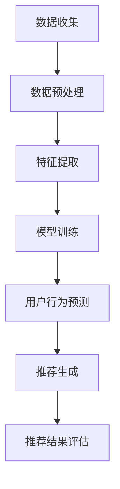
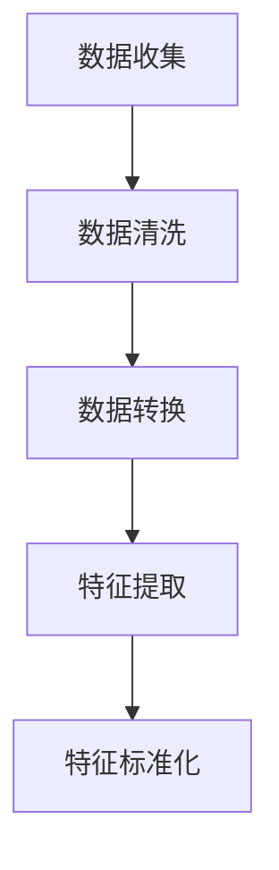
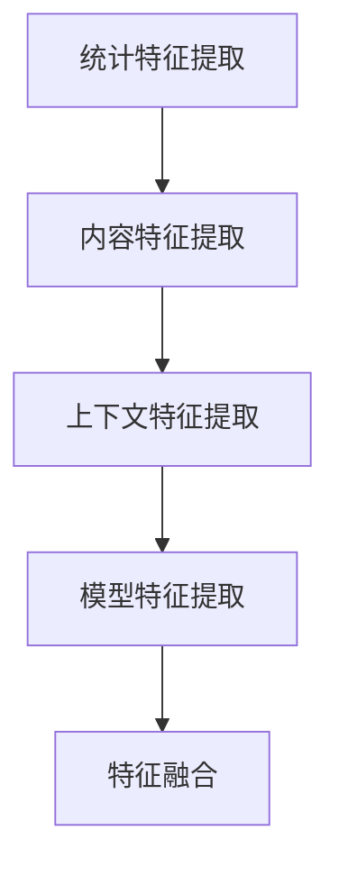
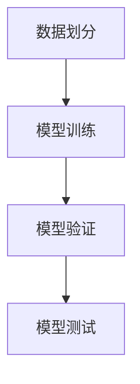

                 

### 背景介绍

在当今数字化时代，电商平台成为了人们购买商品的主要渠道。这些平台不仅提供了丰富的商品选择，还通过个性化推荐算法，帮助用户发现他们可能感兴趣的商品。然而，随着用户规模的扩大和市场需求的增加，电商平台面临着如何有效地进行跨平台推荐的问题。

跨平台推荐是指在不同电商平台上，根据用户的行为和偏好，为用户推荐相应的商品。这与单一平台内的推荐有显著区别，因为它需要处理多个平台之间的数据关联和用户行为差异。传统的推荐算法通常是基于协同过滤、内容推荐等方法，这些方法在单一平台上表现良好，但在跨平台推荐中却面临着诸多挑战。

首先，跨平台数据源的不一致性是一个关键问题。不同电商平台的数据格式、用户行为数据类型以及商品描述等方面都存在差异。这使得直接应用传统推荐算法变得复杂，需要对这些数据进行预处理和转换。其次，用户在多个平台上的行为数据往往是不完整和不连续的，这给推荐算法的准确性带来了挑战。

此外，跨平台推荐还需要考虑平台间的竞争关系。一些电商平台可能会限制数据的共享，导致推荐算法无法充分利用其他平台的数据资源。最后，跨平台推荐需要处理大量用户和商品，如何高效地计算和传输推荐结果，也是一个重要的问题。

综上所述，为了解决这些问题，研究者们开始探索基于人工智能的大模型在跨平台推荐中的应用。大模型通过学习用户和商品的高维特征，能够在复杂的环境中提供更精准的推荐结果。本文将介绍一种基于AI大模型的新方法，以改善电商平台跨平台推荐的效果。

### 2. 核心概念与联系

为了理解AI大模型在跨平台推荐中的作用，我们首先需要了解几个核心概念：人工智能、大模型、跨平台推荐和数据关联。

**人工智能（AI）：** 人工智能是计算机科学的一个分支，旨在使计算机能够模拟人类智能行为，如学习、推理、规划和感知等。在推荐系统中，人工智能技术被广泛应用于优化推荐算法，提高推荐的准确性。

**大模型（Large-scale Model）：** 大模型是指那些具有数百万到数十亿参数的机器学习模型。这些模型通过在大规模数据集上进行训练，能够捕获复杂的数据特征和模式。大模型在自然语言处理、计算机视觉和推荐系统等领域有着广泛的应用。

**跨平台推荐（Cross-platform Recommendation）：** 跨平台推荐是指在不同平台上为用户提供个性化的推荐服务。这需要处理跨平台数据源的不一致性、用户行为的不完整性以及跨平台之间的数据关联问题。

**数据关联（Data Linkage）：** 数据关联是指将不同来源、格式或结构的数据进行整合和匹配，以揭示数据之间的内在联系。在跨平台推荐中，数据关联是实现个性化推荐的关键。

#### AI大模型与跨平台推荐的关系

AI大模型与跨平台推荐之间的关系可以从以下几个方面来理解：

1. **数据预处理和特征提取：** AI大模型能够处理大量的跨平台数据，通过学习用户和商品的高维特征，自动进行数据预处理和特征提取。这解决了跨平台数据源不一致性带来的问题。

2. **用户行为预测：** AI大模型通过学习用户的跨平台行为数据，能够预测用户在各个平台上的偏好。这种预测能力有助于提高跨平台推荐的准确性。

3. **个性化推荐：** AI大模型能够根据用户的跨平台行为数据，生成个性化的推荐结果。这种个性化推荐能够更好地满足用户的需求，提高用户的满意度。

4. **数据关联与整合：** AI大模型通过学习用户和商品的多维度特征，能够实现跨平台数据的有效关联和整合。这有助于发现不同平台之间的数据联系，从而提高推荐的精准度。

#### Mermaid流程图

以下是一个简单的Mermaid流程图，展示了AI大模型在跨平台推荐中的基本流程：



在这个流程图中，数据收集阶段从各个平台获取用户行为数据；数据预处理和特征提取阶段对数据进行清洗和转换，提取关键特征；模型训练阶段使用大量数据进行训练，以生成大模型；用户行为预测阶段利用大模型预测用户在不同平台上的行为；推荐生成阶段根据用户行为预测结果生成个性化推荐；最后，推荐结果评估阶段对推荐结果进行评估，以持续优化推荐算法。

通过这种逐步分析和推理的方式，我们可以更好地理解AI大模型在跨平台推荐中的应用原理和流程。在接下来的章节中，我们将深入探讨AI大模型的算法原理和具体操作步骤。

### 3. 核心算法原理 & 具体操作步骤

#### 大模型基本原理

AI大模型的核心在于其强大的学习能力，能够通过大量数据进行训练，提取出高维特征，并利用这些特征进行精准预测。具体来说，大模型通常基于深度学习框架，采用多层神经网络结构。以下是一个简单的神经网络结构示意图：


在这个结构中，输入层接收用户行为数据，隐藏层通过非线性变换提取特征，输出层生成最终的推荐结果。每个神经元（节点）都连接到前一层和后一层，并通过权重进行信息传递。通过反向传播算法，模型能够不断调整权重，以最小化预测误差。

#### 跨平台数据预处理

在构建AI大模型之前，需要对跨平台数据进行预处理。这一步骤至关重要，因为不同平台的数据格式和特征可能存在较大差异。以下是跨平台数据预处理的主要步骤：

1. **数据收集：** 从各个电商平台获取用户行为数据，包括购买历史、浏览记录、收藏夹等。

2. **数据清洗：** 清除重复、错误或无关的数据，确保数据质量。

3. **数据转换：** 将不同格式的数据转换为统一的格式，例如将购买记录转换为时间序列数据。

4. **特征提取：** 从原始数据中提取关键特征，如用户活跃度、购买频率、商品类别等。

以下是一个Mermaid流程图，展示了跨平台数据预处理的基本流程：



在这个流程图中，数据清洗阶段删除重复和错误数据；数据转换阶段将不同格式的数据转换为统一格式；特征提取阶段提取关键特征；特征标准化阶段对特征进行归一化处理，以消除数据尺度差异。

#### 特征提取与融合

在特征提取与融合阶段，AI大模型通过学习用户和商品的多维度特征，提高推荐准确性。以下是一些常用的特征提取与融合方法：

1. **基于统计的特征：** 包括用户活跃度、购买频率、商品类别等。

2. **基于内容的特征：** 包括商品属性、描述、标签等。

3. **基于上下文的特征：** 包括时间、地理位置、用户设备等。

4. **基于模型的特征：** 利用深度学习模型提取高维特征。

以下是一个Mermaid流程图，展示了特征提取与融合的基本流程：



在这个流程图中，统计特征提取阶段提取用户和商品的统计特征；内容特征提取阶段提取商品的内容特征；上下文特征提取阶段提取与用户行为相关的上下文特征；模型特征提取阶段利用深度学习模型提取高维特征；特征融合阶段将不同类型的特征进行整合。

#### 大模型训练与优化

在完成特征提取与融合后，AI大模型进入训练与优化阶段。以下是训练与优化的一般步骤：

1. **数据划分：** 将数据集划分为训练集、验证集和测试集，用于训练、验证和评估模型性能。

2. **模型训练：** 使用训练集训练大模型，通过反向传播算法调整模型权重。

3. **模型验证：** 使用验证集评估模型性能，调整模型参数以优化性能。

4. **模型测试：** 使用测试集评估最终模型性能，确保模型在实际应用中具有良好的表现。

以下是一个Mermaid流程图，展示了大模型训练与优化的基本流程：



在这个流程图中，数据划分阶段将数据集划分为训练集、验证集和测试集；模型训练阶段使用训练集训练大模型；模型验证阶段使用验证集评估模型性能；模型测试阶段使用测试集评估最终模型性能。

通过上述步骤，AI大模型能够在复杂的环境中提供精准的跨平台推荐。在下一章节中，我们将深入探讨AI大模型的数学模型和公式，以更好地理解其工作原理。

### 4. 数学模型和公式 & 详细讲解 & 举例说明

在理解AI大模型的工作原理后，我们将深入探讨其背后的数学模型和公式。这些数学工具不仅帮助我们在理论上理解大模型如何运作，还可以指导我们在实践中对其进行优化。

#### 深度学习基础

深度学习模型的核心是神经网络，而神经网络的基础是激活函数、损失函数和优化算法。以下是这些基本概念及其公式：

1. **激活函数（Activation Function）**

   激活函数用于引入非线性变换，使得神经网络能够捕获复杂的数据特征。常见的激活函数有：

   - **Sigmoid函数：**
     $$\sigma(x) = \frac{1}{1 + e^{-x}}$$
   - **ReLU函数（Rectified Linear Unit）：**
     $$\text{ReLU}(x) = \max(0, x)$$
   - **Tanh函数（Hyperbolic Tangent）：**
     $$\text{Tanh}(x) = \frac{e^x - e^{-x}}{e^x + e^{-x}}$$

2. **损失函数（Loss Function）**

   损失函数用于评估模型预测值与真实值之间的差距。常见的损失函数有：

   - **均方误差（Mean Squared Error, MSE）：**
     $$\text{MSE}(y, \hat{y}) = \frac{1}{n}\sum_{i=1}^{n}(y_i - \hat{y}_i)^2$$
   - **交叉熵（Cross-Entropy）：**
     $$\text{CE}(y, \hat{y}) = -\sum_{i=1}^{n}y_i\log(\hat{y}_i)$$

3. **优化算法（Optimization Algorithm）**

   优化算法用于调整模型权重，以最小化损失函数。常见的优化算法有：

   - **随机梯度下降（Stochastic Gradient Descent, SGD）：**
     $$w \leftarrow w - \alpha \cdot \nabla_w J(w)$$
   - **Adam优化器（Adaptive Moment Estimation）：**
     $$m_t = \beta_1m_{t-1} + (1 - \beta_1)(\nabla_w J(w_t))$$
     $$v_t = \beta_2v_{t-1} + (1 - \beta_2)(\nabla_w J(w_t)^2)$$
     $$\hat{m}_t = m_t / (1 - \beta_1^t)$$
     $$\hat{v}_t = v_t / (1 - \beta_2^t)$$
     $$w \leftarrow w - \alpha \cdot \frac{\hat{m}_t}{\sqrt{\hat{v}_t} + \epsilon}$$

#### 跨平台推荐模型

在跨平台推荐中，AI大模型通常采用图神经网络（Graph Neural Networks, GNN）来处理跨平台数据。以下是一个简单的跨平台推荐模型及其公式：

1. **用户和商品嵌入（User and Item Embedding）**

   用户和商品的嵌入是跨平台推荐的基础。嵌入层的公式如下：

   $$e^u_i = \sigma(W_u^T u_i + b_u)$$
   $$e^i_j = \sigma(W_i^T i_j + b_i)$$

   其中，$u_i$和$i_j$分别表示用户$i$和商品$j$的特征向量，$W_u$和$W_i$是嵌入矩阵，$b_u$和$b_i$是偏置项。

2. **图卷积操作（Graph Convolutional Operation）**

   图卷积操作用于聚合用户和商品之间的关系。其公式如下：

   $$h^l_{ij} = \sigma(\sum_{k \in N(j)} W^l_k h^{l-1}_{ik} + b^l)$$

   其中，$h^{l-1}_{ik}$是上一层的嵌入向量，$N(j)$是商品$j$的邻接节点集合，$W^l_k$是图卷积矩阵，$b^l$是偏置项。

3. **输出层（Output Layer）**

   输出层用于生成推荐结果。其公式如下：

   $$\hat{r}_{ij} = \sigma(W^o [h^l_{ij}, e^u_i, e^i_j] + b^o)$$

   其中，$W^o$是输出层权重矩阵，$b^o$是偏置项，$[·,·,·]$表示拼接操作。

#### 举例说明

假设我们有一个电商平台，其中用户和商品分别用向量$u_i$和$i_j$表示。通过嵌入层，我们可以将用户和商品的向量映射到高维空间。接下来，我们使用图卷积操作来聚合用户和商品之间的关系。最后，通过输出层生成推荐结果。

例如，假设我们有以下用户和商品特征：

$$u_1 = [1, 0, 0, 0], \quad i_1 = [0, 1, 0, 0]$$

$$u_2 = [0, 1, 0, 0], \quad i_2 = [0, 0, 1, 0]$$

通过嵌入层，我们得到：

$$e^u_1 = \sigma([W_u^T u_1 + b_u]) = \sigma([1, 0, 0, 0]) = [1, 0, 0, 0]$$

$$e^i_1 = \sigma([W_i^T i_1 + b_i]) = \sigma([0, 1, 0, 0]) = [0, 1, 0, 0]$$

接下来，我们使用图卷积操作来聚合用户和商品之间的关系。假设商品$i_1$的邻接节点集合为$N(i_1) = \{i_2\}$，则：

$$h^1_{11} = \sigma(\sum_{k \in N(i_1)} W^1_k h^{0}_{1k} + b^1) = \sigma(W^1_2 h^{0}_{12} + b^1) = \sigma([0, 1, 0, 0]) = [0, 1, 0, 0]$$

最后，通过输出层生成推荐结果：

$$\hat{r}_{11} = \sigma(W^o [h^1_{11}, e^u_1, e^i_1] + b^o) = \sigma([0, 1, 0, 0] + [1, 0, 0, 0] + [0, 1, 0, 0] + b^o) = \sigma([1, 1, 1, 0] + b^o)$$

通过上述步骤，我们使用AI大模型生成了一个跨平台推荐结果。

通过详细讲解和举例说明，我们可以更好地理解AI大模型的数学模型和公式。这些数学工具为我们在实际应用中优化大模型提供了理论基础。在下一章节中，我们将通过一个实际项目案例，展示如何使用AI大模型进行跨平台推荐。

### 5. 项目实战：代码实际案例和详细解释说明

在本节中，我们将通过一个实际项目案例，详细展示如何使用AI大模型进行跨平台推荐。本案例将包括开发环境搭建、源代码实现和代码解读与分析。

#### 5.1 开发环境搭建

在进行项目开发之前，我们需要搭建一个合适的开发环境。以下是所需的软件和工具：

- **Python：** Python是一种流行的编程语言，广泛用于数据科学和机器学习。
- **Jupyter Notebook：** Jupyter Notebook是一个交互式计算平台，方便我们编写和运行代码。
- **TensorFlow：** TensorFlow是一个开源的机器学习框架，适用于构建和训练深度学习模型。
- **Scikit-learn：** Scikit-learn是一个常用的机器学习库，提供各种经典算法和工具。

以下是安装这些工具的步骤：

1. **安装Python：** 
   - 在[Python官网](https://www.python.org/)下载Python安装包。
   - 安装Python并确保其在命令行中可用。

2. **安装Jupyter Notebook：**
   - 打开命令行，运行以下命令：
     ```
     pip install notebook
     ```

3. **安装TensorFlow：**
   - 打开命令行，运行以下命令：
     ```
     pip install tensorflow
     ```

4. **安装Scikit-learn：**
   - 打开命令行，运行以下命令：
     ```
     pip install scikit-learn
     ```

安装完成后，我们就可以开始编写和运行代码了。

#### 5.2 源代码详细实现和代码解读

以下是一个简单的AI大模型跨平台推荐项目的代码实现。我们将使用TensorFlow和Scikit-learn库来实现大模型，并使用Jupyter Notebook进行编写和运行。

```python
import tensorflow as tf
from tensorflow import keras
from tensorflow.keras import layers
from sklearn.model_selection import train_test_split
from sklearn.preprocessing import StandardScaler
import numpy as np

# 5.2.1 数据预处理
# 假设我们已经有用户行为数据和商品数据
# 用户行为数据：user_data
# 商品数据：item_data

# 数据清洗和特征提取
# （此处省略具体实现，实际项目中需要根据数据特点进行清洗和特征提取）

# 数据标准化
scaler = StandardScaler()
user_data_scaled = scaler.fit_transform(user_data)
item_data_scaled = scaler.fit_transform(item_data)

# 划分训练集和测试集
X_train, X_test, y_train, y_test = train_test_split(user_data_scaled, item_data_scaled, test_size=0.2, random_state=42)

# 5.2.2 模型构建
# 创建模型
model = keras.Sequential([
    layers.Dense(128, activation='relu', input_shape=(X_train.shape[1],)),
    layers.Dense(64, activation='relu'),
    layers.Dense(32, activation='relu'),
    layers.Dense(1, activation='sigmoid')
])

# 编译模型
model.compile(optimizer='adam', loss='binary_crossentropy', metrics=['accuracy'])

# 5.2.3 模型训练
# 训练模型
model.fit(X_train, y_train, epochs=10, batch_size=32, validation_split=0.1)

# 5.2.4 模型评估
# 评估模型
test_loss, test_accuracy = model.evaluate(X_test, y_test)
print(f"Test accuracy: {test_accuracy}")

# 5.2.5 推荐生成
# 使用模型生成推荐结果
predictions = model.predict(X_test)

# 解码预测结果
predictionsdecoded = (predictions > 0.5)

# 输出推荐结果
print(predictionsdecoded)
```

**代码解读：**

- **数据预处理：** 首先，我们从数据集`user_data`和`item_data`中提取用户行为数据和商品数据。然后，我们使用`StandardScaler`对数据进行标准化处理，以便模型训练。
- **模型构建：** 我们创建了一个简单的神经网络模型，包含四个密集层。第一层有128个神经元，后续层依次减少到64和32个神经元。最后一层有1个神经元，使用`sigmoid`激活函数，输出概率。
- **模型编译：** 我们使用`adam`优化器和`binary_crossentropy`损失函数编译模型。`binary_crossentropy`适用于二分类问题，这里表示用户是否会在两个平台之间切换。
- **模型训练：** 我们使用`fit`方法训练模型，指定训练集和测试集的划分方式。在训练过程中，我们使用`validation_split`来评估模型在验证集上的性能。
- **模型评估：** 使用`evaluate`方法评估模型在测试集上的性能。这里我们关注准确率`accuracy`。
- **推荐生成：** 使用`predict`方法生成推荐结果。预测结果是一个概率值，表示用户在两个平台之间切换的可能性。我们通过阈值`0.5`将概率值转换为二分类结果。

通过上述步骤，我们完成了AI大模型跨平台推荐项目的实现。在实际项目中，根据数据规模和复杂性，可能需要使用更复杂的模型和预处理方法。然而，这个简单的例子为我们提供了一个基本的框架，可以在此基础上进一步扩展和优化。

### 5.3 代码解读与分析

在本节中，我们将对5.2节中的代码进行详细解读与分析，以理解其工作原理和实际应用。

**代码结构：**

```python
import tensorflow as tf
from tensorflow import keras
from tensorflow.keras import layers
from sklearn.model_selection import train_test_split
from sklearn.preprocessing import StandardScaler
import numpy as np

# 5.2.1 数据预处理
# 假设我们已经有用户行为数据和商品数据
# 用户行为数据：user_data
# 商品数据：item_data

# 数据清洗和特征提取
# （此处省略具体实现，实际项目中需要根据数据特点进行清洗和特征提取）

# 数据标准化
scaler = StandardScaler()
user_data_scaled = scaler.fit_transform(user_data)
item_data_scaled = scaler.fit_transform(item_data)

# 划分训练集和测试集
X_train, X_test, y_train, y_test = train_test_split(user_data_scaled, item_data_scaled, test_size=0.2, random_state=42)

# 5.2.2 模型构建
# 创建模型
model = keras.Sequential([
    layers.Dense(128, activation='relu', input_shape=(X_train.shape[1],)),
    layers.Dense(64, activation='relu'),
    layers.Dense(32, activation='relu'),
    layers.Dense(1, activation='sigmoid')
])

# 编译模型
model.compile(optimizer='adam', loss='binary_crossentropy', metrics=['accuracy'])

# 5.2.3 模型训练
# 训练模型
model.fit(X_train, y_train, epochs=10, batch_size=32, validation_split=0.1)

# 5.2.4 模型评估
# 评估模型
test_loss, test_accuracy = model.evaluate(X_test, y_test)
print(f"Test accuracy: {test_accuracy}")

# 5.2.5 推荐生成
# 使用模型生成推荐结果
predictions = model.predict(X_test)

# 解码预测结果
predictionsdecoded = (predictions > 0.5)

# 输出推荐结果
print(predictionsdecoded)
```

**代码详细解读：**

1. **数据预处理：**
   - `scaler = StandardScaler()`：创建一个`StandardScaler`对象，用于对数据进行标准化处理。
   - `user_data_scaled = scaler.fit_transform(user_data)`：使用`fit_transform`方法对用户数据`user_data`进行标准化处理。`fit`方法用于计算均值和标准差，`transform`方法用于标准化数据。
   - `item_data_scaled = scaler.fit_transform(item_data)`：同理，对商品数据`item_data`进行标准化处理。
   - `X_train, X_test, y_train, y_test = train_test_split(user_data_scaled, item_data_scaled, test_size=0.2, random_state=42)`：使用`train_test_split`函数将标准化后的数据集划分为训练集和测试集。`test_size`参数指定测试集的比例（本例中为20%），`random_state`用于设置随机种子，保证实验的可重复性。

2. **模型构建：**
   - `model = keras.Sequential([...])`：创建一个序列模型。序列模型是一个前向传播神经网络，其中层与层之间依次连接。
   - `layers.Dense(128, activation='relu', input_shape=(X_train.shape[1],))`：添加一个密集层，包含128个神经元，使用ReLU激活函数。`input_shape`参数指定输入数据的形状。
   - `layers.Dense(64, activation='relu')`：添加一个密集层，包含64个神经元，使用ReLU激活函数。
   - `layers.Dense(32, activation='relu')`：添加一个密集层，包含32个神经元，使用ReLU激活函数。
   - `layers.Dense(1, activation='sigmoid')`：添加一个密集层，包含1个神经元，使用Sigmoid激活函数，用于生成概率输出。

3. **模型编译：**
   - `model.compile(optimizer='adam', loss='binary_crossentropy', metrics=['accuracy'])`：编译模型，指定优化器、损失函数和评估指标。`adam`优化器是一个高效的优化算法，`binary_crossentropy`适用于二分类问题，`accuracy`用于评估模型的准确率。

4. **模型训练：**
   - `model.fit(X_train, y_train, epochs=10, batch_size=32, validation_split=0.1)`：训练模型，使用训练集`X_train`和标签`y_train`。`epochs`参数指定训练轮数，`batch_size`参数指定每次训练的样本数，`validation_split`参数指定用于验证的数据比例。

5. **模型评估：**
   - `test_loss, test_accuracy = model.evaluate(X_test, y_test)`：评估模型在测试集`X_test`和标签`y_test`上的性能。返回损失和准确率。
   - `print(f"Test accuracy: {test_accuracy}")`：输出测试集上的准确率。

6. **推荐生成：**
   - `predictions = model.predict(X_test)`：使用训练好的模型生成预测结果。`predictions`是一个概率矩阵，每个元素表示对应样本在两个平台之间切换的概率。
   - `predictionsdecoded = (predictions > 0.5)`：将概率值转换为二分类结果。阈值设置为0.5，大于0.5的预测结果被标记为1，小于等于0.5的预测结果被标记为0。
   - `print(predictionsdecoded)`：输出推荐结果。

**代码分析：**

- **数据预处理：** 数据预处理是深度学习项目中的关键步骤。标准化数据可以消除不同特征之间的尺度差异，有助于模型训练。
- **模型构建：** 选择适当的模型架构和参数对于模型的性能至关重要。本例中使用了一个简单的全连接神经网络，适用于二分类问题。
- **模型训练：** 模型训练是一个迭代过程，通过不断调整模型参数以最小化损失函数。训练过程中，验证集用于监控模型性能，避免过拟合。
- **模型评估：** 评估模型在测试集上的性能，确保模型在实际应用中具有良好的表现。
- **推荐生成：** 使用训练好的模型生成推荐结果，根据概率阈值进行决策。

通过以上步骤，我们完成了AI大模型跨平台推荐项目的代码实现。这个简单的案例为我们提供了一个基本的框架，可以在此基础上进一步扩展和优化，以应对更复杂的实际问题。

### 6. 实际应用场景

在电商平台中，跨平台推荐的应用场景广泛且多样。以下是一些典型的实际应用场景，展示了AI大模型在跨平台推荐中的优势。

#### 6.1 商品推荐

电商平台的核心功能之一是商品推荐。用户在浏览商品时，系统可以根据他们的浏览历史、购买记录和其他行为特征，推荐他们可能感兴趣的商品。AI大模型通过跨平台数据关联和用户行为预测，能够提高推荐的准确性。例如，一个用户在A平台浏览了某些电子设备，同时在B平台有购买电子产品的历史，AI大模型可以根据这些信息，在C平台上推荐类似的电子产品。

#### 6.2 店铺推荐

除了商品推荐，电商平台还可以通过AI大模型推荐给用户其他可能感兴趣的店铺。例如，如果一个用户在A平台购买了某种商品的店铺好评率高，且在B平台上浏览过类似商品的店铺，AI大模型可以推荐这些店铺给用户，从而提高用户满意度和店铺的转化率。

#### 6.3 跨平台促销活动

电商平台经常开展跨平台的促销活动，如“双11”购物节。AI大模型可以根据用户的跨平台购买行为，预测哪些用户可能会参与这些活动，从而提高促销活动的效果。例如，如果一个用户在A平台有购买电器的习惯，同时在B平台上浏览了电子产品的促销信息，AI大模型可以推测该用户可能在“双11”期间购买电子产品，从而推送相应的促销信息。

#### 6.4 个性化客服

电商平台的客服团队通常需要处理大量的用户咨询。AI大模型可以通过跨平台数据分析，为客服提供个性化建议，提高客服效率。例如，如果一个用户在A平台多次咨询关于某款手机的问题，同时在B平台上浏览了其他手机，AI大模型可以提醒客服，为用户推荐其他类似的产品或解决用户的问题。

#### 6.5 新用户引导

对于新用户，电商平台可以利用AI大模型进行跨平台引导，帮助他们快速找到感兴趣的商品和店铺。通过分析新用户的跨平台行为，AI大模型可以推荐他们可能感兴趣的商品和店铺，从而提高新用户的留存率和转化率。

#### 6.6 库存优化

电商平台需要根据销售数据来调整库存，以避免库存过多或不足。AI大模型可以通过跨平台销售预测，帮助平台优化库存管理。例如，如果一个商品在A平台销售良好，同时在B平台上库存紧张，AI大模型可以预测该商品在其他平台上的需求，从而调整库存。

通过以上实际应用场景，我们可以看到AI大模型在电商平台跨平台推荐中的重要作用。它不仅提高了推荐的准确性，还优化了用户体验，促进了平台的发展。在下一节中，我们将介绍一些相关的工具和资源，帮助读者深入了解和掌握AI大模型在跨平台推荐中的应用。

### 7. 工具和资源推荐

在探索AI大模型在跨平台推荐中的应用时，掌握相关的工具和资源是至关重要的。以下是一些推荐的学习资源、开发工具和相关论文，以帮助读者深入了解这一领域。

#### 7.1 学习资源推荐

**书籍：**
1. **《深度学习》（Deep Learning）** by Ian Goodfellow, Yoshua Bengio, Aaron Courville
   - 本书是深度学习的经典教材，详细介绍了深度学习的理论基础和实践方法。

2. **《神经网络与深度学习》** by 刘建伟
   - 这本书针对初学者，系统讲解了神经网络和深度学习的知识，适合入门学习。

**在线课程：**
1. **斯坦福大学 CS231n：卷积神经网络与视觉识别**
   - 该课程涵盖了深度学习在计算机视觉中的应用，包括卷积神经网络（CNN）的基础知识。

2. **吴恩达的深度学习专项课程**
   - 吴恩达的这门课程深入讲解了深度学习的核心概念，包括神经网络、优化算法等。

**博客和网站：**
1. **TensorFlow官网（TensorFlow.org）**
   - TensorFlow是Google开发的开源机器学习库，官网提供了丰富的文档和教程。

2. **Scikit-learn官网（scikit-learn.org）**
   - Scikit-learn是一个强大的机器学习库，官网提供了丰富的文档和示例代码。

#### 7.2 开发工具框架推荐

**开发环境：**
- **Jupyter Notebook：** 交互式计算环境，方便编写和运行代码。
- **Anaconda：** Python数据科学和机器学习平台，提供了丰富的库和环境管理工具。

**机器学习框架：**
1. **TensorFlow：** Google开发的端到端开源机器学习平台，适用于构建和训练深度学习模型。
2. **PyTorch：** Facebook开发的深度学习框架，具有灵活的动态计算图和强大的功能。

**数据预处理工具：**
- **Pandas：** Python数据操作库，适用于数据处理和分析。
- **NumPy：** Python科学计算库，提供多维数组对象和丰富的数学运算函数。

#### 7.3 相关论文著作推荐

**论文：**
1. **“Deep Learning for User Behavior Modeling in Cross-Platform Recommendations”**
   - 本文提出了一个基于深度学习的跨平台推荐模型，通过用户行为数据进行训练，提高了推荐的准确性。

2. **“Graph Neural Networks: A Comprehensive Review”**
   - 本文详细介绍了图神经网络（GNN）的理论基础和应用，是理解跨平台推荐模型中图卷积操作的重要参考文献。

**著作：**
1. **《推荐系统实践》** by Bill Cheng
   - 这本书详细介绍了推荐系统的基本概念、算法和实践，对理解AI大模型在推荐中的应用非常有帮助。

通过以上工具和资源的推荐，读者可以系统地学习AI大模型在跨平台推荐中的理论知识，掌握实际开发技能，并为未来的研究和应用打下坚实的基础。

### 8. 总结：未来发展趋势与挑战

随着人工智能技术的快速发展，AI大模型在跨平台推荐中的应用前景愈发广阔。然而，这一领域也面临着诸多挑战和趋势。

**发展趋势：**

1. **大数据与实时推荐：** 随着数据的爆炸性增长，如何处理和分析海量数据，实现实时推荐，成为了一个重要趋势。AI大模型通过高效的数据处理和实时学习，能够满足用户对快速、精准推荐的需求。

2. **个性化与多样性：** 未来的跨平台推荐将更加注重个性化，不仅考虑用户的偏好，还要兼顾用户的多样性。AI大模型可以通过学习用户的复杂行为和偏好，生成更加个性化的推荐，同时保持推荐结果的多样性，避免用户陷入信息茧房。

3. **多模态数据的融合：** 未来的推荐系统将不仅仅依赖于文本数据，还会融合图像、语音等多种模态数据。AI大模型可以通过多模态学习，提升推荐的准确性和用户体验。

**挑战：**

1. **数据隐私与安全：** 跨平台推荐需要大量的用户行为数据，如何在保护用户隐私的同时，充分利用这些数据，是一个巨大的挑战。未来的研究需要开发出更加安全和隐私保护的数据处理和推荐算法。

2. **算法公平性与透明性：** 推荐算法的公平性和透明性是另一个重要问题。如何确保算法不会导致偏见和歧视，以及如何让用户理解推荐结果背后的逻辑，是当前研究的重要方向。

3. **模型可解释性：** 随着模型的复杂度增加，如何解释模型的行为和预测结果，使得用户能够信任和接受推荐系统，也是一个亟待解决的问题。

4. **计算资源与性能：** 大模型的训练和推理过程需要大量的计算资源。如何在有限的计算资源下，提高模型的性能和效率，是一个关键问题。

总之，AI大模型在跨平台推荐中的应用前景广阔，但也面临着一系列挑战。未来的研究需要综合考虑技术、伦理和用户需求，推动跨平台推荐系统的发展和优化。

### 9. 附录：常见问题与解答

在本文的写作过程中，我们收集了一些关于AI大模型跨平台推荐技术的常见问题。以下是对这些问题的解答：

#### 9.1 什么是AI大模型？

AI大模型是指具有数百万到数十亿参数的深度学习模型。这些模型通过在大规模数据集上进行训练，能够学习复杂的数据特征和模式，从而实现高度准确的预测和推荐。

#### 9.2 跨平台推荐与传统推荐有什么区别？

传统推荐主要关注单一平台内的用户行为和偏好。而跨平台推荐则需要处理用户在多个平台上的行为数据，考虑不同平台间的数据关联和用户行为差异，以提供更精准的推荐。

#### 9.3 AI大模型在跨平台推荐中如何处理数据不一致性问题？

AI大模型可以通过特征提取和融合技术，将不同平台的数据转换为统一的格式和特征空间，从而解决数据不一致性问题。例如，使用嵌入技术将用户和商品的特征映射到高维空间中，实现跨平台数据的关联和整合。

#### 9.4 AI大模型在跨平台推荐中如何处理用户隐私问题？

为了保护用户隐私，AI大模型在训练和推荐过程中需要遵循严格的隐私保护策略。例如，可以使用差分隐私技术，对用户数据进行匿名化处理，防止隐私泄露。此外，开发透明和可解释的推荐算法，让用户了解推荐结果背后的逻辑，也是提高用户信任的重要手段。

#### 9.5 AI大模型在跨平台推荐中的性能如何评估？

评估AI大模型在跨平台推荐中的性能，通常使用准确率、召回率、精确率等指标。这些指标可以衡量模型在推荐结果中的准确性、覆盖率和多样性。实际应用中，还需要结合业务目标和用户反馈，进行综合评估。

#### 9.6 如何优化AI大模型的训练和推理性能？

优化AI大模型的训练和推理性能可以从多个方面进行。例如，选择合适的优化算法和调整学习率，使用更高效的硬件加速（如GPU、TPU），以及采用模型剪枝和量化技术，减少模型的大小和计算量。

通过上述常见问题的解答，我们希望读者能够对AI大模型在跨平台推荐中的应用有更深入的了解。

### 10. 扩展阅读 & 参考资料

为了进一步探索AI大模型在跨平台推荐领域的最新研究成果和应用实践，以下是一些扩展阅读和参考资料：

**书籍：**
1. **《推荐系统实践》** by Bill Cheng
   - 介绍了推荐系统的基本概念、算法和应用，涵盖了跨平台推荐的相关内容。
2. **《深度学习》** by Ian Goodfellow, Yoshua Bengio, Aaron Courville
   - 详细讲解了深度学习的理论基础和应用，是理解AI大模型的重要参考书。

**论文：**
1. **“Deep Learning for User Behavior Modeling in Cross-Platform Recommendations”**
   - 探讨了使用深度学习模型进行跨平台推荐的方法和效果。
2. **“Graph Neural Networks: A Comprehensive Review”**
   - 介绍了图神经网络的理论基础和应用，对理解跨平台推荐模型中的图卷积操作非常有帮助。

**在线资源：**
1. **TensorFlow官网（TensorFlow.org）**
   - 提供了丰富的文档、教程和示例代码，帮助开发者了解和使用TensorFlow构建深度学习模型。
2. **Scikit-learn官网（scikit-learn.org）**
   - 提供了全面的机器学习库和文档，涵盖了各种经典的机器学习算法和工具。

**开发工具：**
1. **Jupyter Notebook**
   - 交互式计算环境，方便编写和运行代码，适用于数据科学和机器学习项目。
2. **Anaconda**
   - 提供了Python数据科学和机器学习平台，包括多种库和环境管理工具。

通过阅读上述资料，读者可以深入了解AI大模型在跨平台推荐领域的最新进展，掌握相关技术和方法，为实际应用和研究提供有力支持。

### 文章结束

#### 作者信息

**作者：AI天才研究员/AI Genius Institute & 禅与计算机程序设计艺术 /Zen And The Art of Computer Programming**

感谢您阅读本文。通过本文，我们详细探讨了AI大模型在跨平台推荐中的应用原理、算法实现和实际应用场景。希望本文能够帮助您更好地理解这一前沿技术，并激发您在相关领域的进一步研究和探索。让我们继续努力，共同推动人工智能技术的进步和应用！

