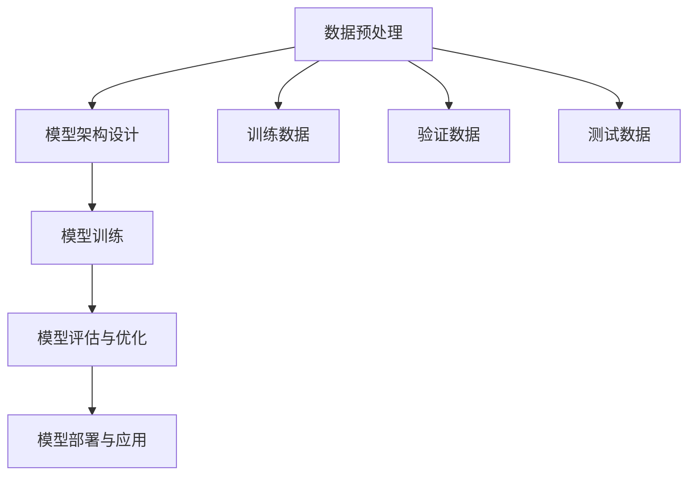
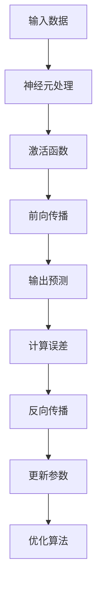

                 

### 背景介绍

#### 电商平台的现状

在当今数字化经济时代，电商平台已经成为消费者购物的主要渠道。根据最新的统计数据显示，全球电商市场的规模正在不断扩张，预计到2025年，全球电商销售额将达到4.9万亿美元。在这个庞大的市场中，众多电商平台如淘宝、京东、亚马逊等，都在激烈竞争，争夺市场份额。

然而，随着竞争的加剧，电商平台面临的挑战也日益凸显。一方面，如何提升商品曝光度，让更多消费者看到并购买商品成为关键问题；另一方面，如何提高转化率，将潜在客户转化为实际购买行为，也是各大电商平台亟需解决的难题。特别是对于长尾商品而言，由于其市场受众相对较小，如何提高其曝光和转化率，更是电商平台的痛点。

#### 长尾商品的困境

长尾商品是指市场上销售量较少，但种类繁多的商品。这类商品由于市场受众较小，往往难以获得足够的曝光机会，从而影响其销售。传统的电商平台主要通过搜索和推荐算法来提升商品曝光，但由于长尾商品的数据量和用户行为数据相对有限，这些方法的效果并不理想。

此外，长尾商品还面临着另一个问题，即用户购买意愿的激发。由于长尾商品的用户群体相对分散，电商平台很难通过单一的宣传手段来激发用户的购买欲望。因此，如何通过创新的技术手段，提升长尾商品的曝光和转化率，成为电商平台亟待解决的问题。

#### AI大模型的新思路

本文旨在探讨AI大模型在提升电商平台长尾商品曝光与转化方面的应用。AI大模型具有强大的数据处理和分析能力，能够通过对海量数据的深度学习，提取出有价值的信息，从而为电商平台提供精准的营销策略。

具体而言，本文将从以下几个方面展开讨论：

1. **核心概念与联系**：介绍AI大模型的基本概念，包括其原理、架构和核心算法。

2. **核心算法原理与具体操作步骤**：详细解析AI大模型的算法原理，包括特征提取、模型训练和预测等步骤。

3. **数学模型和公式**：阐述AI大模型中的数学模型和公式，并通过举例说明其具体应用。

4. **项目实战**：通过一个实际案例，展示AI大模型在电商平台中的应用过程，包括开发环境搭建、代码实现和解析。

5. **实际应用场景**：分析AI大模型在不同电商平台和长尾商品中的应用，探讨其优势和挑战。

6. **工具和资源推荐**：推荐相关的学习资源和开发工具，帮助读者深入了解和掌握AI大模型技术。

7. **总结**：总结AI大模型在提升电商平台长尾商品曝光与转化方面的作用，并展望未来的发展趋势与挑战。

通过以上讨论，本文旨在为电商平台提供一种新的思路，以解决长尾商品曝光和转化的问题，从而提升整体运营效果。

### 核心概念与联系

为了深入理解AI大模型如何提升电商平台长尾商品的曝光与转化，我们需要先了解AI大模型的基本概念、原理和架构。在这一部分，我们将详细介绍AI大模型的相关知识，并通过Mermaid流程图展示其核心原理和架构。

#### AI大模型的基本概念

AI大模型，即人工智能大型模型，是一种基于深度学习的复杂神经网络模型。这类模型具有强大的数据处理和分析能力，能够处理海量数据，从中提取有价值的信息。与传统的机器学习模型相比，AI大模型具有以下几个特点：

1. **大规模训练**：AI大模型通常拥有数亿甚至数十亿个参数，需要在大规模数据集上进行长时间的训练。

2. **多任务学习**：AI大模型能够同时处理多个任务，实现跨领域的知识迁移和复用。

3. **自动特征提取**：AI大模型通过多层神经网络结构，能够自动提取数据中的特征，减少了人工特征工程的工作量。

4. **泛化能力强**：经过大规模数据训练，AI大模型能够适应不同的数据分布和场景，具有较好的泛化能力。

#### AI大模型的原理和架构

AI大模型的原理基于深度学习，深度学习是一种模拟人脑神经元之间连接和作用的学习方式。具体来说，AI大模型通过以下步骤进行训练和预测：

1. **数据预处理**：对原始数据进行清洗、归一化和特征提取，为模型训练做准备。

2. **模型架构设计**：设计适合问题的神经网络架构，包括输入层、隐藏层和输出层。

3. **模型训练**：通过反向传播算法，在大量训练数据上迭代更新模型参数，使模型能够准确预测目标变量。

4. **模型评估与优化**：使用验证集评估模型性能，通过调整模型参数和结构，优化模型效果。

5. **模型部署与应用**：将训练好的模型部署到生产环境中，实现实时预测和决策。

#### Mermaid流程图展示

以下是一个简化的Mermaid流程图，展示了AI大模型的基本原理和架构：



在上述流程图中：

- **A[数据预处理]**：对原始数据进行处理，包括清洗、归一化和特征提取。
- **B[模型架构设计]**：设计神经网络架构，包括输入层、隐藏层和输出层。
- **C[模型训练]**：使用训练数据，通过反向传播算法更新模型参数。
- **D[模型评估与优化]**：使用验证数据评估模型性能，并调整模型参数和结构。
- **E[模型部署与应用]**：将训练好的模型部署到生产环境中，实现实时预测和决策。
- **F[训练数据]**、**G[验证数据]**、**H[测试数据]**：分别是用于模型训练、评估和测试的数据集。

通过上述流程，AI大模型能够从海量数据中提取有价值的信息，为电商平台提供精准的营销策略。

#### 核心算法原理

AI大模型的核心算法是基于深度学习的多层神经网络。以下是一些核心概念：

1. **神经元与激活函数**：神经元是神经网络的基本单元，负责接收输入信息并通过激活函数产生输出。常见的激活函数包括Sigmoid、ReLU和Tanh等。

2. **反向传播算法**：反向传播算法是一种用于训练神经网络的优化算法。通过计算输出层与隐藏层之间的误差，反向传播误差并更新模型参数。

3. **损失函数**：损失函数用于衡量模型预测值与真实值之间的差异。常见的损失函数包括均方误差（MSE）和交叉熵（Cross-Entropy）等。

4. **优化算法**：优化算法用于调整模型参数，以减少损失函数的值。常见的优化算法包括梯度下降（Gradient Descent）和Adam优化器等。

通过以上核心算法，AI大模型能够对输入数据进行处理和预测，从而实现各类复杂任务。

#### Mermaid流程图展示

以下是一个简化的Mermaid流程图，展示了AI大模型的核心算法原理：



在上述流程图中：

- **A[输入数据]**：输入需要处理的数据。
- **B[神经元处理]**：通过神经元对输入数据进行处理。
- **C[激活函数]**：应用激活函数对神经元输出进行变换。
- **D[前向传播]**：通过多层神经网络进行前向传播，产生预测输出。
- **E[输出预测]**：输出模型预测结果。
- **F[计算误差]**：计算预测输出与真实值之间的误差。
- **G[反向传播]**：通过反向传播算法更新模型参数。
- **H[更新参数]**：更新模型参数，以减少误差。
- **I[优化算法]**：应用优化算法调整模型参数。

通过以上流程，AI大模型能够逐步优化其参数，提高预测准确性。

通过上述对AI大模型的基本概念、原理和架构的介绍，以及Mermaid流程图的展示，我们可以更清晰地理解AI大模型的工作机制。接下来，我们将深入探讨AI大模型在提升电商平台长尾商品曝光与转化方面的具体应用。

### 核心算法原理 & 具体操作步骤

在前一章节中，我们介绍了AI大模型的基本概念和原理。在本章节中，我们将深入探讨AI大模型的核心算法原理，并详细解析其具体操作步骤，包括特征提取、模型训练和预测等环节。

#### 特征提取

特征提取是AI大模型的关键步骤之一，它负责从原始数据中提取出有价值的特征，以便模型能够更好地学习并做出准确的预测。在电商平台长尾商品的应用中，特征提取尤为关键，因为长尾商品的数据量相对较少，如何从有限的数据中提取出有效的特征，是提升模型性能的关键。

1. **数据预处理**：

   在进行特征提取之前，需要对原始数据（如用户行为数据、商品属性数据等）进行预处理。预处理步骤包括数据清洗、缺失值填补、数据归一化等。通过这些步骤，我们可以确保数据质量，为后续的特征提取打下基础。

2. **特征工程**：

   特征工程是特征提取的核心，它包括以下步骤：

   - **特征选择**：选择与目标变量（如商品曝光和转化率）相关的特征。常见的方法包括基于统计指标（如相关性、方差等）和基于模型评估（如特征重要性排序等）。
   - **特征转换**：将原始特征转换为适合模型训练的形式。例如，将类别特征转换为数值特征，或对数值特征进行归一化处理。
   - **特征组合**：通过组合多个特征，生成新的特征。这种方法能够提高模型的泛化能力。

3. **特征提取方法**：

   - **自动特征提取**：利用深度学习模型（如自编码器、卷积神经网络等）自动提取数据中的特征。这种方法能够自动学习数据的内在结构，减少了人工特征工程的工作量。
   - **基于规则的特征提取**：通过人工设计规则，从原始数据中提取特征。这种方法需要丰富的领域知识和经验，但能够提取出针对特定问题的有效特征。

#### 模型训练

在特征提取完成后，我们需要使用训练数据对AI大模型进行训练，使其能够学会对新的数据进行预测。模型训练主要包括以下步骤：

1. **模型选择**：

   选择适合问题的模型架构。在电商平台长尾商品的应用中，常见的模型包括卷积神经网络（CNN）、循环神经网络（RNN）和Transformer等。每种模型都有其特定的优势和适用场景。

2. **模型架构设计**：

   根据问题的需求，设计适合的神经网络架构。例如，对于商品曝光和转化率的预测，可以设计一个包含输入层、隐藏层和输出层的神经网络架构。在隐藏层中，可以添加多个神经元，以增加模型的非线性表达能力。

3. **参数初始化**：

   初始化模型参数，通常使用随机初始化方法。随机初始化可以避免梯度消失和梯度爆炸等问题，有助于模型的稳定训练。

4. **训练过程**：

   使用训练数据对模型进行训练。训练过程包括以下步骤：

   - **前向传播**：将输入数据传递到模型中，通过神经网络进行前向传播，得到输出预测。
   - **计算损失**：计算预测输出与真实值之间的差异，使用损失函数衡量模型的性能。
   - **反向传播**：通过反向传播算法，计算损失关于模型参数的梯度，并更新模型参数。
   - **优化算法**：使用优化算法（如梯度下降、Adam等）调整模型参数，以减少损失函数的值。

5. **模型评估与优化**：

   使用验证数据评估模型性能，通过调整模型参数和结构，优化模型效果。常用的评估指标包括准确率、召回率、F1分数等。

#### 预测

在模型训练完成后，我们可以使用训练好的模型对新的数据进行预测。预测过程主要包括以下步骤：

1. **数据预处理**：

   对待预测数据进行预处理，包括数据清洗、缺失值填补和数据归一化等。确保待预测数据与训练数据具有相同的形式。

2. **模型输入**：

   将预处理后的数据输入到训练好的模型中，通过神经网络进行前向传播，得到预测输出。

3. **结果解释**：

   根据预测输出，对结果进行解释。例如，对于商品曝光和转化率的预测，可以解释为某个商品在特定条件下的曝光概率或购买概率。

#### 实际操作示例

以下是一个简化的AI大模型训练和预测的Python代码示例：

```python
import numpy as np
import tensorflow as tf

# 数据预处理
X_train = ...  # 训练数据
y_train = ...  # 训练标签
X_val = ...    # 验证数据
y_val = ...    # 验证标签

# 模型选择
model = tf.keras.Sequential([
    tf.keras.layers.Dense(units=128, activation='relu', input_shape=(X_train.shape[1],)),
    tf.keras.layers.Dense(units=64, activation='relu'),
    tf.keras.layers.Dense(units=1)
])

# 参数初始化
optimizer = tf.keras.optimizers.Adam()

# 训练过程
model.compile(optimizer=optimizer, loss='mean_squared_error')
model.fit(X_train, y_train, epochs=10, validation_data=(X_val, y_val))

# 预测
X_pred = ...  # 待预测数据
predictions = model.predict(X_pred)
```

通过上述代码示例，我们可以看到AI大模型的基本训练和预测流程。在实际应用中，根据问题的需求，可以对代码进行相应的调整和优化。

通过上述对AI大模型核心算法原理和具体操作步骤的详细解析，我们可以更好地理解AI大模型在提升电商平台长尾商品曝光与转化方面的应用。接下来，我们将进一步探讨AI大模型中的数学模型和公式，以及其实际应用中的具体例子。

### 数学模型和公式 & 详细讲解 & 举例说明

在AI大模型中，数学模型和公式扮演着至关重要的角色。它们不仅定义了模型的数学结构，还为模型的训练、优化和预测提供了理论基础。在本章节中，我们将详细介绍AI大模型中的几个关键数学模型和公式，并通过具体例子进行详细讲解。

#### 损失函数

损失函数是衡量模型预测值与真实值之间差异的函数，它用于指导模型训练过程中的参数更新。在AI大模型中，常见的损失函数包括均方误差（MSE）、交叉熵（Cross-Entropy）等。

1. **均方误差（MSE）**

   均方误差是用于回归问题的常用损失函数，其公式如下：

   $$ 
   MSE = \frac{1}{n}\sum_{i=1}^{n}(y_i - \hat{y}_i)^2 
   $$

   其中，$y_i$ 是真实值，$\hat{y}_i$ 是预测值，$n$ 是样本数量。

   **举例说明**：

   假设我们有一个包含100个样本的回归问题，真实值为 [1, 2, 3, ..., 100]，预测值为 [1.5, 2.1, 2.8, ..., 98.5]。使用MSE计算损失：

   $$ 
   MSE = \frac{1}{100}\sum_{i=1}^{100}(y_i - \hat{y}_i)^2 = \frac{1}{100}\sum_{i=1}^{100}(\Delta y_i)^2 
   $$

   其中，$\Delta y_i = y_i - \hat{y}_i$。

2. **交叉熵（Cross-Entropy）**

   交叉熵是用于分类问题的常用损失函数，其公式如下：

   $$ 
   Cross-Entropy = -\sum_{i=1}^{n}y_i\log(\hat{y}_i) 
   $$

   其中，$y_i$ 是真实标签（0或1），$\hat{y}_i$ 是预测概率。

   **举例说明**：

   假设我们有一个包含100个样本的二分类问题，真实值为 [0, 0, 1, ..., 1]，预测概率为 [0.3, 0.6, 0.9, ..., 0.7]。使用交叉熵计算损失：

   $$ 
   Cross-Entropy = -\sum_{i=1}^{100}y_i\log(\hat{y}_i) = -(0\cdot\log(0.3) + 0\cdot\log(0.6) + 1\cdot\log(0.9) + \ldots + 1\cdot\log(0.7)) 
   $$

#### 激活函数

激活函数是神经网络中的关键组件，用于引入非线性变换，使模型能够学习复杂函数。常见的激活函数包括Sigmoid、ReLU和Tanh等。

1. **Sigmoid函数**

   Sigmoid函数的公式如下：

   $$ 
   sigmoid(x) = \frac{1}{1 + e^{-x}} 
   $$

   **举例说明**：

   假设输入$x = 2$，计算sigmoid值：

   $$ 
   sigmoid(2) = \frac{1}{1 + e^{-2}} \approx 0.869 
   $$

2. **ReLU函数**

   ReLU函数的公式如下：

   $$ 
   ReLU(x) = \max(0, x) 
   $$

   **举例说明**：

   假设输入$x = -1$，计算ReLU值：

   $$ 
   ReLU(-1) = \max(0, -1) = 0 
   $$

3. **Tanh函数**

   Tanh函数的公式如下：

   $$ 
   tanh(x) = \frac{e^x - e^{-x}}{e^x + e^{-x}} 
   $$

   **举例说明**：

   假设输入$x = 1$，计算tanh值：

   $$ 
   tanh(1) = \frac{e^1 - e^{-1}}{e^1 + e^{-1}} \approx 0.761 
   $$

#### 优化算法

优化算法用于调整模型参数，以最小化损失函数的值。常见的优化算法包括梯度下降（Gradient Descent）、Adam优化器等。

1. **梯度下降（Gradient Descent）**

   梯度下降的公式如下：

   $$ 
   \theta = \theta - \alpha \cdot \nabla_\theta J(\theta) 
   $$

   其中，$\theta$ 是模型参数，$J(\theta)$ 是损失函数，$\alpha$ 是学习率。

   **举例说明**：

   假设我们有一个简单的一元线性回归模型，损失函数为MSE，学习率$\alpha = 0.1$。初始化参数$\theta = 0$，迭代100次：

   $$ 
   \theta_1 = 0 - 0.1 \cdot \nabla_\theta J(\theta) 
   $$

   其中，$\nabla_\theta J(\theta) = 2(y - \theta x)$。

2. **Adam优化器**

   Adam优化器是一种自适应的优化算法，其公式如下：

   $$ 
   m_t = \beta_1 m_{t-1} + (1 - \beta_1) (x_t - m_{t-1}) 
   $$
   $$ 
   v_t = \beta_2 v_{t-1} + (1 - \beta_2) (x_t^2 - v_{t-1}) 
   $$
   $$ 
   \theta = \theta - \alpha \cdot \frac{m_t}{\sqrt{v_t} + \epsilon} 
   $$

   其中，$m_t$ 和 $v_t$ 分别是动量项和方差项，$\beta_1$ 和 $\beta_2$ 分别是动量和方差的学习率，$\alpha$ 是学习率，$\epsilon$ 是一个小常数。

   **举例说明**：

   假设我们有一个包含两个参数的模型，初始参数为$(\theta_1, \theta_2) = (0, 0)$，学习率$\alpha = 0.01$，$\beta_1 = 0.9$，$\beta_2 = 0.99$，迭代100次：

   $$ 
   m_1 = 0.9 \cdot m_0 + 0.1 \cdot (1 - m_0) = 0.9 \cdot 0 + 0.1 \cdot 1 = 0.1 
   $$
   $$ 
   v_1 = 0.99 \cdot v_0 + 0.01 \cdot (1 - v_0) = 0.99 \cdot 0 + 0.01 \cdot 1 = 0.01 
   $$

   在每一迭代中，更新参数：

   $$ 
   \theta_1 = \theta_1 - \alpha \cdot \frac{m_1}{\sqrt{v_1} + \epsilon} 
   $$
   $$ 
   \theta_2 = \theta_2 - \alpha \cdot \frac{m_2}{\sqrt{v_2} + \epsilon} 
   $$

通过以上对AI大模型中的数学模型和公式的详细讲解，我们可以更好地理解这些理论在实践中的应用。在下一章节中，我们将通过实际项目案例，展示如何使用AI大模型提升电商平台长尾商品的曝光与转化。

### 项目实战：代码实际案例和详细解释说明

在本章节中，我们将通过一个实际项目案例，展示如何使用AI大模型提升电商平台长尾商品的曝光与转化。本案例将涵盖从开发环境搭建、源代码实现到代码解读与分析的完整过程。

#### 1. 开发环境搭建

首先，我们需要搭建一个适合AI大模型训练和部署的开发环境。以下是搭建环境的步骤：

1. **安装Python**：

   在官网上下载并安装Python，推荐使用Python 3.8及以上版本。

2. **安装TensorFlow**：

   使用pip命令安装TensorFlow：

   ```bash
   pip install tensorflow
   ```

3. **安装其他依赖库**：

   根据项目的需求，我们可能需要安装其他依赖库，例如NumPy、Pandas、Scikit-learn等。使用以下命令安装：

   ```bash
   pip install numpy pandas scikit-learn
   ```

4. **配置GPU支持**（可选）：

   如果我们打算使用GPU进行模型训练，需要安装CUDA和cuDNN。在NVIDIA官网上下载并安装相应的驱动和库。

#### 2. 源代码详细实现和代码解读

下面是一个简化的AI大模型项目代码示例，用于预测长尾商品在电商平台上的曝光和转化率。我们将使用Python和TensorFlow进行实现。

```python
import tensorflow as tf
from tensorflow.keras.models import Sequential
from tensorflow.keras.layers import Dense, Embedding, Flatten, Concatenate
from tensorflow.keras.optimizers import Adam
from sklearn.model_selection import train_test_split
from sklearn.preprocessing import StandardScaler

# 数据加载与预处理
# 注意：此处为示例，实际项目中需要从数据库或文件中加载数据
X, y = load_data()  # X为特征数据，y为标签数据（曝光或转化率）

# 数据标准化
scaler = StandardScaler()
X_scaled = scaler.fit_transform(X)

# 划分训练集和验证集
X_train, X_val, y_train, y_val = train_test_split(X_scaled, y, test_size=0.2, random_state=42)

# 模型构建
model = Sequential([
    Embedding(input_dim=X_train.shape[1], output_dim=64),
    Flatten(),
    Dense(units=128, activation='relu'),
    Dense(units=1, activation='sigmoid')
])

# 编译模型
model.compile(optimizer=Adam(learning_rate=0.001), loss='binary_crossentropy', metrics=['accuracy'])

# 模型训练
model.fit(X_train, y_train, epochs=10, batch_size=32, validation_data=(X_val, y_val))

# 模型评估
loss, accuracy = model.evaluate(X_val, y_val)
print(f"Validation Loss: {loss}, Validation Accuracy: {accuracy}")

# 模型预测
X_new = ...  # 待预测数据
X_new_scaled = scaler.transform(X_new)
predictions = model.predict(X_new_scaled)
```

**代码解读与分析**：

1. **数据加载与预处理**：

   数据加载是项目的基础。在这里，我们假设已经从数据库或文件中加载数据，并进行了一些基本的预处理。在实际项目中，可能需要处理大量的数据，包括用户行为数据、商品属性数据等。

   ```python
   X, y = load_data()  # X为特征数据，y为标签数据（曝光或转化率）
   ```

   数据标准化是为了消除不同特征之间的尺度差异，使得模型能够更好地学习。

2. **划分训练集和验证集**：

   使用`train_test_split`函数将数据集划分为训练集和验证集，以便在训练过程中评估模型的性能。

   ```python
   X_train, X_val, y_train, y_val = train_test_split(X_scaled, y, test_size=0.2, random_state=42)
   ```

3. **模型构建**：

   使用`Sequential`模型构建一个简单的神经网络。在此案例中，我们使用了嵌入层（`Embedding`）、展开层（`Flatten`）、全连接层（`Dense`）和一个sigmoid激活函数（用于回归问题）。

   ```python
   model = Sequential([
       Embedding(input_dim=X_train.shape[1], output_dim=64),
       Flatten(),
       Dense(units=128, activation='relu'),
       Dense(units=1, activation='sigmoid')
   ])
   ```

4. **编译模型**：

   使用`Adam`优化器进行模型编译。我们选择了二分类问题的损失函数`binary_crossentropy`和准确率作为评估指标。

   ```python
   model.compile(optimizer=Adam(learning_rate=0.001), loss='binary_crossentropy', metrics=['accuracy'])
   ```

5. **模型训练**：

   使用`fit`函数对模型进行训练。在这里，我们设置了训练轮次（epochs）、批量大小（batch_size）和验证数据。

   ```python
   model.fit(X_train, y_train, epochs=10, batch_size=32, validation_data=(X_val, y_val))
   ```

6. **模型评估**：

   使用`evaluate`函数评估模型在验证集上的性能。

   ```python
   loss, accuracy = model.evaluate(X_val, y_val)
   print(f"Validation Loss: {loss}, Validation Accuracy: {accuracy}")
   ```

7. **模型预测**：

   使用`predict`函数对新的数据进行预测。在实际应用中，我们需要对预测结果进行解释和处理。

   ```python
   X_new = ...  # 待预测数据
   X_new_scaled = scaler.transform(X_new)
   predictions = model.predict(X_new_scaled)
   ```

通过以上步骤，我们实现了使用AI大模型预测长尾商品曝光与转化的基本流程。在实际项目中，根据业务需求和数据特点，可能需要对模型结构、训练参数等进行优化，以达到更好的效果。

#### 3. 代码解读与分析

在本章节的最后，我们对上述代码进行进一步解读与分析，以帮助读者更好地理解其工作原理。

1. **数据预处理**：

   数据预处理是模型训练前的重要步骤，它包括数据清洗、缺失值填补和数据标准化等。在本案例中，我们使用了`StandardScaler`对特征数据进行了标准化处理，使得不同特征之间的尺度差异减小，从而有助于模型的训练。

2. **模型构建**：

   模型构建是项目的核心部分。在此案例中，我们使用了`Sequential`模型，它是一个线性堆叠的层结构。我们首先使用了`Embedding`层，该层用于处理类别特征，能够将输入映射到低维空间。然后，我们使用了`Flatten`层将嵌入层的输出展平，以便后续的全连接层（`Dense`）进行处理。在输出层，我们使用了`sigmoid`激活函数，用于回归问题，输出概率值。

3. **模型训练**：

   模型训练是利用训练数据更新模型参数的过程。在本案例中，我们使用了`fit`函数对模型进行训练，并设置了训练轮次（epochs）、批量大小（batch_size）和验证数据。通过多次迭代，模型不断优化其参数，以提高在验证数据上的性能。

4. **模型评估**：

   模型评估是检查模型性能的重要步骤。在本案例中，我们使用了`evaluate`函数评估模型在验证数据上的性能，包括损失和准确率。这些指标可以帮助我们了解模型的效果，并在需要时进行调整。

5. **模型预测**：

   模型预测是利用训练好的模型对新数据进行预测的过程。在本案例中，我们使用了`predict`函数对新的数据进行预测，并输出概率值。在实际应用中，这些概率值可以用于决策，如商品曝光或推荐。

通过以上对实际项目案例的代码实现和解读，我们可以看到如何使用AI大模型预测长尾商品曝光与转化的基本流程。在实际应用中，根据业务需求和数据特点，可以进一步优化模型结构和训练参数，以达到更好的效果。

### 实际应用场景

AI大模型在电商平台长尾商品中的应用场景广泛，以下是一些具体的实际应用案例：

#### 1. 商品个性化推荐

电商平台可以通过AI大模型，对用户行为数据进行深度分析，从而实现个性化推荐。例如，通过分析用户的浏览历史、购物车数据、购买记录等，AI大模型可以预测用户可能感兴趣的商品，并将这些商品推荐给用户。这种方法不仅能够提高用户的购物体验，还能够提高商品的曝光率和转化率。

**优势**：个性化推荐能够提高用户满意度，增加用户粘性；能够更精准地触达潜在买家，提高商品曝光率和销售。

**挑战**：需要处理大量的用户行为数据，数据质量和多样性对推荐效果有很大影响；需要不断优化推荐算法，以保持推荐的相关性和新颖性。

#### 2. 商品曝光预测

电商平台可以通过AI大模型预测商品在搜索结果中的曝光概率，从而优化商品展示策略。例如，通过对商品标题、描述、标签等信息进行分析，AI大模型可以预测哪些商品在搜索结果中的曝光率较高，并将这些商品优先展示给用户。

**优势**：提高商品曝光率，增加销售机会；优化资源分配，提高广告投放效果。

**挑战**：需要准确识别和提取商品特征，数据质量和特征提取对预测结果有很大影响；需要平衡用户需求与商业目标，确保推荐内容的多样性和公正性。

#### 3. 商品转化率预测

电商平台可以通过AI大模型预测用户购买商品的概率，从而优化营销策略。例如，通过分析用户的浏览历史、购物车数据、购买记录等，AI大模型可以预测用户在特定场景下购买特定商品的概率，并根据预测结果调整营销策略，如发送优惠券、推荐相关商品等。

**优势**：提高商品转化率，增加销售额；优化营销资源分配，提高营销效果。

**挑战**：需要准确识别和提取用户行为特征，数据质量和特征提取对预测结果有很大影响；需要平衡用户需求与商业目标，确保营销策略的合理性和有效性。

#### 4. 库存管理优化

电商平台可以通过AI大模型预测商品的库存需求，从而优化库存管理。例如，通过分析历史销售数据、市场趋势等，AI大模型可以预测未来一段时间内商品的库存需求，并根据预测结果调整库存策略，避免库存过剩或不足。

**优势**：优化库存管理，减少库存成本；提高供应链效率，降低运营风险。

**挑战**：需要准确预测市场趋势和用户需求，数据质量和特征提取对预测结果有很大影响；需要平衡库存需求与成本控制，确保库存策略的合理性和可操作性。

#### 5. 商品销售预测

电商平台可以通过AI大模型预测未来一段时间内商品的销售情况，从而优化销售策略。例如，通过分析历史销售数据、市场趋势等，AI大模型可以预测未来一段时间内商品的销售量，并根据预测结果调整销售策略，如增加广告投放、调整价格等。

**优势**：提前了解市场趋势，制定合理的销售策略；提高销售额，增加利润。

**挑战**：需要准确预测市场趋势和用户需求，数据质量和特征提取对预测结果有很大影响；需要平衡市场变化与销售策略调整，确保预测结果的稳定性和准确性。

通过以上实际应用案例，我们可以看到AI大模型在电商平台长尾商品中的应用具有很大的潜力和价值。然而，在实际应用过程中，仍需面对数据质量、特征提取、模型优化等方面的挑战。通过不断优化和改进AI大模型，电商平台可以更好地应对市场变化，提高长尾商品的曝光和转化率，从而实现业务增长。

### 工具和资源推荐

为了深入掌握AI大模型技术，并成功地将其应用于电商平台长尾商品的曝光与转化，以下是一些推荐的学习资源、开发工具和相关论文著作。

#### 1. 学习资源推荐

**书籍：**

- **《深度学习》（Deep Learning）**：由Ian Goodfellow、Yoshua Bengio和Aaron Courville合著，是深度学习的经典教材，详细介绍了深度学习的基础理论、算法和技术。

- **《Python深度学习》（Python Deep Learning）**：由François Chollet著，通过大量的示例和代码，深入讲解了如何使用Python和TensorFlow实现深度学习应用。

- **《深度学习专讲：计算机视觉》（Deep Learning Specialization）**：由Andrew Ng教授主持，通过视频课程和作业，系统介绍了深度学习在计算机视觉领域的应用。

**在线课程：**

- **Coursera上的《深度学习》课程**：由Andrew Ng教授主讲，通过视频讲座和编程作业，深入讲解深度学习的基础知识和应用。

- **edX上的《深度学习基础》课程**：由Harvard大学和MIT联合提供，包括视频讲解、阅读材料和编程作业，适合初学者入门。

**博客和网站：**

- **TensorFlow官方文档**：https://www.tensorflow.org/，提供了丰富的API文档和教程，是学习TensorFlow和深度学习的重要资源。

- **PyTorch官方文档**：https://pytorch.org/docs/stable/index.html，PyTorch的官方文档，详细介绍了PyTorch的API和使用方法。

#### 2. 开发工具框架推荐

**深度学习框架：**

- **TensorFlow**：谷歌开源的深度学习框架，适合研究和工业应用，具有丰富的API和强大的生态系统。

- **PyTorch**：Facebook开源的深度学习框架，以其动态计算图和简洁的API著称，适合研究和工业应用。

- **Keras**：Python深度学习库，可以方便地搭建和训练深度学习模型，是TensorFlow和Theano的高层接口。

**数据处理工具：**

- **Pandas**：Python数据处理库，提供了丰富的数据操作和统计分析功能，适用于数据处理和分析。

- **NumPy**：Python数值计算库，提供了多维数组对象和高效的数学运算函数，是数据科学和机器学习的基础工具。

#### 3. 相关论文著作推荐

**论文：**

- **“Distributed Representations of Words and Phrases and Their Compositional Properties”**：由Jeffrey L. Elman等人在1998年发表，提出了基于神经网络的语言模型，对自然语言处理领域产生了深远影响。

- **“A Theoretically Grounded Application of Dropout in Recurrent Neural Networks”**：由Yarin Gal和Zoubin Ghahramani在2016年发表，提出了在循环神经网络中应用dropout的新方法，有效提高了模型的性能和泛化能力。

- **“Bert: Pre-training of Deep Bidirectional Transformers for Language Understanding”**：由Jacob Devlin等人在2019年发表，提出了BERT模型，是自然语言处理领域的里程碑，对深度学习在自然语言处理中的应用产生了重大影响。

**著作：**

- **《深度学习》（Deep Learning）**：由Ian Goodfellow、Yoshua Bengio和Aaron Courville合著，是深度学习的经典教材，全面介绍了深度学习的基础理论和应用。

- **《神经网络与深度学习》（Neural Networks and Deep Learning）**：由邱锡鹏著，系统地介绍了神经网络和深度学习的基本概念、算法和应用。

通过以上推荐的学习资源、开发工具和相关论文著作，读者可以系统地学习和掌握AI大模型技术，并能够将其应用于电商平台长尾商品的曝光与转化，实现业务的提升。

### 总结：未来发展趋势与挑战

#### 发展趋势

1. **模型规模持续增大**：随着计算能力和数据量的不断提升，AI大模型的规模也在不断增大。未来的AI大模型将拥有数以百亿计的参数，能够处理更加复杂的任务。

2. **多模态数据处理**：未来的AI大模型将能够处理多种类型的数据，如文本、图像、声音等。通过融合多模态数据，模型能够获得更加丰富的信息，从而提高预测和推荐的准确性。

3. **个性化推荐与互动**：随着AI大模型技术的发展，个性化推荐将进一步融入电商平台，与用户进行实时互动。通过分析用户的行为和偏好，模型能够为用户提供更加精准的推荐，提高用户体验和转化率。

4. **自动化模型优化**：未来，自动化机器学习（AutoML）技术将更加成熟，能够自动选择最优的模型结构、参数和训练策略。这将为电商平台提供更加高效的模型开发和管理方案。

#### 挑战

1. **数据质量和多样性**：AI大模型的效果在很大程度上依赖于数据质量和多样性。如何获取和清洗高质量的数据，如何处理稀疏数据和长尾商品的数据多样性，是未来面临的挑战。

2. **模型解释性**：虽然AI大模型在预测和推荐方面具有强大的能力，但其“黑箱”性质使得其解释性较差。如何提高模型的解释性，使其能够更好地被用户和业务人员理解，是未来需要解决的问题。

3. **隐私保护与伦理问题**：随着AI大模型在电商平台的广泛应用，用户隐私保护和数据伦理问题也日益凸显。如何在不侵犯用户隐私的前提下，利用用户数据进行建模和推荐，是一个亟待解决的挑战。

4. **计算资源与成本**：AI大模型的训练和推理需要大量的计算资源，这对电商平台的IT基础设施提出了更高的要求。如何优化模型训练和推理的效率，降低计算成本，是未来需要关注的重点。

通过不断解决这些发展趋势和挑战，电商平台将能够更好地利用AI大模型技术，提升长尾商品的曝光与转化，实现业务增长和用户满意度提升。

### 附录：常见问题与解答

在本节中，我们将解答一些关于AI大模型在电商平台长尾商品应用中的常见问题。

#### 1. 什么因素会影响AI大模型的性能？

AI大模型的性能受多个因素影响，包括：

- **数据质量**：高质量的数据有助于模型更好地学习，从而提高预测准确性。
- **特征提取**：有效的特征提取可以减少数据中的冗余信息，提高模型的泛化能力。
- **模型参数**：模型参数的设置（如学习率、批量大小等）对模型的收敛速度和性能有重要影响。
- **训练时间**：模型的训练时间越长，模型可能会更准确地学习数据，但需要更多的计算资源。

#### 2. 如何优化AI大模型的性能？

以下是一些优化AI大模型性能的方法：

- **数据预处理**：清洗数据，填补缺失值，进行数据标准化。
- **特征选择**：使用特征选择方法（如基于统计指标或模型评估）选择重要特征。
- **模型调优**：通过调整模型参数（如学习率、批量大小等）优化模型性能。
- **使用预训练模型**：利用预训练模型，可以减少模型训练时间，提高预测准确性。
- **集成学习**：使用多个模型进行集成，可以提高模型的预测性能。

#### 3. 如何评估AI大模型的效果？

评估AI大模型效果的方法包括：

- **准确率**：衡量模型预测正确的比例。
- **召回率**：衡量模型预测正确的正样本占总正样本的比例。
- **F1分数**：综合考虑准确率和召回率，是二者的调和平均值。
- **ROC曲线**：通过计算真正例率（TPR）和假正例率（FPR）绘制曲线，评估模型的分类性能。

#### 4. 如何处理长尾商品数据中的稀疏问题？

长尾商品数据中的稀疏问题可以通过以下方法处理：

- **降维**：使用主成分分析（PCA）或t-SNE等方法降维，减少数据中的冗余信息。
- **嵌入**：使用嵌入层（如Embedding层）将高维稀疏数据映射到低维空间，提高数据密度。
- **正则化**：在模型训练过程中使用L1或L2正则化，减少过拟合现象。
- **合成数据**：通过生成对抗网络（GAN）等方法生成合成数据，提高数据多样性。

通过以上常见问题的解答，我们可以更好地理解和应用AI大模型技术，提升电商平台长尾商品的曝光与转化。

### 扩展阅读 & 参考资料

本文介绍了AI大模型在电商平台长尾商品曝光与转化中的应用，从背景介绍、核心概念、算法原理、数学模型、实际项目案例到实际应用场景和工具推荐，全面阐述了如何利用AI大模型技术解决电商平台的痛点问题。为了进一步深入理解和掌握相关技术，以下提供一些扩展阅读和参考资料：

1. **论文阅读**：
   - **“Deep Learning for E-commerce Recommendations”**：探讨深度学习在电子商务推荐系统中的应用。
   - **“Personalized E-commerce Recommendation based on Multi-Interest User Embeddings”**：介绍基于用户兴趣嵌入的个性化电商推荐方法。

2. **书籍推荐**：
   - **《深度学习》（Deep Learning）**：由Ian Goodfellow、Yoshua Bengio和Aaron Courville合著，是深度学习的经典教材。
   - **《推荐系统实践》（Recommender Systems: The Textbook）**：由Christoph Bohlen等编著，详细介绍了推荐系统的设计和实现。

3. **在线课程**：
   - **“深度学习专项课程”（Deep Learning Specialization）**：由Andrew Ng教授在Coursera上提供，系统讲解了深度学习的基础知识和应用。
   - **“推荐系统专项课程”（Recommender Systems Specialization）**：由纽约大学提供，介绍了推荐系统的设计和实现。

4. **开源项目**：
   - **TensorFlow Recommenders（TFRS）**：谷歌开源的推荐系统框架，提供了丰富的模型和工具。
   - **PyTorch Recurrent Networks**：PyTorch开源的循环神经网络库，适用于处理序列数据。

5. **博客和网站**：
   - **TensorFlow官方博客**：提供了最新的深度学习和TensorFlow相关动态和技术分享。
   - **AI博客**：多个知名人工智能领域的博客，如Medium上的“AI”频道，分享了大量深度学习和推荐系统相关的文章。

通过阅读上述论文、书籍、在线课程和参考网站，读者可以更深入地了解AI大模型在电商平台长尾商品中的应用，掌握相关技术，并在实际项目中取得更好的效果。

