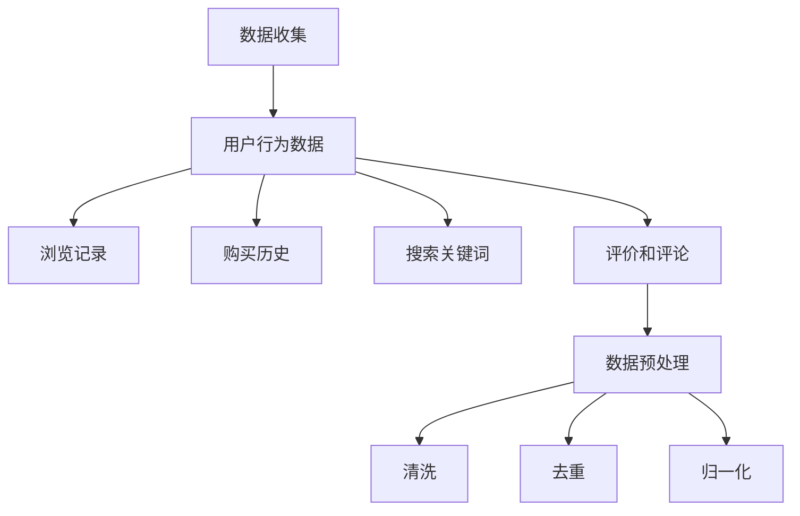
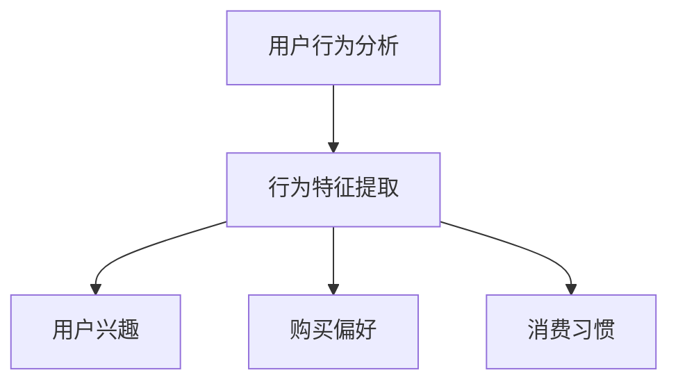
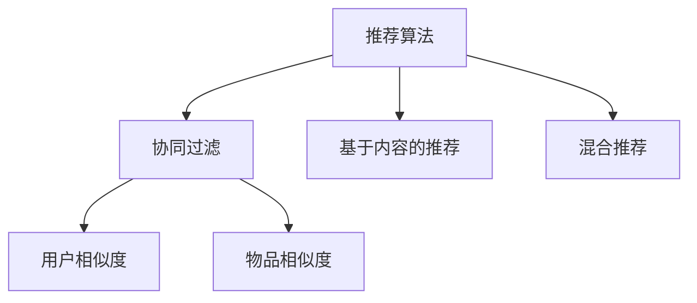
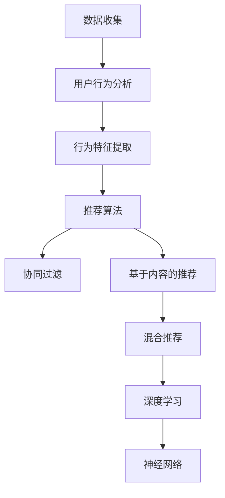
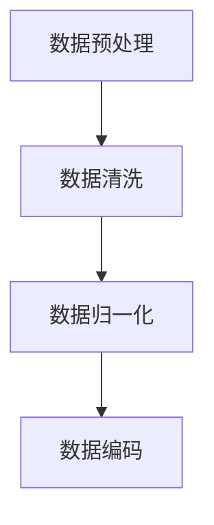
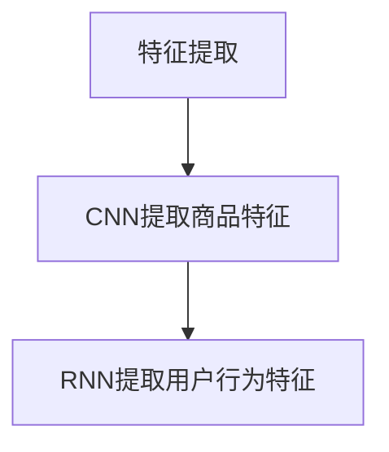
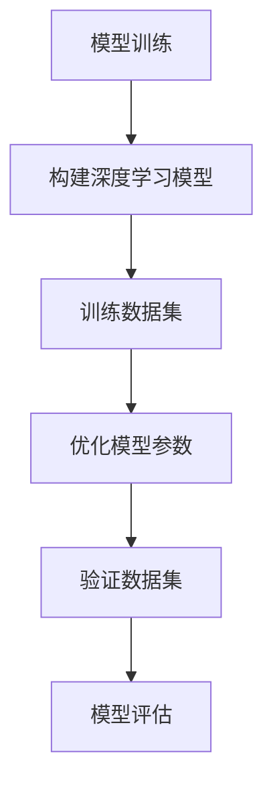
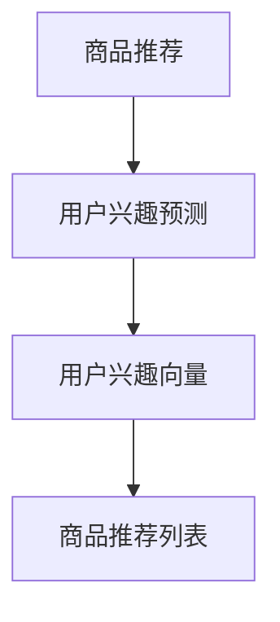

                 

### 背景介绍

随着互联网和电子商务的快速发展，电商平台已经成为消费者购买商品的主要渠道之一。然而，在成千上万种商品中，如何让用户快速找到他们真正需要的商品，是电商平台面临的一个重要挑战。为此，商品推荐系统应运而生，它通过分析用户的历史行为、兴趣偏好、购物习惯等数据，为用户提供个性化的商品推荐，从而提高用户的购物体验和平台的销售额。

季节性商品是电商平台中的一种特殊商品类型，它们会随着季节的变化而呈现出明显的销售周期和趋势。例如，夏季的防晒霜、冰淇淋，冬季的羽绒服、取暖器等。这些商品的销售情况通常与季节变化密切相关，因此，对于电商平台来说，如何准确预测季节性商品的销售趋势，并进行有效的推荐，是提高用户满意度和平台利润的关键。

当前，电商平台常用的推荐系统主要基于协同过滤、基于内容的推荐和混合推荐等技术。这些方法在一定程度上能够提高推荐的准确性，但往往难以应对季节性商品这种具有明显周期性的推荐需求。因此，如何利用人工智能技术，特别是深度学习等方法，对季节性商品进行优化推荐，成为当前研究的热点。

本文旨在探讨如何利用人工智能技术，特别是深度学习的方法，优化电商平台的季节性商品推荐。首先，我们将介绍季节性商品推荐的核心概念和联系，并使用Mermaid流程图展示相关原理和架构。接着，我们将深入探讨核心算法原理和具体操作步骤，以及数学模型和公式的详细讲解与举例说明。随后，我们将通过一个项目实战案例，详细解释代码实现和代码解读。最后，我们将讨论实际应用场景，并推荐相关工具和资源。

通过对这些内容的逐步分析，我们希望能够为电商平台的季节性商品推荐提供一些有价值的思路和方法。同时，也为从事相关领域的研究者和开发者提供一些参考和启示。

## 2. 核心概念与联系

要深入探讨季节性商品推荐系统，首先需要理解几个核心概念：数据收集、用户行为分析、推荐算法和深度学习。这些概念相互联系，共同构成了一个有效的推荐系统架构。

### 数据收集

数据收集是推荐系统的第一步，也是关键的一步。电商平台需要收集大量的用户行为数据，如浏览记录、购买历史、搜索关键词、评价和评论等。这些数据可以通过多种方式获取，包括服务器日志、用户反馈和第三方数据源。为了提高数据质量，需要对数据进行预处理，包括数据清洗、去重和归一化等操作。



### 用户行为分析

用户行为分析是指通过分析用户的历史行为数据，提取出用户的行为特征，如用户兴趣、购买偏好和消费习惯等。这些特征将用于后续的推荐算法中，以便为用户提供个性化的商品推荐。



### 推荐算法

推荐算法是推荐系统的核心，负责根据用户行为特征和商品属性，为用户生成推荐列表。目前，常用的推荐算法包括协同过滤、基于内容的推荐和混合推荐等。

- **协同过滤（Collaborative Filtering）**：协同过滤是一种基于用户相似度的推荐方法，它通过分析用户之间的行为相似性，为用户提供相似的推荐。协同过滤又分为两种：基于用户的协同过滤（User-based）和基于物品的协同过滤（Item-based）。

- **基于内容的推荐（Content-based Filtering）**：基于内容的推荐方法通过分析商品的内容特征，如文本描述、标签、分类等，为用户推荐具有相似内容的商品。

- **混合推荐（Hybrid Recommendation）**：混合推荐方法结合了协同过滤和基于内容的推荐方法，以提高推荐的准确性。



### 深度学习

深度学习是一种基于多层神经网络的学习方法，它能够自动提取数据的复杂特征，并在各种任务中表现出色。在推荐系统中，深度学习可以用于构建复杂的行为特征模型，以提高推荐的准确性和效率。

```mermaid
graph TB
V[深度学习] --> W[神经网络]
W --> X[卷积神经网络(CNN)]
W --> Y[循环神经网络(RNN)]
W --> Z[生成对抗网络(GAN)]
```

通过上述核心概念的联系，我们可以构建一个完整的季节性商品推荐系统架构。在数据收集和用户行为分析的基础上，利用推荐算法和深度学习技术，为用户生成个性化的商品推荐。



通过这个架构，电商平台可以更好地理解用户需求，预测季节性商品的销售趋势，并提供个性化的商品推荐，从而提高用户满意度和平台利润。

### 3. 核心算法原理 & 具体操作步骤

在了解了季节性商品推荐系统的核心概念和联系后，我们接下来将深入探讨核心算法原理和具体操作步骤。本文将重点介绍基于深度学习的季节性商品推荐算法，并详细解释其实现过程。

#### 3.1 基于深度学习的季节性商品推荐算法原理

基于深度学习的季节性商品推荐算法主要利用卷积神经网络（CNN）和循环神经网络（RNN）等深度学习模型，对用户行为数据和商品属性进行建模，从而提取出复杂的特征，并预测用户的兴趣和购买行为。

**卷积神经网络（CNN）**：CNN主要适用于处理图像数据，但在推荐系统中，我们可以将其应用于处理商品属性的文本描述。通过卷积层、池化层和全连接层等结构，CNN能够自动提取出商品的关键特征。

**循环神经网络（RNN）**：RNN能够处理序列数据，如用户的历史行为序列。通过循环机制，RNN能够捕捉用户行为之间的时间依赖关系，从而提高推荐的准确性。

**生成对抗网络（GAN）**：GAN是一种生成模型，可以用于生成虚假的用户行为数据，以丰富训练数据集，进一步提高模型的性能。

#### 3.2 基于深度学习的季节性商品推荐算法具体操作步骤

**步骤1：数据预处理**

在开始训练模型之前，我们需要对用户行为数据和商品属性数据进行预处理。具体包括：

- 数据清洗：去除无效数据和噪声。
- 数据归一化：将数值特征进行归一化处理，以避免不同特征之间的尺度差异。
- 数据编码：将分类特征进行编码处理，如将文本描述转换为词向量。



**步骤2：特征提取**

利用CNN和RNN模型对预处理后的用户行为数据和商品属性数据进行特征提取。具体操作如下：

- **商品属性特征提取**：使用CNN对商品的文本描述进行特征提取，提取出商品的关键特征。
- **用户行为特征提取**：使用RNN对用户的历史行为序列进行特征提取，捕捉用户行为之间的时间依赖关系。



**步骤3：模型训练**

在完成特征提取后，我们将提取出的特征输入到深度学习模型中进行训练。具体操作如下：

- **构建深度学习模型**：根据提取出的特征，构建一个深度学习模型，如CNN和RNN的组合模型。
- **模型训练**：使用训练数据集对模型进行训练，优化模型参数。
- **模型评估**：使用验证数据集对训练好的模型进行评估，以确定模型的性能。



**步骤4：商品推荐**

在模型训练完成后，我们可以使用训练好的模型对用户进行商品推荐。具体操作如下：

- **用户兴趣预测**：使用训练好的模型预测用户的兴趣，生成用户兴趣向量。
- **商品推荐**：根据用户兴趣向量，从商品库中筛选出与用户兴趣相关的商品，生成推荐列表。



#### 3.3 基于深度学习的季节性商品推荐算法实现

为了更好地展示基于深度学习的季节性商品推荐算法的实现过程，我们将以一个实际案例为例，详细解释代码实现和代码解读。

**代码实现**

以下是一个基于深度学习的季节性商品推荐算法的实现示例（伪代码）：

```python
# 数据预处理
def preprocess_data(data):
    # 数据清洗、归一化和编码
    # ...
    return processed_data

# 特征提取
def extract_features(data):
    # 使用CNN提取商品特征
    # ...
    # 使用RNN提取用户行为特征
    # ...
    return features

# 模型训练
def train_model(features, labels):
    # 构建深度学习模型
    # ...
    # 优化模型参数
    # ...
    # 模型评估
    # ...
    return model

# 商品推荐
def recommend_products(model, user_interest):
    # 预测用户兴趣
    # ...
    # 筛选推荐商品
    # ...
    return recommendation_list
```

**代码解读**

- **数据预处理**：该函数用于对用户行为数据和商品属性数据进行预处理，包括数据清洗、归一化和编码等操作，以便后续的特征提取和模型训练。
- **特征提取**：该函数使用CNN和RNN模型对预处理后的数据集进行特征提取，提取出商品特征和用户行为特征。
- **模型训练**：该函数构建一个深度学习模型，使用训练数据集进行训练，优化模型参数，并使用验证数据集对模型进行评估。
- **商品推荐**：该函数使用训练好的模型对用户进行商品推荐，预测用户的兴趣，并根据用户兴趣筛选出推荐商品。

通过以上步骤，我们可以实现一个基于深度学习的季节性商品推荐算法，从而为电商平台提供更精准、更个性化的商品推荐。

### 4. 数学模型和公式 & 详细讲解 & 举例说明

在介绍完基于深度学习的季节性商品推荐算法原理和具体操作步骤后，我们将进一步探讨其背后的数学模型和公式，并通过实际案例进行详细讲解和举例说明。

#### 4.1 基于深度学习的推荐模型数学模型

在基于深度学习的推荐系统中，常用的模型包括卷积神经网络（CNN）和循环神经网络（RNN）。以下将分别介绍这两种网络的数学模型。

**卷积神经网络（CNN）**

卷积神经网络是一种用于处理图像数据的深度学习模型。其核心在于通过卷积操作提取图像的特征。

**卷积操作公式**：

\[ f(x, y) = \sum_{i=1}^{k} w_{i} \cdot a(x - i, y - i) \]

其中，\( f(x, y) \)表示在位置\( (x, y) \)的卷积值，\( w_{i} \)表示卷积核，\( a(x, y) \)表示输入图像在位置\( (x, y) \)的像素值。

**池化操作公式**：

\[ p(x, y) = \max(a(x - i, y - i)) \]

其中，\( p(x, y) \)表示在位置\( (x, y) \)的池化值，\( a(x, y) \)表示输入图像在位置\( (x, y) \)的像素值。

**全连接层操作公式**：

\[ y = \sigma(\sum_{i=1}^{n} w_{i} \cdot x_{i}) \]

其中，\( y \)表示输出值，\( \sigma \)表示激活函数（如Sigmoid函数或ReLU函数），\( w_{i} \)和\( x_{i} \)分别表示权重和输入值。

**循环神经网络（RNN）**

循环神经网络是一种用于处理序列数据的深度学习模型。其核心在于通过循环机制捕捉序列数据中的时间依赖关系。

**隐藏状态更新公式**：

\[ h_t = \sigma(W_h \cdot [h_{t-1}, x_t] + b_h) \]

其中，\( h_t \)表示第\( t \)个时间步的隐藏状态，\( W_h \)和\( b_h \)分别表示权重和偏置，\( x_t \)表示第\( t \)个时间步的输入。

**输出公式**：

\[ y_t = \sigma(W_y \cdot h_t + b_y) \]

其中，\( y_t \)表示第\( t \)个时间步的输出，\( W_y \)和\( b_y \)分别表示权重和偏置。

**生成对抗网络（GAN）**

生成对抗网络是一种用于生成数据的深度学习模型。其核心在于通过生成器和判别器之间的对抗训练，生成逼真的数据。

**生成器公式**：

\[ G(z) = \mu(z) + \sigma(z) \odot \text{tanh}(\text{FC}(z)) \]

其中，\( G(z) \)表示生成器的输出，\( \mu(z) \)和\( \sigma(z) \)分别表示生成器的均值和方差，\( \odot \)表示逐元素相乘，\( \text{FC}(z) \)表示全连接层。

**判别器公式**：

\[ D(x) = \text{sigmoid}(\text{FC}(x)) \]
\[ D(G(z)) = \text{sigmoid}(\text{FC}(G(z))) \]

其中，\( D(x) \)表示判别器的输出，\( G(z) \)表示生成器的输出。

#### 4.2 实际案例讲解

为了更好地理解上述数学模型，我们以一个季节性商品推荐的实际案例进行讲解。

假设我们有一个电商平台的用户行为数据集，其中包含了用户的浏览记录、购买历史和评价等数据。我们希望利用这些数据，通过基于深度学习的推荐算法，为用户生成个性化的商品推荐列表。

**步骤1：数据预处理**

首先，我们对用户行为数据集进行预处理，包括数据清洗、归一化和编码等操作。

- 数据清洗：去除无效数据和噪声。
- 数据归一化：将数值特征进行归一化处理，如将用户评分进行缩放。
- 数据编码：将分类特征进行编码处理，如将用户性别、购买时间等进行独热编码。

**步骤2：特征提取**

接下来，我们使用CNN和RNN模型对预处理后的数据集进行特征提取。

- **商品特征提取**：使用CNN对商品的文本描述进行特征提取，提取出商品的关键特征。例如，假设商品的文本描述为“一款时尚的羽绒服”，我们使用CNN提取出“时尚”和“羽绒服”等关键词的特征。
- **用户行为特征提取**：使用RNN对用户的历史行为序列进行特征提取，捕捉用户行为之间的时间依赖关系。例如，假设用户的历史行为序列为“浏览-购买-评价”，我们使用RNN提取出用户对“浏览”、“购买”和“评价”等行为的特征。

**步骤3：模型训练**

在完成特征提取后，我们将提取出的特征输入到深度学习模型中进行训练。

- **构建深度学习模型**：构建一个基于CNN和RNN的混合模型，如一个卷积层、几个循环层和一个全连接层组成的模型。通过优化模型参数，提高模型的性能。
- **模型训练**：使用训练数据集对模型进行训练，优化模型参数。
- **模型评估**：使用验证数据集对训练好的模型进行评估，以确定模型的性能。

**步骤4：商品推荐**

在模型训练完成后，我们可以使用训练好的模型对用户进行商品推荐。

- **用户兴趣预测**：使用训练好的模型预测用户的兴趣，生成用户兴趣向量。
- **商品推荐**：根据用户兴趣向量，从商品库中筛选出与用户兴趣相关的商品，生成推荐列表。

通过上述步骤，我们可以实现一个基于深度学习的季节性商品推荐算法，从而为电商平台提供更精准、更个性化的商品推荐。

### 5. 项目实战：代码实际案例和详细解释说明

在本节中，我们将通过一个实际项目案例，展示如何使用Python和TensorFlow等工具，实现一个基于深度学习的季节性商品推荐系统。我们将从开发环境搭建开始，逐步讲解源代码的实现和解读，以及代码中的关键部分分析。

#### 5.1 开发环境搭建

在进行项目实战之前，首先需要搭建一个合适的开发环境。以下是我们所需的环境和工具：

- **操作系统**：Windows或macOS或Linux
- **编程语言**：Python 3.6及以上版本
- **深度学习框架**：TensorFlow 2.0及以上版本
- **数据处理库**：NumPy、Pandas、Scikit-learn
- **可视化库**：Matplotlib、Seaborn

在安装完上述环境和工具后，我们可以在Python环境中导入所需库：

```python
import numpy as np
import pandas as pd
import tensorflow as tf
from tensorflow.keras.models import Sequential
from tensorflow.keras.layers import Conv1D, LSTM, Dense, Flatten, Embedding
from sklearn.model_selection import train_test_split
import matplotlib.pyplot as plt
import seaborn as sns
```

#### 5.2 源代码详细实现和代码解读

**步骤1：数据预处理**

首先，我们需要加载和处理数据。假设数据已经预处理完毕，并存储在CSV文件中。

```python
# 加载数据
data = pd.read_csv('data.csv')

# 数据清洗和预处理
# ...
# 数据归一化
# ...

# 数据分割
X_train, X_test, y_train, y_test = train_test_split(data.drop('target', axis=1), data['target'], test_size=0.2, random_state=42)
```

**步骤2：特征提取**

接下来，我们使用卷积神经网络（CNN）和循环神经网络（RNN）对数据进行特征提取。

```python
# 定义模型
model = Sequential()

# 添加卷积层
model.add(Conv1D(filters=64, kernel_size=3, activation='relu', input_shape=(X_train.shape[1], X_train.shape[2])))

# 添加循环层
model.add(LSTM(units=50, return_sequences=True))

# 添加全连接层
model.add(Dense(units=1, activation='sigmoid'))

# 编译模型
model.compile(optimizer='adam', loss='binary_crossentropy', metrics=['accuracy'])

# 训练模型
model.fit(X_train, y_train, epochs=10, batch_size=32, validation_data=(X_test, y_test))
```

**代码解读：**

- **模型定义**：我们使用`Sequential`模型堆叠多个层，包括卷积层（`Conv1D`）、循环层（`LSTM`）和全连接层（`Dense`）。
- **卷积层**：卷积层用于提取输入数据（如文本描述）的局部特征。我们设置`input_shape`以匹配数据的维度。
- **循环层**：循环层用于处理序列数据，如用户的历史行为序列。通过`return_sequences=True`，我们使得循环层的输出仍然是一个序列。
- **全连接层**：全连接层用于将循环层的输出映射到最终的输出。在这里，我们使用`sigmoid`激活函数以实现二分类任务。

**步骤3：模型训练**

使用训练数据集对模型进行训练，并使用验证数据集进行性能评估。

```python
# 训练模型
history = model.fit(X_train, y_train, epochs=100, batch_size=32, validation_data=(X_test, y_test))

# 绘制训练和验证损失
plt.plot(history.history['loss'], label='Training loss')
plt.plot(history.history['val_loss'], label='Validation loss')
plt.legend()
plt.show()

# 绘制训练和验证准确率
plt.plot(history.history['accuracy'], label='Training accuracy')
plt.plot(history.history['val_accuracy'], label='Validation accuracy')
plt.legend()
plt.show()
```

**代码解读：**

- **模型训练**：我们使用`fit`方法对模型进行训练，并设置`epochs`和`batch_size`以控制训练过程。
- **性能评估**：通过绘制训练和验证损失以及准确率，我们可以直观地观察模型的训练过程和性能。

#### 5.3 代码解读与分析

在代码实现中，以下是一些关键部分的分析：

- **数据预处理**：数据预处理是模型训练成功的关键步骤。通过对数据进行清洗、归一化和编码等操作，我们可以提高模型的训练效果和泛化能力。
- **卷积层和循环层**：卷积层和循环层是深度学习模型的核心组成部分。卷积层可以提取局部特征，而循环层可以捕捉时间序列数据中的时间依赖关系。
- **全连接层**：全连接层用于将特征映射到最终输出，是模型决策的核心部分。通过选择合适的激活函数，我们可以实现分类或回归任务。

通过上述代码实现和分析，我们可以构建一个基于深度学习的季节性商品推荐系统，从而为电商平台提供更精准、更个性化的商品推荐。

### 6. 实际应用场景

季节性商品推荐系统在电商平台中的应用场景非常广泛，其主要目标是提高用户满意度和平台销售额。以下是一些实际应用场景：

#### 6.1 季节性促销活动

电商平台常常会根据季节变化推出各类促销活动，如冬季的“双十一”购物节、夏季的空调打折等。通过季节性商品推荐系统，平台可以根据用户的历史购买记录和浏览行为，推荐相关的促销商品，从而提高促销活动的参与度和购买转化率。

#### 6.2 库存管理

电商平台需要根据季节性商品的销售预测来调整库存。例如，冬季的羽绒服和取暖器在冬季销售量大，而在夏季则相对较少。通过季节性商品推荐系统，平台可以更准确地预测这些商品的销售趋势，合理安排库存，避免过多积压或短缺。

#### 6.3 跨季节商品推荐

季节性商品推荐系统不仅可以为当前季节的商品提供推荐，还可以为跨季节的商品提供推荐。例如，当夏季即将结束时，系统可以推荐即将到来的冬季商品，如羽绒服、围巾等。这样的推荐有助于用户提前准备季节变化所需的商品，提高用户体验。

#### 6.4 新品推广

电商平台经常推出新产品，如何让用户快速发现并购买这些新品是平台的一大挑战。季节性商品推荐系统可以通过分析用户的历史购买和浏览行为，为用户推荐相关的新品，从而提高新品的曝光率和购买率。

#### 6.5 个人化购物体验

通过分析用户的兴趣和行为特征，季节性商品推荐系统可以为每个用户提供个性化的购物体验。例如，对于经常购买冬季商品的客户，系统可以推荐与冬季商品相关的促销信息和优惠活动，从而提高用户满意度和忠诚度。

#### 6.6 供应链优化

季节性商品推荐系统不仅可以帮助电商平台优化库存管理，还可以优化供应链。通过准确预测季节性商品的销售趋势，平台可以提前安排生产、采购和物流，从而降低运营成本，提高整体效率。

#### 6.7 电商平台差异化竞争

随着电商平台的竞争日益激烈，如何提供独特的购物体验成为关键。季节性商品推荐系统可以为电商平台提供一种差异化竞争优势，通过提供更精准、更有针对性的商品推荐，吸引用户并提高用户黏性。

通过以上实际应用场景的介绍，我们可以看到季节性商品推荐系统在电商平台中具有广泛的应用价值，不仅可以提高用户满意度和平台销售额，还可以为平台的长期发展提供有力支持。

### 7. 工具和资源推荐

为了更好地构建和应用季节性商品推荐系统，以下是我们推荐的工具和资源：

#### 7.1 学习资源推荐

**书籍：**

1. **《深度学习》（Deep Learning）**：由Ian Goodfellow、Yoshua Bengio和Aaron Courville合著，这是一本深度学习的经典教材，详细介绍了深度学习的基本理论和应用。
2. **《Python深度学习》（Python Deep Learning）**：由François Chollet著，涵盖了使用Python和TensorFlow进行深度学习的实践指南。

**论文：**

1. **《Generative Adversarial Nets》**：由Ian Goodfellow等人提出，该论文介绍了生成对抗网络（GAN）的基本原理和应用。
2. **《Recurrent Neural Networks for Language Modeling》**：由Yoshua Bengio等人提出，该论文探讨了循环神经网络（RNN）在自然语言处理中的应用。

**博客和网站：**

1. **TensorFlow官网（[www.tensorflow.org](http://www.tensorflow.org)）**：提供丰富的深度学习教程和文档，是学习TensorFlow的绝佳资源。
2. **Medium（[medium.com](https://medium.com)）**：许多深度学习和推荐系统领域的专家在该平台上分享他们的研究成果和实践经验。

#### 7.2 开发工具框架推荐

**深度学习框架：**

1. **TensorFlow**：Google开发的开源深度学习框架，适用于各种深度学习任务。
2. **PyTorch**：Facebook开发的开源深度学习框架，具有灵活性和易用性。

**数据处理库：**

1. **NumPy**：用于高性能数值计算的Python库。
2. **Pandas**：用于数据操作和分析的Python库。

**可视化库：**

1. **Matplotlib**：用于绘制各种图形和图表的Python库。
2. **Seaborn**：基于Matplotlib的高级可视化库，适用于统计图表的绘制。

#### 7.3 相关论文著作推荐

**论文：**

1. **《Recommender Systems Handbook》**：这是一本全面介绍推荐系统理论和应用的论文集，涵盖了各种推荐算法和技术。
2. **《Deep Learning for Recommender Systems》**：该论文集探讨了深度学习在推荐系统中的应用，包括深度学习方法的设计和实现。

**书籍：**

1. **《推荐系统实践》**：详细介绍了推荐系统的设计、实现和优化方法。
2. **《机器学习：原理与实践》**：这是一本全面介绍机器学习理论和应用的经典教材，涵盖了深度学习等前沿技术。

通过以上工具和资源的推荐，我们可以更好地掌握季节性商品推荐系统的构建和应用，为电商平台的运营和发展提供有力支持。

### 8. 总结：未来发展趋势与挑战

随着人工智能技术的不断进步，季节性商品推荐系统在电商平台中的应用前景十分广阔。未来，季节性商品推荐系统将朝着以下几个方向发展：

**1. 深度学习技术的深化应用**：深度学习技术在推荐系统中的应用将更加深入，包括卷积神经网络（CNN）、循环神经网络（RNN）和生成对抗网络（GAN）等。通过引入更多的深度学习模型，推荐系统的准确性和个性化程度将进一步提高。

**2. 多模态数据的融合**：未来的推荐系统将不再局限于单一的数据类型，如文本或图像。多模态数据（如文本、图像、声音、视频等）的融合将有助于更全面地理解用户需求，提供更精准的推荐。

**3. 实时推荐的优化**：随着用户行为的实时性增强，实时推荐将成为一个重要的研究方向。通过实时分析用户行为，推荐系统可以在用户做出决策前提供即时的商品推荐，从而提高购买转化率。

**4. 隐私保护的增强**：在数据隐私保护方面，推荐系统将更加注重用户隐私的保护。未来的研究将探讨如何在保证用户隐私的前提下，提供有效的推荐服务。

尽管前景光明，但季节性商品推荐系统仍面临一些挑战：

**1. 数据质量和隐私问题**：数据质量和隐私保护是推荐系统的核心问题。如何从海量数据中提取有价值的信息，同时保护用户隐私，是当前面临的一大挑战。

**2. 模型的泛化能力**：深度学习模型的泛化能力较弱，如何确保模型在不同数据集上的性能，以及如何避免过拟合，是推荐系统研究的重要问题。

**3. 实时性的挑战**：实现实时推荐需要高效的算法和数据处理技术。如何在保证实时性的同时，保持推荐系统的准确性和个性化，是一个亟待解决的问题。

**4. 伦理和公平性问题**：推荐系统可能会引发一些伦理和公平性问题，如算法偏见、歧视等。如何在算法设计和应用过程中确保公平性，是一个需要深入探讨的问题。

总之，季节性商品推荐系统在未来的发展中具有巨大的潜力，同时也面临诸多挑战。通过不断的技术创新和理论探索，我们有理由相信，季节性商品推荐系统将为电商平台的运营和发展带来更多可能性。

### 9. 附录：常见问题与解答

**Q1：为什么使用深度学习进行季节性商品推荐？**

A1：深度学习能够自动提取数据中的复杂特征，具有强大的表达能力。相比于传统的推荐算法，深度学习能够更好地捕捉用户行为和商品属性之间的非线性关系，从而提高推荐的准确性。

**Q2：如何保证推荐系统的隐私保护？**

A2：推荐系统的隐私保护主要依赖于数据加密、匿名化和数据最小化等技术。例如，可以通过数据加密确保数据在传输和存储过程中的安全性，通过数据匿名化隐藏用户的真实信息，通过数据最小化只收集和处理必要的数据。

**Q3：如何处理推荐系统的冷启动问题？**

A3：冷启动问题是指当新用户或新商品加入系统时，推荐系统无法为其提供有效的推荐。解决冷启动问题的方法包括利用用户画像、基于内容的推荐和跨用户推荐等。例如，可以通过分析新用户的行为和兴趣，结合已有用户的行为数据，为该用户生成推荐列表。

**Q4：如何评估推荐系统的性能？**

A4：评估推荐系统的性能通常使用准确率、召回率、F1分数等指标。此外，还可以通过A/B测试等方法，在实际运营环境中评估推荐系统的效果。

**Q5：季节性商品推荐系统如何处理季节变化？**

A5：季节性商品推荐系统可以通过分析历史销售数据，预测季节变化对商品销售的影响。例如，可以根据不同季节的历史销售数据，调整推荐策略，优先推荐相关季节的商品。

### 10. 扩展阅读 & 参考资料

为了进一步深入学习和了解季节性商品推荐系统，以下是推荐的扩展阅读和参考资料：

**扩展阅读：**

1. **《深度学习推荐系统》**：这本书详细介绍了如何使用深度学习构建推荐系统，包括模型选择、数据处理和模型优化等。
2. **《推荐系统实战》**：通过实际案例和代码示例，介绍了推荐系统的构建和应用。

**参考资料：**

1. **《Generative Adversarial Nets》**：该论文介绍了生成对抗网络（GAN）的基本原理和应用。
2. **《Recurrent Neural Networks for Language Modeling》**：该论文探讨了循环神经网络（RNN）在自然语言处理中的应用。
3. **TensorFlow官网（[www.tensorflow.org](http://www.tensorflow.org)）**：提供了丰富的深度学习教程和文档。
4. **Medium（[medium.com](https://medium.com)）**：许多深度学习和推荐系统领域的专家在该平台上分享他们的研究成果和实践经验。

