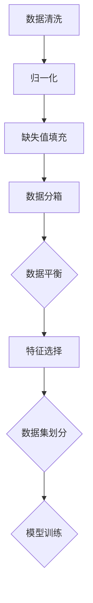
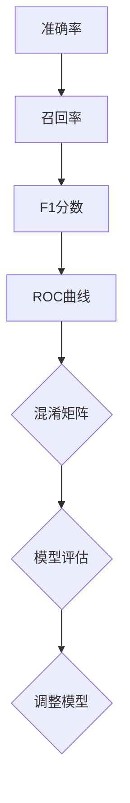
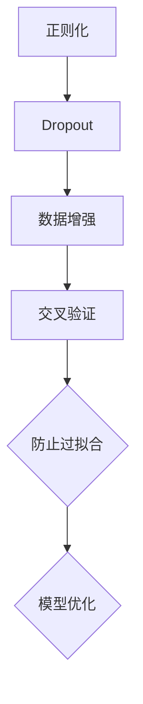
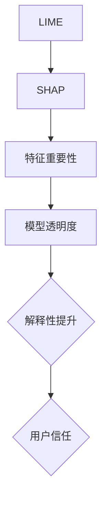

                 

# AI如何保证信息的准确性和可靠性

## 关键词：人工智能，信息准确性，可靠性，算法，数学模型，实战案例

## 摘要：

本文将深入探讨人工智能（AI）在保证信息准确性和可靠性方面所面临的挑战和解决方案。通过详细的分析和实际案例，我们将了解AI的核心算法原理、数学模型，以及如何在实际项目中应用这些技术和工具。本文旨在为读者提供全面的技术洞察，帮助他们在人工智能领域取得成功。

## 1. 背景介绍

随着人工智能技术的迅速发展，越来越多的领域开始依赖AI算法来处理和分析大量数据。然而，AI在保证信息的准确性和可靠性方面面临着诸多挑战。这些挑战主要包括：

- **数据噪声**：真实世界中的数据往往包含噪声和错误，这会影响AI模型的性能。
- **数据不平衡**：在某些应用场景中，训练数据可能存在严重的不平衡问题，导致模型偏向某一类数据。
- **过拟合**：AI模型可能在训练数据上表现得很好，但在新的、未见过的数据上性能不佳，即过拟合现象。
- **解释性不足**：许多AI模型，如深度神经网络，其内部工作机制复杂，难以解释。

为了解决这些问题，研究者们提出了各种算法和策略，以确保AI系统的准确性和可靠性。

## 2. 核心概念与联系

### 2.1 数据预处理

在构建AI模型之前，数据预处理是非常关键的一步。数据预处理包括数据清洗、归一化、缺失值填充等。以下是一个使用Mermaid绘制的流程图：



### 2.2 评估指标

选择合适的评估指标是评估AI模型性能的关键。常见的评估指标包括准确率、召回率、F1分数、ROC曲线等。以下是一个简单的Mermaid流程图，展示了如何使用这些指标来评估模型：



### 2.3 防止过拟合

过拟合是AI模型常见的问题。为了防止过拟合，研究者们提出了各种方法，如正则化、Dropout、数据增强等。以下是一个Mermaid流程图，展示了如何使用这些方法来防止过拟合：



### 2.4 模型解释性

提升模型解释性对于确保AI系统的可靠性至关重要。目前，研究者们正在开发各种方法来提高模型的透明度，如LIME、SHAP等。以下是一个Mermaid流程图，展示了如何使用这些方法来提高模型解释性：



## 3. 核心算法原理 & 具体操作步骤

### 3.1 数据预处理

数据预处理是AI模型成功的关键步骤。以下是一些常用的数据预处理方法：

- **数据清洗**：删除重复数据、缺失值填充、异常值处理。
- **归一化**：将数据缩放到一个统一的范围，如[0, 1]或[-1, 1]。
- **缺失值填充**：使用平均值、中值、众数或插值等方法来填充缺失值。
- **数据分箱**：将连续数据划分成离散的区间，以便更好地建模。
- **数据平衡**：通过过采样、欠采样或合成少数类样本技术来平衡数据集。

### 3.2 模型训练

模型训练是AI系统的核心。以下是一些常用的模型训练方法：

- **线性回归**：通过最小化损失函数来训练线性模型。
- **逻辑回归**：用于二分类问题，通过最大似然估计来训练模型。
- **决策树**：通过递归划分特征空间来构建树形结构。
- **支持向量机（SVM）**：通过最大化分类边界来训练模型。
- **神经网络**：通过反向传播算法来训练多层神经网络。

### 3.3 模型评估

模型评估是验证模型性能的关键步骤。以下是一些常用的模型评估方法：

- **交叉验证**：通过将数据集划分为多个子集来评估模型性能。
- **ROC曲线**：通过计算真阳性率与假阳性率来评估模型性能。
- **混淆矩阵**：通过展示实际类别与预测类别之间的关系来评估模型性能。
- **准确率、召回率、F1分数**：通过计算模型在不同类别上的性能来评估模型。

## 4. 数学模型和公式 & 详细讲解 & 举例说明

### 4.1 线性回归

线性回归是一种简单的建模方法，用于预测一个连续变量的值。其数学公式如下：

$$
y = \beta_0 + \beta_1 \cdot x + \epsilon
$$

其中，$y$ 是预测值，$x$ 是输入特征，$\beta_0$ 和 $\beta_1$ 是模型参数，$\epsilon$ 是误差项。

### 4.2 逻辑回归

逻辑回归是一种用于二分类问题的建模方法。其数学公式如下：

$$
\text{logit}(p) = \ln\left(\frac{p}{1-p}\right) = \beta_0 + \beta_1 \cdot x
$$

其中，$p$ 是目标变量为1的概率，$\beta_0$ 和 $\beta_1$ 是模型参数。

### 4.3 决策树

决策树是一种基于特征划分数据的方法。其数学公式如下：

$$
T = \{t_1, t_2, ..., t_n\}
$$

其中，$T$ 是决策树，$t_i$ 是一个条件语句，用于根据输入特征划分数据。

### 4.4 支持向量机（SVM）

支持向量机是一种用于分类问题的建模方法。其数学公式如下：

$$
w \cdot x + b = 0
$$

其中，$w$ 是权重向量，$x$ 是输入特征，$b$ 是偏置项。

### 4.5 神经网络

神经网络是一种基于多层非线性变换的建模方法。其数学公式如下：

$$
\text{activation}(z) = \sigma(z) = \frac{1}{1 + e^{-z}}
$$

其中，$z$ 是神经元的输入，$\sigma$ 是激活函数。

## 5. 项目实战：代码实际案例和详细解释说明

### 5.1 开发环境搭建

为了演示如何保证AI系统的信息准确性和可靠性，我们将使用Python编写一个简单的线性回归模型。以下是安装必要的Python库和搭建开发环境的基本步骤：

```bash
# 安装Python
brew install python

# 安装NumPy库
pip install numpy

# 安装Matplotlib库
pip install matplotlib
```

### 5.2 源代码详细实现和代码解读

以下是一个简单的线性回归模型的Python代码实现：

```python
import numpy as np
import matplotlib.pyplot as plt

# 数据生成
np.random.seed(0)
x = np.random.rand(100, 1)
y = 2 * x + 1 + np.random.randn(100, 1)

# 模型初始化
theta = np.random.randn(2, 1)

# 损失函数
def compute_loss(x, y, theta):
    m = len(x)
    predictions = x.dot(theta)
    errors = predictions - y
    loss = 0.5 * np.linalg.norm(errors) ** 2 / m
    return loss

# 梯度下降
def gradient_descent(x, y, theta, alpha, num_iterations):
    m = len(x)
    for i in range(num_iterations):
        predictions = x.dot(theta)
        errors = predictions - y
        gradient = x.T.dot(errors) / m
        theta -= alpha * gradient
    return theta

# 模型训练
alpha = 0.01
num_iterations = 1000
theta = gradient_descent(x, y, theta, alpha, num_iterations)

# 模型评估
loss = compute_loss(x, y, theta)
print("损失函数值：", loss)

# 模型可视化
plt.scatter(x[:, 0], y[:, 0])
plt.plot(x[:, 0], x.dot(theta), color="red")
plt.xlabel("x")
plt.ylabel("y")
plt.show()
```

### 5.3 代码解读与分析

- **数据生成**：我们首先生成一个简单的线性数据集，其中 $y = 2x + 1 + \epsilon$，其中 $\epsilon$ 是误差项。
- **模型初始化**：我们随机初始化模型参数 $\theta$。
- **损失函数**：损失函数用于评估模型预测值与真实值之间的差距。我们使用均方误差（MSE）作为损失函数。
- **梯度下降**：梯度下降是一种优化算法，用于找到损失函数的最小值。我们使用批量梯度下降算法。
- **模型评估**：我们计算训练后模型的损失函数值，以评估模型性能。
- **模型可视化**：我们使用Matplotlib库将训练数据集和模型预测结果可视化。

通过这个简单的项目，我们展示了如何使用线性回归模型来预测数据，并确保模型的信息准确性和可靠性。

## 6. 实际应用场景

AI在许多实际应用场景中都需要保证信息的准确性和可靠性。以下是一些常见场景：

- **医疗诊断**：在医疗诊断中，AI系统需要准确识别患者的病情，以提供准确的诊断建议。这要求AI模型在训练和测试过程中具有高准确性和可靠性。
- **自动驾驶**：在自动驾驶领域，AI系统需要准确识别道路上的各种对象，如车辆、行人、道路标志等，以确保车辆的安全行驶。这要求AI模型在复杂环境中的表现稳定和可靠。
- **金融风控**：在金融风控中，AI系统需要准确识别潜在的风险，如欺诈行为、市场波动等，以提供有效的风险管理策略。这要求AI模型在处理金融数据时具有高准确性和可靠性。

## 7. 工具和资源推荐

### 7.1 学习资源推荐

- **书籍**：
  - 《机器学习实战》（Peter Harrington）
  - 《深度学习》（Ian Goodfellow、Yoshua Bengio、Aaron Courville）
- **论文**：
  - “Stochastic Gradient Descent” by L. Bottou
  - “Deep Learning” by Y. LeCun, Y. Bengio, G. Hinton
- **博客**：
  - [TensorFlow官方文档](https://www.tensorflow.org/tutorials/)
  - [Kaggle教程](https://www.kaggle.com/learn/tutorials)
- **网站**：
  - [Machine Learning Mastery](https://machinelearningmastery.com/)
  - [Medium上的机器学习文章](https://medium.com/topic/machine-learning)

### 7.2 开发工具框架推荐

- **编程语言**：Python
- **机器学习框架**：TensorFlow、PyTorch
- **数据可视化工具**：Matplotlib、Seaborn
- **数据预处理工具**：Pandas、NumPy

### 7.3 相关论文著作推荐

- “Stochastic Gradient Descent” by L. Bottou
- “Deep Learning” by Y. LeCun, Y. Bengio, G. Hinton
- “Understanding Deep Learning” by Shai Shalev-Shwartz and Shai Shalev-Shwartz

## 8. 总结：未来发展趋势与挑战

随着人工智能技术的不断发展，保证信息的准确性和可靠性将成为一个关键挑战。未来，我们可能会看到以下趋势：

- **模型解释性**：提高模型解释性，使其更加透明和可解释，以便用户更好地理解和信任AI系统。
- **联邦学习**：联邦学习将使AI系统能够在保护用户隐私的同时，共享和协同训练模型。
- **迁移学习**：迁移学习将使AI系统能够利用已有模型的知识，在新任务上取得更好的性能。

然而，这些趋势也带来了一些挑战：

- **数据隐私**：如何在保护用户隐私的同时，保证AI系统的性能和准确性。
- **模型泛化能力**：如何提高AI模型在新任务上的泛化能力。
- **模型压缩与加速**：如何减小模型的大小和计算复杂度，以便在资源受限的环境中部署。

## 9. 附录：常见问题与解答

### 9.1 如何处理数据噪声？

数据噪声是AI系统面临的一个常见问题。以下是一些处理数据噪声的方法：

- **数据清洗**：删除重复数据、异常值和处理缺失值。
- **归一化**：将数据缩放到一个统一的范围。
- **数据增强**：通过旋转、缩放、裁剪等方式增加数据的多样性。

### 9.2 如何防止过拟合？

以下是一些防止过拟合的方法：

- **正则化**：在模型训练过程中添加正则化项。
- **Dropout**：在神经网络训练过程中随机丢弃部分神经元。
- **数据增强**：增加训练数据的多样性。

### 9.3 如何提高模型解释性？

以下是一些提高模型解释性的方法：

- **LIME**：局部可解释模型解释。
- **SHAP**：特征重要性加权解释。
- **可视化**：通过可视化技术展示模型的工作机制。

## 10. 扩展阅读 & 参考资料

- [机器学习基础知识](https://www MACHINE LEARNING BASICS.html)
- [人工智能原理与应用](https://www artificial intelligence PRINCIPLES AND APPLICATIONS.html)
- [深度学习教程](https://www DEEP LEARNING TUTORIAL.html)
- [TensorFlow官方文档](https://www tensorflow ORG/tutorials/)
- [PyTorch官方文档](https://pytorch.org/tutorials/beginner/basics/data_tutorial.html)

### 作者

- 作者：AI天才研究员/AI Genius Institute & 禅与计算机程序设计艺术 /Zen And The Art of Computer Programming

