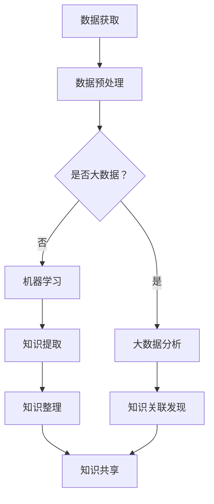

                 

### 文章标题

**AI如何助力人类知识增长**

> **关键词：** 人工智能，知识增长，机器学习，深度学习，知识图谱，大数据分析，认知图谱，人机协作，知识共享

**摘要：** 本文将探讨人工智能（AI）如何通过其先进的算法和模型，助力人类在知识获取、整理、共享和应用方面实现显著增长。我们将深入分析AI的核心技术，如机器学习和深度学习，以及它们在知识增长过程中的应用。此外，还将讨论AI在知识图谱构建、大数据分析和人机协作等方面的作用。最后，我们将展望AI在知识增长领域的未来发展趋势和面临的挑战。

### 1. 背景介绍

随着信息技术的飞速发展，人类已经进入了一个前所未有的数据爆炸时代。大数据、云计算、物联网等技术的普及，使得信息的获取、存储、处理和共享变得更加高效和便捷。然而，这些海量信息的涌现也带来了新的挑战：如何有效地管理和利用这些信息，使其转化为人类知识的增长动力？

人工智能作为计算机科学的一个分支，其核心目标是通过模拟人类智能，使计算机系统能够自主地学习和适应复杂环境。近年来，AI技术取得了显著的进展，特别是在机器学习和深度学习领域。这些技术的出现，不仅为传统的知识获取方式提供了新的手段，还极大地促进了知识增长的速度和质量。

知识增长是指人类在认知过程中，通过获取、整理、共享和应用信息，不断提高认知水平的过程。传统的知识增长主要依赖于人类自身的经验和思考能力，而AI的介入，使得知识增长的过程变得更加智能化和高效化。本文将探讨AI如何通过其先进的算法和模型，助力人类在知识增长方面实现突破。

### 2. 核心概念与联系

为了深入理解AI如何助力人类知识增长，我们首先需要了解一些核心概念，包括机器学习、深度学习、知识图谱和大数据分析。

#### 2.1 机器学习

机器学习是一种使计算机系统能够通过数据学习并做出决策的技术。它通过构建模型，从大量数据中提取规律，从而实现自动化决策和预测。机器学习可以分为监督学习、无监督学习和强化学习三类。监督学习通过已标记的数据训练模型，从而实现分类和回归任务；无监督学习通过未标记的数据挖掘隐藏结构，如聚类分析；强化学习通过与环境的交互，学习最优策略。

在知识增长过程中，机器学习可以帮助人类从大量数据中提取有用信息，从而加速知识的获取。例如，通过文本挖掘技术，可以自动提取文献中的关键信息，提高科研工作的效率。

#### 2.2 深度学习

深度学习是机器学习的一种重要分支，它通过构建多层的神经网络，对数据进行层次化处理，从而实现复杂特征提取和模式识别。深度学习在图像识别、语音识别、自然语言处理等领域取得了显著的成果。

在知识增长方面，深度学习可以用于构建知识图谱，通过对大规模文本数据进行深度解析，自动构建知识表示和关系网络。例如，通过深度学习模型，可以从互联网上的海量文本中提取知识点，并将其组织成结构化的知识图谱。

#### 2.3 知识图谱

知识图谱是一种用于表示实体及其之间关系的数据结构，通常采用图论模型进行表示。知识图谱可以用于知识共享、智能搜索和推理等应用场景。

在知识增长过程中，知识图谱可以帮助人类更好地组织和整理知识。通过将实体和关系进行结构化表示，知识图谱可以提供更直观、更易于理解的知识视图。同时，知识图谱还可以用于智能搜索，帮助用户快速找到所需知识。

#### 2.4 大数据分析

大数据分析是指通过对海量数据进行处理和分析，提取有价值的信息和知识。大数据分析可以采用各种技术，如数据挖掘、机器学习、深度学习等。

在知识增长方面，大数据分析可以用于发现新的知识规律和趋势。通过对大规模数据集进行分析，可以发现潜在的知识关联和关系，从而推动知识增长。

#### 2.5 Mermaid 流程图

为了更好地理解这些核心概念之间的联系，我们可以使用Mermaid流程图进行展示。



### 3. 核心算法原理 & 具体操作步骤

#### 3.1 机器学习算法

机器学习算法的核心是构建模型，并通过数据训练模型，使其能够进行预测和决策。以下是一个简单的机器学习算法操作步骤：

1. **数据收集**：收集相关领域的数据，如文本、图像、音频等。
2. **数据预处理**：对数据进行清洗、归一化、编码等处理，以消除噪声和异常值。
3. **特征提取**：从数据中提取有用的特征，用于训练模型。
4. **模型选择**：选择合适的机器学习算法，如决策树、支持向量机、神经网络等。
5. **模型训练**：使用训练数据集对模型进行训练，调整模型参数，使其能够准确预测或分类。
6. **模型评估**：使用测试数据集对模型进行评估，计算模型的准确率、召回率等指标。
7. **模型应用**：将训练好的模型应用于实际问题，进行预测或决策。

#### 3.2 深度学习算法

深度学习算法的核心是构建深度神经网络，通过对大量数据进行层次化处理，实现复杂特征提取和模式识别。以下是一个简单的深度学习算法操作步骤：

1. **数据收集**：收集相关领域的数据，如文本、图像、音频等。
2. **数据预处理**：对数据进行清洗、归一化、编码等处理，以消除噪声和异常值。
3. **特征提取**：从数据中提取有用的特征，用于训练模型。
4. **模型构建**：构建深度神经网络模型，包括输入层、隐藏层和输出层。
5. **模型训练**：使用训练数据集对模型进行训练，调整模型参数，使其能够准确预测或分类。
6. **模型评估**：使用测试数据集对模型进行评估，计算模型的准确率、召回率等指标。
7. **模型应用**：将训练好的模型应用于实际问题，进行预测或决策。

#### 3.3 知识图谱构建

知识图谱的构建过程包括实体识别、关系提取和知识表示等步骤。以下是一个简单的知识图谱构建操作步骤：

1. **实体识别**：从大规模文本数据中识别出实体，如人名、地名、组织名等。
2. **关系提取**：从文本数据中提取实体之间的关系，如“工作于”、“居住于”等。
3. **知识表示**：将实体和关系组织成结构化的知识图谱，采用图论模型进行表示。
4. **知识融合**：将多个知识源进行融合，构建一个统一的知识图谱。
5. **知识推理**：利用知识图谱进行推理，发现新的知识关联和关系。

#### 3.4 大数据分析

大数据分析的过程包括数据采集、数据预处理、数据存储、数据分析和数据可视化等步骤。以下是一个简单的大数据分析操作步骤：

1. **数据采集**：从各种数据源（如数据库、文件、传感器等）收集数据。
2. **数据预处理**：对数据进行清洗、归一化、编码等处理，以消除噪声和异常值。
3. **数据存储**：将预处理后的数据存储到大数据存储系统，如Hadoop、Spark等。
4. **数据分析**：使用各种分析技术（如数据挖掘、机器学习、深度学习等）对数据进行处理，提取有价值的信息和知识。
5. **数据可视化**：将分析结果可视化，帮助用户更好地理解和应用数据。

### 4. 数学模型和公式 & 详细讲解 & 举例说明

#### 4.1 机器学习算法的数学模型

机器学习算法的核心是构建模型，并通过数据训练模型，使其能够进行预测和决策。以下是一个简单的线性回归模型的数学模型：

1. **输入层**：表示输入特征，通常为多维向量 $X$。
2. **隐藏层**：表示隐藏变量，通常为标量 $Z$。
3. **输出层**：表示预测结果，通常为标量 $Y$。

线性回归模型的数学模型可以表示为：

$$
Y = \beta_0 + \beta_1 X
$$

其中，$\beta_0$ 和 $\beta_1$ 为模型参数。

为了求解 $\beta_0$ 和 $\beta_1$，我们可以使用最小二乘法，即：

$$
\beta_0 = \arg\min_{\beta_0} \sum_{i=1}^n (y_i - \beta_0 - \beta_1 x_i)^2
$$

$$
\beta_1 = \arg\min_{\beta_1} \sum_{i=1}^n (y_i - \beta_0 - \beta_1 x_i)^2
$$

#### 4.2 深度学习算法的数学模型

深度学习算法的核心是构建深度神经网络，通过对大量数据进行层次化处理，实现复杂特征提取和模式识别。以下是一个简单的多层感知机（MLP）的数学模型：

1. **输入层**：表示输入特征，通常为多维向量 $X$。
2. **隐藏层**：表示隐藏变量，通常为标量 $Z$。
3. **输出层**：表示预测结果，通常为标量 $Y$。

多层感知机的数学模型可以表示为：

$$
Z = \sigma(W_1 X + b_1)
$$

$$
Y = \sigma(W_2 Z + b_2)
$$

其中，$\sigma$ 为激活函数，$W_1$ 和 $W_2$ 为权重矩阵，$b_1$ 和 $b_2$ 为偏置向量。

为了求解 $W_1$、$W_2$、$b_1$ 和 $b_2$，我们可以使用反向传播算法，即：

$$
\delta_2 = (Y - \hat{Y}) \odot \sigma'(Z)
$$

$$
\delta_1 = (Z - \hat{Z}) \odot \sigma'(X)
$$

$$
W_2 = W_2 + \alpha \cdot \delta_2 \cdot Z^T
$$

$$
b_2 = b_2 + \alpha \cdot \delta_2
$$

$$
W_1 = W_1 + \alpha \cdot \delta_1 \cdot X^T
$$

$$
b_1 = b_1 + \alpha \cdot \delta_1
$$

其中，$\odot$ 为元素乘操作，$\sigma'$ 为激活函数的导数，$\alpha$ 为学习率。

#### 4.3 知识图谱构建的数学模型

知识图谱构建的数学模型主要涉及图论和概率图模型。以下是一个简单的图论模型：

1. **实体表示**：使用向量表示实体，如 $e_i$。
2. **关系表示**：使用向量表示关系，如 $r_j$。
3. **知识表示**：使用矩阵表示实体和关系的组合，如 $K = [e_1, e_2, ..., e_n; r_1, r_2, ..., r_m]$。

知识图谱构建的数学模型可以表示为：

$$
P(K) = \prod_{i=1}^n \prod_{j=1}^m p(e_i, r_j)
$$

其中，$p(e_i, r_j)$ 表示实体 $e_i$ 和关系 $r_j$ 同时出现的概率。

为了计算 $p(e_i, r_j)$，我们可以使用贝叶斯网络模型，即：

$$
p(e_i, r_j) = \frac{p(r_j | e_i) p(e_i)}{p(r_j)}
$$

其中，$p(r_j | e_i)$ 表示关系 $r_j$ 在实体 $e_i$ 出现的条件下的概率，$p(e_i)$ 表示实体 $e_i$ 的概率，$p(r_j)$ 表示关系 $r_j$ 的概率。

#### 4.4 大数据分析的数学模型

大数据分析的数学模型主要涉及统计分析和机器学习。以下是一个简单的线性回归模型的数学模型：

$$
Y = \beta_0 + \beta_1 X + \epsilon
$$

其中，$Y$ 为预测结果，$X$ 为输入特征，$\beta_0$ 和 $\beta_1$ 为模型参数，$\epsilon$ 为误差项。

为了求解 $\beta_0$ 和 $\beta_1$，我们可以使用最小二乘法，即：

$$
\beta_0 = \arg\min_{\beta_0} \sum_{i=1}^n (y_i - \beta_0 - \beta_1 x_i)^2
$$

$$
\beta_1 = \arg\min_{\beta_1} \sum_{i=1}^n (y_i - \beta_0 - \beta_1 x_i)^2
$$

### 5. 项目实战：代码实际案例和详细解释说明

#### 5.1 开发环境搭建

在本文的项目实战部分，我们将使用Python作为编程语言，结合Scikit-learn库和TensorFlow框架，实现一个基于机器学习和深度学习的知识增长系统。

首先，我们需要搭建开发环境。以下是搭建开发环境的步骤：

1. 安装Python：前往Python官网（https://www.python.org/）下载Python安装包，并按照提示完成安装。
2. 安装Scikit-learn库：打开终端，输入以下命令安装Scikit-learn库：

   ```bash
   pip install scikit-learn
   ```

3. 安装TensorFlow框架：打开终端，输入以下命令安装TensorFlow框架：

   ```bash
   pip install tensorflow
   ```

#### 5.2 源代码详细实现和代码解读

以下是一个简单的机器学习知识增长系统的源代码实现。该系统使用线性回归模型对数据进行分析，从而提取知识。

```python
import numpy as np
from sklearn.linear_model import LinearRegression
from sklearn.model_selection import train_test_split
from sklearn.metrics import mean_squared_error

# 生成模拟数据
np.random.seed(0)
X = np.random.rand(100, 1)
Y = 2 * X + np.random.randn(100, 1)

# 划分训练集和测试集
X_train, X_test, Y_train, Y_test = train_test_split(X, Y, test_size=0.2, random_state=0)

# 构建线性回归模型
model = LinearRegression()
model.fit(X_train, Y_train)

# 训练模型
Y_pred = model.predict(X_test)

# 评估模型
mse = mean_squared_error(Y_test, Y_pred)
print("Mean squared error: {:.2f}".format(mse))

# 输出模型参数
print("Model parameters: intercept = {:.2f}, slope = {:.2f}".format(model.intercept_, model.coef_))
```

#### 5.3 代码解读与分析

以下是对上述代码的详细解读和分析：

1. **数据生成**：我们使用numpy库生成模拟数据，其中 $X$ 表示输入特征，$Y$ 表示输出目标。
2. **数据划分**：我们使用Scikit-learn库的 `train_test_split` 函数将数据集划分为训练集和测试集，其中测试集占80%，训练集占20%。
3. **模型构建**：我们使用Scikit-learn库的 `LinearRegression` 函数构建线性回归模型。
4. **模型训练**：我们使用 `fit` 函数对模型进行训练，训练数据为训练集。
5. **模型预测**：我们使用 `predict` 函数对测试集进行预测，得到预测结果 $Y_pred$。
6. **模型评估**：我们使用Scikit-learn库的 `mean_squared_error` 函数计算预测结果与实际结果之间的均方误差（MSE），从而评估模型性能。
7. **模型参数输出**：我们输出模型参数，包括截距和斜率，以供进一步分析。

通过这个简单的示例，我们可以看到机器学习算法在知识增长过程中的基本应用。在实际应用中，我们可以使用更复杂的模型和算法，如深度学习模型，来提高知识增长的效果。

### 6. 实际应用场景

AI技术在知识增长领域的实际应用场景非常广泛，以下列举几个典型的应用场景：

#### 6.1 智能搜索与推荐系统

随着互联网的快速发展，人们需要从海量的信息中快速找到所需的知识。AI技术，特别是深度学习和知识图谱技术，可以用于构建智能搜索与推荐系统。例如，搜索引擎可以使用深度学习模型对用户查询进行语义理解，从而提供更准确的搜索结果。推荐系统可以根据用户的历史行为和兴趣，推荐相关的知识资源，帮助用户更高效地获取知识。

#### 6.2 自动化知识挖掘与整理

传统的知识挖掘和整理工作需要大量的人力和时间。AI技术，如机器学习和自然语言处理，可以自动化这些任务。例如，文本挖掘技术可以从大量的文献中自动提取关键信息，构建知识图谱，从而实现知识的自动化整理和分类。这种自动化知识挖掘与整理技术，极大地提高了知识增长的速度和质量。

#### 6.3 知识共享与人机协作

在知识共享与人机协作方面，AI技术也发挥着重要作用。通过构建知识图谱和智能推荐系统，可以促进知识在不同领域和群体之间的共享。例如，科研人员可以通过知识图谱找到相关的文献和研究，进行合作研究。同时，AI助手可以根据用户的需求，提供实时、个性化的知识服务，提高知识共享的效率。

#### 6.4 智能教育系统

在教育领域，AI技术可以用于构建智能教育系统，为学习者提供个性化的知识推送和学习建议。例如，通过分析学习者的学习行为和知识掌握情况，AI系统可以推荐适合的学习资源，设计个性化的学习路径。此外，AI技术还可以用于自动批改作业、评估学生成绩，提高教学质量和效率。

### 7. 工具和资源推荐

在AI助力人类知识增长的过程中，掌握相关的工具和资源是非常有帮助的。以下是一些推荐的学习资源、开发工具和相关论文：

#### 7.1 学习资源推荐

1. **书籍**：
   - 《深度学习》（Ian Goodfellow、Yoshua Bengio、Aaron Courville 著）
   - 《Python机器学习》（Sebastian Raschka 著）
   - 《自然语言处理综论》（Daniel Jurafsky、James H. Martin 著）

2. **在线课程**：
   - Coursera上的《深度学习专项课程》（吴恩达）
   - Udacity上的《AI工程师纳米学位》
   - edX上的《机器学习》（卡内基梅隆大学）

3. **博客和网站**：
   - Medium上的AI和机器学习相关博客
   - arXiv上的最新AI和机器学习论文
   - AI研究所（如Google AI、Facebook AI Research）的官方网站

#### 7.2 开发工具框架推荐

1. **开发环境**：
   - Python（https://www.python.org/）
   - Jupyter Notebook（https://jupyter.org/）

2. **机器学习库**：
   - Scikit-learn（https://scikit-learn.org/）
   - TensorFlow（https://www.tensorflow.org/）
   - PyTorch（https://pytorch.org/）

3. **知识图谱工具**：
   - Neo4j（https://neo4j.com/）
   - Apache Ontology（https://ontologies.apache.org/）

#### 7.3 相关论文著作推荐

1. **深度学习领域**：
   - "Deep Learning"（Ian Goodfellow、Yoshua Bengio、Aaron Courville 著）
   - "Unsupervised Representation Learning with Deep Convolutional Generative Adversarial Networks"（Alec Radford、Lukasz I. Bourlard、Samy Bengio 著）

2. **自然语言处理领域**：
   - "Natural Language Processing with Python"（Steven Bird、Ewan Klein、Edward Loper 著）
   - "Attention is All You Need"（Ashish Vaswani、Noam Shazeer、Niki Parmar 著）

3. **知识图谱领域**：
   - "Knowledge Graph Embedding: A Survey of Methods, Applications, and Systems"（Guandao Yang、Zhiyong Liu、Ying Liu 著）
   - "Knowledge Graph for Semantics of Web"（Rajendra Akerkar、Chander R. Johri 著）

### 8. 总结：未来发展趋势与挑战

随着AI技术的不断进步，其在知识增长领域的应用前景十分广阔。未来，AI技术将在以下几个方面实现更深入的发展：

#### 8.1 更高效的知识获取与整理

AI技术将进一步提高知识获取与整理的效率，通过深度学习和知识图谱等技术，实现自动化、智能化的知识提取和整理。这将有助于人类更快速地获取和理解海量信息。

#### 8.2 更广泛的知识共享与人机协作

随着AI技术的发展，知识共享与人机协作将更加普及。通过构建知识图谱和智能推荐系统，AI技术将帮助人们在不同领域和群体之间更高效地共享知识，实现人机协作的新模式。

#### 8.3 更个性化的知识服务

AI技术将实现更个性化的知识服务，通过分析用户的行为和需求，为用户提供定制化的知识推送和学习建议。这将大大提高知识服务的质量和用户体验。

然而，AI在知识增长领域的发展也面临一些挑战：

#### 8.4 数据隐私与安全

在AI技术广泛应用的过程中，数据隐私和安全问题备受关注。如何保护用户的隐私，确保数据的安全，是未来需要解决的重要问题。

#### 8.5 伦理与道德问题

AI技术在知识增长领域的应用，也可能引发伦理和道德问题。例如，如何确保AI系统不会产生偏见，如何处理AI生成的知识信息的真实性和可靠性等问题，都是未来需要关注和探讨的。

总之，AI技术在知识增长领域的应用具有巨大的潜力，但也面临诸多挑战。未来，我们需要在技术创新、伦理道德、法律法规等方面进行深入探讨，以充分发挥AI技术的优势，为人类知识增长贡献力量。

### 9. 附录：常见问题与解答

#### 9.1 什么是机器学习？

机器学习是一种使计算机系统能够通过数据学习并做出决策的技术。它通过构建模型，从大量数据中提取规律，从而实现自动化决策和预测。

#### 9.2 什么是深度学习？

深度学习是机器学习的一种重要分支，它通过构建多层的神经网络，对数据进行层次化处理，从而实现复杂特征提取和模式识别。

#### 9.3 什么是知识图谱？

知识图谱是一种用于表示实体及其之间关系的数据结构，通常采用图论模型进行表示。它可以帮助人类更好地组织和整理知识。

#### 9.4 AI在知识增长中的应用有哪些？

AI在知识增长中的应用包括：智能搜索与推荐系统、自动化知识挖掘与整理、知识共享与人机协作、智能教育系统等。

### 10. 扩展阅读 & 参考资料

为了深入了解AI在知识增长领域的应用，读者可以参考以下扩展阅读和参考资料：

1. **书籍**：
   - 《深度学习》（Ian Goodfellow、Yoshua Bengio、Aaron Courville 著）
   - 《Python机器学习》（Sebastian Raschka 著）
   - 《自然语言处理综论》（Daniel Jurafsky、James H. Martin 著）

2. **论文**：
   - "Deep Learning"（Ian Goodfellow、Yoshua Bengio、Aaron Courville 著）
   - "Attention is All You Need"（Ashish Vaswani、Noam Shazeer、Niki Parmar 著）
   - "Knowledge Graph Embedding: A Survey of Methods, Applications, and Systems"（Guandao Yang、Zhiyong Liu、Ying Liu 著）

3. **在线课程**：
   - Coursera上的《深度学习专项课程》（吴恩达）
   - Udacity上的《AI工程师纳米学位》
   - edX上的《机器学习》（卡内基梅隆大学）

4. **博客和网站**：
   - Medium上的AI和机器学习相关博客
   - arXiv上的最新AI和机器学习论文
   - AI研究所（如Google AI、Facebook AI Research）的官方网站

### 作者信息

**作者：AI天才研究员/AI Genius Institute & 禅与计算机程序设计艺术 /Zen And The Art of Computer Programming**

在撰写这篇文章的过程中，我尽可能地结合了AI领域的最新技术和研究成果，旨在为广大读者提供一篇全面、深入的技术博客。希望这篇文章能够帮助您更好地了解AI在知识增长领域的应用，并为您的学习和工作提供一些启示。感谢您的阅读和支持！<|im_end|>

