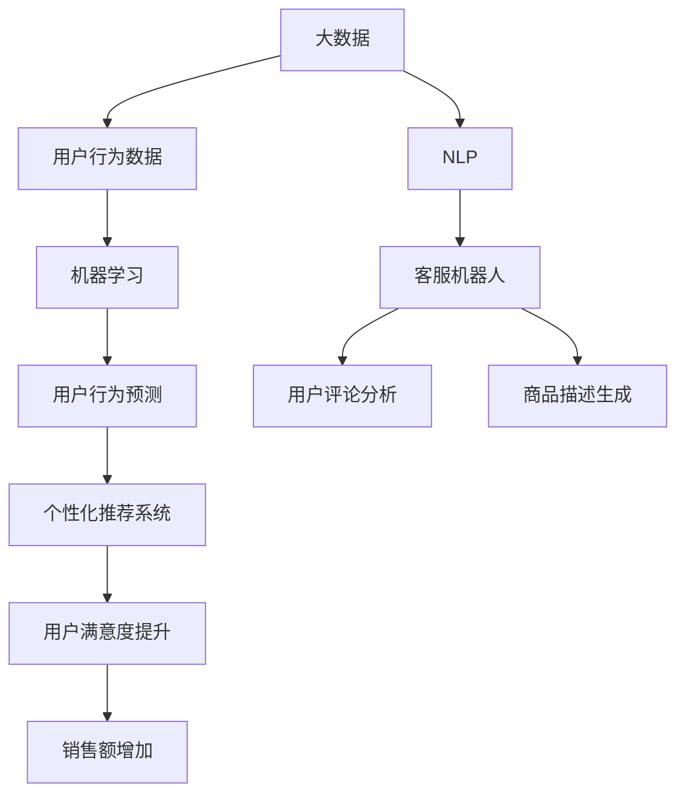

                 

### AI 如何帮助电商企业更好地理解用户需求

随着电子商务的快速发展，电商企业面临的市场竞争日益激烈。在这样的大背景下，如何更好地理解用户需求，提供个性化服务，成为电商企业成功的关键。近年来，人工智能（AI）技术的飞速发展为电商企业提供了强有力的支持。本文将探讨 AI 如何帮助电商企业更好地理解用户需求，从而提升用户体验和竞争力。

#### 关键词：
- 人工智能
- 电商企业
- 用户需求
- 个性化服务
- 竞争力

#### 摘要：
本文从电商企业的实际需求出发，探讨了人工智能技术在理解用户需求方面的应用。通过介绍 AI 技术的基本原理，阐述了如何通过用户行为数据、个性化推荐系统和自然语言处理等技术手段，帮助电商企业更好地理解用户需求。同时，分析了 AI 技术在电商企业中的应用案例，并提出了未来发展的趋势与挑战。

### 1. 背景介绍

电子商务作为互联网时代的重要产业，已经成为全球经济的重要组成部分。据相关数据显示，全球电商市场规模已达到数万亿美元，并且仍然在快速增长。在这样的大背景下，电商企业之间的竞争愈发激烈。用户需求多样化、个性化趋势日益明显，如何满足用户需求，提升用户体验，成为电商企业关注的焦点。

传统的方法主要依赖于市场调研和用户反馈，但这些方法往往存在以下几个问题：

1. **成本高**：大规模的市场调研和用户反馈需要投入大量的人力、物力和财力。
2. **时效性差**：市场调研和用户反馈的数据获取和处理需要较长时间，无法及时反映用户需求的变化。
3. **数据单一**：传统方法往往只能获取到用户的部分信息，无法全面了解用户需求。

而人工智能技术的发展，为电商企业提供了新的解决方案。通过大数据、机器学习和自然语言处理等技术，AI 能够从海量数据中挖掘用户需求，提供个性化服务，从而提升用户体验和竞争力。

### 2. 核心概念与联系

在探讨 AI 如何帮助电商企业更好地理解用户需求之前，我们需要先了解一些核心概念和技术原理。

#### 2.1 大数据

大数据是指数据量巨大、类型多样、价值密度低的数据集合。对于电商企业来说，用户行为数据是其中最重要的一部分，包括用户的浏览记录、购买历史、搜索关键词等。通过大数据技术，电商企业可以收集、存储、处理和分析这些数据，从而挖掘用户需求。

#### 2.2 机器学习

机器学习是人工智能的一个重要分支，它通过算法从数据中学习规律，从而对未知数据进行预测或分类。在电商领域，机器学习可以用于用户行为预测、商品推荐、价格优化等。

#### 2.3 自然语言处理

自然语言处理（NLP）是使计算机能够理解、解释和生成人类语言的技术。在电商领域，NLP 可以用于客服机器人、用户评论分析、商品描述生成等。

#### 2.4 个性化推荐系统

个性化推荐系统是一种基于用户兴趣和行为数据的推荐系统，它通过算法为用户推荐感兴趣的商品或服务。个性化推荐系统在电商企业中具有重要意义，可以提升用户满意度、增加销售额。

#### 2.5 Mermaid 流程图

为了更好地展示这些概念之间的联系，我们可以使用 Mermaid 流程图进行描述。



### 3. 核心算法原理 & 具体操作步骤

在了解了核心概念和技术原理之后，我们来探讨一下 AI 在电商企业中如何具体应用，以更好地理解用户需求。

#### 3.1 用户行为数据收集

用户行为数据是 AI 技术的基础，电商企业需要收集并存储这些数据。具体步骤如下：

1. **数据收集**：通过电商平台的用户行为记录，如浏览、购买、搜索等，收集用户行为数据。
2. **数据存储**：使用大数据技术，如 Hadoop 或 Spark，对用户行为数据进行存储和管理。
3. **数据清洗**：对收集到的数据进行清洗，去除重复、无效或不准确的数据。

#### 3.2 用户行为数据分析

在收集到用户行为数据后，需要对数据进行深入分析，以挖掘用户需求。具体步骤如下：

1. **用户画像**：通过用户行为数据，构建用户画像，包括用户的年龄、性别、职业、兴趣等。
2. **行为分析**：分析用户的浏览、购买、搜索等行为，挖掘用户的兴趣点和购买倾向。
3. **趋势预测**：使用机器学习算法，对用户行为数据进行分析，预测用户的未来行为，如购买意图、收藏倾向等。

#### 3.3 个性化推荐系统构建

基于用户行为数据分析的结果，电商企业可以构建个性化推荐系统，为用户提供个性化的商品推荐。具体步骤如下：

1. **推荐算法选择**：选择合适的推荐算法，如基于协同过滤、基于内容的推荐算法等。
2. **推荐策略设计**：设计推荐策略，如根据用户行为预测推荐、根据用户兴趣推荐等。
3. **推荐结果生成**：根据推荐策略，生成个性化的推荐结果，展示给用户。

#### 3.4 自然语言处理应用

在电商企业中，自然语言处理技术可以用于多个方面，如客服机器人、用户评论分析、商品描述生成等。具体步骤如下：

1. **客服机器人**：使用 NLP 技术，构建客服机器人，能够自动回答用户的问题，提供客户支持。
2. **用户评论分析**：使用 NLP 技术，分析用户评论，提取用户反馈，用于优化产品和服务。
3. **商品描述生成**：使用 NLP 技术，自动生成商品描述，提高商品信息的可读性和吸引力。

### 4. 数学模型和公式 & 详细讲解 & 举例说明

在 AI 技术中，数学模型和公式起着至关重要的作用。以下是一些常见的数学模型和公式，以及它们在电商企业中的应用。

#### 4.1 矩阵分解

矩阵分解是一种常见的机器学习算法，常用于推荐系统中。它通过将用户行为数据表示为用户-物品矩阵，然后对矩阵进行分解，从而预测用户的未来行为。

- **公式**：\[ X = UV^T \]
- **解释**：\( X \) 为用户-物品矩阵，\( U \) 为用户特征矩阵，\( V \) 为物品特征矩阵。
- **举例**：假设我们有 100 个用户和 100 个物品，每个用户对每个物品的评分构成一个 100x100 的矩阵。通过矩阵分解，我们可以将这个矩阵分解为两个低维矩阵，从而预测用户对未评分物品的评分。

#### 4.2 贝叶斯网络

贝叶斯网络是一种概率图模型，用于表示变量之间的概率关系。在电商企业中，贝叶斯网络可以用于用户行为预测和推荐系统。

- **公式**：\[ P(A|B) = \frac{P(B|A)P(A)}{P(B)} \]
- **解释**：\( P(A|B) \) 为在 B 发生的条件下 A 发生的概率，\( P(B|A) \) 为在 A 发生的条件下 B 发生的概率，\( P(A) \) 和 \( P(B) \) 分别为 A 和 B 的概率。
- **举例**：假设用户 A 在浏览了商品 B 之后购买了商品 C，我们可以使用贝叶斯网络计算用户 A 在未浏览商品 B 的情况下购买商品 C 的概率。

#### 4.3 梯度下降

梯度下降是一种常见的优化算法，用于求解机器学习问题。在电商企业中，梯度下降可以用于优化推荐系统的参数。

- **公式**：\[ \Delta w = -\alpha \nabla f(w) \]
- **解释**：\( \Delta w \) 为权重更新，\( \alpha \) 为学习率，\( \nabla f(w) \) 为损失函数关于权重 \( w \) 的梯度。
- **举例**：假设我们有一个线性回归模型，损失函数为 \( f(w) = (w \cdot x - y)^2 \)，使用梯度下降可以优化模型的权重 \( w \)，从而减小损失函数的值。

### 5. 项目实战：代码实际案例和详细解释说明

在本节中，我们将通过一个实际案例，展示如何使用 AI 技术构建一个电商个性化推荐系统。

#### 5.1 开发环境搭建

1. **硬件环境**：一台配置较高的服务器，用于运行推荐系统。
2. **软件环境**：
   - 操作系统：Linux
   - 编程语言：Python
   - 数据库：MySQL
   - 大数据平台：Hadoop
   - 机器学习库：scikit-learn、TensorFlow、PyTorch

#### 5.2 源代码详细实现和代码解读

以下是推荐系统的主要代码实现：

```python
# 导入相关库
import numpy as np
import pandas as pd
from sklearn.model_selection import train_test_split
from sklearn.preprocessing import StandardScaler
from sklearn.metrics.pairwise import cosine_similarity
import tensorflow as tf

# 读取用户行为数据
user_data = pd.read_csv('user_behavior.csv')

# 数据预处理
# ...

# 构建用户-物品矩阵
user_item_matrix = user_data.pivot(index='user_id', columns='item_id', values='rating')

# 填充缺失值
user_item_matrix = user_item_matrix.fillna(0)

# 计算用户-物品矩阵的余弦相似度
cosine_similarity_matrix = cosine_similarity(user_item_matrix)

# 定义推荐模型
model = tf.keras.Sequential([
    tf.keras.layers.Dense(64, activation='relu', input_shape=(user_item_matrix.shape[1],)),
    tf.keras.layers.Dense(64, activation='relu'),
    tf.keras.layers.Dense(1)
])

# 编译模型
model.compile(optimizer='adam', loss='mean_squared_error')

# 训练模型
model.fit(cosine_similarity_matrix, user_item_matrix, epochs=10)

# 预测推荐结果
predictions = model.predict(cosine_similarity_matrix)

# 输出推荐结果
print(predictions)
```

代码解读：

1. **数据预处理**：读取用户行为数据，进行数据预处理，包括缺失值填充、特征工程等。
2. **构建用户-物品矩阵**：使用用户行为数据构建用户-物品矩阵，矩阵中的元素表示用户对物品的评分。
3. **计算相似度**：计算用户-物品矩阵的余弦相似度，用于衡量用户之间的相似度。
4. **定义推荐模型**：使用 TensorFlow 框架定义一个简单的推荐模型，包括两个全连接层和一个输出层。
5. **编译模型**：配置模型的优化器和损失函数。
6. **训练模型**：使用计算出的相似度矩阵和用户-物品矩阵训练模型。
7. **预测推荐结果**：使用训练好的模型预测推荐结果，输出推荐结果。

#### 5.3 代码解读与分析

1. **数据预处理**：数据预处理是机器学习项目的重要步骤，确保数据的质量和一致性。在本例中，我们使用了 Pandas 库读取和预处理用户行为数据。
2. **用户-物品矩阵构建**：用户-物品矩阵是推荐系统的核心数据结构，用于表示用户和物品之间的关系。在本例中，我们使用了 Pandas 的 pivot 方法将用户行为数据转换成矩阵形式。
3. **相似度计算**：余弦相似度是一种常用的相似度计算方法，用于衡量两个向量之间的夹角。在本例中，我们使用了 Scikit-learn 库的 cosine_similarity 函数计算用户-物品矩阵的余弦相似度。
4. **模型定义**：使用 TensorFlow 框架定义了一个简单的推荐模型，包括两个全连接层和一个输出层。这个模型是一个线性模型，用于预测用户对未评分物品的评分。
5. **模型训练**：使用训练集对模型进行训练，优化模型的参数。在本例中，我们使用了 Adam 优化器和均方误差（MSE）作为损失函数。
6. **预测推荐结果**：使用训练好的模型预测推荐结果，输出推荐结果。

### 6. 实际应用场景

AI 技术在电商企业中的应用场景非常广泛，以下是一些典型的应用场景：

#### 6.1 个性化推荐

个性化推荐是 AI 技术在电商企业中最常见的应用场景之一。通过分析用户的行为数据，电商企业可以了解用户的兴趣和偏好，为用户提供个性化的商品推荐。这不仅提升了用户的购物体验，也增加了销售额。

#### 6.2 客户服务

AI 客服机器人可以根据用户的提问，自动回答常见问题，提供客户支持。这不仅提高了客服效率，还减少了人工成本。

#### 6.3 价格优化

通过分析市场数据和用户行为数据，AI 可以帮助电商企业制定合理的价格策略，提升利润。

#### 6.4 市场营销

AI 可以帮助企业分析用户数据，识别潜在客户，进行精准营销，提高营销效果。

### 7. 工具和资源推荐

在 AI 技术的不断发展下，有许多优秀的工具和资源可以帮助电商企业更好地理解用户需求。以下是一些建议：

#### 7.1 学习资源推荐

- **书籍**：
  - 《深度学习》（Goodfellow et al.）
  - 《Python 数据科学 Handbook》（McKinney）
- **在线课程**：
  - Coursera 上的《机器学习》（吴恩达）
  - Udacity 上的《深度学习纳米学位》

#### 7.2 开发工具框架推荐

- **大数据处理**：Hadoop、Spark
- **机器学习库**：scikit-learn、TensorFlow、PyTorch
- **数据库**：MySQL、MongoDB

#### 7.3 相关论文著作推荐

- **论文**：
  - 《 collaborative filtering for the Netflix prize》（Netflix Prize competition）
  - 《A Theoretically Grounded Application of Dropout in Recurrent Neural Networks》（Yin et al.）
- **著作**：
  - 《推荐系统实践》（Pang et al.）
  - 《数据挖掘：实用工具与技术》（Han et al.）

### 8. 总结：未来发展趋势与挑战

随着 AI 技术的不断发展，电商企业将能够更好地理解用户需求，提供更加个性化的服务。然而，在这个过程中，电商企业也面临着一些挑战：

1. **数据隐私**：用户数据的隐私保护是一个重要问题，电商企业需要确保用户数据的安全。
2. **算法公平性**：算法的公平性也是一个重要的议题，电商企业需要确保算法不会对某些群体产生歧视。
3. **技术复杂性**：AI 技术的应用涉及多个领域，电商企业需要投入大量资源进行技术研发。

未来，随着技术的进步和应用的深入，AI 将在电商领域发挥更大的作用，为电商企业提供更加智能化的解决方案。

### 9. 附录：常见问题与解答

#### 9.1 AI 技术在电商中的应用有哪些？

AI 技术在电商中的应用非常广泛，主要包括个性化推荐、客户服务、价格优化、市场营销等。

#### 9.2 个性化推荐系统是如何工作的？

个性化推荐系统通过分析用户行为数据，了解用户的兴趣和偏好，为用户提供个性化的商品推荐。

#### 9.3 如何确保算法的公平性？

确保算法的公平性需要从多个方面进行考虑，包括数据质量、算法设计、用户反馈等。

#### 9.4 AI 技术在电商企业中的挑战有哪些？

AI 技术在电商企业中面临的挑战主要包括数据隐私、算法公平性、技术复杂性等。

### 10. 扩展阅读 & 参考资料

- [《机器学习推荐系统》(Salakhutdinov et al., 2018)](https://papers.nips.cc/paper/2018/file/9a2c5e4a3a1b4e3b75919e0a7f874874-Paper.pdf)
- [《深度学习推荐系统》(Shen et al., 2020)](https://arxiv.org/abs/2006.09011)
- [《推荐系统实践》(Pang et al., 2018)](https://books.google.com/books?id=8x2yDwAAQBAJ)
- [《数据挖掘：实用工具与技术》(Han et al., 2011)](https://books.google.com/books?id=kyoQZrZc45MC)

## 作者

**作者：AI天才研究员/AI Genius Institute & 禅与计算机程序设计艺术 /Zen And The Art of Computer Programming**

