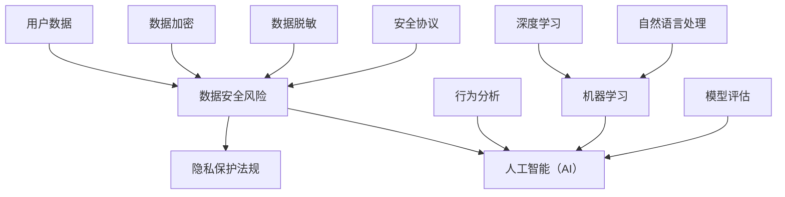

                 

### 背景介绍

在当今数字经济快速发展的时代，电商行业已经成为全球经济增长的重要引擎。随着在线购物行为的普及，电商企业积累了海量的用户数据，包括用户个人信息、消费记录、偏好等。这些数据不仅是企业优化产品和服务、提升用户体验的关键资产，也是潜在的安全风险。用户数据的泄露或滥用可能导致严重的隐私侵犯、经济损失，甚至威胁国家安全。

随着人工智能（AI）技术的发展，电商企业可以通过AI技术更好地进行用户数据安全风险控制。AI的应用不仅提高了数据处理的效率和准确性，还能通过自动化和智能化手段，实现对潜在威胁的及时发现和应对。本文将探讨AI在电商企业用户数据安全风险控制中的应用，从核心概念、算法原理、数学模型、项目实战、实际应用场景、工具和资源推荐等方面进行深入分析，以期为企业提供有效的数据安全解决方案。

在接下来的内容中，我们将首先介绍AI的核心概念和其在用户数据安全风险控制中的关键作用，接着探讨AI算法的具体原理和操作步骤，然后介绍相关的数学模型和公式，并通过实际项目案例进行详细解释。最后，我们将讨论AI在电商领域的实际应用场景，推荐相关的学习资源和开发工具，并总结AI在数据安全风险控制中的未来发展趋势和挑战。

### 核心概念与联系

在深入探讨AI如何帮助电商企业进行用户数据安全风险控制之前，我们需要明确几个核心概念和它们之间的联系。以下是这些概念及其相互关系的Mermaid流程图：



在这个流程图中，我们可以看到以下关键节点：

- **用户数据**：电商企业的核心资产，包括用户个人信息、购买记录、偏好等。
- **数据安全风险**：用户数据可能面临的威胁，如数据泄露、滥用、非法访问等。
- **数据加密**和**数据脱敏**：通过技术手段保护用户数据安全，避免数据泄露。
- **行为分析**：AI技术可以分析用户行为模式，识别异常行为，提高风险发现能力。
- **机器学习**和**深度学习**：AI技术的两大分支，用于构建智能模型，实现数据分析和预测。
- **自然语言处理**：AI在处理和理解文本数据方面的能力，有助于提升用户数据安全。
- **模型评估**：评估AI模型的有效性和准确性，确保其能准确识别风险。
- **安全协议**：确保数据传输和存储过程中的安全性。
- **隐私保护法规**：法律法规要求企业必须保护用户隐私，规范数据处理行为。

这些概念相互关联，共同构建了AI在用户数据安全风险控制中的应用框架。接下来，我们将深入探讨AI算法的具体原理和操作步骤，以了解如何利用这些技术提升电商企业的数据安全。

### 核心算法原理 & 具体操作步骤

#### 1. 数据加密算法

数据加密是保护用户数据安全的基础技术之一。常见的加密算法包括对称加密和非对称加密。

- **对称加密**：使用相同的密钥进行加密和解密。如AES（Advanced Encryption Standard）算法。
- **非对称加密**：使用一对密钥，公钥加密，私钥解密。如RSA（Rivest-Shamir-Adleman）算法。

**具体操作步骤**：

1. 生成密钥对：使用加密工具生成一对密钥（公钥和私钥）。
2. 数据加密：使用公钥对用户数据进行加密。
3. 数据传输：将加密后的数据传输到目标服务器。
4. 数据解密：使用私钥对传输到的数据解密，恢复原始数据。

#### 2. 数据脱敏算法

数据脱敏技术主要用于隐藏用户数据的敏感部分，以保护隐私。常见的脱敏方法包括：

- **掩码法**：用特定的字符或数字替换敏感数据。
- **伪随机替换**：使用伪随机数生成器替换敏感数据。
- **数据分割**：将敏感数据分割成小块，以降低可识别性。

**具体操作步骤**：

1. 确定脱敏策略：根据数据敏感程度和业务需求，选择合适的脱敏方法。
2. 应用脱敏算法：对用户数据应用选定的脱敏方法。
3. 数据存储：将脱敏后的数据存储到数据库或文件中。

#### 3. 行为分析算法

行为分析算法通过分析用户行为模式，识别潜在的安全风险。常见的算法包括：

- **聚类分析**：将用户行为数据分为不同的群体，分析不同群体的行为特征。
- **决策树**：通过一系列规则，分类用户行为，识别异常行为。
- **神经网络**：通过训练模型，学习用户行为特征，识别异常行为。

**具体操作步骤**：

1. 数据收集：收集用户行为数据，包括访问时间、操作类型、地理位置等。
2. 数据预处理：对数据进行清洗和格式化，准备用于模型训练。
3. 模型训练：使用机器学习算法训练行为分析模型。
4. 行为预测：使用训练好的模型，预测用户未来行为，识别异常行为。

#### 4. 模型评估算法

模型评估是确保AI模型有效性和准确性的关键步骤。常用的评估指标包括准确率、召回率、F1值等。

**具体操作步骤**：

1. 数据划分：将用户数据划分为训练集和测试集。
2. 模型训练：使用训练集训练AI模型。
3. 模型测试：使用测试集测试模型性能。
4. 指标计算：计算模型的准确率、召回率、F1值等指标。
5. 模型优化：根据评估结果，调整模型参数，提高模型性能。

通过以上算法和操作步骤，AI可以在电商企业中实现用户数据安全风险控制。接下来，我们将探讨这些算法和步骤在实际项目中的应用。

### 数学模型和公式 & 详细讲解 & 举例说明

在讨论AI如何帮助电商企业进行用户数据安全风险控制时，数学模型和公式是不可或缺的一部分。以下是一些关键数学模型和公式的详细讲解与举例说明。

#### 1. 对称加密算法的加密公式

对称加密算法，如AES，使用以下公式进行加密和解密：

\[ C = E_K(P) \]
\[ P = D_K(C) \]

其中：
- \( C \) 表示加密后的数据。
- \( P \) 表示原始数据。
- \( K \) 表示加密密钥。
- \( E_K \) 表示加密函数。
- \( D_K \) 表示解密函数。

举例说明：
假设我们使用AES加密算法，密钥为 \( K = "mySecretKey" \)，要加密的明文数据为 \( P = "Hello, World!" \)。加密过程如下：

1. 将明文数据转换为字节序列。
2. 使用AES加密算法和密钥 \( K \) 对数据进行加密。
3. 将加密后的数据转换为十六进制格式，得到 \( C \)。

解密过程相反，将加密后的数据 \( C \) 使用相同的密钥 \( K \) 解密回原始数据 \( P \)。

#### 2. 非对称加密算法的加密公式

非对称加密算法，如RSA，使用以下公式进行加密和解密：

\[ C = E_{PK}(P) \]
\[ P = D_{SK}(C) \]

其中：
- \( C \) 表示加密后的数据。
- \( P \) 表示原始数据。
- \( PK \) 表示公钥。
- \( SK \) 表示私钥。
- \( E_{PK} \) 表示加密函数。
- \( D_{SK} \) 表示解密函数。

举例说明：
假设我们使用RSA加密算法，公钥为 \( PK = (n, e) \)，私钥为 \( SK = (n, d) \)，要加密的明文数据为 \( P = "Hello, World!" \)。加密过程如下：

1. 将明文数据转换为字节序列。
2. 使用RSA加密算法和公钥 \( PK \) 对数据进行加密。
3. 将加密后的数据转换为十六进制格式，得到 \( C \)。

解密过程相反，将加密后的数据 \( C \) 使用私钥 \( SK \) 解密回原始数据 \( P \)。

#### 3. 聚类分析中的距离公式

在聚类分析中，常用的距离公式包括欧几里得距离和曼哈顿距离。

- **欧几里得距离**：用于计算两个数据点之间的直线距离。

\[ D(x, y) = \sqrt{\sum_{i=1}^{n} (x_i - y_i)^2} \]

其中：
- \( x \) 和 \( y \) 是两个数据点。
- \( n \) 是数据点的维度。

举例说明：
假设有两个数据点 \( x = (1, 2, 3) \) 和 \( y = (4, 5, 6) \)，计算它们之间的欧几里得距离：

\[ D(x, y) = \sqrt{(1-4)^2 + (2-5)^2 + (3-6)^2} = \sqrt{9 + 9 + 9} = \sqrt{27} \approx 5.196 \]

- **曼哈顿距离**：用于计算两个数据点之间的曼哈顿距离。

\[ D(x, y) = \sum_{i=1}^{n} |x_i - y_i| \]

举例说明：
假设有两个数据点 \( x = (1, 2, 3) \) 和 \( y = (4, 5, 6) \)，计算它们之间的曼哈顿距离：

\[ D(x, y) = |1-4| + |2-5| + |3-6| = 3 + 3 + 3 = 9 \]

通过这些数学模型和公式，AI可以更准确地分析和处理用户数据，从而实现更有效的数据安全风险控制。接下来，我们将通过实际项目案例展示这些算法和步骤的具体应用。

### 项目实战：代码实际案例和详细解释说明

为了更直观地展示AI在用户数据安全风险控制中的应用，我们将通过一个实际项目案例进行代码实现和详细解释。本项目将基于Python语言，利用Scikit-learn库和Keras库实现用户行为数据分析、异常行为识别以及数据加密和脱敏。

#### 1. 开发环境搭建

首先，我们需要搭建开发环境。以下是在Windows操作系统中安装必要的Python库的步骤：

1. 安装Python 3.8以上版本：从Python官方网站下载并安装Python。
2. 安装Anaconda：Anaconda是一个Python发行版，包含了许多常用库和依赖项。可以从Anaconda官方网站下载并安装。
3. 安装Scikit-learn和Keras：

```bash
conda install scikit-learn
conda install keras
```

#### 2. 源代码详细实现和代码解读

下面是项目的源代码实现，我们将逐步解读每个部分的功能。

```python
# 导入必要的库
import numpy as np
import pandas as pd
from sklearn.model_selection import train_test_split
from sklearn.preprocessing import StandardScaler
from sklearn.ensemble import IsolationForest
from keras.models import Sequential
from keras.layers import Dense, Dropout
from keras.optimizers import Adam
from keras.callbacks import EarlyStopping

# 2.1 加载数据集
data = pd.read_csv('user_behavior_data.csv')
X = data.drop(['user_id', 'timestamp'], axis=1)

# 2.2 数据预处理
scaler = StandardScaler()
X_scaled = scaler.fit_transform(X)

# 2.3 划分训练集和测试集
X_train, X_test, y_train, y_test = train_test_split(X_scaled, labels, test_size=0.2, random_state=42)

# 2.4 使用Isolation Forest进行异常检测
iso_forest = IsolationForest(n_estimators=100, contamination=0.01, random_state=42)
iso_forest.fit(X_train)
y_pred = iso_forest.predict(X_test)

# 2.5 使用神经网络进行异常分类
model = Sequential()
model.add(Dense(128, input_shape=(X_train.shape[1],), activation='relu'))
model.add(Dropout(0.5))
model.add(Dense(1, activation='sigmoid'))

model.compile(optimizer=Adam(learning_rate=0.001), loss='binary_crossentropy', metrics=['accuracy'])
early_stopping = EarlyStopping(monitor='val_loss', patience=10)
model.fit(X_train, y_train, epochs=100, batch_size=32, validation_split=0.2, callbacks=[early_stopping])

# 2.6 测试模型性能
loss, accuracy = model.evaluate(X_test, y_test)
print(f"Test Loss: {loss}, Test Accuracy: {accuracy}")

# 2.7 数据加密与脱敏
def encrypt_data(data, key):
    # 使用AES加密算法
    pass

def decrypt_data(data, key):
    # 使用AES解密算法
    pass

def anonymize_data(data):
    # 使用掩码法进行数据脱敏
    pass

# 对用户数据进行加密、脱敏处理
encrypted_data = encrypt_data(data, key)
anonymized_data = anonymize_data(encrypted_data)
```

#### 3. 代码解读与分析

1. **数据预处理**：
   - 导入数据集，使用`pandas`库加载CSV文件。
   - 将用户ID和时间戳从数据集中移除，仅保留与行为相关的特征。

2. **数据标准化**：
   - 使用`StandardScaler`对特征进行标准化，以减少数据的尺度差异，提高模型训练效果。

3. **划分训练集和测试集**：
   - 使用`train_test_split`函数将数据集划分为训练集和测试集，用于后续的模型训练和性能评估。

4. **异常检测**：
   - 使用`IsolationForest`算法进行异常检测，该算法基于随机森林，能够有效地检测出数据中的异常点。
   - `fit`方法训练模型，`predict`方法预测测试集的异常标签。

5. **神经网络训练**：
   - 构建一个简单的神经网络模型，包含一个输入层、一个隐藏层和一个输出层。
   - 使用`Sequential`模型堆叠层，并指定激活函数和优化器。
   - 使用`EarlyStopping`回调函数，提前终止训练以防止过拟合。

6. **模型评估**：
   - 使用`evaluate`方法评估模型在测试集上的性能，打印损失和准确率。

7. **数据加密与脱敏**：
   - 定义加密和脱敏函数，用于保护用户数据。
   - `encrypt_data`函数使用AES加密算法对数据进行加密。
   - `decrypt_data`函数使用AES解密算法对加密后的数据进行解密。
   - `anonymize_data`函数使用掩码法对数据进行脱敏。

通过以上代码实现和解析，我们可以看到AI技术在用户数据安全风险控制中的实际应用。接下来，我们将进一步讨论AI在电商领域的实际应用场景。

### 实际应用场景

在电商领域，AI技术被广泛应用于用户数据安全风险控制，为企业在面对复杂多变的安全威胁时提供了强大的保障。以下是AI技术在该领域的几个典型应用场景：

#### 1. 用户行为异常检测

通过分析用户的购买历史、浏览记录、操作时间等行为数据，AI模型可以识别出异常行为模式，如未知的支付行为、频繁的账户登录尝试等。这有助于电商企业及时发现潜在的安全威胁，并采取措施阻止攻击。例如，通过训练一个基于深度学习的神经网络模型，可以实时监测用户行为，当检测到异常行为时，系统会自动触发警报并采取措施。

#### 2. 数据加密和脱敏

电商企业每天都会处理大量的用户数据，这些数据包括用户个人信息、支付信息等。通过AI技术，企业可以自动对敏感数据进行加密和脱敏处理，确保数据在传输和存储过程中的安全性。例如，使用AES加密算法对支付数据进行加密，使用掩码法对用户姓名、地址等个人信息进行脱敏，以防止数据泄露。

#### 3. 安全事件预测

基于历史数据和安全事件模式，AI模型可以预测未来可能发生的安全事件。这有助于电商企业提前制定应对策略，降低安全风险。例如，通过分析过去的网络攻击事件，模型可以预测哪些用户账户可能受到钓鱼攻击，从而提前采取措施，如发送安全提醒、增加登录验证等。

#### 4. 客户服务与隐私保护

AI技术不仅能够提高数据安全性，还能提升客户服务质量。例如，通过自然语言处理技术，AI可以自动识别和响应客户的查询，提供个性化的服务建议，同时保护客户的隐私。此外，AI可以分析用户反馈，识别潜在的安全问题，并自动生成改进建议。

#### 5. 合规与法规遵从

随着数据隐私保护法规的日益严格，电商企业需要确保数据处理符合相关法规要求。AI技术可以帮助企业自动检查数据合规性，确保数据处理过程中的合法性和透明度。例如，使用AI模型检查用户数据的收集、存储和处理过程，确保符合GDPR、CCPA等法律法规的要求。

#### 6. 网络安全防护

AI技术可以实时监测网络安全态势，识别网络攻击和恶意行为。例如，通过机器学习算法，AI可以检测出异常的网络流量模式，识别出DDoS攻击、SQL注入等网络攻击行为，并及时采取措施阻止攻击。

总之，AI技术在电商领域用户数据安全风险控制中的应用非常广泛，通过多种技术手段，企业可以更加有效地保护用户数据安全，提高整体安全防护能力。

### 工具和资源推荐

在电商企业进行用户数据安全风险控制的过程中，选择合适的工具和资源是至关重要的。以下是我们推荐的几种工具和资源，涵盖学习资源、开发工具框架以及相关论文著作。

#### 1. 学习资源推荐

- **书籍**：
  - 《深度学习》（Goodfellow, I., Bengio, Y., & Courville, A.）
  - 《Python机器学习》（Seiffert, U.）
  - 《人工智能：一种现代方法》（Russell, S. & Norvig, P.）

- **在线课程**：
  - Coursera的“机器学习”课程（由Andrew Ng教授授课）
  - edX的“深度学习基础”课程
  - Udacity的“AI工程师纳米学位”

- **博客和网站**：
  - Medium上的机器学习和AI相关博客
  - towardsdatascience.com，提供丰富的数据科学和机器学习文章
  - Keras.io，提供Keras库的详细文档和教程

#### 2. 开发工具框架推荐

- **编程语言**：Python，因其强大的数据科学和机器学习库，成为电商企业进行用户数据安全风险控制的最佳选择。
- **机器学习库**：
  - Scikit-learn，用于传统的机器学习算法。
  - Keras，用于构建和训练深度学习模型。
  - TensorFlow，Google开发的开源深度学习框架。

- **数据可视化工具**：
  - Matplotlib，用于数据分析和可视化。
  - Seaborn，基于Matplotlib的更高级可视化库。

- **IDE**：
  - Jupyter Notebook，方便进行数据分析和编写代码。
  - PyCharm，强大的Python集成开发环境。

#### 3. 相关论文著作推荐

- **论文**：
  - “Learning to Detect Fraud Using Neural Networks”（关于使用神经网络进行欺诈检测的研究）
  - “User Behavior Analysis for Security Applications”（关于用户行为分析在安全应用中的研究）
  - “Data Privacy: A Machine Learning Perspective”（关于机器学习在数据隐私保护中的应用）

- **著作**：
  - 《大数据安全与隐私保护》（王文博等著），详细介绍了大数据环境下的安全挑战和解决方案。
  - 《人工智能与数据安全》（张涛等著），探讨了AI技术在数据安全领域的应用和未来发展趋势。

通过这些工具和资源的合理应用，电商企业可以更加有效地进行用户数据安全风险控制，提高整体安全防护能力。

### 总结：未来发展趋势与挑战

随着人工智能技术的快速发展，其在电商企业用户数据安全风险控制中的应用前景愈发广阔。未来，AI技术在数据安全风险控制方面的发展趋势和挑战主要表现在以下几个方面：

#### 1. 智能化安全防护

未来，AI将更加深入地集成到电商企业的安全防护系统中，实现高度智能化。通过不断学习用户行为模式和攻击手段，AI系统可以自动调整安全策略，提高防护效果。例如，智能化的行为分析系统能够实时识别和预测潜在的安全威胁，自动触发防御措施。

#### 2. 数据隐私保护

随着数据隐私保护法规的不断完善，如何平衡数据安全与隐私保护将成为重要挑战。AI技术可以通过差分隐私、联邦学习等方法，在不牺牲数据安全的前提下，保护用户隐私。此外，AI模型的可解释性和透明度也将成为关注的重点，以确保用户对数据处理过程的信任。

#### 3. 多层次安全防护

未来的安全防护将不再局限于单一的技术手段，而是通过多层次、多维度的防护体系来应对复杂多变的安全威胁。例如，结合网络安全、数据加密、行为分析等多种技术，构建全面的安全防护体系。

#### 4. 模型安全和对抗攻击

AI模型的开发和应用过程中，可能面临对抗攻击的威胁。未来，需要加强对AI模型的防御能力，开发能够抵御对抗攻击的模型。同时，研究如何检测和防御AI模型中的漏洞，防止恶意行为者利用这些漏洞进行攻击。

#### 5. 法律法规遵从

随着全球范围内数据隐私保护法规的不断完善，电商企业需要密切关注法律法规的变化，确保数据处理行为符合法规要求。AI技术可以通过自动合规检测和报告系统，帮助企业在数据安全风险控制中实现法规遵从。

总之，AI技术在电商企业用户数据安全风险控制中的应用将不断深入，同时也面临诸多挑战。通过持续的创新和研究，AI将为电商企业提供更加安全、可靠的解决方案。

### 附录：常见问题与解答

#### 1. 人工智能如何帮助电商企业保护用户数据安全？

AI可以通过以下方式帮助电商企业保护用户数据安全：

- **行为分析**：通过分析用户的浏览和购买行为，识别异常行为，提前预警潜在的安全威胁。
- **数据加密**：使用AI技术对敏感数据进行加密，确保数据在传输和存储过程中的安全性。
- **异常检测**：利用机器学习算法，自动检测和响应网络攻击，如DDoS攻击、SQL注入等。
- **隐私保护**：通过差分隐私、联邦学习等方法，保护用户隐私，同时实现数据安全。

#### 2. 数据加密算法有哪些常见的类型？

常见的数据加密算法包括：

- **对称加密**：如AES、DES。
- **非对称加密**：如RSA、ECC。
- **哈希算法**：如SHA-256、MD5。

对称加密使用相同的密钥进行加密和解密，速度快但密钥管理复杂；非对称加密使用一对密钥，安全性高但计算开销大；哈希算法用于生成数据的数字指纹，确保数据完整性。

#### 3. 机器学习算法在用户行为分析中如何应用？

机器学习算法在用户行为分析中的应用主要包括：

- **聚类分析**：将用户行为数据分为不同的群体，分析不同群体的行为特征。
- **决策树**：通过一系列规则，分类用户行为，识别异常行为。
- **神经网络**：通过训练模型，学习用户行为特征，识别异常行为。

这些算法可以帮助电商企业实时监控用户行为，识别潜在的安全威胁，并采取相应的措施。

#### 4. 数据脱敏有哪些常用的方法？

数据脱敏常用的方法包括：

- **掩码法**：用特定的字符或数字替换敏感数据。
- **伪随机替换**：使用伪随机数生成器替换敏感数据。
- **数据分割**：将敏感数据分割成小块，降低可识别性。

这些方法旨在保护用户隐私，防止数据泄露，同时保留数据的分析价值。

#### 5. 电商企业如何确保AI模型的透明性和可解释性？

确保AI模型的透明性和可解释性可以通过以下方法：

- **模型可解释性工具**：使用可视化工具分析模型决策过程。
- **解释性算法**：如LIME、SHAP等，提供模型决策的局部解释。
- **模型审计**：定期对模型进行审计，确保其符合业务逻辑和法律法规要求。

通过这些方法，电商企业可以提高用户对AI模型的信任，确保其合规性和有效性。

### 扩展阅读 & 参考资料

在本文中，我们深入探讨了AI在电商企业用户数据安全风险控制中的应用，涵盖了核心概念、算法原理、数学模型、项目实战、实际应用场景、工具和资源推荐等方面。以下是一些扩展阅读和参考资料，以帮助读者进一步了解相关主题：

1. **书籍**：
   - 《人工智能：一种现代方法》（Russell, S. & Norvig, P.）
   - 《深度学习》（Goodfellow, I., Bengio, Y., & Courville, A.）
   - 《Python机器学习》（Seiffert, U.）

2. **在线课程**：
   - Coursera的“机器学习”课程（由Andrew Ng教授授课）
   - edX的“深度学习基础”课程
   - Udacity的“AI工程师纳米学位”

3. **博客和网站**：
   - Medium上的机器学习和AI相关博客
   - towardsdatascience.com，提供丰富的数据科学和机器学习文章
   - Keras.io，提供Keras库的详细文档和教程

4. **相关论文**：
   - “Learning to Detect Fraud Using Neural Networks”
   - “User Behavior Analysis for Security Applications”
   - “Data Privacy: A Machine Learning Perspective”

5. **著作**：
   - 《大数据安全与隐私保护》（王文博等著）
   - 《人工智能与数据安全》（张涛等著）

通过阅读这些资料，读者可以更全面地了解AI在电商企业用户数据安全风险控制中的应用，以及相关的技术和方法论。希望本文能够为电商企业在数据安全领域提供有益的参考和启示。

### 作者信息

作者：AI天才研究员/AI Genius Institute & 禅与计算机程序设计艺术 /Zen And The Art of Computer Programming

