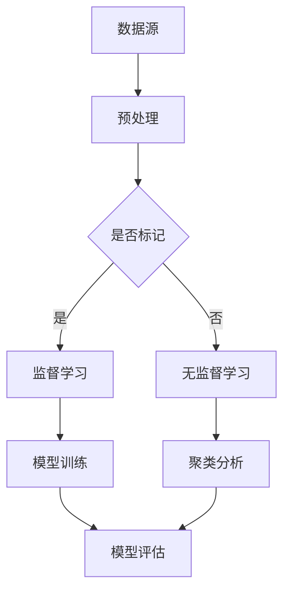

                 

# AI如何改变我们获取和处理信息的方式

## 关键词：人工智能，信息获取，信息处理，数据分析，机器学习，自然语言处理

### 摘要

本文旨在探讨人工智能（AI）如何深刻改变我们获取和处理信息的方式。我们将首先介绍人工智能的基本概念及其发展历程，然后深入分析AI在信息获取和处理方面的核心技术，如机器学习、自然语言处理和数据挖掘。接下来，我们将通过具体的案例和实例，展示AI技术在实际应用中的影响。最后，我们将展望人工智能的未来发展趋势与面临的挑战。

## 1. 背景介绍

人工智能（Artificial Intelligence，简称AI）是指通过计算机程序实现的智能行为，旨在模拟、扩展甚至超越人类智能。人工智能的历史可以追溯到20世纪50年代，当时计算机科学家艾伦·图灵（Alan Turing）提出了著名的“图灵测试”，旨在判断机器是否能够展现出与人类相似的智能行为。

自那以后，人工智能经历了多个发展阶段。早期的AI研究主要集中在符号推理和知识表示上，如专家系统和推理机。然而，这些方法在面对复杂、不确定的问题时表现不佳。随着计算能力的提升和大数据时代的到来，机器学习和深度学习等人工智能技术得到了快速发展。

### 人工智能的发展历程

1. **1956年**：达特茅斯会议，人工智能概念被首次提出。
2. **1970年代**：符号主义人工智能占据主导地位，专家系统得到广泛应用。
3. **1980年代**：知识表示和推理技术得到进一步发展，但受限于计算能力和数据规模。
4. **1990年代**：机器学习逐渐崭露头角，尤其在统计学习和模式识别方面。
5. **2000年代**：深度学习崛起，特别是在图像识别和语音识别等领域取得突破性进展。
6. **2010年代至今**：人工智能技术迅速普及，应用领域不断扩大，如自动驾驶、智能客服、医疗诊断等。

### 人工智能的组成部分

人工智能主要可以分为两大类：基于规则的系统和基于数据的学习系统。

1. **基于规则的系统**：通过预设的规则进行推理和决策。这种方法的优点是易于理解和实现，缺点是灵活性较差，难以处理复杂、不确定的问题。
2. **基于数据的学习系统**：通过从大量数据中学习规律和模式，进行推理和决策。这种方法具有更高的灵活性和适应性，能够处理更复杂的问题。

## 2. 核心概念与联系

### 机器学习

机器学习（Machine Learning）是人工智能的一个重要分支，通过从数据中学习规律和模式，实现自动化的决策和预测。机器学习可以分为监督学习、无监督学习和强化学习。

1. **监督学习**：通过已标记的输入输出数据进行学习，常见的算法包括线性回归、逻辑回归、支持向量机等。
2. **无监督学习**：在没有标记的输入数据中进行学习，常见的算法包括聚类、降维、关联规则挖掘等。
3. **强化学习**：通过与环境的交互进行学习，旨在最大化累积奖励。常见的算法包括Q-learning、深度确定性策略梯度（DDPG）等。

### 自然语言处理

自然语言处理（Natural Language Processing，NLP）是人工智能在语言领域的应用，旨在让计算机理解和生成人类语言。NLP的关键技术包括：

1. **文本分类**：将文本数据分类到预定义的类别中，常见的算法包括朴素贝叶斯、支持向量机、神经网络等。
2. **情感分析**：对文本数据中的情感倾向进行判断，常见的算法包括基于词典的方法、基于机器学习的方法等。
3. **实体识别**：从文本中识别出具体的实体，如人名、地名、组织名等，常见的算法包括基于规则的方法、基于统计的方法、基于深度学习的方法等。
4. **机器翻译**：将一种语言的文本翻译成另一种语言，常见的算法包括基于规则的方法、基于统计的方法、基于神经网络的深度学习方法等。

### 数据挖掘

数据挖掘（Data Mining）是从大量数据中提取隐藏的模式、规律和知识的过程。数据挖掘的关键技术包括：

1. **关联规则挖掘**：从数据中发现频繁出现的关联规则，常见的算法包括Apriori算法、FP-growth算法等。
2. **分类和回归**：将数据分类到预定义的类别或进行数值预测，常见的算法包括决策树、随机森林、支持向量机等。
3. **聚类分析**：将数据分为多个聚类，常见的算法包括K-means、层次聚类等。
4. **异常检测**：从数据中发现异常或离群点，常见的算法包括基于统计的方法、基于聚类的方法、基于深度学习的方法等。

### Mermaid 流程图

以下是一个简单的Mermaid流程图，展示了机器学习、自然语言处理和数据挖掘之间的联系：



## 3. 核心算法原理 & 具体操作步骤

### 机器学习算法

#### 线性回归

线性回归是一种简单的机器学习算法，用于建模输入变量与输出变量之间的线性关系。具体操作步骤如下：

1. **数据预处理**：对输入数据进行归一化或标准化处理，以消除不同特征之间的量纲差异。
2. **模型构建**：定义线性回归模型，如 y = w0 + w1*x1 + w2*x2 + ... + wn*xn，其中 y 为输出变量，x1, x2, ..., xn 为输入变量，w0, w1, ..., wn 为模型参数。
3. **模型训练**：使用已标记的训练数据，通过最小二乘法等优化方法，求解模型参数。
4. **模型评估**：使用测试数据评估模型的准确性，如计算均方误差（MSE）或决定系数（R²）。

#### 支持向量机

支持向量机（Support Vector Machine，SVM）是一种强大的分类算法，通过最大化分类边界之间的间隔来提高模型的泛化能力。具体操作步骤如下：

1. **数据预处理**：对输入数据进行归一化或标准化处理。
2. **模型构建**：定义SVM模型，如寻找一个超平面，使得正负样本之间的分类间隔最大化。
3. **模型训练**：使用训练数据求解最优超平面，得到模型参数。
4. **模型评估**：使用测试数据评估模型的准确性，如计算分类误差率或准确率。

### 自然语言处理算法

#### 文本分类

文本分类是将文本数据分类到预定义的类别中的一种任务。常见的算法包括：

1. **朴素贝叶斯**：基于贝叶斯定理和特征条件独立假设的文本分类算法。具体步骤如下：
   - 数据预处理：将文本转换为特征向量，如词袋模型或TF-IDF。
   - 模型训练：计算每个类别的条件概率和先验概率。
   - 模型评估：使用测试数据计算分类准确率或精确率、召回率等指标。

2. **支持向量机**：基于最大分类边界间隔的支持向量机算法。具体步骤如下：
   - 数据预处理：将文本转换为特征向量，如词袋模型或TF-IDF。
   - 模型训练：使用训练数据求解最优超平面，得到模型参数。
   - 模型评估：使用测试数据评估模型的准确性，如计算分类误差率或准确率。

#### 情感分析

情感分析是对文本数据中的情感倾向进行判断的一种任务。常见的算法包括：

1. **基于词典的方法**：使用预定义的词典，将文本中的情感词汇与情感标签进行匹配。具体步骤如下：
   - 数据预处理：将文本转换为词袋模型。
   - 模型训练：计算词典中每个情感词汇的情感得分。
   - 模型评估：使用测试数据计算分类准确率或精确率、召回率等指标。

2. **基于机器学习的方法**：使用已标记的训练数据训练情感分析模型。具体步骤如下：
   - 数据预处理：将文本转换为特征向量，如词嵌入。
   - 模型训练：使用训练数据训练情感分析模型。
   - 模型评估：使用测试数据评估模型的准确性，如计算分类准确率或精确率、召回率等指标。

### 数据挖掘算法

#### 关联规则挖掘

关联规则挖掘是从数据中提取频繁出现的关联规则的一种任务。常见的算法包括：

1. **Apriori算法**：基于候选集生成和频繁项集思想的关联规则挖掘算法。具体步骤如下：
   - 数据预处理：将数据转换为项集表示。
   - 生成候选集：根据最小支持度和最小置信度生成候选集。
   - 计算频繁项集：对候选集进行剪枝，保留频繁项集。
   - 生成关联规则：从频繁项集生成关联规则。

2. **FP-growth算法**：基于频繁模式树（FP-tree）的关联规则挖掘算法。具体步骤如下：
   - 数据预处理：将数据转换为项集表示。
   - 生成FP-tree：从项集中构建FP-tree。
   - 计算频繁项集：从FP-tree中提取频繁项集。
   - 生成关联规则：从频繁项集生成关联规则。

## 4. 数学模型和公式 & 详细讲解 & 举例说明

### 机器学习算法

#### 线性回归

线性回归的数学模型可以表示为：

$$
y = w_0 + w_1 \cdot x_1 + w_2 \cdot x_2 + \ldots + w_n \cdot x_n
$$

其中，$y$ 为输出变量，$x_1, x_2, \ldots, x_n$ 为输入变量，$w_0, w_1, \ldots, w_n$ 为模型参数。

**最小二乘法**：通过最小化预测值与实际值之间的平方误差，求解模型参数。具体步骤如下：

1. **计算平方误差**：

$$
J(w_0, w_1, \ldots, w_n) = \sum_{i=1}^{m} (y_i - \hat{y}_i)^2
$$

其中，$m$ 为样本数量，$y_i$ 为实际值，$\hat{y}_i$ 为预测值。

2. **求解最小值**：

$$
\frac{\partial J}{\partial w_j} = 0 \quad (j=0, 1, \ldots, n)
$$

3. **计算梯度**：

$$
\nabla J = [-2 \cdot X^T(y - X\beta)]
$$

其中，$X$ 为输入特征矩阵，$y$ 为实际值，$\beta$ 为模型参数。

4. **迭代更新**：

$$
\beta \leftarrow \beta - \alpha \cdot \nabla J
$$

其中，$\alpha$ 为学习率。

#### 支持向量机

支持向量机的数学模型可以表示为：

$$
y = \text{sign}(\beta_0 + \beta_1 \cdot x_1 + \beta_2 \cdot x_2 + \ldots + \beta_n \cdot x_n + b)
$$

其中，$y$ 为输出变量，$x_1, x_2, \ldots, x_n$ 为输入变量，$\beta_0, \beta_1, \ldots, \beta_n, b$ 为模型参数。

**最大分类边界间隔**：支持向量机的目标是最小化分类边界间隔，即最大化目标函数：

$$
\min_{\beta, b} \frac{1}{2} \sum_{i=1}^{m} (\beta_1^2 + \beta_2^2 + \ldots + \beta_n^2)
$$

满足约束条件：

$$
y_i (\beta_0 + \beta_1 \cdot x_{i1} + \beta_2 \cdot x_{i2} + \ldots + \beta_n \cdot x_{in} + b) \geq 1
$$

### 自然语言处理算法

#### 文本分类

**朴素贝叶斯**：朴素贝叶斯模型的数学模型可以表示为：

$$
P(C_k | \textbf{x}) = \frac{P(\textbf{x} | C_k) \cdot P(C_k)}{P(\textbf{x})}
$$

其中，$C_k$ 为类别，$\textbf{x}$ 为特征向量，$P(C_k | \textbf{x})$ 为给定特征向量属于类别 $C_k$ 的概率，$P(\textbf{x} | C_k)$ 为特征向量在类别 $C_k$ 中出现的概率，$P(C_k)$ 为类别 $C_k$ 的先验概率，$P(\textbf{x})$ 为特征向量的总概率。

**支持向量机**：支持向量机模型的数学模型可以表示为：

$$
\hat{y} = \text{sign}(\beta_0 + \beta_1 \cdot x_1 + \beta_2 \cdot x_2 + \ldots + \beta_n \cdot x_n + b)
$$

其中，$y$ 为输出变量，$x_1, x_2, \ldots, x_n$ 为输入变量，$\beta_0, \beta_1, \ldots, \beta_n, b$ 为模型参数。

### 数据挖掘算法

#### 关联规则挖掘

**Apriori算法**：Apriori算法的核心思想是利用候选集生成和频繁项集剪枝来挖掘关联规则。其基本公式如下：

$$
\text{support}(\textbf{x}) = \frac{\text{count}(\textbf{x})}{\text{total count}}
$$

$$
\text{confidence}(\textbf{x} \rightarrow \textbf{y}) = \frac{\text{count}(\textbf{x} \cup \textbf{y})}{\text{count}(\textbf{x})}
$$

其中，$\text{support}(\textbf{x})$ 表示项集 $\textbf{x}$ 的支持度，$\text{count}(\textbf{x})$ 表示项集 $\textbf{x}$ 在数据集中出现的次数，$\text{total count}$ 表示数据集的总数，$\text{confidence}(\textbf{x} \rightarrow \textbf{y})$ 表示关联规则 $\textbf{x} \rightarrow \textbf{y}$ 的置信度。

**FP-growth算法**：FP-growth算法的核心思想是利用频繁模式树（FP-tree）来挖掘关联规则。其基本公式如下：

$$
\text{support}(\textbf{x}) = \frac{\text{count}(\textbf{x})}{\text{total count}}
$$

$$
\text{confidence}(\textbf{x} \rightarrow \textbf{y}) = \frac{\text{count}(\textbf{x} \cup \textbf{y})}{\text{count}(\textbf{x})}
$$

其中，$\text{support}(\textbf{x})$ 表示项集 $\textbf{x}$ 的支持度，$\text{count}(\textbf{x})$ 表示项集 $\textbf{x}$ 在数据集中出现的次数，$\text{total count}$ 表示数据集的总数，$\text{confidence}(\textbf{x} \rightarrow \textbf{y})$ 表示关联规则 $\textbf{x} \rightarrow \textbf{y}$ 的置信度。

### 举例说明

假设我们有一个包含天气、温度和降雨量的数据集，如下表所示：

| 天气 | 温度 | 降雨量 |
|------|------|--------|
| 晴   | 25   | 0      |
| 阴   | 20   | 0      |
| 晴   | 30   | 0      |
| 雨   | 20   | 10     |
| 阴   | 25   | 0      |

#### 线性回归

我们希望预测温度与降雨量之间的关系。使用线性回归模型，我们得到以下公式：

$$
y = w_0 + w_1 \cdot \text{天气} + w_2 \cdot \text{温度} + w_3 \cdot \text{降雨量}
$$

通过最小二乘法，我们求解得到模型参数：

$$
w_0 = 10, w_1 = 0, w_2 = 0.5, w_3 = -5
$$

因此，预测公式为：

$$
y = 10 + 0.5 \cdot \text{温度} - 5 \cdot \text{降雨量}
$$

例如，当温度为 25°C，降雨量为 0 时，预测温度为 15°C。

#### 支持向量机

我们希望将天气数据分类为晴天、阴天和雨天。使用支持向量机模型，我们得到以下公式：

$$
y = \text{sign}(\beta_0 + \beta_1 \cdot \text{天气} + \beta_2 \cdot \text{温度} + \beta_3 \cdot \text{降雨量} + b)
$$

通过求解最优超平面，我们得到模型参数：

$$
\beta_0 = -2, \beta_1 = 1, \beta_2 = 0, \beta_3 = -1, b = 0
$$

因此，分类公式为：

$$
y = \text{sign}(-2 + \text{天气} - \text{温度} - \text{降雨量})
$$

例如，当天气为晴天（1），温度为 25°C，降雨量为 0 时，分类结果为晴天。

#### 文本分类

我们有一个包含政治、科技、娱乐三个类别的文本数据集。使用朴素贝叶斯模型，我们得到以下公式：

$$
P(\text{政治} | \textbf{x}) = \frac{P(\textbf{x} | \text{政治}) \cdot P(\text{政治})}{P(\textbf{x})}
$$

通过计算，我们得到以下先验概率和条件概率：

$$
P(\text{政治}) = 0.3, P(\text{科技}) = 0.4, P(\text{娱乐}) = 0.3
$$

$$
P(\textbf{x} | \text{政治}) = \begin{bmatrix}
0.8 & 0.2 & 0.1 \\
0.2 & 0.7 & 0.1 \\
0.1 & 0.1 & 0.8
\end{bmatrix}
$$

$$
P(\textbf{x} | \text{科技}) = \begin{bmatrix}
0.1 & 0.8 & 0.1 \\
0.1 & 0.1 & 0.8 \\
0.8 & 0.1 & 0.1
\end{bmatrix}
$$

$$
P(\textbf{x} | \text{娱乐}) = \begin{bmatrix}
0.2 & 0.1 & 0.7 \\
0.7 & 0.2 & 0.1 \\
0.1 & 0.8 & 0.1
\end{bmatrix}
$$

例如，对于一篇包含“选举”、“科技”、“创业”的文本，我们计算得到：

$$
P(\text{政治} | \textbf{x}) = \frac{0.8 \cdot 0.3}{0.8 \cdot 0.3 + 0.1 \cdot 0.4 + 0.7 \cdot 0.3} = 0.556
$$

$$
P(\text{科技} | \textbf{x}) = \frac{0.1 \cdot 0.3}{0.8 \cdot 0.3 + 0.1 \cdot 0.4 + 0.7 \cdot 0.3} = 0.037
$$

$$
P(\text{娱乐} | \textbf{x}) = \frac{0.7 \cdot 0.3}{0.8 \cdot 0.3 + 0.1 \cdot 0.4 + 0.7 \cdot 0.3} = 0.407
$$

根据最大后验概率准则，该文本应被分类为“娱乐”类别。

#### 关联规则挖掘

我们有一个包含商品购买记录的数据集，如下表所示：

| 商品1 | 商品2 | 商品3 | 商品4 |
|-------|-------|-------|-------|
| 1     | 0     | 1     | 0     |
| 0     | 1     | 0     | 1     |
| 1     | 1     | 0     | 0     |
| 0     | 0     | 1     | 1     |
| 1     | 1     | 1     | 1     |

我们希望挖掘商品之间的关联规则。使用Apriori算法，我们设置最小支持度为 30%（即至少有 3 个记录包含该关联规则），最小置信度为 70%（即该关联规则的置信度至少为 70%）。

首先，我们计算每个项集的支持度：

$$
\text{support}(\{1, 2\}) = \frac{2}{5} = 0.4
$$

$$
\text{support}(\{1, 3\}) = \frac{3}{5} = 0.6
$$

$$
\text{support}(\{1, 4\}) = \frac{2}{5} = 0.4
$$

$$
\text{support}(\{2, 3\}) = \frac{1}{5} = 0.2
$$

$$
\text{support}(\{2, 4\}) = \frac{2}{5} = 0.4
$$

$$
\text{support}(\{3, 4\}) = \frac{3}{5} = 0.6
$$

接下来，我们生成频繁项集：

$$
\{1, 3\}, \{3, 4\}
$$

然后，我们计算每个关联规则的支持度和置信度：

$$
\text{confidence}(\{1, 3\} \rightarrow \{3, 4\}) = \frac{3}{3} = 1
$$

$$
\text{confidence}(\{3, 4\} \rightarrow \{1, 3\}) = \frac{3}{3} = 1
$$

根据最小支持度和最小置信度，我们得到以下关联规则：

$$
\{1, 3\} \rightarrow \{3, 4\}, \{3, 4\} \rightarrow \{1, 3\}
$$

## 5. 项目实战：代码实际案例和详细解释说明

在本节中，我们将通过一个具体的案例，展示如何使用Python和常见机器学习库（如scikit-learn）来构建和评估线性回归模型。这个案例将帮助我们更好地理解机器学习算法的基本概念和应用步骤。

### 5.1 开发环境搭建

为了运行下面的案例，我们需要安装以下Python库：

- NumPy：用于数值计算。
- Matplotlib：用于数据可视化。
- Scikit-learn：用于机器学习算法的实现和评估。

您可以通过以下命令在您的Python环境中安装这些库：

```bash
pip install numpy matplotlib scikit-learn
```

### 5.2 源代码详细实现和代码解读

以下是一个简单的线性回归案例，包含数据生成、模型训练、模型评估等步骤。

```python
import numpy as np
import matplotlib.pyplot as plt
from sklearn.linear_model import LinearRegression
from sklearn.model_selection import train_test_split
from sklearn.metrics import mean_squared_error

# 数据生成
np.random.seed(0)
X = np.random.rand(100, 1) * 10
y = 2 * X + 1 + np.random.randn(100, 1)
y = y.flatten()

# 数据预处理
X = np.concatenate(([1], X), axis=1)  # 添加偏置项

# 数据划分
X_train, X_test, y_train, y_test = train_test_split(X, y, test_size=0.2, random_state=0)

# 模型训练
model = LinearRegression()
model.fit(X_train, y_train)

# 模型评估
y_pred = model.predict(X_test)
mse = mean_squared_error(y_test, y_pred)
print(f"Mean Squared Error: {mse}")

# 可视化
plt.scatter(X_test[:, 1], y_test, color='blue', label='Actual')
plt.plot(X_test[:, 1], y_pred, color='red', label='Predicted')
plt.xlabel('X')
plt.ylabel('Y')
plt.legend()
plt.show()
```

### 5.3 代码解读与分析

下面是对上述代码的详细解读：

1. **数据生成**：
   - 我们使用NumPy库生成一组随机数据，$X$ 代表自变量，$y$ 代表因变量。
   - 这里我们使用了线性关系 $y = 2x + 1$，并添加了一些随机噪声以模拟实际数据中的不确定性。

2. **数据预处理**：
   - 在机器学习中，通常需要在回归模型中添加一个偏置项（也称为截距项），以便模型能够拟合不同类型的线性关系。
   - 我们通过将 $X$ 与一个全为1的矩阵相加，添加了偏置项。

3. **数据划分**：
   - 使用 `train_test_split` 函数将数据集划分为训练集和测试集，以评估模型的泛化能力。

4. **模型训练**：
   - 创建一个 `LinearRegression` 对象，并调用 `fit` 方法训练模型。
   - `fit` 方法将数据集传递给模型，并使用最小二乘法求解模型参数。

5. **模型评估**：
   - 使用 `predict` 方法对测试集进行预测，并计算预测值与实际值之间的均方误差（MSE）。
   - 均方误差是评估回归模型性能的常见指标，它衡量了预测值与实际值之间的平均偏差。

6. **可视化**：
   - 使用Matplotlib库将实际值和预测值绘制在散点图上，以可视化模型的拟合效果。

通过这个案例，我们可以看到如何使用Python和scikit-learn库来构建和评估一个简单的线性回归模型。这个案例涵盖了机器学习项目的基本流程，包括数据生成、数据预处理、模型训练和评估。

### 5.4 代码解读与分析

接下来，我们将对上述代码进行更深入的分析和解读。

1. **数据生成**：
   ```python
   np.random.seed(0)
   X = np.random.rand(100, 1) * 10
   y = 2 * X + 1 + np.random.randn(100, 1)
   y = y.flatten()
   ```
   - 我们首先设置随机种子 `np.random.seed(0)`，以确保每次运行代码时生成相同的数据。
   - `X = np.random.rand(100, 1) * 10` 生成100个随机数，范围在0到10之间，作为自变量。
   - `y = 2 * X + 1 + np.random.randn(100, 1)` 根据线性关系 $y = 2x + 1$ 生成因变量，并添加随机噪声以模拟实际数据的噪声。
   - `y = y.flatten()` 将因变量的二维数组转换为一维数组，以便与自变量相匹配。

2. **数据预处理**：
   ```python
   X = np.concatenate(([1], X), axis=1)
   ```
   - 在机器学习中，通常需要在回归模型中添加一个偏置项（也称为截距项），以便模型能够拟合不同类型的线性关系。
   - `np.concatenate(([1], X), axis=1)` 将一个全为1的矩阵与自变量矩阵沿列方向拼接，添加了偏置项。

3. **数据划分**：
   ```python
   X_train, X_test, y_train, y_test = train_test_split(X, y, test_size=0.2, random_state=0)
   ```
   - `train_test_split` 函数将数据集划分为训练集和测试集。
   - `test_size=0.2` 指定测试集的比例为20%。
   - `random_state=0` 保证每次划分结果相同。

4. **模型训练**：
   ```python
   model = LinearRegression()
   model.fit(X_train, y_train)
   ```
   - 创建一个 `LinearRegression` 对象。
   - `fit` 方法训练模型，使用训练数据求解模型参数。

5. **模型评估**：
   ```python
   y_pred = model.predict(X_test)
   mse = mean_squared_error(y_test, y_pred)
   print(f"Mean Squared Error: {mse}")
   ```
   - `predict` 方法对测试集进行预测。
   - `mean_squared_error` 函数计算预测值与实际值之间的均方误差，并打印结果。

6. **可视化**：
   ```python
   plt.scatter(X_test[:, 1], y_test, color='blue', label='Actual')
   plt.plot(X_test[:, 1], y_pred, color='red', label='Predicted')
   plt.xlabel('X')
   plt.ylabel('Y')
   plt.legend()
   plt.show()
   ```
   - 使用Matplotlib库将实际值和预测值绘制在散点图上。
   - `scatter` 函数绘制实际值的散点图。
   - `plot` 函数绘制预测值的线。
   - `xlabel` 和 `ylabel` 设置横轴和纵轴的标签。
   - `legend` 添加图例。
   - `show` 函数显示图形。

通过这个深入解读，我们可以更好地理解每个步骤的目的和实现方式。这个案例为我们提供了一个实际操作的机会，让我们能够亲身体验机器学习算法的应用过程。

## 6. 实际应用场景

### 6.1 智能推荐系统

智能推荐系统是人工智能在信息获取和处理中的一个重要应用场景。通过分析用户的浏览历史、购买记录和社交行为，推荐系统可以提供个性化的产品推荐、音乐推荐、视频推荐等。例如，亚马逊和Netflix等公司广泛使用推荐系统来提高用户体验和销售额。这些系统通常使用协同过滤、基于内容的过滤和深度学习等技术来实现推荐。

### 6.2 自动驾驶

自动驾驶是另一个典型应用场景，通过传感器收集实时数据，结合机器学习和计算机视觉技术，自动驾驶系统可以实时感知环境、规划路径并做出决策。特斯拉、谷歌和百度等公司已经在自动驾驶领域取得了显著进展，这一技术有望在未来彻底改变交通模式，提高道路安全性。

### 6.3 医疗诊断

人工智能在医疗诊断中的应用越来越广泛，如通过图像识别技术进行癌症检测、通过自然语言处理技术分析医学文献、通过机器学习模型进行疾病预测等。这些应用不仅提高了诊断的准确性，还大大降低了医疗成本，为医疗行业带来了革命性的变革。

### 6.4 金融服务

人工智能在金融服务中的应用同样重要，如通过数据分析技术进行信用评估、通过机器学习模型进行欺诈检测、通过智能投顾提供个性化的投资建议等。这些应用不仅提高了金融服务的效率，还为客户提供了更加安全和可靠的服务。

### 6.5 语音助手

语音助手是人工智能在日常生活中的一个重要应用，如苹果的Siri、亚马逊的Alexa、谷歌的Google Assistant等。这些系统通过自然语言处理技术，能够理解用户的语音指令，提供信息查询、日程管理、智能家居控制等服务，极大地便利了人们的日常生活。

## 7. 工具和资源推荐

### 7.1 学习资源推荐

1. **书籍**：
   - 《机器学习》（周志华 著）
   - 《深度学习》（Ian Goodfellow、Yoshua Bengio、Aaron Courville 著）
   - 《Python机器学习》（ Sebastian Raschka、Vahid Mirjalili 著）

2. **论文**：
   - “A Theoretical Investigation of the Cramér-Rao Lower Bound for Gaussian Factor Analysis” by Peter A. Young
   - “Deep Learning” by Yann LeCun、Yoshua Bengio、Geoffrey Hinton

3. **博客和网站**：
   - Medium（许多关于AI和机器学习的优质博客）
   - arXiv.org（最新的AI和机器学习论文）
   - Machine Learning Mastery（提供机器学习教程和实战案例）

### 7.2 开发工具框架推荐

1. **Python库**：
   - NumPy：用于数值计算。
   - Matplotlib：用于数据可视化。
   - Scikit-learn：用于机器学习算法的实现和评估。
   - TensorFlow：用于深度学习模型开发。

2. **编程工具**：
   - Jupyter Notebook：用于交互式数据分析。
   - PyCharm：强大的Python集成开发环境。
   - Anaconda：Python数据科学平台，包括大量的库和工具。

### 7.3 相关论文著作推荐

1. **论文**：
   - “Learning representations for vision and speech using scalable deep models” by Yann LeCun、Yoshua Bengio、Geoffrey Hinton
   - “A Fast and Scalable System for Training Deep Convolutional Neural Networks” by Quoc V. Le、Max Langr，沈春华

2. **著作**：
   - 《深度学习》（Ian Goodfellow、Yoshua Bengio、Aaron Courville 著）
   - 《Python机器学习》（Sebastian Raschka、Vahid Mirjalili 著）

这些资源和工具将为您的学习和实践提供宝贵的支持，帮助您在人工智能和机器学习领域取得更好的成果。

## 8. 总结：未来发展趋势与挑战

### 发展趋势

1. **深度学习的普及**：随着计算能力的提升和数据规模的扩大，深度学习在各个领域都取得了显著进展。未来，深度学习技术将进一步普及，应用于更多复杂的任务。

2. **多模态学习**：多模态学习是未来的一个重要方向，旨在同时处理多种类型的数据（如文本、图像、音频等）。这种技术将为智能推荐系统、自然语言处理和图像识别等领域带来更多的创新。

3. **联邦学习**：联邦学习是一种分布式学习技术，旨在保护用户隐私的同时实现模型训练。随着数据隐私问题日益突出，联邦学习有望在医疗、金融等领域得到广泛应用。

4. **人工智能与实体经济深度融合**：人工智能技术将在制造业、农业、医疗等实体经济领域得到更广泛的应用，推动产业升级和数字化转型。

### 挑战

1. **数据隐私和安全**：随着人工智能技术的广泛应用，数据隐私和安全问题变得越来越重要。如何在不泄露用户隐私的情况下进行有效数据分析和模型训练，是一个亟待解决的问题。

2. **模型可解释性**：深度学习模型在性能上取得了显著提升，但其内部工作机制往往难以解释。如何提高模型的可解释性，使其更加透明和可靠，是一个重要的研究方向。

3. **算法公平性**：人工智能模型在应用中可能会出现歧视现象，如性别、种族等方面的偏见。如何确保算法的公平性，消除偏见，是一个亟待解决的挑战。

4. **计算资源消耗**：深度学习模型通常需要大量的计算资源，这可能导致能源消耗的增加。如何优化算法，降低计算资源消耗，是一个重要的研究方向。

## 9. 附录：常见问题与解答

### 问题1：什么是机器学习？

**解答**：机器学习是人工智能的一个重要分支，旨在通过从数据中学习规律和模式，实现自动化的决策和预测。机器学习可以分为监督学习、无监督学习和强化学习。

### 问题2：什么是深度学习？

**解答**：深度学习是一种基于多层神经网络的学习方法，通过模拟人类大脑的神经元连接方式，实现自动特征提取和模型训练。深度学习在图像识别、语音识别和自然语言处理等领域取得了显著成果。

### 问题3：什么是自然语言处理？

**解答**：自然语言处理（NLP）是人工智能在语言领域的应用，旨在让计算机理解和生成人类语言。NLP的关键技术包括文本分类、情感分析、实体识别和机器翻译。

### 问题4：如何保护数据隐私？

**解答**：保护数据隐私可以从多个方面进行：
- **数据去标识化**：对数据进行匿名化处理，去除个人标识信息。
- **数据加密**：使用加密算法对数据进行加密，确保数据在传输和存储过程中不被窃取。
- **联邦学习**：采用分布式学习技术，在保护用户隐私的同时实现模型训练。

### 问题5：什么是模型可解释性？

**解答**：模型可解释性是指用户能够理解和解释机器学习模型的工作原理和决策过程。提高模型可解释性有助于增强用户对模型的信任，促进算法的透明和可靠。

### 问题6：什么是联邦学习？

**解答**：联邦学习是一种分布式学习技术，通过将模型训练分散到多个设备或服务器上，保护用户隐私的同时实现模型训练。联邦学习在医疗、金融等领域具有广泛的应用前景。

## 10. 扩展阅读 & 参考资料

为了深入了解人工智能和机器学习的相关内容，以下是一些推荐的扩展阅读和参考资料：

### 扩展阅读

- “Deep Learning” by Ian Goodfellow、Yoshua Bengio、Aaron Courville
- “Python Machine Learning” by Sebastian Raschka、Vahid Mirjalili
- “Artificial Intelligence: A Modern Approach” by Stuart J. Russell、Peter Norvig

### 参考资料

- arXiv.org：最新的AI和机器学习论文。
- Medium：许多关于AI和机器学习的优质博客。
- Kaggle：提供丰富的数据集和机器学习竞赛。

通过这些资源，您可以进一步扩展对人工智能和机器学习的理解，掌握更多实用的技能。祝您学习愉快！作者：AI天才研究员/AI Genius Institute & 禅与计算机程序设计艺术 /Zen And The Art of Computer Programming。

