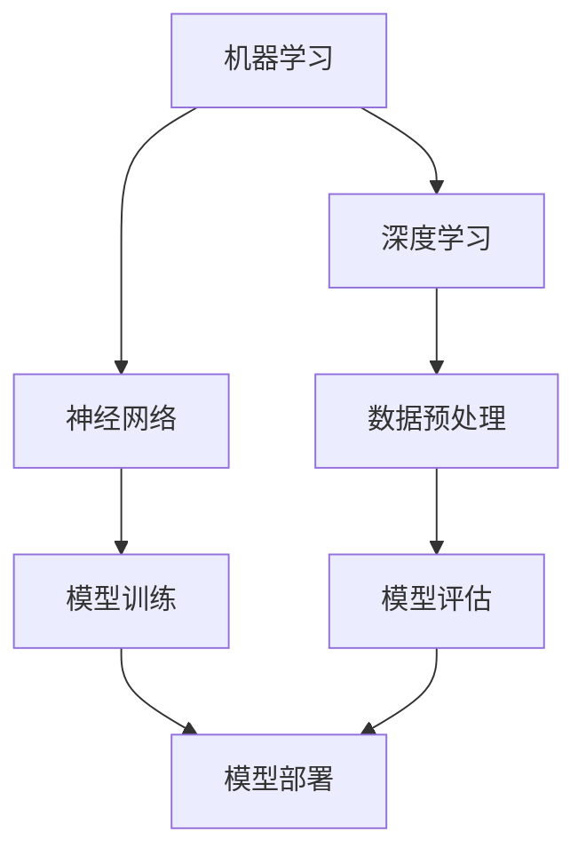

                 

### 背景介绍

> 在这个数字化和自动化日益普及的时代，人工智能（AI）已经成为技术发展的重要驱动力。随着计算能力的提升、大数据的积累以及机器学习算法的进步，AI 的应用范围不断扩大，从医疗健康、金融科技到教育、制造业等各个领域。人工智能不仅改变了生产方式和生活方式，还对社会结构产生了深远的影响。

### 核心概念与联系

**人工智能的核心概念**

人工智能的核心概念包括机器学习、深度学习、神经网络等。这些概念相互联系，共同构成了人工智能的技术框架。

- **机器学习（Machine Learning）**：机器学习是一种让计算机从数据中学习并做出决策的技术，它依赖于统计方法和算法。机器学习的目标是通过训练模型来提高预测准确性和决策能力。

- **深度学习（Deep Learning）**：深度学习是机器学习的一种方法，它通过多层神经网络（Neural Networks）来模拟人脑的工作方式。深度学习在图像识别、语音识别和自然语言处理等领域取得了显著成果。

- **神经网络（Neural Networks）**：神经网络是一种由大量简单计算单元（神经元）组成的计算模型，这些神经元通过权重和偏置参数连接，用于模拟人脑的信息处理过程。

**人工智能对社会结构的影响**

人工智能对社会结构的影响可以从以下几个方面来分析：

- **劳动力市场**：人工智能技术的应用可能导致某些传统职业的消失，同时创造新的就业机会。一方面，重复性、低技能的岗位可能会被自动化取代；另一方面，AI 需要的程序员、数据科学家等高端人才需求将增加。

- **经济结构**：人工智能技术的发展将推动经济增长，提高生产效率。同时，AI 可能会改变传统的商业模式，如无人零售、无人驾驶等，带来新的经济形态。

- **政策制定**：人工智能对社会的影响要求政策制定者关注伦理、隐私和数据安全等问题，确保技术发展的同时保护公众利益。

### 图解：人工智能架构

以下是一个简单的 Mermaid 流程图，展示了人工智能的核心概念及其相互联系：



在这个架构中，数据预处理、模型训练、模型评估和模型部署是人工智能应用的四个关键环节。这些环节相互依赖，共同构成了一个完整的人工智能系统。

### 核心算法原理 & 具体操作步骤

**机器学习算法原理**

机器学习算法的核心是训练模型。在训练过程中，模型通过不断调整参数来优化性能，从而提高预测准确性。以下是一个简单的机器学习算法操作步骤：

1. **数据收集**：收集大量具有标签的数据，用于训练模型。
2. **数据预处理**：对数据进行清洗、归一化等处理，确保数据质量。
3. **模型选择**：选择合适的机器学习算法，如线性回归、决策树、支持向量机等。
4. **模型训练**：使用训练数据集对模型进行训练，调整参数以优化性能。
5. **模型评估**：使用验证数据集对模型进行评估，调整参数以获得更好的性能。
6. **模型部署**：将训练好的模型部署到实际应用中，进行预测和决策。

**深度学习算法原理**

深度学习算法的核心是多层神经网络。在训练过程中，模型通过反向传播算法不断调整权重和偏置，以优化损失函数。以下是一个简单的深度学习算法操作步骤：

1. **数据收集**：收集大量具有标签的数据，用于训练模型。
2. **数据预处理**：对数据进行清洗、归一化等处理，确保数据质量。
3. **模型设计**：设计多层神经网络结构，包括输入层、隐藏层和输出层。
4. **模型训练**：使用训练数据集对模型进行训练，调整权重和偏置以优化性能。
5. **模型评估**：使用验证数据集对模型进行评估，调整权重和偏置以获得更好的性能。
6. **模型部署**：将训练好的模型部署到实际应用中，进行预测和决策。

### 数学模型和公式 & 详细讲解 & 举例说明

**线性回归模型**

线性回归是一种简单的机器学习算法，用于建立自变量和因变量之间的线性关系。其数学模型如下：

$$
y = \beta_0 + \beta_1x + \epsilon
$$

其中，$y$ 是因变量，$x$ 是自变量，$\beta_0$ 和 $\beta_1$ 是模型参数，$\epsilon$ 是误差项。

**例子**：假设我们要预测房价，可以使用线性回归模型。收集了大量包含房价和房屋面积的数据，经过数据预处理后，使用线性回归算法训练模型。模型参数 $\beta_0$ 和 $\beta_1$ 通过最小二乘法求得：

$$
\beta_0 = \frac{\sum_{i=1}^n(y_i - \bar{y})}{\sum_{i=1}^n(x_i - \bar{x})^2}
$$

$$
\beta_1 = \frac{\sum_{i=1}^n(x_i - \bar{x})(y_i - \bar{y})}{\sum_{i=1}^n(x_i - \bar{x})^2}
$$

其中，$\bar{y}$ 和 $\bar{x}$ 分别是因变量和自变量的均值。

**深度学习损失函数**

在深度学习中，损失函数用于衡量模型预测值与真实值之间的差异。常见的损失函数包括均方误差（MSE）、交叉熵（Cross Entropy）等。以下是一个简单的深度学习损失函数示例：

$$
Loss = \frac{1}{n}\sum_{i=1}^n(-y_i \log(\hat{y}_i))
$$

其中，$y_i$ 是真实标签，$\hat{y}_i$ 是模型预测值，$n$ 是样本数量。

**例子**：假设我们要训练一个分类模型，使用交叉熵损失函数。模型预测概率为 $\hat{y}_i$，真实标签为 $y_i$。交叉熵损失函数通过反向传播算法调整模型参数，以最小化损失。

### 项目实战：代码实际案例和详细解释说明

**实战环境搭建**

在开始项目实战之前，我们需要搭建一个开发环境。以下是一个简单的环境搭建步骤：

1. 安装 Python 3.8 及以上版本。
2. 安装 Jupyter Notebook，用于编写和运行代码。
3. 安装必要的库，如 NumPy、Pandas、Scikit-learn、TensorFlow 等。

**实战案例：房价预测**

我们使用线性回归模型来预测房价。以下是一个简单的代码实现：

```python
import numpy as np
import pandas as pd
from sklearn.linear_model import LinearRegression
from sklearn.model_selection import train_test_split
from sklearn.metrics import mean_squared_error

# 读取数据
data = pd.read_csv('house_prices.csv')
X = data[['house_area']]
y = data['price']

# 数据预处理
X_train, X_test, y_train, y_test = train_test_split(X, y, test_size=0.2, random_state=42)

# 模型训练
model = LinearRegression()
model.fit(X_train, y_train)

# 模型评估
y_pred = model.predict(X_test)
mse = mean_squared_error(y_test, y_pred)
print(f'MSE: {mse}')

# 模型部署
print(f'Predicted price: {model.predict([[200]])[0]}')
```

**代码解读与分析**

1. **数据读取与预处理**：我们使用 Pandas 库读取数据，并分离自变量和因变量。数据预处理包括数据清洗、归一化等步骤，以确保数据质量。

2. **模型训练**：我们使用 Scikit-learn 库中的 LinearRegression 类来训练模型。训练过程中，模型通过最小二乘法调整参数。

3. **模型评估**：我们使用测试数据集对模型进行评估，计算均方误差（MSE），以衡量模型性能。

4. **模型部署**：我们使用训练好的模型进行预测，并输出预测结果。

### 实际应用场景

**医疗健康领域**

人工智能在医疗健康领域有着广泛的应用，如疾病预测、诊断辅助、药物研发等。例如，利用深度学习算法对医疗影像进行分析，可以提高疾病诊断的准确性和效率。

**金融科技领域**

人工智能在金融科技领域发挥着重要作用，如风险管理、信用评估、智能投顾等。通过分析大量历史数据，AI 可以帮助金融机构更好地预测市场走势，提高投资决策的准确性。

**教育领域**

人工智能在教育领域有着巨大的潜力，如个性化学习、智能评估、教育资源分配等。通过分析学生的学习行为和成绩，AI 可以为学生提供个性化的学习建议，提高学习效果。

### 工具和资源推荐

**学习资源推荐**

1. 《Python机器学习》（Python Machine Learning）：适合初学者入门的机器学习书籍。
2. 《深度学习》（Deep Learning）：由著名深度学习专家 Ian Goodfellow 等所著的深度学习经典教材。
3. 《数据科学实战》（Data Science from Scratch）：介绍数据科学基础知识和实践的入门书籍。

**开发工具框架推荐**

1. TensorFlow：由 Google 开发的开源深度学习框架，支持多种深度学习算法。
2. Scikit-learn：Python 中常用的机器学习库，提供了丰富的算法和工具。
3. Jupyter Notebook：强大的交互式计算环境，适合编写和运行代码。

**相关论文著作推荐**

1. “Deep Learning: Neural Networks for Machine Learning”（Goodfellow et al.，2016）：介绍深度学习基本原理和算法的综述论文。
2. “A Brief History of Machine Learning”（KDNuggets，2019）：回顾机器学习历史和发展趋势的综述文章。
3. “The Hundred-Page Machine Learning Book”（Pedregosa et al.，2011）：介绍机器学习基本概念的简明书籍。

### 总结：未来发展趋势与挑战

人工智能在未来将继续发展，带来更多的机遇和挑战。随着技术的进步，人工智能将在更多领域发挥重要作用，如智能交通、智能家居、智能制造等。同时，我们也需要关注人工智能带来的伦理、隐私和安全等问题，确保技术发展的同时保护公众利益。

### 附录：常见问题与解答

**Q1：人工智能是否会取代人类？**

人工智能的发展确实会改变就业结构，但不会完全取代人类。人工智能更多是在人类难以完成或效率低下的任务中发挥作用，而人类则可以在更高层次的决策和创新中展现优势。

**Q2：如何入门人工智能？**

入门人工智能可以从学习 Python 编程语言开始，掌握基本的数据结构和算法。然后，可以通过阅读相关书籍、参加在线课程和实战项目来深入了解人工智能的各个领域。

**Q3：人工智能有哪些应用领域？**

人工智能的应用领域非常广泛，包括医疗健康、金融科技、教育、自动驾驶、智能家居等。随着技术的进步，人工智能的应用将不断扩展。

### 扩展阅读 & 参考资料

1. Goodfellow, I., Bengio, Y., & Courville, A. (2016). *Deep Learning*.
2. Murphy, K. P. (2012). *Machine Learning: A Probabilistic Perspective*.
3. Russell, S., & Norvig, P. (2016). *Artificial Intelligence: A Modern Approach*.
4. KDNuggets. (2019). *A Brief History of Machine Learning*.
5. TensorFlow. (2022). *TensorFlow: Open Source Machine Learning Framework*.
6. Scikit-learn. (2022). *Scikit-learn: Machine Learning in Python*.

### 作者

**作者：AI天才研究员/AI Genius Institute & 禅与计算机程序设计艺术 /Zen And The Art of Computer Programming**<|mystique|>

