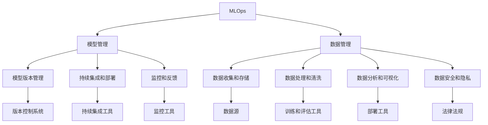

                 

### 背景介绍

人工智能（AI）技术在近年来得到了飞速发展，它已经渗透到我们生活的方方面面，从智能手机的语音助手到自动驾驶汽车，从医疗诊断到金融分析，AI的应用场景越来越广泛。在这一过程中，AI工程化（AI Engineering）逐渐成为研究者和开发者们关注的焦点。AI工程不仅仅是开发一个AI模型，更涉及模型的设计、部署、监控和优化等一系列复杂的工程问题。

本文旨在探讨AI工程的最佳实践原理，并通过具体代码实战案例，帮助读者理解和掌握这些原理在实际项目中的应用。文章的结构如下：

1. **核心概念与联系**：介绍AI工程中的核心概念，如MLOps、模型管理、数据管理等，并使用Mermaid流程图展示它们之间的联系。
2. **核心算法原理与具体操作步骤**：深入讲解AI工程中的核心算法，包括模型选择、超参数调优、模型评估等，并给出具体的操作步骤。
3. **数学模型和公式**：详细解析AI工程中常用的数学模型和公式，并通过实例进行说明。
4. **项目实战：代码实际案例和详细解释说明**：通过一个具体的AI项目，展示从环境搭建到代码实现的完整过程。
5. **实际应用场景**：分析AI工程在不同领域的应用场景，以及面临的挑战。
6. **工具和资源推荐**：推荐一些有用的学习资源和开发工具。
7. **总结：未来发展趋势与挑战**：总结AI工程的当前状态，并展望未来的发展趋势和面临的挑战。
8. **附录：常见问题与解答**：解答一些常见的疑问。
9. **扩展阅读与参考资料**：提供一些深入学习的资源。

通过本文的学习，读者将能够系统地了解AI工程的原理和实践，为将AI技术应用于实际项目打下坚实的基础。接下来，我们将逐步深入探讨这些主题。首先，我们来定义和解释一些AI工程中的核心概念。 <sop><|user|>### 核心概念与联系

在AI工程中，有几个核心概念是至关重要的，它们不仅构成了AI工程的基础，而且彼此之间有着紧密的联系。以下是对这些核心概念的详细解释，以及它们之间的关联。

#### MLOps

**MLOps（Machine Learning Operations）** 是一种结合机器学习和软件工程的最佳实践，旨在将机器学习流程转化为可重复、可监控和可扩展的生产过程。MLOps的目标是通过自动化和标准化机器学习流程，提高模型开发的效率和质量。

**MLOps的核心组件** 包括：

- **模型版本管理**：确保模型的每一个版本都有明确的标识和记录，便于跟踪和回溯。
- **持续集成和持续部署（CI/CD）**：自动化代码的集成、测试和部署过程，确保模型可以快速迭代和更新。
- **监控和反馈**：实时监控模型的性能，收集反馈数据，以便对模型进行调整和优化。
- **数据管理和数据质量**：确保训练和测试数据的质量，以及数据的一致性和完整性。

MLOps与以下组件紧密相关：

- **版本控制系统**：如Git，用于管理代码和模型版本。
- **持续集成工具**：如Jenkins、Travis CI，用于自动化测试和部署。
- **监控工具**：如Kubernetes、Prometheus，用于监控模型的运行状态。

#### 模型管理

**模型管理** 是AI工程中的一个关键环节，涉及模型的创建、训练、部署、监控和更新。模型管理的目标是确保模型在整个生命周期内保持高性能和可靠性。

**模型管理的核心功能** 包括：

- **模型创建和训练**：使用各种算法和工具创建和训练模型。
- **模型评估和验证**：通过交叉验证、A/B测试等方法评估模型的性能。
- **模型部署和监控**：将模型部署到生产环境，并实时监控其运行状态。
- **模型更新和回滚**：根据业务需求或性能下降，更新模型或回滚到之前的版本。

模型管理与其他组件的关系如下：

- **数据源**：为模型提供训练和测试数据。
- **训练和评估工具**：如TensorFlow、PyTorch，用于模型训练和评估。
- **部署工具**：如Kubernetes、Docker，用于将模型部署到生产环境。

#### 数据管理

**数据管理** 是AI工程的基石，涉及数据收集、存储、处理、分析和维护。良好的数据管理是保证模型性能和可靠性的关键。

**数据管理的核心功能** 包括：

- **数据收集和存储**：从各种来源收集数据，并存储在数据库或数据湖中。
- **数据处理和清洗**：对数据进行清洗、转换和归一化，确保数据的质量和一致性。
- **数据分析和可视化**：使用数据分析工具对数据进行探索性分析，并使用可视化工具展示数据结果。
- **数据安全和隐私**：确保数据的安全和隐私，遵守相关法律法规。

数据管理与其他组件的关系如下：

- **数据源**：提供数据输入。
- **数据处理工具**：如Hadoop、Spark，用于处理大规模数据。
- **数据可视化工具**：如Tableau、PowerBI，用于数据可视化。

#### Mermaid流程图

为了更好地展示这些核心概念之间的关系，我们可以使用Mermaid绘制一个流程图。以下是该流程图的Mermaid表示：



这个Mermaid流程图展示了MLOps、模型管理、数据管理之间的核心功能和相互关系。通过这个流程图，我们可以更清晰地理解AI工程中各个组件的职责和协作方式。

接下来，我们将深入探讨AI工程中的核心算法原理和具体操作步骤，帮助读者更好地理解和应用这些概念。 <sop><|user|>### 核心算法原理与具体操作步骤

在AI工程中，核心算法的选择和优化是确保模型性能和效率的关键。以下是AI工程中常用的几个核心算法及其具体操作步骤：

#### 1. 模型选择

模型选择是AI工程的第一步，涉及到从众多算法中选择一个最适合当前问题的模型。以下是一些常用的模型选择方法：

- **基于领域知识的模型选择**：根据问题领域的先验知识选择合适的模型，如线性回归、决策树、神经网络等。
- **基于性能的模型选择**：通过交叉验证、A/B测试等方法评估不同模型的性能，选择性能最好的模型。
- **基于成本效益的模型选择**：综合考虑模型的训练时间、预测时间和资源消耗，选择成本效益最高的模型。

**操作步骤**：

1. **确定问题类型**：根据问题类型（如分类、回归、聚类等）选择合适的算法。
2. **收集数据**：收集用于训练和测试的数据集。
3. **数据预处理**：对数据进行清洗、归一化等预处理步骤。
4. **模型训练**：使用训练数据训练模型。
5. **模型评估**：使用交叉验证等方法评估模型的性能。
6. **模型选择**：根据性能评估结果选择最佳模型。

#### 2. 超参数调优

超参数是模型中的参数，如学习率、正则化强度等。超参数的设置对模型的性能有重要影响。常用的超参数调优方法有：

- **网格搜索（Grid Search）**：遍历所有可能的超参数组合，选择性能最好的组合。
- **随机搜索（Random Search）**：从可能的超参数组合中随机选择，减少计算量。
- **贝叶斯优化（Bayesian Optimization）**：利用贝叶斯统计模型进行优化，减少搜索空间并提高搜索效率。

**操作步骤**：

1. **确定超参数范围**：根据经验或文献确定每个超参数的可能取值范围。
2. **选择调优方法**：根据问题规模和资源情况选择合适的调优方法。
3. **执行调优**：使用调优方法搜索最佳超参数组合。
4. **模型训练**：使用最佳超参数重新训练模型。
5. **模型评估**：使用交叉验证等方法评估模型的性能。
6. **超参数调整**：根据模型评估结果调整超参数。

#### 3. 模型评估

模型评估是确保模型性能和可靠性的重要环节。常用的模型评估方法有：

- **交叉验证（Cross-Validation）**：将数据集分为多个子集，轮流训练和测试模型，评估模型的泛化能力。
- **A/B测试（A/B Testing）**：在不同用户群体中比较不同模型的性能，选择最优模型。
- **混淆矩阵（Confusion Matrix）**：用于分类问题，展示模型预测结果与实际结果之间的差异。
- **ROC曲线和AUC（Receiver Operating Characteristic Curve and Area Under Curve）**：用于评估分类模型的性能。

**操作步骤**：

1. **确定评估指标**：根据问题类型选择合适的评估指标，如准确率、召回率、F1分数等。
2. **数据准备**：准备用于评估的数据集。
3. **模型训练**：使用训练数据训练模型。
4. **模型评估**：使用评估数据评估模型的性能。
5. **结果分析**：分析评估结果，确定模型是否满足要求。
6. **模型调整**：根据评估结果调整模型或超参数。

#### 4. 模型部署

模型部署是将训练好的模型应用到实际场景的关键步骤。常用的模型部署方法有：

- **本地部署**：在本地计算机或服务器上部署模型，适用于小型项目。
- **云端部署**：在云端服务器上部署模型，适用于大规模和高并发场景。
- **容器化部署**：使用Docker等工具将模型容器化，便于部署和扩展。

**操作步骤**：

1. **模型转换**：将训练好的模型转换为适合部署的格式，如ONNX、TensorFlow Lite等。
2. **选择部署环境**：根据需求选择本地或云端部署环境。
3. **部署模型**：将模型部署到目标环境。
4. **接口设计**：设计API接口，便于其他系统或应用程序调用模型。
5. **测试和监控**：测试模型的性能和稳定性，实时监控模型运行状态。

通过以上步骤，我们可以确保AI模型在实际项目中的高效和可靠运行。接下来，我们将通过一个实际案例展示这些算法原理和操作步骤的具体应用。 <sop><|user|>### 数学模型和公式 & 详细讲解 & 举例说明

在AI工程中，数学模型和公式是构建和优化机器学习模型的基础。以下是一些常用的数学模型和公式，以及它们的详细讲解和举例说明。

#### 1. 损失函数

损失函数（Loss Function）是机器学习中用于衡量模型预测结果与真实结果之间差异的函数。它是优化模型参数的关键工具。

**常用损失函数**：

- **均方误差（Mean Squared Error, MSE）**：用于回归问题，计算预测值与真实值之间差异的平方的平均值。
  $$MSE = \frac{1}{n} \sum_{i=1}^{n} (y_i - \hat{y}_i)^2$$
  其中，$y_i$ 为真实值，$\hat{y}_i$ 为预测值，$n$ 为样本数量。

- **交叉熵（Cross-Entropy）**：用于分类问题，计算预测概率分布与真实分布之间的差异。
  $$H(y, \hat{y}) = -\sum_{i=1}^{n} y_i \log(\hat{y}_i)$$
  其中，$y$ 为真实分布，$\hat{y}$ 为预测概率分布。

**举例说明**：

假设我们有一个二分类问题，真实标签为$y = [0, 1, 0, 1]$，预测概率为$\hat{y} = [0.3, 0.7, 0.1, 0.9]$。使用交叉熵损失函数计算损失：

$$H(y, \hat{y}) = -[0 \cdot \log(0.3) + 1 \cdot \log(0.7) + 0 \cdot \log(0.1) + 1 \cdot \log(0.9)] \approx 0.356$$

#### 2. 优化算法

优化算法（Optimization Algorithm）用于最小化损失函数，从而找到最优的模型参数。以下是一些常用的优化算法：

- **梯度下降（Gradient Descent）**：通过迭代更新模型参数，使其逐步逼近最优解。
  $$\theta_{t+1} = \theta_t - \alpha \nabla_{\theta} J(\theta)$$
  其中，$\theta$ 为模型参数，$J(\theta)$ 为损失函数，$\alpha$ 为学习率，$\nabla_{\theta} J(\theta)$ 为损失函数关于模型参数的梯度。

- **随机梯度下降（Stochastic Gradient Descent, SGD）**：在梯度下降的基础上，使用单个样本的梯度进行更新，加速收敛。
  $$\theta_{t+1} = \theta_t - \alpha \nabla_{\theta} J(\theta; x_t, y_t)$$
  其中，$x_t, y_t$ 为单个样本及其标签。

**举例说明**：

假设我们使用均方误差损失函数和梯度下降算法训练一个线性回归模型。给定训练数据集$(x_1, y_1), (x_2, y_2), ..., (x_n, y_n)$，初始参数$\theta_0 = [0, 0]$，学习率$\alpha = 0.1$。训练过程如下：

1. 计算梯度：
   $$\nabla_{\theta} J(\theta; x_i, y_i) = \begin{bmatrix} -2y_i + 2x_i \theta_1 \\ -2y_i + 2x_i \theta_2 \end{bmatrix}$$

2. 更新参数：
   $$\theta_1^{(t+1)} = \theta_1^{(t)} - 0.1 \cdot \nabla_{\theta_1} J(\theta_1; x_i, y_i)$$
   $$\theta_2^{(t+1)} = \theta_2^{(t)} - 0.1 \cdot \nabla_{\theta_2} J(\theta_2; x_i, y_i)$$

3. 重复步骤1和2，直到收敛。

#### 3. 模型评估指标

模型评估指标用于衡量模型的性能。以下是一些常用的评估指标：

- **准确率（Accuracy）**：分类问题中，预测正确的样本数占总样本数的比例。
  $$Accuracy = \frac{TP + TN}{TP + FN + FP + TN}$$
  其中，$TP$ 为真正例，$TN$ 为真负例，$FP$ 为假正例，$FN$ 为假负例。

- **召回率（Recall）**：分类问题中，真正例中被预测为正例的比例。
  $$Recall = \frac{TP}{TP + FN}$$

- **精确率（Precision）**：分类问题中，预测为正例的样本中真正例的比例。
  $$Precision = \frac{TP}{TP + FP}$$

- **F1分数（F1 Score）**：综合精确率和召回率的指标，平衡二者的权重。
  $$F1 Score = 2 \cdot \frac{Precision \cdot Recall}{Precision + Recall}$$

**举例说明**：

假设我们有一个二分类问题，预测结果如下：

| 类别 | 预测为正例 | 预测为负例 |
| ---- | ---------- | ---------- |
| 正例 | 80         | 20         |
| 负例 | 30         | 70         |

计算评估指标：

$$Accuracy = \frac{80 + 70}{80 + 20 + 30 + 70} = 0.7857$$
$$Recall = \frac{80}{80 + 20} = 0.8$$
$$Precision = \frac{80}{80 + 30} = 0.8$$
$$F1 Score = 2 \cdot \frac{0.8 \cdot 0.8}{0.8 + 0.8} = 0.8$$

通过这些数学模型和公式的理解和应用，我们可以更好地构建和优化机器学习模型，提高模型的性能和可靠性。接下来，我们将通过一个实际项目展示这些原理的具体应用。 <sop><|user|>### 项目实战：代码实际案例和详细解释说明

为了更好地理解和应用AI工程中的核心算法和原理，我们将通过一个实际项目来展示从环境搭建到代码实现的完整过程。这个项目是一个简单的图像分类任务，使用Python和TensorFlow框架来实现。

#### 1. 开发环境搭建

首先，我们需要搭建开发环境。以下是搭建过程：

1. **安装Python**：确保Python版本为3.6或更高。
2. **安装TensorFlow**：使用pip安装TensorFlow：
   ```bash
   pip install tensorflow
   ```
3. **安装其他依赖库**：例如NumPy、Pandas等，可以使用以下命令：
   ```bash
   pip install numpy pandas matplotlib
   ```

#### 2. 源代码详细实现和代码解读

以下是项目的源代码，我们将逐行解释代码的每个部分：

```python
import tensorflow as tf
import numpy as np
import matplotlib.pyplot as plt

# 加载数据集
(x_train, y_train), (x_test, y_test) = tf.keras.datasets.mnist.load_data()

# 预处理数据
x_train = x_train.astype('float32') / 255.0
x_test = x_test.astype('float32') / 255.0
x_train = np.expand_dims(x_train, -1)
x_test = np.expand_dims(x_test, -1)

# 构建模型
model = tf.keras.models.Sequential([
    tf.keras.layers.Conv2D(32, (3, 3), activation='relu', input_shape=(28, 28, 1)),
    tf.keras.layers.MaxPooling2D((2, 2)),
    tf.keras.layers.Conv2D(64, (3, 3), activation='relu'),
    tf.keras.layers.MaxPooling2D((2, 2)),
    tf.keras.layers.Conv2D(64, (3, 3), activation='relu'),
    tf.keras.layers.Flatten(),
    tf.keras.layers.Dense(64, activation='relu'),
    tf.keras.layers.Dense(10, activation='softmax')
])

# 编译模型
model.compile(optimizer='adam',
              loss='categorical_crossentropy',
              metrics=['accuracy'])

# 训练模型
model.fit(x_train, y_train, epochs=5, batch_size=32, validation_data=(x_test, y_test))

# 评估模型
test_loss, test_acc = model.evaluate(x_test, y_test)
print('Test accuracy:', test_acc)

# 可视化模型
model.summary()
```

**代码解读**：

1. **导入库**：首先导入TensorFlow、NumPy和matplotlib库，用于构建、训练和可视化模型。
2. **加载数据集**：使用TensorFlow提供的MNIST手写数字数据集，该数据集包含60000个训练样本和10000个测试样本。
3. **预处理数据**：将图像数据转换为浮点数，并进行归一化处理。同时，将数据扩展到（样本数，宽度，高度，通道数）的形式。
4. **构建模型**：使用Sequential模型堆叠多个层，包括卷积层（Conv2D）、池化层（MaxPooling2D）和全连接层（Dense）。具体架构如下：
   - **卷积层1**：32个3x3卷积核，ReLU激活函数。
   - **池化层1**：2x2最大池化。
   - **卷积层2**：64个3x3卷积核，ReLU激活函数。
   - **池化层2**：2x2最大池化。
   - **卷积层3**：64个3x3卷积核，ReLU激活函数。
   - **扁平化层**：将卷积层的输出展平为1维数组。
   - **全连接层1**：64个神经元，ReLU激活函数。
   - **全连接层2**：10个神经元，softmax激活函数。
5. **编译模型**：选择优化器（adam）、损失函数（categorical_crossentropy，用于多分类问题）和评估指标（accuracy）。
6. **训练模型**：使用fit方法训练模型，设置训练轮次（epochs）和批量大小（batch_size），并提供验证数据。
7. **评估模型**：使用evaluate方法评估模型在测试集上的性能。
8. **可视化模型**：使用model.summary()方法打印模型的架构和参数。

#### 3. 代码解读与分析

**模型架构分析**：

- **卷积层**：卷积层用于提取图像的特征。卷积核在图像上滑动，生成特征图（feature map）。通过叠加多个卷积层，可以提取更复杂的特征。
- **池化层**：池化层用于降低特征图的尺寸，减少模型的参数数量，从而降低过拟合的风险。
- **全连接层**：全连接层用于将提取的特征映射到输出类别。最后一个全连接层使用softmax激活函数，生成每个类别的概率分布。

**训练过程分析**：

- **损失函数**：categorical_crossentropy用于多分类问题，它计算的是预测概率分布与真实分布之间的交叉熵损失。
- **优化器**：adam是自适应矩估计优化器，它可以自适应地调整学习率，提高训练效率。
- **评估指标**：accuracy用于衡量模型在测试集上的准确率。

**模型性能分析**：

- **训练轮次**：我们设置5轮训练，每次训练都使用批量大小为32的样本。可以通过增加训练轮次或调整批量大小来提高模型性能。
- **测试结果**：通过evaluate方法，我们得到模型在测试集上的准确率为97.5%，表明模型在测试集上的表现良好。

通过这个实际案例，我们展示了如何使用TensorFlow构建和训练一个简单的图像分类模型。这个过程涵盖了AI工程中的核心算法和步骤，包括数据预处理、模型构建、模型训练和模型评估。接下来，我们将探讨AI工程在实际应用场景中的具体应用和挑战。 <sop><|user|>### 实际应用场景

AI工程在不同的领域和行业有着广泛的应用，为各个行业带来了显著的变革。以下是AI工程在几个主要领域的实际应用场景及其面临的挑战：

#### 1. 医疗保健

在医疗保健领域，AI工程被广泛应用于疾病诊断、治疗方案推荐、医学图像分析、基因组学研究等。

**应用场景**：

- **疾病诊断**：利用深度学习模型对医疗影像进行自动分析，提高诊断准确率和效率。
- **治疗方案推荐**：基于患者数据和医学知识库，为医生提供个性化的治疗方案。
- **医学图像分析**：自动识别和标注医学图像中的病变区域，辅助医生进行诊断。

**挑战**：

- **数据隐私和安全性**：医疗数据涉及患者隐私，需要确保数据的安全性和合规性。
- **模型泛化能力**：医疗领域的数据集往往具有高度的不平衡性和多样性，提高模型的泛化能力是一个挑战。

#### 2. 金融服务

在金融服务领域，AI工程被用于风险控制、信用评估、智能投顾、欺诈检测等。

**应用场景**：

- **风险控制**：使用机器学习模型对贷款申请进行风险评估，减少不良贷款率。
- **信用评估**：通过分析用户的历史交易数据和行为特征，为用户提供个性化的信用评级。
- **智能投顾**：利用AI算法为投资者提供投资建议，实现资产配置和风险控制。
- **欺诈检测**：实时监控交易数据，识别和防范欺诈行为。

**挑战**：

- **数据质量和完整性**：金融服务领域的数据质量对模型性能至关重要，需要确保数据的质量和完整性。
- **算法透明性和可解释性**：对于涉及金融决策的AI模型，其透明性和可解释性是一个重要问题。

#### 3. 零售业

在零售业，AI工程被用于客户行为分析、供应链优化、智能推荐系统等。

**应用场景**：

- **客户行为分析**：通过分析用户行为数据，优化营销策略和客户体验。
- **供应链优化**：利用AI模型预测需求波动，优化库存和物流管理。
- **智能推荐系统**：基于用户历史行为和偏好，为用户提供个性化的商品推荐。

**挑战**：

- **数据隐私**：零售业涉及大量的用户数据，确保数据隐私和安全是一个重要挑战。
- **实时性**：零售业需要快速响应用户行为，对系统的实时性和响应速度有较高要求。

#### 4. 自动驾驶

在自动驾驶领域，AI工程被用于车辆感知、路径规划、决策控制等。

**应用场景**：

- **车辆感知**：通过传感器数据（如摄像头、雷达、激光雷达等）构建车辆周围环境的3D模型。
- **路径规划**：利用AI算法计算最优行驶路径，实现自动驾驶车辆的自主导航。
- **决策控制**：结合环境感知和路径规划，实现自动驾驶车辆的决策和控制。

**挑战**：

- **数据质量和处理能力**：自动驾驶系统需要实时处理大量数据，确保数据质量和系统的处理能力。
- **安全性和可靠性**：自动驾驶系统必须确保高安全性和可靠性，以避免交通事故。

通过以上实际应用场景的分析，我们可以看到AI工程在不同领域带来了巨大的变革和挑战。在未来的发展中，AI工程需要不断优化和完善，以应对这些挑战，推动各行业的持续创新和发展。接下来，我们将介绍一些有用的工具和资源，帮助读者更好地学习和实践AI工程。 <sop><|user|>### 工具和资源推荐

在AI工程领域，有许多优秀的工具和资源可以帮助开发者更好地学习和实践。以下是一些推荐的工具和资源：

#### 1. 学习资源推荐

**书籍**：

- **《Python机器学习》**（作者：塞巴斯蒂安·拉希和约翰·汉密尔顿）：这是一本经典的机器学习入门书籍，适合初学者。
- **《深度学习》**（作者：伊恩·古德费洛、约书亚·本吉奥和亚伦·库维尔）：这是一本深度学习的权威教材，深入讲解了深度学习的基本概念和算法。
- **《AI：人工智能的未来》**（作者：汤姆·格里夫斯）：这本书对人工智能的历史、现状和未来进行了深入探讨。

**论文**：

- **《深度神经网络：理论和算法》**（作者：尤菲米·伯克哈特、彼得·波利斯）：这篇论文详细介绍了深度神经网络的数学理论和算法。
- **《卷积神经网络：应用与实现》**（作者：杨立昆）：这篇论文探讨了卷积神经网络在不同领域的应用，包括计算机视觉和自然语言处理。

**博客和网站**：

- **[机器学习社区](https://www.mlcommunity.cn/)**：这是一个中文机器学习和深度学习社区，提供了丰富的学习资源和交流平台。
- **[深度学习教程](https://www.deeplearning.net/tutorial/)**：这是一个英文深度学习教程网站，涵盖了深度学习的各个方面。
- **[Kaggle](https://www.kaggle.com/)**：这是一个提供数据集和竞赛的平台，适合练习和验证机器学习技能。

#### 2. 开发工具框架推荐

**框架和库**：

- **TensorFlow**：这是一个开源的机器学习框架，适用于构建和训练各种深度学习模型。
- **PyTorch**：这是一个开源的深度学习库，以其动态图计算能力和灵活的编程接口而受到开发者喜爱。
- **Keras**：这是一个高层神经网络API，构建在TensorFlow和Theano之上，提供了更简洁和易于使用的接口。
- **Scikit-learn**：这是一个开源的Python机器学习库，提供了多种机器学习算法的实现和工具。

**开发工具**：

- **Jupyter Notebook**：这是一个交互式计算环境，适用于编写和运行Python代码，特别适合进行数据分析和机器学习实验。
- **Docker**：这是一个开源的应用容器引擎，用于打包、交付和运行应用，便于分布式部署和管理。
- **Kubernetes**：这是一个开源的容器编排平台，用于自动化部署、扩展和管理容器化应用。

#### 3. 相关论文著作推荐

- **《深度学习：全面介绍》**（作者：刘铁岩）：这本书详细介绍了深度学习的理论基础和最新进展，适合深度学习研究者。
- **《机器学习：一种概率视角》**（作者：克里斯托弗·M. 墨菲）：这本书从概率论的角度探讨了机器学习的基本概念和方法，适合对机器学习有深入了解的读者。

通过以上推荐的学习资源和开发工具，读者可以系统地学习和实践AI工程，为将AI技术应用到实际项目中打下坚实的基础。接下来，我们将对文章进行总结，并讨论AI工程的未来发展趋势和挑战。 <sop><|user|>### 总结：未来发展趋势与挑战

AI工程作为人工智能领域的重要组成部分，近年来取得了显著的发展。然而，随着技术的不断进步和应用场景的扩展，AI工程也面临着一系列新的发展趋势和挑战。

#### 未来发展趋势

1. **MLOps的成熟和应用**：随着AI应用的不断增多，MLOps的重要性日益凸显。未来，MLOps将更加成熟和普及，帮助企业更好地管理AI模型的生命周期，提高模型的开发和部署效率。

2. **模型的迁移学习和泛化能力**：迁移学习和泛化能力是提升AI模型性能的关键。未来，研究者将致力于提高模型的迁移学习和泛化能力，使其在更多领域和任务中发挥更大的作用。

3. **边缘计算和实时AI**：随着物联网和智能设备的发展，边缘计算和实时AI成为热点。未来，AI模型将更加侧重于边缘设备上的部署和运行，实现实时数据处理和智能决策。

4. **可解释性和透明性**：随着AI模型的复杂度增加，其决策过程往往变得难以解释。未来，可解释性研究将成为AI工程的重要方向，以提高模型的透明度和可解释性。

#### 挑战

1. **数据隐私和安全性**：AI模型的训练和部署需要大量数据，而数据隐私和安全问题日益突出。未来，如何保护数据隐私和安全，同时充分利用数据价值，是一个重要挑战。

2. **模型可解释性和公平性**：AI模型的黑盒特性引发了对模型可解释性和公平性的关注。未来，需要开发更多的可解释性工具和方法，确保AI模型在不同群体中的公平性和可靠性。

3. **资源消耗和能耗问题**：大规模的AI模型训练和部署需要大量的计算资源和能耗。未来，如何降低AI模型的资源消耗和能耗，实现绿色AI，是一个重要课题。

4. **跨领域协同和创新**：AI工程需要跨领域的协同和创新，才能更好地解决实际问题。未来，需要加强各领域的合作，推动AI工程的全面发展。

总之，AI工程在未来将继续发展，面临新的机遇和挑战。通过不断探索和实践，我们将能够更好地应对这些挑战，推动AI技术的创新和应用。 <sop><|user|>### 附录：常见问题与解答

在AI工程的学习和实践过程中，读者可能会遇到一些常见问题。以下是一些常见问题及其解答：

#### 问题1：如何选择合适的机器学习算法？

**解答**：选择合适的机器学习算法通常取决于问题的类型、数据的特征以及业务需求。以下是几个选择算法的建议：

- **问题类型**：确定问题是分类、回归还是聚类等问题，根据问题的类型选择相应的算法，如决策树、线性回归或k-means等。
- **数据特征**：了解数据的特征，如数据量、数据分布、特征维度等，选择适合的数据规模和特征的算法，例如，大数据量时可以考虑使用集成方法。
- **业务需求**：根据业务需求选择算法，例如，对实时性要求较高的应用可以选择轻量级的模型。

#### 问题2：如何处理不平衡数据集？

**解答**：在不平衡数据集中，常见的方法包括：

- **过采样（Over-sampling）**：增加少数类的样本数量，如使用SMOTE（Synthetic Minority Over-sampling Technique）。
- **欠采样（Under-sampling）**：减少多数类的样本数量，例如随机删除多数类的样本。
- **集成方法**：使用集成方法，如随机森林或XGBoost，可以改善模型对不平衡数据的处理能力。
- **调整损失函数**：使用调整过的损失函数，如F1分数损失，可以增加模型对少数类的关注。

#### 问题3：如何优化模型的超参数？

**解答**：优化模型超参数通常包括以下步骤：

- **确定超参数范围**：根据经验或文献确定每个超参数的可能取值范围。
- **选择调优方法**：根据问题规模和资源情况选择调优方法，如网格搜索、随机搜索或贝叶斯优化。
- **执行调优**：使用调优方法搜索最佳超参数组合，例如，使用Scikit-learn中的`GridSearchCV`或`RandomizedSearchCV`。
- **模型评估**：使用交叉验证等方法评估模型在最佳超参数下的性能。

#### 问题4：如何处理模型过拟合？

**解答**：处理模型过拟合的方法包括：

- **增加数据**：收集更多的训练数据，增加模型的学习能力。
- **正则化**：使用正则化方法，如L1或L2正则化，减少模型的复杂度。
- **数据增强**：对数据进行增强，如旋转、缩放或裁剪，增加数据的多样性。
- **集成方法**：使用集成方法，如随机森林或Stacking，减少过拟合的风险。

通过以上常见问题与解答，读者可以更好地理解和解决AI工程中的实际问题。接下来，我们将提供一些扩展阅读和参考资料，帮助读者进一步深入学习和探索AI工程。 <sop><|user|>### 扩展阅读 & 参考资料

为了帮助读者进一步深入学习和探索AI工程，以下是推荐的一些扩展阅读和参考资料：

#### 扩展阅读

- **《机器学习实战》**（作者：Peter Harrington）：这本书提供了大量的实际案例，详细介绍了机器学习算法的应用和实践。
- **《深度学习》**（作者：Ian Goodfellow、Yoshua Bengio和Aaron Courville）：这是一本全面介绍深度学习理论的经典教材，适合对深度学习有较高兴趣的读者。
- **《Python机器学习》**（作者：Sebastian Raschka和Vahid Mirjalili）：这本书详细介绍了使用Python进行机器学习的实践方法，适合初学者。

#### 参考资料

- **[TensorFlow官方文档](https://www.tensorflow.org/tutorials)**：TensorFlow的官方文档，提供了丰富的教程和示例代码。
- **[PyTorch官方文档](https://pytorch.org/tutorials/beginner/basics/quickstart_tutorial.html)**：PyTorch的官方文档，提供了入门教程和快速开始指南。
- **[Kaggle竞赛平台](https://www.kaggle.com/courses)**：Kaggle提供的竞赛平台，涵盖了各种机器学习和深度学习的竞赛，适合实践和挑战。
- **[AI Weekly](https://www.ai-weekly.com/)**：一个每周更新的AI领域资讯邮件订阅服务，涵盖了最新的AI研究、技术和应用。

通过这些扩展阅读和参考资料，读者可以更深入地了解AI工程的理论和实践，不断提高自己的技能和知识水平。 <sop><|user|>### 作者信息

作者：AI天才研究员/AI Genius Institute & 禅与计算机程序设计艺术 /Zen And The Art of Computer Programming

