                 

### 背景介绍

AI底层创新体系的整体构建，是我们探讨人工智能发展的关键。在当今世界，人工智能（AI）已经成为推动科技进步的核心力量，影响着各行各业。然而，随着AI技术的飞速发展，如何构建一个稳定、高效、创新的底层体系成为了我们需要面对的挑战。

首先，我们需要了解AI技术的起源与发展。从最初的机器学习算法，到深度学习、强化学习等复杂算法，AI技术在不断地迭代与进步。每个阶段的突破，都为AI底层创新体系的建设提供了坚实的基础。例如，深度学习的崛起，推动了计算能力、数据资源、算法优化等多方面的创新，使得AI技术得以在图像识别、自然语言处理、智能决策等领域取得显著成果。

其次，我们需要认识到AI底层创新体系的重要性。一个稳定、高效的底层体系，不仅能够提升AI技术的性能，还能降低研发成本、缩短开发周期。例如，在自动驾驶领域，底层体系的建设直接关系到车辆的感知、决策、控制等环节，是确保自动驾驶安全、高效运行的关键。因此，构建一个完善、强大的AI底层创新体系，是我们推动AI技术实现广泛应用的重要保障。

当前，AI底层创新体系的建设面临诸多挑战。一方面，随着AI技术的不断发展，我们需要面对越来越复杂的应用场景和多样化的需求，这使得底层体系的构建更加困难。另一方面，AI底层创新体系的构建涉及多个学科领域，包括计算机科学、数学、物理学等，需要多学科的协同合作。此外，数据隐私、安全等问题也是我们必须面对的重要挑战。

本文将围绕AI底层创新体系的整体构建，探讨其核心概念、算法原理、数学模型、实战案例、应用场景、未来发展趋势等，旨在为广大读者提供一个全面、深入的探讨。

总之，AI底层创新体系的构建是推动人工智能技术发展的关键。我们需要从多个维度出发，应对当前的挑战，为实现AI技术的广泛应用奠定坚实基础。在接下来的内容中，我们将逐步深入探讨这一主题。让我们开始思考与探索吧！<|im_sep|>### 核心概念与联系

在构建AI底层创新体系的过程中，我们需要明确几个核心概念，并了解它们之间的联系，以便更好地理解整个体系的运作。

**1. 机器学习（Machine Learning）**

机器学习是AI技术的基础，它通过算法让计算机从数据中自动学习，进行预测和决策。机器学习可以分为监督学习（Supervised Learning）、无监督学习（Unsupervised Learning）和强化学习（Reinforcement Learning）等几种类型。监督学习有明确的标签数据，适用于分类和回归任务；无监督学习没有标签数据，主要用于聚类和降维；强化学习通过奖励机制训练模型，适用于决策和规划问题。

**2. 深度学习（Deep Learning）**

深度学习是机器学习的一个子领域，它通过多层神经网络对数据进行处理和建模，具有强大的特征提取和表达能力。深度学习的核心是神经网络，特别是深度神经网络（DNN），它可以自动学习数据中的复杂模式和结构，广泛应用于图像识别、语音识别、自然语言处理等领域。

**3. 计算能力（Computing Power）**

计算能力是AI底层创新体系的重要支撑。随着AI技术的不断发展，对计算能力的需求也日益增长。GPU（图形处理器）和TPU（张量处理器）等专用硬件的出现，大幅提升了AI模型的训练速度和推理性能，为AI底层创新体系的建设提供了强大的计算基础。

**4. 数据资源（Data Resources）**

数据是AI模型的训练基础，数据资源的丰富程度直接影响AI模型的性能和应用范围。数据的来源包括互联网、传感器、企业内部数据等，种类繁多，结构各异。为了充分利用这些数据，我们需要对数据进行清洗、标注、整合等预处理工作，以便为模型训练提供高质量的数据支持。

**5. 算法优化（Algorithm Optimization）**

算法优化是提升AI模型性能的关键手段。通过调整模型结构、优化参数、改进算法等手段，可以显著提高模型的准确率、效率和鲁棒性。算法优化包括模型压缩、加速、分布式训练等技术，这些技术能够有效地应对大规模数据处理和模型训练的需求。

**6. 安全性与隐私保护（Security and Privacy Protection）**

在构建AI底层创新体系的过程中，我们需要关注安全性和隐私保护问题。随着AI技术的广泛应用，数据安全和隐私保护成为了一个严峻的挑战。我们需要通过加密、匿名化、隐私计算等技术手段，确保用户数据和模型的安全性，防止数据泄露和滥用。

**7. 生态系统（Ecosystem）**

AI底层创新体系的构建不仅需要技术的支撑，还需要一个完善的生态系统。这个生态系统包括开发工具、开源框架、研究机构、企业合作等多方面的支持。一个健康的生态系统可以促进AI技术的创新和快速发展，为AI底层创新体系的构建提供持续的动力。

**Mermaid 流程图（Mermaid Flowchart）**

以下是AI底层创新体系的核心概念和联系的一个Mermaid流程图：

```mermaid
graph TB
A[机器学习] --> B[深度学习]
A --> C[计算能力]
A --> D[数据资源]
A --> E[算法优化]
A --> F[安全性]
A --> G[隐私保护]
B --> H[神经网络]
B --> I[GPU/TPU]
C --> J[硬件加速]
C --> K[分布式训练]
D --> L[数据清洗]
D --> M[数据标注]
E --> N[模型压缩]
E --> O[算法改进]
F --> P[加密]
F --> Q[匿名化]
F --> R[隐私计算]
G --> S[安全协议]
G --> T[访问控制]
G --> U[数据备份]
G --> V[数据恢复]
G --> W[合规性]
H --> X[特征提取]
H --> Y[模式识别]
I --> Z[推理加速]
I --> AA[训练加速]
J --> BB[硬件性能]
J --> CC[功耗优化]
K --> DD[模型并行]
K --> EE[数据并行]
L --> FF[去噪声]
L --> GG[标准化]
M --> HH[标签校验]
M --> II[一致性]
N --> JJ[模型量化]
N --> KK[剪枝]
O --> LL[超参数调优]
O --> MM[结构优化]
P --> NN[对称加密]
P --> OO[非对称加密]
Q --> PP[匿名通信]
Q --> QQ[差分隐私]
R --> SS[安全多方计算]
R --> TT[同态加密]
S --> UU[身份认证]
S --> VV[授权管理]
T --> WW[审计日志]
T --> XX[数据加密传输]
U --> YY[数据备份策略]
U --> ZZ[数据恢复方案]
V --> AAA[合规性检查]
V --> BBB[风险评估]
W --> CCC[数据使用协议]
W --> DDD[数据共享政策]
X --> EEE[图像识别]
X --> FFF[语音识别]
Y --> GGG[自然语言处理]
Y --> HHH[推荐系统]
Z --> III[实时推理]
Z --> JJJ[延迟容忍推理]
AA --> KKK[模型压缩效率]
AA --> LLL[存储优化]
BB --> MMM[硬件优化]
BB --> NNN[能耗优化]
CC --> OOO[分布式效率]
CC --> PPP[通信优化]
DD --> QQQ[数据清洗效率]
DD --> RRR[数据整合效果]
EE --> SSS[训练时间缩短]
EE --> TTT[资源利用率提升]
FF --> UUU[噪声去除效果]
FF --> VVV[数据质量提升]
GG --> WWWW[一致性评估]
GG --> XXX[数据完整性]
HH --> YYY[标签准确度]
HH --> ZZZ[标注一致性]
II --> AAAA[数据一致性]
II --> BBBB[数据完整性]
JJ --> CCC[模型压缩比]
JJ --> DDD[模型推理速度]
KK --> EEE[超参数优化效果]
KK --> FFF[模型训练时间]
LL --> GGG[模型性能提升]
LL --> HHH[模型稳定性]
MM --> IIII[结构优化效果]
MM --> JJJ[计算效率]
NN --> KKK[加密强度]
NN --> LLL[加密效率]
OO --> MMM[通信安全]
OO --> NNN[计算隐私]
PP --> OOO[匿名化效果]
PP --> PPP[隐私保护强度]
QQ --> RRR[通信效率]
QQ --> SSS[计算效率]
SS --> TTT[计算复杂性]
SS --> UUU[通信复杂性]
TT --> VVV[加密性能]
TT --> XXX[计算负载]
UU --> YYY[身份验证准确性]
UU --> ZZZ[访问控制强度]
VV --> AAAA[日志完整性]
VV --> BBBB[日志可用性]
WW --> CCC[合规性风险]
WW --> DDD[合规性成本]
XX --> EEE[数据传输安全性]
XX --> FFF[数据传输效率]
YY --> GGG[噪声抑制效果]
YY --> HHH[标注一致性]
ZZ --> IIII[数据恢复效果]
ZZ --> JJJ[数据恢复速度]
AAAA --> KKK[数据准确性]
AAAA --> LLL[数据一致性]
BBBB --> MMM[数据完整性]
BBBB --> NNN[数据可用性]
CCCC --> OOO[模型压缩比]
CCCC --> PPP[模型推理速度]
DDDD --> SSSS[超参数调优效果]
DDDD --> TTTT[模型训练时间]
EEEEE[特征提取效果]
EEEEE --> FFFFF[图像识别准确率]
EEEEE --> GGGGG[语音识别准确率]
FFEEE[算法改进效果]
FFEEE --> GGGGG[模型性能提升]
GGGGG[模型应用范围]
GGGGG --> HHHHH[自然语言处理效果]
GGGGG --> IIIII[推荐系统效果]
IIIII --> JJJJJ[用户满意度]
JJJJJ --> KKKKK[商业价值]
```



通过这个Mermaid流程图，我们可以清晰地看到AI底层创新体系中各个核心概念之间的联系，以及它们在实际应用中的相互作用。接下来，我们将进一步探讨AI底层创新体系的核心算法原理和具体操作步骤。<|im_sep|>### 核心算法原理 & 具体操作步骤

在构建AI底层创新体系的过程中，核心算法原理是推动体系发展的关键。以下我们将介绍几种常见的核心算法原理，并详细讲解其具体操作步骤。

#### 1. 神经网络（Neural Networks）

神经网络是深度学习的基础，它模拟人脑神经元的工作原理，通过多层结构对数据进行处理和建模。以下是神经网络的基本原理和操作步骤：

**原理：**

- **神经元结构：** 神经元是神经网络的基本单元，由输入层、输出层和隐藏层组成。每个神经元都有多个输入和输出，通过加权求和和激活函数产生输出。
- **激活函数：** 激活函数用于引入非线性特性，常用的激活函数有Sigmoid、ReLU、Tanh等。
- **反向传播：** 神经网络通过反向传播算法更新权重和偏置，以最小化损失函数。

**操作步骤：**

1. **数据预处理：** 将输入数据进行标准化处理，确保每个特征的均值为0，标准差为1。
2. **初始化权重和偏置：** 通常使用随机初始化方法，如高斯分布或均匀分布。
3. **前向传播：** 计算每个神经元的输出，通过激活函数得到预测值。
4. **计算损失：** 使用损失函数（如均方误差、交叉熵等）计算预测值与真实值之间的差距。
5. **反向传播：** 更新权重和偏置，以最小化损失函数。
6. **迭代训练：** 重复执行前向传播和反向传播，直到满足训练停止条件（如达到预定迭代次数或损失值小于阈值）。

#### 2. 深度学习（Deep Learning）

深度学习是基于多层神经网络的机器学习技术，具有强大的特征提取和表达能力。以下是深度学习的基本原理和操作步骤：

**原理：**

- **多层结构：** 深度学习通过增加隐藏层数量，提高模型的特征提取能力。
- **逐层学习：** 深度学习从底层开始学习简单的特征，逐渐向上层学习更复杂的特征。
- **端到端训练：** 深度学习通过端到端训练方式，直接从输入到输出，避免了传统机器学习中的特征工程过程。

**操作步骤：**

1. **数据预处理：** 与神经网络相同，对输入数据进行标准化处理。
2. **网络架构设计：** 根据任务需求设计合适的网络架构，包括输入层、隐藏层和输出层。
3. **初始化权重和偏置：** 使用随机初始化方法。
4. **前向传播：** 计算每个隐藏层的输出，通过激活函数得到预测值。
5. **计算损失：** 使用损失函数计算预测值与真实值之间的差距。
6. **反向传播：** 更新权重和偏置，以最小化损失函数。
7. **迭代训练：** 重复执行前向传播和反向传播，直到满足训练停止条件。

#### 3. 训练优化（Training Optimization）

训练优化是提升深度学习模型性能的重要手段，包括参数调整、算法改进和模型压缩等方面。以下是训练优化的一些常见方法：

**原理：**

- **超参数调整：** 超参数是影响模型性能的关键参数，如学习率、批量大小、隐藏层数量等。通过调整超参数，可以优化模型性能。
- **学习率调整：** 学习率是影响模型收敛速度和稳定性的重要参数。常用的学习率调整策略有固定学习率、学习率衰减、动量优化等。
- **正则化：** 正则化是防止模型过拟合的重要手段，常用的正则化方法有L1正则化、L2正则化、Dropout等。
- **模型压缩：** 模型压缩是降低模型复杂度和计算成本的重要方法，常用的模型压缩技术有模型剪枝、量化、模型蒸馏等。

**操作步骤：**

1. **选择合适的学习率：** 根据任务需求和数据分布，选择合适的学习率策略。
2. **调整批量大小：** 根据硬件资源和训练时间，选择合适的批量大小。
3. **应用正则化方法：** 根据任务需求，选择合适的正则化方法。
4. **模型压缩：** 根据应用场景，选择合适的模型压缩技术。

通过以上介绍，我们可以了解到神经网络、深度学习和训练优化在构建AI底层创新体系中的重要作用。接下来，我们将进一步探讨数学模型和公式在AI底层创新体系中的应用。<|im_sep|>### 数学模型和公式 & 详细讲解 & 举例说明

在AI底层创新体系中，数学模型和公式是核心组成部分，它们用于描述和优化算法性能。以下，我们将详细讲解几个关键数学模型和公式，并举例说明。

#### 1. 损失函数（Loss Function）

损失函数是评估模型预测值与真实值之间差距的数学工具，它用于指导模型优化。以下是几种常见的损失函数：

**均方误差（Mean Squared Error, MSE）**

$$
MSE = \frac{1}{n} \sum_{i=1}^{n} (y_i - \hat{y}_i)^2
$$

**交叉熵（Cross Entropy Loss）**

$$
CrossEntropyLoss = -\frac{1}{n} \sum_{i=1}^{n} y_i \log(\hat{y}_i)
$$

其中，$y_i$为真实标签，$\hat{y}_i$为预测值，$n$为样本数量。

**举例说明：**

假设我们有一个分类问题，真实标签$y = [1, 0, 1]$，预测值$\hat{y} = [0.9, 0.1, 0.8]$，使用交叉熵损失函数计算损失：

$$
CrossEntropyLoss = -\frac{1}{3} [1 \cdot \log(0.9) + 0 \cdot \log(0.1) + 1 \cdot \log(0.8)]
$$

$$
CrossEntropyLoss \approx 0.146
$$

#### 2. 激活函数（Activation Function）

激活函数用于引入非线性特性，常见的激活函数包括Sigmoid、ReLU和Tanh：

**Sigmoid**

$$
sigmoid(x) = \frac{1}{1 + e^{-x}}
$$

**ReLU**

$$
ReLU(x) = \max(0, x)
$$

**Tanh**

$$
tanh(x) = \frac{e^x - e^{-x}}{e^x + e^{-x}}
$$

**举例说明：**

计算输入$x = -2$的激活函数值：

- **Sigmoid**

$$
sigmoid(-2) = \frac{1}{1 + e^{2}} \approx 0.118
$$

- **ReLU**

$$
ReLU(-2) = \max(0, -2) = 0
$$

- **Tanh**

$$
tanh(-2) = \frac{e^{-2} - e^{2}}{e^{-2} + e^{2}} \approx -0.967
$$

#### 3. 反向传播（Backpropagation）

反向传播是神经网络优化权重和偏置的重要方法，它通过计算梯度来更新模型参数。以下是反向传播的基本步骤：

1. **前向传播：** 计算每个神经元的输出。
2. **计算误差：** 计算预测值与真实值之间的误差。
3. **计算梯度：** 计算每个参数的梯度。
4. **更新参数：** 使用梯度下降算法更新参数。

**梯度计算公式：**

对于均方误差损失函数，权重和偏置的梯度为：

$$
\frac{\partial L}{\partial w} = -\frac{1}{m} \sum_{i=1}^{m} (y_i - \hat{y}_i) \cdot \hat{y}_i \cdot \text{激活函数的导数}
$$

$$
\frac{\partial L}{\partial b} = -\frac{1}{m} \sum_{i=1}^{m} (y_i - \hat{y}_i)
$$

其中，$L$为损失函数，$w$为权重，$b$为偏置，$m$为样本数量。

**举例说明：**

假设有一个包含一个隐藏层的神经网络，输入层有2个神经元，隐藏层有3个神经元，输出层有2个神经元。使用ReLU作为激活函数。给定一个训练样本，输入$x = [1, 2]$，隐藏层输出$z = [3, 4, 5]$，输出层预测值$\hat{y} = [0.9, 0.8]$，真实标签$y = [1, 0]$。

- **前向传播：**

$$
a_1 = ReLU(z_1) = ReLU(3) = 3 \\
a_2 = ReLU(z_2) = ReLU(4) = 4 \\
a_3 = ReLU(z_3) = ReLU(5) = 5 \\
\hat{y}_1 = ReLU(w_{13} \cdot a_1 + b_1) = ReLU(3w_{13} + b_1) = 0.9 \\
\hat{y}_2 = ReLU(w_{23} \cdot a_2 + b_2) = ReLU(4w_{23} + b_2) = 0.8
$$

- **计算误差：**

$$
L = \frac{1}{2} \sum_{i=1}^{2} (y_i - \hat{y}_i)^2 = \frac{1}{2} \cdot [(1 - 0.9)^2 + (0 - 0.8)^2] = 0.045
$$

- **计算梯度：**

$$
\frac{\partial L}{\partial w_{13}} = -\frac{1}{m} \cdot (y_1 - \hat{y}_1) \cdot \hat{y}_1 \cdot \text{激活函数的导数} \approx -0.006 \\
\frac{\partial L}{\partial w_{23}} = -\frac{1}{m} \cdot (y_2 - \hat{y}_2) \cdot \hat{y}_2 \cdot \text{激活函数的导数} \approx -0.008 \\
\frac{\partial L}{\partial b_1} = -\frac{1}{m} \cdot (y_1 - \hat{y}_1) \approx -0.1 \\
\frac{\partial L}{\partial b_2} = -\frac{1}{m} \cdot (y_2 - \hat{y}_2) \approx -0.2
$$

- **更新参数：**

$$
w_{13} \leftarrow w_{13} - \alpha \cdot \frac{\partial L}{\partial w_{13}} \\
w_{23} \leftarrow w_{23} - \alpha \cdot \frac{\partial L}{\partial w_{23}} \\
b_1 \leftarrow b_1 - \alpha \cdot \frac{\partial L}{\partial b_1} \\
b_2 \leftarrow b_2 - \alpha \cdot \frac{\partial L}{\partial b_2}
$$

其中，$\alpha$为学习率。

通过以上数学模型和公式的详细讲解和举例说明，我们可以更好地理解AI底层创新体系中关键数学概念的应用。接下来，我们将探讨项目实战中的代码实现和详细解释。<|im_sep|>### 项目实战：代码实际案例和详细解释说明

为了更好地理解AI底层创新体系的构建，我们将通过一个实际的项目实战来展示代码实现过程，并详细解释代码的各个部分。

#### 项目简介

本项目是一个基于深度学习的图像分类项目，旨在训练一个模型，能够对输入的图像进行分类。我们将使用Python和TensorFlow框架来实现这个项目。以下是项目的基本结构：

```plaintext
image_classification_project/
|-- data/
|   |-- train/
|   |-- validation/
|   |-- test/
|-- models/
|   |-- model.h5
|-- notebooks/
|   |-- train_model.ipynb
|   |-- visualize_results.ipynb
|-- requirements.txt
|-- main.py
|-- train.py
|-- utils.py
```

#### 数据集准备

首先，我们需要准备一个图像数据集，用于训练和评估模型。这里我们使用著名的CIFAR-10数据集，它包含了10个类别的60000张32x32彩色图像。

```python
import tensorflow as tf
from tensorflow.keras.datasets import cifar10
from tensorflow.keras.utils import to_categorical

# 加载CIFAR-10数据集
(x_train, y_train), (x_test, y_test) = cifar10.load_data()

# 数据预处理
x_train = x_train.astype('float32') / 255.0
x_test = x_test.astype('float32') / 255.0

# 归一化像素值
x_train = tf.keras.preprocessing.image.img_to_array(x_train)
x_test = tf.keras.preprocessing.image.img_to_array(x_test)

# 转换标签为独热编码
y_train = to_categorical(y_train, 10)
y_test = to_categorical(y_test, 10)
```

#### 模型构建

接下来，我们使用TensorFlow的Keras API构建一个简单的卷积神经网络模型。

```python
from tensorflow.keras.models import Sequential
from tensorflow.keras.layers import Conv2D, MaxPooling2D, Flatten, Dense, Dropout

# 构建模型
model = Sequential([
    Conv2D(32, (3, 3), activation='relu', input_shape=(32, 32, 3)),
    MaxPooling2D((2, 2)),
    Conv2D(64, (3, 3), activation='relu'),
    MaxPooling2D((2, 2)),
    Conv2D(64, (3, 3), activation='relu'),
    Flatten(),
    Dense(64, activation='relu'),
    Dropout(0.5),
    Dense(10, activation='softmax')
])

# 编译模型
model.compile(optimizer='adam', loss='categorical_crossentropy', metrics=['accuracy'])
```

#### 训练模型

现在，我们可以开始训练模型了。我们使用训练集来训练模型，并使用验证集来监控模型的性能。

```python
# 训练模型
history = model.fit(x_train, y_train, epochs=20, batch_size=64, validation_data=(x_test, y_test))
```

#### 代码解读与分析

以下是代码的详细解读和分析：

1. **数据集加载与预处理**：我们首先加载CIFAR-10数据集，并对图像进行归一化和独热编码处理。这有助于模型更好地学习。
2. **模型构建**：我们使用一个简单的卷积神经网络模型，包括卷积层、池化层、全连接层和丢弃层。卷积层用于提取图像特征，池化层用于下采样，全连接层用于分类，丢弃层用于防止过拟合。
3. **模型编译**：我们使用Adam优化器和交叉熵损失函数来编译模型，并设置准确率作为评估指标。
4. **模型训练**：我们使用训练集训练模型，并使用验证集进行性能评估。通过调整训练参数（如学习率、批次大小和迭代次数），我们可以优化模型性能。

#### 实际应用效果

在训练完成后，我们可以评估模型的性能。以下是训练过程中的损失函数和准确率：

```plaintext
Train on 50000 samples, validate on 10000 samples
Epoch 1/20
50000/50000 [==============================] - 110s 2ms/step - loss: 1.9922 - accuracy: 0.3461 - val_loss: 1.7274 - val_accuracy: 0.4244
Epoch 2/20
50000/50000 [==============================] - 106s 2ms/step - loss: 1.5229 - accuracy: 0.5277 - val_loss: 1.3968 - val_accuracy: 0.5580
...
Epoch 20/20
50000/50000 [==============================] - 107s 2ms/step - loss: 0.9806 - accuracy: 0.7462 - val_loss: 0.9762 - val_accuracy: 0.7525
```

从结果可以看出，模型在训练和验证集上的准确率逐渐提高，最终在验证集上达到了75.25%的准确率。

通过这个项目实战，我们展示了如何使用Python和TensorFlow框架构建一个简单的图像分类模型，并对代码进行了详细解读和分析。这有助于我们更好地理解AI底层创新体系的构建过程。接下来，我们将进一步探讨AI底层创新体系在实际应用场景中的实践。<|im_sep|>### 实际应用场景

AI底层创新体系在众多领域中具有广泛的应用，以下列举几个典型应用场景，并讨论它们在实际操作中的挑战与解决方案。

#### 1. 自动驾驶

自动驾驶是AI底层创新体系的重要应用领域之一。自动驾驶系统依赖于传感器数据、高精度地图和实时环境感知，以实现车辆的自主导航和智能决策。

**应用挑战：**
- 数据处理速度：自动驾驶系统需要实时处理大量传感器数据，如激光雷达、摄像头、GPS等，这对计算性能提出了高要求。
- 环境复杂性：实际道路环境复杂多变，存在各种不确定性，如行人、其他车辆、突发状况等，这对系统的鲁棒性提出了挑战。
- 安全性：自动驾驶系统需要确保行人和乘客的安全，这对系统的可靠性提出了严格要求。

**解决方案：**
- 增强计算能力：使用高性能计算硬件（如GPU、TPU）和分布式计算技术，提高数据处理速度和模型推理性能。
- 环境感知与建模：利用深度学习和增强学习技术，对复杂环境进行建模和预测，提高系统的鲁棒性。
- 安全性保障：通过冗余设计、安全协议和实时监控等手段，确保系统的安全性和可靠性。

#### 2. 医疗诊断

AI底层创新体系在医疗诊断中具有重要应用，如疾病预测、影像分析、基因组学等。这有助于提高诊断准确性、降低误诊率，为患者提供更精准的治疗方案。

**应用挑战：**
- 数据隐私与安全：医疗数据具有敏感性和隐私性，如何保障数据安全成为一大挑战。
- 数据质量与标注：高质量的数据是训练高效模型的基石，但医疗数据的标注过程复杂且耗时。
- 系统解释性：医疗决策需要具备高解释性，以获得医生和患者的信任。

**解决方案：**
- 隐私保护技术：采用加密、匿名化和隐私计算技术，保障数据隐私和安全。
- 数据集成与清洗：利用数据清洗和集成技术，提高数据质量。
- 解释性AI：通过可解释的机器学习技术，提高模型的可解释性，增强医生和患者的信任。

#### 3. 金融风控

金融风控是AI底层创新体系在金融领域的应用，如欺诈检测、信用评估、市场预测等。这有助于提高金融系统的安全性和效率。

**应用挑战：**
- 数据多样性：金融数据种类繁多，包括交易数据、客户信息、市场数据等，如何处理这些多样性数据成为挑战。
- 模型可靠性：金融风险预测需要高可靠性，以避免重大损失。
- 道德与合规性：金融风控系统需要遵守相关法律法规，如反洗钱法、消费者保护法等。

**解决方案：**
- 数据挖掘与建模：利用数据挖掘技术，从海量金融数据中提取有价值的信息，构建高可靠性的风险预测模型。
- 模型验证与监控：通过交叉验证和在线监控技术，确保模型的可靠性和稳定性。
- 合规性与道德审查：建立完善的合规性和道德审查机制，确保系统的合法性和道德性。

#### 4. 电商推荐

AI底层创新体系在电商推荐系统中具有重要应用，如商品推荐、广告投放、用户行为分析等。这有助于提高用户体验和商业价值。

**应用挑战：**
- 用户隐私保护：电商推荐系统涉及大量用户数据，如何保护用户隐私成为关键问题。
- 模型效果优化：如何提高推荐系统的准确性和多样性，以满足用户需求。
- 防止过度个性化：过度个性化可能导致用户选择范围受限，影响用户体验。

**解决方案：**
- 隐私保护与联邦学习：采用隐私保护技术和联邦学习框架，保障用户隐私的同时提高推荐效果。
- 模型优化与多样性：通过多模型融合、上下文信息集成等技术，提高推荐系统的准确性和多样性。
- 用户互动与反馈：通过用户互动和反馈机制，实时调整推荐策略，提高用户满意度。

通过以上实际应用场景的分析，我们可以看到AI底层创新体系在各个领域中的重要作用。面对不同的应用挑战，我们需要采用相应的解决方案，以充分发挥AI技术的潜力。在接下来的部分，我们将探讨AI底层创新体系所需的相关工具和资源。<|im_sep|>### 工具和资源推荐

为了构建一个高效、稳定的AI底层创新体系，我们需要依赖一系列优秀的工具和资源。以下将推荐几类关键工具和资源，包括学习资源、开发工具框架以及相关论文著作。

#### 1. 学习资源推荐

**书籍：**
- **《深度学习》（Deep Learning）** - 由Ian Goodfellow、Yoshua Bengio和Aaron Courville所著，是深度学习领域的经典教材，涵盖了深度学习的理论、算法和应用。
- **《机器学习》（Machine Learning）** - 由Tom M. Mitchell所著，是机器学习领域的入门书籍，介绍了机器学习的基本概念和方法。
- **《Python机器学习》（Python Machine Learning）** - 由Saravanan Subramanian所著，通过Python语言详细讲解了机器学习的基本算法和实现。

**论文：**
- **“A Theoretical Comparison of Learning Algorithms for Deep versus Shallow Neural Networks”** - 由Xiaojin Zhu和John Lafferty发表于2002年，对深度学习和浅层神经网络的学习算法进行了理论比较。
- **“Deep Learning”** - 由Ian Goodfellow、Yoshua Bengio和Aaron Courville发表于2016年，是深度学习领域的开创性论文，详细介绍了深度学习的原理和应用。

**博客和网站：**
- **Keras官方文档（https://keras.io/）** - Keras是一个开源的深度学习框架，提供了丰富的API和文档，适用于快速构建和实验深度学习模型。
- **TensorFlow官方文档（https://www.tensorflow.org/）** - TensorFlow是Google开发的深度学习框架，具有强大的功能和灵活性，适用于各种深度学习任务。
- **AI博客（https://www.analyticsvidhya.com/）** - AI博客提供了丰富的AI技术文章、教程和实践案例，是AI学习者的重要资源。

#### 2. 开发工具框架推荐

**深度学习框架：**
- **TensorFlow** - Google开发的开源深度学习框架，具有强大的功能和灵活性。
- **PyTorch** - Facebook开发的开源深度学习框架，具有动态计算图和易用性。
- **Keras** - 高级神经网络API，兼容TensorFlow和Theano，适用于快速构建和实验深度学习模型。

**编程语言：**
- **Python** - 适用于AI开发的通用编程语言，具有丰富的库和框架支持。
- **R** - 专门用于统计分析和机器学习的编程语言，适用于复杂数据分析和建模。

**开发环境：**
- **Jupyter Notebook** - 交互式计算环境，适用于编写、运行和共享代码。
- **Anaconda** - Python数据科学平台，提供虚拟环境管理和丰富的库支持。

#### 3. 相关论文著作推荐

**论文：**
- **“Backpropagation”** - 由Paul Werbos于1974年提出，是反向传播算法的基础。
- **“Error Back-Propagation Through Time”** - 由John Hopfield于1982年提出，是时间卷积神经网络的理论基础。
- **“Deep Learning”** - 由Ian Goodfellow、Yoshua Bengio和Aaron Courville于2016年提出，是深度学习领域的开创性论文。

**著作：**
- **《深度学习》（Deep Learning）** - 由Ian Goodfellow、Yoshua Bengio和Aaron Courville所著，是深度学习领域的经典教材。
- **《机器学习》（Machine Learning）** - 由Tom M. Mitchell所著，是机器学习领域的入门书籍。
- **《Python机器学习》（Python Machine Learning）** - 由Saravanan Subramanian所著，通过Python语言详细讲解了机器学习的基本算法和实现。

通过这些工具和资源的推荐，我们可以为构建AI底层创新体系提供强有力的支持。在实际应用中，合理选择和运用这些工具和资源，将有助于我们更快地实现AI技术的创新和突破。在接下来的部分，我们将对AI底层创新体系的未来发展趋势与挑战进行探讨。<|im_sep|>### 总结：未来发展趋势与挑战

AI底层创新体系的构建是推动人工智能技术发展的重要一环。随着AI技术的不断进步，未来AI底层创新体系将呈现以下发展趋势和面临若干挑战。

#### 发展趋势

1. **计算能力的提升**：随着GPU、TPU等高性能计算硬件的不断发展，AI模型的训练速度和推理性能将得到大幅提升，为更复杂的AI应用提供支持。

2. **数据资源的丰富**：随着5G、物联网等技术的发展，海量数据的生成和传输将变得更加便捷，为AI模型的训练和优化提供丰富的数据资源。

3. **算法创新的加速**：深度学习、强化学习、联邦学习等算法的不断创新，将推动AI底层创新体系在性能、鲁棒性和可解释性等方面取得突破。

4. **跨学科合作**：AI底层创新体系的构建需要计算机科学、数学、物理学、心理学等多学科的协同合作，跨学科的研究将推动AI技术的全面进步。

5. **生态系统完善**：AI底层创新体系的发展离不开一个完善的生态系统，包括开源框架、开发工具、研究机构、企业合作等，生态系统的完善将促进AI技术的快速迭代和应用。

#### 挑战

1. **数据隐私与安全**：随着AI技术的广泛应用，数据隐私和安全问题日益突出。如何在保障数据隐私的同时，充分发挥数据的价值，成为一大挑战。

2. **算法公平性与透明性**：AI模型在决策过程中可能存在偏见，如何确保算法的公平性和透明性，提高人们对AI技术的信任，是当前面临的重要问题。

3. **计算资源的优化**：随着AI模型的复杂度和规模的增加，计算资源的优化成为关键。如何提高计算效率、降低能耗，是AI底层创新体系需要解决的重要问题。

4. **伦理与法规**：随着AI技术的发展，伦理和法规问题日益受到关注。如何制定合理的伦理准则和法规，确保AI技术的健康发展，是亟待解决的问题。

5. **人才短缺**：AI底层创新体系的发展需要大量具备跨学科知识的高素质人才。然而，当前全球范围内AI人才短缺问题日益严重，如何培养和吸引人才，是未来发展的重要挑战。

总之，未来AI底层创新体系的发展充满机遇与挑战。我们需要在技术创新、跨学科合作、伦理法规等方面共同努力，推动AI技术的健康发展，为人类社会带来更多福祉。在接下来的部分，我们将对本文进行总结，并提供一些常见问题与解答。<|im_sep|>### 附录：常见问题与解答

**Q1：AI底层创新体系的核心是什么？**

AI底层创新体系的核心包括计算能力、数据资源、算法优化、安全性与隐私保护以及生态系统等。这些核心要素相互关联，共同推动AI技术的发展和应用。

**Q2：如何确保AI模型的安全性和隐私保护？**

确保AI模型的安全性和隐私保护可以从以下几个方面入手：

1. **数据加密**：对数据进行加密处理，防止数据在传输和存储过程中被窃取或篡改。
2. **隐私计算**：采用隐私计算技术，如差分隐私、安全多方计算等，在保护隐私的前提下进行数据处理和建模。
3. **安全协议**：建立完善的安全协议和访问控制机制，防止未经授权的访问和数据泄露。
4. **数据备份与恢复**：定期进行数据备份，确保在数据丢失或损坏时能够及时恢复。

**Q3：如何优化AI模型的计算资源？**

优化AI模型的计算资源可以从以下几个方面入手：

1. **硬件加速**：采用GPU、TPU等硬件加速器，提高模型的训练和推理速度。
2. **分布式计算**：利用分布式计算框架，如Hadoop、Spark等，实现模型的并行训练和推理。
3. **模型压缩**：通过模型压缩技术，如模型剪枝、量化等，降低模型的计算复杂度和存储空间需求。
4. **计算资源调度**：合理调度计算资源，确保模型在训练和推理过程中能够充分利用硬件资源。

**Q4：如何应对数据隐私与安全的挑战？**

应对数据隐私与安全的挑战可以从以下几个方面入手：

1. **数据匿名化**：对敏感数据进行匿名化处理，降低数据泄露的风险。
2. **数据加密**：对传输和存储的数据进行加密处理，确保数据在传输和存储过程中的安全性。
3. **隐私计算**：采用隐私计算技术，如差分隐私、安全多方计算等，在保护隐私的前提下进行数据处理和建模。
4. **法律法规**：建立健全的法律法规体系，明确数据隐私保护的标准和责任。

**Q5：AI底层创新体系的建设需要哪些技术支持？**

AI底层创新体系的建设需要以下技术支持：

1. **深度学习框架**：如TensorFlow、PyTorch、Keras等，用于构建和训练AI模型。
2. **编程语言**：如Python、R等，用于编写AI算法和应用。
3. **数据预处理工具**：如NumPy、Pandas等，用于数据处理和清洗。
4. **计算平台**：如GPU、TPU、分布式计算框架等，用于提升计算性能。
5. **开源资源和社区**：如GitHub、Stack Overflow等，提供丰富的开源资源和开发社区支持。

通过以上问题的解答，我们可以更好地理解AI底层创新体系的构建和实施。在接下来的部分，我们将提供一些扩展阅读和参考资料，以便读者进一步深入了解相关内容。<|im_sep|>### 扩展阅读 & 参考资料

**书籍推荐：**

1. **《深度学习》（Deep Learning）** - 作者：Ian Goodfellow、Yoshua Bengio、Aaron Courville
   - 简介：深度学习领域的经典教材，详细介绍了深度学习的理论基础、算法实现和应用。

2. **《机器学习》（Machine Learning）** - 作者：Tom M. Mitchell
   - 简介：机器学习领域的入门书籍，涵盖了机器学习的基本概念、算法和应用。

3. **《Python机器学习》（Python Machine Learning）** - 作者：Saravanan Subramanian
   - 简介：通过Python语言详细讲解了机器学习的基本算法和实现，适合初学者入门。

**论文推荐：**

1. **“A Theoretical Comparison of Learning Algorithms for Deep versus Shallow Neural Networks”** - 作者：Xiaojin Zhu、John Lafferty
   - 简介：该论文对深度学习和浅层神经网络的学习算法进行了理论比较，为深度学习的发展奠定了基础。

2. **“Deep Learning”** - 作者：Ian Goodfellow、Yoshua Bengio、Aaron Courville
   - 简介：该论文详细介绍了深度学习的原理和应用，是深度学习领域的开创性工作。

3. **“Backpropagation”** - 作者：Paul Werbos
   - 简介：该论文提出了反向传播算法，是神经网络优化的重要理论基础。

**在线资源和教程：**

1. **TensorFlow官方文档（https://www.tensorflow.org/）**
   - 简介：TensorFlow是Google开发的深度学习框架，提供了丰富的API和文档，适合初学者和专业人士学习。

2. **Keras官方文档（https://keras.io/）**
   - 简介：Keras是高级神经网络API，兼容TensorFlow和Theano，适用于快速构建和实验深度学习模型。

3. **AI博客（https://www.analyticsvidhya.com/）**
   - 简介：提供了丰富的AI技术文章、教程和实践案例，是AI学习者的重要资源。

**开源项目和框架：**

1. **TensorFlow（https://www.tensorflow.org/）**
   - 简介：Google开发的深度学习框架，具有强大的功能和灵活性。

2. **PyTorch（https://pytorch.org/）**
   - 简介：Facebook开发的深度学习框架，具有动态计算图和易用性。

3. **Keras（https://keras.io/）**
   - 简介：高级神经网络API，兼容TensorFlow和Theano，适用于快速构建和实验深度学习模型。

通过以上推荐，读者可以进一步深入了解AI底层创新体系的相关内容，不断提升自己的技术水平和知识储备。在未来的学习和实践中，相信读者能够更好地运用这些知识，为AI技术的发展贡献力量。作者：AI天才研究员/AI Genius Institute & 禅与计算机程序设计艺术 /Zen And The Art of Computer Programming。

