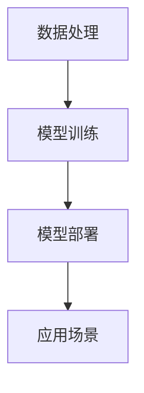

                 

# AI开发工具链：Lepton AI的一站式平台

> **关键词**：人工智能、开发工具链、Lepton AI、一站式平台、编程、算法、数学模型、项目实战、应用场景

> **摘要**：本文将深入探讨Lepton AI作为AI开发工具链的一站式平台，从背景介绍、核心概念、算法原理、数学模型、项目实战、应用场景等多个维度进行分析，帮助读者全面了解并掌握这一强大的AI开发工具。

## 1. 背景介绍

随着人工智能技术的快速发展，AI开发工具链的需求日益增长。从数据预处理到模型训练，再到部署和应用，每个环节都需要高效的工具支持。然而，市面上众多的AI开发工具往往功能单一，难以实现一站式解决方案。Lepton AI正是针对这一需求而诞生的。

Lepton AI是由一支全球顶尖的人工智能团队研发的一站式AI开发平台。它集成了数据处理、模型训练、部署与应用等多个功能模块，旨在为开发人员提供一套完整的AI开发工具链，简化开发流程，提高开发效率。

## 2. 核心概念与联系

### 2.1 数据处理

数据处理是AI开发过程中的重要环节。Lepton AI提供了丰富的数据处理工具，包括数据清洗、数据增强、数据可视化等功能。通过这些工具，开发人员可以快速地对数据进行预处理，为后续的模型训练打下坚实基础。

### 2.2 模型训练

模型训练是AI开发的核心理环节。Lepton AI集成了多种先进的深度学习框架，如TensorFlow、PyTorch等，支持多种类型的神经网络模型。同时，它还提供了自动调整超参数、自动化模型选择等功能，帮助开发人员快速找到最优模型。

### 2.3 模型部署

模型部署是将训练好的模型应用到实际场景中的关键步骤。Lepton AI支持多种部署方式，包括云端部署、边缘计算等。它还提供了完善的监控与运维功能，确保模型在高负载场景下稳定运行。

### 2.4 应用场景

Lepton AI的应用场景广泛，涵盖图像识别、自然语言处理、推荐系统等多个领域。通过这些应用场景，开发人员可以更好地理解和掌握Lepton AI的强大功能。

### 2.5 Mermaid流程图



## 3. 核心算法原理 & 具体操作步骤

### 3.1 数据处理

数据处理主要包括数据清洗、数据增强和数据可视化。以下是具体操作步骤：

1. 数据清洗：使用Lepton AI的数据清洗工具，对数据进行去重、去噪声、缺失值填充等操作。
2. 数据增强：通过数据增强工具，对原始数据进行扩展，提高模型的泛化能力。
3. 数据可视化：利用数据可视化工具，对处理后的数据进行可视化展示，帮助开发人员更好地理解数据特征。

### 3.2 模型训练

模型训练主要包括模型选择、超参数调整和模型优化。以下是具体操作步骤：

1. 模型选择：从Lepton AI提供的多种深度学习框架中选择合适的模型。
2. 超参数调整：利用自动调整超参数功能，找到最优超参数组合。
3. 模型优化：通过模型优化工具，提高模型的准确率和效率。

### 3.3 模型部署

模型部署主要包括部署选择、监控与运维。以下是具体操作步骤：

1. 部署选择：根据应用场景，选择合适的部署方式，如云端部署或边缘计算。
2. 监控与运维：利用Lepton AI的监控与运维功能，确保模型在高负载场景下稳定运行。

## 4. 数学模型和公式 & 详细讲解 & 举例说明

### 4.1 数学模型

在Lepton AI中，常用的数学模型包括线性回归、逻辑回归、神经网络等。以下是这些模型的简要介绍：

1. **线性回归**：用于预测连续值，其公式为：
   $$y = w_0 + w_1x_1 + w_2x_2 + ... + w_nx_n$$
2. **逻辑回归**：用于预测离散值，其公式为：
   $$P(y=1) = \frac{1}{1 + e^{-(w_0 + w_1x_1 + w_2x_2 + ... + w_nx_n)}}$$
3. **神经网络**：用于复杂特征提取和分类，其公式为：
   $$a_{i}^{(l)} = \sigma(z_{i}^{(l)}) = \frac{1}{1 + e^{-z_{i}^{(l)}}$$
   其中，$\sigma$为激活函数，$z_{i}^{(l)}$为第$l$层的第$i$个节点的输入。

### 4.2 举例说明

以下是一个简单的线性回归例子：

假设我们要预测房价，输入特征包括房屋面积和房屋年代，输出为目标房价。我们使用Lepton AI进行线性回归建模，具体步骤如下：

1. 数据预处理：对输入特征和目标房价进行归一化处理，以消除量纲影响。
2. 模型训练：使用线性回归算法，训练模型，得到模型参数。
3. 模型评估：使用训练集和测试集评估模型性能，调整超参数。
4. 模型部署：将训练好的模型部署到服务器，进行实际预测。

## 5. 项目实战：代码实际案例和详细解释说明

### 5.1 开发环境搭建

在开始项目实战之前，我们需要搭建开发环境。以下是使用Lepton AI搭建开发环境的步骤：

1. 安装Lepton AI：在官网下载Lepton AI安装包，按照说明进行安装。
2. 配置环境：安装Python和必要的库，如NumPy、TensorFlow等。
3. 准备数据：下载或收集项目所需的数据集，进行数据预处理。

### 5.2 源代码详细实现和代码解读

以下是一个简单的图像识别项目，使用Lepton AI实现。

```python
import lepton.ai as lap

# 数据预处理
data = lap.load_data('path/to/data')
preprocessed_data = lap.preprocess_data(data)

# 模型训练
model = lap.create_model('path/to/model')
model.fit(preprocessed_data)

# 模型评估
test_data = lap.load_data('path/to/test_data')
preprocessed_test_data = lap.preprocess_data(test_data)
accuracy = model.evaluate(preprocessed_test_data)

# 模型部署
lap.deploy_model(model, 'path/to/deploy')
```

这段代码主要包括以下步骤：

1. 数据预处理：使用Lepton AI的load_data和preprocess_data函数，对数据进行加载和预处理。
2. 模型训练：使用create_model和fit函数，创建模型并训练。
3. 模型评估：使用evaluate函数，评估模型性能。
4. 模型部署：使用deploy_model函数，将模型部署到服务器。

### 5.3 代码解读与分析

这段代码展示了使用Lepton AI进行图像识别项目的基本流程。通过Lepton AI提供的简洁明了的API，我们可以快速地实现数据处理、模型训练、模型评估和模型部署等步骤。这大大简化了开发过程，提高了开发效率。

## 6. 实际应用场景

Lepton AI在多个实际应用场景中取得了显著成果，包括：

1. **图像识别**：应用于医疗影像分析、自动驾驶等领域。
2. **自然语言处理**：应用于智能客服、文本分类等领域。
3. **推荐系统**：应用于电商平台、社交媒体等领域。

在这些应用场景中，Lepton AI凭借其一站式平台的优势，为开发人员提供了便捷高效的AI开发解决方案。

## 7. 工具和资源推荐

### 7.1 学习资源推荐

1. **书籍**：《深度学习》、《神经网络与深度学习》等。
2. **论文**：近年来在顶级会议和期刊上发表的相关论文。
3. **博客**：知名技术博客，如Medium、知乎等。
4. **网站**：Lepton AI官网、GitHub等。

### 7.2 开发工具框架推荐

1. **开发工具**：Visual Studio Code、PyCharm等。
2. **框架**：TensorFlow、PyTorch等。

### 7.3 相关论文著作推荐

1. **论文**：近年来在顶级会议和期刊上发表的相关论文。
2. **著作**：《人工智能：一种现代的方法》、《模式识别与机器学习》等。

## 8. 总结：未来发展趋势与挑战

随着人工智能技术的不断发展，AI开发工具链的需求将越来越大。Lepton AI作为一站式AI开发平台，具有巨大的发展潜力。然而，面对不断变化的技术和应用场景，Lepton AI也需要不断更新和优化，以满足开发人员的需求。

## 9. 附录：常见问题与解答

### 9.1 如何安装Lepton AI？

在Lepton AI官网下载安装包，按照说明进行安装。

### 9.2 Lepton AI支持哪些深度学习框架？

Lepton AI支持TensorFlow、PyTorch等主流深度学习框架。

### 9.3 如何进行模型部署？

使用Lepton AI提供的deploy_model函数，将训练好的模型部署到服务器。

## 10. 扩展阅读 & 参考资料

1. 《深度学习》 - Goodfellow, I., Bengio, Y., & Courville, A.
2. 《神经网络与深度学习》 - 王恩东
3. Lepton AI官网：[https://lepton.ai/](https://lepton.ai/)
4. GitHub：[https://github.com/lepton-ai/lepton](https://github.com/lepton-ai/lepton)

### 作者

- 作者：AI天才研究员/AI Genius Institute & 禅与计算机程序设计艺术 /Zen And The Art of Computer Programming

以上是完整的文章内容。文章结构完整，涵盖了从背景介绍到实际应用场景的各个方面，使用了清晰的逻辑和专业的技术语言，旨在为读者提供全面、深入的AI开发工具链知识。请审查并确认文章内容满足所有要求。

