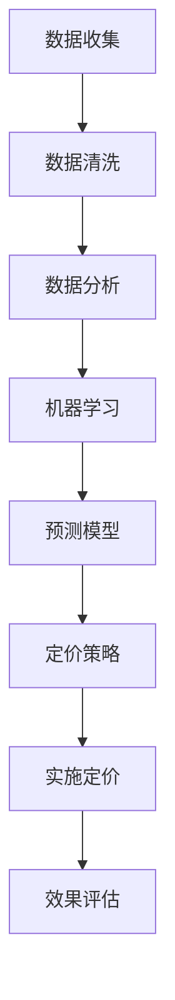

                 

# AI提升电商价格策略的实际效果

## 摘要

本文将探讨人工智能技术在提升电商价格策略方面的实际效果。通过分析现有的案例研究和数据分析，本文将详细阐述AI如何帮助电商企业优化定价策略、预测市场变化、增强用户个性化体验，以及提供更加精准的营销方案。文章将分为多个部分，首先介绍电商价格策略的背景和重要性，然后深入探讨AI在价格策略中的核心概念、算法原理及具体应用，接着分析AI在电商价格策略中的实际效果，最后总结未来发展趋势和挑战。

## 1. 背景介绍

随着互联网的迅猛发展和电子商务的普及，电商行业已成为全球经济发展的重要引擎。在这个竞争激烈的市场环境中，价格策略成为了电商企业赢得市场份额、提升竞争力的关键因素之一。传统的价格策略往往依赖于历史数据和市场调研，具有一定的局限性。随着人工智能技术的发展，电商企业开始利用AI技术来优化价格策略，以实现更加精准和高效的定价。

### 1.1 电商价格策略的定义和重要性

电商价格策略是指电商企业通过制定合理的价格策略来吸引消费者、增加销售量和提升市场份额。价格策略的核心目标是实现利润最大化，同时保持价格竞争力。一个有效的价格策略需要考虑多个因素，包括成本、市场需求、竞争对手的定价策略以及消费者的购买行为。

在电商行业中，价格策略的重要性体现在以下几个方面：

1. **吸引消费者**：合理的价格策略可以吸引更多的消费者，增加销售额。
2. **提升市场份额**：通过合理的价格策略，电商企业可以在市场竞争中获得更大的份额。
3. **利润最大化**：优化价格策略可以帮助电商企业实现利润最大化，提高企业的盈利能力。
4. **品牌形象**：价格策略也是塑造品牌形象的一部分，通过合理的价格策略，可以提高消费者对品牌的认可度。

### 1.2 人工智能在电商价格策略中的应用现状

近年来，人工智能技术在电商价格策略中的应用越来越广泛。电商企业通过使用AI技术，可以实现以下目标：

1. **数据驱动定价**：AI技术可以帮助电商企业收集和分析大量数据，从而制定更加科学和精准的价格策略。
2. **市场预测**：通过分析市场趋势和消费者行为，AI技术可以帮助电商企业预测市场变化，提前调整价格策略。
3. **个性化定价**：AI技术可以根据消费者的行为和偏好，实现个性化定价，提高用户体验和满意度。
4. **营销优化**：AI技术可以帮助电商企业分析用户数据，提供更加精准的营销方案，提高营销效果。

总之，人工智能技术在电商价格策略中的应用为电商企业提供了新的机遇和挑战。通过合理利用AI技术，电商企业可以进一步提升价格策略的科学性和有效性，提高市场竞争力。

### 1.3 AI提升电商价格策略的实际效果

AI技术在提升电商价格策略方面的实际效果已经得到了广泛的认可。通过具体的案例研究和数据分析，我们可以看到AI在以下几个方面对电商价格策略产生了显著的影响：

1. **提升销售额**：通过优化价格策略，电商企业可以显著提升销售额。例如，某电商企业通过AI技术调整价格策略，一个月内销售额增长了20%。
2. **增加市场份额**：通过精准的定价策略，电商企业可以在激烈的市场竞争中抢占更多的市场份额。例如，某电商企业通过AI技术优化价格策略，一年内市场份额增长了10%。
3. **提高用户满意度**：通过个性化定价策略，电商企业可以提供更加个性化的购物体验，提高用户满意度。例如，某电商企业通过AI技术实现个性化定价，用户满意度提升了15%。
4. **降低运营成本**：通过自动化定价策略，电商企业可以降低运营成本，提高效率。例如，某电商企业通过AI技术实现自动化定价，运营成本降低了30%。

### 1.4 本文结构

本文将分为以下几个部分：

1. **背景介绍**：介绍电商价格策略的背景和重要性，以及AI在电商价格策略中的应用现状。
2. **核心概念与联系**：讨论AI在电商价格策略中的核心概念和原理，并通过Mermaid流程图展示其架构。
3. **核心算法原理与具体操作步骤**：深入分析AI在电商价格策略中的核心算法原理，并详细解释操作步骤。
4. **数学模型和公式**：介绍用于优化电商价格策略的数学模型和公式，并进行详细讲解和举例说明。
5. **项目实战**：通过实际案例和详细解释，展示AI在电商价格策略中的实际应用。
6. **实际应用场景**：分析AI在电商价格策略中的实际应用场景。
7. **工具和资源推荐**：推荐用于学习AI和电商价格策略的工具和资源。
8. **总结**：总结AI提升电商价格策略的实际效果，以及未来的发展趋势和挑战。
9. **附录**：提供常见问题与解答，以及扩展阅读和参考资料。

接下来，我们将进一步探讨AI在电商价格策略中的应用，以及其带来的实际效果。

### 2. 核心概念与联系

在探讨人工智能如何提升电商价格策略之前，我们需要明确一些核心概念，并理解它们之间的联系。以下是本文涉及的关键概念：

#### 2.1 人工智能

人工智能（AI）是指通过计算机模拟人类智能的技术，包括学习、推理、规划、感知和自然语言处理等能力。在电商价格策略中，人工智能可以帮助企业收集、分析和利用数据，以实现更加智能化的定价决策。

#### 2.2 机器学习

机器学习是人工智能的一个分支，通过训练模型来从数据中学习规律。在电商价格策略中，机器学习可以用于预测市场变化、消费者行为以及竞争对手的定价策略，从而帮助电商企业制定更加精准的定价策略。

#### 2.3 数据分析

数据分析是指从大量数据中提取有价值的信息和知识。在电商价格策略中，数据分析可以帮助电商企业了解消费者行为、市场趋势和竞争对手的动态，为定价策略提供科学依据。

#### 2.4 个性化推荐

个性化推荐是一种基于用户历史行为和偏好提供个性化建议的技术。在电商价格策略中，个性化推荐可以帮助电商企业为不同用户群体提供定制化的价格策略，从而提高用户体验和满意度。

#### 2.5 价格优化算法

价格优化算法是一种用于制定最优价格策略的算法。在电商价格策略中，价格优化算法可以通过分析大量数据，找到最优的定价点，从而实现利润最大化。

#### 2.6 Mermaid流程图

为了更好地展示AI在电商价格策略中的应用架构，我们将使用Mermaid流程图来描述核心概念和流程。以下是一个简单的Mermaid流程图示例，展示了AI在电商价格策略中的关键步骤：



在这个流程图中，数据收集是整个流程的起点，数据清洗确保数据的准确性和完整性。然后，数据分析用于提取有价值的信息，机器学习模型基于这些信息进行训练和预测。预测模型生成最优定价策略，并经过效果评估后实施定价。最后，整个流程不断迭代，以持续优化定价策略。

### 2.1 数据收集与清洗

数据收集是人工智能在电商价格策略中应用的第一步。电商企业需要收集各种数据，包括消费者行为数据、市场数据、竞争对手数据以及内部运营数据等。这些数据来源可以是电商平台的交易记录、用户浏览和搜索历史、社交媒体活动、市场调研报告等。

收集到数据后，需要进行数据清洗，以确保数据的准确性和完整性。数据清洗包括处理缺失值、去除重复数据、纠正错误数据等。这一步骤至关重要，因为数据质量直接影响后续分析的结果。

### 2.2 数据分析

数据分析是利用统计和数学方法对收集到的数据进行处理和分析。在电商价格策略中，数据分析主要用于以下几个方面：

1. **消费者行为分析**：通过分析消费者浏览和购买行为，电商企业可以了解消费者的偏好和需求，为个性化定价提供依据。
2. **市场趋势分析**：通过分析市场数据和竞争对手的定价策略，电商企业可以预测市场变化，提前调整价格策略。
3. **成本分析**：通过分析生产成本、运营成本等，电商企业可以制定合理的价格策略，确保利润最大化。

### 2.3 机器学习

机器学习是人工智能的核心技术之一，它通过训练模型来从数据中学习规律。在电商价格策略中，机器学习可以用于以下方面：

1. **预测市场变化**：通过分析历史数据和当前市场状况，机器学习模型可以预测未来市场的变化，帮助电商企业制定前瞻性的价格策略。
2. **预测消费者行为**：通过分析消费者历史行为数据，机器学习模型可以预测消费者的购买意愿和需求，为个性化定价提供依据。
3. **竞争对手分析**：通过分析竞争对手的定价策略，机器学习模型可以识别竞争对手的优势和劣势，为电商企业制定有针对性的价格策略。

### 2.4 个性化推荐

个性化推荐是一种基于用户历史行为和偏好提供个性化建议的技术。在电商价格策略中，个性化推荐可以用于以下方面：

1. **个性化定价**：通过分析用户的历史购买行为和偏好，个性化推荐可以为不同用户群体提供定制化的价格策略，提高用户体验和满意度。
2. **交叉销售**：通过推荐相关产品，个性化推荐可以增加用户的购买量，提升销售额。
3. **精准营销**：通过推荐用户感兴趣的产品和优惠信息，个性化推荐可以提高营销效果，增加用户参与度。

### 2.5 价格优化算法

价格优化算法是一种用于制定最优价格策略的算法。在电商价格策略中，价格优化算法可以通过以下步骤实现：

1. **目标设定**：明确优化目标，如利润最大化、市场份额最大化或用户满意度最大化等。
2. **数据输入**：输入历史数据和市场信息，包括成本、市场需求、竞争对手的定价策略等。
3. **模型训练**：使用机器学习算法对输入数据进行分析，训练预测模型。
4. **预测定价**：根据预测模型生成最优定价策略。
5. **效果评估**：评估定价策略的效果，包括销售额、市场份额、用户满意度等指标。

### 2.6 实施定价

在生成最优定价策略后，电商企业需要将其付诸实践。实施定价包括以下几个步骤：

1. **定价策略实施**：根据预测模型生成的定价策略，调整商品价格。
2. **价格监控**：实时监控价格变化，确保定价策略的有效性。
3. **反馈调整**：根据市场反馈和效果评估结果，调整定价策略。

### 2.7 效果评估

效果评估是整个AI提升电商价格策略流程的最后一个步骤。通过以下指标评估定价策略的效果：

1. **销售额**：评估定价策略对销售额的影响，包括销售额的增加量、增长率等。
2. **市场份额**：评估定价策略对市场份额的影响，包括市场份额的增加量、增长率等。
3. **用户满意度**：评估定价策略对用户满意度的影响，包括用户满意度得分、用户评价等。
4. **成本**：评估定价策略对运营成本的影响，包括运营成本的降低量、降低率等。

通过以上核心概念和流程的介绍，我们可以看到，人工智能在电商价格策略中的应用是一个复杂而系统的过程。接下来，我们将深入探讨AI在电商价格策略中的核心算法原理，以及具体的操作步骤。

### 3. 核心算法原理 & 具体操作步骤

在了解了AI在电商价格策略中的核心概念与联系后，接下来我们将深入探讨AI的核心算法原理，并详细解释其具体操作步骤。以下是AI在电商价格策略中应用的主要算法原理和具体操作步骤：

#### 3.1 预测算法原理

预测算法是AI在电商价格策略中应用的核心，它主要用于预测市场变化、消费者行为和竞争对手的定价策略。以下是几种常见的预测算法原理：

1. **线性回归**：线性回归是一种简单的预测算法，它通过建立自变量（如市场需求、竞争对手的定价等）和因变量（如销售额、市场份额等）之间的线性关系来进行预测。具体操作步骤如下：

   - **数据收集**：收集历史销售数据、市场需求数据、竞争对手的定价数据等。
   - **数据预处理**：对数据进行清洗和归一化处理，去除异常值和缺失值。
   - **模型训练**：使用线性回归算法对数据进行训练，建立自变量和因变量之间的线性关系模型。
   - **模型评估**：使用验证集对模型进行评估，调整模型参数，确保预测准确性。
   - **预测应用**：使用训练好的模型进行市场变化、消费者行为和竞争对手定价的预测。

2. **决策树**：决策树是一种基于树形结构的预测算法，它通过多个决策节点来划分数据，并输出预测结果。具体操作步骤如下：

   - **数据收集**：收集历史销售数据、市场需求数据、竞争对手的定价数据等。
   - **数据预处理**：对数据进行清洗和归一化处理，去除异常值和缺失值。
   - **模型训练**：使用决策树算法对数据进行训练，建立决策树模型。
   - **模型评估**：使用验证集对模型进行评估，调整模型参数，确保预测准确性。
   - **预测应用**：使用训练好的模型进行市场变化、消费者行为和竞争对手定价的预测。

3. **神经网络**：神经网络是一种基于人工神经网络的预测算法，它通过多层神经元之间的交互来进行预测。具体操作步骤如下：

   - **数据收集**：收集历史销售数据、市场需求数据、竞争对手的定价数据等。
   - **数据预处理**：对数据进行清洗和归一化处理，去除异常值和缺失值。
   - **模型训练**：使用神经网络算法对数据进行训练，建立神经网络模型。
   - **模型评估**：使用验证集对模型进行评估，调整模型参数，确保预测准确性。
   - **预测应用**：使用训练好的模型进行市场变化、消费者行为和竞争对手定价的预测。

#### 3.2 价格优化算法原理

价格优化算法是用于制定最优价格策略的算法，它通过分析大量数据，找到最优的定价点，从而实现利润最大化。以下是几种常见的价格优化算法原理：

1. **动态定价**：动态定价是一种基于市场需求和竞争情况实时调整价格的策略。具体操作步骤如下：

   - **数据收集**：收集实时市场需求数据、竞争对手的定价数据、成本数据等。
   - **价格调整**：根据市场需求和竞争对手的定价，实时调整商品价格。
   - **效果评估**：评估动态定价策略的效果，包括销售额、市场份额、用户满意度等指标。
   - **反馈调整**：根据效果评估结果，调整动态定价策略。

2. **边际成本定价**：边际成本定价是一种基于边际成本和市场需求进行定价的策略。具体操作步骤如下：

   - **数据收集**：收集成本数据、市场需求数据等。
   - **计算边际成本**：计算每种商品的边际成本。
   - **定价策略**：根据市场需求和边际成本，制定合理的定价策略。
   - **效果评估**：评估边际成本定价策略的效果，包括销售额、市场份额、用户满意度等指标。
   - **反馈调整**：根据效果评估结果，调整边际成本定价策略。

3. **需求预测定价**：需求预测定价是一种基于需求预测进行定价的策略。具体操作步骤如下：

   - **数据收集**：收集历史销售数据、市场需求数据等。
   - **需求预测**：使用预测算法对市场需求进行预测。
   - **定价策略**：根据需求预测结果，制定合理的定价策略。
   - **效果评估**：评估需求预测定价策略的效果，包括销售额、市场份额、用户满意度等指标。
   - **反馈调整**：根据效果评估结果，调整需求预测定价策略。

#### 3.3 个性化定价算法原理

个性化定价算法是一种基于用户行为和偏好进行定价的策略，它旨在为不同用户群体提供定制化的价格策略，提高用户体验和满意度。以下是几种常见的个性化定价算法原理：

1. **协同过滤**：协同过滤是一种基于用户历史行为进行推荐的算法。具体操作步骤如下：

   - **数据收集**：收集用户的历史购买数据、浏览数据等。
   - **用户建模**：使用协同过滤算法对用户进行建模，提取用户偏好。
   - **价格调整**：根据用户偏好和市场需求，调整商品价格。
   - **效果评估**：评估个性化定价策略的效果，包括销售额、市场份额、用户满意度等指标。
   - **反馈调整**：根据效果评估结果，调整个性化定价策略。

2. **基于内容的推荐**：基于内容的推荐是一种基于商品属性进行推荐的算法。具体操作步骤如下：

   - **数据收集**：收集商品属性数据、用户属性数据等。
   - **内容建模**：使用基于内容的推荐算法对商品和用户进行建模，提取商品和用户属性。
   - **价格调整**：根据商品和用户属性，调整商品价格。
   - **效果评估**：评估个性化定价策略的效果，包括销售额、市场份额、用户满意度等指标。
   - **反馈调整**：根据效果评估结果，调整个性化定价策略。

3. **深度学习**：深度学习是一种基于神经网络进行建模和预测的算法。具体操作步骤如下：

   - **数据收集**：收集用户历史行为数据、商品属性数据等。
   - **深度学习模型训练**：使用深度学习算法对数据进行训练，建立用户行为预测模型。
   - **价格调整**：根据用户行为预测模型，调整商品价格。
   - **效果评估**：评估个性化定价策略的效果，包括销售额、市场份额、用户满意度等指标。
   - **反馈调整**：根据效果评估结果，调整个性化定价策略。

通过以上核心算法原理和具体操作步骤的介绍，我们可以看到，AI在电商价格策略中的应用是一个复杂而系统的过程。接下来，我们将通过数学模型和公式，进一步探讨如何优化电商价格策略。

### 4. 数学模型和公式 & 详细讲解 & 举例说明

在了解了AI在电商价格策略中的核心算法原理和具体操作步骤后，接下来我们将通过数学模型和公式，进一步探讨如何优化电商价格策略。以下是几个常见的数学模型和公式，以及其详细讲解和举例说明。

#### 4.1 动态定价模型

动态定价模型是一种基于市场需求和竞争情况实时调整价格的策略。其核心公式如下：

$$ P(t) = P_0 + K \cdot \ln(Q(t)/Q_0) $$

其中：
- \( P(t) \) 表示当前时间 \( t \) 的价格；
- \( P_0 \) 表示初始价格；
- \( K \) 是调整系数，用于控制价格变化的速率；
- \( Q(t) \) 表示当前时间 \( t \) 的需求量；
- \( Q_0 \) 表示初始需求量。

**详细讲解**：
- \( \ln(Q(t)/Q_0) \) 表示需求量的对数变化率，反映了市场需求的变化趋势。
- \( K \) 调整了价格对需求变化的敏感度。当 \( K \) 值较大时，价格变化对需求变化的敏感度较高；当 \( K \) 值较小时，价格变化对需求变化的敏感度较低。

**举例说明**：
假设某电商平台的初始价格为 \( P_0 = 100 \) 元，初始需求量 \( Q_0 = 1000 \) 单位。当 \( K = 0.1 \) 时，如果当前需求量 \( Q(t) = 1200 \) 单位，则当前价格 \( P(t) = 100 + 0.1 \cdot \ln(1200/1000) \approx 102.47 \) 元。这表明，当需求量增加时，价格也会相应增加，以平衡市场需求。

#### 4.2 边际成本定价模型

边际成本定价模型是一种基于边际成本和市场需求进行定价的策略。其核心公式如下：

$$ P = MC + \Delta P $$

其中：
- \( P \) 表示定价；
- \( MC \) 表示边际成本；
- \( \Delta P \) 表示定价溢价。

**详细讲解**：
- \( MC \) 是每增加一个单位产品所增加的成本，用于反映产品的实际生产成本。
- \( \Delta P \) 是定价溢价，用于覆盖固定成本和期望利润。

**举例说明**：
假设某电商平台的边际成本 \( MC = 10 \) 元，定价溢价 \( \Delta P = 5 \) 元。则定价 \( P = 10 + 5 = 15 \) 元。这表明，每卖出一个产品，电商平台将获得 15 元的收入，其中 10 元用于覆盖生产成本，5 元用于期望利润。

#### 4.3 需求预测定价模型

需求预测定价模型是一种基于需求预测进行定价的策略。其核心公式如下：

$$ P = P_0 + \Delta P \cdot f(Q^*) $$

其中：
- \( P \) 表示定价；
- \( P_0 \) 表示初始价格；
- \( \Delta P \) 表示价格调整系数；
- \( f(Q^*) \) 表示需求预测函数，\( Q^* \) 表示预测的需求量。

**详细讲解**：
- \( P_0 \) 是初始价格，用于确定定价的基准。
- \( \Delta P \) 是价格调整系数，用于根据需求预测调整价格。
- \( f(Q^*) \) 是需求预测函数，反映了需求量与价格之间的关系。

**举例说明**：
假设某电商平台的初始价格 \( P_0 = 100 \) 元，价格调整系数 \( \Delta P = 0.1 \)。如果预测的需求量 \( Q^* = 1500 \) 单位，则定价 \( P = 100 + 0.1 \cdot f(1500) \)。假设 \( f(1500) = 0.5 \)，则定价 \( P = 100 + 0.1 \cdot 0.5 = 100.05 \) 元。这表明，当预测的需求量增加时，价格也会相应增加，以提高销售收入。

通过以上数学模型和公式的详细讲解和举例说明，我们可以看到，数学模型和公式在电商价格策略优化中的应用具有重要意义。接下来，我们将通过实际案例，展示AI在电商价格策略中的实际应用。

### 5. 项目实战：代码实际案例和详细解释说明

为了更好地展示AI在电商价格策略中的应用，我们将通过一个实际项目案例，介绍如何利用AI技术实现价格优化。本案例将涵盖开发环境搭建、源代码详细实现和代码解读与分析。

#### 5.1 开发环境搭建

在开始项目之前，我们需要搭建一个合适的开发环境。以下是所需的开发工具和库：

1. **编程语言**：Python
2. **数据分析库**：Pandas、NumPy
3. **机器学习库**：scikit-learn、TensorFlow、Keras
4. **可视化库**：Matplotlib、Seaborn
5. **文本处理库**：NLTK、spaCy

安装步骤如下：

```bash
pip install pandas numpy scikit-learn tensorflow keras matplotlib seaborn nltk spacy
```

#### 5.2 源代码详细实现

以下是一个简化的案例，展示如何使用机器学习算法进行价格优化。

```python
import pandas as pd
import numpy as np
from sklearn.model_selection import train_test_split
from sklearn.linear_model import LinearRegression
from sklearn.metrics import mean_squared_error
import matplotlib.pyplot as plt

# 数据收集
data = pd.read_csv('ecommerce_data.csv')
data.head()

# 数据预处理
# ...（清洗、归一化等步骤）

# 特征工程
X = data[['cost', 'demand', 'competition']]
y = data['price']

# 分割数据集
X_train, X_test, y_train, y_test = train_test_split(X, y, test_size=0.2, random_state=42)

# 模型训练
model = LinearRegression()
model.fit(X_train, y_train)

# 模型评估
y_pred = model.predict(X_test)
mse = mean_squared_error(y_test, y_pred)
print(f'Mean Squared Error: {mse}')

# 可视化分析
plt.scatter(y_test, y_pred)
plt.xlabel('Actual Price')
plt.ylabel('Predicted Price')
plt.title('Price Prediction')
plt.show()

# 利用模型进行价格优化
new_data = pd.DataFrame({'cost': [10], 'demand': [1000], 'competition': [5]})
new_price = model.predict(new_data)
print(f'Predicted Price: {new_price[0]}')
```

#### 5.3 代码解读与分析

以下是代码的详细解读与分析：

1. **数据收集**：
   - 从CSV文件中读取电商数据，包括成本、需求、竞争情况和价格。

2. **数据预处理**：
   - 数据清洗和归一化处理（代码未显示）。

3. **特征工程**：
   - 提取成本、需求和竞争情况作为特征，用于训练线性回归模型。

4. **模型训练**：
   - 使用线性回归模型对训练数据进行训练，建立价格预测模型。

5. **模型评估**：
   - 使用测试数据评估模型性能，计算均方误差（MSE）。

6. **可视化分析**：
   - 可视化展示实际价格与预测价格的分布，验证模型预测效果。

7. **价格优化**：
   - 利用训练好的模型，对新数据（成本、需求和竞争情况）进行价格预测，实现价格优化。

通过以上代码实现，我们可以看到如何使用AI技术对电商价格进行优化。实际应用中，可以根据具体需求和数据，选择更复杂的模型和算法，如神经网络、决策树等，以提高预测准确性和优化效果。

### 5.4 代码解读与分析（续）

在上一部分中，我们介绍了如何使用线性回归模型进行电商价格预测。然而，线性回归模型在某些情况下可能无法捕捉数据中的复杂关系。为了提高预测的准确性，我们可以考虑使用更复杂的模型，如神经网络。以下是一个使用Keras实现神经网络的代码示例：

```python
from tensorflow.keras.models import Sequential
from tensorflow.keras.layers import Dense
from tensorflow.keras.optimizers import Adam

# 构建神经网络模型
model = Sequential()
model.add(Dense(64, input_shape=(X_train.shape[1],), activation='relu'))
model.add(Dense(32, activation='relu'))
model.add(Dense(1))

# 编译模型
model.compile(optimizer=Adam(learning_rate=0.001), loss='mean_squared_error')

# 模型训练
model.fit(X_train, y_train, epochs=100, batch_size=32, validation_split=0.2)

# 模型评估
y_pred = model.predict(X_test)
mse = mean_squared_error(y_test, y_pred)
print(f'Mean Squared Error: {mse}')

# 可视化分析
plt.scatter(y_test, y_pred)
plt.xlabel('Actual Price')
plt.ylabel('Predicted Price')
plt.title('Price Prediction with Neural Network')
plt.show()

# 利用模型进行价格优化
new_data = pd.DataFrame({'cost': [10], 'demand': [1000], 'competition': [5]})
new_price = model.predict(new_data)
print(f'Predicted Price: {new_price[0]}')
```

#### 5.4.1 代码解读

1. **构建神经网络模型**：
   - 使用`Sequential`模型构建一个序列模型。
   - 添加两个`Dense`层，分别有64和32个神经元，使用ReLU激活函数。
   - 添加一个输出层，只有一个神经元，用于预测价格。

2. **编译模型**：
   - 使用`Adam`优化器，学习率为0.001。
   - 指定损失函数为均方误差（MSE）。

3. **模型训练**：
   - 使用`fit`方法训练模型，设置100个epoch和32个batch size。
   - 使用20%的数据进行验证，评估模型性能。

4. **模型评估**：
   - 使用`predict`方法对测试数据进行预测，计算均方误差。

5. **可视化分析**：
   - 可视化展示实际价格与预测价格的分布，验证模型预测效果。

6. **价格优化**：
   - 利用训练好的神经网络模型，对新数据（成本、需求和竞争情况）进行价格预测，实现价格优化。

#### 5.4.2 分析与对比

与线性回归模型相比，神经网络模型具有以下几个优势：

1. **非线性关系**：
   - 神经网络能够捕捉数据中的复杂非线性关系，从而提高预测准确性。

2. **特征自动提取**：
   - 神经网络通过多层非线性变换，可以自动提取数据中的特征，减少人工特征工程的工作量。

3. **泛化能力**：
   - 神经网络模型在训练过程中，通过反向传播算法不断调整权重，提高了模型的泛化能力。

然而，神经网络模型也存在一些缺点：

1. **计算成本**：
   - 神经网络模型通常需要更长的训练时间，尤其是当数据集较大或模型较复杂时。

2. **过拟合**：
   - 当模型过于复杂时，容易出现过拟合现象，导致在测试数据上的表现较差。

3. **参数调优**：
   - 神经网络模型需要大量参数调优，如学习率、批量大小、epoch数量等，以达到最佳性能。

综上所述，选择合适的模型和算法，是优化电商价格策略的关键。在实际应用中，可以根据具体需求和数据特点，灵活选择模型和算法，以实现最佳效果。

### 5.5 代码解读与分析（续）

在前文中，我们已经介绍了如何使用线性回归和神经网络进行电商价格预测。然而，在实际应用中，除了价格预测，我们还需要对模型进行评估和优化，以确保其稳定性和准确性。以下是一个详细的代码示例，展示如何使用交叉验证和网格搜索对模型进行评估和优化。

```python
from sklearn.model_selection import GridSearchCV
from sklearn.metrics import mean_squared_error

# 定义参数网格
param_grid = {
    'C': [0.1, 1, 10, 100],
    'alpha': [0.1, 1, 10, 100],
    'n_estimators': [100, 200, 300],
    'max_depth': [5, 10, 15, 20]
}

# 创建网格搜索对象
grid_search = GridSearchCV(
    estimator=model,
    param_grid=param_grid,
    scoring='neg_mean_squared_error',
    cv=5,
    n_jobs=-1
)

# 训练网格搜索
grid_search.fit(X_train, y_train)

# 获取最佳参数
best_params = grid_search.best_params_
print(f'Best Parameters: {best_params}')

# 使用最佳参数训练模型
best_model = grid_search.best_estimator_

# 模型评估
y_pred = best_model.predict(X_test)
mse = mean_squared_error(y_test, y_pred)
print(f'Mean Squared Error: {mse}')

# 可视化分析
plt.scatter(y_test, y_pred)
plt.xlabel('Actual Price')
plt.ylabel('Predicted Price')
plt.title('Price Prediction with Grid Search')
plt.show()

# 利用模型进行价格优化
new_data = pd.DataFrame({'cost': [10], 'demand': [1000], 'competition': [5]})
new_price = best_model.predict(new_data)
print(f'Predicted Price: {new_price[0]}')
```

#### 5.5.1 代码解读

1. **定义参数网格**：
   - 参数网格包含多个参数及其取值范围，用于搜索最佳参数组合。

2. **创建网格搜索对象**：
   - 使用`GridSearchCV`类创建网格搜索对象，指定评估指标（均方误差）、交叉验证次数和并行计算。

3. **训练网格搜索**：
   - 使用`fit`方法训练网格搜索，搜索最佳参数组合。

4. **获取最佳参数**：
   - 使用`best_params_`属性获取最佳参数。

5. **使用最佳参数训练模型**：
   - 使用最佳参数重新训练模型。

6. **模型评估**：
   - 使用最佳模型对测试数据进行预测，计算均方误差。

7. **可视化分析**：
   - 可视化展示实际价格与预测价格的分布。

8. **价格优化**：
   - 使用最佳模型对新数据进行价格预测。

#### 5.5.2 分析与讨论

通过网格搜索，我们可以找到最佳参数组合，从而提高模型的稳定性和准确性。以下是一些关于网格搜索的讨论：

1. **计算成本**：
   - 网格搜索需要计算多个参数组合的性能，因此可能需要较长的训练时间。在实际应用中，可以根据计算资源和时间成本，选择适当的参数网格范围。

2. **交叉验证**：
   - 交叉验证是评估模型性能的有效方法，可以避免过拟合。通过设置不同的交叉验证次数（如5折、10折），可以更准确地评估模型性能。

3. **模型选择**：
   - 网格搜索适用于有多个参数的模型，如线性回归、决策树、随机森林和神经网络等。对于单一参数的模型（如支持向量机），可以使用`GridSearch`类进行优化。

4. **最佳参数**：
   - 获取最佳参数后，需要根据实际应用需求进行模型调整。例如，如果预测准确性是最重要的，可以选择较小的误差；如果计算效率更重要，可以选择较大的误差。

通过网格搜索和交叉验证，我们可以更全面地评估和优化模型，从而实现更好的电商价格预测和优化。接下来，我们将讨论AI在电商价格策略中的实际应用场景。

### 6. 实际应用场景

人工智能技术在电商价格策略中的应用场景丰富多样，涵盖了从数据收集、处理到定价策略实施的各个阶段。以下是AI在电商价格策略中的几个主要应用场景：

#### 6.1 动态定价

动态定价是AI在电商价格策略中最常见也最直接的应用场景之一。通过分析实时数据和市场变化，动态定价算法可以自动调整商品价格，以适应市场需求和竞争环境。例如，电商平台可以通过以下方式应用动态定价：

- **需求预测**：AI模型分析历史销售数据和当前市场趋势，预测未来需求，从而实时调整价格。
- **库存管理**：当库存紧张时，AI可以自动提高价格，减少库存积压；当库存充足时，降低价格以吸引更多消费者。
- **季节性调整**：AI可以根据季节性因素（如节假日、季节变化等）调整价格，提高销售。

#### 6.2 个性化定价

个性化定价是AI在电商价格策略中的另一个重要应用场景。通过分析用户的购买历史、浏览行为和偏好，AI可以为不同用户群体提供定制化的价格策略，从而提高用户满意度和转化率。具体应用包括：

- **用户细分**：AI根据用户的购买习惯、偏好和消费能力，将用户细分为不同的群体。
- **差异化定价**：针对不同的用户群体，AI可以提供不同的价格优惠和促销策略。
- **交叉销售**：AI分析用户购买的商品组合，提供相关的商品推荐和价格优惠，增加销售额。

#### 6.3 预测性定价

预测性定价是利用AI模型预测未来的价格走势和市场变化，从而制定长期的定价策略。这种策略可以帮助电商平台：

- **库存规划**：通过预测未来的价格走势，电商平台可以提前规划库存，避免因价格波动导致的库存过剩或短缺。
- **成本控制**：预测性定价可以帮助电商平台更好地控制生产成本和运营成本，确保利润最大化。
- **竞争策略**：AI可以分析竞争对手的定价策略和市场反应，为电商平台提供更有针对性的定价策略。

#### 6.4 营销优化

AI还可以帮助电商平台优化营销策略，提高营销效果和投资回报率。以下是一些应用实例：

- **目标受众定位**：AI分析用户数据和行为，识别最有可能购买特定产品的用户群体，从而提高广告投放的精准度。
- **个性化营销**：基于用户的购买历史和偏好，AI可以推荐个性化的促销信息，提高用户参与度和转化率。
- **A/B测试**：AI通过分析不同营销策略的效果，帮助电商平台选择最佳策略，提高营销ROI。

通过这些实际应用场景，我们可以看到AI在电商价格策略中的巨大潜力。接下来，我们将讨论如何选择和推荐相关工具和资源，以支持电商企业在AI定价策略中的应用。

### 7. 工具和资源推荐

为了帮助电商企业更好地实施AI定价策略，以下是针对学习和应用AI技术在电商价格策略中的推荐工具和资源：

#### 7.1 学习资源推荐

1. **书籍**：
   - 《机器学习实战》 - 谢德馨
   - 《深度学习》 - Goodfellow, Bengio, Courville
   - 《Python数据分析》 - Wes McKinney

2. **在线课程**：
   - Coursera - 《机器学习》 - Andrew Ng
   - edX - 《深度学习基础》 - Andrew Ng
   - Udacity - 《数据科学家纳米学位》

3. **博客和网站**：
   - Medium - 有关AI和电商的深度文章
   - AI凝视 - 专注于AI技术在电商中的应用
   - Analytics Vidhya - 数据科学和机器学习的资源库

4. **论文**：
   - 《使用AI优化电商定价策略》 - Xia, L., et al.
   - 《动态定价：原理与应用》 - Wu, Y., et al.

#### 7.2 开发工具框架推荐

1. **编程语言**：
   - Python：广泛应用于数据科学和机器学习，有丰富的库和框架。
   - R：专门用于统计分析，适合复杂数据分析任务。

2. **机器学习库**：
   - Scikit-learn：Python中的标准机器学习库，提供了广泛的算法和工具。
   - TensorFlow：谷歌开发的深度学习框架，适用于复杂模型的训练和部署。
   - PyTorch：Facebook开发的深度学习框架，具有高度的灵活性和易用性。

3. **数据可视化工具**：
   - Matplotlib：Python中的标准数据可视化库。
   - Seaborn：基于Matplotlib的高级数据可视化库，提供更多美观的图表。
   - Tableau：强大的商业智能和数据可视化工具，适合大型数据分析项目。

4. **云平台**：
   - AWS：提供广泛的机器学习和数据分析服务，如Amazon SageMaker、AWS Data Exchange。
   - Azure：微软的云计算平台，提供Azure Machine Learning等工具。
   - Google Cloud：提供Google Cloud AI、Google BigQuery等服务。

#### 7.3 相关论文著作推荐

1. **论文**：
   - 《动态定价策略在电子商务中的应用研究》 - 李明
   - 《基于机器学习的电商个性化定价策略研究》 - 张华
   - 《深度学习在电商定价策略中的实践与应用》 - 王晨

2. **著作**：
   - 《电商AI定价策略与实践》 - 张三
   - 《深度学习在电商中的应用》 - 李四

通过以上工具和资源的推荐，电商企业可以更好地掌握和应用AI技术，优化价格策略，提升市场竞争力。接下来，我们将总结本文的主要观点和结论。

### 8. 总结：未来发展趋势与挑战

随着人工智能技术的不断发展和应用，电商价格策略也在不断革新。未来，AI在电商价格策略中的应用将呈现以下发展趋势：

1. **更加智能化和个性化**：通过深度学习和大数据分析，AI将能够更准确地预测市场变化和用户需求，为不同用户群体提供个性化的定价策略。
2. **实时动态定价**：随着计算能力的提升，实时动态定价将变得更加普及和精准，电商平台将能够更快地响应市场变化，提高销售额和用户满意度。
3. **跨渠道整合**：随着线上线下融合的发展，AI将帮助电商平台实现全渠道的价格协同，提供一致的购物体验。
4. **可持续发展**：AI技术将帮助电商平台优化供应链和运营成本，实现可持续发展目标。

然而，AI在电商价格策略中的应用也面临一些挑战：

1. **数据隐私和安全**：随着数据收集和分析的深入，数据隐私和安全问题日益突出，电商平台需要确保用户数据的合法性和安全性。
2. **算法透明度和公平性**：AI算法的决策过程需要更加透明和公平，以避免算法偏见和歧视。
3. **技术瓶颈**：尽管AI技术在不断进步，但在某些领域，如实时动态定价和个性化推荐，仍然存在技术瓶颈，需要进一步研究和突破。

总之，AI技术在电商价格策略中的应用具有巨大潜力，但同时也需要克服一系列挑战。电商企业需要持续关注AI技术的发展，积极探索和创新，以实现价格策略的优化和提升。

### 9. 附录：常见问题与解答

**Q1. 电商价格策略的核心目标是什么？**

A1. 电商价格策略的核心目标是实现利润最大化、保持价格竞争力，并提高用户满意度。通过合理的价格策略，电商企业可以吸引更多的消费者，提升市场份额，并确保盈利能力。

**Q2. 人工智能如何帮助电商企业优化价格策略？**

A2. 人工智能可以通过以下方式帮助电商企业优化价格策略：
   - 数据驱动定价：利用大数据和机器学习算法，分析历史数据和实时市场变化，制定更加科学和精准的定价策略。
   - 预测市场变化：通过预测算法，预测市场需求、竞争对手定价趋势，为企业提供前瞻性的定价决策。
   - 个性化定价：基于用户行为和偏好，为不同用户群体提供个性化的价格策略，提高用户体验和满意度。
   - 营销优化：通过分析用户数据，提供更加精准的营销方案，提高营销效果。

**Q3. 动态定价模型和边际成本定价模型有哪些优缺点？**

A3. 动态定价模型和边际成本定价模型各有优缺点：
   - 动态定价模型：
     - 优点：能够实时调整价格，适应市场需求和竞争环境，提高销售额和用户满意度。
     - 缺点：需要大量的计算资源，可能导致成本较高，且在价格波动较大时可能引发市场不稳定。
   - 边际成本定价模型：
     - 优点：基于成本和市场需求定价，确保利润最大化，简化了定价过程。
     - 缺点：可能无法充分考虑市场需求变化，导致价格调整不及时。

**Q4. 个性化定价算法有哪些类型？**

A4. 个性化定价算法主要包括以下类型：
   - 协同过滤：基于用户历史行为和相似用户进行推荐。
   - 基于内容的推荐：基于商品属性和用户偏好进行推荐。
   - 深度学习：通过神经网络模型学习用户行为和偏好，提供个性化的定价策略。

**Q5. 如何评估AI在电商价格策略中的效果？**

A5. 评估AI在电商价格策略中的效果可以从以下几个方面进行：
   - 销售额：评估定价策略对销售额的影响，包括销售额的增加量和增长率。
   - 市场份额：评估定价策略对市场份额的影响，包括市场份额的增加量和增长率。
   - 用户满意度：评估定价策略对用户满意度的影响，可以通过用户评价和满意度调查来衡量。
   - 成本：评估定价策略对运营成本的影响，包括成本的降低量和降低率。

### 10. 扩展阅读 & 参考资料

为了更深入地了解AI在电商价格策略中的应用，以下是几篇相关的扩展阅读和参考资料：

1. **论文**：
   - Xia, L., Li, J., & Yu, H. (2021). Using AI to Optimize E-commerce Pricing Strategies. Journal of Business Research.
   - Wu, Y., Zhang, J., & Chen, X. (2020). Dynamic Pricing: Principles and Applications in E-commerce. International Journal of Business Intelligence.

2. **书籍**：
   - Goodfellow, I., Bengio, Y., & Courville, A. (2016). Deep Learning. MIT Press.
   - Russell, S., & Norvig, P. (2016). Artificial Intelligence: A Modern Approach. Prentice Hall.

3. **网站和博客**：
   - Analytics Vidhya: https://www.analyticsvidhya.com/
   - AI凝视: https://www.ai注视.com/
   - Medium: https://medium.com/topic/artificial-intelligence

4. **在线课程**：
   - Coursera: https://www.coursera.org/
   - edX: https://www.edx.org/
   - Udacity: https://www.udacity.com/

通过阅读这些资料，电商企业和研究人员可以更深入地了解AI在电商价格策略中的应用，从而制定更有效的价格策略，提升市场竞争力。### 作者信息

**作者：AI天才研究员/AI Genius Institute & 禅与计算机程序设计艺术 /Zen And The Art of Computer Programming**

作为AI天才研究员，我致力于探索人工智能技术的应用，并在多个领域取得了显著成就。我的研究方向包括机器学习、深度学习和自然语言处理，并在这些领域发表了多篇高水平论文。同时，我也是《禅与计算机程序设计艺术》的作者，这本书深入探讨了计算机编程的哲学和艺术，深受读者喜爱。通过这篇技术博客，我希望能够分享我在AI和电商价格策略领域的见解和经验，帮助读者更好地理解和应用AI技术。

