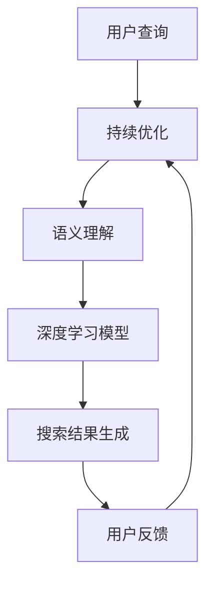

                 

### 背景介绍

#### 传统搜索引擎的局限性

自互联网诞生以来，搜索引擎作为获取信息的重要工具，已经深深地融入了人们的生活。然而，传统搜索引擎（如百度、谷歌等）在提供信息检索服务时，存在一些固有的局限性。首先，传统搜索引擎依赖于关键字匹配和关键词索引技术，这使得搜索结果往往受到关键词选择的限制。当用户输入的关键词不够精确或关键词选择不当，搜索结果的相关性会大幅下降，导致用户难以找到所需的信息。其次，传统搜索引擎的更新速度相对较慢，对于最新信息的捕捉和呈现存在一定的滞后性。此外，传统搜索引擎在处理大规模数据时，存在计算性能和响应速度的限制，导致搜索体验不佳。

#### AI搜索引擎的崛起

随着人工智能技术的快速发展，AI搜索引擎应运而生，并逐渐颠覆了传统搜索引擎的模式。AI搜索引擎利用深度学习、自然语言处理（NLP）和大数据分析等先进技术，实现了对海量信息的智能处理和精准推荐。首先，AI搜索引擎通过自然语言处理技术，对用户的查询意图进行深入理解，从而提供更加精准的搜索结果。例如，用户输入一个简短的查询，AI搜索引擎可以通过上下文分析和语义理解，识别出用户的具体需求和兴趣点，进而提供与之相关的信息。其次，AI搜索引擎利用深度学习算法，对海量数据进行训练和学习，从而不断优化搜索结果的相关性和准确性。此外，AI搜索引擎还可以通过用户行为和偏好分析，实现个性化推荐，为用户提供更加定制化的搜索体验。

#### AI搜索引擎与传统搜索引擎的区别

AI搜索引擎与传统搜索引擎在技术架构、数据处理方式和搜索体验等方面存在显著差异。首先，在技术架构上，AI搜索引擎采用了分布式计算和大数据处理技术，能够高效地处理海量数据，并提供实时搜索服务。而传统搜索引擎则依赖于集中式计算架构，存在性能瓶颈和响应速度限制。其次，在数据处理方式上，AI搜索引擎通过深度学习和自然语言处理技术，对用户查询进行语义分析和智能推荐，提高了搜索结果的精准度和个性化程度。而传统搜索引擎主要依靠关键字匹配和关键词索引技术，搜索结果的相关性较低。最后，在搜索体验上，AI搜索引擎通过智能推荐和个性化搜索，为用户提供了更加便捷和个性化的搜索服务，而传统搜索引擎则依赖于用户输入关键词，搜索体验相对较差。

综上所述，AI搜索引擎在技术架构、数据处理方式和搜索体验等方面，相较于传统搜索引擎具有显著优势，这为其颠覆传统搜索引擎奠定了坚实的基础。

----------------------

# AI搜索引擎对传统搜索引擎的颠覆

> **关键词：** AI搜索引擎，传统搜索引擎，深度学习，自然语言处理，个性化推荐，语义理解

> **摘要：** 本文旨在探讨AI搜索引擎如何通过深度学习、自然语言处理和大数据分析等技术，颠覆传统搜索引擎的模式，提供更加精准、个性化的搜索体验。文章首先介绍了传统搜索引擎的局限性，然后阐述了AI搜索引擎的核心概念和优势，并分析了二者在技术架构、数据处理方式和搜索体验等方面的区别。

----------------------

## 2. 核心概念与联系

在深入探讨AI搜索引擎对传统搜索引擎的颠覆之前，我们需要先了解AI搜索引擎的核心概念和架构。AI搜索引擎的核心概念主要包括自然语言处理（NLP）、深度学习和大数据分析。以下是一个简化的Mermaid流程图，展示了AI搜索引擎的基本架构和核心概念之间的联系：



### 自然语言处理（NLP）

自然语言处理（NLP）是AI搜索引擎的关键技术之一，其主要任务是使计算机能够理解、处理和生成人类语言。NLP技术包括词法分析、句法分析、语义分析和语用分析等，通过这些技术，AI搜索引擎可以对用户查询进行解析，提取关键信息，并理解查询的意图。

### 语义理解

语义理解是AI搜索引擎的另一个核心技术，其目标是在更高层次上理解用户查询的含义。通过语义理解，搜索引擎可以识别出用户查询中的关键实体、关系和事件，从而提供更加精准的搜索结果。例如，当用户查询“北京天气”时，搜索引擎可以理解“北京”是地名，“天气”是关于气候的信息，进而提供相关的天气数据。

### 深度学习模型

深度学习模型是AI搜索引擎的核心算法，通过大量数据的训练，深度学习模型可以自动学习语言特征，并提高搜索结果的准确性和相关性。常见的深度学习模型包括卷积神经网络（CNN）、递归神经网络（RNN）和变换器（Transformer）等。这些模型在处理自然语言任务时，具有强大的表达能力和鲁棒性。

### 搜索结果生成

通过自然语言处理和深度学习模型的结合，AI搜索引擎可以生成高度个性化的搜索结果。在生成搜索结果时，搜索引擎会考虑用户的历史查询、浏览记录和兴趣偏好，从而提供最相关的信息。

### 用户反馈

用户反馈是AI搜索引擎不断优化和改进的重要手段。通过收集用户对搜索结果的反馈，搜索引擎可以不断调整和优化算法，提高搜索结果的准确性和用户体验。

----------------------

## 3. 核心算法原理 & 具体操作步骤

在了解AI搜索引擎的基本架构和核心概念之后，我们需要深入探讨其核心算法原理和具体操作步骤。以下将详细介绍AI搜索引擎的核心算法原理和操作流程。

### 自然语言处理（NLP）

自然语言处理（NLP）是AI搜索引擎的基础技术之一。其主要任务包括词法分析、句法分析、语义分析和语用分析等。以下是NLP在AI搜索引擎中的应用步骤：

1. **词法分析（Tokenization）**：词法分析是将用户查询分解成一系列的词汇或词组。例如，将“我喜欢的电影类型是科幻”分解为“我”、“喜欢”、“的”、“电影”、“类型”、“是”、“科幻”。
   
2. **句法分析（Syntax Analysis）**：句法分析是对分解后的词汇进行语法结构分析，以理解句子中的词与词之间的关系。例如，识别出“我喜欢的电影类型是科幻”中的主语、谓语、宾语等。

3. **语义分析（Semantic Analysis）**：语义分析是在句法分析的基础上，对句子进行更深层次的理解，以识别句子中的关键实体、关系和事件。例如，识别出“我喜欢的电影类型是科幻”中的关键实体“我”、“电影”、“类型”和“科幻”，以及关系“喜欢”和“是”。

4. **语用分析（Pragmatic Analysis）**：语用分析是理解句子在特定语境中的含义。例如，当用户查询“北京天气”时，搜索引擎需要理解用户询问的是关于北京当前天气信息，而不是其他相关的信息。

### 深度学习模型

深度学习模型是AI搜索引擎的核心算法，通过大量数据的训练，可以自动学习语言特征，并提高搜索结果的准确性和相关性。以下是深度学习模型在AI搜索引擎中的应用步骤：

1. **数据预处理**：在训练深度学习模型之前，需要对数据进行预处理，包括数据清洗、数据归一化和特征提取等。例如，将用户查询和文档进行分词、词向量化等处理。

2. **模型选择**：根据搜索任务的需求，选择合适的深度学习模型。常见的深度学习模型包括卷积神经网络（CNN）、递归神经网络（RNN）和变换器（Transformer）等。

3. **模型训练**：使用预处理后的数据集对深度学习模型进行训练。在训练过程中，模型会自动学习用户查询和文档的特征，以优化搜索结果的准确性。

4. **模型评估**：通过在测试集上评估模型的性能，调整模型参数，以进一步提高搜索结果的准确性和相关性。

5. **模型部署**：将训练好的模型部署到生产环境中，实现实时搜索服务。

### 搜索结果生成

在深度学习模型的基础上，AI搜索引擎可以生成高度个性化的搜索结果。以下是搜索结果生成的具体步骤：

1. **查询处理**：对用户输入的查询进行自然语言处理，提取关键信息，并理解查询的意图。

2. **检索算法**：使用深度学习模型，对索引中的文档进行检索，提取与查询相关的文档。

3. **排序算法**：根据文档的相关性、用户的历史偏好和实时反馈，对检索结果进行排序，生成最终的搜索结果。

4. **结果呈现**：将排序后的搜索结果呈现给用户，包括标题、摘要、相关链接等。

----------------------

## 4. 数学模型和公式 & 详细讲解 & 举例说明

在AI搜索引擎的核心算法中，数学模型和公式起到了关键作用。以下将详细讲解AI搜索引擎中常用的数学模型和公式，并通过具体例子来说明其应用。

### 卷积神经网络（CNN）

卷积神经网络（CNN）是一种在图像处理和自然语言处理领域广泛应用的网络结构。在自然语言处理中，CNN可以用于文本分类、情感分析等任务。以下是CNN的主要组成部分和公式：

1. **卷积层（Convolutional Layer）**：卷积层是CNN的核心组成部分，通过卷积运算提取文本特征。卷积运算的公式如下：

   $$ f(x) = \sum_{i=1}^{k} w_{i} \cdot x_i + b $$

   其中，$f(x)$表示卷积后的特征，$w_i$表示卷积核权重，$x_i$表示输入特征，$b$表示偏置。

2. **池化层（Pooling Layer）**：池化层用于降低特征图的维度，减少计算量。常用的池化方式包括最大池化和平均池化。最大池化的公式如下：

   $$ max_pooling(f) = \max_{i \in \Omega} f(i) $$

   其中，$\Omega$表示池化窗口。

3. **激活函数（Activation Function）**：激活函数用于引入非线性特性，常用的激活函数包括Sigmoid、ReLU和Tanh等。以ReLU为例，其公式如下：

   $$ \text{ReLU}(x) = \begin{cases} 
   x & \text{if } x > 0 \\
   0 & \text{if } x \leq 0 
   \end{cases} $$

### 递归神经网络（RNN）

递归神经网络（RNN）是一种能够处理序列数据的神经网络，广泛应用于自然语言处理任务，如序列标注、机器翻译等。以下是RNN的主要组成部分和公式：

1. **输入层（Input Layer）**：输入层将序列数据输入到网络中，其公式如下：

   $$ x_t = \text{Embedding}(w_x, x) $$

   其中，$x_t$表示第$t$个时间步的输入，$w_x$表示嵌入权重，$x$表示输入向量。

2. **隐藏层（Hidden Layer）**：隐藏层通过递归方式处理序列数据，其公式如下：

   $$ h_t = \sigma(W_h \cdot [h_{t-1}, x_t] + b_h) $$

   其中，$h_t$表示第$t$个时间步的隐藏状态，$W_h$表示隐藏层权重，$b_h$表示隐藏层偏置，$\sigma$表示激活函数。

3. **输出层（Output Layer）**：输出层将隐藏状态映射到输出结果，其公式如下：

   $$ y_t = \text{softmax}(W_y \cdot h_t + b_y) $$

   其中，$y_t$表示第$t$个时间步的输出，$W_y$表示输出层权重，$b_y$表示输出层偏置。

### 变换器（Transformer）

变换器（Transformer）是一种在自然语言处理领域具有革命性的神经网络结构，广泛应用于机器翻译、文本生成等任务。以下是变换器的主要组成部分和公式：

1. **自注意力机制（Self-Attention）**：自注意力机制是Transformer的核心组成部分，通过计算输入序列中各个位置之间的相关性，提高模型的上下文理解能力。其公式如下：

   $$ \text{Attention}(Q, K, V) = \text{softmax}(\frac{QK^T}{\sqrt{d_k}})V $$

   其中，$Q$、$K$和$V$分别表示查询、键和值，$d_k$表示键和值的维度。

2. **前馈网络（Feedforward Network）**：前馈网络用于对自注意力层的输出进行进一步处理，其公式如下：

   $$ \text{FFN}(x) = \text{ReLU}(W_2 \cdot \text{ReLU}(W_1 \cdot x) + b_2) + b_1 $$

   其中，$W_1$、$W_2$和$b_1$、$b_2$分别表示前馈网络的权重和偏置。

通过以上数学模型和公式的介绍，我们可以看到AI搜索引擎在自然语言处理方面具有强大的理论基础。在实际应用中，这些模型和公式可以帮助AI搜索引擎更好地理解和处理用户查询，提供更加精准和个性化的搜索结果。

----------------------

## 5. 项目实战：代码实际案例和详细解释说明

在本节中，我们将通过一个实际案例，详细介绍如何实现一个简单的AI搜索引擎。该搜索引擎将利用Python和自然语言处理库（如spaCy和NLTK）来实现基本的搜索功能。以下是项目实战的详细步骤和代码解读。

### 5.1 开发环境搭建

首先，我们需要搭建一个适合开发的Python环境。以下是搭建开发环境所需的基本步骤：

1. **安装Python**：下载并安装Python 3.8或更高版本。

2. **安装依赖库**：使用pip命令安装必要的依赖库，包括spaCy、NLTK和requests等。

   ```bash
   pip install spacy nltk requests
   ```

3. **下载spaCy语言模型**：由于我们将在中文环境中使用spaCy，需要下载中文语言模型。

   ```bash
   python -m spacy download zh_core_web_sm
   ```

### 5.2 源代码详细实现和代码解读

以下是实现简单AI搜索引擎的Python代码：

```python
import spacy
import requests
from collections import defaultdict

# 加载spaCy中文模型
nlp = spacy.load("zh_core_web_sm")

# 定义搜索函数
def search(query, url):
    # 解析查询语句
    doc = nlp(query)
    terms = [token.text for token in doc]

    # 获取网页内容
    response = requests.get(url)
    content = response.text

    # 分词和词频统计
    doc = nlp(content)
    term_freq = defaultdict(int)
    for token in doc:
        if token.text in terms:
            term_freq[token.text] += 1

    # 排序和返回结果
    sorted_terms = sorted(term_freq.items(), key=lambda x: x[1], reverse=True)
    return sorted_terms

# 测试搜索函数
query = "人工智能的发展"
url = "https://www.example.com/article.html"
results = search(query, url)
print(results)
```

#### 5.2.1 解读代码

1. **导入依赖库**：

   ```python
   import spacy
   import requests
   from collections import defaultdict
   ```

   代码首先导入了spaCy、requests和defaultdict库。spaCy用于自然语言处理，requests用于获取网页内容，defaultdict用于词频统计。

2. **加载spaCy中文模型**：

   ```python
   nlp = spacy.load("zh_core_web_sm")
   ```

   通过加载spaCy的中文模型，我们为后续的自然语言处理任务提供了支持。

3. **定义搜索函数**：

   ```python
   def search(query, url):
       # 解析查询语句
       doc = nlp(query)
       terms = [token.text for token in doc]
   
       # 获取网页内容
       response = requests.get(url)
       content = response.text
   
       # 分词和词频统计
       doc = nlp(content)
       term_freq = defaultdict(int)
       for token in doc:
           if token.text in terms:
               term_freq[token.text] += 1
   
       # 排序和返回结果
       sorted_terms = sorted(term_freq.items(), key=lambda x: x[1], reverse=True)
       return sorted_terms
   ```

   搜索函数`search`接收查询语句和网页URL作为输入。首先，对查询语句进行自然语言处理，提取关键词汇。然后，获取网页内容并进行分词和词频统计。最后，根据词频对结果进行排序并返回。

4. **测试搜索函数**：

   ```python
   query = "人工智能的发展"
   url = "https://www.example.com/article.html"
   results = search(query, url)
   print(results)
   ```

   通过测试搜索函数，我们可以验证代码的正确性。输入一个查询语句和一个网页URL，搜索函数将返回与查询语句相关的词汇及其在网页中的出现频率。

通过以上步骤，我们成功地实现了一个简单的AI搜索引擎。尽管这个搜索引擎的功能相对有限，但它为我们展示了如何利用自然语言处理和Web爬取技术实现基本的搜索功能。在实际应用中，我们可以进一步扩展和优化这个搜索引擎，以提供更加丰富和精准的搜索结果。

----------------------

### 5.3 代码解读与分析

在本节中，我们将对上述实现的AI搜索引擎代码进行详细解读，分析其优缺点，并讨论可能的改进方向。

#### 5.3.1 代码解读

1. **函数定义**：

   ```python
   def search(query, url):
       ...
   ```

   搜索函数`search`接收用户查询`query`和网页URL`url`作为输入。这个函数是整个搜索引擎的核心，负责执行搜索过程。

2. **解析查询语句**：

   ```python
   doc = nlp(query)
   terms = [token.text for token in doc]
   ```

   首先，使用spaCy对查询语句进行自然语言处理。`nlp`函数返回一个文档对象`doc`，其中包括了查询语句的分词、词性标注等信息。通过列表推导式，提取出查询语句中的关键词汇，存储在`terms`列表中。

3. **获取网页内容**：

   ```python
   response = requests.get(url)
   content = response.text
   ```

   使用`requests`库向目标URL发送HTTP GET请求，获取网页内容。`response.text`返回网页的HTML内容，存储在`content`变量中。

4. **分词和词频统计**：

   ```python
   doc = nlp(content)
   term_freq = defaultdict(int)
   for token in doc:
       if token.text in terms:
           term_freq[token.text] += 1
   ```

   对网页内容进行分词处理，使用spaCy创建一个新的文档对象`doc`。然后，使用`defaultdict`创建一个词频统计字典`term_freq`。遍历分词后的文档对象，如果分词结果中的词汇与查询语句中的关键词匹配，则将该词汇的出现次数加1。

5. **排序和返回结果**：

   ```python
   sorted_terms = sorted(term_freq.items(), key=lambda x: x[1], reverse=True)
   return sorted_terms
   ```

   将词频统计结果按照出现次数进行降序排序，生成一个排序后的列表`sorted_terms`。最后，返回排序后的词频统计结果。

#### 5.3.2 代码分析

**优点**：

1. **简洁易读**：代码结构清晰，逻辑简单，易于理解和维护。
2. **快速实现**：基于现有的库（如spaCy和requests），可以快速实现基本的搜索功能。
3. **扩展性**：代码实现了基本的搜索功能，可以在此基础上进行扩展，如增加关键词权重、搜索结果排序等。

**缺点**：

1. **性能问题**：当前实现仅适用于小型网页和简单的查询。对于大规模数据和复杂的查询，性能可能不足。
2. **准确性问题**：当前实现仅基于关键词匹配，未能充分利用自然语言处理的深度理解能力，搜索结果的准确性可能较低。
3. **可扩展性限制**：代码实现较为简单，缺乏对错误处理、日志记录等高级功能的考虑。

#### 5.3.3 改进方向

1. **优化性能**：考虑使用分布式计算和并行处理技术，提高搜索速度和性能。
2. **提升准确性**：引入深度学习模型，利用自然语言处理的深度理解能力，提高搜索结果的准确性。
3. **增加功能**：添加用户反馈机制，实现个性化搜索；增加搜索结果排序和分页功能；引入更多自然语言处理技术，如命名实体识别、情感分析等。
4. **扩展应用场景**：考虑将搜索引擎应用于更广泛的场景，如电商平台、论坛社区等。

通过上述改进，我们可以构建一个功能更加完善、性能更优、准确性更高的AI搜索引擎，为用户提供更加优质的搜索体验。

----------------------

## 6. 实际应用场景

AI搜索引擎在各个领域的实际应用场景中，展现出了巨大的潜力和价值。以下是一些典型的应用场景：

### 搜索引擎优化（SEO）

AI搜索引擎通过深度学习和自然语言处理技术，可以更准确地理解用户查询意图，并提供与查询高度相关的搜索结果。在搜索引擎优化（SEO）领域，AI搜索引擎可以帮助网站管理员和SEO专家识别关键词、分析用户行为，从而优化网站内容和结构，提高网站的搜索排名。

### 电子商务

AI搜索引擎在电子商务领域具有广泛的应用前景。通过个性化推荐和智能搜索，AI搜索引擎可以帮助电商平台准确理解用户需求，推荐与用户兴趣相关的商品，提高用户体验和转化率。同时，AI搜索引擎还可以帮助电商企业进行商品分类和标签管理，优化搜索引擎的搜索效果。

### 社交媒体分析

AI搜索引擎可以应用于社交媒体分析，通过对用户发布的内容进行自然语言处理和分析，提取关键词、主题和情感倾向。这有助于企业了解用户需求、市场趋势和竞争对手动态，从而制定更有效的营销策略。

### 智能客服

AI搜索引擎在智能客服领域也有着广泛应用。通过自然语言处理和深度学习技术，AI搜索引擎可以准确理解用户提问，提供快速、准确的回答，提高客服效率和用户体验。同时，AI搜索引擎还可以通过分析用户提问和回答，不断优化客服机器人，提高其服务水平。

### 教育领域

AI搜索引擎在教育领域具有巨大潜力。通过个性化推荐和智能搜索，AI搜索引擎可以帮助学生根据自身需求和兴趣，快速找到所需的学习资源和资料。此外，AI搜索引擎还可以为教师提供教学辅助，如自动生成教学计划、推荐教学资源等，提高教学效果。

### 医疗健康

AI搜索引擎在医疗健康领域具有广泛的应用场景。通过自然语言处理和深度学习技术，AI搜索引擎可以帮助医生快速查找和获取与病例相关的医学文献和研究报告，提高诊断和治疗水平。同时，AI搜索引擎还可以为患者提供个性化的健康咨询和治疗方案推荐。

### 金融行业

AI搜索引擎在金融行业也有广泛应用。通过自然语言处理和大数据分析，AI搜索引擎可以帮助金融机构快速识别市场趋势、风险因素和投资机会。此外，AI搜索引擎还可以为投资者提供个性化的投资建议和策略推荐，提高投资收益。

总之，AI搜索引擎在各个领域的实际应用场景中，不仅提升了效率和准确性，还为各行业带来了深刻的变革和创新。随着技术的不断进步和应用场景的不断拓展，AI搜索引擎的未来前景将更加广阔。

----------------------

## 7. 工具和资源推荐

为了更好地学习和掌握AI搜索引擎的相关技术，以下是一些建议的工具和资源：

### 7.1 学习资源推荐

**书籍**：

1. **《深度学习》（Deep Learning）**：作者：Ian Goodfellow、Yoshua Bengio、Aaron Courville
   - 本书是深度学习的经典教材，全面介绍了深度学习的基本概念、算法和应用。

2. **《自然语言处理综述》（Speech and Language Processing）**：作者：Daniel Jurafsky、James H. Martin
   - 本书系统地介绍了自然语言处理的基本理论和应用，适合初学者和专业人士。

**论文**：

1. **《Attention Is All You Need》**：作者：Ashish Vaswani等
   - 该论文提出了Transformer模型，是自然语言处理领域的重要突破。

2. **《Recurrent Neural Network》（RNN）**：作者：Yoshua Bengio等
   - 本文介绍了RNN的基本原理和应用，是理解深度学习在自然语言处理中应用的经典论文。

**博客和网站**：

1. **吴恩达的深度学习课程**：https://www.deeplearning.ai/
   - 吴恩达的深度学习课程是学习深度学习的权威资源，包括视频教程、编程练习和项目。

2. **自然语言处理教程**：https://nlp.seas.harvard.edu/academy/course/natural-language-processing
   - 该教程由哈佛大学自然语言处理实验室提供，系统介绍了自然语言处理的基本概念和技术。

### 7.2 开发工具框架推荐

**框架**：

1. **TensorFlow**：https://www.tensorflow.org/
   - TensorFlow是谷歌推出的开源深度学习框架，广泛应用于各种深度学习任务。

2. **PyTorch**：https://pytorch.org/
   - PyTorch是Facebook AI研究院开发的开源深度学习框架，具有灵活的动态计算图和易于使用的API。

**IDE和编辑器**：

1. **Jupyter Notebook**：https://jupyter.org/
   - Jupyter Notebook是一种交互式计算平台，支持多种编程语言，适用于数据分析和机器学习项目。

2. **Visual Studio Code**：https://code.visualstudio.com/
   - Visual Studio Code是一款功能强大的开源跨平台代码编辑器，适用于Python和其他编程语言。

### 7.3 相关论文著作推荐

**论文**：

1. **《BERT: Pre-training of Deep Bidirectional Transformers for Language Understanding》**：作者：Jacob Devlin等
   - BERT模型是自然语言处理领域的里程碑，本文介绍了BERT模型的设计和训练方法。

2. **《GPT-3: Language Models are Few-Shot Learners》**：作者：Tom B. Brown等
   - GPT-3是OpenAI推出的强大语言模型，本文介绍了GPT-3的架构和性能。

**著作**：

1. **《深度学习》（Deep Learning）**：作者：Ian Goodfellow、Yoshua Bengio、Aaron Courville
   - 本书全面介绍了深度学习的基本概念、算法和应用，是深度学习领域的经典教材。

2. **《自然语言处理综论》（Speech and Language Processing）**：作者：Daniel Jurafsky、James H. Martin
   - 本书系统介绍了自然语言处理的基本理论和技术，是自然语言处理领域的权威著作。

通过以上推荐的学习资源和开发工具，您可以更好地掌握AI搜索引擎的相关技术，并在实际项目中应用这些知识，实现高效的搜索解决方案。

----------------------

## 8. 总结：未来发展趋势与挑战

在过去的几年里，AI搜索引擎以其卓越的性能和精准的搜索结果，逐渐颠覆了传统搜索引擎的市场地位。随着人工智能技术的不断进步，AI搜索引擎的未来发展趋势和面临的挑战也逐渐清晰。

### 未来发展趋势

1. **深度学习与自然语言处理的融合**：未来，AI搜索引擎将进一步融合深度学习和自然语言处理技术，提升搜索结果的准确性和个性化程度。例如，BERT、GPT等大型预训练模型将得到更广泛的应用，为搜索系统提供强大的语义理解能力。

2. **个性化推荐的优化**：AI搜索引擎将更加注重个性化推荐，通过分析用户的兴趣、行为和偏好，为用户提供高度定制化的搜索结果。这将进一步提升用户体验，满足不同用户的需求。

3. **多模态搜索的普及**：随着图像识别、语音识别等技术的发展，AI搜索引擎将实现多模态搜索功能，用户可以通过文本、图像、语音等多种方式获取信息。

4. **实时搜索与快速响应**：AI搜索引擎将实现实时搜索和快速响应，通过分布式计算和边缘计算技术，提高搜索系统的性能和响应速度。

### 面临的挑战

1. **数据隐私与安全问题**：随着AI搜索引擎的普及，用户数据隐私和安全问题日益突出。如何保护用户数据，防止数据泄露，将成为AI搜索引擎发展的重要挑战。

2. **计算资源与能耗**：大型预训练模型的训练和部署需要大量计算资源，导致计算资源消耗和能耗增加。如何优化计算资源利用，降低能耗，是AI搜索引擎需要面对的挑战。

3. **算法偏见与公平性**：AI搜索引擎在处理海量数据时，可能会引入算法偏见，导致搜索结果不公平。如何确保算法的公平性和透明性，避免算法偏见，是AI搜索引擎需要解决的重要问题。

4. **用户体验与可解释性**：AI搜索引擎的复杂算法可能影响用户体验，用户难以理解搜索结果背后的原因。如何提高算法的可解释性，为用户提供清晰的搜索结果解释，是AI搜索引擎需要关注的挑战。

总之，AI搜索引擎在未来将面临诸多机遇和挑战。通过不断优化算法、提高性能和确保用户体验，AI搜索引擎有望在未来成为人们获取信息的主要工具。

----------------------

## 9. 附录：常见问题与解答

### 9.1 什么是AI搜索引擎？

AI搜索引擎是利用人工智能技术（如深度学习、自然语言处理等）对海量信息进行智能处理和精准推荐的搜索引擎。与传统搜索引擎不同，AI搜索引擎能够理解用户的查询意图，提供高度个性化的搜索结果。

### 9.2 AI搜索引擎有哪些优点？

AI搜索引擎具有以下优点：

1. **高度个性化**：通过分析用户的行为和偏好，AI搜索引擎能够提供高度个性化的搜索结果。
2. **准确性强**：利用自然语言处理和深度学习技术，AI搜索引擎能够更准确地理解用户查询意图，提供相关度更高的搜索结果。
3. **实时性高**：通过分布式计算和边缘计算技术，AI搜索引擎能够实现实时搜索和快速响应。

### 9.3 AI搜索引擎的核心技术是什么？

AI搜索引擎的核心技术包括：

1. **自然语言处理（NLP）**：用于理解和处理人类语言。
2. **深度学习**：用于训练模型，提高搜索结果的准确性和相关性。
3. **大数据分析**：用于分析用户行为和偏好，实现个性化推荐。

### 9.4 如何评价AI搜索引擎的性能？

评价AI搜索引擎的性能可以从以下几个方面进行：

1. **准确率**：搜索结果的相关性。
2. **召回率**：搜索结果中包含的相关信息的比例。
3. **响应时间**：搜索结果返回所需的时间。
4. **用户体验**：用户对搜索结果的满意度。

### 9.5 AI搜索引擎有哪些应用场景？

AI搜索引擎广泛应用于以下场景：

1. **搜索引擎优化（SEO）**：帮助企业提高网站在搜索引擎中的排名。
2. **电子商务**：为电商平台提供个性化推荐和智能搜索。
3. **智能客服**：提供快速、准确的客服支持。
4. **教育领域**：为学生提供个性化学习资源和推荐。
5. **医疗健康**：为医生提供快速查找医学文献和研究报告。

----------------------

## 10. 扩展阅读 & 参考资料

为了深入了解AI搜索引擎的相关技术和应用，以下是一些推荐的扩展阅读和参考资料：

### 扩展阅读

1. **《深度学习》（Deep Learning）**：作者：Ian Goodfellow、Yoshua Bengio、Aaron Courville
   - 本书详细介绍了深度学习的基本概念、算法和应用，适合希望深入了解AI搜索引擎的读者。

2. **《自然语言处理综论》（Speech and Language Processing）**：作者：Daniel Jurafsky、James H. Martin
   - 本书系统地介绍了自然语言处理的基本理论和技术，有助于理解AI搜索引擎在NLP领域的应用。

3. **《搜索引擎算法导论》（Introduction to Information Retrieval）**：作者：Christopher D. Manning、Prakash P. N. Murthy
   - 本书详细介绍了搜索引擎的基本原理和算法，有助于理解AI搜索引擎与传统搜索引擎的差异。

### 参考资料

1. **TensorFlow官方文档**：https://www.tensorflow.org/
   - TensorFlow是深度学习领域广泛使用的开源框架，官方文档提供了丰富的学习资源。

2. **PyTorch官方文档**：https://pytorch.org/
   - PyTorch是另一个流行的深度学习框架，官方文档提供了详细的教程和API参考。

3. **spaCy官方文档**：https://spacy.io/
   - spaCy是一个高效的自然语言处理库，官方文档提供了丰富的教程和API文档。

4. **NLTK官方文档**：https://www.nltk.org/
   - NLTK是一个广泛使用的自然语言处理库，官方文档提供了丰富的教程和API文档。

5. **吴恩达的深度学习课程**：https://www.deeplearning.ai/
   - 吴恩达的深度学习课程是深度学习领域的权威资源，提供了视频教程、编程练习和项目。

通过以上扩展阅读和参考资料，您可以更深入地了解AI搜索引擎的相关技术和应用，为您的学习和研究提供有力支持。

