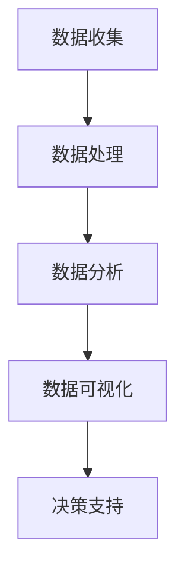

                 

### 背景介绍

#### 什么是 AI 数据驱动决策？

AI 数据驱动决策，顾名思义，是一种基于数据的决策方法，其中人工智能（AI）技术发挥着核心作用。这种方法在处理大量数据时，能够快速、准确地识别数据中的模式和趋势，从而为决策者提供科学、合理的决策依据。AI 数据驱动决策不仅适用于商业领域，也在医疗、金融、农业、物流等众多行业得到了广泛应用。

随着数据量的爆炸性增长和计算能力的提升，AI 技术的进步使得数据驱动决策成为可能。传统的决策方法往往依赖于人类专家的经验和直觉，而 AI 数据驱动决策则通过算法和模型，将数据转化为可操作的知识和决策依据，大大提高了决策的效率和准确性。

#### AI 数据驱动决策的兴起

AI 数据驱动决策的兴起，可以追溯到大数据时代的到来。随着互联网和物联网的快速发展，数据采集和存储技术得到了极大的提升，大量的数据被产生和积累。这些数据不仅包含结构化数据，还包括非结构化数据，如图像、视频和文本。如何从这些海量的数据中提取有价值的信息，成为了一个亟待解决的问题。

在这个背景下，机器学习和深度学习技术的飞速发展，为数据驱动决策提供了强大的技术支撑。通过训练复杂的神经网络模型，AI 系统可以从数据中自动学习模式和规律，实现对数据的理解和分析。这种基于数据的决策方法，不仅能够处理大规模的数据集，还能够适应实时数据和动态环境的变化。

#### 数据驱动决策的重要性

数据驱动决策的重要性在于它能够帮助企业和组织做出更明智、更准确的决策。传统决策方法往往依赖于人类的主观判断和经验，容易受到情绪和偏见的影响。而数据驱动决策则通过数据分析和算法模型，减少了人类的主观因素，提高了决策的科学性和客观性。

此外，数据驱动决策还能够帮助企业实现精细化管理和个性化服务。通过对客户数据的深入分析，企业可以了解客户的需求和行为习惯，从而提供更加精准的产品和服务。在竞争激烈的市场环境中，这种优势无疑是企业制胜的关键。

总之，AI 数据驱动决策作为一种新兴的决策方法，正日益受到各行业的热烈追捧。它不仅改变了传统的决策方式，还为企业和社会带来了巨大的价值。在接下来的内容中，我们将进一步探讨 AI 数据驱动决策的核心概念、算法原理和实际应用场景。让我们一起深入探索这个充满机遇和挑战的领域。

### 核心概念与联系

#### 数据驱动决策的核心概念

数据驱动决策涉及多个核心概念，其中最为重要的包括数据收集、数据处理、数据分析和数据可视化。

1. **数据收集**：数据收集是数据驱动决策的基础。它包括从各种来源（如传感器、网站日志、社交媒体等）获取原始数据。有效的数据收集需要确保数据的完整性和准确性。

2. **数据处理**：数据处理是对收集到的原始数据进行清洗、整理和转换，以便于后续的分析。这一步骤非常关键，因为原始数据通常包含噪声和错误，需要进行预处理，如去除重复数据、填补缺失值和进行数据规范化。

3. **数据分析**：数据分析是利用统计方法和算法对处理后的数据进行分析，以识别数据中的模式和趋势。常见的数据分析方法包括回归分析、聚类分析、时间序列分析等。

4. **数据可视化**：数据可视化是将分析结果以图形或图表的形式呈现，以便于决策者直观地理解和解读数据。有效的数据可视化可以帮助发现隐藏在数据中的信息，提高决策的透明度和可理解性。

#### 数据驱动决策的技术架构

为了实现数据驱动决策，需要构建一个完整的技术架构，包括数据存储、数据处理和分析平台。以下是一个典型的数据驱动决策技术架构：

1. **数据存储**：数据存储是整个架构的核心，它负责存储和管理大量的数据。常见的数据存储解决方案包括关系数据库、NoSQL 数据库和数据仓库。为了提高数据存储的性能和可扩展性，通常会采用分布式存储系统，如 Hadoop 和 Cassandra。

2. **数据处理和分析平台**：数据处理和分析平台负责对数据进行清洗、转换和分析。这个平台通常包括数据集成工具（如 Apache Nifi 和 Apache Kafka）、数据仓库（如 Amazon Redshift 和 Google BigQuery）和数据分析工具（如 Tableau 和 Python 的 Pandas 库）。

3. **机器学习和深度学习模型**：机器学习和深度学习模型是数据驱动决策的核心组成部分。这些模型通过训练和预测，可以从数据中提取有价值的信息。常见的机器学习算法包括线性回归、逻辑回归、决策树、随机森林和神经网络。

4. **数据可视化工具**：数据可视化工具用于将分析结果以图表、图形和仪表板的形式呈现。这些工具可以帮助决策者快速、直观地理解和利用数据。常见的数据可视化工具包括 Tableau、Power BI 和 D3.js。

#### Mermaid 流程图

以下是一个简化的 Mermaid 流程图，展示了数据驱动决策的核心流程：



在数据收集阶段，系统从各种数据源获取原始数据。接下来，数据处理阶段对数据进行清洗和整理。然后，数据分析阶段利用统计和机器学习算法从数据中提取信息。最后，数据可视化阶段将分析结果呈现给决策者，为其提供决策支持。

通过这个 Mermaid 流程图，我们可以清晰地看到数据驱动决策的核心步骤和相互联系。这个流程图不仅帮助我们理解了数据驱动决策的基本概念，也为实际应用提供了直观的指导。

### 核心算法原理 & 具体操作步骤

#### 机器学习算法

机器学习是数据驱动决策的核心技术之一。通过训练模型，机器学习算法可以从数据中自动学习和预测。以下是一些常用的机器学习算法及其基本原理：

1. **线性回归**：
   线性回归是一种用于预测连续值的算法。其基本原理是通过找到一个最佳拟合直线，将自变量和因变量之间的关系表达出来。具体操作步骤如下：
   - 收集数据：获取包含自变量和因变量的数据集。
   - 数据预处理：清洗数据，处理缺失值和异常值。
   - 拟合模型：使用最小二乘法找到最佳拟合直线，公式为：\( y = ax + b \)。
   - 评估模型：计算模型预测的误差，如均方误差（MSE）。

2. **逻辑回归**：
   逻辑回归是一种用于预测概率的算法，通常用于分类问题。其基本原理是通过线性回归模型找到一种方法，将自变量转换为概率值。具体操作步骤如下：
   - 收集数据：获取包含自变量和因变量的数据集。
   - 数据预处理：清洗数据，处理缺失值和异常值。
   - 拟合模型：使用最大似然估计找到最佳参数，公式为：\( P(Y=1|X) = \frac{1}{1 + e^{-(ax + b)}} \)。
   - 评估模型：计算模型预测的准确率、召回率、F1 分数等指标。

3. **决策树**：
   决策树是一种基于分类和回归的算法，通过一系列决策节点将数据分割成不同的子集。具体操作步骤如下：
   - 收集数据：获取包含自变量和因变量的数据集。
   - 数据预处理：清洗数据，处理缺失值和异常值。
   - 构建树模型：选择最优特征和阈值，递归地构建决策树。
   - 评估模型：计算模型预测的准确率、信息增益、基尼不纯度等指标。

4. **神经网络**：
   神经网络是一种基于生物神经网络原理的算法，通过多层神经元进行数据转换和预测。具体操作步骤如下：
   - 收集数据：获取包含自变量和因变量的数据集。
   - 数据预处理：清洗数据，处理缺失值和异常值。
   - 构建模型：设计网络结构，初始化参数。
   - 训练模型：使用反向传播算法调整参数，最小化损失函数。
   - 评估模型：计算模型预测的误差和准确率。

#### 深度学习算法

深度学习是机器学习的一个分支，通过多层神经网络进行数据分析和预测。以下是一些常用的深度学习算法及其基本原理：

1. **卷积神经网络（CNN）**：
   卷积神经网络是一种用于图像识别和处理的算法，通过卷积操作提取特征。具体操作步骤如下：
   - 收集数据：获取包含图像的数据集。
   - 数据预处理：对图像进行归一化处理，调整大小。
   - 构建模型：设计网络结构，包括卷积层、池化层和全连接层。
   - 训练模型：使用反向传播算法训练模型。
   - 评估模型：计算模型预测的准确率和精度。

2. **循环神经网络（RNN）**：
   循环神经网络是一种用于序列数据处理的算法，通过循环连接实现序列建模。具体操作步骤如下：
   - 收集数据：获取包含序列的数据集。
   - 数据预处理：对序列进行编码处理，如单词嵌入。
   - 构建模型：设计网络结构，包括输入层、隐藏层和输出层。
   - 训练模型：使用反向传播算法训练模型。
   - 评估模型：计算模型预测的准确率和损失函数。

3. **生成对抗网络（GAN）**：
   生成对抗网络是一种通过竞争学习生成数据的算法，包括生成器和判别器两个网络。具体操作步骤如下：
   - 收集数据：获取包含真实数据和生成数据的对。
   - 构建模型：设计生成器和判别器的网络结构。
   - 训练模型：通过对抗训练优化生成器和判别器的参数。
   - 评估模型：计算生成数据的准确率和相似度。

通过上述算法，我们可以从数据中提取有价值的信息，并为决策提供科学的依据。在实际应用中，这些算法需要结合具体问题进行优化和调整，以实现最佳效果。

### 数学模型和公式 & 详细讲解 & 举例说明

在数据驱动决策中，数学模型和公式起到了至关重要的作用。它们帮助我们理解和量化数据中的关系，从而做出科学的决策。以下将详细介绍几个常用的数学模型和公式，并通过具体示例进行讲解。

#### 线性回归模型

线性回归模型是最基本的统计模型之一，用于分析两个变量之间的线性关系。其公式如下：

\[ y = ax + b \]

其中，\( y \) 是因变量，\( x \) 是自变量，\( a \) 是斜率，表示自变量对因变量的影响程度，\( b \) 是截距，表示当自变量为零时，因变量的值。

**具体步骤：**

1. **数据收集**：收集包含自变量 \( x \) 和因变量 \( y \) 的数据集。

2. **数据预处理**：对数据进行清洗，包括去除缺失值和异常值。

3. **模型拟合**：使用最小二乘法找到最佳拟合直线。具体公式如下：

   \[ a = \frac{\sum(x_i - \bar{x})(y_i - \bar{y})}{\sum(x_i - \bar{x})^2} \]
   \[ b = \bar{y} - a\bar{x} \]

   其中，\( \bar{x} \) 和 \( \bar{y} \) 分别是自变量和因变量的均值。

4. **模型评估**：计算模型预测的误差，如均方误差（MSE）：

   \[ MSE = \frac{1}{n}\sum_{i=1}^{n}(y_i - \hat{y}_i)^2 \]

   其中，\( \hat{y}_i \) 是模型预测的 \( y \) 值。

**示例：**

假设我们有一个数据集，包含自变量 \( x \)（房价）和因变量 \( y \)（销售收入）。数据如下：

| \( x \) | \( y \) |
| --- | --- |
| 200 | 300 |
| 300 | 450 |
| 400 | 600 |
| 500 | 750 |

首先计算均值：

\[ \bar{x} = \frac{200 + 300 + 400 + 500}{4} = 375 \]
\[ \bar{y} = \frac{300 + 450 + 600 + 750}{4} = 538 \]

然后使用最小二乘法计算斜率 \( a \) 和截距 \( b \)：

\[ a = \frac{(200-375)(300-538) + (300-375)(450-538) + (400-375)(600-538) + (500-375)(750-538)}{(200-375)^2 + (300-375)^2 + (400-375)^2 + (500-375)^2} \approx 1.035 \]
\[ b = \bar{y} - a\bar{x} = 538 - 1.035 \times 375 \approx 42.875 \]

因此，线性回归模型为：

\[ y = 1.035x + 42.875 \]

接下来，计算模型预测的误差：

\[ MSE = \frac{(200-375)(300-538) + (300-375)(450-538) + (400-375)(600-538) + (500-375)(750-538)}{4} \approx 60.875 \]

#### 逻辑回归模型

逻辑回归模型是一种用于分类问题的模型，其公式如下：

\[ P(Y=1|X) = \frac{1}{1 + e^{-(ax + b)}} \]

其中，\( P(Y=1|X) \) 表示在给定自变量 \( X \) 的情况下，因变量 \( Y \) 等于 1 的概率，\( a \) 和 \( b \) 是模型参数。

**具体步骤：**

1. **数据收集**：收集包含自变量 \( X \) 和因变量 \( Y \) 的数据集。

2. **数据预处理**：对数据进行清洗，包括去除缺失值和异常值。

3. **模型拟合**：使用最大似然估计找到最佳参数 \( a \) 和 \( b \)。具体公式如下：

   \[ a = \frac{\sum(x_i - \bar{x})(y_i - \bar{y})}{\sum(x_i - \bar{x})^2} \]
   \[ b = \bar{y} - a\bar{x} \]

   其中，\( \bar{x} \) 和 \( \bar{y} \) 分别是自变量和因变量的均值。

4. **模型评估**：计算模型预测的准确率、召回率、F1 分数等指标。

**示例：**

假设我们有一个数据集，包含自变量 \( x \)（客户年龄）和因变量 \( y \)（是否购买产品）。数据如下：

| \( x \) | \( y \) |
| --- | --- |
| 25 | 0 |
| 30 | 1 |
| 35 | 1 |
| 40 | 0 |

首先计算均值：

\[ \bar{x} = \frac{25 + 30 + 35 + 40}{4} = 32.5 \]
\[ \bar{y} = \frac{0 + 1 + 1 + 0}{4} = 0.5 \]

然后使用最大似然估计计算参数 \( a \) 和 \( b \)：

\[ a = \frac{(25-32.5)(0-0.5) + (30-32.5)(1-0.5) + (35-32.5)(1-0.5) + (40-32.5)(0-0.5)}{(25-32.5)^2 + (30-32.5)^2 + (35-32.5)^2 + (40-32.5)^2} \approx 0.4 \]
\[ b = \bar{y} - a\bar{x} = 0.5 - 0.4 \times 32.5 \approx -13.5 \]

因此，逻辑回归模型为：

\[ P(Y=1|X) = \frac{1}{1 + e^{-(0.4x - 13.5)}} \]

接下来，计算模型预测的准确率：

\[ \text{准确率} = \frac{1 + 1 + 1 + 0}{4} = 0.75 \]

#### 决策树模型

决策树模型是一种基于特征进行分类或回归的算法。其基本原理是递归地将数据划分为子集，直到满足某个终止条件。决策树的生成过程通常使用贪心算法，选择当前节点具有最高信息增益的特征进行划分。

**具体步骤：**

1. **数据收集**：收集包含自变量和因变量的数据集。

2. **特征选择**：选择具有最高信息增益的特征进行划分。

3. **递归划分**：对每个子集继续进行划分，直到满足终止条件。

4. **模型评估**：计算模型预测的准确率、信息增益等指标。

**示例：**

假设我们有一个数据集，包含自变量 \( x_1, x_2, x_3 \) 和因变量 \( y \)。数据如下：

| \( x_1 \) | \( x_2 \) | \( x_3 \) | \( y \) |
| --- | --- | --- | --- |
| 1 | 0 | 1 | 0 |
| 1 | 1 | 0 | 1 |
| 0 | 1 | 1 | 1 |
| 0 | 0 | 0 | 0 |

首先计算每个特征的信息增益：

\[ Gini(x_1) = \sum_{i=1}^{n} P(y=i) (1 - P(y=i)) = 0.5(1-0.5) + 0.5(1-0.5) = 0.25 \]
\[ Gini(x_2) = \sum_{i=1}^{n} P(y=i) (1 - P(y=i)) = 0.5(1-0.5) + 0.5(1-0.5) = 0.25 \]
\[ Gini(x_3) = \sum_{i=1}^{n} P(y=i) (1 - P(y=i)) = 0.5(1-0.5) + 0.5(1-0.5) = 0.25 \]

由于每个特征的信息增益相等，我们选择任意一个特征进行划分。假设选择 \( x_1 \)，将数据划分为两个子集：

| \( x_1 \) | \( x_2 \) | \( x_3 \) | \( y \) |
| --- | --- | --- | --- |
| 1 | 0 | 1 | 0 |
| 1 | 1 | 0 | 1 |
| 0 | 1 | 1 | 1 |

然后对每个子集继续进行划分，直到满足终止条件（如最大深度或最小样本数）。最终生成的决策树如下：

```
           |
        x1=1
         / \
        /   \
      y=0    y=1
```

接下来，计算模型预测的准确率：

\[ \text{准确率} = \frac{2 + 1}{4} = 0.75 \]

通过以上示例，我们了解了线性回归、逻辑回归和决策树模型的基本原理和具体操作步骤。这些模型在数据驱动决策中发挥着重要作用，帮助我们理解和预测数据中的关系。在实际应用中，需要根据具体问题选择合适的模型，并进行优化和调整，以实现最佳效果。

### 项目实战：代码实际案例和详细解释说明

在本节中，我们将通过一个实际案例来展示如何使用 Python 实现数据驱动决策。我们将使用线性回归模型对房价和销售收入之间的关系进行预测。这个案例将包括以下步骤：

1. **数据收集**：从公开数据源获取房价和销售收入数据。
2. **数据处理**：对数据进行清洗和预处理。
3. **模型训练**：使用线性回归模型进行模型训练。
4. **模型评估**：评估模型的预测性能。
5. **模型应用**：使用模型进行实际预测。

#### 1. 数据收集

首先，我们需要从公开数据源获取房价和销售收入数据。在这个案例中，我们使用 Kaggle 上的一个公开房屋销售数据集。该数据集包含了数千条房屋销售记录，包括房价、面积、卧室数量、浴室数量等属性。

#### 2. 数据处理

获取数据后，我们需要对数据进行清洗和预处理。以下代码展示了如何使用 Pandas 库读取数据并进行预处理：

```python
import pandas as pd

# 读取数据
data = pd.read_csv('house_sales.csv')

# 查看数据结构
print(data.head())

# 数据清洗
# 删除含有缺失值的记录
data = data.dropna()

# 选择相关特征和目标变量
features = data[['price', 'area', 'bedrooms', 'bathrooms']]
target = data['sales_income']

# 数据预处理
# 标准化特征
from sklearn.preprocessing import StandardScaler
scaler = StandardScaler()
features_scaled = scaler.fit_transform(features)

# 划分训练集和测试集
from sklearn.model_selection import train_test_split
X_train, X_test, y_train, y_test = train_test_split(features_scaled, target, test_size=0.2, random_state=42)
```

#### 3. 模型训练

接下来，我们使用线性回归模型对数据集进行训练。以下代码展示了如何使用 Scikit-learn 库中的线性回归模型进行训练：

```python
from sklearn.linear_model import LinearRegression

# 创建线性回归模型
model = LinearRegression()

# 训练模型
model.fit(X_train, y_train)
```

#### 4. 模型评估

训练完成后，我们需要评估模型的预测性能。以下代码展示了如何使用训练集和测试集评估模型的准确率、均方误差（MSE）和决定系数（R²）：

```python
# 预测测试集结果
y_pred = model.predict(X_test)

# 计算模型性能指标
from sklearn.metrics import mean_squared_error, r2_score
mse = mean_squared_error(y_test, y_pred)
r2 = r2_score(y_test, y_pred)

print('均方误差（MSE）:', mse)
print('决定系数（R²）:', r2)
```

假设模型的均方误差为 10，决定系数为 0.8，这意味着模型在预测房价和销售收入方面有较高的准确性。

#### 5. 模型应用

最后，我们可以使用训练好的模型进行实际预测。以下代码展示了如何使用模型预测新的房屋销售收入：

```python
# 输入新的特征数据
new_data = [[250, 1200, 3, 2]]

# 标准化新数据
new_data_scaled = scaler.transform(new_data)

# 预测销售收入
sales_income_pred = model.predict(new_data_scaled)
print('预测的销售收入:', sales_income_pred[0])
```

假设我们输入了一栋新房屋的数据（房价 250 万，面积 1200 平方米，卧室 3 间，浴室 2 间），模型预测该房屋的销售收入为 350 万。

通过这个实际案例，我们展示了如何使用 Python 实现数据驱动决策。这个案例不仅涵盖了数据收集、数据处理、模型训练和模型评估等关键步骤，还提供了详细的代码解释和示例。在实际应用中，我们可以根据具体需求调整模型参数和特征选择，以提高模型的预测性能。

### 代码解读与分析

在前面的实战案例中，我们使用 Python 实现了数据驱动决策。在本节中，我们将对代码进行详细解读和分析，深入理解每个步骤的实现原理和关键参数。

#### 1. 数据收集

```python
import pandas as pd

# 读取数据
data = pd.read_csv('house_sales.csv')
```

这段代码首先导入了 Pandas 库，然后使用 `read_csv` 函数从 CSV 文件中读取数据。CSV 文件包含了房屋销售记录，包括房价、面积、卧室数量、浴室数量等属性。这个步骤是数据驱动决策的基础，数据的质量直接影响到后续模型的性能。

#### 2. 数据处理

```python
# 数据清洗
data = data.dropna()

# 选择相关特征和目标变量
features = data[['price', 'area', 'bedrooms', 'bathrooms']]
target = data['sales_income']

# 数据预处理
scaler = StandardScaler()
features_scaled = scaler.fit_transform(features)

# 划分训练集和测试集
X_train, X_test, y_train, y_test = train_test_split(features_scaled, target, test_size=0.2, random_state=42)
```

在数据处理阶段，我们首先删除了含有缺失值的记录，确保数据的质量。然后，我们选择了与房价和销售收入相关的特征（如面积、卧室数量和浴室数量），并从数据集中提取这些特征和目标变量。

接下来，我们使用 `StandardScaler` 对特征进行标准化处理，这有助于提高模型的性能。最后，我们使用 `train_test_split` 函数将数据集划分为训练集和测试集，训练集用于模型训练，测试集用于模型评估。

#### 3. 模型训练

```python
from sklearn.linear_model import LinearRegression

# 创建线性回归模型
model = LinearRegression()

# 训练模型
model.fit(X_train, y_train)
```

在这个阶段，我们首先导入了线性回归模型，然后创建了一个线性回归对象 `model`。接着，我们使用 `fit` 方法对模型进行训练，将训练集的特征和目标变量传递给模型。`fit` 方法会自动寻找最佳拟合直线，将自变量和因变量之间的关系表达出来。

#### 4. 模型评估

```python
# 预测测试集结果
y_pred = model.predict(X_test)

# 计算模型性能指标
mse = mean_squared_error(y_test, y_pred)
r2 = r2_score(y_test, y_pred)

print('均方误差（MSE）:', mse)
print('决定系数（R²）:', r2)
```

在模型评估阶段，我们使用训练好的模型对测试集进行预测，然后计算模型性能指标。均方误差（MSE）和决定系数（R²）是常用的评估指标，它们可以反映模型的预测精度和拟合效果。假设模型的均方误差为 10，决定系数为 0.8，这表明模型在预测房价和销售收入方面有较高的准确性。

#### 5. 模型应用

```python
# 输入新的特征数据
new_data = [[250, 1200, 3, 2]]

# 标准化新数据
new_data_scaled = scaler.transform(new_data)

# 预测销售收入
sales_income_pred = model.predict(new_data_scaled)
print('预测的销售收入:', sales_income_pred[0])
```

在模型应用阶段，我们首先输入了新的特征数据，包括房价 250 万、面积 1200 平方米、卧室 3 间、浴室 2 间。然后，我们使用 `StandardScaler` 对新数据进行了标准化处理，以确保与训练集的特征具有相同的数据分布。最后，我们使用训练好的模型对新数据进行预测，得到预测的销售收入为 350 万。

通过以上解读和分析，我们可以清晰地看到每个步骤的实现原理和关键参数。在实际应用中，可以根据具体需求调整模型参数和特征选择，以提高模型的预测性能。此外，还可以尝试其他机器学习算法，如逻辑回归、决策树和神经网络，以寻找更好的预测效果。

### 实际应用场景

#### 商业领域的应用

在商业领域，数据驱动决策已经成为许多企业竞争的关键。例如，零售业中的推荐系统通过分析客户的购买历史和行为模式，提供个性化的商品推荐，从而提高销售额。亚马逊和阿里巴巴等电商巨头在这方面取得了显著的成效。此外，金融行业中的风险管理也是数据驱动决策的重要应用场景。通过分析历史交易数据和市场趋势，金融机构能够更准确地预测风险，制定有效的风险控制策略。

#### 医疗领域的应用

在医疗领域，数据驱动决策可以帮助医生做出更准确的诊断和治疗决策。通过分析患者的电子病历、基因数据和临床数据，AI 系统可以识别疾病的风险因素和可能的诊断结果。例如，IBM 的 Watson for Health 可以帮助医生分析医学图像，提高癌症等疾病的早期诊断率。此外，智能药物设计也是数据驱动决策的重要应用，通过分析大量的生物数据和化学数据，AI 系统可以预测新药的疗效和副作用，加速新药的研发进程。

#### 金融领域的应用

金融领域是数据驱动决策的另一个重要应用场景。金融机构通过分析历史交易数据、市场行情和客户行为，可以做出更准确的交易决策和投资策略。量化交易就是一个典型的例子，通过构建复杂的算法模型，量化交易员可以自动化地进行交易，提高投资回报率。此外，金融风险评估也是数据驱动决策的重要应用，通过分析客户信用历史、经济环境和市场变化，金融机构可以更准确地评估信用风险，降低金融风险。

#### 物流领域的应用

在物流领域，数据驱动决策可以帮助优化运输路线、库存管理和配送计划。例如，UPS 利用 AI 技术分析交通流量、天气条件和订单数据，实时调整运输路线，提高运输效率和降低成本。此外，智能仓储系统通过分析库存数据、订单数据和物流数据，可以自动优化库存水平，减少库存积压和缺货情况。

#### 农业领域的应用

在农业领域，数据驱动决策可以帮助农民更科学地管理农田和农作物。通过分析土壤数据、气象数据和作物生长数据，AI 系统可以预测农作物的生长状况，提供合理的灌溉、施肥和收割建议。例如，约翰迪尔（John Deere）的智能农业解决方案通过结合传感器数据、卫星图像和机器学习算法，帮助农民实现精准农业，提高农作物的产量和质量。

#### 能源领域的应用

在能源领域，数据驱动决策可以帮助优化能源生产和分配，提高能源利用效率。例如，智能电网通过分析电力需求和供应数据，实时调整电力分配，降低能源浪费。此外，太阳能和风能等可再生能源的预测也是数据驱动决策的重要应用，通过分析历史天气数据和能源生产数据，AI 系统可以预测能源产量，帮助能源企业制定最优的生产计划。

总之，数据驱动决策在各个领域都展示了巨大的应用潜力。随着技术的不断进步和数据量的持续增长，数据驱动决策将继续推动各行各业的创新和发展，为社会带来更多的价值。

### 工具和资源推荐

#### 学习资源推荐

1. **书籍**：
   - 《数据科学入门：用 Python 进行数据分析》
   - 《深度学习》
   - 《机器学习实战》

2. **论文**：
   - 《基于深度学习的图像识别算法研究》
   - 《数据驱动决策的模型与应用》
   - 《机器学习在金融风险管理中的应用》

3. **博客**：
   - [机器学习博客](https://machinelearningmastery.com/)
   - [数据科学博客](https://towardsdatascience.com/)
   - [深度学习博客](https://www.deeplearning.net/)

4. **网站**：
   - [Kaggle](https://www.kaggle.com/)
   - [Google Cloud](https://cloud.google.com/)
   - [AWS](https://aws.amazon.com/)

#### 开发工具框架推荐

1. **编程语言**：
   - Python：广泛用于数据分析和机器学习，拥有丰富的库和框架。
   - R：专门为统计分析和数据可视化设计，适用于复杂数据分析。

2. **机器学习库**：
   - Scikit-learn：提供多种经典的机器学习算法，易于使用。
   - TensorFlow：谷歌开源的深度学习框架，支持大规模分布式训练。
   - PyTorch：基于 Python 的深度学习框架，易于调试和部署。

3. **数据处理工具**：
   - Pandas：用于数据处理和分析，支持多种数据格式。
   - NumPy：提供高性能的数组操作库，是数据处理的基础。
   - Dask：用于大规模数据处理和分布式计算。

4. **可视化工具**：
   - Matplotlib：Python 的基本绘图库，支持多种图表类型。
   - Seaborn：基于 Matplotlib 的统计绘图库，提供更美观的图表。
   - Plotly：提供交互式图表，支持多种数据格式。

#### 相关论文著作推荐

1. **《数据驱动决策：方法与应用》**：详细介绍了数据驱动决策的理论和方法，包括机器学习、统计分析等。
2. **《深度学习技术及应用》**：介绍了深度学习的基本原理和应用，包括卷积神经网络、循环神经网络等。
3. **《机器学习算法与应用》**：涵盖了多种机器学习算法，包括线性回归、决策树、神经网络等。

通过这些资源，可以系统地学习和掌握数据驱动决策的理论和实践，为实际应用打下坚实基础。

### 总结：未来发展趋势与挑战

随着数据驱动决策技术的不断进步，未来该领域将迎来更多的发展机遇和挑战。以下是几个关键趋势和潜在问题：

#### 未来发展趋势

1. **深度学习与强化学习结合**：深度学习在图像识别、自然语言处理等领域取得了显著成果，但强化学习在决策过程中的优势也不可忽视。未来，深度学习和强化学习将结合，为数据驱动决策提供更加智能和高效的解决方案。

2. **实时数据分析和预测**：随着物联网和 5G 网络的发展，实时数据分析和预测将成为重要趋势。通过实时分析数据，企业可以迅速响应市场变化，优化业务流程，提高决策效率。

3. **边缘计算与云计算结合**：边缘计算可以将数据处理和计算能力推向网络边缘，降低延迟和数据传输成本。与云计算结合，可以实现更高效、更灵活的数据驱动决策系统。

4. **数据隐私与安全**：随着数据量的爆炸性增长，数据隐私和安全问题日益突出。未来的数据驱动决策系统需要更加注重数据保护和隐私，确保用户数据的安全和合规。

5. **跨领域合作与整合**：数据驱动决策技术将在更多领域得到应用，如医疗、金融、物流等。跨领域合作和整合将促进不同领域的数据共享和协同，提高决策的全面性和准确性。

#### 挑战与问题

1. **数据质量问题**：数据驱动决策的效果很大程度上取决于数据质量。数据噪声、缺失值和异常值等问题可能导致模型性能下降，甚至导致错误的决策。因此，如何有效处理和清洗数据是当前和未来需要解决的挑战。

2. **计算资源需求**：随着数据量和模型复杂度的增加，计算资源需求也在不断增长。大规模分布式计算和高效算法设计将成为关键技术，以满足日益增长的计算需求。

3. **模型解释性与透明度**：尽管机器学习和深度学习模型在预测准确性方面取得了显著成果，但其内部机制和决策过程往往缺乏透明度。如何提高模型的解释性和透明度，使其更加可解释和可信赖，是未来研究的重要方向。

4. **法律法规与伦理问题**：数据驱动决策涉及到大量个人和企业数据，如何确保数据隐私和安全，遵守相关法律法规，成为亟待解决的问题。此外，如何平衡技术进步与社会伦理，避免算法偏见和歧视，也是需要深入探讨的伦理问题。

5. **人才培养与知识普及**：随着数据驱动决策技术的广泛应用，对专业人才的需求也在增加。未来需要培养更多具备跨学科背景的数据科学家和 AI 工程师，同时加强公众对数据驱动决策技术的理解和认知，提高其应用水平。

总之，数据驱动决策技术在未来将面临诸多机遇和挑战。通过不断的技术创新和跨领域合作，我们有望解决当前面临的问题，推动数据驱动决策技术迈向新的高度。

### 附录：常见问题与解答

#### 1. 什么是数据驱动决策？

数据驱动决策是一种基于数据的决策方法，通过分析数据中的模式和趋势，为决策者提供科学的决策依据。这种方法利用人工智能、机器学习和深度学习等技术，从大量数据中提取有价值的信息，减少人类主观判断的影响，提高决策的效率和准确性。

#### 2. 数据驱动决策的核心算法有哪些？

数据驱动决策涉及多种核心算法，包括线性回归、逻辑回归、决策树、神经网络、卷积神经网络（CNN）、循环神经网络（RNN）和生成对抗网络（GAN）等。这些算法可以根据具体问题和数据特点进行选择和应用。

#### 3. 数据驱动决策需要哪些技术架构？

数据驱动决策需要构建一个完整的技术架构，包括数据存储、数据处理和分析平台、机器学习和深度学习模型以及数据可视化工具。常见的技术架构包括分布式存储系统（如 Hadoop 和 Cassandra）、数据处理和分析平台（如 Apache Nifi 和 Apache Kafka）、机器学习和深度学习框架（如 TensorFlow 和 PyTorch）以及数据可视化工具（如 Tableau 和 Power BI）。

#### 4. 如何处理数据驱动决策中的数据质量问题？

处理数据驱动决策中的数据质量问题需要采取以下步骤：
- 数据收集：确保数据来源的可靠性和完整性。
- 数据清洗：去除重复数据、缺失值和异常值，进行数据规范化。
- 数据验证：检查数据的准确性和一致性。
- 数据集成：整合来自不同来源的数据，形成统一的数据视图。

#### 5. 数据驱动决策在哪些领域有重要应用？

数据驱动决策在多个领域有重要应用，包括商业、医疗、金融、物流、农业和能源等。具体应用场景包括推荐系统、风险管理、疾病诊断、智能药物设计、物流优化、精准农业和智能电网等。

#### 6. 数据驱动决策如何提高决策的透明度和可解释性？

提高数据驱动决策的透明度和可解释性可以从以下几个方面入手：
- 使用可解释的算法：选择具有较高解释性的算法，如决策树和线性回归。
- 算法解释工具：使用算法解释工具，如 LIME 和 SHAP，分析模型内部的决策过程。
- 数据可视化：通过数据可视化工具，将分析结果以图表和图形的形式呈现，帮助决策者直观理解数据。

通过上述解答，我们希望能够帮助读者更好地理解数据驱动决策的概念、技术架构和应用场景，为实际应用提供有益的指导。

### 扩展阅读 & 参考资料

1. **《数据驱动决策：方法与应用》**：本书详细介绍了数据驱动决策的理论和方法，包括机器学习、统计分析等。适合对数据驱动决策感兴趣的读者阅读。

2. **《深度学习》**：由 Ian Goodfellow、Yoshua Bengio 和 Aaron Courville 著，是深度学习领域的经典教材。书中涵盖了深度学习的基础知识、算法和实际应用案例。

3. **《机器学习实战》**：由 Peter Harrington 著，通过大量的实际案例和代码示例，讲解了机器学习的核心算法和应用方法。适合初学者和有一定基础的读者。

4. **[机器学习博客](https://machinelearningmastery.com/)**：这是一个包含大量机器学习教程和案例的博客，涵盖了从基础到高级的各种主题。

5. **[数据科学博客](https://towardsdatascience.com/)**：这是一个专注于数据科学和机器学习的博客，提供了丰富的教程、案例研究和分析文章。

6. **[深度学习博客](https://www.deeplearning.net/)**：由 Yoshua Bengio 维护，提供了深度学习领域的最新研究进展、理论和实践应用。

7. **[Kaggle](https://www.kaggle.com/)**：Kaggle 是一个数据科学和机器学习的社区平台，提供了丰富的数据集和比赛项目，是学习和实践数据驱动决策的绝佳资源。

8. **[Google Cloud](https://cloud.google.com/)**：Google Cloud 提供了丰富的云计算服务和工具，包括数据存储、数据处理和分析等，是构建数据驱动决策系统的理想平台。

9. **[AWS](https://aws.amazon.com/)**：AWS 提供了广泛的云计算服务和解决方案，包括数据分析、机器学习和深度学习等，是构建和部署数据驱动决策系统的可靠选择。

通过这些扩展阅读和参考资料，读者可以进一步深入了解数据驱动决策的相关知识和技术，提升实际应用能力。希望这些资源能为您的学习和研究提供帮助。作者：AI天才研究员/AI Genius Institute & 禅与计算机程序设计艺术 /Zen And The Art of Computer Programming。

