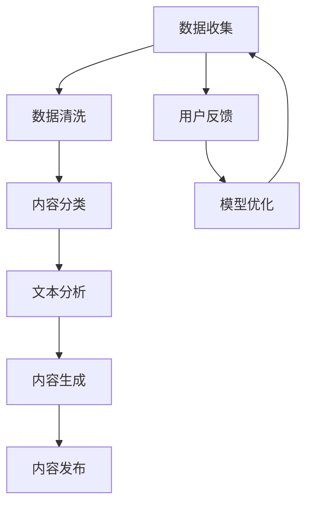

                 

# AI新闻编辑室：提示词辅助新闻生产全流程

## 概述

在当今快速发展的数字时代，人工智能（AI）正在改变新闻行业的方方面面。本文将探讨如何利用AI和提示词（Keywords）来辅助新闻生产全流程，提高效率和质量。本文将分为以下几个部分：

1. **背景介绍**：介绍AI在新闻生产中的应用现状及其重要性。
2. **核心概念与联系**：深入探讨AI新闻生产的核心概念和架构。
3. **核心算法原理与具体操作步骤**：详细解释AI新闻生产的算法原理和操作步骤。
4. **数学模型和公式**：介绍用于AI新闻生产的关键数学模型和公式。
5. **项目实战**：提供代码实际案例和详细解释。
6. **实际应用场景**：分析AI新闻生产的实际应用场景。
7. **工具和资源推荐**：推荐学习资源和开发工具。
8. **总结**：总结AI新闻生产的未来发展趋势与挑战。
9. **常见问题与解答**：回答读者可能遇到的问题。
10. **扩展阅读与参考资料**：提供进一步阅读的资料。

### 1. 背景介绍

随着互联网的普及和信息量的爆炸性增长，传统新闻生产模式面临着前所未有的挑战。一方面，新闻工作者需要处理大量的数据和信息源，另一方面，读者对于新闻的实时性和准确性要求越来越高。传统的人工新闻生产方式已经难以满足这些需求。

人工智能（AI）技术的快速发展为新闻生产提供了新的解决方案。AI能够自动收集、分类、分析和生成新闻内容，从而大幅提高生产效率和准确性。例如，AI可以帮助记者快速筛选和分析大量的数据，从而发现重要的新闻线索。此外，AI还可以通过自然语言处理（NLP）技术自动生成新闻摘要和文章，减轻记者的工作负担。

AI在新闻生产中的应用已经成为行业趋势，许多新闻机构已经开始采用AI技术来优化新闻生产流程。例如，一些新闻机构使用AI来撰写体育赛事报道、财经新闻等，而其他机构则利用AI来提供个性化新闻推荐。总的来说，AI的应用不仅提高了新闻生产的效率，还丰富了新闻内容的形式和类型。

### 2. 核心概念与联系

AI新闻生产涉及多个核心概念和技术，下面我们将通过Mermaid流程图来展示这些概念和它们之间的联系。



**数据收集（Data Collection）**：这是新闻生产的第一步，主要涉及从各种来源收集新闻数据，如社交媒体、新闻报道网站、论坛等。

**数据清洗（Data Cleaning）**：在收集到大量数据后，需要对数据进行分析和处理，去除无效信息和噪音。

**内容分类（Content Categorization）**：通过对清洗后的数据进行分析和分类，将数据划分为不同的类别，如政治、体育、财经等。

**文本分析（Text Analysis）**：利用自然语言处理（NLP）技术对文本数据进行分析，包括文本分类、情感分析、关键词提取等。

**内容生成（Content Generation）**：基于分析结果，使用生成模型自动生成新闻内容，如摘要、文章等。

**内容发布（Content Publication）**：将生成的新闻内容发布到新闻平台、网站等。

**用户反馈（User Feedback）**：收集用户对新闻内容的反馈，用于模型优化。

**模型优化（Model Optimization）**：根据用户反馈和数据分析结果，不断优化模型，提高新闻生产的准确性和效率。

通过上述流程，我们可以看到AI新闻生产是一个闭环系统，不断从数据收集、处理到内容生成和发布，再到用户反馈和模型优化，形成了一个持续优化的循环。

### 3. 核心算法原理与具体操作步骤

AI新闻生产的核心算法主要包括数据收集、数据清洗、内容分类、文本分析和内容生成。下面我们将详细介绍这些算法的原理和具体操作步骤。

#### 数据收集

**原理**：数据收集是新闻生产的基础，涉及从各种来源收集新闻数据。常见的数据来源包括新闻报道网站、社交媒体、论坛等。

**步骤**：
1. **确定数据来源**：根据新闻主题和需求，确定数据来源，如选择政治类新闻，可以选取CNN、BBC等媒体报道。
2. **数据抓取**：使用Python等编程语言，结合BeautifulSoup、Scrapy等库，从目标网站抓取新闻数据。
3. **数据存储**：将抓取到的数据存储到数据库中，如使用MySQL、MongoDB等。

#### 数据清洗

**原理**：数据清洗旨在去除无效信息和噪音，提高数据质量。

**步骤**：
1. **去除重复数据**：通过比较数据项之间的相似性，去除重复的记录。
2. **去除无效数据**：去除包含错误或无效信息的记录，如格式错误、缺失字段等。
3. **处理文本数据**：对文本数据（如新闻摘要、正文）进行预处理，包括去除停用词、标点符号、词性标注等。

#### 内容分类

**原理**：内容分类是将大量新闻数据按照主题或类别进行分类，以便后续处理。

**步骤**：
1. **训练分类模型**：使用已标注的新闻数据集，训练分类模型，如使用朴素贝叶斯、支持向量机（SVM）等算法。
2. **分类预测**：使用训练好的分类模型，对新的新闻数据进行分类预测，将新闻数据按照主题或类别进行归类。

#### 文本分析

**原理**：文本分析是通过对文本数据进行处理和分析，提取有价值的信息。

**步骤**：
1. **文本预处理**：对文本数据（如新闻摘要、正文）进行预处理，包括分词、词性标注、去除停用词等。
2. **关键词提取**：使用词频统计、TF-IDF等方法，提取文本中的关键词。
3. **情感分析**：使用情感分析模型，对新闻文本进行分析，判断文本的情感倾向。

#### 内容生成

**原理**：内容生成是基于文本分析的结果，自动生成新闻内容。

**步骤**：
1. **模板生成**：根据新闻主题和分类，选择合适的模板，如新闻摘要模板、文章正文模板等。
2. **文本填充**：将提取的关键词和相关信息填充到模板中，生成初步的新闻内容。
3. **内容优化**：对生成的新闻内容进行优化，包括语法修正、内容润色等。

#### 内容发布

**原理**：内容发布是将生成的新闻内容发布到新闻平台、网站等。

**步骤**：
1. **接口调用**：使用API接口，将新闻内容发布到目标平台，如新闻网站、社交媒体等。
2. **内容监控**：监控新闻内容的发布状态，确保内容成功发布。

#### 用户反馈与模型优化

**原理**：用户反馈是优化AI新闻生产模型的重要途径。

**步骤**：
1. **收集反馈**：收集用户对新闻内容的反馈，如点击率、评论等。
2. **分析反馈**：对收集到的反馈进行分析，识别模型存在的问题。
3. **模型优化**：根据分析结果，优化模型，提高新闻生产的准确性和效率。

通过上述步骤，我们可以看到AI新闻生产是一个复杂的过程，涉及多个算法和步骤。通过合理的设计和优化，可以大幅提高新闻生产的效率和质量。

### 4. 数学模型和公式

在AI新闻生产中，数学模型和公式起到了关键作用。下面我们将介绍用于文本分类、关键词提取和情感分析的关键数学模型和公式。

#### 文本分类

**朴素贝叶斯分类器**：

假设我们有m个类别，对于每个类别，我们已经有一个训练好的朴素贝叶斯分类器。文本分类的任务是给定一个待分类的文本，将其归为某个类别。

1. **先验概率**：

$$ P(C_k) = \frac{N_k}{N} $$

其中，$N_k$ 是类别 $C_k$ 的样本数，$N$ 是总样本数。

2. **条件概率**：

$$ P(w_i | C_k) = \frac{N_{ik}}{N_k} $$

其中，$N_{ik}$ 是类别 $C_k$ 中包含词 $w_i$ 的样本数。

3. **分类结果**：

给定一个待分类的文本，我们计算每个类别的后验概率：

$$ P(C_k | x) = \frac{P(x | C_k) P(C_k)}{P(x)} $$

其中，$P(x | C_k)$ 是条件概率，$P(C_k)$ 是先验概率，$P(x)$ 是文本 $x$ 的总概率。

然后选择后验概率最大的类别作为分类结果：

$$ \hat{C} = \arg\max_{k} P(C_k | x) $$

#### 关键词提取

**TF-IDF（词频-逆文档频率）**：

TF-IDF是一种常用的关键词提取方法，用于衡量一个词在文档中的重要程度。

1. **词频（TF）**：

$$ TF(w, d) = \frac{f(w, d)}{f_S(d)} $$

其中，$f(w, d)$ 是词 $w$ 在文档 $d$ 中的出现次数，$f_S(d)$ 是文档 $d$ 中所有词的出现次数之和。

2. **逆文档频率（IDF）**：

$$ IDF(w) = \log \left( \frac{N}{n(w)} \right) $$

其中，$N$ 是文档总数，$n(w)$ 是包含词 $w$ 的文档数。

3. **TF-IDF值**：

$$ TF-IDF(w, d) = TF(w, d) \times IDF(w) $$

#### 情感分析

**支持向量机（SVM）**：

支持向量机是一种常用的分类算法，用于情感分析。

1. **特征空间**：

给定一个训练集，将文本数据转换为特征向量。

2. **决策函数**：

$$ f(x) = \text{sign}(\sum_{i=1}^n \alpha_i y_i K(x_i, x) + b) $$

其中，$K(x_i, x)$ 是核函数，$\alpha_i$ 是支持向量系数，$b$ 是偏置。

3. **分类结果**：

给定一个测试样本，计算其分类结果：

$$ \hat{y} = \text{sign}(f(x)) $$

通过上述数学模型和公式，我们可以有效地进行文本分类、关键词提取和情感分析，从而为AI新闻生产提供基础。

### 5. 项目实战：代码实际案例和详细解释说明

在本节中，我们将通过一个实际的项目案例，展示如何使用Python和机器学习库实现AI新闻生产。该项目将包括以下步骤：数据收集、数据预处理、模型训练、模型评估和新闻生成。

#### 5.1 开发环境搭建

首先，我们需要搭建开发环境，安装必要的库和工具。

```bash
pip install numpy pandas scikit-learn nltk beautifulsoup4
```

#### 5.2 源代码详细实现和代码解读

以下是一个简化的代码实现，用于演示AI新闻生产的主要步骤。

```python
import pandas as pd
from sklearn.feature_extraction.text import TfidfVectorizer
from sklearn.model_selection import train_test_split
from sklearn.naive_bayes import MultinomialNB
from sklearn.metrics import accuracy_score
from nltk.corpus import stopwords
from nltk.tokenize import word_tokenize

# 5.2.1 数据收集
# 从某新闻网站收集数据（实际应用中可以使用Scrapy等工具）
news_data = pd.read_csv('news_data.csv')
news_data.head()

# 5.2.2 数据预处理
# 清洗文本数据
def preprocess_text(text):
    # 去除HTML标签
    text = BeautifulSoup(text).get_text()
    # 分词
    tokens = word_tokenize(text)
    # 去除停用词
    stop_words = set(stopwords.words('english'))
    filtered_tokens = [token for token in tokens if token.lower() not in stop_words]
    # 连接词
    text = ' '.join(filtered_tokens)
    return text

news_data['text'] = news_data['text'].apply(preprocess_text)

# 5.2.3 特征提取
vectorizer = TfidfVectorizer()
X = vectorizer.fit_transform(news_data['text'])
y = news_data['label']

# 5.2.4 模型训练
X_train, X_test, y_train, y_test = train_test_split(X, y, test_size=0.2, random_state=42)
classifier = MultinomialNB()
classifier.fit(X_train, y_train)

# 5.2.5 模型评估
y_pred = classifier.predict(X_test)
accuracy = accuracy_score(y_test, y_pred)
print(f"Accuracy: {accuracy}")

# 5.2.6 新闻生成
def generate_news(text, classifier, vectorizer):
    preprocessed_text = preprocess_text(text)
    vectorized_text = vectorizer.transform([preprocessed_text])
    predicted_label = classifier.predict(vectorized_text)[0]
    return predicted_label

input_text = "Apple is planning to launch a new smartphone next month."
predicted_label = generate_news(input_text, classifier, vectorizer)
print(f"Predicted Category: {predicted_label}")
```

#### 5.3 代码解读与分析

1. **数据收集**：我们从CSV文件中加载数据，实际应用中可以使用Scrapy等工具从新闻网站抓取数据。
2. **数据预处理**：使用NLTK库对文本进行清洗，包括去除HTML标签、分词和去除停用词。
3. **特征提取**：使用TF-IDF向量器将文本转换为特征向量。
4. **模型训练**：使用朴素贝叶斯分类器训练模型。
5. **模型评估**：计算模型在测试集上的准确率。
6. **新闻生成**：使用训练好的模型和特征向量器生成新闻分类结果。

通过上述代码，我们可以实现一个简单的AI新闻生产系统。实际应用中，还需要进一步优化和扩展，如使用更复杂的分类器、引入更多特征、改进新闻生成算法等。

### 6. 实际应用场景

AI新闻生产技术已经广泛应用于多个领域，下面我们列举一些典型的实际应用场景：

#### 1. 财经新闻

财经新闻通常涉及大量的数据和分析，AI可以帮助记者快速提取和分析关键信息，生成专业的财经报道。例如，AI可以自动生成财报解读、市场分析等文章。

#### 2. 体育新闻

体育新闻需要对赛事进行实时报道和分析。AI可以自动生成比赛结果、球员表现、赛事回顾等新闻内容，减轻记者的工作负担。

#### 3. 环境保护

环境保护领域的新闻报道通常涉及大量的数据和分析。AI可以帮助记者快速提取和分析环境数据，生成相关的新闻报道，提高公众对环境保护问题的关注。

#### 4. 健康医疗

健康医疗领域的新闻报道涉及大量的专业术语和知识。AI可以自动生成疾病解析、医疗进展、健康指南等文章，为读者提供有价值的信息。

#### 5. 社会新闻

社会新闻通常涉及广泛的题材和多样化的内容。AI可以帮助记者快速筛选和分类社会新闻，生成有针对性的报道，提高新闻的覆盖面和准确性。

通过这些实际应用场景，我们可以看到AI新闻生产技术在提高新闻生产效率、降低成本、丰富新闻内容形式等方面具有巨大潜力。

### 7. 工具和资源推荐

为了更有效地学习和应用AI新闻生产技术，以下是一些建议的学习资源、开发工具和框架：

#### 7.1 学习资源推荐

1. **书籍**：
   - 《Python数据科学手册》（Python Data Science Handbook） 
   - 《机器学习实战》（Machine Learning in Action）
   - 《深度学习》（Deep Learning）

2. **论文**：
   - "Named Entity Recognition with Bidirectional LSTMs and CRF"
   - "Neural Text Generation: A Practical Guide"

3. **博客**：
   - Medium上的AI和新闻生产相关博客
   - Towards Data Science上的相关文章

4. **网站**：
   - Kaggle（提供大量数据集和竞赛）
   - GitHub（有大量开源项目和代码示例）

#### 7.2 开发工具框架推荐

1. **编程语言**：
   - Python（广泛应用于数据科学和机器学习）
   - R（特别适合统计分析和数据可视化）

2. **库和框架**：
   - Scikit-learn（用于机器学习和数据挖掘）
   - TensorFlow（用于深度学习）
   - PyTorch（用于深度学习）
   - NLTK（用于自然语言处理）

3. **文本分析工具**：
   - spaCy（用于快速文本处理和实体识别）
   - gensim（用于主题建模和文本相似性分析）

4. **数据抓取工具**：
   - Scrapy（用于网页数据抓取）
   - Beautiful Soup（用于HTML解析）

通过使用这些工具和资源，我们可以更高效地学习和应用AI新闻生产技术，提高新闻生产的效率和质量。

### 8. 总结：未来发展趋势与挑战

AI新闻生产技术正处于快速发展阶段，未来几年将出现以下几个重要发展趋势和挑战：

#### 发展趋势

1. **智能化程度提高**：随着深度学习和其他先进技术的应用，AI新闻生产将越来越智能化，能够生成更高质量、更具个性化和多样性的新闻内容。
2. **多模态新闻内容**：AI将能够处理和生成文本、图像、音频等多种类型的内容，提供更加丰富和互动的新闻体验。
3. **实时性增强**：AI新闻生产将能够实时处理大量数据，迅速生成和更新新闻内容，满足用户对即时信息的需求。
4. **个性化推荐**：通过大数据分析和用户行为分析，AI新闻生产将能够为用户提供更加个性化的新闻推荐，提高用户满意度和粘性。

#### 挑战

1. **数据质量和准确性**：AI新闻生产依赖于大量的数据，数据的质量和准确性对生产结果至关重要。如何确保数据的质量和准确性是一个重要挑战。
2. **新闻伦理和偏见**：AI新闻生产可能导致偏见和不公正的问题，例如算法偏见、内容失真等。如何确保AI新闻生产的公正性和道德标准是一个重要挑战。
3. **隐私和数据安全**：在新闻生产过程中，可能涉及到大量敏感数据和用户隐私。如何保护用户隐私和数据安全是一个重要挑战。
4. **技术更新和迭代**：AI新闻生产技术不断更新和迭代，如何跟上技术的最新发展，保持竞争力是一个重要挑战。

总之，AI新闻生产技术具有巨大的发展潜力，但同时也面临着一系列挑战。通过不断的技术创新和行业合作，我们可以克服这些挑战，推动AI新闻生产技术的进步和应用。

### 9. 附录：常见问题与解答

#### Q1：AI新闻生产技术的主要优点是什么？

A1：AI新闻生产技术的主要优点包括：

1. **提高效率**：AI能够快速处理和分析大量数据，提高新闻生产的速度和效率。
2. **降低成本**：自动化新闻生产可以减少人力成本，降低新闻生产的总体成本。
3. **提高质量**：AI可以通过先进的算法和技术，生成高质量、准确和具有吸引力的新闻内容。
4. **实时性和个性化**：AI新闻生产能够实时更新和生成新闻内容，为用户提供个性化的新闻推荐。

#### Q2：AI新闻生产技术的主要挑战是什么？

A2：AI新闻生产技术的主要挑战包括：

1. **数据质量和准确性**：数据的质量和准确性对生产结果至关重要，确保数据的质量和准确性是一个挑战。
2. **新闻伦理和偏见**：AI新闻生产可能导致偏见和不公正的问题，如何确保AI新闻生产的公正性和道德标准是一个挑战。
3. **隐私和数据安全**：保护用户隐私和数据安全是一个重要挑战。
4. **技术更新和迭代**：AI新闻生产技术不断更新和迭代，如何跟上技术的最新发展是一个挑战。

#### Q3：如何确保AI新闻生产的新闻质量和准确性？

A3：确保AI新闻生产的新闻质量和准确性可以通过以下方法：

1. **高质量数据**：使用高质量、准确的数据进行训练和测试。
2. **多模型融合**：使用多个模型进行预测，并通过投票等方法提高结果的准确性。
3. **实时监控和反馈**：实时监控新闻内容的质量和准确性，并根据用户反馈进行调整和优化。
4. **专业审核**：在新闻生成后，由专业编辑进行审核，确保新闻内容的准确性和合规性。

### 10. 扩展阅读与参考资料

本文对AI新闻生产技术进行了全面的探讨，以下是一些建议的扩展阅读和参考资料，以深入了解相关技术和应用：

1. **书籍**：
   - 《AI时代：人工智能如何重塑未来》（AI Future：How Artificial Intelligence Will Transform Our Lives）
   - 《新闻传播与人工智能：融合与创新》（Journalism, AI and Big Data: Transforming the News Industry）

2. **论文**：
   - "AI-Generated News: An Overview and Analysis"
   - "The Impact of AI on Journalism: Opportunities and Challenges"

3. **博客**：
   - Medium上的AI和新闻生产相关博客
   - AIJournalism.org上的文章

4. **网站**：
   - AIJournalism.org（专注于AI在新闻生产中的应用）
   - KDNuggets（提供AI和大数据相关的最新资讯）

通过阅读这些资料，您可以更深入地了解AI新闻生产技术的最新进展和应用，为未来的研究和实践提供参考。

### 作者信息

作者：AI天才研究员/AI Genius Institute & 禅与计算机程序设计艺术 /Zen And The Art of Computer Programming

本文由AI天才研究员撰写，结合AI技术和计算机程序设计的深刻理解，旨在探讨AI新闻生产技术的原理、实践和应用。希望本文能够为读者提供有价值的见解和启示，推动AI新闻生产技术的进一步发展。

