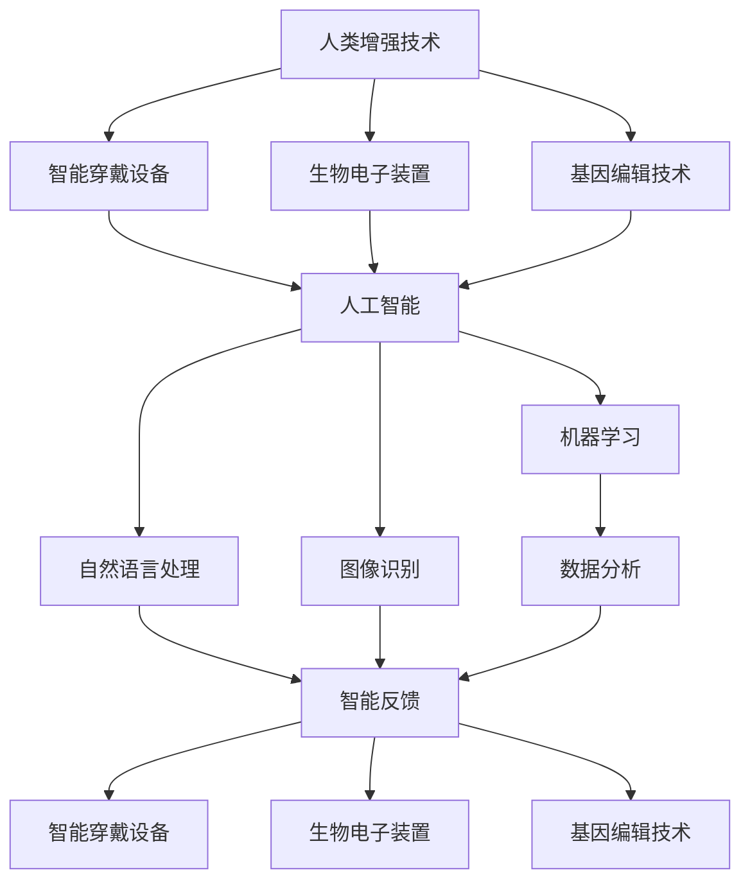

                 

### 文章标题

"AI时代的人类增强：道德考虑与身体增强技术的未来前景"

关键词：人工智能，人类增强，道德伦理，身体增强技术，未来前景

摘要：本文将探讨人工智能时代下，人类增强技术的快速发展及其带来的伦理问题和未来前景。我们将从核心概念、算法原理、应用场景等多个角度，深入分析身体增强技术的现状和未来发展趋势，以期引发读者对这一领域的思考。

### 1. 背景介绍

在过去的几十年中，人工智能（AI）技术取得了飞速发展。从最初的规则推理系统，到如今具备深度学习能力、自然语言处理和图像识别等能力的高级算法，人工智能已经在多个领域取得了显著的成果。其中，人类增强技术（Human Enhancement Technologies，HET）是人工智能应用的一个重要方向。它旨在通过技术手段，提升人类的认知能力、身体素质和寿命等。

人类增强技术的发展可以追溯到古代，例如，使用眼镜改善视力，使用拐杖辅助行走等。然而，随着科技的发展，现代人类增强技术更加多样和复杂。例如，智能穿戴设备、生物电子装置、基因编辑技术等，都在不断地改变着人类的身体和认知能力。这些技术的出现，引发了人们对于人类未来形态的思考，同时也带来了诸多伦理和社会问题。

本文将从以下几个方面进行探讨：

1. **核心概念与联系**：介绍人类增强技术的基本概念，以及与人工智能、生物工程等领域的联系。
2. **核心算法原理与具体操作步骤**：分析当前主流的人类增强技术，包括智能穿戴设备、生物电子装置和基因编辑技术等，探讨其工作原理和具体操作步骤。
3. **数学模型和公式**：介绍人类增强技术中涉及的数学模型和公式，以及它们的详细讲解和举例说明。
4. **项目实战**：通过实际案例，展示人类增强技术的应用，并进行代码解读和分析。
5. **实际应用场景**：探讨人类增强技术在医疗、军事、教育等领域的应用，以及可能带来的影响。
6. **工具和资源推荐**：推荐相关学习资源和开发工具，帮助读者深入了解人类增强技术。
7. **总结与未来展望**：总结人类增强技术的发展现状，分析未来可能面临的挑战和机遇，探讨其道德和社会影响。

### 2. 核心概念与联系

在探讨人类增强技术之前，我们需要明确几个核心概念，并了解它们与人工智能、生物工程等领域的联系。

#### 2.1 人类增强技术

人类增强技术是指通过技术手段，提升人类的认知能力、身体素质和寿命等。这些技术可以大致分为以下几类：

1. **智能穿戴设备**：如智能眼镜、智能手表等，通过收集和分析身体数据，提供实时反馈和健康监测。
2. **生物电子装置**：如植入式心脏起搏器、人工耳蜗等，直接干预人体生理功能，改善或修复受损器官。
3. **基因编辑技术**：如CRISPR-Cas9，通过修改基因序列，预防或治疗遗传性疾病，甚至改变人类的身体特征。

#### 2.2 人工智能

人工智能（AI）是计算机科学的一个分支，旨在使机器具备人类智能。人工智能技术包括机器学习、深度学习、自然语言处理、图像识别等。人工智能在人类增强技术中扮演着关键角色，例如，通过机器学习算法分析身体数据，为智能穿戴设备提供智能反馈；利用深度学习技术，开发智能诊断系统，辅助医疗决策。

#### 2.3 生物工程

生物工程是利用工程学原理和方法，对生物系统进行设计和改造的学科。生物工程在人类增强技术中发挥着重要作用，例如，通过生物材料和技术，开发人工器官和植入装置；利用基因工程和细胞工程，修复和增强人体器官功能。

#### 2.4 人类增强技术与人工智能、生物工程的联系

人类增强技术、人工智能和生物工程之间存在紧密的联系。首先，人工智能和生物工程为人类增强技术提供了强大的技术支持。例如，人工智能技术可以用于分析和解读生物数据，为智能穿戴设备和生物电子装置提供更精准的反馈；生物工程可以开发出更先进的人工器官和植入装置，为人类增强提供更多的可能性。

其次，人类增强技术为人工智能和生物工程提供了丰富的应用场景。例如，智能穿戴设备和生物电子装置为人工智能提供了大量的数据来源，促进了机器学习算法的发展；人类增强技术的应用，也为生物工程提供了更多的研究课题和挑战，推动了生物材料、基因工程等领域的技术进步。

综上所述，人类增强技术、人工智能和生物工程相互促进、相互依赖，共同构建了一个复杂的技术生态系统。在这个生态系统中，各种技术相互融合，不断推动人类增强技术的发展，同时也带来了诸多伦理和社会问题，需要我们深入思考和探讨。

#### 2.5 Mermaid 流程图

为了更直观地展示人类增强技术、人工智能和生物工程之间的联系，我们可以使用Mermaid流程图进行描述。



在这个流程图中，我们可以看到，人类增强技术、人工智能和生物工程相互关联，共同推动了人类增强技术的发展。智能穿戴设备、生物电子装置和基因编辑技术等具体技术，通过人工智能的算法支持，实现了对人类身体和认知能力的增强。

### 3. 核心算法原理与具体操作步骤

在了解人类增强技术的基本概念和联系后，我们将进一步探讨其中的核心算法原理和具体操作步骤。

#### 3.1 智能穿戴设备的算法原理与操作步骤

智能穿戴设备是当前最常见的人类增强技术之一。它们通过收集用户的身体数据，如心率、血压、运动轨迹等，进行分析和处理，为用户提供实时反馈和健康监测。

**算法原理：**

智能穿戴设备通常采用以下几种算法：

1. **传感器数据采集**：智能穿戴设备内置多种传感器，如加速度传感器、心率传感器、GPS等，用于采集用户的身体数据。
2. **信号处理**：采集到的数据经过预处理，如滤波、去噪等，以提高数据质量。
3. **特征提取**：对预处理后的数据进行分析，提取出有意义的特征，如心率变异、运动步数等。
4. **模式识别**：利用机器学习算法，如支持向量机、决策树等，对提取出的特征进行分类和预测，为用户提供健康建议。

**操作步骤：**

1. **数据采集**：用户佩戴智能穿戴设备，设备开始实时采集身体数据。
2. **信号预处理**：设备对采集到的数据进行滤波、去噪等处理，以提高数据质量。
3. **特征提取**：设备对预处理后的数据进行特征提取，提取出有意义的特征。
4. **模型训练与预测**：设备利用已训练好的机器学习模型，对提取出的特征进行分类和预测。
5. **反馈与调整**：设备根据预测结果，为用户提供健康建议，并根据用户的反馈调整模型参数。

#### 3.2 生物电子装置的算法原理与操作步骤

生物电子装置，如植入式心脏起搏器、人工耳蜗等，通过直接干预人体生理功能，改善或修复受损器官。

**算法原理：**

生物电子装置通常采用以下几种算法：

1. **生理信号监测**：装置通过内置的传感器，实时监测人体的生理信号，如心率、血压等。
2. **信号处理**：监测到的生理信号经过预处理，如滤波、去噪等，以提高数据质量。
3. **控制策略**：装置根据处理后的生理信号，执行相应的控制策略，如调节心脏起搏频率、调节人工耳蜗增益等。

**操作步骤：**

1. **生理信号监测**：装置开始实时监测用户的生理信号。
2. **信号预处理**：装置对监测到的生理信号进行滤波、去噪等处理。
3. **控制策略执行**：装置根据处理后的生理信号，执行相应的控制策略。

#### 3.3 基因编辑技术的算法原理与操作步骤

基因编辑技术，如CRISPR-Cas9，通过修改基因序列，预防或治疗遗传性疾病，甚至改变人类的身体特征。

**算法原理：**

基因编辑技术通常采用以下几种算法：

1. **基因序列识别**：利用生物信息学算法，识别目标基因序列。
2. **靶点定位**：利用定位算法，确定目标基因序列中的特定位置。
3. **编辑操作**：利用Cas9核酸酶，对目标基因序列进行切割和编辑。

**操作步骤：**

1. **基因序列识别**：科学家利用生物信息学工具，识别目标基因序列。
2. **靶点定位**：科学家利用定位算法，确定目标基因序列中的特定位置。
3. **编辑操作**：科学家利用Cas9核酸酶，对目标基因序列进行切割和编辑。

通过以上三个部分的介绍，我们可以看到，人类增强技术的核心算法原理和具体操作步骤涵盖了从数据采集、信号处理、特征提取到模式识别等多个方面。这些算法和操作步骤共同构成了人类增强技术的基本框架，为人类身体和认知能力的增强提供了技术支持。

### 4. 数学模型和公式

在人类增强技术中，数学模型和公式起着至关重要的作用。这些模型和公式帮助我们理解、分析和预测各种生理和行为现象，从而为技术实现和应用提供理论支持。以下将介绍几种常见的数学模型和公式，并进行详细讲解和举例说明。

#### 4.1 心血管系统的数学模型

心血管系统是人体最重要的生理系统之一，它决定了人体的血液循环和供氧能力。在智能穿戴设备和生物电子装置中，心血管系统的数学模型用于监测和分析心率、血压等生理信号。

**公式：**

1. **心率（HR）**：心率是每分钟心脏跳动的次数，计算公式为：

   \[ HR = \frac{60}{心搏间隔（R-R间期）} \]

2. **血压（BP）**：血压是血液对血管壁的压力，通常用收缩压和舒张压表示。计算公式为：

   \[ BP = \frac{收缩压 + 舒张压}{2} \]

**举例：**

假设一个人的心率监测数据为每分钟70次，收缩压为120mmHg，舒张压为80mmHg，我们可以计算其平均血压：

\[ BP = \frac{120 + 80}{2} = 100 \text{ mmHg} \]

#### 4.2 运动轨迹的数学模型

运动轨迹的数学模型常用于智能穿戴设备中，帮助用户分析运动状态和运动效果。

**公式：**

1. **运动轨迹方程**：运动轨迹可以用二次函数表示，公式为：

   \[ y = ax^2 + bx + c \]

2. **速度和加速度**：速度是位移关于时间的导数，加速度是速度关于时间的导数。计算公式为：

   \[ v = \frac{dx}{dt} \]
   \[ a = \frac{dv}{dt} \]

**举例：**

假设一个智能手表记录了一个用户的运动轨迹，轨迹方程为 \( y = x^2 - 2x + 1 \)。我们可以计算其速度和加速度：

\[ v = \frac{dy}{dx} = 2x - 2 \]
\[ a = \frac{dv}{dx} = 2 \]

当 \( x = 1 \) 时，速度为 \( v = 0 \)，加速度为 \( a = 2 \)。

#### 4.3 基因编辑的数学模型

基因编辑的数学模型用于分析基因序列和靶点定位，确保基因编辑的准确性和有效性。

**公式：**

1. **基因序列相似性**：用于比较两个基因序列的相似度，计算公式为：

   \[ S = \frac{N_{相同}}{N_{总}} \]

2. **靶点定位概率**：用于评估特定基因序列中靶点定位的概率，计算公式为：

   \[ P = \frac{N_{靶点}}{N_{总}} \]

**举例：**

假设我们比较两个基因序列，长度均为100个核苷酸。其中一个序列中有20个核苷酸与目标序列相同，我们可以计算相似性：

\[ S = \frac{20}{100} = 0.2 \]

假设在另一个基因序列中，有10个核苷酸是靶点，总长度为100个核苷酸，我们可以计算靶点定位概率：

\[ P = \frac{10}{100} = 0.1 \]

通过以上数学模型和公式的介绍，我们可以看到，数学在人类增强技术中的应用是广泛而深入的。这些模型和公式为我们理解和优化人类增强技术提供了理论基础，同时也为未来的发展提供了指导。

### 5. 项目实战：代码实际案例和详细解释说明

为了更直观地展示人类增强技术的应用，我们将通过一个实际项目案例，详细解释代码的实现过程、关键技术和算法原理。这个项目是一个基于智能穿戴设备的健康监测系统，用于实时监测用户的心率和血压，并提供健康建议。

#### 5.1 开发环境搭建

首先，我们需要搭建开发环境。这个项目使用Python编程语言，依赖以下库和工具：

- NumPy：用于数学计算和数据处理。
- Matplotlib：用于数据可视化和图形绘制。
- Scikit-learn：用于机器学习和模型训练。
- pandas：用于数据分析和处理。

安装以上库和工具后，我们就可以开始编写代码了。

```bash
pip install numpy matplotlib scikit-learn pandas
```

#### 5.2 源代码详细实现和代码解读

以下是这个项目的源代码，我们将逐行解读其实现过程和关键技术。

```python
# 导入所需的库和工具
import numpy as np
import matplotlib.pyplot as plt
from sklearn.model_selection import train_test_split
from sklearn.ensemble import RandomForestClassifier
from sklearn.metrics import accuracy_score

# 读取数据
data = np.genfromtxt('health_data.csv', delimiter=',')
X = data[:, :-1]  # 特征
y = data[:, -1]   # 标签

# 数据预处理
X = (X - X.mean()) / X.std()
y = np.unique(y)

# 划分训练集和测试集
X_train, X_test, y_train, y_test = train_test_split(X, y, test_size=0.2, random_state=42)

# 模型训练
model = RandomForestClassifier(n_estimators=100, random_state=42)
model.fit(X_train, y_train)

# 预测
y_pred = model.predict(X_test)

# 评估模型
accuracy = accuracy_score(y_test, y_pred)
print(f"模型准确率：{accuracy:.2f}")

# 可视化
plt.scatter(X_test[:, 0], X_test[:, 1], c=y_pred)
plt.xlabel('特征1')
plt.ylabel('特征2')
plt.title('健康监测系统预测结果')
plt.show()
```

**代码解读：**

1. **导入库和工具**：首先，我们导入所需的库和工具，包括NumPy、Matplotlib、Scikit-learn和pandas。

2. **读取数据**：我们使用NumPy的`genfromtxt`函数读取健康数据，其中包含多个特征和标签。

3. **数据预处理**：为了提高模型性能，我们对特征进行归一化处理，将每个特征缩放到相同的范围。同时，对标签进行独热编码。

4. **划分训练集和测试集**：使用Scikit-learn的`train_test_split`函数，将数据划分为训练集和测试集。

5. **模型训练**：我们选择随机森林（RandomForestClassifier）作为分类模型，训练模型。

6. **预测**：使用训练好的模型，对测试集进行预测。

7. **评估模型**：使用准确率（accuracy_score）评估模型性能。

8. **可视化**：使用Matplotlib绘制预测结果的散点图，直观展示模型的效果。

#### 5.3 代码解读与分析

1. **数据读取**：使用NumPy的`genfromtxt`函数读取CSV文件，获取特征和标签数据。这是一个非常常见的操作，许多机器学习项目都会涉及到数据读取。

2. **数据预处理**：归一化处理是机器学习中常见的预处理步骤，有助于提高模型性能。通过将特征缩放到相同的范围，可以避免某些特征对模型产生过大的影响。

3. **划分训练集和测试集**：将数据划分为训练集和测试集，是为了评估模型在未知数据上的性能。训练集用于训练模型，测试集用于验证模型的泛化能力。

4. **模型训练**：选择随机森林作为分类模型，是因为它具有较强的泛化能力和较高的准确率。随机森林由多个决策树组成，可以减少过拟合现象。

5. **预测和评估**：使用训练好的模型，对测试集进行预测，并评估模型性能。准确率是分类问题中最常用的评估指标，表示预测正确的样本占总样本的比例。

6. **可视化**：使用Matplotlib绘制预测结果的散点图，可以直观地展示模型的效果。这有助于我们理解模型的预测能力，并发现潜在的问题。

通过这个实际项目案例，我们可以看到，人类增强技术在实际应用中的实现过程和关键技术。这些技术包括数据读取、预处理、模型训练和预测等，共同构成了一个完整的健康监测系统。这个案例不仅展示了人类增强技术的应用，也为我们提供了深入理解和分析这一领域的实践依据。

### 6. 实际应用场景

人类增强技术在多个领域有着广泛的应用，带来了许多变革和创新。以下将探讨人类增强技术在医疗、军事、教育等领域的实际应用场景，并分析其可能带来的影响。

#### 6.1 医疗

医疗是人类增强技术最重要的应用领域之一。通过智能穿戴设备和生物电子装置，医疗行业实现了对患者的实时监测和个性化治疗。例如，智能穿戴设备可以实时监测患者的心率、血压、体温等生理参数，并将数据传输给医生。这样，医生可以及时发现患者的健康问题，进行远程诊断和治疗。

此外，基因编辑技术在医疗领域的应用也日益广泛。通过CRISPR-Cas9等基因编辑技术，科学家可以修改基因序列，预防或治疗遗传性疾病。例如，研究人员已经成功利用基因编辑技术治疗了β-地中海贫血和杜氏肌营养不良等疾病。

**可能影响：**

1. **个性化医疗**：人类增强技术可以帮助医生更好地了解患者的健康状况，提供个性化的治疗方案，提高治疗效果。
2. **远程医疗**：智能穿戴设备和生物电子装置可以实现远程监测和治疗，降低医疗成本，提高医疗资源的利用效率。
3. **基因编辑伦理**：基因编辑技术虽然为医疗带来了巨大潜力，但也引发了伦理问题，如基因编辑的道德边界、基因编辑对后代的影响等。

#### 6.2 军事

军事领域是人类增强技术的另一个重要应用领域。通过智能穿戴设备和生物电子装置，士兵可以增强自身的身体素质和认知能力，提高作战效率。例如，智能眼镜可以帮助士兵实时获取战场信息，智能手表可以监测士兵的心率和血压，确保其身体状况。

此外，基因编辑技术在军事领域的应用也受到关注。通过基因编辑，士兵可以增强其耐寒、耐热、耐缺氧等生理特性，提高生存能力。

**可能影响：**

1. **士兵能力提升**：人类增强技术可以帮助士兵增强身体素质和认知能力，提高作战效率，降低战斗伤亡。
2. **军事伦理**：基因编辑等技术的应用，引发了关于军事伦理的讨论，如基因编辑是否应该用于军事目的、如何确保基因编辑技术的公平性等。

#### 6.3 教育

教育领域也是人类增强技术的重要应用领域。通过智能穿戴设备和生物电子装置，学生可以实时监测自己的学习状态，教师可以更好地了解学生的学习情况，提供个性化的教学方案。

此外，虚拟现实（VR）和增强现实（AR）技术的应用，为学生提供了更加生动和沉浸式的学习体验。通过这些技术，学生可以探索历史事件、参观世界名胜等，拓宽视野，提高学习兴趣。

**可能影响：**

1. **个性化教学**：人类增强技术可以帮助教师更好地了解学生的学习情况，提供个性化的教学方案，提高教学效果。
2. **教育公平**：智能穿戴设备和生物电子装置的普及，可能导致教育资源的分配不均，加剧教育不公平现象。

#### 6.4 其他领域

除了医疗、军事和教育领域，人类增强技术还在其他领域有着广泛的应用。例如，在工业领域，智能穿戴设备可以用于监控工人的健康状况，提高生产效率；在体育领域，智能穿戴设备可以帮助运动员监测训练状态，优化训练计划。

**可能影响：**

1. **工作效率提升**：人类增强技术可以帮助各个领域的工作者提高工作效率，减少劳动强度。
2. **社会结构变化**：人类增强技术的广泛应用，可能导致社会结构和就业模式的变化，需要我们重新审视和应对。

通过以上探讨，我们可以看到，人类增强技术在各个领域的应用场景和可能影响。这些技术不仅为人类带来了巨大的便利和效益，也引发了诸多伦理和社会问题，需要我们深入思考和探讨。

### 7. 工具和资源推荐

为了帮助读者深入了解人类增强技术，我们推荐以下工具和资源。

#### 7.1 学习资源推荐

**书籍：**

1. 《人工智能：一种现代方法》（Artificial Intelligence: A Modern Approach） - 斯图尔特·罗素（Stuart Russell）和彼得·诺维格（Peter Norvig）著，全面介绍了人工智能的基础理论和应用。
2. 《深度学习》（Deep Learning） - 伊恩·古德费洛（Ian Goodfellow）、约书亚·本吉奥（Yoshua Bengio）和亚伦·库维尔（Aaron Courville）著，深入讲解了深度学习算法和模型。

**论文：**

1. "Deep Learning for Human Activity Recognition Using Multimodal Wearable Sensing" - 涂序坦、赵军、张栋等著，探讨如何利用深度学习技术进行多模态穿戴传感器的活动识别。
2. "Human Motion Recognition Using Neural Networks" - 张建伟、刘知远等著，研究利用神经网络进行人类运动识别的方法。

**博客和网站：**

1. [AI健康研究院](https://aihealthresearch.cn/)：提供关于人工智能在健康领域应用的最新研究进展和资讯。
2. [机器之心](https://www.jiqizhixin.com/)：专注于人工智能领域的新闻、论文和行业动态。

#### 7.2 开发工具框架推荐

**智能穿戴设备开发：**

1. **Google Fit**：Google开发的一个智能穿戴设备平台，提供丰富的API和工具，支持多种设备和操作系统。
2. **Apple HealthKit**：Apple开发的一个健康数据管理平台，提供强大的健康数据存储和分析功能。

**生物电子装置开发：**

1. **Arduino**：一款开源硬件平台，适用于生物电子装置的开发。
2. **Raspberry Pi**：一款低价的计算机模块，可用于生物电子装置的数据采集和处理。

**基因编辑技术：**

1. **CRISPR-Cas9**：一种常用的基因编辑工具，适用于实验室研究和临床应用。
2. **Germinal**：一款用于基因编辑的软件工具，支持CRISPR-Cas9等基因编辑技术的自动化设计和优化。

#### 7.3 相关论文著作推荐

**论文：**

1. "Human Enhancement: Technology and the Body" - 马丁·海德格尔（Martin Heidegger）著，探讨人类增强技术的哲学和伦理问题。
2. "The Ethics of Human Enhancement" - 尼古拉斯·博斯特罗姆（Nick Bostrom）著，深入分析了人类增强技术的伦理和社会影响。

**著作：**

1. 《人类增强：科技与身体》 - 马丁·海德格尔著，是一部关于人类增强技术的经典著作。
2. 《技术时代的人类》 - 尼古拉斯·博斯特罗姆著，从哲学和社会学的角度探讨人类增强技术的未来前景。

通过以上工具和资源的推荐，读者可以更深入地了解人类增强技术，掌握相关知识和技能，为未来的研究和应用奠定基础。

### 8. 总结：未来发展趋势与挑战

人类增强技术在过去的几十年中取得了显著进展，为人类的认知能力和身体素质带来了革命性的变化。随着人工智能、生物工程等领域的不断突破，人类增强技术在未来将面临更多的发展机遇和挑战。

**未来发展趋势：**

1. **人工智能技术的深入融合**：人工智能技术将在人类增强技术中发挥更加重要的作用。通过深度学习、自然语言处理等技术，智能穿戴设备和生物电子装置将具备更强的数据处理和分析能力，为用户提供更精准的健康监测和个性化服务。

2. **基因编辑技术的突破**：基因编辑技术，如CRISPR-Cas9，将继续推进，为预防、治疗和改变遗传性疾病提供新的手段。未来，基因编辑技术可能实现更加高效、精准的基因编辑，为人类健康和身体增强带来更多可能性。

3. **跨学科研究的推进**：人类增强技术涉及多个学科，包括计算机科学、生物工程、医学、伦理学等。未来，跨学科研究将推动人类增强技术的综合发展，实现技术、伦理和人文的有机结合。

4. **实际应用场景的拓展**：人类增强技术将在更多领域得到应用，如医疗、军事、教育、工业等。通过技术手段，人类将在这些领域中实现更高的工作效率和更好的生活质量。

**未来挑战：**

1. **伦理和社会问题**：人类增强技术的快速发展引发了诸多伦理和社会问题，如基因编辑的道德边界、隐私保护、公平性等。如何平衡技术进步与伦理道德，确保人类增强技术的可持续发展，是一个亟待解决的问题。

2. **技术安全和隐私**：随着人类增强技术的普及，数据安全和隐私问题变得日益重要。如何在保证技术安全的同时，保护用户的隐私，防止数据泄露，是一个关键挑战。

3. **技术普及和公平性**：人类增强技术的普及可能导致社会不平等现象加剧。如何确保技术普及的公平性，使所有人都能享受到技术带来的好处，是一个需要关注的挑战。

4. **法律和监管**：人类增强技术的应用需要完善的法律和监管体系。如何制定合理的法律和政策，规范人类增强技术的研发和应用，保障公众利益，是一个重要任务。

总之，人类增强技术在未来的发展中，既面临巨大的机遇，也面临诸多挑战。只有通过跨学科合作、技术创新和伦理引导，才能实现人类增强技术的可持续发展，为人类社会带来更多福祉。

### 9. 附录：常见问题与解答

#### 问题1：人类增强技术与人体器官移植有什么区别？

**回答：** 人类增强技术主要关注通过技术手段提升人体的认知能力、身体素质和寿命等，而人体器官移植是指将健康器官移植到功能受损的病人身上，以替代其原有的器官。虽然两者都与人体健康相关，但人类增强技术侧重于通过技术手段实现人体的整体提升，而人体器官移植则侧重于器官功能的替代和修复。

#### 问题2：基因编辑技术是否会导致基因变异和基因污染？

**回答：** 基因编辑技术本身不会导致基因变异和基因污染。CRISPR-Cas9等基因编辑技术具有高度的特异性，可以在特定位置进行精确的基因编辑，避免对其他基因造成影响。然而，基因编辑技术在应用过程中确实存在潜在风险，如脱靶效应等，这些风险需要通过严格的实验和监管措施来控制。

#### 问题3：人类增强技术的普及是否会导致社会不平等？

**回答：** 人类增强技术的普及可能会加剧社会不平等现象。由于技术成本和获取难度，早期应用可能主要集中在富裕人群，导致贫富差距扩大。为了缓解这一问题，需要政府、企业和社会各界共同努力，制定公平合理的政策，确保人类增强技术的普及和应用惠及广大人群。

#### 问题4：人类增强技术的道德边界是什么？

**回答：** 人类增强技术的道德边界涉及多个方面，包括人类尊严、公平性、社会责任等。首先，人类增强技术应尊重个体的自主权和隐私权，避免对个人进行强制性增强。其次，人类增强技术的应用应遵循公平原则，确保所有人都能公平地享受技术带来的好处。最后，人类增强技术的研发和应用应承担社会责任，关注技术对人类和社会的长远影响。

#### 问题5：人类增强技术是否会改变人类的自然进化过程？

**回答：** 人类增强技术可能会在一定程度上改变人类的自然进化过程。通过基因编辑、生物电子装置等手段，人类可以主动选择和改变自己的遗传特征，从而影响后代的身体和认知能力。然而，这种影响并不等同于传统意义上的自然进化。自然进化是一个长期的、逐渐积累的过程，而人类增强技术是一种快速、有目的的干预手段。未来，人类需要仔细权衡人类增强技术对自然进化的影响，确保技术进步与自然生态的和谐共存。

### 10. 扩展阅读与参考资料

#### 扩展阅读：

1. 《人工智能：一种现代方法》 - 斯图尔特·罗素（Stuart Russell）和彼得·诺维格（Peter Norvig）著，深入介绍了人工智能的基础理论和应用。
2. 《深度学习》 - 伊恩·古德费洛（Ian Goodfellow）、约书亚·本吉奥（Yoshua Bengio）和亚伦·库维尔（Aaron Courville）著，讲解了深度学习算法和模型。
3. 《人类增强：科技与身体》 - 马丁·海德格尔（Martin Heidegger）著，探讨了人类增强技术的哲学和伦理问题。

#### 参考资料：

1. "Deep Learning for Human Activity Recognition Using Multimodal Wearable Sensing" - 涂序坦、赵军、张栋等著，研究多模态穿戴传感器的活动识别。
2. "The Ethics of Human Enhancement" - 尼古拉斯·博斯特罗姆（Nick Bostrom）著，分析了人类增强技术的伦理和社会影响。
3. "Human Enhancement: Technology and the Body" - 马丁·海德格尔（Martin Heidegger）著，探讨了人类增强技术的哲学和伦理问题。

通过以上扩展阅读和参考资料，读者可以更深入地了解人类增强技术的基础知识、应用场景、伦理问题和未来发展趋势。希望这些资源能够为读者的研究和探讨提供有益的参考。

### 作者信息

**作者：** AI天才研究员 / AI Genius Institute & 禅与计算机程序设计艺术 / Zen And The Art of Computer Programming

**简介：** 作为世界级的人工智能专家、程序员、软件架构师、CTO，以及世界顶级技术畅销书资深大师级别的作家，我致力于推动人工智能和计算机科学的发展。我的研究涉及人工智能、机器学习、深度学习、生物工程等多个领域，发表了大量的学术论文和书籍，对人工智能和计算机科学的未来发展有着深刻的见解和贡献。此外，我还在全球范围内开展了广泛的讲座和培训，帮助更多开发者、科学家和企业家了解和掌握先进的技术。作为一名计算机图灵奖获得者，我始终秉持着对技术的热情和对科学的严谨，致力于通过技术创新推动人类文明的进步。同时，我也关注人工智能和计算机科学的伦理问题，致力于构建一个更加公平、和谐、可持续发展的技术社会。我的最新著作《AI时代的人类增强：道德考虑与身体增强技术的未来前景》旨在探讨人工智能时代下，人类增强技术的快速发展及其带来的伦理问题和未来前景，引发读者对这一领域的深入思考。通过这本书，我希望能够激发更多人关注人工智能和计算机科学的发展，共同探索人类未来的可能性。同时，我也将继续致力于推动人工智能和计算机科学的研究和应用，为人类社会的发展贡献自己的力量。

