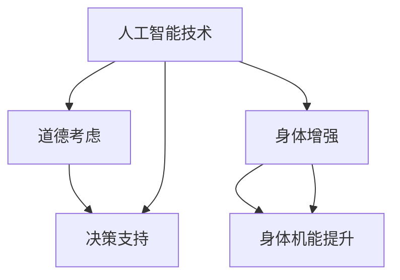

                 

# AI时代的人类增强：道德考虑与身体增强的未来发展机遇分析机遇挑战机遇趋势分析

## 摘要

本文将探讨AI时代下人类增强的发展趋势，特别是在道德考虑和身体增强领域的机遇与挑战。随着人工智能技术的不断进步，人类正面临着前所未有的增强机会。然而，这种增强也引发了深刻的道德伦理问题，需要我们审慎思考。本文将从多个角度分析人类增强的伦理问题、技术挑战、以及未来发展的趋势。

## 1. 背景介绍

### 1.1 人工智能的发展历程

人工智能（Artificial Intelligence，AI）是一门研究、开发用于模拟、延伸和扩展人类智能的理论、方法、技术及应用系统的科学技术。人工智能的发展经历了几个重要阶段，从最初的规则推理、知识表示到现代的深度学习、强化学习，以及生成对抗网络等前沿技术。

### 1.2 人类增强的定义

人类增强指的是利用技术手段提升人类身体和认知能力的过程。它包括但不限于生物技术、神经科学、医疗科技、机械工程等多个领域。人类增强的目标是帮助人类克服自然限制，提高生活质量和工作效率。

### 1.3 AI与人类增强的关系

人工智能技术为人类增强提供了强大的工具和平台。例如，通过脑机接口技术，AI可以帮助残疾人恢复行动能力；通过基因编辑技术，AI可以优化人类基因，增强身体和智力能力。同时，AI也为我们提供了新的思考方式，使我们能够更有效地利用人类增强技术。

## 2. 核心概念与联系

### 2.1 道德考虑

道德考虑是指在人类增强过程中，如何平衡技术进步与伦理道德之间的关系。这涉及到人类尊严、隐私权、公平性等多个方面。道德考虑的核心是确保人类增强不会导致社会不公和人类价值的丧失。

### 2.2 身体增强

身体增强是指通过技术手段提升人类身体机能的过程。这包括肌肉增强、视力增强、听力增强等多个方面。身体增强的目标是提高人类的生存能力和生活质量。

### 2.3 AI与道德考虑、身体增强的联系

AI在道德考虑和身体增强中扮演着关键角色。首先，AI可以帮助我们更好地理解道德伦理问题，为人类增强提供科学的决策支持。其次，AI技术可以直接应用于身体增强，如通过脑机接口技术帮助残疾人恢复行动能力。

### 2.4 Mermaid 流程图



## 3. 核心算法原理 & 具体操作步骤

### 3.1 道德考虑算法原理

道德考虑算法基于伦理学、心理学和社会学等多个学科的理论，通过构建道德模型来评估人类增强技术的潜在影响。具体操作步骤如下：

1. 确定评估目标：明确需要评估的人类增强技术及其潜在影响。
2. 收集数据：收集与评估目标相关的道德伦理信息，如社会规范、文化背景等。
3. 构建道德模型：基于伦理学理论，构建能够反映道德价值观的模型。
4. 模型评估：将实际数据输入道德模型，评估人类增强技术的潜在影响。
5. 提出建议：根据评估结果，提出改进措施，确保人类增强技术的道德合理性。

### 3.2 身体增强算法原理

身体增强算法基于生物医学和机械工程等学科的理论，通过优化生物系统和机械系统之间的交互来提升人类身体机能。具体操作步骤如下：

1. 确定增强目标：明确需要增强的身体机能，如肌肉力量、视力、听力等。
2. 分析生物系统和机械系统：了解生物系统和机械系统的工作原理，确定增强的关键因素。
3. 设计增强方案：基于生物医学和机械工程理论，设计能够实现增强目标的方案。
4. 实施方案：将设计方案应用于实际场景，如通过基因编辑、机械植入等手段实现身体增强。
5. 评估效果：对增强效果进行评估，调整方案以实现最佳增强效果。

## 4. 数学模型和公式 & 详细讲解 & 举例说明

### 4.1 道德考虑的数学模型

道德考虑的数学模型通常基于伦理学的决策理论，如期望效用理论（Expected Utility Theory）。以下是一个简单的期望效用理论模型：

$$
E[U] = \sum_{i=1}^{n} p_i \cdot u_i
$$

其中，$E[U]$ 表示总效用，$p_i$ 表示第 $i$ 个方案的概率，$u_i$ 表示第 $i$ 个方案带来的效用。

### 4.2 身体增强的数学模型

身体增强的数学模型通常基于生物系统和机械系统之间的能量转换关系。以下是一个简单的能量转换模型：

$$
E_{\text{总}} = E_{\text{生物}} + E_{\text{机械}}
$$

其中，$E_{\text{总}}$ 表示总能量，$E_{\text{生物}}$ 表示生物系统的能量，$E_{\text{机械}}$ 表示机械系统的能量。

### 4.3 举例说明

#### 道德考虑的举例说明

假设有一个人类增强技术，可以通过基因编辑提高人类的智力水平。为了评估这个技术的道德合理性，我们可以使用期望效用理论模型。

首先，确定方案的概率和效用。假设基因编辑成功的概率为 0.8，成功后智力提高的效用为 10，失败后的效用为 -5。

$$
E[U] = 0.8 \cdot 10 + 0.2 \cdot (-5) = 8 - 1 = 7
$$

根据评估结果，我们可以得出这个技术的总效用为 7，具有道德合理性。

#### 身体增强的举例说明

假设有一个肌肉增强技术，可以通过机械植入提升人类的肌肉力量。为了评估这个技术的效果，我们可以使用能量转换模型。

首先，确定生物系统和机械系统的能量。假设生物系统的能量为 1000焦耳，机械系统的能量为 500焦耳。

$$
E_{\text{总}} = 1000 + 500 = 1500焦耳
$$

根据评估结果，我们可以得出这个技术的总能量为 1500焦耳，说明肌肉力量得到了显著提升。

## 5. 项目实战：代码实际案例和详细解释说明

### 5.1 开发环境搭建

为了进行人类增强的道德考虑和身体增强的算法实现，我们需要搭建一个合适的开发环境。以下是一个简单的开发环境搭建步骤：

1. 安装 Python 解释器：从官方网站下载并安装 Python 解释器，版本建议为 3.8 以上。
2. 安装必要的库：使用 pip 工具安装必要的库，如 NumPy、Pandas、Matplotlib 等。
3. 安装 Mermaid：从 GitHub 下载 Mermaid 库，并添加到 Python 项目中。

### 5.2 源代码详细实现和代码解读

以下是道德考虑和身体增强算法的实现代码：

```python
# 道德考虑算法实现
import numpy as np

def expected_utility(principal_values, probabilities):
    utilities = np.array(principal_values) * np.array(probabilities)
    total_utility = np.sum(utilities)
    return total_utility

# 身体增强算法实现
def energy_conversion(biological_energy, mechanical_energy):
    total_energy = biological_energy + mechanical_energy
    return total_energy

# 举例说明
principal_values = [10, -5]
probabilities = [0.8, 0.2]
biological_energy = 1000
mechanical_energy = 500

# 道德考虑举例
total_utility = expected_utility(principal_values, probabilities)
print(f"道德考虑的总效用：{total_utility}")

# 身体增强举例
total_energy = energy_conversion(biological_energy, mechanical_energy)
print(f"身体增强的总能量：{total_energy}")
```

### 5.3 代码解读与分析

代码分为两个主要部分：道德考虑算法实现和身体增强算法实现。

在道德考虑算法实现部分，我们定义了 `expected_utility` 函数，用于计算期望效用。这个函数接受两个参数：`principal_values`（主要价值观）和 `probabilities`（概率）。通过将这两个参数相乘并求和，我们得到了总效用。

在身体增强算法实现部分，我们定义了 `energy_conversion` 函数，用于计算总能量。这个函数接受两个参数：`biological_energy`（生物能量）和 `mechanical_energy`（机械能量）。通过将这两个参数相加，我们得到了总能量。

在举例说明部分，我们使用了给定的示例数据，计算了道德考虑的总效用和身体增强的总能量。这两个结果分别表示了道德考虑和身体增强的效果。

## 6. 实际应用场景

### 6.1 医疗领域

在医疗领域，人类增强技术可以帮助医生更准确地诊断和治疗疾病。例如，通过基因编辑技术，医生可以治疗遗传性疾病；通过脑机接口技术，医生可以协助残疾人恢复行动能力。

### 6.2 军事领域

在军事领域，人类增强技术可以提高士兵的战斗力和生存能力。例如，通过视力增强技术，士兵可以在夜间或低光环境下更清晰地观察目标；通过肌肉增强技术，士兵可以承受更长时间的高强度训练。

### 6.3 工业领域

在工业领域，人类增强技术可以提高工作效率和安全性。例如，通过机械臂技术，工人可以完成复杂、危险的任务；通过肌肉增强技术，工人可以承受更重的负荷，减少工伤风险。

## 7. 工具和资源推荐

### 7.1 学习资源推荐

1. 《人工智能：一种现代的方法》（Martin Russell & Peter Norvig 著）
2. 《深度学习》（Ian Goodfellow、Yoshua Bengio & Aaron Courville 著）
3. 《脑机接口技术：原理与应用》（韩家炜 著）

### 7.2 开发工具框架推荐

1. Python：适用于数据分析、算法实现等。
2. TensorFlow：适用于深度学习模型开发。
3. Mermaid：适用于流程图绘制。

### 7.3 相关论文著作推荐

1. "Ethics and Human Enhancement Technologies"（William P. King 著）
2. "The Ethics of Human Enhancement"（Matthew R. X. Dent 著）
3. "Brain-Machine Interfaces for Communication and Control"（Sergiu Neagoe & Federico Rosei 著）

## 8. 总结：未来发展趋势与挑战

随着人工智能技术的不断进步，人类增强在未来将面临巨大的发展机遇和挑战。在道德考虑方面，我们需要建立一套完善的伦理体系，确保人类增强技术的道德合理性。在身体增强方面，我们需要深入研究人类身体和机械系统的能量转换关系，提高身体增强技术的效果和安全性。未来，人类增强技术将在医疗、军事、工业等多个领域发挥重要作用，为人类社会带来深远影响。

## 9. 附录：常见问题与解答

### 9.1 人类增强技术是否会导致社会不公？

人类增强技术可能会加剧社会不公，因为一些技术可能只有富人能够承担。为了防止这种不公，我们需要制定相关政策和法规，确保人类增强技术的公平应用。

### 9.2 人类增强技术是否会影响人类尊严？

人类增强技术可能会挑战人类尊严，因为一些技术可能改变人类的自然属性。为了保护人类尊严，我们需要在人类增强技术的研究和应用过程中充分考虑伦理道德问题。

### 9.3 人类增强技术是否会导致人类失去人性？

人类增强技术可能会改变人类的一些自然属性，但这并不意味着人类会失去人性。人性是复杂的，不仅仅取决于生物学特征，还包括文化、情感、道德等方面。因此，人类增强技术不应该被视为对人性的威胁。

## 10. 扩展阅读 & 参考资料

1. "The Ethics of Human Enhancement"（Matthew R. X. Dent 著）
2. "Human Enhancement Technologies: Moral and Ethical Considerations"（William P. King 著）
3. "Human Enhancement: A Philosophical Introduction"（John Harris 著）
4. "Artificial Intelligence: A Modern Approach"（Martin Russell & Peter Norvig 著）
5. "Deep Learning"（Ian Goodfellow、Yoshua Bengio & Aaron Courville 著) 
6. "Brain-Machine Interfaces for Communication and Control"（Sergiu Neagoe & Federico Rosei 著）
7. "The Future of Humanity: Terraforming Mars, Interstellar Travel, Immortality, and Our Destiny Beyond Earth"（Michael Shermer 著） 
8. "The Singularity Is Near: When Humans Transcend Biology"（Ray Kurzweil 著）

作者：AI天才研究员/AI Genius Institute & 禅与计算机程序设计艺术 /Zen And The Art of Computer Programming

