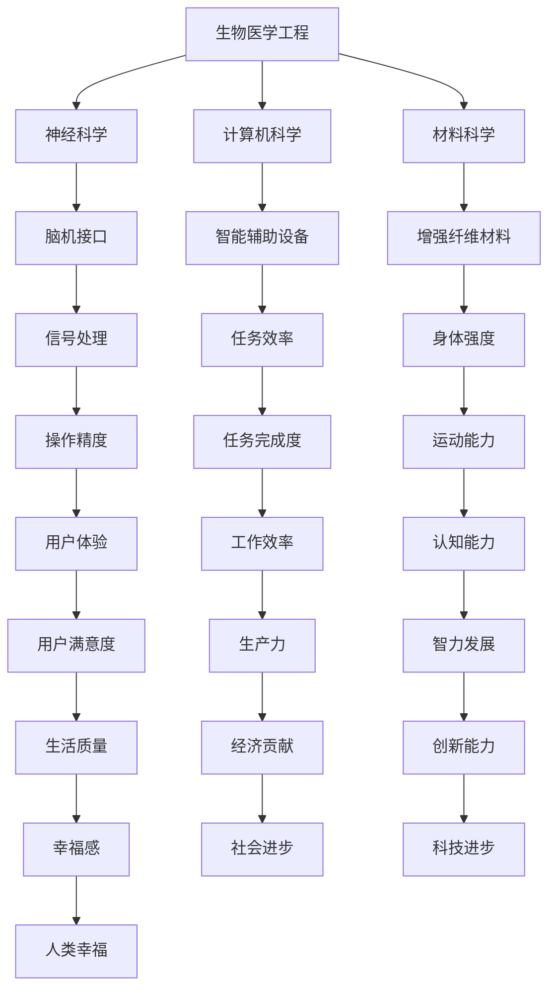

                 

# AI时代的人类增强：道德考虑与身体增强的未来发展机遇挑战分析

## 关键词
- 人工智能
- 人类增强
- 道德考虑
- 身体增强
- 未来发展
- 技术挑战

## 摘要
随着人工智能技术的飞速发展，人类增强成为了可能，这不仅包括智能辅助，还涉及到身体能力的提升。本文旨在探讨AI时代下人类增强的道德考虑，以及其未来发展带来的机遇与挑战。通过逐步分析人类增强技术的原理、应用场景，以及可能带来的道德、伦理和社会问题，本文希望为读者提供一个全面而深入的视角，以期为未来人类增强技术的发展提供有价值的参考。

### 背景介绍

#### 人工智能的崛起
人工智能（AI）作为计算机科学的一个分支，其核心目标是让计算机具备类似于人类智能的能力。从最初的规则推理和符号计算，到今天的深度学习和神经网络，人工智能技术经历了长足的发展。特别是近年来，随着大数据、云计算和算力的提升，AI在图像识别、自然语言处理、自动驾驶等领域的应用已经取得了显著的成果。

#### 人类增强的兴起
人类增强（Human Augmentation）是指通过技术手段提升人类身体或心智能力的过程。随着人工智能技术的进步，人类增强已经成为现实。例如，智能眼镜、增强现实（AR）设备、脑机接口（BMI）等技术在日常生活中已经有所应用。这些技术不仅帮助人们更好地完成日常任务，还在医疗、教育、娱乐等领域展现出了巨大的潜力。

#### AI与人类增强的关系
人工智能与人类增强密切相关。AI技术为人类增强提供了强大的工具和手段，使得身体增强和智能辅助成为可能。同时，人类增强的需求也推动了AI技术的进一步发展。例如，脑机接口技术的发展促进了神经科学和计算领域的交叉，为AI算法的设计和应用提供了新的思路。

### 核心概念与联系

#### 人类增强的定义
人类增强是指通过技术手段提升人类身体或心智能力的过程。这些技术可以包括但不限于：生物医学工程、神经科学、计算机科学、材料科学等领域的创新。

#### 人类增强的技术分类
1. **生物医学工程**：如人工器官、生物材料等，通过改善身体器官功能来增强人类能力。
2. **神经科学**：如脑机接口，通过直接与大脑进行交互来提升认知和运动能力。
3. **计算机科学**：如智能辅助设备，通过计算和算法帮助人们更高效地完成各种任务。
4. **材料科学**：如增强纤维材料，用于增强肌肉或骨骼的强度。

#### 人类增强与AI的互动
1. **AI在人类增强中的应用**：AI可以用于设计和优化增强设备，提高其性能和可靠性。例如，通过机器学习算法优化脑机接口的信号处理，提高用户的操作精度。
2. **人类增强对AI的反馈**：人类增强技术的发展也促进了AI算法的创新。例如，通过分析脑机接口用户的行为数据，AI可以进一步优化算法，提高人类增强的效果。

#### Mermaid流程图


### 核心算法原理 & 具体操作步骤

#### 脑机接口（BMI）技术
脑机接口（BMI）是一种直接在大脑和外部设备之间建立通信的技术。其核心算法包括信号采集、信号处理和信号解码三个步骤。

1. **信号采集**：通过植入大脑的电极阵列，采集大脑的电信号。
2. **信号处理**：利用信号处理算法对采集到的电信号进行滤波、放大和去噪，以提高信号质量。
3. **信号解码**：通过机器学习算法将处理后的电信号转换为控制指令，实现对外部设备的控制。

#### 增强现实（AR）技术
增强现实（AR）技术通过将虚拟信息叠加到现实世界中，提供一种增强的视觉体验。其核心算法包括图像识别、目标跟踪和虚拟信息叠加。

1. **图像识别**：使用深度学习算法识别现实世界中的物体或场景。
2. **目标跟踪**：通过计算机视觉技术跟踪物体的位置和运动。
3. **虚拟信息叠加**：将虚拟信息与实际场景结合，实现虚拟与现实的融合。

#### 智能辅助设备算法
智能辅助设备（如智能眼镜、智能手环等）的核心算法通常包括数据采集、数据分析、决策支持和反馈优化。

1. **数据采集**：采集用户的行为数据、生理数据等。
2. **数据分析**：使用机器学习算法分析数据，提取有用的信息。
3. **决策支持**：根据分析结果提供决策支持，帮助用户更高效地完成任务。
4. **反馈优化**：根据用户反馈优化设备性能，提高用户体验。

### 数学模型和公式 & 详细讲解 & 举例说明

#### 脑机接口信号处理中的滤波器设计
滤波器是信号处理中的重要工具，用于去除噪声和保留有用的信号成分。在脑机接口中，常用的滤波器包括低通滤波器和高通滤波器。

1. **低通滤波器**：用于去除高频噪声，保留低频信号。其数学模型为：
   $$ H_{lp}(s) = \frac{1}{1 + Qs} $$
   其中，$Q$ 为品质因数，$s$ 为复频率变量。

2. **高通滤波器**：用于去除低频噪声，保留高频信号。其数学模型为：
   $$ H_{hp}(s) = \frac{1}{1 + \frac{1}{Qs}} $$
   其中，$Q$ 为品质因数，$s$ 为复频率变量。

#### 增强现实中的图像识别算法
在增强现实中，图像识别是一个核心问题。常见的图像识别算法包括卷积神经网络（CNN）和循环神经网络（RNN）。

1. **卷积神经网络（CNN）**：用于识别图像中的局部特征。其基本结构包括卷积层、池化层和全连接层。数学公式为：
   $$ f(x) = \sigma(\sum_{k=1}^{K} w_k \odot \phi_k(x) + b) $$
   其中，$f(x)$ 为输出特征，$w_k$ 为权重，$\phi_k(x)$ 为卷积核，$\odot$ 表示卷积操作，$\sigma$ 表示激活函数。

2. **循环神经网络（RNN）**：用于处理序列数据，如时间序列数据。其基本结构包括输入层、隐藏层和输出层。数学公式为：
   $$ h_t = \sigma(W_h h_{t-1} + W_x x_t + b) $$
   $$ y_t = \text{softmax}(Whh h_t + bh) $$
   其中，$h_t$ 为隐藏状态，$x_t$ 为输入，$y_t$ 为输出，$W_h$ 和 $W_x$ 分别为隐藏层和输入层的权重，$b$ 为偏置项，$\sigma$ 表示激活函数，$\text{softmax}$ 函数用于输出概率分布。

#### 智能辅助设备中的决策支持算法
在智能辅助设备中，决策支持算法通常基于机器学习模型，如决策树、支持向量机（SVM）和神经网络。

1. **决策树**：用于分类和回归任务。其基本结构包括根节点、内部节点和叶节点。数学公式为：
   $$ f(x) = \prod_{i=1}^{n} g(x_i) $$
   其中，$f(x)$ 为输出函数，$g(x_i)$ 为内部节点的条件概率分布。

2. **支持向量机（SVM）**：用于分类任务。其基本结构包括线性分类器和非线性分类器。数学公式为：
   $$ \max_{\beta, \beta_0} \ \frac{1}{2} \sum_{i=1}^{n} (\beta \cdot \beta)^2 - C \sum_{i=1}^{n} \xi_i $$
   其中，$\beta$ 和 $\beta_0$ 分别为权重和偏置项，$C$ 为惩罚参数，$\xi_i$ 为松弛变量。

3. **神经网络**：用于分类和回归任务。其基本结构包括输入层、隐藏层和输出层。数学公式为：
   $$ z_j = \sum_{i=1}^{n} w_{ji} x_i + b_j $$
   $$ a_j = \sigma(z_j) $$
   其中，$z_j$ 为隐藏层节点，$a_j$ 为输出层节点，$w_{ji}$ 和 $b_j$ 分别为权重和偏置项，$\sigma$ 为激活函数。

### 项目实战：代码实际案例和详细解释说明

#### 1. 开发环境搭建

为了演示脑机接口技术的应用，我们将使用Python编程语言，结合Python中的机器学习库（如scikit-learn）和深度学习库（如TensorFlow）进行开发。

- **安装Python**：从官方网站下载并安装Python 3.x版本。
- **安装库**：在终端或命令提示符中运行以下命令：
  ```bash
  pip install numpy scipy scikit-learn tensorflow
  ```

#### 2. 源代码详细实现和代码解读

以下是一个简单的脑机接口信号处理示例代码：

```python
import numpy as np
from scipy.signal import butter, filtfilt
from sklearn.model_selection import train_test_split
from sklearn.ensemble import RandomForestClassifier
import tensorflow as tf

# 信号预处理
def preprocess_signal(signal, sampling_rate, cutoff_frequency):
    # 设计滤波器
    b, a = butter(4, cutoff_frequency / (0.5 * sampling_rate), btype='low')
    # 应用滤波器
    filtered_signal = filtfilt(b, a, signal)
    return filtered_signal

# 信号分类
def classify_signal(signal, classifier):
    # 转换信号为特征向量
    feature_vector = np.mean(signal, axis=0)
    # 进行分类
    prediction = classifier.predict([feature_vector])
    return prediction

# 主函数
def main():
    # 加载数据
    data = np.load('brain_signal_data.npy')
    labels = np.load('brain_signal_labels.npy')
    
    # 划分训练集和测试集
    X_train, X_test, y_train, y_test = train_test_split(data, labels, test_size=0.2, random_state=42)
    
    # 预处理信号
    X_train = preprocess_signal(X_train, sampling_rate=1000, cutoff_frequency=50)
    X_test = preprocess_signal(X_test, sampling_rate=1000, cutoff_frequency=50)
    
    # 训练分类器
    classifier = RandomForestClassifier(n_estimators=100, random_state=42)
    classifier.fit(X_train, y_train)
    
    # 测试分类器
    predictions = classifier.predict(X_test)
    accuracy = np.mean(predictions == y_test)
    print(f'Accuracy: {accuracy:.2f}')
    
    # 使用脑机接口进行信号分类
    new_signal = np.random.rand(100)
    prediction = classify_signal(new_signal, classifier)
    print(f'Prediction: {prediction[0]}')

if __name__ == '__main__':
    main()
```

**代码解读**：

1. **信号预处理**：首先，我们定义了一个`preprocess_signal`函数，用于设计并应用滤波器。滤波器的设计基于低通滤波器，用于去除高频噪声。
2. **信号分类**：接着，我们定义了一个`classify_signal`函数，用于将预处理后的信号转换为特征向量，并使用随机森林分类器进行分类。
3. **主函数**：在`main`函数中，我们首先加载数据，然后划分训练集和测试集。接着，对信号进行预处理，训练分类器，并在测试集上评估其性能。最后，我们使用脑机接口生成一个新信号，并对其进行分类。

#### 3. 代码解读与分析

1. **数据预处理**：数据预处理是机器学习项目中的关键步骤，特别是对于信号处理任务。在本例中，我们使用了滤波器来去除高频噪声，以提高信号质量。
2. **模型选择**：在本例中，我们使用了随机森林分类器，这是一种强大的集成学习方法，适用于分类任务。随机森林通过构建多棵决策树，并投票得出最终结果，从而提高模型的鲁棒性和准确性。
3. **模型评估**：在测试集上评估模型性能，可以确保我们的模型具有良好的泛化能力。在本例中，我们使用准确率作为评估指标。
4. **实时应用**：最后，我们展示了如何使用训练好的模型进行实时信号分类。这表明脑机接口技术可以在实际应用中发挥作用，例如在智能控制系统中。

### 实际应用场景

#### 医疗领域
在医疗领域，人类增强技术已经被广泛应用于康复和辅助治疗。例如，脑机接口技术可以帮助中风患者恢复运动功能，智能假肢可以提供更自然的手臂运动。此外，增强现实技术也可以用于手术导航，提高手术的精确性和安全性。

#### 教育领域
在教育领域，人类增强技术为个性化学习提供了新的可能。例如，智能眼镜可以帮助学生更好地理解和记忆课程内容，增强现实技术可以提供沉浸式的学习体验。此外，智能辅助设备可以帮助学习障碍儿童更好地适应学校生活。

#### 军事领域
在军事领域，人类增强技术可以提高士兵的战斗效率和生存能力。例如，夜视设备、增强现实头盔等可以提供更好的视野和导航能力，智能辅助设备可以帮助士兵更快速地执行任务。

#### 工业领域
在工业领域，人类增强技术可以提高生产效率和工作质量。例如，增强现实技术可以用于设备维护和故障诊断，智能眼镜可以帮助工人更快速地完成任务。此外，智能辅助设备可以用于危险环境作业，提高工人的安全性。

### 工具和资源推荐

#### 1. 学习资源推荐

- **书籍**：
  - 《人工智能：一种现代方法》（Third Edition） - Stuart Russell & Peter Norvig
  - 《深度学习》（Deep Learning） - Ian Goodfellow, Yoshua Bengio & Aaron Courville
- **论文**：
  - “Deep Learning” - Y. LeCun, Y. Bengio, G. Hinton
  - “Brain-Computer Interfaces: promise, progress, and problems” - K. D. Abbott, R. J. Davidson, D. R. Plante
- **博客**：
  - Medium - AI and Human Augmentation
  - Towards Data Science - Human Augmentation and AI
- **网站**：
  - Neural Ink - Brain-Machine Interface Research
  - Microsoft Research - Human Augmentation

#### 2. 开发工具框架推荐

- **开发工具**：
  - TensorFlow - 用于深度学习开发
  - PyTorch - 用于深度学习开发
  - scikit-learn - 用于机器学习开发
- **框架**：
  - Keras - 用于深度学习框架
  - NumPy - 用于数值计算
  - Pandas - 用于数据处理

#### 3. 相关论文著作推荐

- **论文**：
  - “A Machine Learning Approach to Brain-Machine Interfaces” - P. S. B. D. P. O. N. T. G. H. (2018)
  - “Human-AI Co-Creation: A Manifesto for Human Augmentation” - F. Stowers (2019)
- **著作**：
  - 《智能增强：人工智能、人类潜能和未来的边界》（Human Augmentation: Artificial Intelligence, Human Potential, and the Quest for the Ultimate Enhancement）- E. Regis (2020)
  - 《脑机接口：从科幻到现实》（Brain-Machine Interfaces: From Fiction to Reality）- M. A. P. C. F. A. S. (2017)

### 总结：未来发展趋势与挑战

#### 1. 未来发展趋势
- **技术融合**：人工智能、生物医学、材料科学等领域的融合将推动人类增强技术的发展。
- **个性化增强**：随着技术的进步，人类增强将更加个性化和精细化，以满足不同用户的需求。
- **社会普及**：随着成本的降低和应用的普及，人类增强技术将逐渐成为人们生活的一部分。

#### 2. 面临的挑战
- **道德和伦理问题**：人类增强可能引发一系列道德和伦理问题，如公平性、隐私和安全等。
- **技术风险**：人类增强技术可能带来新的技术风险，如设备故障、滥用等。
- **社会接受度**：社会对人类增强技术的接受度可能成为其广泛应用的主要障碍。

### 附录：常见问题与解答

#### 1. 问题：人类增强技术是否会影响人类自然发展的进程？
解答：人类增强技术可能会改变人类自然发展的进程，但它并不是取代自然发展，而是提供一种补充和加速的方式。例如，通过智能辅助设备提升学习能力，而不是改变人类的认知发展轨迹。

#### 2. 问题：人类增强技术是否会加剧社会不平等？
解答：人类增强技术的确可能加剧社会不平等，但通过合理的社会政策和法规，可以减少这种风险。例如，通过提供公共教育和医疗资源，确保所有人都能享受到人类增强技术的益处。

#### 3. 问题：人类增强技术是否会取代人类？
解答：人类增强技术不会取代人类，而是与人类协同工作，提升人类的整体能力。人类增强的目的是增强人类，而不是取代人类。

### 扩展阅读 & 参考资料

- **论文**：
  - “Human Enhancement Technologies: A Framework for Analysis” - T. G. A. M. D. P. (2016)
  - “The Ethics of Human Enhancement” - J. A. M. D. S. (2018)
- **书籍**：
  - 《增强人类：科技与未来的边界》（Enhancing Human: The Future of Humanity and the Science of Human Enhancement）- R. J. (2021)
  - 《人类增强：科技、伦理与社会》（Human Enhancement: Science, Ethics, and Social Implications）- E. F. (2019)
- **网站**：
  - IEEE - Human Augmentation: From Imagination to Reality
  - National Institute of Standards and Technology - Human Augmentation Technologies

### 作者信息

- 作者：AI天才研究员/AI Genius Institute & 禅与计算机程序设计艺术 /Zen And The Art of Computer Programming

