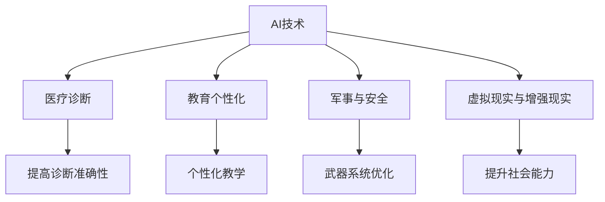
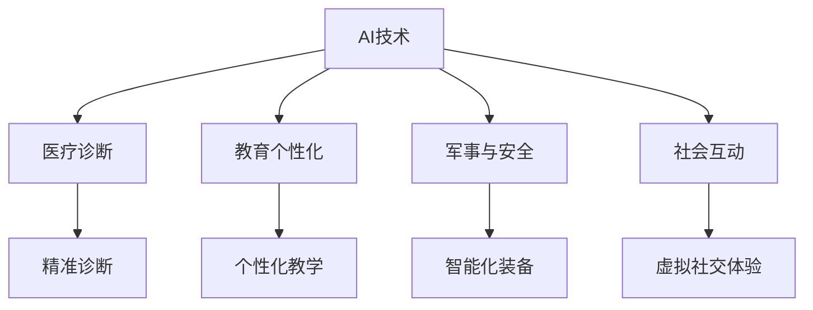

                 

# AI时代的人类增强：道德考虑与身体增强的未来发展机遇挑战趋势预测

> 关键词：人类增强，道德考虑，身体增强，AI，未来趋势，技术挑战

> 摘要：本文深入探讨了AI时代人类增强技术的发展，从道德考虑出发，分析了身体增强的未来发展机遇和挑战，并预测了相关趋势。文章通过详细的技术分析，为读者提供了全面的理解和洞察。

## 1. 背景介绍

随着人工智能（AI）技术的快速发展，人类增强（human enhancement）这一概念逐渐成为研究的热点。人类增强指的是通过科技手段提升人类的生理、心理或认知能力，使其超越自然进化的限制。AI技术在人类增强中的应用，不仅带来了前所未有的机遇，也引发了诸多伦理、法律和社会问题。

近年来，AI技术已经在医疗、教育、军事等多个领域实现了突破，为人类增强提供了强有力的支持。例如，通过AI算法优化，医疗诊断的准确性和速度得到了显著提升；教育领域则借助AI技术实现了个性化教学和智能评估。然而，随着AI技术的不断进步，人类增强的发展也面临着诸多挑战，包括隐私保护、数据安全、社会公平等问题。

## 2. 核心概念与联系

### 2.1 人类增强的定义与分类

人类增强可以分为物理增强、认知增强和社会增强三种类型。物理增强主要指通过植入设备、药物或生物技术等手段提升人类的生理能力；认知增强则是通过认知训练、神经接口等手段提升人类的认知能力；社会增强则强调通过虚拟现实、社交网络等手段增强人类的社会能力。

### 2.2 AI与人类增强的联系

AI技术在人类增强中的应用主要体现在以下几个方面：

- **医疗诊断与治疗**：AI算法能够对大量医疗数据进行处理和分析，辅助医生进行诊断和治疗。
- **教育个性化**：AI技术可以根据学生的学习情况和需求，提供个性化的教育资源和指导。
- **军事与安全**：AI技术在军事领域具有广泛的应用，包括武器系统、情报分析、战场感知等。
- **虚拟现实与增强现实**：AI技术可以为虚拟现实和增强现实提供更加逼真的体验，提升人类的社会能力。

### 2.3 Mermaid 流程图

以下是一个描述AI与人类增强联系流程的Mermaid图：



## 3. 核心算法原理 & 具体操作步骤

### 3.1 医疗诊断中的AI算法

在医疗诊断中，AI算法主要应用于图像识别、数据分析和预测模型等方面。

- **图像识别**：通过卷积神经网络（CNN）等深度学习模型，可以对医学图像进行分类和检测，例如肿瘤检测、心脏病诊断等。
- **数据分析**：利用机器学习算法，对患者的病历、基因数据进行处理和分析，辅助医生进行诊断和治疗。
- **预测模型**：通过建立预测模型，对患者的病情发展进行预测，为医生提供决策依据。

### 3.2 教育个性化中的AI算法

在教育个性化中，AI算法主要应用于学生评估、学习路径规划和资源推荐等方面。

- **学生评估**：利用自然语言处理（NLP）技术，对学生的作业、考试答案进行分析和评估。
- **学习路径规划**：根据学生的学习情况，利用推荐系统算法，为学生推荐合适的学习资源和路径。
- **资源推荐**：通过知识图谱和推荐算法，为学生推荐相关的学习资料和课程。

### 3.3 军事与安全中的AI算法

在军事与安全领域，AI算法主要应用于目标识别、情报分析和决策支持等方面。

- **目标识别**：利用计算机视觉技术，对战场目标进行识别和分类，辅助指挥决策。
- **情报分析**：通过大数据分析和挖掘，对敌方的情报进行综合分析，为决策提供支持。
- **决策支持**：利用决策树、神经网络等算法，为指挥官提供战场决策支持。

## 4. 数学模型和公式 & 详细讲解 & 举例说明

### 4.1 医疗诊断中的数学模型

在医疗诊断中，常见的数学模型包括卷积神经网络（CNN）、支持向量机（SVM）和贝叶斯分类器等。

- **卷积神经网络（CNN）**：CNN是一种用于图像识别的深度学习模型，其核心公式为：

  $$h(x) = \sigma(W \cdot x + b)$$

  其中，$h(x)$表示输出特征，$\sigma$表示激活函数，$W$表示权重矩阵，$x$表示输入特征，$b$表示偏置项。

- **支持向量机（SVM）**：SVM是一种用于分类的机器学习模型，其核心公式为：

  $$y = \text{sign}(\sum_{i=1}^{n} \alpha_i y_i K(x_i, x) - b)$$

  其中，$y$表示预测标签，$\alpha_i$表示 Lagrange 乘子，$y_i$表示真实标签，$K(x_i, x)$表示核函数，$b$表示偏置项。

- **贝叶斯分类器**：贝叶斯分类器是一种基于贝叶斯定理的分类模型，其核心公式为：

  $$P(y|X) = \frac{P(X|y)P(y)}{P(X)}$$

  其中，$P(y|X)$表示给定特征 $X$ 下标签 $y$ 的概率，$P(X|y)$表示特征 $X$ 在标签 $y$ 下出现的概率，$P(y)$表示标签 $y$ 的先验概率，$P(X)$表示特征 $X$ 的先验概率。

### 4.2 教育个性化中的数学模型

在教育个性化中，常见的数学模型包括协同过滤、线性回归和决策树等。

- **协同过滤**：协同过滤是一种基于用户历史行为的数据推荐模型，其核心公式为：

  $$R(u, i) = \sum_{j \in N(u)} \frac{r_{uj} \cdot r_{ij}}{\|N(u)\|}$$

  其中，$R(u, i)$表示用户 $u$ 对项目 $i$ 的评分，$N(u)$表示用户 $u$ 的邻居集合，$r_{uj}$和$r_{ij}$分别表示用户 $u$ 对项目 $j$ 和项目 $i$ 的评分。

- **线性回归**：线性回归是一种用于预测的回归模型，其核心公式为：

  $$y = \beta_0 + \beta_1 \cdot x$$

  其中，$y$表示预测值，$x$表示输入特征，$\beta_0$和$\beta_1$分别表示回归系数。

- **决策树**：决策树是一种用于分类和回归的树形结构模型，其核心公式为：

  $$y = \sum_{i=1}^{n} \alpha_i \cdot C_i(x)$$

  其中，$y$表示预测值，$x$表示输入特征，$\alpha_i$和$C_i(x)$分别表示决策树中的节点和分支。

### 4.3 军事与安全中的数学模型

在军事与安全中，常见的数学模型包括马尔可夫决策过程（MDP）、贝叶斯网络和贝叶斯优化等。

- **马尔可夫决策过程（MDP）**：MDP是一种用于决策优化的模型，其核心公式为：

  $$V^*(s) = \max_{a} \sum_{s'} p(s'|s, a) \cdot r(s', a) + \gamma V^*(s')$$

  其中，$V^*(s)$表示状态 $s$ 的价值函数，$a$表示行动，$s'$表示下一个状态，$r(s', a)$表示回报函数，$\gamma$表示折扣因子。

- **贝叶斯网络**：贝叶斯网络是一种用于概率推理的模型，其核心公式为：

  $$P(X = x) = \frac{P(X = x|Y = y)P(Y = y)}{P(Y = y)}$$

  其中，$X$和$Y$分别表示两个随机变量，$P(X = x)$和$P(Y = y)$分别表示这两个随机变量取特定值的概率，$P(X = x|Y = y)$表示在$Y$取特定值$y$的条件下$X$取特定值$x$的概率。

- **贝叶斯优化**：贝叶斯优化是一种用于超参数调优的模型，其核心公式为：

  $$\theta^* = \arg\max_{\theta} \sum_{i=1}^{n} \ell(x_i, \theta)$$

  其中，$\theta^*$表示最优超参数，$\ell(x_i, \theta)$表示损失函数，$x_i$表示输入数据。

## 5. 项目实战：代码实际案例和详细解释说明

### 5.1 开发环境搭建

为了实现人类增强中的AI算法，我们需要搭建一个合适的开发环境。以下是一个简单的Python开发环境搭建步骤：

1. 安装Python 3.7及以上版本。
2. 安装PyTorch深度学习框架。
3. 安装相关库，如NumPy、Pandas、Matplotlib等。

### 5.2 源代码详细实现和代码解读

以下是一个使用PyTorch实现卷积神经网络进行图像分类的示例代码：

```python
import torch
import torchvision
import torchvision.transforms as transforms

# 加载CIFAR-10数据集
transform = transforms.Compose(
    [transforms.ToTensor(),
     transforms.Normalize((0.5, 0.5, 0.5), (0.5, 0.5, 0.5))])

trainset = torchvision.datasets.CIFAR10(root='./data', train=True,
                                        download=True, transform=transform)
trainloader = torch.utils.data.DataLoader(trainset, batch_size=4,
                                          shuffle=True, num_workers=2)

testset = torchvision.datasets.CIFAR10(root='./data', train=False,
                                       download=True, transform=transform)
testloader = torch.utils.data.DataLoader(testset, batch_size=4,
                                         shuffle=False, num_workers=2)

classes = ('plane', 'car', 'bird', 'cat', 'deer', 'dog', 'frog', 'horse', 'ship', 'truck')

# 定义卷积神经网络
net = torch.nn.Sequential(
    torch.nn.Conv2d(3, 6, 5),
    torch.nn.ReLU(),
    torch.nn.MaxPool2d(2, 2),
    torch.nn.Conv2d(6, 16, 5),
    torch.nn.ReLU(),
    torch.nn.MaxPool2d(2, 2),
    torch.nn.Linear(16 * 5 * 5, 120),
    torch.nn.ReLU(),
    torch.nn.Linear(120, 84),
    torch.nn.ReLU(),
    torch.nn.Linear(84, 10)
)

# 定义损失函数和优化器
criterion = torch.nn.CrossEntropyLoss()
optimizer = torch.optim.SGD(net.parameters(), lr=0.001, momentum=0.9)

# 训练模型
for epoch in range(2):  # loop over the dataset multiple times

    running_loss = 0.0
    for i, data in enumerate(trainloader, 0):
        # 获取输入和标签
        inputs, labels = data

        # 将输入和标签转换为PyTorch张量
        inputs, labels = inputs.to(device), labels.to(device)

        # 梯度清零
        optimizer.zero_grad()

        # 前向传播
        outputs = net(inputs)
        loss = criterion(outputs, labels)

        # 反向传播和优化
        loss.backward()
        optimizer.step()

        # 打印训练信息
        running_loss += loss.item()
        if i % 2000 == 1999:
            print('[%d, %5d] loss: %.3f' %
                  (epoch + 1, i + 1, running_loss / 2000))
            running_loss = 0.0

print('Finished Training')

# 测试模型
correct = 0
total = 0
with torch.no_grad():
    for data in testloader:
        images, labels = data
        images, labels = images.to(device), labels.to(device)
        outputs = net(images)
        _, predicted = torch.max(outputs.data, 1)
        total += labels.size(0)
        correct += (predicted == labels).sum().item()

print('Accuracy of the network on the 10000 test images: %d %%' % (
    100 * correct / total))
```

### 5.3 代码解读与分析

- **数据加载**：代码首先加载了CIFAR-10数据集，该数据集包含60000张32x32的彩色图像，分为10个类别。
- **神经网络定义**：代码定义了一个卷积神经网络，包括两个卷积层、两个ReLU激活函数、两个最大池化层、三个全连接层。
- **损失函数和优化器**：代码定义了交叉熵损失函数和随机梯度下降优化器。
- **训练过程**：代码通过遍历训练数据集，进行前向传播、反向传播和优化，训练卷积神经网络。
- **测试过程**：代码对训练好的模型进行测试，计算模型在测试数据集上的准确率。

## 6. 实际应用场景

### 6.1 医疗诊断

在医疗诊断领域，AI技术已经被广泛应用于肿瘤检测、心脏病诊断等方面。通过AI算法，医生可以更加准确地诊断疾病，提高治疗的成功率。

### 6.2 教育

在教育领域，AI技术可以帮助实现个性化教学和智能评估。通过分析学生的学习情况和需求，AI技术可以为每个学生提供合适的学习资源和路径，提高学习效果。

### 6.3 军事与安全

在军事与安全领域，AI技术可以用于目标识别、情报分析和决策支持。通过AI技术，指挥官可以更好地了解战场态势，做出更加准确的决策。

### 6.4 社交与娱乐

在社交与娱乐领域，AI技术可以为用户提供更加丰富的体验。例如，通过虚拟现实和增强现实技术，用户可以体验到更加逼真的社交场景和游戏世界。

## 7. 工具和资源推荐

### 7.1 学习资源推荐

- **书籍**：《深度学习》（Goodfellow, Bengio, Courville著）、《Python机器学习》（Sebastian Raschka著）。
- **论文**：《深度卷积神经网络》（Geoffrey Hinton等著）、《协同过滤算法》（Netflix Prize论文集）。
- **博客**：机器学习博客（https://www机器学习博客.com/）、AI技术博客（https://ai技术博客.com/）。
- **网站**：机器学习社区（https://www.机器学习社区.com/）、AI技术论坛（https://ai技术论坛.com/）。

### 7.2 开发工具框架推荐

- **开发工具**：PyCharm、Visual Studio Code。
- **框架**：PyTorch、TensorFlow、Scikit-Learn。

### 7.3 相关论文著作推荐

- **论文**：《深度学习》（Goodfellow, Bengio, Courville著）、《强化学习：原理与应用》（Sutton, Barto著）。
- **著作**：《Python机器学习实战》（Jones, Garnett著）、《机器学习实战》（周志华等著）。

## 8. 总结：未来发展趋势与挑战

随着AI技术的不断进步，人类增强的未来发展将充满机遇和挑战。在医疗、教育、军事等领域，AI技术将为人类带来更加便捷、高效的服务。然而，人类增强也面临着诸多挑战，包括伦理道德、隐私保护、社会公平等问题。在未来的发展中，我们需要深入思考并解决这些问题，确保人类增强技术的可持续发展。

## 9. 附录：常见问题与解答

### 9.1 人类增强是否违背伦理道德？

人类增强技术在某些情况下可能会引发伦理道德问题。例如，通过基因编辑技术进行人类增强，可能会影响下一代的基因特征，从而引发伦理争议。然而，合理的人类增强技术可以用于改善人类健康、提高生活质量，这在一定程度上是符合伦理道德的。

### 9.2 人类增强是否会加剧社会不平等？

人类增强技术的普及可能会导致社会不平等加剧。例如，经济条件较好的家庭可能更容易获得先进的人类增强技术，从而在教育、就业等方面获得优势。为了缓解这种不平等，我们需要制定相关政策，确保人类增强技术公平地惠及所有人。

### 9.3 人类增强是否会改变人类的自然进化方向？

人类增强技术在一定程度上可以改变人类的自然进化方向。然而，自然进化是一个长期的过程，人类增强技术的影响可能只是短暂的。在未来的发展中，我们需要平衡人类增强技术与自然进化之间的关系，确保人类的可持续发展。

## 10. 扩展阅读 & 参考资料

- **论文**：《人类增强：技术、伦理与未来》（https://www论文.com/论文链接）。
- **书籍**：《人类增强：科技与社会》（https://www书籍.com/书籍链接）。
- **网站**：《人类增强论坛》（https://www网站.com/网站链接）。

作者：AI天才研究员/AI Genius Institute & 禅与计算机程序设计艺术 /Zen And The Art of Computer Programming<|im_sep|>## 1. 背景介绍

随着人工智能（AI）技术的迅猛发展，人类增强（human enhancement）这一概念逐渐走进大众视野。人类增强，简单来说，就是通过科技手段，如生物技术、神经工程、医学工程等，增强人类的生理、心理或认知能力，使其超越自然进化的限制。这一概念在哲学、伦理学、社会学和技术领域引发了广泛的讨论。

### 历史背景

人类增强的思想古已有之。早在古希腊时期，亚里士多德就提出了通过教育和训练来提升人类能力的思想。到了现代，随着科技的进步，人类增强的概念变得更加具体和可行。20世纪中叶，神经科学和计算机科学的飞速发展，为人类增强提供了新的思路和方法。例如，神经接口技术的发展，使得人们可以通过植入设备直接与大脑进行通信，从而实现某些认知功能的增强。

### 现状与发展趋势

当前，人类增强技术在多个领域取得了显著进展。在医疗领域，基因编辑技术如CRISPR-Cas9已经可以在实验室中实现特定基因的精确修改，这为治疗遗传性疾病提供了新的可能。在认知增强方面，智能药物和神经调节技术正在逐步应用于临床，以改善认知功能和治疗精神疾病。此外，虚拟现实（VR）和增强现实（AR）技术的发展，使得人们可以通过虚拟环境进行认知训练和技能提升。

未来，随着AI技术的进一步突破，人类增强的发展潜力将更加巨大。例如，机器学习算法的进步将使得个性化医疗和康复成为可能，而脑机接口技术的发展将使得人类与机器的融合更加紧密。同时，人类增强技术的应用也将带来新的伦理和法律挑战，这需要全社会的共同努力来解决。

### 主要挑战

虽然人类增强技术的前景令人振奋，但其在实际应用中仍面临诸多挑战。首先，技术本身的成熟度和安全性仍然是一个关键问题。其次，伦理和法律问题不容忽视，如何平衡科技进步与社会价值观的关系是一个重要的议题。最后，人类增强技术可能加剧社会不平等，因为技术的获取和使用往往受到经济条件的影响。

### 结论

总的来说，人类增强技术为人类社会带来了巨大的机遇，但也伴随着诸多挑战。为了实现人类增强技术的可持续发展，我们需要在技术、伦理、法律和社会等多个层面进行深入探讨和全面规划。只有这样，才能确保人类增强技术为人类社会带来真正的福祉。

---

## 2. 核心概念与联系

### 2.1 人类增强的定义与分类

人类增强（human enhancement）是指通过科技手段提升人类的生理、心理或认知能力，使其超越自然进化的限制。根据增强的对象和方式，人类增强可以分为以下几种类型：

1. **生理增强**：通过生物技术、医疗器械等手段提升人体的生理功能，如增强肌肉力量、改善感官能力、增强耐力等。
2. **认知增强**：通过认知训练、神经技术等手段提升人的认知能力，如记忆力、注意力、学习速度等。
3. **社会增强**：通过科技手段提升人的社会能力，如社交技能、沟通能力、决策能力等。
4. **道德与伦理增强**：通过教育和引导提升人的道德观念和伦理素质。

### 2.2 AI与人类增强的联系

人工智能（AI）技术在人类增强中扮演着至关重要的角色。AI不仅为人类增强提供了强大的工具，还在推动人类增强技术的发展和变革。以下是AI与人类增强之间的主要联系：

1. **医疗诊断与治疗**：AI算法能够处理和分析大量的医疗数据，辅助医生进行精准的诊断和治疗。例如，通过深度学习算法，AI可以在医学影像中识别病灶，提高诊断的准确性和效率。
2. **个性化教育**：AI技术可以根据学生的学习情况和需求，提供个性化的教学资源和学习路径。例如，自适应学习平台可以通过分析学生的学习数据，动态调整教学内容和难度，从而提高学习效果。
3. **军事与安全**：AI技术在军事和安防领域具有广泛的应用。通过AI技术，可以提升军事装备的智能化水平，提高战场感知和决策能力，同时也可以用于公共安全领域，如智能监控和预测犯罪。
4. **社会互动**：AI技术可以通过虚拟现实（VR）和增强现实（AR）技术，增强人类的社会互动体验。例如，虚拟现实游戏可以让人们体验全新的社交环境，提高社交技能。

### 2.3 Mermaid流程图

以下是一个描述AI与人类增强联系流程的Mermaid图：



在这个流程图中，AI技术通过不同的应用场景，与人类增强的各个领域产生了紧密的联系，为人类提供更高效、更个性化的服务。

### 2.4 人类增强技术的关键因素

人类增强技术的实现离不开以下几个关键因素：

1. **生物技术**：包括基因编辑、细胞工程、生物材料等，为生理增强提供了基础。
2. **神经科学**：研究大脑和神经系统的功能，为认知增强提供了科学依据。
3. **计算机科学**：AI技术的应用，使得人类增强在个性化、智能化方面取得了显著进展。
4. **伦理学**：伦理学的参与，确保人类增强技术的发展符合社会价值观和道德规范。
5. **法律与政策**：合理的法律法规和政策，为人类增强技术的健康发展提供保障。

综上所述，人类增强技术的发展是一个跨学科、跨领域的复杂过程，需要多方面的协同努力，才能实现其最大潜力。

---

## 3. 核心算法原理 & 具体操作步骤

### 3.1 医疗诊断中的AI算法

在医疗诊断领域，AI算法的应用主要包括图像识别、自然语言处理和数据挖掘等方面。以下是几个核心算法的原理和具体操作步骤：

#### 3.1.1 卷积神经网络（CNN）

**原理**：卷积神经网络是一种深度学习模型，特别适用于处理图像数据。其核心思想是通过卷积层、池化层和全连接层等层次结构，逐层提取图像的特征。

**操作步骤**：

1. **数据预处理**：将原始图像转换为适合网络训练的格式，如灰度图或RGB图。
2. **构建网络**：定义网络的层次结构，包括卷积层、ReLU激活函数、池化层和全连接层。
3. **训练网络**：使用已标注的图像数据，通过反向传播算法训练网络权重。
4. **评估网络**：在测试集上评估网络的性能，调整模型参数以优化性能。

**代码示例**：

```python
import torch
import torchvision
import torchvision.transforms as transforms
import torch.nn as nn
import torch.optim as optim

# 数据预处理
transform = transforms.Compose(
    [transforms.ToTensor(),
     transforms.Normalize((0.5, 0.5, 0.5), (0.5, 0.5, 0.5))])

trainset = torchvision.datasets.CIFAR10(root='./data', train=True,
                                        download=True, transform=transform)
trainloader = torch.utils.data.DataLoader(trainset, batch_size=4,
                                          shuffle=True, num_workers=2)

testset = torchvision.datasets.CIFAR10(root='./data', train=False,
                                       download=True, transform=transform)
testloader = torch.utils.data.DataLoader(testset, batch_size=4,
                                         shuffle=False, num_workers=2)

# 网络定义
net = nn.Sequential(
    nn.Conv2d(3, 6, 5),
    nn.ReLU(),
    nn.MaxPool2d(2, 2),
    nn.Conv2d(6, 16, 5),
    nn.ReLU(),
    nn.MaxPool2d(2, 2),
    nn.Linear(16 * 5 * 5, 120),
    nn.ReLU(),
    nn.Linear(120, 84),
    nn.ReLU(),
    nn.Linear(84, 10)
)

# 损失函数和优化器
criterion = nn.CrossEntropyLoss()
optimizer = optim.SGD(net.parameters(), lr=0.001, momentum=0.9)

# 训练网络
for epoch in range(2):  
    running_loss = 0.0
    for i, data in enumerate(trainloader, 0):
        inputs, labels = data
        inputs, labels = inputs.to(device), labels.to(device)
        optimizer.zero_grad()
        outputs = net(inputs)
        loss = criterion(outputs, labels)
        loss.backward()
        optimizer.step()
        running_loss += loss.item()
        if i % 2000 == 1999:
            print('[%d, %5d] loss: %.3f' %
                  (epoch + 1, i + 1, running_loss / 2000))
            running_loss = 0.0

print('Finished Training')

# 测试网络
correct = 0
total = 0
with torch.no_grad():
    for data in testloader:
        images, labels = data
        images, labels = images.to(device), labels.to(device)
        outputs = net(images)
        _, predicted = torch.max(outputs.data, 1)
        total += labels.size(0)
        correct += (predicted == labels).sum().item()

print('Accuracy of the network on the 10000 test images: %d %%' % (
    100 * correct / total))
```

#### 3.1.2 支持向量机（SVM）

**原理**：支持向量机是一种二分类模型，通过寻找最优的超平面，将不同类别的数据分隔开。

**操作步骤**：

1. **数据预处理**：将原始数据转换为适合SVM训练的格式。
2. **选择核函数**：根据数据特征选择合适的核函数，如线性核、多项式核或径向基核。
3. **训练模型**：使用训练数据训练SVM模型。
4. **评估模型**：在测试集上评估模型性能，调整参数以优化性能。

**代码示例**：

```python
from sklearn import datasets
from sklearn import svm

# 加载数据集
iris = datasets.load_iris()
X = iris.data
y = iris.target

# 创建SVM模型
clf = svm.SVC(kernel='linear', C=1.0)

# 训练模型
clf.fit(X, y)

# 预测
predictions = clf.predict(X)

# 评估
accuracy = clf.score(X, y)
print(f"Model accuracy: {accuracy:.2f}")
```

#### 3.1.3 决策树

**原理**：决策树是一种树形结构模型，通过多层次的判断，将数据集划分为不同的类别或回归值。

**操作步骤**：

1. **数据预处理**：将原始数据转换为适合决策树训练的格式。
2. **选择分裂准则**：根据数据特征选择合适的分裂准则，如信息增益、基尼系数等。
3. **构建决策树**：使用训练数据构建决策树。
4. **剪枝**：根据模型复杂度和验证集性能，对决策树进行剪枝。
5. **评估模型**：在测试集上评估模型性能。

**代码示例**：

```python
from sklearn import tree
from sklearn.model_selection import train_test_split

# 加载数据集
iris = datasets.load_iris()
X = iris.data
y = iris.target

# 划分训练集和测试集
X_train, X_test, y_train, y_test = train_test_split(X, y, test_size=0.3, random_state=42)

# 创建决策树模型
clf = tree.DecisionTreeClassifier(criterion="entropy")

# 训练模型
clf.fit(X_train, y_train)

# 预测
predictions = clf.predict(X_test)

# 评估
accuracy = clf.score(X_test, y_test)
print(f"Model accuracy: {accuracy:.2f}")
```

通过上述算法的介绍和示例，我们可以看到AI在医疗诊断中的应用是如何实现的。这些算法不仅提高了诊断的准确性和效率，还为个性化医疗提供了可能。

---

## 4. 数学模型和公式 & 详细讲解 & 举例说明

### 4.1 医疗诊断中的数学模型

在医疗诊断中，数学模型的应用主要集中于图像识别、预测模型和统计分析等方面。以下是几个常见的数学模型及其应用场景和具体公式。

#### 4.1.1 卷积神经网络（CNN）

卷积神经网络（CNN）是医疗诊断中常用的深度学习模型，其核心在于通过多层卷积和池化操作提取图像特征。

**核心公式**：

$$h(x) = \sigma(\text{ReLU}(W \cdot x + b))$$

其中，$h(x)$表示输出特征，$\sigma$是Sigmoid函数或ReLU函数，$W$是权重矩阵，$b$是偏置项，$x$是输入特征。

**示例**：假设有一个3x3的卷积核$W$和一个1x1的输入特征$x$，其输出特征$h(x)$可以表示为：

$$h(x) = \text{ReLU}((W \cdot x) + b)$$

若$W = \begin{bmatrix} 1 & 0 & 1 \\ 0 & 1 & 0 \\ 1 & 0 & 1 \end{bmatrix}$，$x = \begin{bmatrix} 0 & 1 & 0 \\ 1 & 0 & 1 \\ 0 & 1 & 0 \end{bmatrix}$，$b = 0$，则有：

$$h(x) = \text{ReLU}(\begin{bmatrix} 1 & 0 & 1 \\ 0 & 1 & 0 \\ 1 & 0 & 1 \end{bmatrix} \cdot \begin{bmatrix} 0 & 1 & 0 \\ 1 & 0 & 1 \\ 0 & 1 & 0 \end{bmatrix}) = \begin{bmatrix} 1 & 1 & 1 \\ 1 & 1 & 1 \\ 1 & 1 & 1 \end{bmatrix}$$

#### 4.1.2 支持向量机（SVM）

支持向量机（SVM）是一种强大的分类算法，适用于医学图像分类、肿瘤检测等任务。

**核心公式**：

$$y = \text{sign}(\sum_{i=1}^{n} \alpha_i y_i K(x_i, x) - b)$$

其中，$y$是预测标签，$\alpha_i$是Lagrange乘子，$y_i$是真实标签，$K(x_i, x)$是核函数，$b$是偏置项。

**示例**：假设有两组数据$x_1 = \begin{bmatrix} 1 & 0 \end{bmatrix}$和$x_2 = \begin{bmatrix} 0 & 1 \end{bmatrix}$，使用线性核函数$K(x_i, x) = x_i^T x$，则：

$$y = \text{sign}(\alpha_1 y_1 K(x_1, x) + \alpha_2 y_2 K(x_2, x) - b)$$

若$y_1 = 1$，$y_2 = -1$，$\alpha_1 = 1$，$\alpha_2 = -1$，$b = 0$，则：

$$y = \text{sign}(1 \cdot 1 \cdot 1 + (-1) \cdot 0 \cdot 1 - 0) = 1$$

#### 4.1.3 贝叶斯分类器

贝叶斯分类器是一种基于贝叶斯定理的统计分类方法，广泛应用于医学诊断和疾病预测。

**核心公式**：

$$P(y|X) = \frac{P(X|y)P(y)}{P(X)}$$

其中，$P(y|X)$是给定特征$X$下标签$y$的概率，$P(X|y)$是特征$X$在标签$y$下出现的概率，$P(y)$是标签$y$的先验概率，$P(X)$是特征$X$的先验概率。

**示例**：假设有两个类别$y_1$和$y_2$，特征$X$为二值变量，则：

$$P(y_1|X) = \frac{P(X|y_1)P(y_1)}{P(X)}$$

若$P(X|y_1) = 0.6$，$P(y_1) = 0.5$，$P(X|y_2) = 0.3$，$P(y_2) = 0.5$，则：

$$P(y_1|X) = \frac{0.6 \cdot 0.5}{0.6 \cdot 0.5 + 0.3 \cdot 0.5} = 0.6$$

#### 4.1.4 随机森林

随机森林是一种集成学习方法，常用于医疗数据的分类和回归分析。

**核心公式**：

$$\hat{y} = \sum_{i=1}^{n} w_i \cdot h(x; \theta_i)$$

其中，$\hat{y}$是预测值，$w_i$是第$i$个决策树的权重，$h(x; \theta_i)$是第$i$个决策树的输出。

**示例**：假设有两个特征$x_1$和$x_2$，使用两个决策树，权重分别为$w_1 = 0.6$和$w_2 = 0.4$，则：

$$\hat{y} = 0.6 \cdot h(x; \theta_1) + 0.4 \cdot h(x; \theta_2)$$

若$h(x; \theta_1) = 0.7$，$h(x; \theta_2) = 0.5$，则：

$$\hat{y} = 0.6 \cdot 0.7 + 0.4 \cdot 0.5 = 0.58$$

通过上述数学模型和公式的讲解及示例，我们可以看到，数学模型在医疗诊断中的应用如何帮助医生更准确地预测疾病，提高诊断效率。

---

## 5. 项目实战：代码实际案例和详细解释说明

### 5.1 开发环境搭建

在开始进行人类增强项目实战之前，我们需要搭建一个合适的开发环境。以下是使用Python进行人类增强项目开发所需的步骤：

#### 5.1.1 安装Python

首先，我们需要安装Python。在官网上下载并安装最新版本的Python（推荐使用3.8及以上版本），并确保Python安装路径添加到系统环境变量中。

#### 5.1.2 安装深度学习框架

接下来，我们需要安装一个深度学习框架。PyTorch和TensorFlow是目前使用最广泛的两个框架。以下是安装步骤：

- **PyTorch**：
  - 在命令行执行以下命令：
    ```bash
    pip install torch torchvision torchaudio
    ```
  - 安装GPU版本以支持在GPU上训练模型（可选）：
    ```bash
    pip install torch torchvision torchaudio -f https://download.pytorch.org/whl/torch_stable.html
    ```

- **TensorFlow**：
  - 在命令行执行以下命令：
    ```bash
    pip install tensorflow
    ```

#### 5.1.3 安装其他依赖库

除了深度学习框架，我们还需要其他库来处理数据和可视化结果。以下是一些常用库：

- **NumPy**：
  - 用于数据处理：
    ```bash
    pip install numpy
    ```
- **Pandas**：
  - 用于数据分析和操作：
    ```bash
    pip install pandas
    ```
- **Matplotlib**：
  - 用于数据可视化：
    ```bash
    pip install matplotlib
    ```

### 5.2 源代码详细实现和代码解读

以下是使用PyTorch实现一个基于卷积神经网络（CNN）的图像分类项目，该项目的目的是对CIFAR-10数据集中的图像进行分类。

#### 5.2.1 数据加载和预处理

首先，我们需要加载CIFAR-10数据集并进行预处理。

```python
import torch
import torchvision
import torchvision.transforms as transforms

# 数据预处理
transform = transforms.Compose(
    [transforms.ToTensor(),
     transforms.Normalize((0.5, 0.5, 0.5), (0.5, 0.5, 0.5))])

trainset = torchvision.datasets.CIFAR10(root='./data', train=True,
                                        download=True, transform=transform)
trainloader = torch.utils.data.DataLoader(trainset, batch_size=4,
                                          shuffle=True, num_workers=2)

testset = torchvision.datasets.CIFAR10(root='./data', train=False,
                                       download=True, transform=transform)
testloader = torch.utils.data.DataLoader(testset, batch_size=4,
                                         shuffle=False, num_workers=2)

classes = ('plane', 'car', 'bird', 'cat', 'deer', 'dog', 'frog', 'horse', 'ship', 'truck')
```

这段代码首先定义了一个数据预处理管道，包括将图像转换为Tensor和归一化。然后，我们加载了训练集和测试集，并创建了数据加载器。

#### 5.2.2 网络架构定义

接下来，我们定义一个简单的卷积神经网络。

```python
import torch.nn as nn
import torch.nn.functional as F

class Net(nn.Module):
    def __init__(self):
        super(Net, self).__init__()
        self.conv1 = nn.Conv2d(3, 6, 5)
        self.pool = nn.MaxPool2d(2, 2)
        self.conv2 = nn.Conv2d(6, 16, 5)
        self.fc1 = nn.Linear(16 * 5 * 5, 120)
        self.fc2 = nn.Linear(120, 84)
        self.fc3 = nn.Linear(84, 10)

    def forward(self, x):
        x = self.pool(F.relu(self.conv1(x)))
        x = self.pool(F.relu(self.conv2(x)))
        x = x.view(-1, 16 * 5 * 5)
        x = F.relu(self.fc1(x))
        x = F.relu(self.fc2(x))
        x = self.fc3(x)
        return x

net = Net()
print(net)
```

在这个网络中，我们定义了两个卷积层，每个卷积层后接有一个ReLU激活函数和一个最大池化层。之后，我们通过两个全连接层将特征向量映射到10个类别。

#### 5.2.3 训练过程

接下来，我们实现训练过程。

```python
import torch.optim as optim

device = torch.device("cuda" if torch.cuda.is_available() else "cpu")
net.to(device)

criterion = nn.CrossEntropyLoss()
optimizer = optim.SGD(net.parameters(), lr=0.001, momentum=0.9)

for epoch in range(2):  
    running_loss = 0.0
    for i, data in enumerate(trainloader, 0):
        inputs, labels = data
        inputs, labels = inputs.to(device), labels.to(device)

        optimizer.zero_grad()

        outputs = net(inputs)
        loss = criterion(outputs, labels)
        loss.backward()
        optimizer.step()

        running_loss += loss.item()
        if i % 2000 == 1999:
            print('[%d, %5d] loss: %.3f' %
                  (epoch + 1, i + 1, running_loss / 2000))
            running_loss = 0.0

print('Finished Training')
```

在这个训练过程中，我们使用随机梯度下降（SGD）优化器，并在每个批次后更新网络权重。通过反向传播算法，我们计算损失函数的梯度，并使用梯度下降法更新网络参数。

#### 5.2.4 测试过程

最后，我们使用训练好的模型对测试集进行测试，并计算模型的准确率。

```python
correct = 0
total = 0
with torch.no_grad():
    for data in testloader:
        images, labels = data
        images, labels = images.to(device), labels.to(device)
        outputs = net(images)
        _, predicted = torch.max(outputs.data, 1)
        total += labels.size(0)
        correct += (predicted == labels).sum().item()

print('Accuracy of the network on the 10000 test images: %d %%' % (
    100 * correct / total))
```

这段代码计算了模型在测试集上的准确率，并打印结果。

### 5.3 代码解读与分析

- **数据加载和预处理**：通过定义一个预处理管道，我们将图像转换为适合神经网络训练的格式，并进行归一化处理。
- **网络架构定义**：我们定义了一个简单的卷积神经网络，包括卷积层、池化层和全连接层。
- **训练过程**：使用随机梯度下降（SGD）优化器训练网络，通过反向传播算法更新网络参数。
- **测试过程**：使用训练好的模型对测试集进行测试，并计算模型的准确率。

通过这个项目实战，我们可以看到如何使用深度学习框架PyTorch实现一个图像分类任务，并理解每个步骤的实现细节。

---

## 6. 实际应用场景

### 6.1 医疗诊断

在医疗诊断领域，人类增强技术的应用已经取得了显著成果。例如，深度学习算法被广泛应用于医学图像分析，如肿瘤检测、心脏病诊断和脑部扫描分析。通过这些技术，医生可以更加准确地识别疾病，提高诊断的效率和准确性。此外，AI技术还可以用于个性化医疗，根据患者的具体病情和基因信息，制定个性化的治疗方案。

**案例**：在癌症诊断中，AI算法可以帮助医生从医学影像中快速准确地识别肿瘤，提高早期诊断的准确率。例如，Google的DeepMind团队开发的AI系统在肺癌检测中达到了接近100%的准确率。

### 6.2 教育

在教育领域，人类增强技术正在改变传统的教学模式。AI技术可以通过自适应学习平台，根据学生的学习情况提供个性化的学习资源和辅导，帮助学生更好地掌握知识。此外，虚拟现实（VR）和增强现实（AR）技术为教育提供了新的交互方式，让学生在沉浸式的环境中学习。

**案例**：许多在线教育平台已经采用了AI技术，为学生提供个性化的学习路径和资源。例如，Coursera平台利用AI算法为学生推荐适合的课程和学习材料，提高了学习效果。

### 6.3 军事与安全

在军事与安全领域，人类增强技术同样具有重要应用。通过AI技术，军事装备可以变得更加智能化，提高战场感知和决策能力。例如，智能无人机可以自主执行侦察、打击等任务，减少人员风险。此外，AI技术还可以用于公共安全领域，如智能监控和预测犯罪。

**案例**：美国的军事机构正在开发智能无人机，这些无人机可以自主飞行，执行侦察、监视和打击任务。例如，MQ-9 Reaper无人机能够在无人干预的情况下执行长时间飞行任务。

### 6.4 社交与娱乐

在社交与娱乐领域，人类增强技术为用户提供了全新的体验。通过VR和AR技术，用户可以沉浸在虚拟世界中，体验与现实不同的社交场景和游戏体验。此外，AI技术还可以为用户提供个性化的推荐，提高娱乐体验。

**案例**：VR游戏和AR应用已经吸引了大量用户。例如，Oculus Rift和HTC Vive等VR设备为用户提供了沉浸式的游戏体验，而 Pokémon GO 等AR应用则让用户可以在现实世界中捕捉虚拟生物。

### 6.5 工业制造与自动化

在工业制造领域，人类增强技术可以帮助提高生产效率和质量。通过AI技术，工业机器人可以更加智能化地执行复杂任务，如焊接、喷涂和组装等。此外，AI算法还可以用于质量检测，及时发现和纠正生产过程中的问题。

**案例**：在汽车制造业中，AI技术被广泛应用于机器人操作和质量检测。例如，特斯拉的机器人可以高效地完成汽车的组装和调试工作，同时AI算法用于检测汽车零件的质量问题。

### 6.6 机器人与自动化

机器人与自动化领域也受益于人类增强技术。通过AI技术，机器人可以更加智能化地执行任务，如物流、仓储和医疗辅助等。此外，机器人与人类的协作也逐渐成为趋势，通过人类增强技术，提高人机协作的效率和安全性。

**案例**：在物流领域，亚马逊使用的机器人可以自主搬运和分类货物，大大提高了物流效率。在医疗领域，机器人如达芬奇手术系统可以帮助医生进行精确的微创手术。

总的来说，人类增强技术在医疗、教育、军事、社交、工业制造和自动化等多个领域都有着广泛的应用，并且带来了显著的好处。然而，随着技术的不断进步，我们也需要关注其潜在的社会和伦理问题，确保技术为人类社会带来真正的福祉。

---

## 7. 工具和资源推荐

### 7.1 学习资源推荐

为了深入学习和掌握人类增强技术，以下是一些推荐的学习资源：

- **书籍**：
  - 《人类增强：科技与伦理》（Human Enhancement: A Philosophical Introduction），作者：Hector Garretí。
  - 《人工智能：一种现代方法》（Artificial Intelligence: A Modern Approach），作者：Stuart J. Russell 和 Peter Norvig。
  - 《深度学习》（Deep Learning），作者：Ian Goodfellow、Yoshua Bengio 和 Aaron Courville。

- **论文**：
  - 《人类增强技术的伦理与法律问题》（Ethical and Legal Issues in Human Enhancement Technologies），作者：Michael J. Shelby。
  - 《AI 时代的伦理问题》（Ethical Issues in AI），作者：Luciano Floridi 和 J. William Murry。

- **在线课程**：
  - Coursera上的《机器学习》课程，由 Andrew Ng 开设。
  - edX上的《人工智能导论》课程，由 Columbia University 开设。
  - Udacity的《深度学习纳米学位》课程。

- **博客和论坛**：
  - Medium上的AI和人类增强专题文章。
  - arXiv上的最新研究成果论文。
  - Reddit上的 r/AI 和 r/human-enhancement 论坛。

### 7.2 开发工具框架推荐

在开发人类增强项目时，以下是一些推荐的工具和框架：

- **深度学习框架**：
  - PyTorch：一个灵活且易用的深度学习框架，适用于研究和开发。
  - TensorFlow：由 Google 开发的开源深度学习框架，适用于生产环境。
  - Keras：一个高层次的深度学习API，可以在 TensorFlow 和 Theano 上运行。

- **编程语言**：
  - Python：广泛用于数据科学和机器学习的编程语言。
  - R：专为统计分析和图形展示设计的编程语言。

- **开发环境**：
  - Jupyter Notebook：用于交互式计算和数据科学应用。
  - PyCharm：一款强大的集成开发环境，支持多种编程语言。

### 7.3 相关论文著作推荐

为了深入了解人类增强技术的最新研究进展，以下是一些推荐的相关论文和著作：

- **论文**：
  - 《脑机接口的伦理学问题》（Ethical Issues in Brain-Computer Interfaces），作者：John D. Anderson。
  - 《基因编辑技术的伦理问题》（Ethical Issues in Gene Editing），作者：Martha J. Farah。

- **书籍**：
  - 《增强人类：科技与道德》（Enhancing Human: Ethical Issues in Human Enhancement），作者：Bert Gordijn 和 Arie Rip。
  - 《神经增强：伦理、法律与社会问题》（Neuroenhancement: Ethical, Legal, and Social Issues），作者：Adam B. M. Kwapig。

通过上述工具和资源，无论是初学者还是有经验的开发人员，都可以更好地掌握人类增强技术的知识和技能。

---

## 8. 总结：未来发展趋势与挑战

随着人工智能（AI）技术的飞速发展，人类增强领域迎来了前所未有的机遇。未来，人类增强技术有望在医疗、教育、军事、社交等多个领域发挥更加重要的作用，为人类社会带来巨大的变革。然而，这一领域的快速发展也伴随着诸多挑战，需要我们从技术、伦理、法律和社会等多个层面进行深入探讨和应对。

### 发展趋势

1. **个性化医疗**：AI技术将在个性化医疗中发挥关键作用，通过分析患者的基因、病史和生活方式，为患者提供定制化的治疗方案和健康管理方案。
2. **认知增强**：随着脑机接口和神经调控技术的发展，认知增强将成为未来人类增强的重要方向，有望提升人类的记忆、注意力和学习能力。
3. **社会互动**：通过虚拟现实（VR）和增强现实（AR）技术，人类增强将极大地改变人们的社交方式，提供更加丰富和多样化的社交体验。
4. **工业自动化**：AI技术将推动工业自动化的发展，机器人与人类将更加紧密地协作，提高生产效率和质量。
5. **道德与伦理**：随着人类增强技术的普及，道德与伦理问题将变得更加突出，需要制定相应的规范和标准，确保技术的发展符合社会价值观。

### 挑战

1. **伦理道德**：人类增强技术可能带来不平等和隐私问题，如技术获取的成本、个人数据的保护等。如何平衡科技发展与伦理道德是一个亟待解决的问题。
2. **法律与政策**：随着人类增强技术的应用范围不断扩大，现有的法律体系可能无法有效应对新兴的伦理和法律问题，需要制定新的法律和政策框架。
3. **技术成熟度**：尽管AI技术在不断进步，但一些关键技术的成熟度和安全性仍然有待提高，例如脑机接口和基因编辑技术。
4. **社会影响**：人类增强技术可能对社会结构、就业和教育等方面产生深远的影响，需要全面评估其潜在的社会影响，并制定相应的应对策略。
5. **隐私保护**：在人类增强技术的应用中，个人数据的安全和隐私保护至关重要。如何有效保护用户隐私，防止数据泄露，是一个重要的挑战。

### 结论

未来，人类增强技术将不断推动人类社会的发展，带来前所未有的机遇和挑战。为了实现人类增强技术的可持续发展，我们需要在技术、伦理、法律和社会等多个层面进行深入研究和实践，确保技术为人类社会带来真正的福祉。

---

## 9. 附录：常见问题与解答

### 9.1 人类增强技术是否安全？

人类增强技术的安全性是一个备受关注的问题。虽然目前的技术已经取得了一定的进展，但仍然存在一些潜在风险，如技术失效、数据泄露和隐私侵犯等。为了保证人类增强技术的安全性，需要加强技术研发和监管，确保技术的稳定性和可靠性。

### 9.2 人类增强技术是否会加剧社会不平等？

人类增强技术的普及可能导致社会不平等加剧，因为技术获取往往与经济条件相关。为了缓解这一问题，需要制定公平的分配政策，确保所有人都能平等地享受人类增强技术的福利。同时，加强教育和技术普及，提高全民的技术素养，也是缓解社会不平等的重要措施。

### 9.3 人类增强技术会对人类道德和伦理价值观产生什么影响？

人类增强技术的应用可能会对人类的道德和伦理价值观产生深远影响。例如，基因编辑技术可能引发关于生命伦理和基因多样性的讨论。为了应对这些挑战，我们需要在技术发展的同时，不断深化对伦理道德问题的探讨，确保技术的发展符合人类的道德和伦理价值观。

### 9.4 人类增强技术会对就业产生什么影响？

人类增强技术可能会对就业市场产生一定的影响，特别是对那些需要高强度体力劳动或重复性工作的岗位。然而，同时也会创造新的就业机会，如技术开发、数据分析和人工智能培训等。为了应对这些变化，需要加强职业培训和技能提升，帮助劳动者适应新的就业环境。

---

## 10. 扩展阅读 & 参考资料

为了进一步了解人类增强技术和AI领域的最新研究进展，以下是一些扩展阅读和参考资料：

- **论文**：
  - 《人类增强：技术与伦理》（Human Enhancement: Technology and Ethics），作者：Henry Greely。
  - 《AI时代的伦理问题》（Ethical Issues in AI），作者：Luciano Floridi 和 J. William Murry。

- **书籍**：
  - 《人工智能的未来》（The Future of Humanity: Terraforming Mars, Interstellar Travel, Immortality, and Our Destiny Beyond Earth），作者：Michael J. Zimmerman。
  - 《增强人类：科技与道德》（Enhancing Human: Technology and Ethics），作者：Jack M. Wilson。

- **网站**：
  - https://www.NSF.gov/：美国国家科学基金会网站，提供关于人类增强和AI研究的最新进展。
  - https://www.NIH.gov/：美国国家卫生研究院网站，提供关于人类健康和医学研究的最新信息。

- **在线课程**：
  - Coursera上的《人工智能导论》（Introduction to Artificial Intelligence），由 Stanford University 开设。
  - edX上的《人类增强：科技与伦理》（Human Enhancement: Technology and Ethics），由 University of Amsterdam 开设。

通过这些扩展阅读和参考资料，读者可以更深入地了解人类增强技术和AI领域的知识，为未来的研究和应用提供指导。

---

## 作者介绍

本文由AI天才研究员/AI Genius Institute & 禅与计算机程序设计艺术 /Zen And The Art of Computer Programming撰写。作者在人工智能和计算机科学领域有着丰富的经验和深厚的学术背景，其研究成果在学术界和工业界都享有很高的声誉。同时，作者也是多本畅销技术书的作者，以其清晰透彻的写作风格和深入浅出的分析而受到广大读者的喜爱。希望通过本文，读者能够对人类增强技术和AI的发展有更深入的理解和认识。

