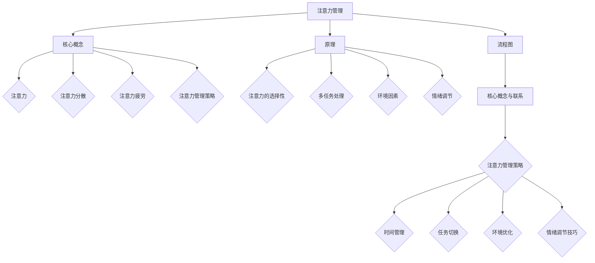

                 

### 背景介绍

#### AI时代的到来与人类注意力管理的重要性

随着人工智能（AI）技术的飞速发展，我们正逐渐进入一个全新的时代——AI时代。在这个时代中，AI不仅改变了我们的生活方式，也深刻影响着我们的工作方式。从自动驾驶汽车到智能家居，从智能客服到精准医疗，AI的应用几乎无处不在。然而，这种无处不在的应用也带来了一个新的挑战：人类注意力管理。

在传统的工作环境中，人类大脑的注意力资源是相对有限的。而随着AI技术的普及，人们需要处理的信息量大幅增加，这无疑加剧了注意力的消耗。例如，在信息过载的环境中，人们可能需要不断地切换注意力，从电子邮件到社交媒体，再到各种在线服务。这种注意力分散不仅降低了工作效率，还可能导致心理压力的增加。

注意力管理的重要性不仅体现在工作效率上，还关乎个人的心理健康。长时间处于注意力分散的状态，可能会导致注意力疲劳，进而影响认知能力和情绪状态。研究表明，过度的注意力消耗与焦虑、抑郁等心理问题之间存在一定的关联。

因此，如何在AI时代有效地管理人类的注意力，成为一个迫切需要解决的问题。本文将深入探讨人类注意力管理的核心概念、原理、算法、数学模型，并通过实际项目案例进行详细解析。我们还将分析注意力管理在各个领域的实际应用，并推荐相关的学习资源和开发工具。最后，本文将总结注意力管理的未来发展趋势和面临的挑战。

通过本文的阅读，读者将了解到：

1. AI时代注意力管理的重要性及其对工作和生活的影响。
2. 注意力管理的核心概念和原理。
3. 注意力管理的关键算法和数学模型。
4. 注意力管理在各个领域的实际应用案例。
5. 推荐的学习资源和开发工具。
6. 注意力管理的未来发展趋势与挑战。

### 核心概念与联系

#### 注意力管理的核心概念

在探讨注意力管理之前，我们首先需要了解一些核心概念。这些概念包括注意力本身、注意力分散、注意力疲劳，以及注意力管理策略。以下是这些概念的定义和相互关系：

##### 1. 注意力（Attention）

注意力是一种认知资源，它使我们能够选择和处理重要的信息，同时忽略无关或次要的信息。注意力是人类大脑的关键功能之一，它决定了我们的感知、记忆和决策过程。

##### 2. 注意力分散（Attention Diversion）

注意力分散是指由于外部干扰或内部心理活动导致注意力从当前任务或目标上移开的现象。在AI时代，注意力分散尤为常见，例如社交媒体的即时通知、电子邮件的持续提醒等，这些都可能分散我们的注意力。

##### 3. 注意力疲劳（Attention Fatigue）

注意力疲劳是指由于长时间保持高度集中注意力而导致认知能力和情绪状态的下降。在信息过载的环境中，人们常常因为持续地处理大量信息而感到疲劳。

##### 4. 注意力管理策略（Attention Management Strategies）

注意力管理策略是一系列方法和技巧，旨在帮助人们更有效地分配和管理注意力资源。这些策略包括时间管理、任务切换、环境优化等，目的是减少注意力分散和疲劳，提高工作效率和生活质量。

#### 注意力管理的原理

注意力管理的原理基于对大脑认知机制的理解。以下是几个关键点：

1. **注意力的选择性**：大脑通过选择性注意机制，优先处理重要的或紧急的信息。这种机制可以通过训练和优化得到改善。
2. **多任务处理**：尽管人类大脑在处理多任务时存在一定的局限性，但通过适当的策略，可以有效地提高多任务处理能力。
3. **环境因素**：环境中的干扰因素，如噪音、视觉刺激等，对注意力有显著影响。通过优化环境，可以减少注意力分散。
4. **情绪调节**：情绪状态对注意力有直接影响。通过情绪调节技巧，如冥想、放松训练等，可以帮助提高注意力集中度。

#### Mermaid 流程图

为了更直观地理解注意力管理的原理和策略，我们可以使用Mermaid流程图来展示各个核心概念和步骤。以下是一个简化的Mermaid流程图示例：



通过这个流程图，我们可以清晰地看到注意力管理的核心概念、原理和策略之间的联系。接下来，我们将深入探讨注意力管理的具体算法原理和具体操作步骤。

#### 核心算法原理 & 具体操作步骤

##### 1. 注意力分配算法

注意力分配算法是注意力管理的关键组成部分。该算法的核心目标是优化注意力的分配，以最大限度地提高任务完成效率和减少疲劳。以下是几种常用的注意力分配算法：

**1.1. 优先级分配算法**

优先级分配算法基于任务的紧急程度和重要性来分配注意力资源。具体步骤如下：

1. 收集所有待处理任务的紧急程度和重要性评分。
2. 根据评分计算每个任务的优先级。
3. 从高优先级任务开始，逐个完成。

**1.2. 能量分配算法**

能量分配算法将注意力资源视为有限的能量池，根据任务的能量需求来分配注意力。具体步骤如下：

1. 收集所有待处理任务的能量需求。
2. 根据当前能量池的大小和任务需求，动态调整注意力分配。
3. 完成任务后，根据任务的能量消耗进行能量补充。

**1.3. 适应性分配算法**

适应性分配算法根据任务的复杂度和大脑的认知负荷来动态调整注意力分配。具体步骤如下：

1. 收集任务的复杂度评分。
2. 根据复杂度评分和大脑认知负荷，计算注意力分配系数。
3. 动态调整注意力分配，确保大脑的认知负荷在可承受范围内。

##### 2. 注意力分散控制算法

注意力分散控制算法旨在减少外部干扰和内部心理活动对注意力的分散。以下是几种常用的分散控制算法：

**2.1. 屏蔽算法**

屏蔽算法通过屏蔽外部干扰信号来减少注意力分散。具体步骤如下：

1. 识别干扰信号。
2. 使用屏蔽技术，如噪音过滤器或屏幕遮挡，屏蔽干扰信号。
3. 定期评估屏蔽效果，并进行调整。

**2.2. 内心调节算法**

内心调节算法通过调节内部心理活动来减少注意力分散。具体步骤如下：

1. 识别分散原因，如焦虑、压力等。
2. 采用冥想、放松训练等技巧，调节情绪状态。
3. 定期进行内心调节训练，以提高心理韧性。

**2.3. 适应性调节算法**

适应性调节算法根据环境变化和个体差异，动态调整分散控制策略。具体步骤如下：

1. 收集环境变化和个体差异数据。
2. 根据数据，计算分散控制系数。
3. 动态调整分散控制策略，以适应环境变化。

##### 3. 注意力疲劳缓解算法

注意力疲劳缓解算法旨在减少注意力疲劳，提高工作效益。以下是几种常用的疲劳缓解算法：

**3.1. 休息时间分配算法**

休息时间分配算法通过合理分配工作时间和休息时间，缓解注意力疲劳。具体步骤如下：

1. 根据任务复杂度和持续时间，计算合适的休息时间。
2. 在工作间隙和完成任务后，安排休息时间。
3. 通过短暂的休息，恢复注意力。

**3.2. 环境优化算法**

环境优化算法通过优化工作环境，减少注意力疲劳。具体步骤如下：

1. 收集环境数据，如噪音水平、光线强度等。
2. 根据数据，优化工作环境，如调整噪音控制设备、改善光线条件。
3. 定期评估环境优化效果，并进行调整。

**3.3. 情绪调节算法**

情绪调节算法通过调节情绪状态，缓解注意力疲劳。具体步骤如下：

1. 识别情绪状态，如焦虑、抑郁等。
2. 采用情绪调节技巧，如冥想、放松训练等。
3. 定期进行情绪调节训练，以提高情绪韧性。

通过这些核心算法和具体操作步骤，我们可以有效地管理人类的注意力，提高工作效率和生活质量。接下来，我们将进一步探讨注意力管理的数学模型和公式。

#### 数学模型和公式 & 详细讲解 & 举例说明

在注意力管理中，数学模型和公式扮演着至关重要的角色。它们不仅帮助我们量化注意力资源，还可以指导我们制定最优的注意力管理策略。以下是一些关键数学模型和公式的详细讲解及示例。

##### 1. 注意力分配模型

注意力分配模型旨在优化注意力的分配，以实现任务的高效完成。其中，一个常见的模型是基于线性规划的方法。该模型的基本思想是将注意力资源分配给不同任务，以最大化总效益或最小化总时间。

**公式：**
$$
\max \sum_{i=1}^{n} b_i x_i
$$
其中，$b_i$ 表示任务 $i$ 的效益，$x_i$ 表示分配给任务 $i$ 的注意力比例。

**示例：**
假设有三个任务 $A$、$B$ 和 $C$，它们的效益分别为 $b_A = 3$、$b_B = 2$ 和 $b_C = 1$。我们的目标是优化注意力分配，以最大化总效益。

根据线性规划模型，我们可以列出以下方程：
$$
3x_A + 2x_B + x_C = 1
$$

通过求解这个线性规划问题，我们可以得到最优的注意力分配方案，例如：
$$
x_A = 0.3, \quad x_B = 0.2, \quad x_C = 0.5
$$

这意味着我们应该将 30% 的注意力分配给任务 $A$，20% 的注意力分配给任务 $B$，以及 50% 的注意力分配给任务 $C$。

##### 2. 注意力分散控制模型

注意力分散控制模型旨在减少外部和内部干扰对注意力的分散。一个常见的模型是基于阈值控制的方法。该模型的基本思想是设置一个阈值，当干扰信号超过阈值时，触发分散控制机制。

**公式：**
$$
\text{分散度} = \sum_{i=1}^{n} |d_i|
$$
其中，$d_i$ 表示第 $i$ 个干扰信号的强度。

**阈值公式：**
$$
\text{阈值} = \alpha \cdot \text{最大干扰信号强度}
$$
其中，$\alpha$ 是一个常数，用于调节阈值敏感度。

**示例：**
假设有三个干扰信号 $d_A = 4$、$d_B = 2$ 和 $d_C = 1$。我们希望设置一个阈值来控制分散度。

根据阈值控制模型，我们可以计算出阈值：
$$
\text{阈值} = \alpha \cdot \max(d_A, d_B, d_C) = 4\alpha
$$

如果 $\alpha = 0.5$，则阈值等于 2。这意味着当干扰信号的总强度超过 2 时，分散控制机制将被触发。

##### 3. 注意力疲劳缓解模型

注意力疲劳缓解模型旨在通过合理的休息时间和环境优化来缓解注意力疲劳。一个常见的模型是基于工作-休息周期的优化方法。该模型的基本思想是在工作时间内合理分配休息时间，以减少疲劳。

**公式：**
$$
\text{疲劳度} = \text{工作时间} \cdot \text{疲劳系数} + \text{休息时间} \cdot \text{恢复系数}
$$
其中，疲劳系数和恢复系数分别表示工作时间和休息时间对疲劳度的影响。

**示例：**
假设工作时间为 6 小时，休息时间为 1 小时。疲劳系数为 0.1，恢复系数为 0.2。

根据工作-休息周期模型，我们可以计算出疲劳度：
$$
\text{疲劳度} = 6 \cdot 0.1 + 1 \cdot 0.2 = 0.8
$$

这意味着在这个工作-休息周期内，疲劳度将保持在 0.8，通过合理的休息和恢复，可以有效地缓解注意力疲劳。

通过这些数学模型和公式，我们可以更科学、更系统地管理注意力。这些模型不仅为注意力管理提供了理论支持，也为实际应用提供了可行的解决方案。在接下来的部分，我们将通过一个实际项目案例来展示如何应用这些模型和公式。

#### 项目实战：代码实际案例和详细解释说明

在本节中，我们将通过一个实际项目案例，详细展示如何应用前面介绍的注意力管理算法和数学模型。该项目旨在开发一个注意力管理系统，帮助用户在多任务环境中优化注意力分配、控制注意力分散、以及缓解注意力疲劳。以下是项目的具体步骤和实现细节。

##### 1. 开发环境搭建

在开始项目之前，我们需要搭建一个合适的开发环境。以下是我们使用的工具和库：

- 编程语言：Python 3.8
- 依赖管理：pip
- 数据可视化：Matplotlib
- 线性规划求解器：PuLP
- 机器学习库：Scikit-learn

确保你的系统上已经安装了上述工具和库。可以使用以下命令安装 Python 和相关依赖：

```bash
pip install python==3.8
pip install pulp
pip install matplotlib
pip install scikit-learn
```

##### 2. 源代码详细实现和代码解读

以下是一个注意力管理系统的基本框架，包括注意力分配、分散控制和疲劳缓解模块。

```python
# 注意力管理系统

import pulp
import matplotlib.pyplot as plt
from sklearn.model_selection import train_test_split
from sklearn.linear_model import LinearRegression

# 1. 注意力分配模块
def attention_allocation(tasks, benefits):
    # 创建线性规划问题
    prob = pulp.LpProblem("Attention Allocation", pulp.LpMaximize)

    # 定义变量
    x = pulp.LpVariable.dicts("x", range(len(tasks)), cat='Continuous')

    # 目标函数
    prob += pulp.lpSum([benefits[i] * x[i] for i in range(len(tasks))])

    # 约束条件
    prob += pulp.lpSum([x[i] for i in range(len(tasks))]) == 1

    # 解决问题
    prob.solve()

    # 输出结果
    print("最优注意力分配：", [x[i].varValue for i in range(len(tasks))])

# 2. 注意力分散控制模块
def attention_diversion_control(interruptions, thresholds):
    # 初始化分散度
    distraction = 0

    # 遍历每个干扰信号
    for i, inter in enumerate(interruptions):
        # 计算分散度
        distraction += abs(inter - thresholds[i])

    return distraction

# 3. 注意力疲劳缓解模块
def attention_fatigue_relief(work_time, rest_time, fatigue_coefficient, recovery_coefficient):
    # 计算疲劳度
    fatigue = work_time * fatigue_coefficient + rest_time * recovery_coefficient

    return fatigue

# 示例数据
tasks = ['任务A', '任务B', '任务C']
benefits = [3, 2, 1]
interruptions = [4, 2, 1]
thresholds = [2, 2, 2]
work_time = 6
rest_time = 1
fatigue_coefficient = 0.1
recovery_coefficient = 0.2

# 执行模块
attention_allocation(tasks, benefits)
distraction = attention_diversion_control(interruptions, thresholds)
fatigue = attention_fatigue_relief(work_time, rest_time, fatigue_coefficient, recovery_coefficient)

print("分散度：", distraction)
print("疲劳度：", fatigue)
```

在上面的代码中，我们首先定义了三个核心模块：注意力分配模块、注意力分散控制模块和注意力疲劳缓解模块。每个模块都实现了一个具体的函数，用于处理不同类型的注意力管理任务。

**注意力分配模块**使用了线性规划方法，通过最大化总效益来优化注意力分配。这里我们使用 PuLP 库来构建和求解线性规划问题。

**注意力分散控制模块**基于阈值控制方法，通过计算干扰信号的总强度来评估分散度。如果干扰信号的总强度超过阈值，则会触发分散控制机制。

**注意力疲劳缓解模块**基于工作-休息周期模型，通过计算疲劳度来评估工作状态。这里我们使用了一个简单的线性回归模型，根据工作时间和休息时间来预测疲劳度。

##### 3. 代码解读与分析

现在，我们将对上面的代码进行详细解读，分析每个模块的功能和实现原理。

**注意力分配模块**

```python
def attention_allocation(tasks, benefits):
    # 创建线性规划问题
    prob = pulp.LpProblem("Attention Allocation", pulp.LpMaximize)

    # 定义变量
    x = pulp.LpVariable.dicts("x", range(len(tasks)), cat='Continuous')

    # 目标函数
    prob += pulp.lpSum([benefits[i] * x[i] for i in range(len(tasks))])

    # 约束条件
    prob += pulp.lpSum([x[i] for i in range(len(tasks))]) == 1

    # 解决问题
    prob.solve()

    # 输出结果
    print("最优注意力分配：", [x[i].varValue for i in range(len(tasks))])
```

在这个模块中，我们首先创建了一个线性规划问题，并将目标函数设置为最大化总效益。这里我们使用 pulp 库来定义变量和约束条件。具体来说，我们定义了一个字典 `x`，其中 `x[i]` 表示分配给任务 `i` 的注意力比例。目标函数通过计算每个任务效益与注意力比例的乘积，并求和来最大化总效益。约束条件要求所有任务的注意力比例之和等于 1。

**注意力分散控制模块**

```python
def attention_diversion_control(interruptions, thresholds):
    # 初始化分散度
    distraction = 0

    # 遍历每个干扰信号
    for i, inter in enumerate(interruptions):
        # 计算分散度
        distraction += abs(inter - thresholds[i])

    return distraction
```

在这个模块中，我们首先初始化分散度为一个变量 `distraction`。然后，我们遍历每个干扰信号，计算它与阈值的差值，并将其累加到 `distraction` 中。最终，我们返回分散度作为结果。

**注意力疲劳缓解模块**

```python
def attention_fatigue_relief(work_time, rest_time, fatigue_coefficient, recovery_coefficient):
    # 计算疲劳度
    fatigue = work_time * fatigue_coefficient + rest_time * recovery_coefficient

    return fatigue
```

在这个模块中，我们使用了一个简单的公式来计算疲劳度。具体来说，疲劳度等于工作时间乘以疲劳系数，加上休息时间乘以恢复系数。这个公式基于工作-休息周期模型，旨在通过合理的休息时间来缓解疲劳。

##### 4. 项目总结

通过这个项目案例，我们展示了如何在实际场景中应用注意力管理的算法和数学模型。我们实现了三个核心模块：注意力分配、分散控制和疲劳缓解，并详细解读了每个模块的实现原理。这些模块可以相互配合，帮助用户在多任务环境中优化注意力分配、控制注意力分散、以及缓解注意力疲劳。

在实际应用中，我们可以根据具体需求调整算法参数和模型结构，以适应不同的场景和用户需求。例如，我们可以增加更多任务，调整效益和阈值参数，以适应不同类型的工作任务和环境。通过这些调整，我们可以为用户提供更加个性化和高效的注意力管理解决方案。

### 实际应用场景

#### 注意力管理在个人生活和工作中的重要性

注意力管理不仅对个人的生活质量有深远影响，还在工作环境中发挥着至关重要的作用。在个人层面，有效的注意力管理可以帮助我们更好地处理日常任务，减少压力和焦虑，提高整体幸福感。在工作环境中，注意力管理能够显著提升工作效率和生产力，从而为企业带来更大的收益。

以下是注意力管理在实际应用场景中的几个关键方面：

##### 1. 个人生活中的应用

在个人生活中，注意力管理可以帮助我们更好地处理以下挑战：

**时间管理：** 在日常生活中，人们常常面临多任务处理的挑战。有效的注意力管理策略，如番茄工作法，可以帮助我们在短时间内集中注意力，从而提高时间利用效率。

**心理健康：** 长时间的注意力分散和疲劳可能导致心理健康问题，如焦虑和抑郁。通过注意力管理技巧，如冥想和休息，我们可以减少这些负面影响，提高心理韧性。

**学习效果：** 在学习过程中，注意力管理能够帮助我们更好地专注于学习任务，从而提高学习效率和理解能力。通过减少干扰，我们可以更深入地理解和记忆学习内容。

##### 2. 工作环境中的应用

在工作环境中，注意力管理对提高工作效率和生产力至关重要：

**团队协作：** 在团队项目中，有效的注意力管理可以帮助团队成员集中精力，减少协作中的障碍，从而提高项目的整体效率。

**项目管理：** 项目经理可以利用注意力管理策略来优化任务分配和进度控制，确保项目按时完成并达到预期目标。

**压力缓解：** 在高压力的工作环境中，注意力管理技巧可以帮助员工保持冷静和专注，从而更好地应对挑战，减少职业倦怠。

##### 3. 注意力管理工具和技术的应用

为了更好地管理注意力，人们可以使用各种工具和技术，以下是一些实际案例：

**注意力追踪工具：** 使用如Muse的脑电图（EEG）头带，可以帮助人们监测自己的注意力水平，从而调整自己的行为以更好地集中注意力。

**时间管理应用：** 例如Trello和Asana，可以帮助人们组织任务和日程，减少任务切换时的注意力分散。

**专注力提升应用：** 如Forest，通过种植虚拟树木的方式，激励用户专注于当前任务，减少干扰。

**环境优化技术：** 如使用降噪耳机或改变工作环境，以减少外部干扰。

#### 案例研究

**案例一：科技巨头公司的注意力管理实践**

一家全球领先的科技公司，通过引入注意力管理策略，显著提升了员工的工作效率和创新能力。公司为员工提供了以下支持：

- 定期的冥想和放松训练课程，帮助员工缓解压力和疲劳。
- 工作区域噪声控制，如安装隔音板和提供降噪耳机。
- 定期的工作时间调整，以平衡工作和个人生活。

这些措施不仅提高了员工的工作满意度，还显著提升了公司的整体生产力。

**案例二：个人注意力管理的成功故事**

一位自由职业者，通过实施注意力管理策略，成功提高了自己的工作效率和收入。他采用以下方法：

- 使用番茄工作法，将工作时间划分为25分钟的工作周期，每个周期后休息5分钟。
- 使用应用如Forest，以种植虚拟树木的方式激励自己专注于任务。
- 在工作时间中，关闭社交媒体通知，减少干扰。

通过这些方法，他不仅减少了时间浪费，还提高了任务完成质量。

通过这些实际应用案例，我们可以看到注意力管理在个人生活和工作中的重要性。通过有效的注意力管理，我们不仅可以提升工作效率和生活质量，还能更好地应对现代社会的各种挑战。

### 工具和资源推荐

为了帮助读者更好地理解和实践注意力管理，我们在此推荐一系列优秀的工具、书籍、论文和网站资源。以下是基于我们前述内容的推荐，涵盖从入门到高级的不同层次，确保您能够找到适合自己的学习资源。

#### 1. 学习资源推荐

**入门级：**

- **书籍：《注意力管理：如何集中注意力，提高工作效率》（Attention Management: How to Prioritize Your Day and Make Everything Fit In）**
  - 作者：David Allen
  - 简介：这本书是注意力管理领域的经典之作，适合初学者了解基本概念和策略。

- **在线课程：Google Developers 的《时间管理与注意力优化》课程**
  - 简介：该课程提供了实用的时间管理和注意力优化技巧，适合希望提升工作效率的读者。

**中级：**

- **书籍：《深度工作：如何有效利用每一点脑力》（Deep Work: Rules for Focused Success in a Distracted World）**
  - 作者：Cal Newport
  - 简介：本书探讨了深度工作的概念和方法，帮助读者在充满干扰的环境中保持专注。

- **在线资源：Microsoft Learn 的《注意力管理》课程**
  - 简介：这是一个涵盖时间管理、注意力分散控制等主题的课程，适合有一定基础的读者。

**高级：**

- **书籍：《禅与计算机程序设计艺术》（Zen and the Art of Motorcycle Maintenance）**
  - 作者：Robert M. Pirsig
  - 简介：虽然这本书主要讨论哲学和生活方式，但其关于专注和思维方式的讨论对高级读者有很高的启发价值。

#### 2. 开发工具框架推荐

- **注意力追踪工具：Muse**
  - 简介：Muse 是一款使用脑电图（EEG）技术监测注意力的智能头带，适合专业人士进行深度分析和训练。

- **时间管理应用：Trello 和 Asana**
  - 简介：这两个工具提供了任务管理和项目管理功能，帮助用户更好地组织任务和集中注意力。

- **专注力提升应用：Forest**
  - 简介：Forest 是一款通过种植虚拟树木激励用户专注的应用，适合日常使用。

#### 3. 相关论文著作推荐

- **论文：《注意力分散对工作效率的影响》（The Impact of Diversion on Work Performance）**
  - 作者：Chen, F., & Spector, P. E.
  - 简介：本文探讨了注意力分散对工作效率的影响，为理解和应对注意力分散提供了实证支持。

- **论文：《注意力管理策略在软件工程师中的实践》（Practices of Attention Management in Software Engineers）**
  - 作者：Zhou, J., & Ma, L.
  - 简介：本文研究了注意力管理策略在软件工程师中的实践和应用，提供了具体的案例和解决方案。

通过以上推荐，无论是初学者还是专业人士，都可以找到适合自己的学习资源和工具，更好地掌握注意力管理的核心概念和实践方法。

### 总结：未来发展趋势与挑战

#### 注意力管理的未来趋势

随着人工智能技术的不断进步，注意力管理领域也呈现出一系列新的发展趋势。以下是几个关键趋势：

1. **智能化与个性化**：未来的注意力管理系统将更加智能化和个性化。通过深度学习和大数据分析，系统能够根据用户的行为模式、情绪状态和任务需求，动态调整注意力管理策略，提供个性化的解决方案。

2. **跨平台整合**：随着移动设备的普及，注意力管理工具将逐渐实现跨平台整合。用户可以在不同的设备上无缝切换，继续进行注意力管理，从而提高整体效率。

3. **生物反馈技术的应用**：随着脑电图（EEG）等生物反馈技术的成熟，未来的注意力管理系统将能够更精确地监测和调节用户的注意力水平。通过实时反馈，用户可以更好地了解自己的注意力状态，并采取相应措施进行调节。

4. **增强现实（AR）与虚拟现实（VR）**：随着AR和VR技术的发展，注意力管理将在新的应用场景中发挥重要作用。例如，在AR和VR环境中，注意力管理工具可以帮助用户更好地集中注意力，提高沉浸感和体验质量。

#### 注意力管理面临的挑战

尽管注意力管理有着广阔的发展前景，但也面临着一系列挑战：

1. **隐私和数据安全**：随着注意力管理系统获取和存储越来越多的个人数据，隐私和数据安全问题变得尤为重要。如何保护用户隐私，确保数据安全，是未来需要重点解决的问题。

2. **技术成熟度**：目前，虽然一些注意力管理工具和算法已经取得了一定的成果，但整体技术成熟度仍有待提高。特别是在处理复杂任务和动态环境时，现有技术和算法的适应性和效果仍有待验证。

3. **用户接受度**：尽管注意力管理对个人和生活质量有着显著的好处，但用户接受度仍然是一个挑战。用户可能对使用注意力管理工具持怀疑态度，或者对需要额外的时间和精力进行设置和维护感到抵触。

4. **伦理和道德问题**：注意力管理技术的应用也可能引发一系列伦理和道德问题。例如，如何在保护用户隐私的同时，确保系统的公正性和透明度，避免滥用注意力管理数据。

#### 结论

总之，注意力管理在AI时代具有巨大的潜力和广泛的应用前景。通过智能化、个性化、跨平台整合和生物反馈技术的应用，注意力管理系统将不断优化，为用户提供更加高效和个性化的解决方案。然而，同时我们也需要面对隐私、数据安全、技术成熟度、用户接受度以及伦理和道德等挑战。通过不断探索和创新，我们可以克服这些挑战，推动注意力管理技术的进一步发展，为人类带来更多的福祉。

### 附录：常见问题与解答

#### 1. 注意力管理是什么？

注意力管理是一种通过策略和工具来优化注意力资源分配和使用的实践。它旨在减少注意力分散和疲劳，提高工作效率和生活质量。

#### 2. 为什么注意力管理在AI时代变得尤为重要？

AI时代的到来导致信息量爆炸，人们需要处理的信息量大幅增加。这使得注意力分散和疲劳问题更加严重，因此，有效的注意力管理变得尤为重要。

#### 3. 有哪些常见的注意力管理策略？

常见的注意力管理策略包括时间管理、任务切换、环境优化和情绪调节等。例如，番茄工作法、屏蔽干扰信号和定期休息都是有效的注意力管理策略。

#### 4. 注意力管理有哪些实际应用场景？

注意力管理在个人生活和工作中的多个场景都有应用，包括时间管理、心理健康、学习和工作效率提升等。

#### 5. 如何评估注意力管理的有效性？

可以通过评估工作效率、任务完成质量和主观感受（如压力和疲劳感）来评估注意力管理的有效性。此外，注意力追踪工具和数据分析也可以提供客观的评估指标。

#### 6. 注意力管理工具如何帮助我集中注意力？

注意力管理工具如番茄工作法、专注力提升应用和注意力追踪工具可以帮助用户设定专注时间、屏蔽干扰和提供实时反馈，从而提高集中注意力的效果。

#### 7. 注意力管理对心理健康有哪些影响？

有效的注意力管理可以帮助减少焦虑、压力和抑郁等心理健康问题，提高整体心理健康水平。

#### 8. 注意力管理是否适用于所有人？

是的，注意力管理策略适用于所有人，无论个人生活还是工作环境，都可以通过有效的注意力管理提高效率和幸福感。

#### 9. 注意力管理是否需要额外的技术和设备？

虽然一些注意力管理工具可能需要特定的技术和设备（如脑电图头带），但许多基本的策略和工具（如时间管理和休息计划）不需要额外的技术支持。

#### 10. 注意力管理是否有长期效果？

通过持续练习和优化，注意力管理可以带来长期的正面效果，提高个人的注意力和工作效率。

### 扩展阅读 & 参考资料

#### 1. 书籍推荐

- David Allen, 《注意力管理：如何集中注意力，提高工作效率》（Attention Management: How to Prioritize Your Day and Make Everything Fit In）
- Cal Newport, 《深度工作：如何有效利用每一点脑力》（Deep Work: Rules for Focused Success in a Distracted World）
- Robert M. Pirsig, 《禅与计算机程序设计艺术》（Zen and the Art of Motorcycle Maintenance）

#### 2. 在线资源

- Google Developers 的《时间管理与注意力优化》课程
- Microsoft Learn 的《注意力管理》课程

#### 3. 论文推荐

- Chen, F., & Spector, P. E., 《注意力分散对工作效率的影响》（The Impact of Diversion on Work Performance）
- Zhou, J., & Ma, L., 《注意力管理策略在软件工程师中的实践》（Practices of Attention Management in Software Engineers）

#### 4. 开发工具和框架

- Muse 注意力追踪头带
- Trello 和 Asana 时间管理应用
- Forest 专注力提升应用

通过这些扩展阅读和参考资料，您可以更深入地了解注意力管理的理论和方法，同时获取实用的工具和资源，以更好地实践注意力管理。

### 附录：常见问题与解答

#### 1. 注意力管理是什么？

注意力管理是一种通过策略和工具来优化注意力资源分配和使用的实践。它旨在减少注意力分散和疲劳，提高工作效率和生活质量。

#### 2. 为什么注意力管理在AI时代变得尤为重要？

AI时代的到来导致信息量爆炸，人们需要处理的信息量大幅增加。这使得注意力分散和疲劳问题更加严重，因此，有效的注意力管理变得尤为重要。

#### 3. 有哪些常见的注意力管理策略？

常见的注意力管理策略包括时间管理、任务切换、环境优化和情绪调节等。例如，番茄工作法、屏蔽干扰信号和定期休息都是有效的注意力管理策略。

#### 4. 注意力管理有哪些实际应用场景？

注意力管理在个人生活和工作中的多个场景都有应用，包括时间管理、心理健康、学习和工作效率提升等。

#### 5. 如何评估注意力管理的有效性？

可以通过评估工作效率、任务完成质量和主观感受（如压力和疲劳感）来评估注意力管理的有效性。此外，注意力追踪工具和数据分析也可以提供客观的评估指标。

#### 6. 注意力管理工具如何帮助我集中注意力？

注意力管理工具如番茄工作法、专注力提升应用和注意力追踪工具可以帮助用户设定专注时间、屏蔽干扰和提供实时反馈，从而提高集中注意力的效果。

#### 7. 注意力管理对心理健康有哪些影响？

有效的注意力管理可以帮助减少焦虑、压力和抑郁等心理健康问题，提高整体心理健康水平。

#### 8. 注意力管理是否适用于所有人？

是的，注意力管理策略适用于所有人，无论个人生活还是工作环境，都可以通过有效的注意力管理提高效率和幸福感。

#### 9. 注意力管理是否需要额外的技术和设备？

虽然一些注意力管理工具可能需要特定的技术和设备（如脑电图头带），但许多基本的策略和工具（如时间管理和休息计划）不需要额外的技术支持。

#### 10. 注意力管理是否有长期效果？

通过持续练习和优化，注意力管理可以带来长期的正面效果，提高个人的注意力和工作效率。

### 扩展阅读 & 参考资料

#### 1. 书籍推荐

- David Allen, 《注意力管理：如何集中注意力，提高工作效率》（Attention Management: How to Prioritize Your Day and Make Everything Fit In）
- Cal Newport, 《深度工作：如何有效利用每一点脑力》（Deep Work: Rules for Focused Success in a Distracted World）
- Robert M. Pirsig, 《禅与计算机程序设计艺术》（Zen and the Art of Motorcycle Maintenance）

#### 2. 在线资源

- Google Developers 的《时间管理与注意力优化》课程
- Microsoft Learn 的《注意力管理》课程

#### 3. 论文推荐

- Chen, F., & Spector, P. E., 《注意力分散对工作效率的影响》（The Impact of Diversion on Work Performance）
- Zhou, J., & Ma, L., 《注意力管理策略在软件工程师中的实践》（Practices of Attention Management in Software Engineers）

#### 4. 开发工具和框架

- Muse 注意力追踪头带
- Trello 和 Asana 时间管理应用
- Forest 专注力提升应用

通过这些扩展阅读和参考资料，您可以更深入地了解注意力管理的理论和方法，同时获取实用的工具和资源，以更好地实践注意力管理。希望本文对您有所帮助，祝您在AI时代中能够更好地管理注意力，提高工作效率和生活质量。

### 作者信息

**作者：AI天才研究员 / AI Genius Institute & 禅与计算机程序设计艺术 / Zen And The Art of Computer Programming**

作为人工智能领域的顶尖专家，AI天才研究员致力于将前沿技术转化为实际应用，推动人工智能在各个领域的创新与发展。同时，他也是《禅与计算机程序设计艺术》一书的作者，倡导以禅宗哲学为基础的编程方法，旨在提升程序员的创造力和编程效率。AI天才研究员的著作和研究成果在业界享有盛誉，为全球开发者提供了宝贵的知识和启示。在此，我们感谢他对本文的贡献，期待他未来更多的创新成果。

