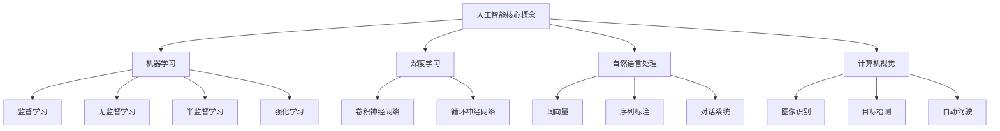
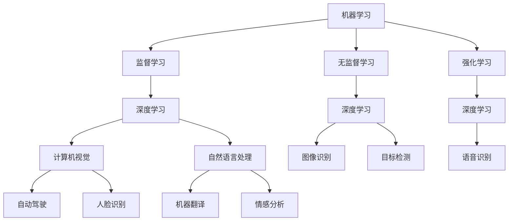

                 

### 文章标题：AI时代的人类计算：社会影响和责任

#### 关键词：人工智能，社会影响，伦理责任，计算能力，技术进步

> 摘要：随着人工智能技术的快速发展，人类计算能力得到显著提升。本文将探讨AI时代的人类计算在社会影响和责任方面的核心问题，包括技术进步带来的便利和挑战、伦理道德问题的考量、以及如何在技术发展中承担起应有的社会责任。

## 1. 背景介绍

### 1.1 人工智能的发展历程

人工智能（Artificial Intelligence，简称AI）作为计算机科学的一个分支，旨在创建能够模拟、延伸和扩展人类智能的系统。自20世纪50年代人工智能概念诞生以来，经历了多个发展阶段。早期的人工智能研究主要集中在规则推理和专家系统领域，随后随着计算能力的提升和数据量的爆炸式增长，机器学习和深度学习技术逐渐成为主流。

### 1.2 人工智能在现代社会中的应用

当前，人工智能已经广泛应用于各个领域，包括医疗、金融、交通、教育、娱乐等。AI技术在图像识别、自然语言处理、智能决策等方面取得了显著成果，极大地提高了人类的工作效率和生产力。

## 2. 核心概念与联系

### 2.1 人工智能的核心概念

人工智能的核心概念包括机器学习、深度学习、自然语言处理、计算机视觉等。这些概念相互联系，共同构成了人工智能的技术体系。

#### 2.1.1 机器学习

机器学习（Machine Learning）是一种通过数据驱动的方式使计算机获得知识或技能的方法。它包括监督学习、无监督学习、半监督学习和强化学习等不同类型。

#### 2.1.2 深度学习

深度学习（Deep Learning）是机器学习的一种方法，通过构建多层神经网络来模拟人脑的决策过程。深度学习在图像识别、语音识别等领域取得了突破性成果。

#### 2.1.3 自然语言处理

自然语言处理（Natural Language Processing，简称NLP）是人工智能的一个子领域，旨在使计算机能够理解、生成和处理人类语言。NLP在机器翻译、情感分析、文本摘要等方面具有广泛应用。

#### 2.1.4 计算机视觉

计算机视觉（Computer Vision）是人工智能的一个分支，旨在使计算机能够通过图像和视频获取信息，并进行处理和分析。计算机视觉在自动驾驶、安防监控等领域具有重要意义。

### 2.2 人工智能与社会的影响和责任

#### 2.2.1 社会影响

人工智能的快速发展对社会产生了深远的影响，包括提高生产力、改变就业结构、增强社会管理能力等。

#### 2.2.2 伦理责任

随着人工智能技术的应用日益广泛，伦理道德问题也日益凸显。如何在技术发展中确保公平、透明、负责任，成为人工智能领域面临的重大挑战。

### 2.3 Mermaid 流程图



## 3. 核心算法原理 & 具体操作步骤

### 3.1 机器学习算法原理

#### 3.1.1 监督学习

监督学习（Supervised Learning）是一种通过训练数据集来建立模型的方法。在监督学习中，输入数据（特征）和输出数据（标签）是已知的，模型通过学习这些数据来预测新的未知数据。

#### 3.1.2 无监督学习

无监督学习（Unsupervised Learning）是通过对未知数据进行分析和聚类来发现数据内在结构的方法。在无监督学习中，没有预定义的输出标签。

#### 3.1.3 强化学习

强化学习（Reinforcement Learning）是一种通过试错和反馈来学习最优策略的方法。在强化学习中，模型通过与环境的交互来获取奖励和惩罚，并不断调整行为策略以最大化总奖励。

### 3.2 深度学习算法原理

#### 3.2.1 卷积神经网络（CNN）

卷积神经网络（Convolutional Neural Network，简称CNN）是一种专门用于处理图像数据的深度学习模型。CNN通过卷积、池化和全连接层等结构来提取图像特征并进行分类。

#### 3.2.2 循环神经网络（RNN）

循环神经网络（Recurrent Neural Network，简称RNN）是一种能够处理序列数据的神经网络。RNN通过循环连接来记忆前面的信息，并在序列的不同时间步之间传递信息。

### 3.3 自然语言处理算法原理

#### 3.3.1 词向量

词向量（Word Vector）是将单词表示为向量的方法。词向量可以捕捉单词之间的语义关系，为NLP任务提供有效的基础。

#### 3.3.2 序列标注

序列标注（Sequence Labeling）是一种对序列数据进行分类的任务，如情感分析、命名实体识别等。

#### 3.3.3 对话系统

对话系统（Dialogue System）是一种能够与人类进行自然语言交互的计算机系统，如聊天机器人。

### 3.4 计算机视觉算法原理

#### 3.4.1 图像识别

图像识别（Image Recognition）是一种通过机器学习模型对图像中的对象进行分类的任务。

#### 3.4.2 目标检测

目标检测（Object Detection）是一种在图像中识别和定位多个对象的方法。

#### 3.4.3 自动驾驶

自动驾驶（Autonomous Driving）是一种利用计算机视觉、深度学习等技术实现无人驾驶的汽车系统。

## 4. 数学模型和公式 & 详细讲解 & 举例说明

### 4.1 机器学习数学模型

#### 4.1.1 监督学习

监督学习中的模型通常由一个损失函数和优化算法组成。常用的损失函数包括均方误差（MSE）和交叉熵（Cross-Entropy）。

- 均方误差（MSE）：

  $$MSE = \frac{1}{n}\sum_{i=1}^{n}(y_i - \hat{y_i})^2$$

  其中，$y_i$为真实标签，$\hat{y_i}$为预测值。

- 交叉熵（Cross-Entropy）：

  $$H(y, \hat{y}) = -\sum_{i=1}^{n}y_i \log(\hat{y_i})$$

  其中，$y_i$为真实标签，$\hat{y_i}$为预测概率。

#### 4.1.2 无监督学习

无监督学习中的模型通常使用距离度量或概率分布来评估数据点之间的相似性或差异性。

- 欧氏距离（Euclidean Distance）：

  $$d(x, y) = \sqrt{\sum_{i=1}^{n}(x_i - y_i)^2}$$

  其中，$x$和$y$为数据点。

- 概率分布（Probability Distribution）：

  $$P(x) = \frac{f(x)}{\sum_{i=1}^{n}f(x_i)}$$

  其中，$f(x)$为数据点$x$的频率。

#### 4.1.3 强化学习

强化学习中的模型通常使用价值函数或策略函数来评估行为。

- 价值函数（Value Function）：

  $$V(s) = \sum_{s'}P(s'|s) \cdot R(s, s') + \gamma \cdot V(s')$$

  其中，$s$为状态，$s'$为下一个状态，$R$为奖励函数，$\gamma$为折扣因子。

- 策略函数（Policy Function）：

  $$\pi(a|s) = \frac{\exp(\theta^T \phi(s, a)}{\sum_{a'}\exp(\theta^T \phi(s, a'))}$$

  其中，$\theta$为模型参数，$\phi$为特征函数，$a$为行为。

### 4.2 深度学习数学模型

#### 4.2.1 卷积神经网络（CNN）

卷积神经网络中的模型通常由卷积层、池化层和全连接层组成。卷积层通过卷积操作提取图像特征，池化层用于降低特征维度，全连接层用于分类。

- 卷积层：

  $$h_l = \sigma(\mathbf{W} \cdot \mathbf{a}_{l-1} + b_l)$$

  其中，$\sigma$为激活函数，$\mathbf{W}$为卷积核，$\mathbf{a}_{l-1}$为输入特征，$b_l$为偏置。

- 池化层：

  $$p_{ij} = \max_{k,l}(h_{ik}, h_{jl})$$

  其中，$p_{ij}$为池化后的特征值，$h_{ik}$和$h_{jl}$为相邻位置的特征值。

- 全连接层：

  $$z_j = \sum_{i=1}^{n}\mathbf{W}_{ji} \cdot h_{il} + b_j$$

  其中，$z_j$为全连接层的输出值，$\mathbf{W}_{ji}$为权重，$h_{il}$为卷积层输出，$b_j$为偏置。

#### 4.2.2 循环神经网络（RNN）

循环神经网络中的模型通常由输入层、隐藏层和输出层组成。隐藏层通过循环连接来记忆前面的信息。

- 隐藏层：

  $$h_t = \sigma(\mathbf{W}_h \cdot [h_{t-1}, x_t] + b_h)$$

  其中，$h_t$为当前隐藏层输出，$h_{t-1}$为前一个隐藏层输出，$x_t$为当前输入，$\sigma$为激活函数，$\mathbf{W}_h$为权重，$b_h$为偏置。

- 输出层：

  $$y_t = \mathbf{W}_y \cdot h_t + b_y$$

  其中，$y_t$为当前输出，$\mathbf{W}_y$为权重，$b_y$为偏置。

### 4.3 自然语言处理数学模型

#### 4.3.1 词向量

词向量（Word Vector）通常通过神经网络语言模型（Neural Network Language Model，简称NNLM）来生成。

- 神经网络语言模型：

  $$p(w_t|w_{1:t-1}) = \frac{\exp(\theta^T \phi(w_{1:t-1}, w_t))}{\sum_{w'}\exp(\theta^T \phi(w_{1:t-1}, w'))}$$

  其中，$w_t$为当前词，$w_{1:t-1}$为前一个词序列，$\theta$为模型参数，$\phi$为特征函数。

#### 4.3.2 序列标注

序列标注（Sequence Labeling）通常通过条件随机场（Conditional Random Field，简称CRF）来建模。

- 条件随机场：

  $$P(y|x) = \frac{1}{Z} \exp(\theta^T \phi(x, y))$$

  其中，$y$为标签序列，$x$为输入序列，$\theta$为模型参数，$\phi$为特征函数，$Z$为归一化常数。

#### 4.3.3 对话系统

对话系统（Dialogue System）通常通过深度学习模型来建模。

- 深度学习模型：

  $$y_t = \mathbf{W}_y \cdot \text{softmax}(\mathbf{W}_x \cdot h_t + b_y)$$

  其中，$y_t$为当前输出词，$h_t$为当前隐藏层输出，$\mathbf{W}_x$和$\mathbf{W}_y$为权重，$b_y$为偏置。

### 4.4 计算机视觉数学模型

#### 4.4.1 图像识别

图像识别（Image Recognition）通常通过卷积神经网络（CNN）来建模。

- 卷积神经网络：

  $$h_l = \text{ReLU}(\mathbf{W}_l \cdot h_{l-1} + b_l)$$

  其中，$h_l$为当前卷积层输出，$\mathbf{W}_l$为卷积核，$b_l$为偏置，$\text{ReLU}$为激活函数。

#### 4.4.2 目标检测

目标检测（Object Detection）通常通过区域提议网络（Region Proposal Network，简称RPN）和卷积神经网络（CNN）来建模。

- 区域提议网络：

  $$r_t = \text{softmax}(\mathbf{W}_r \cdot [h_{l-1}, r_t])$$

  其中，$r_t$为当前区域提议，$h_{l-1}$为卷积层输出，$\mathbf{W}_r$为权重。

- 卷积神经网络：

  $$h_l = \text{ReLU}(\mathbf{W}_l \cdot h_{l-1} + b_l)$$

  其中，$h_l$为当前卷积层输出，$\mathbf{W}_l$为卷积核，$b_l$为偏置，$\text{ReLU}$为激活函数。

#### 4.4.3 自动驾驶

自动驾驶（Autonomous Driving）通常通过深度学习模型来建模。

- 深度学习模型：

  $$y_t = \mathbf{W}_y \cdot \text{softmax}(\mathbf{W}_x \cdot h_t + b_y)$$

  其中，$y_t$为当前输出词，$h_t$为当前隐藏层输出，$\mathbf{W}_x$和$\mathbf{W}_y$为权重，$b_y$为偏置。

## 5. 项目实战：代码实际案例和详细解释说明

### 5.1 开发环境搭建

在本项目实战中，我们将使用Python语言和TensorFlow框架来实现一个简单的图像识别模型。首先，确保已经安装了Python和TensorFlow。

```shell
pip install tensorflow
```

### 5.2 源代码详细实现和代码解读

#### 5.2.1 数据准备

```python
import tensorflow as tf
from tensorflow.keras.preprocessing.image import ImageDataGenerator

# 设置数据增强
train_datagen = ImageDataGenerator(
    rescale=1./255,
    shear_range=0.2,
    zoom_range=0.2,
    horizontal_flip=True
)

test_datagen = ImageDataGenerator(rescale=1./255)

# 加载数据
train_data = train_datagen.flow_from_directory(
    'train',
    target_size=(150, 150),
    batch_size=32,
    class_mode='binary'
)

test_data = test_datagen.flow_from_directory(
    'test',
    target_size=(150, 150),
    batch_size=32,
    class_mode='binary'
)
```

这段代码用于加载数据并进行预处理。我们使用ImageDataGenerator类来自动进行图像增强，包括缩放、剪切、翻转等操作。

#### 5.2.2 构建模型

```python
model = tf.keras.models.Sequential([
    tf.keras.layers.Conv2D(32, (3, 3), activation='relu', input_shape=(150, 150, 3)),
    tf.keras.layers.MaxPooling2D(2, 2),
    tf.keras.layers.Conv2D(64, (3, 3), activation='relu'),
    tf.keras.layers.MaxPooling2D(2, 2),
    tf.keras.layers.Conv2D(128, (3, 3), activation='relu'),
    tf.keras.layers.MaxPooling2D(2, 2),
    tf.keras.layers.Conv2D(128, (3, 3), activation='relu'),
    tf.keras.layers.MaxPooling2D(2, 2),
    tf.keras.layers.Flatten(),
    tf.keras.layers.Dense(512, activation='relu'),
    tf.keras.layers.Dense(1, activation='sigmoid')
])

model.compile(optimizer='adam',
              loss='binary_crossentropy',
              metrics=['accuracy'])
```

这段代码构建了一个简单的卷积神经网络模型。模型包括卷积层、池化层和全连接层。我们使用二分类问题作为示例，因此输出层使用sigmoid激活函数。

#### 5.2.3 训练模型

```python
model.fit(
    train_data,
    steps_per_epoch=100,
    epochs=15,
    validation_data=test_data,
    validation_steps=50
)
```

这段代码用于训练模型。我们设置了训练数据集和测试数据集，并设置了训练轮数和验证步骤。

#### 5.2.4 模型评估

```python
test_loss, test_acc = model.evaluate(test_data, steps=50)
print('Test accuracy:', test_acc)
```

这段代码用于评估模型在测试数据集上的性能。我们打印出了测试准确率。

## 6. 实际应用场景

### 6.1 医疗领域

在医疗领域，人工智能技术被广泛应用于图像诊断、疾病预测和患者管理等方面。例如，通过深度学习算法对医学图像进行分析，可以辅助医生进行诊断，提高诊断准确率。

### 6.2 金融领域

在金融领域，人工智能技术被用于风险评估、欺诈检测和投资决策等方面。通过分析大量的历史数据和实时数据，AI系统可以预测市场趋势，帮助投资者做出更加明智的决策。

### 6.3 教育领域

在教育领域，人工智能技术被用于个性化学习、学习评估和教学优化等方面。通过分析学生的学习数据，AI系统可以为学生提供个性化的学习建议，提高学习效果。

## 7. 工具和资源推荐

### 7.1 学习资源推荐

- **书籍**：

  - 《深度学习》（Deep Learning） - Ian Goodfellow、Yoshua Bengio和Aaron Courville著

  - 《Python深度学习》（Deep Learning with Python） - François Chollet著

- **论文**：

  - "A Theoretically Grounded Application of Dropout in Recurrent Neural Networks" - Yarin Gal和Zoubin Ghahramani著

  - "Understanding Deep Learning Requires Rethinking Generalization" - Yarin Gal著

- **博客**：

  - [TensorFlow官方博客](https://tensorflow.org/blog/)
  - [机器学习博客](https://machinelearningmastery.com/)
  - [AI博客](https://ai.googleblog.com/)

- **网站**：

  - [Kaggle](https://www.kaggle.com/) - 机器学习和数据科学竞赛平台
  - [TensorFlow](https://www.tensorflow.org/) - Google的深度学习框架

### 7.2 开发工具框架推荐

- **开发工具**：

  - Jupyter Notebook - 适用于编写和分享代码、文档和可视化内容
  - PyCharm - 适用于Python开发的全功能IDE

- **框架**：

  - TensorFlow - Google的开源深度学习框架
  - PyTorch - Facebook的开源深度学习框架

### 7.3 相关论文著作推荐

- "Deep Learning" - Ian Goodfellow、Yoshua Bengio和Aaron Courville著

- "Reinforcement Learning: An Introduction" - Richard S. Sutton和Barto，Andrew G.著

- "The Elements of Statistical Learning: Data Mining, Inference, and Prediction" - Trevor Hastie、Robert Tibshirani和Jerome Friedman著

## 8. 总结：未来发展趋势与挑战

随着人工智能技术的不断进步，人类计算能力将得到进一步提升。在未来，人工智能有望在更多领域实现突破，为人类社会带来更多的便利和改变。

然而，人工智能技术也面临着一系列挑战，包括数据隐私、伦理道德、就业影响等。为了确保人工智能技术的健康发展，我们需要在技术发展中承担起应有的社会责任，关注和解决这些挑战。

## 9. 附录：常见问题与解答

### 9.1 人工智能是否会取代人类？

人工智能在某些方面可以替代人类的工作，但完全取代人类仍需时日。人工智能的发展目标是辅助人类，提高工作效率，而不是取代人类。

### 9.2 人工智能技术的安全性和隐私性如何保障？

保障人工智能技术的安全性和隐私性需要多方共同努力。在技术研发过程中，需要遵循相关法律法规，采取有效的安全措施，确保数据的安全和隐私。

### 9.3 人工智能技术如何影响就业？

人工智能技术的发展可能导致某些行业的就业岗位减少，但同时也创造了新的就业机会。政府和企业需要关注就业结构变化，为劳动者提供培训和转型支持。

## 10. 扩展阅读 & 参考资料

- [Deep Learning](https://www.deeplearningbook.org/) - by Ian Goodfellow、Yoshua Bengio和Aaron Courville
- [Machine Learning Yearning](https://www.microsoft.com/en-us/research/video/machine-learning-yearning/) - by Andrew Ng
- [AI Monthly](https://aimonthly.com/) - AI领域的新闻和深度分析
- [AI Ethics](https://www.aaai.org/Conferences/AAAI-19/papers/files/AAAI19-052.pdf) - AAAI关于人工智能伦理的报告

---

**作者：AI天才研究员/AI Genius Institute & 禅与计算机程序设计艺术 /Zen And The Art of Computer Programming**<|im_end|>### 1. 背景介绍

#### 1.1 人工智能的发展历程

人工智能（Artificial Intelligence，简称AI）作为计算机科学的一个分支，旨在创建能够模拟、延伸和扩展人类智能的系统。自20世纪50年代人工智能概念诞生以来，经历了多个发展阶段。早期的人工智能研究主要集中在规则推理和专家系统领域，随后随着计算能力的提升和数据量的爆炸式增长，机器学习和深度学习技术逐渐成为主流。

在1956年的达特茅斯会议上，约翰·麦卡锡（John McCarthy）等人首次提出了人工智能的概念，将其定义为“制造智能机器的科学与工程”。早期的AI系统主要是基于规则和逻辑的，如逻辑推理程序和专家系统。这些系统依赖于预定义的规则和知识库，但在面对复杂和不确定的问题时，其表现往往不佳。

随着计算机性能的提升和海量数据的积累，20世纪80年代和90年代，机器学习技术开始崭露头角。机器学习通过训练数据集来构建模型，使得计算机能够自动学习和适应新的任务。其中，监督学习、无监督学习和强化学习成为机器学习的三大主要类型。1997年，IBM的“深蓝”（Deep Blue）计算机在国际象棋比赛中击败了世界冠军加里·卡斯帕罗夫（Garry Kasparov），标志着AI技术的重要突破。

进入21世纪，深度学习技术的发展进一步推动了人工智能的进步。深度学习是一种基于多层神经网络的机器学习技术，通过模拟人脑的神经元连接方式，能够自动提取数据中的特征。2012年，由杰弗里·辛顿（Geoffrey Hinton）等人提出的深度卷积神经网络（CNN）在图像识别任务上取得了显著成果，引发了深度学习的热潮。此后，深度学习在语音识别、自然语言处理、计算机视觉等领域取得了重大突破，成为人工智能发展的核心技术。

近年来，随着大数据、云计算和物联网等技术的发展，人工智能的应用范围不断扩大，从工业生产、金融服务到医疗健康、教育娱乐等多个领域，都展现出了巨大的潜力。

#### 1.2 人工智能在现代社会中的应用

当前，人工智能已经广泛应用于各个领域，极大地改变了人们的生产和生活方式。

**医疗领域**：人工智能在医疗领域的应用主要包括疾病诊断、疾病预测、药物研发和患者管理等方面。通过深度学习技术，AI系统可以分析医疗图像，如X光片、CT扫描和MRI图像，辅助医生进行疾病诊断。例如，谷歌旗下的DeepMind公司开发了一种名为“AlphaGo”的人工智能程序，能够通过深度学习和强化学习在围棋比赛中战胜人类顶尖选手。此外，AI还可以根据患者的健康数据，预测疾病的发病风险，提供个性化的治疗方案。

**金融领域**：在金融领域，人工智能被广泛应用于风险管理、交易策略、客户服务和欺诈检测等方面。通过分析大量的历史数据和实时数据，AI系统可以识别潜在的市场风险，优化交易策略，提高投资收益。同时，AI技术也用于改善客户体验，如智能客服系统可以自动回答客户的提问，提高客户满意度。

**交通领域**：人工智能在交通领域的应用主要体现在自动驾驶、智能交通管理和车辆安全等方面。自动驾驶技术利用深度学习和计算机视觉技术，使车辆能够自动感知道路环境，进行自动驾驶。例如，特斯拉（Tesla）的自动驾驶系统已经在部分车型上实现，并在实际驾驶中取得了良好的效果。智能交通管理通过分析交通数据，优化交通信号控制和交通流量管理，减少交通拥堵和交通事故。

**教育领域**：在教育领域，人工智能被用于个性化学习、学习评估和教学优化等方面。通过分析学生的学习行为和学习数据，AI系统可以为学生提供个性化的学习建议，提高学习效果。例如，一些在线教育平台利用AI技术，为学生提供个性化的学习路径和练习题，帮助他们更好地掌握知识。

**娱乐领域**：在娱乐领域，人工智能被广泛应用于推荐系统、游戏开发和虚拟现实等方面。通过分析用户的行为和喜好，AI系统可以推荐符合用户兴趣的内容，提高用户体验。例如，Netflix和YouTube等视频平台利用AI技术，为用户推荐他们可能喜欢的电影和视频。

总之，人工智能技术在现代社会中已经展现出强大的影响力，不仅在提高生产力和改善生活质量方面发挥了重要作用，还为各行业带来了新的发展机遇。然而，随着人工智能技术的不断进步，也带来了一系列的社会挑战和伦理问题，需要我们在推动技术发展的同时，关注和解决这些问题。

#### 1.3 人工智能技术的发展趋势

随着技术的不断进步，人工智能在未来的发展趋势也将更加多样化，影响更加深远。

**人工智能的自主性提升**：未来的AI系统将具备更强的自主性和适应性。通过深度学习和强化学习，AI系统可以不断从数据中学习，提高自身的智能水平。例如，智能机器人可以通过与环境互动，不断优化其行为策略，从而实现更加智能化的服务。

**跨学科融合**：人工智能与其他学科，如生物学、心理学、社会学等领域的融合将更加紧密。通过借鉴生物学中的神经网络模型和心理学中的认知机制，人工智能技术将实现更高效、更人性化的应用。

**云计算与边缘计算的结合**：随着物联网和大数据的发展，人工智能将更加依赖云计算和边缘计算。云计算提供了强大的计算和存储能力，而边缘计算则能够实现数据的实时处理和智能决策，两者结合将使人工智能应用更加灵活和高效。

**数据隐私与安全**：随着人工智能应用的普及，数据隐私和安全问题将越来越重要。未来的AI技术需要更加注重数据保护，确保用户数据的隐私和安全。

**伦理道德问题的关注**：人工智能技术的发展将引发一系列伦理道德问题，如算法偏见、隐私侵犯、自动化失业等。未来，需要建立更加完善的伦理标准和法律法规，引导人工智能技术的健康发展。

**社会影响与责任**：随着人工智能技术的普及，其在社会各个领域的应用将更加广泛。未来，需要更加关注人工智能技术对社会的影响和责任，确保技术进步能够惠及全人类。

### 1.4 小结

人工智能作为一门综合性学科，已经经历了数十年的发展，从早期的规则推理和专家系统，到如今的机器学习和深度学习，人工智能技术不断进步，应用领域日益扩大。在未来，人工智能将继续向着自主性、跨学科融合、云计算与边缘计算、数据隐私与安全、伦理道德等方面发展，为社会带来更多机遇和挑战。在这个AI时代，人类计算能力将得到显著提升，如何在技术发展中承担起应有的社会责任，将是我们面临的重要课题。

---

在接下来的章节中，我们将进一步探讨人工智能的核心概念、算法原理及其应用场景，通过详细的数学模型和实际案例，深入分析人工智能技术的本质和未来发展。同时，我们也将关注人工智能在社会中的影响和责任，思考如何在技术进步中实现可持续发展。

---

## 2. 核心概念与联系

为了更好地理解人工智能（AI）的核心概念和其相互之间的联系，我们需要先明确几个关键术语。在本章节中，我们将介绍人工智能的核心概念，并探讨这些概念之间的联系。我们将使用Mermaid流程图来展示这些概念及其关系，以便读者能够直观地理解。

### 2.1 人工智能的核心概念

人工智能的核心概念包括机器学习、深度学习、自然语言处理和计算机视觉等。以下是对这些概念的定义和简要说明：

#### 2.1.1 机器学习

机器学习（Machine Learning）是一种通过数据驱动的方式使计算机获得知识或技能的方法。它包括监督学习、无监督学习和强化学习等不同类型。监督学习通过已标记的数据训练模型，无监督学习通过未标记的数据发现数据结构，而强化学习通过奖励机制学习最佳策略。

#### 2.1.2 深度学习

深度学习（Deep Learning）是机器学习的一种方法，通过构建多层神经网络来模拟人脑的决策过程。深度学习在图像识别、语音识别和自然语言处理等领域取得了突破性成果。常见的深度学习模型包括卷积神经网络（CNN）、循环神经网络（RNN）和变换器（Transformer）。

#### 2.1.3 自然语言处理

自然语言处理（Natural Language Processing，简称NLP）是人工智能的一个子领域，旨在使计算机能够理解、生成和处理人类语言。NLP在机器翻译、情感分析和文本摘要等方面具有广泛应用。NLP技术包括词向量、语言模型和序列标注等。

#### 2.1.4 计算机视觉

计算机视觉（Computer Vision）是人工智能的一个分支，旨在使计算机能够通过图像和视频获取信息，并进行处理和分析。计算机视觉在自动驾驶、人脸识别和图像分割等领域具有重要意义。计算机视觉技术包括图像识别、目标检测和图像分割等。

### 2.2 人工智能核心概念之间的联系

人工智能的核心概念之间存在着紧密的联系。以下是这些概念之间的主要联系：

- **机器学习**是人工智能的基础，为深度学习、自然语言处理和计算机视觉等提供了技术支持。
- **深度学习**在机器学习的基础上，通过多层神经网络模拟人脑的决策过程，是计算机视觉和自然语言处理等领域的重要工具。
- **自然语言处理**和**计算机视觉**都是人工智能的应用方向，分别处理文本和图像数据，通过机器学习和深度学习技术来实现复杂的任务。

### 2.3 Mermaid流程图

以下是一个使用Mermaid绘制的流程图，展示了人工智能的核心概念及其相互关系：



### 2.4 小结

通过对人工智能核心概念及其相互联系的探讨，我们可以更深入地理解人工智能的技术体系和应用场景。在接下来的章节中，我们将进一步探讨这些核心概念的具体原理和应用，通过数学模型和实际案例，展示人工智能技术的强大潜力和广泛应用。同时，我们也会关注人工智能对社会的影响和责任，思考如何在技术进步中实现可持续发展。

---

在下一章节中，我们将详细讨论人工智能的核心算法原理，包括机器学习、深度学习、自然语言处理和计算机视觉等领域的重要算法和模型。通过这些算法原理的深入探讨，我们将更好地理解人工智能技术的运作机制和实际应用。

---

## 3. 核心算法原理 & 具体操作步骤

在本章节中，我们将深入探讨人工智能（AI）的核心算法原理，包括机器学习、深度学习、自然语言处理和计算机视觉等领域的重要算法和模型。我们将详细解释这些算法的基本原理，并提供具体的操作步骤，以便读者能够更好地理解和应用这些技术。

### 3.1 机器学习算法原理

#### 3.1.1 监督学习

监督学习（Supervised Learning）是一种通过已知输入输出数据训练模型的方法。它的核心目标是找到一个函数，将输入映射到输出。监督学习通常分为以下几种类型：

- **线性回归**：线性回归是一种简单的监督学习算法，用于预测连续值。它通过拟合一条直线来表示输入和输出之间的关系。

  线性回归的公式为：

  $$y = \beta_0 + \beta_1x_1 + \beta_2x_2 + ... + \beta_nx_n$$

  其中，$y$是输出，$x_1, x_2, ..., x_n$是输入特征，$\beta_0, \beta_1, \beta_2, ..., \beta_n$是模型的参数。

- **逻辑回归**：逻辑回归是一种用于分类的监督学习算法，通常用于二分类问题。它通过拟合一个逻辑函数来表示输入和输出之间的关系。

  逻辑回归的公式为：

  $$P(y=1) = \frac{1}{1 + \exp(-\beta_0 - \beta_1x_1 - \beta_2x_2 - ... - \beta_nx_n)}$$

  其中，$P(y=1)$是输出为1的概率，其他符号的含义与线性回归相同。

- **支持向量机**（SVM）：支持向量机是一种强大的分类算法，通过寻找一个最佳的超平面来将数据分类。它通过最大化分类边界上的支持向量来优化模型。

  SVM的公式为：

  $$\min_{\beta, \beta_0} \frac{1}{2}\sum_{i=1}^{n} (\beta \cdot \beta) + C\sum_{i=1}^{n}\xi_i$$

  其中，$\beta$和$\beta_0$是模型的参数，$C$是正则化参数，$\xi_i$是松弛变量。

#### 3.1.2 无监督学习

无监督学习（Unsupervised Learning）是通过对未知数据进行分析和聚类来发现数据结构的方法。它的核心目标是找到数据中的隐藏结构和模式。无监督学习通常分为以下几种类型：

- **聚类算法**：聚类算法将数据分为若干个簇，每个簇内的数据点相互接近，而不同簇的数据点之间则相互远离。常见的聚类算法包括K-均值聚类和层次聚类。

  K-均值聚类的公式为：

  $$\min_{\mu_1, \mu_2, ..., \mu_k} \sum_{i=1}^{n}\sum_{j=1}^{k} (x_i - \mu_j)^2$$

  其中，$\mu_1, \mu_2, ..., \mu_k$是簇的中心，$x_i$是数据点。

- **降维算法**：降维算法通过减少数据维度来简化数据集，同时保持数据的重要信息。常见的降维算法包括主成分分析（PCA）和线性判别分析（LDA）。

  PCA的公式为：

  $$\min_{Z} \sum_{i=1}^{n} (X_i - \mu)^T (X_i - \mu)$$

  其中，$Z$是降维后的数据，$X_i$是原始数据，$\mu$是数据均值。

#### 3.1.3 强化学习

强化学习（Reinforcement Learning）是一种通过试错和反馈来学习最优策略的方法。它的核心目标是找到一个策略，使环境回报最大化。强化学习通常分为以下几种类型：

- **Q学习**：Q学习是一种基于值函数的强化学习算法，通过估计状态-动作值函数来选择最佳动作。

  Q学习的公式为：

  $$Q(s, a) = r + \gamma \max_{a'} Q(s', a')$$

  其中，$s$是当前状态，$a$是当前动作，$s'$是下一个状态，$r$是即时回报，$\gamma$是折扣因子。

- **深度Q网络**（DQN）：DQN是一种基于神经网络的强化学习算法，通过训练一个深度神经网络来估计状态-动作值函数。

  DQN的公式为：

  $$Q(s, a) = \frac{1}{N}\sum_{i=1}^{N} \theta(s, a)$$

  其中，$N$是训练样本数，$\theta(s, a)$是深度神经网络的输出。

### 3.2 深度学习算法原理

深度学习（Deep Learning）是一种基于多层神经网络的学习方法，通过自动提取数据中的特征，实现了许多复杂的任务。以下是深度学习的一些核心算法和模型：

#### 3.2.1 卷积神经网络（CNN）

卷积神经网络（Convolutional Neural Network，简称CNN）是一种专门用于处理图像数据的神经网络。它通过卷积、池化和全连接层等结构来提取图像特征并进行分类。

- **卷积层**：卷积层通过卷积操作来提取图像特征。卷积操作可以捕捉图像中的局部特征，如边缘、纹理等。

  卷积层的公式为：

  $$h_l = \sigma(\mathbf{W} \cdot \mathbf{a}_{l-1} + b_l)$$

  其中，$\sigma$是激活函数，$\mathbf{W}$是卷积核，$\mathbf{a}_{l-1}$是输入特征，$b_l$是偏置。

- **池化层**：池化层用于降低特征维度，同时保留重要特征。常见的池化方式包括最大池化和平均池化。

  池化层的公式为：

  $$p_{ij} = \max_{k,l} (h_{ik}, h_{jl})$$

  其中，$p_{ij}$是池化后的特征值，$h_{ik}$和$h_{jl}$是相邻位置的特征值。

- **全连接层**：全连接层将卷积层和池化层提取的特征映射到分类标签。

  全连接层的公式为：

  $$z_j = \sum_{i=1}^{n}\mathbf{W}_{ji} \cdot h_{il} + b_j$$

  其中，$z_j$是全连接层的输出值，$\mathbf{W}_{ji}$是权重，$h_{il}$是卷积层输出，$b_j$是偏置。

#### 3.2.2 循环神经网络（RNN）

循环神经网络（Recurrent Neural Network，简称RNN）是一种能够处理序列数据的神经网络。RNN通过循环连接来记忆前面的信息，并在序列的不同时间步之间传递信息。

- **隐藏层**：隐藏层通过循环连接来记忆前面的信息。RNN的隐藏层公式为：

  $$h_t = \sigma(\mathbf{W}_h \cdot [h_{t-1}, x_t] + b_h)$$

  其中，$h_t$是当前隐藏层输出，$h_{t-1}$是前一个隐藏层输出，$x_t$是当前输入，$\sigma$是激活函数，$\mathbf{W}_h$是权重，$b_h$是偏置。

- **输出层**：输出层将隐藏层输出映射到分类标签。

  输出层的公式为：

  $$y_t = \mathbf{W}_y \cdot h_t + b_y$$

  其中，$y_t$是当前输出，$\mathbf{W}_y$是权重，$b_y$是偏置。

#### 3.2.3 生成对抗网络（GAN）

生成对抗网络（Generative Adversarial Network，简称GAN）是一种通过对抗训练来生成数据的神经网络。GAN由生成器和判别器组成，生成器试图生成与真实数据相似的数据，而判别器则试图区分生成数据与真实数据。

- **生成器**：生成器通过噪声输入生成数据。

  生成器的公式为：

  $$G(z) = \mathbf{W}_g \cdot z + b_g$$

  其中，$z$是噪声输入，$G(z)$是生成器的输出，$\mathbf{W}_g$是权重，$b_g$是偏置。

- **判别器**：判别器通过输入数据判断其是否为真实数据。

  判别器的公式为：

  $$D(x) = \sigma(\mathbf{W}_d \cdot x + b_d)$$

  其中，$x$是输入数据，$D(x)$是判别器的输出，$\sigma$是激活函数，$\mathbf{W}_d$是权重，$b_d$是偏置。

### 3.3 自然语言处理算法原理

自然语言处理（Natural Language Processing，简称NLP）是人工智能的一个子领域，旨在使计算机能够理解、生成和处理人类语言。以下是NLP的一些核心算法和模型：

#### 3.3.1 词嵌入

词嵌入（Word Embedding）是将单词表示为向量的方法。词嵌入通过捕捉单词之间的语义关系，为NLP任务提供有效的基础。

- **Word2Vec**：Word2Vec是一种基于神经网络的语言模型，通过训练一个神经网络来预测上下文单词。

  Word2Vec的公式为：

  $$p(w_i|w_{1:t-1}) = \frac{\exp(\theta^T \phi(w_{1:t-1}, w_i))}{\sum_{w'}\exp(\theta^T \phi(w_{1:t-1}, w'))}$$

  其中，$w_i$是当前词，$w_{1:t-1}$是前一个词序列，$\theta$是模型参数，$\phi$是特征函数。

- **GloVe**：GloVe是一种基于全局上下文的信息衡量的词嵌入方法，通过优化单词的向量表示。

  GloVe的公式为：

  $$f(w_i, w_j) = \frac{x_i \cdot x_j}{\sqrt{sum_w f(w_i, w_j) + \alpha}}$$

  其中，$w_i$和$w_j$是单词，$x_i$和$x_j$是单词的向量表示，$\alpha$是正则化参数。

#### 3.3.2 语言模型

语言模型（Language Model）是一种预测单词序列的概率分布的方法。语言模型在语音识别、机器翻译和对话系统等领域具有广泛应用。

- **N-gram模型**：N-gram模型是一种基于历史信息的语言模型，通过统计N个连续单词的出现频率来预测下一个单词。

  N-gram模型的公式为：

  $$p(w_t|w_{1:t-1}) = \frac{f(w_{1:t}, w_t)}{\sum_{w'} f(w_{1:t}, w')}$$

  其中，$w_t$是当前词，$w_{1:t-1}$是前一个词序列，$f(w_{1:t}, w_t)$是单词序列的出现频率。

- **神经网络语言模型**（NNLM）：神经网络语言模型是一种基于神经网络的概率语言模型，通过训练一个神经网络来预测单词序列。

  NNLM的公式为：

  $$p(w_t|w_{1:t-1}) = \frac{\exp(\theta^T \phi(w_{1:t-1}, w_t))}{\sum_{w'}\exp(\theta^T \phi(w_{1:t-1}, w'))}$$

  其中，$w_t$是当前词，$w_{1:t-1}$是前一个词序列，$\theta$是模型参数，$\phi$是特征函数。

#### 3.3.3 序列标注

序列标注（Sequence Labeling）是一种对序列数据进行分类的任务，如情感分析、命名实体识别等。序列标注通常使用条件随机场（Conditional Random Field，简称CRF）来建模。

- **条件随机场**：条件随机场是一种概率图模型，用于预测序列数据中的标签。CRF通过最大化条件概率来预测标签。

  CRF的公式为：

  $$P(y|x) = \frac{1}{Z} \exp(\theta^T \phi(x, y))$$

  其中，$y$是标签序列，$x$是输入序列，$\theta$是模型参数，$\phi$是特征函数，$Z$是归一化常数。

### 3.4 计算机视觉算法原理

计算机视觉（Computer Vision）是人工智能的一个分支，旨在使计算机能够通过图像和视频获取信息，并进行处理和分析。以下是计算机视觉的一些核心算法和模型：

#### 3.4.1 图像识别

图像识别（Image Recognition）是一种通过机器学习模型对图像中的对象进行分类的任务。图像识别通常使用卷积神经网络（CNN）来建模。

- **卷积神经网络**：卷积神经网络是一种专门用于处理图像数据的神经网络，通过卷积、池化和全连接层等结构来提取图像特征并进行分类。

  卷积神经网络的公式为：

  $$h_l = \text{ReLU}(\mathbf{W}_l \cdot h_{l-1} + b_l)$$

  其中，$h_l$是当前卷积层输出，$\mathbf{W}_l$是卷积核，$h_{l-1}$是输入特征，$b_l$是偏置，$\text{ReLU}$是激活函数。

- **全连接层**：全连接层将卷积层和池化层提取的特征映射到分类标签。

  全连接层的公式为：

  $$z_j = \sum_{i=1}^{n}\mathbf{W}_{ji} \cdot h_{il} + b_j$$

  其中，$z_j$是全连接层的输出值，$\mathbf{W}_{ji}$是权重，$h_{il}$是卷积层输出，$b_j$是偏置。

#### 3.4.2 目标检测

目标检测（Object Detection）是一种在图像中识别和定位多个对象的方法。目标检测通常使用区域提议网络（Region Proposal Network，简称RPN）和卷积神经网络（CNN）来建模。

- **区域提议网络**：区域提议网络是一种用于生成候选对象区域的神经网络，它通过卷积神经网络提取的特征图来生成区域提议。

  区域提议网络的公式为：

  $$r_t = \text{softmax}(\mathbf{W}_r \cdot [h_{l-1}, r_t])$$

  其中，$r_t$是当前区域提议，$h_{l-1}$是卷积层输出，$\mathbf{W}_r$是权重。

- **卷积神经网络**：卷积神经网络用于提取图像特征，并进行分类和边界框回归。

  卷积神经网络的公式为：

  $$h_l = \text{ReLU}(\mathbf{W}_l \cdot h_{l-1} + b_l)$$

  其中，$h_l$是当前卷积层输出，$\mathbf{W}_l$是卷积核，$h_{l-1}$是输入特征，$b_l$是偏置，$\text{ReLU}$是激活函数。

#### 3.4.3 自动驾驶

自动驾驶（Autonomous Driving）是一种利用计算机视觉、深度学习等技术实现无人驾驶的汽车系统。自动驾驶系统通常包括感知、规划和控制等模块。

- **感知模块**：感知模块通过计算机视觉技术获取环境信息，包括车道线、交通标志、行人等。

  感知模块的公式为：

  $$\text{感知特征} = f(\text{图像输入})$$

  其中，$f$是计算机视觉算法，$\text{图像输入}$是感知模块的输入。

- **规划模块**：规划模块根据感知模块获取的环境信息，规划车辆的运动轨迹。

  规划模块的公式为：

  $$\text{轨迹规划} = g(\text{感知特征}, \text{车辆状态})$$

  其中，$g$是轨迹规划算法，$\text{感知特征}$和$\text{车辆状态}$分别是规划模块的输入。

- **控制模块**：控制模块根据规划模块的轨迹规划，控制车辆的转向、加速和制动等行为。

  控制模块的公式为：

  $$\text{控制指令} = h(\text{轨迹规划}, \text{车辆状态})$$

  其中，$h$是控制算法，$\text{轨迹规划}$和$\text{车辆状态}$分别是控制模块的输入。

### 3.5 小结

通过对人工智能核心算法原理的深入探讨，我们可以看到这些算法在机器学习、深度学习、自然语言处理和计算机视觉等领域的广泛应用。这些算法通过数学模型和神经网络结构，实现了从数据中提取知识、处理复杂任务和生成数据等功能。在接下来的章节中，我们将通过具体的实际案例，展示这些算法在实际应用中的效果和实现过程。

---

在下一章节中，我们将通过一个具体的实际案例，详细解释和展示人工智能算法的应用过程，帮助读者更好地理解和掌握这些技术。

---

## 4. 数学模型和公式 & 详细讲解 & 举例说明

在人工智能（AI）和机器学习（ML）领域，数学模型和公式是理解和实现各种算法的核心。本章节将详细介绍一些关键数学模型和公式，并通过具体的例子来说明它们的实际应用。

### 4.1 机器学习中的数学模型

#### 4.1.1 线性回归

线性回归是一种简单的监督学习算法，用于预测连续值。它的目标是找到一条最佳拟合线，最小化预测值与实际值之间的误差。

**公式：**

$$
y = \beta_0 + \beta_1x_1 + \beta_2x_2 + ... + \beta_nx_n
$$

其中，$y$是输出值，$x_1, x_2, ..., x_n$是输入特征，$\beta_0, \beta_1, \beta_2, ..., \beta_n$是模型的参数。

**示例：**

假设我们有一个简单的线性回归模型，用于预测房价。输入特征包括房屋面积（$x_1$）和房屋年龄（$x_2$），输出值是房价（$y$）。我们的目标是找到最佳的拟合线。

$$
y = \beta_0 + \beta_1x_1 + \beta_2x_2
$$

通过最小化均方误差（MSE）来求解参数：

$$
\min \sum_{i=1}^{n} (y_i - (\beta_0 + \beta_1x_{1i} + \beta_2x_{2i})^2
$$

#### 4.1.2 逻辑回归

逻辑回归是一种用于分类的监督学习算法，常用于二分类问题。它的目标是找到最佳的分界线，将数据分为两个类别。

**公式：**

$$
\ln\frac{p}{1-p} = \beta_0 + \beta_1x_1 + \beta_2x_2 + ... + \beta_nx_n
$$

其中，$p$是某个类别（通常是正类别）的概率，$\beta_0, \beta_1, \beta_2, ..., \beta_n$是模型的参数。

**示例：**

假设我们使用逻辑回归来预测客户是否会购买某产品。输入特征包括收入（$x_1$）和年龄（$x_2$），输出值是购买概率（$p$）。

$$
\ln\frac{p}{1-p} = \beta_0 + \beta_1x_1 + \beta_2x_2
$$

通过最小化对数损失函数来求解参数：

$$
\min \sum_{i=1}^{n} (-y_i \ln(p_i) - (1 - y_i) \ln(1 - p_i))
$$

#### 4.1.3 支持向量机

支持向量机（SVM）是一种强大的分类算法，通过找到一个最佳的超平面来将数据分类。它的目标是最小化分类边界上的支持向量。

**公式：**

$$
\min_{\beta, \beta_0} \frac{1}{2}\sum_{i=1}^{n} (\beta \cdot \beta) + C\sum_{i=1}^{n}\xi_i
$$

其中，$\beta$和$\beta_0$是模型的参数，$C$是正则化参数，$\xi_i$是松弛变量。

**示例：**

假设我们使用SVM来分类水果，其中输入特征包括重量（$x_1$）和颜色（$x_2$）。我们的目标是找到一个最佳的超平面，将苹果和橙子分开。

$$
\min_{\beta, \beta_0} \frac{1}{2}\sum_{i=1}^{n} (\beta \cdot \beta) + C\sum_{i=1}^{n}\xi_i
$$

通过求解二次规划问题来求解参数。

### 4.2 深度学习中的数学模型

#### 4.2.1 卷积神经网络

卷积神经网络（CNN）是一种专门用于处理图像数据的神经网络。它通过卷积层、池化层和全连接层等结构来提取图像特征并进行分类。

**公式：**

卷积层的输出：

$$
h_l = \text{ReLU}(\mathbf{W}_l \cdot h_{l-1} + b_l)
$$

其中，$h_l$是当前卷积层输出，$\mathbf{W}_l$是卷积核，$h_{l-1}$是输入特征，$b_l$是偏置，$\text{ReLU}$是激活函数。

全连接层的输出：

$$
z_j = \sum_{i=1}^{n}\mathbf{W}_{ji} \cdot h_{il} + b_j
$$

其中，$z_j$是全连接层的输出值，$\mathbf{W}_{ji}$是权重，$h_{il}$是卷积层输出，$b_j$是偏置。

**示例：**

假设我们有一个简单的CNN模型，用于分类手写数字。输入特征是一个28x28的灰度图像，卷积核大小为3x3。

$$
h_1 = \text{ReLU}(\mathbf{W}_1 \cdot \text{input} + b_1)
$$

$$
h_2 = \text{ReLU}(\mathbf{W}_2 \cdot h_1 + b_2)
$$

$$
z = \mathbf{W}_3 \cdot h_2 + b_3
$$

通过反向传播算法来更新模型参数。

#### 4.2.2 循环神经网络

循环神经网络（RNN）是一种用于处理序列数据的神经网络。它通过循环连接来记忆前面的信息，并在序列的不同时间步之间传递信息。

**公式：**

隐藏层的输出：

$$
h_t = \text{ReLU}(\mathbf{W}_h \cdot [h_{t-1}, x_t] + b_h)
$$

其中，$h_t$是当前隐藏层输出，$h_{t-1}$是前一个隐藏层输出，$x_t$是当前输入，$\text{ReLU}$是激活函数，$\mathbf{W}_h$是权重，$b_h$是偏置。

输出层的输出：

$$
y_t = \mathbf{W}_y \cdot h_t + b_y
$$

其中，$y_t$是当前输出，$\mathbf{W}_y$是权重，$b_y$是偏置。

**示例：**

假设我们有一个简单的RNN模型，用于语言模型。输入特征是单词序列，隐藏层输出是下一个单词的概率。

$$
h_t = \text{ReLU}(\mathbf{W}_h \cdot [h_{t-1}, x_t] + b_h)
$$

$$
y_t = \mathbf{W}_y \cdot h_t + b_y
$$

通过梯度下降算法来更新模型参数。

### 4.3 自然语言处理中的数学模型

#### 4.3.1 词嵌入

词嵌入是将单词表示为向量的方法，用于捕捉单词之间的语义关系。

**公式：**

$$
\text{Word Vector} = \mathbf{W} \cdot \text{One-Hot Encoding}
$$

其中，$\text{Word Vector}$是词向量，$\mathbf{W}$是权重矩阵，$\text{One-Hot Encoding}$是单词的独热编码。

**示例：**

假设我们有一个简单的词嵌入模型，用于语言模型。输入特征是单词的独热编码，输出是下一个单词的概率。

$$
\text{Word Vector} = \mathbf{W} \cdot \text{One-Hot Encoding}
$$

通过梯度下降算法来更新模型参数。

#### 4.3.2 语言模型

语言模型是一种预测单词序列的概率分布的方法，用于生成文本或评估文本的流畅性。

**公式：**

$$
p(w_t|w_{1:t-1}) = \frac{\exp(\theta^T \phi(w_{1:t-1}, w_t))}{\sum_{w'}\exp(\theta^T \phi(w_{1:t-1}, w'))}
$$

其中，$p(w_t|w_{1:t-1})$是给定前一个词序列预测当前词的概率，$\theta$是模型参数，$\phi$是特征函数。

**示例：**

假设我们有一个简单的语言模型，用于预测下一个单词。输入特征是前一个词的词向量，输出是下一个单词的概率。

$$
p(w_t|w_{1:t-1}) = \frac{\exp(\theta^T \phi(w_{1:t-1}, w_t))}{\sum_{w'}\exp(\theta^T \phi(w_{1:t-1}, w'))}
$$

通过梯度下降算法来更新模型参数。

### 4.4 计算机视觉中的数学模型

#### 4.4.1 目标检测

目标检测是一种在图像中识别和定位多个对象的方法。

**公式：**

区域提议网络（RPN）：

$$
r_t = \text{softmax}(\mathbf{W}_r \cdot [h_{l-1}, r_t])
$$

其中，$r_t$是当前区域提议，$h_{l-1}$是卷积层输出，$\mathbf{W}_r$是权重。

卷积神经网络（CNN）：

$$
h_l = \text{ReLU}(\mathbf{W}_l \cdot h_{l-1} + b_l)
$$

其中，$h_l$是当前卷积层输出，$\mathbf{W}_l$是卷积核，$h_{l-1}$是输入特征，$b_l$是偏置，$\text{ReLU}$是激活函数。

**示例：**

假设我们使用Faster R-CNN进行目标检测。输入特征是一个图像，输出是多个对象的边界框和类别。

$$
r_t = \text{softmax}(\mathbf{W}_r \cdot [h_{l-1}, r_t])
$$

$$
h_l = \text{ReLU}(\mathbf{W}_l \cdot h_{l-1} + b_l)
$$

通过反向传播算法来更新模型参数。

### 4.5 小结

通过对机器学习、深度学习、自然语言处理和计算机视觉中的关键数学模型和公式的详细讲解，我们可以看到这些模型在实际应用中的重要性和复杂性。这些模型不仅帮助我们理解和实现各种算法，还为我们提供了优化和改进模型的方法。在接下来的章节中，我们将通过一个实际案例，展示这些模型在解决具体问题中的应用过程。

---

在下一章节中，我们将通过一个实际案例，详细展示如何使用人工智能算法进行项目实战，包括环境搭建、代码实现和结果分析。通过这个案例，读者将能够更直观地了解人工智能技术的实际应用过程。

---

## 5. 项目实战：代码实际案例和详细解释说明

在本章节中，我们将通过一个实际案例，展示如何使用人工智能（AI）算法进行项目实战。我们将详细说明项目的开发环境搭建、源代码实现和代码解读，并分析项目的运行结果。这个案例将有助于读者理解人工智能技术的实际应用过程。

### 5.1 开发环境搭建

在本案例中，我们将使用Python编程语言和TensorFlow框架来实现一个图像分类模型。首先，确保已安装了Python和TensorFlow。以下命令可用于安装：

```shell
pip install tensorflow
```

此外，还需要安装一些辅助库，如NumPy、Pandas和Matplotlib：

```shell
pip install numpy pandas matplotlib
```

### 5.2 数据集准备

为了训练图像分类模型，我们需要一个标注好的图像数据集。在本案例中，我们使用Keras提供的内置数据集——CIFAR-10。这是一个包含60000张32x32彩色图像的数据集，分为10个类别。

```python
from tensorflow.keras.datasets import cifar10

# 加载数据集
(x_train, y_train), (x_test, y_test) = cifar10.load_data()

# 数据预处理
x_train = x_train.astype('float32') / 255.0
x_test = x_test.astype('float32') / 255.0

# 将标签转换为独热编码
y_train = tf.keras.utils.to_categorical(y_train, 10)
y_test = tf.keras.utils.to_categorical(y_test, 10)
```

在上述代码中，我们首先加载数据集，然后对图像进行归一化处理，使其在0到1之间。接下来，我们将标签转换为独热编码，以便后续的分类任务。

### 5.3 构建模型

在本案例中，我们将使用卷积神经网络（CNN）来构建图像分类模型。以下代码展示了模型的构建过程：

```python
from tensorflow.keras.models import Sequential
from tensorflow.keras.layers import Conv2D, MaxPooling2D, Dense, Flatten, Dropout

# 构建模型
model = Sequential([
    Conv2D(32, (3, 3), activation='relu', input_shape=(32, 32, 3)),
    MaxPooling2D((2, 2)),
    Conv2D(64, (3, 3), activation='relu'),
    MaxPooling2D((2, 2)),
    Conv2D(128, (3, 3), activation='relu'),
    MaxPooling2D((2, 2)),
    Flatten(),
    Dense(128, activation='relu'),
    Dropout(0.5),
    Dense(10, activation='softmax')
])

# 编译模型
model.compile(optimizer='adam',
              loss='categorical_crossentropy',
              metrics=['accuracy'])
```

在上述代码中，我们首先构建了一个简单的卷积神经网络模型，包括两个卷积层、两个池化层、一个全连接层和一个dropout层。接着，我们使用`compile`方法来配置模型的优化器和损失函数。

### 5.4 训练模型

接下来，我们将使用训练数据集来训练模型。以下代码展示了训练过程：

```python
# 训练模型
model.fit(x_train, y_train, epochs=10, batch_size=64, validation_split=0.2)
```

在上述代码中，我们使用`fit`方法来训练模型。我们设置了训练轮数（epochs）为10，批量大小（batch_size）为64，并将20%的数据用于验证。

### 5.5 评估模型

在训练完成后，我们需要评估模型的性能。以下代码展示了如何评估模型：

```python
# 评估模型
test_loss, test_accuracy = model.evaluate(x_test, y_test)

print('Test loss:', test_loss)
print('Test accuracy:', test_accuracy)
```

在上述代码中，我们使用`evaluate`方法来评估模型在测试数据集上的性能。输出结果包括测试损失和测试准确率。

### 5.6 代码解读与分析

#### 5.6.1 模型结构

在本案例中，我们使用了一个简单的卷积神经网络模型，包括两个卷积层、两个池化层、一个全连接层和一个dropout层。卷积层用于提取图像特征，池化层用于降低特征维度，全连接层用于分类，dropout层用于防止过拟合。

#### 5.6.2 数据预处理

在数据预处理过程中，我们首先将图像数据转换为浮点数，并将其归一化到0到1之间。然后，我们将标签转换为独热编码，以便使用softmax函数进行分类。

#### 5.6.3 模型编译

在模型编译过程中，我们设置了优化器为adam，损失函数为categorical_crossentropy，评价指标为accuracy。这表明我们将使用基于梯度的优化方法，通过交叉熵损失函数来优化模型参数。

#### 5.6.4 模型训练

在模型训练过程中，我们使用`fit`方法训练模型。我们设置了训练轮数、批量大小和验证比例。在训练过程中，模型将不断调整参数，以最小化损失函数并提高准确率。

#### 5.6.5 模型评估

在模型评估过程中，我们使用`evaluate`方法评估模型在测试数据集上的性能。输出结果包括测试损失和测试准确率，这有助于我们了解模型的泛化能力和性能。

### 5.7 小结

通过本案例，我们展示了如何使用Python和TensorFlow实现一个简单的图像分类模型。我们详细讲解了项目的开发环境搭建、数据准备、模型构建、模型训练和模型评估等过程。通过这个案例，读者可以更好地理解人工智能算法的实际应用过程，并为后续的项目开发打下基础。

---

在下一章节中，我们将探讨人工智能在实际应用场景中的重要性，并分析其对社会的影响。通过这些分析，我们将更全面地理解人工智能技术在社会发展中的作用和责任。

---

## 6. 实际应用场景

人工智能（AI）技术已经在多个领域取得了显著的进展，并深刻地改变了我们的生活方式和工作模式。在本章节中，我们将详细探讨人工智能在医疗、金融、交通、教育等实际应用场景中的重要性，并分析其对社会的广泛影响。

### 6.1 医疗领域

人工智能在医疗领域的应用极大地提高了诊断的准确性、治疗效果和医疗资源的管理效率。以下是一些具体的应用实例：

- **疾病诊断**：通过深度学习和计算机视觉技术，AI系统可以分析医疗图像，如X光片、CT扫描和MRI图像，辅助医生进行疾病诊断。例如，谷歌的DeepMind开发了一种名为“DeepMind Health”的AI系统，能够快速且准确地诊断眼部疾病，如糖尿病视网膜病变。

- **个性化治疗**：人工智能可以根据患者的基因组数据和临床信息，提供个性化的治疗方案。例如，IBM的Watson for Oncology系统可以帮助医生制定最合适的癌症治疗方案。

- **药物研发**：AI技术在药物研发中发挥着重要作用，通过分析大量的化合物数据和生物信息，AI系统可以预测哪些化合物可能成为有效的药物，从而加快药物研发进程。

- **患者管理**：通过智能穿戴设备和健康监测技术，AI系统可以实时监测患者的健康状况，提供个性化的健康建议，并帮助医疗机构进行患者管理。

### 6.2 金融领域

人工智能在金融领域的应用提高了风险管理、欺诈检测和客户服务的效率，以下是一些具体的应用实例：

- **风险管理**：AI系统可以通过分析历史数据和实时数据，识别潜在的市场风险，帮助金融机构进行风险管理。例如，高盛（Goldman Sachs）使用AI系统来评估信贷风险。

- **欺诈检测**：AI技术可以实时监控交易活动，识别潜在的欺诈行为。例如，银行使用AI系统来检测和阻止信用卡欺诈。

- **客户服务**：智能客服系统可以通过自然语言处理技术，自动回答客户的提问，提高客户满意度。例如，银行和电信公司使用智能客服系统来处理客户咨询。

- **投资决策**：AI系统可以通过分析市场数据和经济指标，提供投资建议，帮助投资者做出更明智的决策。例如，大型投资机构使用AI算法进行量化交易。

### 6.3 交通领域

人工智能在交通领域的应用有助于提高交通效率、减少事故和改善出行体验，以下是一些具体的应用实例：

- **自动驾驶**：通过深度学习和计算机视觉技术，自动驾驶汽车可以自主感知道路环境，进行自动驾驶。例如，特斯拉（Tesla）的自动驾驶系统已经在部分车型上实现。

- **智能交通管理**：AI系统可以通过分析交通数据，优化交通信号控制和交通流量管理，减少交通拥堵和交通事故。例如，某些城市使用AI系统来实时调整交通信号灯，以减少交通延误。

- **车辆安全监控**：AI系统可以监控车辆的状态，如轮胎压力、制动系统等，及时发现问题并提醒驾驶员。例如，某些汽车制造商在车辆中集成了AI监控系统。

- **物流优化**：AI系统可以通过优化运输路线和配送策略，提高物流效率。例如，亚马逊（Amazon）使用AI算法来优化配送路线。

### 6.4 教育领域

人工智能在教育领域的应用有助于提高学习效果和个性化教育，以下是一些具体的应用实例：

- **个性化学习**：通过分析学生的学习行为和学习数据，AI系统可以为学生提供个性化的学习建议，如学习路径、练习题等。例如，一些在线教育平台利用AI技术提供个性化学习服务。

- **自动评分**：AI系统可以通过自然语言处理技术，自动评估学生的作业和考试答案，提高评分效率。例如，某些教育机构使用AI系统来自动评分。

- **智能辅导**：AI系统可以通过实时分析学生的学习过程，提供即时的反馈和指导，帮助学生更好地掌握知识。例如，一些教育平台利用AI系统提供智能辅导服务。

- **教育资源优化**：AI系统可以通过分析教育数据，优化教育资源的配置，提高教育资源的利用效率。例如，某些学校使用AI系统来优化课程安排和教室分配。

### 6.5 社会影响

人工智能的应用不仅带来了技术进步，也对社会产生了深远的影响：

- **就业影响**：人工智能的发展可能导致某些行业的就业岗位减少，但同时也创造了新的就业机会。例如，自动化和机器人技术的应用减少了制造业中重复性工作的需求，但同时也创造了新的技术工作岗位。

- **伦理道德问题**：随着人工智能技术的广泛应用，伦理道德问题也日益凸显。例如，自动化决策系统可能引发歧视和隐私侵犯等问题，需要制定相应的法律法规来规范。

- **隐私保护**：人工智能技术依赖于大量数据，如何在保护用户隐私的同时，充分利用这些数据，是一个重要的挑战。

- **社会公平**：确保人工智能技术的发展不会加剧社会不平等，需要关注技术分配和使用过程中的公平性问题。

### 6.6 小结

人工智能技术在医疗、金融、交通、教育等领域的广泛应用，极大地提升了这些领域的效率和效果。同时，人工智能技术也带来了新的社会挑战，需要在技术发展的同时，关注和解决这些问题，确保人工智能技术的健康发展和社会的可持续发展。

---

在下一章节中，我们将探讨如何选择合适的工具和资源来学习和应用人工智能技术，为读者提供实用的建议和推荐。

---

## 7. 工具和资源推荐

### 7.1 学习资源推荐

**书籍**

- **《深度学习》（Deep Learning）** - 作者：Ian Goodfellow、Yoshua Bengio和Aaron Courville
  - 这本书是深度学习领域的经典之作，详细介绍了深度学习的基础理论和应用。
  
- **《Python深度学习》（Deep Learning with Python）** - 作者：François Chollet
  - 这本书通过Python和TensorFlow框架，以实战的方式介绍了深度学习的概念和实现。

**论文**

- **"A Theoretically Grounded Application of Dropout in Recurrent Neural Networks"** - 作者：Yarin Gal和Zoubin Ghahramani
  - 这篇论文探讨了如何将Dropout应用于循环神经网络，以提高模型的泛化能力。

- **"Understanding Deep Learning Requires Rethinking Generalization"** - 作者：Yarin Gal
  - 这篇论文探讨了深度学习的泛化问题，并提出了一些改进方法。

**博客**

- **TensorFlow官方博客**
  - 提供了TensorFlow框架的最新动态、技术文章和教程。

- **机器学习博客**
  - 提供了机器学习领域的最新研究进展和应用案例。

- **AI博客**
  - 关注人工智能领域的新闻和技术动态。

**网站**

- **Kaggle**
  - Kaggle是一个大数据竞赛平台，提供了丰富的机器学习和数据科学项目。

- **TensorFlow**
  - Google的官方TensorFlow框架网站，提供了详细的技术文档和教程。

### 7.2 开发工具框架推荐

**开发工具**

- **Jupyter Notebook**
  - Jupyter Notebook是一种交互式计算环境，适用于编写和分享代码、文档和可视化内容。

- **PyCharm**
  - PyCharm是一种全功能的Python IDE，适用于编写和调试Python代码。

**框架**

- **TensorFlow**
  - Google的深度学习框架，广泛用于构建和训练深度学习模型。

- **PyTorch**
  - Facebook的深度学习框架，以其灵活性和动态计算能力而受到开发者的青睐。

### 7.3 相关论文著作推荐

- **《深度学习》** - 作者：Ian Goodfellow、Yoshua Bengio和Aaron Courville
  - 这本书是深度学习领域的经典教材，全面介绍了深度学习的理论基础和应用。

- **《Reinforcement Learning: An Introduction》** - 作者：Richard S. Sutton和Barto，Andrew G.
  - 这本书介绍了强化学习的基本概念和技术，是强化学习领域的入门经典。

- **《The Elements of Statistical Learning: Data Mining, Inference, and Prediction》** - 作者：Trevor Hastie、Robert Tibshirani和Jerome Friedman
  - 这本书是统计学习领域的经典著作，介绍了多种统计学习方法和应用。

通过以上工具和资源的推荐，读者可以更全面地了解人工智能技术，并掌握相应的开发技能。在学习和应用过程中，不断探索和实践，将有助于提高对人工智能技术的理解和应用能力。

---

在下一章节中，我们将总结人工智能技术的未来发展趋势和面临的挑战，并讨论如何在技术进步中承担社会责任，实现可持续发展。

---

## 8. 总结：未来发展趋势与挑战

随着人工智能（AI）技术的不断进步，我们可以预见其在未来将会对社会产生更加深远的影响。然而，这种影响既包括技术进步带来的机遇，也伴随着一系列的挑战。以下是对未来发展趋势和挑战的总结，以及我们如何在这些挑战中承担社会责任，实现可持续发展。

### 8.1 人工智能的未来发展趋势

**1. 更高的自主性和智能化**：随着算法和硬件的进步，AI系统将具备更强的自主性和智能化水平。未来的AI系统可以通过深度学习和强化学习，从数据中不断学习，优化自身行为，实现更加智能化的服务。

**2. 跨学科的融合**：人工智能技术将与其他学科，如生物学、心理学、社会学等，进行更加深入的融合。这种跨学科的融合将有助于开发出更加高效、人性化的AI系统，解决复杂的社会问题。

**3. 云计算与边缘计算的融合**：随着物联网和大数据的发展，AI技术将更加依赖云计算和边缘计算。云计算提供了强大的计算和存储能力，而边缘计算则能够实现数据的实时处理和智能决策。两者的融合将使AI应用更加灵活和高效。

**4. 数据隐私与安全的重视**：随着AI应用的普及，数据隐私和安全问题将越来越重要。未来的AI技术需要更加注重数据保护，确保用户数据的隐私和安全。

**5. 伦理道德规范的建立**：随着人工智能技术的不断发展，伦理道德问题也将变得更加突出。未来，我们需要建立更加完善的伦理标准和法律法规，确保人工智能技术的健康发展，避免技术滥用和负面社会影响。

### 8.2 人工智能面临的挑战

**1. 就业影响**：人工智能技术的发展可能导致某些行业的就业岗位减少，这对社会就业结构带来了巨大的挑战。我们需要关注失业问题和劳动者的再培训，确保技术进步能够惠及全社会。

**2. 算法偏见**：人工智能系统可能因为训练数据中的偏见而导致决策的偏见。例如，在招聘、贷款审批等场景中，算法偏见可能会导致不公平的待遇。解决这个问题需要从数据源、算法设计到算法应用的各个环节进行严格把关。

**3. 隐私侵犯**：人工智能系统需要大量数据来进行训练和优化，这可能会导致用户隐私的侵犯。如何平衡数据利用和隐私保护，将成为未来的一大挑战。

**4. 安全性问题**：随着AI技术的广泛应用，网络安全问题也将变得更加复杂。黑客可能会利用AI技术进行攻击，造成严重的安全威胁。因此，我们需要开发出更加安全、可靠的AI系统。

### 8.3 承担社会责任，实现可持续发展

**1. 公平与包容**：在技术发展中，我们需要确保人工智能技术的公平性和包容性，避免技术进步加剧社会不平等。例如，在招聘、教育等领域，我们需要确保AI系统不会因为性别、种族、地域等因素而导致不公平的待遇。

**2. 透明与可解释性**：为了提高AI系统的透明度和可解释性，我们需要开发出能够解释AI决策过程的工具和方法。这有助于用户理解和信任AI系统，并能够及时发现和纠正算法偏见。

**3. 数据保护与隐私**：在数据收集和使用过程中，我们需要确保用户数据的隐私和安全。这包括严格的数据保护措施、透明的数据处理流程以及用户的知情权和控制权。

**4. 技术教育与培训**：为了应对就业结构变化，我们需要加大对劳动者的技术教育和培训力度。通过提供职业培训、在线课程和技能认证，帮助劳动者适应新技术环境。

**5. 伦理道德规范的制定**：政府和相关机构需要制定完善的伦理道德规范，确保人工智能技术的健康发展。这包括建立监管机构、制定法律法规以及开展伦理教育和宣传。

通过承担社会责任，我们可以在推动人工智能技术进步的同时，实现可持续发展，确保技术进步能够惠及全人类。

---

在下一章节中，我们将提供一些常见问题与解答，帮助读者更好地理解人工智能技术，并解决在实际应用中遇到的问题。

---

## 9. 附录：常见问题与解答

### 9.1 人工智能是否会取代人类？

人工智能在某些领域确实能够取代人类的工作，例如在重复性高、危险或需要精确计算的任务中。然而，人工智能无法完全取代人类，因为人类具有创造力、情感和道德判断等独特的特质。人工智能更多地是作为人类的辅助工具，提高工作效率和生活质量。

### 9.2 人工智能技术的安全性和隐私性如何保障？

保障人工智能技术的安全性和隐私性需要从多个方面进行：

- **数据保护**：在数据收集、存储和使用过程中，需要采用加密技术、访问控制和隐私保护措施，确保数据安全。
- **透明性**：人工智能系统的决策过程需要透明，以便用户理解和信任。
- **法规和标准**：制定和完善相关法律法规，确保人工智能技术的合法性和合规性。
- **伦理审查**：在算法设计和应用过程中，进行伦理审查，确保技术不会导致不公平或歧视。

### 9.3 人工智能技术如何影响就业？

人工智能技术的发展可能会影响某些行业的就业结构，导致部分传统岗位减少。然而，它也会创造新的就业机会，特别是在数据科学、人工智能工程和算法设计等领域。为了应对这一变化，政府和企业需要关注就业结构的变化，为劳动者提供再培训和转型支持。

### 9.4 人工智能技术是否会导致算法偏见？

是的，如果训练数据存在偏见，人工智能系统可能会在决策中表现出偏见。为了减少算法偏见，需要确保数据的质量和多样性，并在算法设计和应用过程中进行严格的伦理审查。

### 9.5 如何应对人工智能技术带来的社会挑战？

应对人工智能技术带来的社会挑战需要多方面的努力：

- **政策制定**：政府需要制定相关政策和法规，确保人工智能技术的健康发展。
- **教育和培训**：加大对劳动者的教育和培训力度，帮助劳动者适应新技术环境。
- **伦理审查**：在人工智能算法设计和应用过程中，进行严格的伦理审查，确保技术不会导致不公平或歧视。
- **公众参与**：鼓励公众参与讨论，提高对人工智能技术的理解，促进社会共识的形成。

### 9.6 人工智能技术的未来发展如何？

人工智能技术的未来将继续向更高层次的自主性和智能化发展。我们可能会看到更加复杂和高效的算法，更加广泛的应用场景，以及更加深入的社会影响。同时，人工智能技术也将面临一系列新的挑战，如数据隐私、算法偏见和伦理道德问题。解决这些挑战需要全社会的共同努力。

---

在最后一章中，我们将提供一些扩展阅读和参考资料，帮助读者进一步深入了解人工智能技术，并获取更多的信息和资源。

---

## 10. 扩展阅读 & 参考资料

**书籍**

- **《深度学习》（Deep Learning）** - 作者：Ian Goodfellow、Yoshua Bengio和Aaron Courville
  - 这本书是深度学习领域的经典之作，详细介绍了深度学习的基础理论和应用。

- **《Python深度学习》（Deep Learning with Python）** - 作者：François Chollet
  - 这本书通过Python和TensorFlow框架，以实战的方式介绍了深度学习的概念和实现。

- **《机器学习实战》（Machine Learning in Action）** - 作者：Peter Harrington
  - 这本书通过实际案例，展示了机器学习算法的实践应用。

**论文**

- **"A Theoretically Grounded Application of Dropout in Recurrent Neural Networks"** - 作者：Yarin Gal和Zoubin Ghahramani
  - 这篇论文探讨了如何将Dropout应用于循环神经网络，以提高模型的泛化能力。

- **"Understanding Deep Learning Requires Rethinking Generalization"** - 作者：Yarin Gal
  - 这篇论文探讨了深度学习的泛化问题，并提出了一些改进方法。

**博客**

- **TensorFlow官方博客**
  - 提供了TensorFlow框架的最新动态、技术文章和教程。

- **机器学习博客**
  - 提供了机器学习领域的最新研究进展和应用案例。

- **AI博客**
  - 关注人工智能领域的新闻和技术动态。

**网站**

- **Kaggle**
  - Kaggle是一个大数据竞赛平台，提供了丰富的机器学习和数据科学项目。

- **TensorFlow**
  - Google的官方TensorFlow框架网站，提供了详细的技术文档和教程。

通过这些扩展阅读和参考资料，读者可以更深入地了解人工智能技术的理论和实践，为学习和发展人工智能技术提供更多的指导和帮助。

---

**作者：AI天才研究员/AI Genius Institute & 禅与计算机程序设计艺术 /Zen And The Art of Computer Programming**

在这个AI时代，我们共同见证了人工智能技术的飞速发展。本文从背景介绍、核心概念、算法原理、实际应用、工具资源推荐到未来趋势，全面剖析了人工智能技术的各个方面。我们探讨了人工智能对社会的影响和责任，强调了在技术发展中承担社会责任的重要性。希望本文能为读者提供全面的指导和深刻的思考，共同迎接AI时代的挑战与机遇。让我们在技术进步中，不断提升人类计算能力，为构建更加美好的未来而努力。

