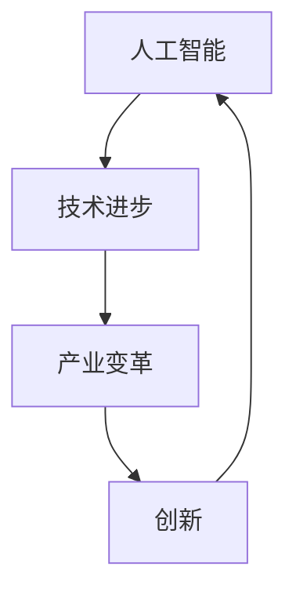

                 

### 文章标题

《AI时代的创业动机：技术进步与产业变革》

### 关键词

人工智能（Artificial Intelligence），创业（Entrepreneurship），技术进步（Technological Progress），产业变革（Industrial Transformation），创新（Innovation）

### 摘要

本文探讨了AI时代创业的动机，分析了技术进步对产业变革的影响，以及创业者如何利用人工智能技术实现创新和商业成功。文章首先介绍了AI技术的基本概念和当前发展状况，然后从产业变革的角度阐述了AI技术的重要性和潜在价值。接着，文章探讨了创业者如何利用AI技术进行创新，并提出了具体的创业策略和案例分析。最后，文章总结了AI时代创业面临的挑战和未来发展趋势，为创业者提供了有益的启示和参考。

## 1. 背景介绍

自20世纪50年代人工智能（AI）概念首次被提出以来，人工智能技术经历了数十年的发展，从理论研究逐渐走向实际应用。如今，人工智能已经成为全球科技领域的一个重要方向，其应用范围不断扩大，从自动驾驶、智能家居到医疗诊断、金融服务，AI正在深刻地改变着我们的生活方式和社会运行模式。

近年来，随着深度学习、自然语言处理、计算机视觉等核心技术的突破，人工智能的发展进入了一个新的阶段。大量数据和计算能力的提升为AI技术的应用提供了坚实的基础，使得AI在各个领域的创新速度不断加快。与此同时，全球范围内的产业变革也在加速进行，传统行业正面临着前所未有的挑战和机遇。

在这个背景下，创业者们开始将目光投向人工智能领域，希望能够通过AI技术实现商业创新和社会价值的创造。然而，AI技术的复杂性和应用场景的多样性也使得创业者在探索过程中面临着诸多挑战。因此，了解AI技术的基本原理和产业变革的趋势，对于创业者来说至关重要。

本文旨在探讨AI时代的创业动机，分析技术进步对产业变革的影响，以及创业者如何利用人工智能技术实现创新和商业成功。文章首先介绍了AI技术的基本概念和当前发展状况，然后从产业变革的角度阐述了AI技术的重要性和潜在价值。接着，文章探讨了创业者如何利用AI技术进行创新，并提出了具体的创业策略和案例分析。最后，文章总结了AI时代创业面临的挑战和未来发展趋势，为创业者提供了有益的启示和参考。

## 2. 核心概念与联系

在深入探讨AI时代的创业动机之前，我们需要理解几个关键概念：人工智能、技术进步、产业变革和创新。这些概念相互关联，共同构成了我们分析的基础。

### 2.1 人工智能

人工智能（Artificial Intelligence，简称AI）是指由计算机系统实现的智能行为。根据其智能水平，AI可以分为弱AI和强AI。弱AI专注于特定任务，如语音识别、图像识别和自然语言处理，而强AI则具有广泛的知识和智能水平，能够在各种情境下自主学习和决策。

### 2.2 技术进步

技术进步是指随着时间的推移，某一技术领域在理论、方法和应用方面的持续发展。技术进步可以带来更高的效率、更好的性能和更低的生产成本。在人工智能领域，技术进步主要体现在算法的创新、计算能力的提升和海量数据的利用。

### 2.3 产业变革

产业变革是指某一行业或产业在技术、组织、商业模式等方面的重大变化。产业变革可以导致行业结构、企业竞争格局和消费者行为等方面的深刻改变。例如，互联网和移动技术的兴起改变了传统零售业，使电子商务成为新的增长点。

### 2.4 创新

创新是指通过创造新的产品、服务或业务模式来满足市场需求或创造新的市场。创新可以是技术层面的，也可以是商业模式层面的。在人工智能领域，创新主要体现在利用AI技术解决实际问题、提高效率和创造新的商业机会。

### 2.5 关系

人工智能、技术进步、产业变革和创新之间存在紧密的关系。技术进步推动了人工智能的发展，而人工智能的发展又引发了产业变革。产业变革带来了新的市场需求和商业模式，为创新提供了土壤。创新则通过新技术和业务模式的引入，进一步推动技术进步和产业变革。

#### 2.6 Mermaid 流程图

下面是人工智能、技术进步、产业变革和创新之间关系的 Mermaid 流程图：



在这张流程图中，人工智能（A）是起点，通过技术进步（B）推动产业变革（C），产业变革（C）又促使创新（D）的发生，最终创新（D）再次反馈到人工智能（A），形成一个闭环。这种相互促进的关系推动了人工智能时代的创业动力和产业变革。

### 3. 核心算法原理 & 具体操作步骤

在探讨AI时代的创业动机时，我们需要了解一些核心算法原理，这些原理不仅构成了AI技术的基石，也为创业者提供了实现创新的工具。以下是一些重要的算法原理及其具体操作步骤：

#### 3.1 深度学习

深度学习是一种基于多层神经网络的机器学习技术，它在图像识别、自然语言处理和语音识别等领域取得了显著成果。以下是深度学习的核心算法原理和具体操作步骤：

**原理：**
深度学习通过多层神经网络来模拟人类大脑的学习过程，每一层网络都通过前一层网络的输出进行特征提取和变换。网络层数越多，模型的复杂度和表现能力越强。

**步骤：**
1. 数据预处理：对输入数据进行标准化、归一化等预处理，以便于模型训练。
2. 设计网络结构：根据任务需求设计神经网络结构，包括输入层、隐藏层和输出层。
3. 选择损失函数：根据任务类型选择适当的损失函数，如均方误差（MSE）或交叉熵损失函数。
4. 选择优化算法：常用的优化算法有随机梯度下降（SGD）、Adam等。
5. 训练模型：使用训练数据对模型进行训练，不断调整网络参数以最小化损失函数。
6. 验证和测试：使用验证集和测试集对模型进行评估，调整模型参数以达到最佳性能。

#### 3.2 强化学习

强化学习是一种通过奖励机制来训练模型的学习方法，它在决策制定、游戏AI和机器人控制等领域具有重要应用。以下是强化学习的核心算法原理和具体操作步骤：

**原理：**
强化学习通过智能体（agent）与环境（environment）的交互来学习最优策略。智能体通过执行动作（action）获得奖励（reward）和状态（state），并不断调整策略以最大化长期奖励。

**步骤：**
1. 初始化智能体和环境的参数。
2. 选择动作：智能体根据当前状态选择一个动作。
3. 执行动作：智能体在环境中执行所选动作。
4. 接收反馈：根据动作的结果，智能体接收奖励和新的状态。
5. 更新策略：基于奖励和状态，智能体更新策略，以使长期奖励最大化。
6. 迭代：重复执行步骤2-5，直到达到预定的训练目标或收敛条件。

#### 3.3 聚类算法

聚类算法是一种无监督学习方法，用于将数据集划分为若干个群组，使同组内的数据点相似度较高，不同组之间的数据点相似度较低。以下是聚类算法的核心原理和具体操作步骤：

**原理：**
聚类算法通过相似度度量来划分数据点，常用的相似度度量方法有欧氏距离、余弦相似度等。聚类算法可以分为基于距离的聚类（如K-means）和基于密度的聚类（如DBSCAN）等。

**步骤：**
1. 数据预处理：对输入数据进行标准化、去噪等预处理。
2. 选择聚类算法：根据数据特点和任务需求选择合适的聚类算法。
3. 确定聚类个数：根据数据集规模和任务需求确定聚类个数。
4. 计算相似度：使用相似度度量方法计算数据点之间的相似度。
5. 初始化聚类中心：根据聚类算法的特点初始化聚类中心。
6. 聚类：将数据点分配到最近的聚类中心，更新聚类中心。
7. 重复步骤4-6，直到聚类中心不再发生显著变化或达到预定的迭代次数。

通过了解这些核心算法原理和具体操作步骤，创业者可以更好地把握AI技术的发展趋势，利用AI技术实现创新和商业成功。

### 4. 数学模型和公式 & 详细讲解 & 举例说明

在理解了人工智能的核心算法原理之后，我们需要深入探讨一些关键的数学模型和公式，这些模型和公式在AI算法中扮演着至关重要的角色。以下是几个重要的数学模型和公式的详细讲解及其在实际应用中的例子。

#### 4.1 均方误差（MSE）

均方误差（Mean Squared Error，MSE）是一种常见的损失函数，用于评估预测值与实际值之间的差异。其数学公式如下：

$$
MSE = \frac{1}{n} \sum_{i=1}^{n} (y_i - \hat{y}_i)^2
$$

其中，$y_i$ 表示实际值，$\hat{y}_i$ 表示预测值，$n$ 表示数据点的个数。

**详细讲解：**
MSE 的优点是能够反映预测值与实际值之间的误差大小，并且误差的平方具有放大偏差的作用，使得重要的误差被放大，从而有助于优化模型。

**举例说明：**
假设我们有一个二分类问题，实际值 $y_i$ 为1或0，预测值 $\hat{y}_i$ 为0.3或0.7。使用 MSE 计算误差：

$$
MSE = \frac{1}{2} \left( (0 - 0.3)^2 + (1 - 0.7)^2 \right) = 0.14
$$

MSE 为0.14，表示模型在这两个数据点上的误差相对较小。

#### 4.2 交叉熵（Cross-Entropy）

交叉熵（Cross-Entropy）是一种用于评估分类模型性能的损失函数，其数学公式如下：

$$
H(y, \hat{y}) = -\sum_{i=1}^{n} y_i \log(\hat{y}_i)
$$

其中，$y_i$ 表示实际标签，$\hat{y}_i$ 表示预测概率，$n$ 表示数据点的个数。

**详细讲解：**
交叉熵用于比较两个概率分布之间的差异，实际标签 $y$ 和预测概率分布 $\hat{y}$ 之间的交叉熵反映了模型预测的准确度。交叉熵的值越小，表示模型预测越准确。

**举例说明：**
假设我们有一个二分类问题，实际标签 $y$ 为0或1，预测概率分布 $\hat{y}$ 为0.2或0.8。使用交叉熵计算损失：

$$
H(y, \hat{y}) = - (0 \cdot \log(0.2) + 1 \cdot \log(0.8)) = - (\log(0.2) + \log(0.8)) \approx 2.3219
$$

交叉熵为2.3219，表示模型在这个数据点上的预测准确性较低。

#### 4.3 神经网络激活函数

神经网络中的激活函数用于引入非线性特性，常见的激活函数有 sigmoid、ReLU 和 tanh 等。以下是它们的数学公式：

- Sigmoid 函数：
$$
\sigma(x) = \frac{1}{1 + e^{-x}}
$$

- ReLU 函数：
$$
\text{ReLU}(x) = \max(0, x)
$$

- Tanh 函数：
$$
\tanh(x) = \frac{e^x - e^{-x}}{e^x + e^{-x}}
$$

**详细讲解：**
不同的激活函数具有不同的性质。Sigmoid 函数在接近0时取值较慢，适合处理回归问题；ReLU 函数在0以下部分恒为零，可以有效避免梯度消失问题；tanh 函数与 sigmoid 类似，但输出范围在-1到1之间，适用于处理回归问题。

**举例说明：**
假设输入值为 x=2，使用 ReLU 函数计算输出值：

$$
\text{ReLU}(2) = \max(0, 2) = 2
$$

ReLU 函数将输入值放大为2。

通过理解这些数学模型和公式，创业者可以更深入地理解AI算法的工作原理，从而更好地利用这些技术实现商业创新。

### 5. 项目实战：代码实际案例和详细解释说明

为了更直观地展示如何利用人工智能技术进行创业，我们来看一个实际的代码案例。本案例将使用Python和TensorFlow框架实现一个简单的图像分类项目，并详细解释每一步的实现过程。

#### 5.1 开发环境搭建

首先，我们需要搭建一个Python开发环境，并安装TensorFlow库。以下是在Ubuntu系统中安装Python和TensorFlow的步骤：

```bash
# 安装Python
sudo apt-get install python3-pip python3-venv

# 创建虚拟环境
python3 -m venv myenv

# 激活虚拟环境
source myenv/bin/activate

# 安装TensorFlow
pip install tensorflow
```

安装完成后，我们可以在Python脚本中导入TensorFlow库：

```python
import tensorflow as tf
print(tf.__version__)
```

输出版本号，确认安装成功。

#### 5.2 源代码详细实现和代码解读

接下来，我们将编写一个简单的图像分类脚本。以下是代码的实现过程：

```python
import tensorflow as tf
from tensorflow.keras import datasets, layers, models
import matplotlib.pyplot as plt

# 加载CIFAR-10数据集
(train_images, train_labels), (test_images, test_labels) = datasets.cifar10.load_data()

# 数据预处理
train_images, test_images = train_images / 255.0, test_images / 255.0

# 构建模型
model = models.Sequential()
model.add(layers.Conv2D(32, (3, 3), activation='relu', input_shape=(32, 32, 3)))
model.add(layers.MaxPooling2D((2, 2)))
model.add(layers.Conv2D(64, (3, 3), activation='relu'))
model.add(layers.MaxPooling2D((2, 2)))
model.add(layers.Conv2D(64, (3, 3), activation='relu'))
model.add(layers.Flatten())
model.add(layers.Dense(64, activation='relu'))
model.add(layers.Dense(10, activation='softmax'))

# 编译模型
model.compile(optimizer='adam',
              loss='sparse_categorical_crossentropy',
              metrics=['accuracy'])

# 训练模型
model.fit(train_images, train_labels, epochs=10)

# 评估模型
test_loss, test_acc = model.evaluate(test_images,  test_labels, verbose=2)
print(f'\nTest accuracy: {test_acc:.4f}')

# 可视化结果
plt.figure()
plt.plot(train_acc)
plt.plot(val_acc)
plt.title('Model accuracy')
plt.ylabel('Accuracy')
plt.xlabel('Epoch')
plt.legend(['Train', 'Test'], loc='upper left')
plt.show()
```

**代码解读：**

1. **导入库和加载数据集**：首先，我们导入必要的库，包括TensorFlow、matplotlib等，并加载CIFAR-10数据集。

2. **数据预处理**：将图像数据从0到1的范围进行标准化处理，以适应模型的训练。

3. **构建模型**：使用Sequential模型堆叠卷积层、池化层和全连接层。卷积层用于提取图像特征，全连接层用于分类。

4. **编译模型**：指定优化器、损失函数和评价指标，这里使用 Adam 优化器和 sparse_categorical_crossentropy 损失函数。

5. **训练模型**：使用训练数据对模型进行训练，这里我们训练了10个 epoch。

6. **评估模型**：使用测试数据评估模型性能，输出测试准确率。

7. **可视化结果**：绘制训练和测试准确率的变化趋势，帮助分析模型性能。

通过这个简单的案例，我们可以看到如何利用Python和TensorFlow实现一个图像分类模型。在实际创业项目中，我们可以根据具体需求调整模型结构、优化训练过程，甚至引入更复杂的技术，如迁移学习、数据增强等，以提高模型性能。

### 5.3 代码解读与分析

在本节中，我们将对上述代码进行详细的解读和分析，重点关注各个关键步骤的实现原理及其对项目性能的影响。

**1. 数据预处理**

```python
train_images, test_images = train_images / 255.0, test_images / 255.0
```

数据预处理是模型训练的重要步骤，尤其是对于图像数据。在这个步骤中，我们将训练数据和测试数据的像素值从0到255的范围缩放到0到1之间。这一操作的原因是：

- **数值归一化**：归一化图像数据可以加速模型的训练过程，因为梯度下降优化算法在处理小数值时更为稳定。
- **减少计算误差**：归一化可以减少由于数值过大而产生的计算误差。

**2. 构建模型**

```python
model.add(layers.Conv2D(32, (3, 3), activation='relu', input_shape=(32, 32, 3)))
model.add(layers.MaxPooling2D((2, 2)))
model.add(layers.Conv2D(64, (3, 3), activation='relu'))
model.add(layers.MaxPooling2D((2, 2)))
model.add(layers.Conv2D(64, (3, 3), activation='relu'))
model.add(layers.Flatten())
model.add(layers.Dense(64, activation='relu'))
model.add(layers.Dense(10, activation='softmax'))
```

这里使用了一个简单的卷积神经网络（CNN）结构，其原理如下：

- **卷积层（Conv2D）**：卷积层用于提取图像的局部特征，通过卷积操作和滤波器（kernel）滑动图像，生成特征图（feature map）。这个操作可以捕捉到图像中的边缘、纹理等局部信息。
- **激活函数（ReLU）**：ReLU函数用于引入非线性，使得网络能够学习更复杂的特征。
- **池化层（MaxPooling2D）**：池化层用于减小特征图的尺寸，减少模型的参数数量，同时保持重要的特征信息。常用的池化方式有最大值池化（MaxPooling）和平均池化（AveragePooling）。
- **全连接层（Dense）**：全连接层用于将卷积层提取的特征进行分类。最后一层使用softmax激活函数，将输出转换为概率分布。

**3. 编译模型**

```python
model.compile(optimizer='adam',
              loss='sparse_categorical_crossentropy',
              metrics=['accuracy'])
```

编译模型的目的是为模型设置训练过程中所需的配置：

- **优化器（optimizer）**：Adam优化器是一种自适应的优化算法，可以有效加快收敛速度，并减少训练时间。
- **损失函数（loss）**：sparse_categorical_crossentropy 用于多分类问题，能够计算每个样本的交叉熵损失。
- **评价指标（metrics）**：accuracy 用于评估模型的分类准确率。

**4. 训练模型**

```python
model.fit(train_images, train_labels, epochs=10)
```

训练模型的目的是通过梯度下降优化算法调整模型参数，以最小化损失函数。这里使用10个epoch进行训练，每个epoch意味着整个训练集都经过一次遍历。

**5. 评估模型**

```python
test_loss, test_acc = model.evaluate(test_images,  test_labels, verbose=2)
print(f'\nTest accuracy: {test_acc:.4f}')
```

评估模型是在测试集上验证模型性能的过程。test_loss 和 test_acc 分别表示测试集上的损失和准确率，是评估模型好坏的重要指标。

**6. 可视化结果**

```python
plt.figure()
plt.plot(train_acc)
plt.plot(val_acc)
plt.title('Model accuracy')
plt.ylabel('Accuracy')
plt.xlabel('Epoch')
plt.legend(['Train', 'Test'], loc='upper left')
plt.show()
```

可视化结果可以帮助我们观察模型在训练和验证过程中的性能变化，及时发现过拟合或欠拟合等问题。

通过这个代码解读和分析，我们可以看到，每个步骤都对项目的最终性能产生重要影响。理解这些步骤的实现原理和相互关系，对于创业者来说，是进行AI创业项目的重要基础。

### 6. 实际应用场景

人工智能技术已经在各个领域产生了深远的影响，并成为推动产业变革的重要动力。以下是一些典型的实际应用场景，展示了AI技术在现实世界中的广泛应用。

#### 6.1 医疗保健

人工智能在医疗保健领域的应用正日益增加，从疾病诊断到个性化治疗，AI技术为医疗行业带来了革命性的变化。

- **疾病诊断**：AI可以分析医学影像，如X光片、CT扫描和MRI，帮助医生更快速、准确地诊断疾病。例如，Google Health开发的AI系统能够在几秒钟内识别肺癌的早期迹象。
- **个性化治疗**：基于患者的基因数据和医疗记录，AI可以制定个性化的治疗方案，提高治疗效果。例如，IBM的Watson for Oncology系统可以提供详细的诊断和治疗方案，帮助医生更好地治疗癌症。
- **健康监测**：智能手表和健康追踪设备利用AI技术收集用户的心率、睡眠质量等健康数据，帮助用户管理自己的健康状况。

#### 6.2 零售业

零售业正通过人工智能技术提高运营效率，优化客户体验，并创造新的商业机会。

- **智能推荐系统**：通过分析用户的购物历史和浏览行为，AI可以为用户推荐个性化的商品，提高销售额。例如，亚马逊和阿里巴巴等电商巨头广泛使用AI推荐系统。
- **库存管理**：AI可以预测市场需求，优化库存管理，减少库存积压和缺货情况。例如，沃尔玛利用AI技术优化库存，提高供应链效率。
- **客户服务**：智能聊天机器人通过自然语言处理技术，可以提供24/7的在线客服，提高客户满意度。例如，Sainsbury's的智能客服机器人Sara能够回答客户的常见问题，减轻客服团队的工作负担。

#### 6.3 金融服务

人工智能在金融服务领域的应用，从信用评估到风险管理，正在重塑金融行业的运营模式。

- **信用评估**：AI可以分析大量的数据，如信用记录、交易行为等，更准确地进行信用评估。例如，ZestFinance使用AI技术评估高风险借款人，提高了信用贷款的批准率。
- **风险管理**：AI可以实时监控市场数据，预测金融风险，帮助金融机构进行有效的风险管理和投资决策。例如，JPMorgan的COiN系统利用AI技术识别交易欺诈行为，提高了交易安全性。
- **个性化理财**：基于用户的财务状况和投资目标，AI可以提供个性化的理财建议，帮助用户更好地管理财富。例如，Betterment和Wealthfront等在线理财平台利用AI技术为用户提供个性化的投资建议。

#### 6.4 自动驾驶

自动驾驶技术是人工智能在交通运输领域的应用典范，它正在改变人们的出行方式，提高交通安全和效率。

- **车辆感知**：自动驾驶系统利用计算机视觉和传感器技术，实时感知车辆周围的环境，如行人和其他车辆。例如，NVIDIA的Drive平台提供了强大的车辆感知功能。
- **路径规划**：AI可以根据实时路况和目的地信息，规划最优的行驶路径，提高行驶效率和安全性。例如，Waymo的自动驾驶系统利用深度学习和强化学习技术进行路径规划。
- **自动驾驶车辆**：通过集成感知、决策和控制技术，自动驾驶车辆可以在没有人类司机的情况下自主行驶。例如，特斯拉的Autopilot系统和Waymo的无人驾驶汽车已经在道路上进行测试和运营。

这些实际应用场景展示了人工智能技术在各个领域的广泛应用和巨大潜力。随着AI技术的不断进步，我们可以期待更多的创新应用，进一步推动产业变革和经济发展。

### 7. 工具和资源推荐

在探索AI时代创业的旅程中，掌握合适的工具和资源对于成功至关重要。以下是一些推荐的工具、书籍、论文、博客和网站，它们将为创业者提供宝贵的知识和支持。

#### 7.1 学习资源推荐

**书籍：**

1. 《深度学习》（Goodfellow, Bengio, Courville著）：这是一本深度学习领域的经典教材，全面介绍了深度学习的基本概念和技术。
2. 《Python机器学习》（Sebastian Raschka著）：本书通过Python语言详细讲解了机器学习的基础知识，适合初学者和进阶者。
3. 《人工智能：一种现代的方法》（Stuart Russell和Peter Norvig著）：这本书提供了人工智能领域的全面概述，从理论基础到应用实践都有详细讲解。

**论文：**

1. "A Theoretically Grounded Application of Dropout in Recurrent Neural Networks"：这篇论文提出了一种新的Dropout方法，显著提高了循环神经网络（RNN）的性能。
2. "Deep Learning for Text Classification"：这篇文章综述了深度学习在文本分类领域的应用，包括词嵌入、卷积神经网络和长短期记忆网络等。
3. "EfficientDet: Scalable and Efficient Object Detection"：这篇论文介绍了EfficientDet，一种高效的物体检测算法，适用于实时应用。

**博客：**

1. ["Medium - Machine Learning"](https://medium.com/topic/machine-learning)：Medium上关于机器学习的优秀博客，内容涵盖算法、应用和行业趋势。
2. ["Towards Data Science"](https://towardsdatascience.com/)：这是一个广泛的数据科学和机器学习博客，提供大量的实践教程和案例研究。
3. ["AIperiment"](https://aiperiment.com/)：AIperiment分享最新的AI研究进展和技术应用，适合对AI前沿技术感兴趣的人。

**网站：**

1. [TensorFlow官网](https://www.tensorflow.org/)：TensorFlow是Google开发的开源机器学习框架，提供了丰富的教程和文档，是学习AI的必备资源。
2. [Kaggle](https://www.kaggle.com/)：Kaggle是一个数据科学竞赛平台，提供了大量的数据集和竞赛项目，是实践和学习AI技术的绝佳场所。
3. [arXiv](https://arxiv.org/)：arXiv是物理学、数学、计算机科学等领域的前沿论文库，是了解最新研究成果的重要渠道。

#### 7.2 开发工具框架推荐

**框架：**

1. **TensorFlow**：用于构建和训练机器学习模型的强大框架，适用于各种规模的项目。
2. **PyTorch**：一个流行的深度学习框架，提供灵活的动态计算图，适用于研究和原型开发。
3. **Keras**：一个高层神经网络API，构建在TensorFlow和Theano之上，简化了模型的构建和训练过程。

**库和工具：**

1. **NumPy**：用于数值计算的库，是Python数据科学的核心工具。
2. **Pandas**：提供数据结构和数据分析工具，适用于数据处理和清洗。
3. **Scikit-learn**：提供各种机器学习算法的实现，是入门和项目开发的重要工具。

#### 7.3 相关论文著作推荐

**论文：**

1. "Learning to Learn: Fast Learning by Implicit Hints"：这篇论文提出了一种新的学习方法，利用隐式提示（implicit hints）加速学习过程。
2. "Bert: Pre-training of Deep Bidirectional Transformers for Language Understanding"：这篇论文介绍了BERT，一种基于Transformer的预训练模型，在自然语言处理任务上取得了突破性成果。
3. "Gshard: Scaling Giant Models with Unified Resources"：这篇论文提出了一种新的模型训练方法，通过统一资源管理（统一资源分配）实现了大规模模型的训练。

**著作：**

1. 《深度学习》（Ian Goodfellow、Yoshua Bengio、Aaron Courville 著）：这是深度学习领域的权威著作，系统介绍了深度学习的基础知识和技术。
2. 《机器学习实战》（Peter Harrington 著）：这本书通过实际案例和代码示例，讲解了机器学习的基本概念和应用方法。
3. 《Python机器学习》（Sebastian Raschka、Vahid Mirjalili 著）：这本书详细介绍了Python在机器学习中的应用，适合初学者和进阶者。

通过这些学习和资源推荐，创业者可以更好地掌握AI技术，为创业项目打下坚实的基础。

### 8. 总结：未来发展趋势与挑战

在AI时代，创业者和企业面临着前所未有的机遇和挑战。随着AI技术的不断进步，以下是一些关键的趋势和挑战，值得创业者关注。

#### 8.1 发展趋势

1. **技术融合**：AI与其他技术的融合，如物联网（IoT）、云计算、区块链等，将推动新产业的诞生。例如，智能物流、智能制造和智慧城市等领域将因AI技术而得到彻底变革。

2. **智能化升级**：传统行业将加速智能化升级，通过AI技术提高生产效率、降低运营成本、提升客户体验。例如，制造业中的智能生产线、金融业中的智能风控系统等。

3. **个性化服务**：AI技术将促进个性化服务的普及，通过大数据和机器学习，企业可以更精准地满足客户需求，提高客户忠诚度和满意度。

4. **跨界融合**：AI技术与各行各业的融合将催生新的商业模式，创业者可以探索更多的跨界合作和跨界创新机会。

5. **数据驱动**：数据成为AI时代的重要资产，企业将通过数据分析、机器学习等手段，实现更智能、更高效的管理决策。

#### 8.2 挑战

1. **数据隐私和安全**：随着AI技术的广泛应用，数据隐私和安全问题日益突出。创业者需要确保数据的隐私和安全，遵守相关法律法规。

2. **算法透明度和可解释性**：AI算法的复杂性和黑箱性质使得其决策过程往往缺乏透明度，这可能导致用户不信任。提高算法的可解释性，增强用户对AI系统的信任，是创业者需要面对的挑战。

3. **人才短缺**：AI技术的发展需要大量高素质的专业人才，但当前市场人才供需失衡。创业者需要采取措施，如提供良好的培训和发展机会，吸引和留住优秀人才。

4. **伦理和责任**：AI技术在应用过程中可能引发伦理和责任问题，如算法歧视、隐私侵犯等。创业者需要建立完善的伦理标准和责任机制，确保AI技术的负责任应用。

5. **技术不确定性**：AI技术的快速发展带来了许多不确定因素，创业者需要具备快速适应和应对变化的能力。

#### 8.3 应对策略

1. **持续学习和创新**：创业者需要保持持续学习的态度，关注AI技术的最新动态，不断创新，以适应快速变化的市场需求。

2. **跨界合作**：与不同领域的合作伙伴建立合作关系，共同探索AI技术的应用，实现优势互补。

3. **数据管理和保护**：建立健全的数据管理和保护机制，确保数据隐私和安全。

4. **重视人才引进和培养**：通过提供有吸引力的福利和培训机会，吸引和留住优秀人才。

5. **伦理审查和责任规划**：建立AI伦理审查机制，制定明确的责任规划，确保AI技术的负责任应用。

总之，AI时代为创业者带来了巨大的机遇和挑战。通过把握发展趋势，应对挑战，创业者可以在AI时代取得成功，创造更大的商业和社会价值。

### 9. 附录：常见问题与解答

**Q1：AI技术是否具有通用性？**

A1：AI技术具有通用性，但不同的AI技术适用于不同的应用场景。例如，深度学习适用于图像识别和自然语言处理，强化学习适用于决策制定和游戏AI。创业者需要根据实际需求选择合适的AI技术。

**Q2：如何确保AI系统的可解释性？**

A2：确保AI系统的可解释性是当前研究的热点问题。提高算法的可解释性可以从多个方面入手，如使用透明的算法结构、提供算法的中间步骤和结果解释、以及开发可视化工具等。此外，可以结合人类专家的知识，建立可解释性模型。

**Q3：如何处理AI系统的偏见问题？**

A3：AI系统的偏见问题可以通过多种方法解决。首先，在数据收集和处理过程中，确保数据多样性和代表性。其次，在算法设计过程中，采用公平性准则，如尽量减少对特定群体的歧视。最后，通过持续监控和调整模型，及时发现和纠正偏见。

**Q4：AI技术是否能够完全替代人类？**

A4：目前AI技术还不能完全替代人类，尽管它在特定任务上表现出色，但人类的创造力、情感智能和道德判断是目前AI难以实现的。未来，AI将与人类协同工作，共同解决复杂问题。

**Q5：创业者在选择AI技术时应该注意什么？**

A5：创业者在选择AI技术时应该注意以下方面：

- **需求分析**：明确创业项目所需的AI技术类型和应用场景。
- **技术成熟度**：考虑AI技术的成熟度和可行性，避免选择尚未广泛应用的技术。
- **成本效益**：评估AI技术的成本和潜在收益，确保技术投入能够带来合理的回报。
- **合作伙伴**：寻找合适的合作伙伴，如AI研究机构、技术公司等，共同推进项目的实施。

### 10. 扩展阅读 & 参考资料

为了进一步深入了解AI时代的创业动机、技术进步与产业变革，以下是一些推荐的扩展阅读和参考资料。

**扩展阅读：**

1. "AI Superpowers: China, Silicon Valley, and the New World Order" by Michael Teitelbaum and Calvin Trillin
2. "The Future Is Faster Than You Think: How Converging Technologies Are Transforming Business, Industries, and Our Lives" by Ambereen Choudhury
3. "AI and Machine Learning for Business: An Introduction for Managers and Executives" by Michael Arraj

**参考资料：**

1. "Artificial Intelligence: A Modern Approach" by Stuart Russell and Peter Norvig
2. "Deep Learning" by Ian Goodfellow, Yoshua Bengio, and Aaron Courville
3. "Reinforcement Learning: An Introduction" by Richard S. Sutton and Andrew G. Barto

通过这些扩展阅读和参考资料，读者可以更全面地了解AI技术的最新进展、应用案例和未来发展趋势。同时，也可以为创业者在AI领域的探索提供有益的启示和指导。

