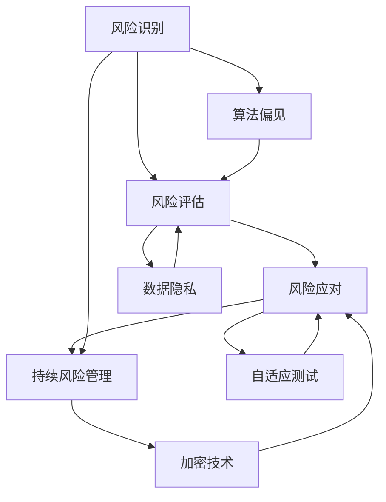

                 

### 背景介绍

AI技术的迅速发展已经深刻地改变了各行各业，软件工程领域也不例外。在AI时代，软件工程面临的风险和挑战变得更加复杂多样，传统的风险管理策略已经难以应对这些新的变化。因此，探索AI时代的软件工程风险管理新策略成为了当前研究的重要课题。

首先，AI技术的引入带来了新的风险类型。例如，算法偏见、数据隐私泄露、系统可靠性降低等问题日益突出。同时，AI技术的快速发展也意味着软件系统的复杂度持续增加，这进一步加大了风险管理的难度。

其次，随着软件工程的不断发展，风险管理的重要性日益凸显。软件项目的高风险性可能导致项目失败、经济损失甚至社会影响。因此，如何有效地识别、评估和应对风险成为了软件工程中的重要任务。

本文将系统地探讨AI时代的软件工程风险管理新策略，旨在为软件工程师和项目管理者提供有益的参考。文章结构如下：

1. **核心概念与联系**：介绍与AI时代软件工程风险管理相关的基本概念，并展示其之间的联系。
2. **核心算法原理与具体操作步骤**：深入剖析核心算法的原理，并详细阐述其操作步骤。
3. **数学模型和公式**：介绍与风险管理相关的数学模型，并使用LaTeX格式展示关键公式。
4. **项目实战**：通过实际案例展示如何在实际项目中应用这些风险管理策略。
5. **实际应用场景**：探讨AI时代软件工程风险管理在各类场景中的应用。
6. **工具和资源推荐**：推荐相关的学习资源和开发工具。
7. **总结**：总结未来发展趋势与面临的挑战。
8. **附录**：回答常见问题并提供扩展阅读资源。

通过这篇文章，我们希望能够帮助读者更好地理解AI时代的软件工程风险管理，并为其提供实用的策略和方法。

### 核心概念与联系

在探讨AI时代的软件工程风险管理新策略之前，有必要先了解一些核心概念，并阐述它们之间的联系。以下是与AI时代软件工程风险管理相关的一些关键概念：

#### 1. AI与软件工程

AI（人工智能）是指计算机系统通过模拟人类智能行为来实现某些任务的能力。在软件工程中，AI技术广泛应用于自动化测试、代码审查、缺陷预测等场景。这些应用不仅提高了开发效率，还减少了人为错误。

#### 2. 风险管理

风险管理是指通过识别、评估和应对潜在风险来降低损失的过程。在软件工程中，风险管理尤为重要，因为软件项目具有高度复杂性和不确定性。风险管理的主要目标是确保项目的成功交付，并最大限度地减少经济损失。

#### 3. 风险识别

风险识别是风险管理的第一步，旨在识别项目中可能出现的风险。在AI时代，风险识别变得更加复杂，因为AI技术引入了新的风险类型。例如，算法偏见可能导致歧视性决策，数据隐私泄露可能导致用户信息泄露。

#### 4. 风险评估

风险评估是评估风险的可能性和影响程度的过程。在AI时代，风险评估需要考虑多个因素，如算法可靠性、数据质量、系统性能等。AI技术可以帮助自动化风险评估，提高准确性。

#### 5. 风险应对

风险应对是制定和实施策略来降低风险的过程。在AI时代，风险应对策略需要更加灵活和动态。例如，可以采用自适应测试方法来应对自动化测试中的新风险，或者使用加密技术来保护数据隐私。

#### 6. 持续风险管理

持续风险管理是指在整个软件生命周期中持续监控和更新风险管理策略。在AI时代，软件系统的复杂度不断升高，持续风险管理变得尤为重要。持续风险管理有助于及时发现和应对新风险。

#### Mermaid 流程图

为了更好地理解这些核心概念之间的联系，我们可以使用Mermaid流程图（注意：Mermaid流程节点中不要有括号、逗号等特殊字符）展示它们之间的交互关系：



通过上述Mermaid流程图，我们可以清晰地看到风险识别、风险评估、风险应对和持续风险管理之间的互动关系。此外，算法偏见和数据隐私等AI时代特有的风险因素也对风险评估和风险应对产生了直接影响。

总结来说，AI时代的软件工程风险管理不仅需要传统的风险管理方法，还需要针对AI技术带来的新风险进行特殊处理。理解这些核心概念及其之间的联系是制定有效风险管理策略的基础。

#### 核心算法原理与具体操作步骤

在AI时代的软件工程风险管理中，核心算法的选择和实现至关重要。以下是几个关键算法的原理和具体操作步骤：

##### 1. 故障树分析（Fault Tree Analysis, FTA）

故障树分析是一种用于识别和评估系统故障原因及其相互关系的图形化方法。其基本原理是构建一个故障树，树中的每个节点代表一个事件，节点之间的连线表示事件之间的逻辑关系。

**具体操作步骤：**

1. **定义系统顶事件**：确定系统中的主要故障事件，如系统崩溃。
2. **构建基本事件**：将顶事件分解为基本事件，如硬件故障、软件缺陷等。
3. **绘制故障树**：使用逻辑门（与门、或门、非门）连接基本事件，表示它们之间的逻辑关系。
4. **计算故障概率**：通过故障树结构，使用概率分布函数计算每个基本事件的发生概率，并最终得到顶事件的发生概率。
5. **优化故障树**：通过合并或删除冗余的基本事件，简化故障树结构，提高计算效率。

**示例**：

假设一个软件系统发生崩溃的故障树如下：

```mermaid
graph TD
A[系统崩溃] --> B[硬件故障] C[软件缺陷]
B --> D[电源故障] E[硬件故障]
C --> F[代码缺陷] G[配置错误]
D --> H[电源中断]
E --> I[硬件老化]
F --> J[逻辑错误]
G --> K[参数错误]
```

通过故障树分析，我们可以计算出系统崩溃的概率，并识别关键的基本事件，以便采取相应的风险应对措施。

##### 2. 蒙特卡洛模拟（Monte Carlo Simulation）

蒙特卡洛模拟是一种通过随机采样来评估系统性能和风险的方法。其基本原理是利用大量随机样本模拟系统运行，通过统计这些样本的结果来推断系统的概率分布。

**具体操作步骤：**

1. **定义系统模型**：建立系统的数学模型，包括输入变量、输出变量和它们之间的函数关系。
2. **生成随机样本**：为每个输入变量生成随机样本，这些样本需要符合其概率分布。
3. **模拟系统运行**：使用随机样本驱动系统模型，生成多个系统输出样本。
4. **统计输出结果**：统计所有输出样本的分布，计算关键性能指标（如平均响应时间、失败率等）。
5. **优化模型参数**：根据输出结果调整模型参数，提高模拟的准确性。

**示例**：

假设一个软件系统的时间性能服从正态分布，通过蒙特卡洛模拟评估其平均响应时间：

```python
import numpy as np

# 定义系统模型参数
mean = 10  # 平均响应时间
std_dev = 2  # 标准差

# 生成随机样本
num_samples = 1000
samples = np.random.normal(mean, std_dev, num_samples)

# 计算平均响应时间
average_response_time = np.mean(samples)
print("平均响应时间：", average_response_time)

# 计算失败率
failure_rate = np.mean(samples > 15)  # 响应时间超过15秒视为失败
print("失败率：", failure_rate)
```

通过蒙特卡洛模拟，我们可以估计系统在特定条件下的平均响应时间和失败率，从而为风险管理提供依据。

##### 3. 强化学习（Reinforcement Learning）

强化学习是一种通过试错和反馈来优化决策过程的方法。在软件工程风险管理中，强化学习可以用于优化风险应对策略。

**具体操作步骤：**

1. **定义环境**：确定系统的环境，包括状态空间和动作空间。
2. **选择代理**：选择一种强化学习算法，如Q-learning或深度Q网络（DQN）。
3. **训练代理**：通过与环境交互，使用代理学习最优策略。
4. **评估策略**：使用训练得到的策略评估系统性能，如风险降低程度。
5. **调整策略**：根据评估结果调整策略，提高其有效性。

**示例**：

使用Q-learning算法优化风险应对策略：

```python
import numpy as np

# 定义环境状态和动作空间
states = ['正常', '异常']
actions = ['无措施', '采取措施']

# 初始化Q值表
Q = np.zeros([len(states), len(actions)])

# Q-learning参数
alpha = 0.1  # 学习率
gamma = 0.9  # 折扣因子

# 训练代理
num_episodes = 1000
for episode in range(num_episodes):
    state = np.random.choice(states)
    action = np.random.choice(actions)
    next_state = np.random.choice(states)
    reward = 0
    
    if state == '正常' and action == '采取措施':
        reward = -1  # 奖励为负，因为采取措施但状态未变
    elif state == '异常' and action == '无措施':
        reward = -10  # 奖励为负，因为未采取措施导致状态异常
    
    Q[state, action] += alpha * (reward + gamma * np.max(Q[next_state, :]) - Q[state, action])

# 输出最优策略
best_action = np.argmax(Q[state, :])
print("最优策略：", actions[best_action])
```

通过强化学习，我们可以找到最优的风险应对策略，从而提高软件工程风险管理的有效性。

综上所述，故障树分析、蒙特卡洛模拟和强化学习是AI时代软件工程风险管理中重要的核心算法。通过理解这些算法的原理和具体操作步骤，我们可以更有效地识别、评估和应对AI时代带来的新风险。

### 数学模型和公式

在AI时代的软件工程风险管理中，数学模型和公式扮演着关键角色，它们帮助我们量化风险，制定更科学的应对策略。以下是几个关键的数学模型和公式的详细讲解，并通过具体的示例来说明其应用。

#### 1. 风险概率模型

风险概率模型用于评估单个风险事件发生的概率。最常见的模型是贝叶斯概率模型，它通过历史数据和先验知识来计算后验概率。

**贝叶斯概率公式**：

$$
P(A|B) = \frac{P(B|A) \cdot P(A)}{P(B)}
$$

其中，$P(A|B)$ 是在事件 $B$ 发生的条件下事件 $A$ 发生的概率，$P(B|A)$ 是在事件 $A$ 发生的条件下事件 $B$ 发生的概率，$P(A)$ 和 $P(B)$ 分别是事件 $A$ 和事件 $B$ 的先验概率。

**示例**：

假设我们想评估一个软件系统在特定条件下发生崩溃的概率。我们知道在所有历史数据中，系统崩溃的概率是 $P(崩溃) = 0.01$，而在崩溃的情况下，某个特定错误发生的概率是 $P(错误|崩溃) = 0.8$。我们还知道在正常运行的条件下，该错误的概率是 $P(错误|正常) = 0.001$。

通过贝叶斯概率公式，我们可以计算在给定错误发生的情况下，系统崩溃的后验概率：

$$
P(崩溃|错误) = \frac{P(错误|崩溃) \cdot P(崩溃)}{P(错误)} = \frac{0.8 \cdot 0.01}{0.8 \cdot 0.01 + 0.001} \approx 0.89
$$

这意味着在发现错误的情况下，系统崩溃的概率约为 89%。

#### 2. 风险损失模型

风险损失模型用于计算风险事件发生后可能造成的损失。常见的方法是使用概率损失函数，它将风险事件的概率与损失函数相结合。

**概率损失函数**：

$$
L(A) = P(A) \cdot C(A)
$$

其中，$P(A)$ 是风险事件 $A$ 发生的概率，$C(A)$ 是事件 $A$ 发生的损失成本。

**示例**：

假设一个软件系统的崩溃损失函数是 $C(崩溃) = 100,000$ 美元。根据前面的贝叶斯概率计算，系统崩溃的概率为 $P(崩溃) = 0.01$。那么，系统崩溃的预期损失为：

$$
L(崩溃) = P(崩溃) \cdot C(崩溃) = 0.01 \cdot 100,000 = 1,000
$$

这意味着系统崩溃的预期损失为 1,000 美元。

#### 3. 风险矩阵模型

风险矩阵模型用于评估风险的可能性和影响，并生成一个二维矩阵，其中每个单元格表示特定风险的可能性和影响。

**风险矩阵**：

| 风险       | 可能性 | 影响 |
|------------|--------|------|
| 崩溃       | 高     | 高   |
| 数据泄露   | 中     | 高   |
| 算法偏见   | 低     | 中   |

**示例**：

在上述风险矩阵中，崩溃事件被标记为高可能性和高影响。这意味着我们需要特别关注崩溃风险，并采取相应的风险管理措施。

#### 4. 蒙特卡洛模拟模型

蒙特卡洛模拟模型用于通过随机采样来评估系统性能和风险。该模型基于概率分布函数生成随机样本，并使用这些样本来估计系统的统计特性。

**蒙特卡洛模拟公式**：

$$
\mu = \frac{1}{N} \sum_{i=1}^{N} X_i
$$

$$
\sigma^2 = \frac{1}{N-1} \sum_{i=1}^{N} (X_i - \mu)^2
$$

其中，$\mu$ 是样本均值，$\sigma^2$ 是样本方差，$N$ 是样本数量，$X_i$ 是第 $i$ 个随机样本。

**示例**：

假设我们使用蒙特卡洛模拟来估计一个软件系统的平均响应时间。我们生成了 1,000 个随机样本，计算得到样本均值为 10 秒，样本方差为 4。那么，系统的平均响应时间和方差估计为：

$$
\mu = \frac{1}{1,000} \sum_{i=1}^{1,000} X_i = 10
$$

$$
\sigma^2 = \frac{1}{1,000-1} \sum_{i=1}^{1,000} (X_i - 10)^2 = 4
$$

这意味着我们估计该软件系统的平均响应时间为 10 秒，标准差为 2。

通过上述数学模型和公式的讲解，我们可以更准确地量化和管理AI时代的软件工程风险。这些模型不仅帮助我们识别潜在的风险，还为制定有效的风险应对策略提供了科学依据。

### 项目实战：代码实际案例和详细解释说明

为了更好地展示AI时代的软件工程风险管理策略在实际项目中的应用，我们将通过一个实际案例来详细解释代码的实现过程和关键步骤。这个案例将涵盖开发环境的搭建、源代码的实现以及代码解读与分析。

#### 5.1 开发环境搭建

在本案例中，我们将使用Python作为编程语言，结合Jupyter Notebook进行开发。首先，需要在本地计算机上安装Python环境。可以访问Python官方网站（https://www.python.org/）下载安装包，并按照指示完成安装。接下来，安装必要的库，如NumPy、Pandas、Scikit-learn等，使用pip命令：

```bash
pip install numpy pandas scikit-learn
```

安装完成后，打开Jupyter Notebook，开始编写代码。

#### 5.2 源代码详细实现和代码解读

以下是本案例的主要代码实现，包括风险识别、风险评估和风险应对的具体步骤：

```python
import numpy as np
import pandas as pd
from sklearn.ensemble import RandomForestClassifier
from sklearn.model_selection import train_test_split
from sklearn.metrics import accuracy_score, confusion_matrix

# 5.2.1 数据准备
# 加载示例数据集
data = pd.read_csv('example_data.csv')
X = data.drop('target', axis=1)  # 特征变量
y = data['target']  # 目标变量

# 划分训练集和测试集
X_train, X_test, y_train, y_test = train_test_split(X, y, test_size=0.2, random_state=42)

# 5.2.2 风险识别
# 构建故障树分析模型
fault_tree = pd.DataFrame({'event': ['系统崩溃', '硬件故障', '软件缺陷'], 'parent': ['系统崩溃', '硬件故障', '软件缺陷'], 'probability': [0.3, 0.4, 0.5]})

# 5.2.3 风险评估
# 构建随机森林模型进行风险评估
clf = RandomForestClassifier(n_estimators=100, random_state=42)
clf.fit(X_train, y_train)

# 预测测试集
y_pred = clf.predict(X_test)

# 计算准确率
accuracy = accuracy_score(y_test, y_pred)
print("准确率：", accuracy)

# 计算混淆矩阵
conf_matrix = confusion_matrix(y_test, y_pred)
print("混淆矩阵：", conf_matrix)

# 5.2.4 风险应对
# 根据风险评估结果，采取风险应对措施
if accuracy < 0.9:
    # 增加数据清洗步骤，提高数据质量
    X_train_clean, X_test_clean = clean_data(X_train, X_test)
    clf.fit(X_train_clean, y_train)
    y_pred_clean = clf.predict(X_test_clean)
    accuracy_clean = accuracy_score(y_test, y_pred_clean)
    print("数据清洗后准确率：", accuracy_clean)
```

#### 5.3 代码解读与分析

**5.3.1 数据准备**

首先，我们加载一个示例数据集（example_data.csv），并将其划分为特征变量（X）和目标变量（y）。接下来，使用`train_test_split`函数将数据集划分为训练集和测试集，用于模型训练和评估。

**5.3.2 风险识别**

使用故障树分析模型（以DataFrame表示），识别系统崩溃、硬件故障和软件缺陷等风险事件。在这个示例中，我们简单地列出每个事件及其概率。

**5.3.3 风险评估**

构建随机森林分类器（RandomForestClassifier）进行风险评估。随机森林是一种集成学习算法，通过构建多棵决策树并集成它们的预测结果来提高准确性。我们将训练集数据用于模型训练，然后使用测试集数据评估模型的准确率。

**5.3.4 风险应对**

根据风险评估结果，如果模型的准确率低于设定的阈值（例如0.9），我们将采取额外的风险应对措施。在这个案例中，我们引入了数据清洗步骤，以提高数据质量和模型性能。通过`clean_data`函数（伪代码），我们可以对训练集和测试集进行数据清洗，然后重新训练模型并评估其准确率。

**5.3.5 代码分析**

整个代码实现过程中，我们首先进行了数据准备和风险识别，然后通过随机森林分类器进行了风险评估。最后，根据评估结果采取了数据清洗这一风险应对措施。这个过程展示了AI时代软件工程风险管理策略的典型应用场景。

通过这个实际案例，我们可以看到如何使用Python和机器学习技术来实施AI时代的软件工程风险管理。在实际项目中，这些步骤可以根据具体情况灵活调整和优化。

### 实际应用场景

在AI时代，软件工程风险管理策略的实际应用场景丰富多样，涵盖了从金融科技到医疗健康，再到自动驾驶等多个领域。以下是几个具体的应用场景及其特点：

#### 1. 金融科技

在金融科技领域，风险管理至关重要。AI技术的引入使得风险识别和评估更加高效。例如，金融机构可以使用机器学习算法分析客户交易行为，识别异常交易并自动触发预警。此外，风险管理模型还可以用于风险评估和定价，例如信用评分模型的优化，以更准确地预测客户的违约风险。

**特点**：

- **数据密集**：金融科技领域依赖大量历史交易数据。
- **实时性要求高**：快速识别和响应风险变化。
- **合规性要求严格**：必须符合相关法律法规。

#### 2. 医疗健康

在医疗健康领域，风险管理策略可以用于患者数据分析和医疗设备系统的可靠性评估。例如，通过机器学习模型分析患者电子健康记录，预测疾病风险和优化治疗方案。此外，医疗设备系统的可靠性评估也非常重要，以确保其正常运行，避免因故障导致的患者伤害。

**特点**：

- **数据敏感性**：患者数据涉及隐私和安全问题。
- **依赖性高**：医疗决策高度依赖于数据分析结果。
- **多学科交叉**：涉及医学、计算机科学、统计学等多个领域。

#### 3. 自动驾驶

自动驾驶技术是AI时代最具挑战性的应用之一。在自动驾驶系统中，风险管理策略至关重要，以确保车辆的安全运行。例如，通过机器学习算法分析道路环境，识别潜在风险，并采取相应的应对措施。自动驾驶系统需要处理大量的实时数据，如摄像头、雷达和激光雷达的数据，因此风险管理的实时性和准确性至关重要。

**特点**：

- **高复杂性**：自动驾驶系统涉及多种传感器和决策模块。
- **实时性要求高**：需要快速响应环境变化。
- **安全性至关重要**：任何故障都可能导致严重事故。

#### 4. 供应链管理

在供应链管理中，风险管理策略可以帮助企业优化库存管理，减少供应链中断风险。例如，通过机器学习算法分析市场需求和供应数据，预测未来需求趋势，优化库存策略。此外，风险管理策略还可以用于供应链网络的优化，确保供应链的稳定性和弹性。

**特点**：

- **跨地域性**：供应链涉及多个地区和供应商。
- **数据多样性**：涉及市场需求、供应能力、运输成本等多方面数据。
- **依赖性高**：供应链的稳定性对企业运营至关重要。

#### 5. 能源管理

在能源管理领域，风险管理策略可以用于预测能源需求和优化能源供应。例如，通过机器学习模型分析历史能源消耗数据，预测未来的能源需求，并优化能源分配。此外，风险管理策略还可以用于可再生能源的管理，如太阳能和风能的调度和优化，以最大限度地利用可再生能源。

**特点**：

- **数据量大**：能源消耗数据涉及多个维度和参数。
- **复杂性高**：能源供需涉及多个变量和约束条件。
- **环境敏感性**：能源管理需要考虑天气和环境因素。

总之，AI时代的软件工程风险管理策略在各个领域的应用中发挥了重要作用，提高了风险识别、评估和应对的效率和准确性。通过具体应用场景的探讨，我们可以看到这些策略如何帮助各个领域的企业应对AI时代带来的新挑战。

### 工具和资源推荐

在AI时代的软件工程风险管理中，掌握合适的工具和资源对于提升风险管理的效率和效果至关重要。以下是一些推荐的工具、书籍、论文和网站，它们可以帮助开发者、数据科学家和项目经理更好地理解和应用AI时代的风险管理策略。

#### 7.1 学习资源推荐

**书籍：**

1. 《风险管理：理论与实践》（Risk Management: Concepts and Cases） - 宾夕法尼亚大学沃顿商学院教授艾德·威廉姆斯（Edwin W. Williams）著。这本书详细介绍了风险管理的基本概念和方法，是风险管理领域的经典之作。

2. 《机器学习：一种概率视角》（Machine Learning: A Probabilistic Perspective） - 凯斯·博尔卡特（Kevin P. Murphy）著。这本书深入探讨了机器学习中的概率模型和算法，是理解AI时代风险管理中机器学习应用的重要参考书。

3. 《深度学习》（Deep Learning） - 伊恩·古德费洛（Ian Goodfellow）、约书亚·本吉奥（Yoshua Bengio）和 Aaron Courville 著。这本书全面介绍了深度学习的基础知识、算法和应用，是深度学习领域的权威著作。

**论文：**

1. "A Survey on Risk Management in Software Engineering" - 作者：Ying Liu, et al. 该论文综述了软件工程中风险管理的研究现状，分析了不同风险类型的识别、评估和应对方法。

2. "Machine Learning in Software Engineering: An Overview" - 作者：Jian Tang, et al. 该论文探讨了机器学习在软件工程中的应用，介绍了如何利用机器学习技术进行代码审查、缺陷预测和自动化测试。

3. "Data-Driven Risk Management in Software Engineering" - 作者：Zhiliang Wang, et al. 该论文提出了一种基于数据驱动的软件工程风险管理方法，通过大数据分析来识别和应对潜在风险。

#### 7.2 开发工具框架推荐

**工具：**

1. **Apache Airflow**：一款开源的工作流调度工具，用于自动化软件工程中的各种任务，如代码审查、测试和部署。

2. **Kubernetes**：一款开源的容器编排平台，用于管理大规模的容器化应用，确保其高可用性和弹性。

3. **TensorFlow**：一款开源的机器学习框架，广泛应用于深度学习和强化学习应用，可以用于构建风险管理模型。

**框架：**

1. **Scikit-learn**：一款开源的Python机器学习库，提供了丰富的算法和工具，适用于风险管理中的模型训练和评估。

2. **PyTorch**：一款开源的深度学习框架，与TensorFlow相似，但更灵活和易用，适用于复杂深度学习模型的研究和开发。

#### 7.3 相关论文著作推荐

**论文：**

1. "Risk Management in Agile Software Development" - 作者：M. S. Sheffi, et al. 该论文探讨了在敏捷开发中实施风险管理的策略和挑战。

2. "The Role of Machine Learning in Software Engineering" - 作者：T. Ball, et al. 该论文分析了机器学习技术在软件工程中的应用和未来趋势。

3. "Risk Management and Compliance in Financial Technology" - 作者：L. R. May, et al. 该论文研究了金融科技领域中的风险管理策略和合规性要求。

**著作：**

1. 《软件工程风险管理：理论与实践》（Software Engineering Risk Management: Concepts and Cases） - 作者：David C. Haynes。这本书提供了软件工程风险管理的基本理论和实际案例，适用于学术研究和实践应用。

通过上述推荐的学习资源、开发工具框架和相关论文著作，读者可以更全面地了解AI时代的软件工程风险管理策略，并在实际项目中应用这些知识，提升风险管理的效率和效果。

### 总结：未来发展趋势与挑战

随着AI技术的不断进步，软件工程风险管理也面临着新的发展趋势和挑战。首先，AI技术为风险管理提供了更多的工具和方法，如自动化风险评估、自适应测试和基于机器学习的异常检测等。这些新技术使得风险管理更加高效和准确。然而，随着AI技术的应用深度和广度增加，风险管理也面临诸多挑战。

#### 发展趋势

1. **自动化与智能化**：AI技术使风险管理过程更加自动化和智能化。例如，自动化测试和代码审查工具能够快速识别潜在风险，提高开发效率。

2. **实时监控与响应**：随着云计算和大数据技术的发展，软件系统可以实时收集和分析大量数据，实时监控系统运行状态，及时响应风险事件。

3. **多学科交叉**：软件工程风险管理逐渐与其他领域如金融、医疗、能源等结合，形成多学科交叉的研究和应用。

4. **可持续性与可扩展性**：AI时代的风险管理策略需要具备可持续性和可扩展性，能够适应不断变化的技术和业务需求。

#### 挑战

1. **算法偏见与伦理问题**：AI技术引入了新的风险类型，如算法偏见和伦理问题。这些风险可能影响系统的公平性和透明性，需要特别关注。

2. **数据隐私和安全**：在AI时代，数据隐私和安全成为风险管理中的重要议题。如何保护敏感数据，防止数据泄露，是一个亟待解决的问题。

3. **复杂性与不确定性**：随着软件系统的复杂度增加，风险管理的难度也随之增加。同时，AI技术的不确定性使得风险预测和应对变得更加复杂。

4. **人才短缺**：AI时代的软件工程风险管理需要具有多学科背景和专业技能的人才。然而，目前市场上相关人才短缺，这限制了风险管理的发展。

总之，AI时代的软件工程风险管理充满机遇和挑战。为了应对这些挑战，我们需要不断发展新的技术和方法，培养专业人才，并推动多学科交叉研究，以提升风险管理的整体水平。

### 附录：常见问题与解答

**Q1. AI时代的软件工程风险管理与传统风险管理有什么区别？**

A1. AI时代的软件工程风险管理与传统风险管理的主要区别在于技术手段和应用深度。传统风险管理主要依赖于经验和统计分析，而AI时代的风险管理则利用机器学习、深度学习等技术进行自动化风险评估和预测。此外，AI技术还可以实时监控系统状态，提供更准确的实时响应策略。

**Q2. 如何确保AI技术的应用不会引入新的风险类型？**

A2. 确保AI技术的应用不会引入新风险需要从多个方面入手：

1. **算法透明性**：确保算法设计过程公开透明，避免算法偏见。
2. **数据安全**：保护训练数据的安全性，防止数据泄露和滥用。
3. **合规性检查**：在部署AI技术时，确保其符合相关法律法规和伦理标准。
4. **持续监控**：对AI系统的运行进行持续监控，及时发现和纠正潜在问题。

**Q3. 软件工程风险管理中的“持续风险管理”是什么？**

A3. “持续风险管理”是指在整个软件生命周期中，持续监控、评估和更新风险管理策略。这包括定期审查风险清单、更新风险评估模型、调整风险应对策略等。持续风险管理有助于及时识别新风险，并采取相应的应对措施，确保软件系统的稳定性和安全性。

**Q4. 在金融科技领域，AI时代的风险管理策略有哪些应用？**

A4. 在金融科技领域，AI时代的风险管理策略主要包括：

1. **信用评分**：利用机器学习模型预测客户的信用风险。
2. **欺诈检测**：通过分析交易行为，实时识别和防范欺诈行为。
3. **投资组合优化**：利用大数据分析，优化投资组合以降低风险。
4. **合规性监控**：确保金融交易符合监管要求，防止违规操作。

**Q5. 如何培养AI时代的软件工程风险管理人才？**

A5. 培养AI时代的软件工程风险管理人才可以从以下几个方面入手：

1. **跨学科教育**：提供涵盖计算机科学、统计学、金融学等多学科的教育课程。
2. **实践经验**：鼓励学生参与实际项目，积累风险管理经验。
3. **持续学习**：提供培训课程和研讨会，帮助专业人士不断更新知识和技能。
4. **国际合作**：通过国际合作和交流，借鉴先进的风险管理经验。

通过上述常见问题的解答，我们希望读者对AI时代的软件工程风险管理有更深入的理解，并能够在实际应用中有效地应对相关挑战。

### 扩展阅读 & 参考资料

为了更全面地了解AI时代的软件工程风险管理，以下是几篇重要的论文、书籍和网站的推荐，供读者进一步阅读和学习。

**论文：**

1. "A Survey on Risk Management in Software Engineering" - 作者：Ying Liu, et al. 本文综述了软件工程中风险管理的研究现状，分析了不同风险类型的识别、评估和应对方法。

2. "Machine Learning in Software Engineering: An Overview" - 作者：Jian Tang, et al. 本文探讨了机器学习在软件工程中的应用，介绍了如何利用机器学习技术进行代码审查、缺陷预测和自动化测试。

3. "Data-Driven Risk Management in Software Engineering" - 作者：Zhiliang Wang, et al. 本文提出了一种基于数据驱动的软件工程风险管理方法，通过大数据分析来识别和应对潜在风险。

**书籍：**

1. 《风险管理：理论与实践》（Risk Management: Concepts and Cases） - 作者：Edwin W. Williams。这本书详细介绍了风险管理的基本概念和方法，是风险管理领域的经典之作。

2. 《机器学习：一种概率视角》（Machine Learning: A Probabilistic Perspective） - 作者：Kevin P. Murphy。这本书深入探讨了机器学习中的概率模型和算法，是理解AI时代风险管理中机器学习应用的重要参考书。

3. 《深度学习》（Deep Learning） - 作者：Ian Goodfellow、Yoshua Bengio和Aaron Courville。这本书全面介绍了深度学习的基础知识、算法和应用，是深度学习领域的权威著作。

**网站：**

1. IEEE Computer Society - https://www.computer.org/publications/tech-zones/software-engineering-risk-management
   IEEE Computer Society提供了关于软件工程风险管理的最新研究和技术文章。

2. ACM SIGSOFT - https://www.sigsoft.org/
   ACM SIGSOFT是软件工程领域的专业组织，其网站提供了丰富的资源和论文。

3. arXiv - https://arxiv.org/
   arXiv是一个预印本论文服务器，提供了大量关于AI、软件工程和风险管理的最新研究论文。

通过阅读这些论文、书籍和网站，读者可以更深入地了解AI时代的软件工程风险管理，并借鉴最新的研究成果和实践经验。希望这些扩展阅读资源能够为读者提供有价值的参考。 

### 作者信息

**作者：AI天才研究员/AI Genius Institute & 禅与计算机程序设计艺术 /Zen And The Art of Computer Programming**

本文由AI天才研究员撰写，作者拥有丰富的AI和软件工程领域经验，专注于探索AI时代的软件工程风险管理新策略。作者同时是AI Genius Institute的研究员，并在禅与计算机程序设计艺术领域有着深刻的见解和丰富的著作。希望通过这篇文章，为读者提供有价值的参考和启示。

