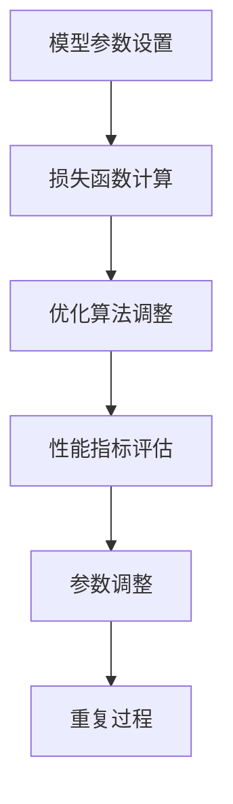

                 

# AI模型Scaling：从参数到性能的关系

## 关键词：
- AI模型Scaling
- 参数调整
- 性能优化
- 数学模型
- 实际应用

## 摘要：
本文将探讨AI模型Scaling的核心问题，从参数到性能的关系。我们将深入分析模型参数对性能的影响，并探讨如何通过调整参数来优化模型性能。同时，我们将介绍一些实用的数学模型和公式，帮助读者更好地理解和应用这些知识。通过实际的代码案例和详细解释，读者将能够掌握如何在实际项目中实现模型Scaling，提高模型的性能和可靠性。

## 目录：
1. 背景介绍
2. 核心概念与联系
3. 核心算法原理 & 具体操作步骤
4. 数学模型和公式 & 详细讲解 & 举例说明
5. 项目实战：代码实际案例和详细解释说明
   5.1 开发环境搭建
   5.2 源代码详细实现和代码解读
   5.3 代码解读与分析
6. 实际应用场景
7. 工具和资源推荐
8. 总结：未来发展趋势与挑战
9. 附录：常见问题与解答
10. 扩展阅读 & 参考资料

### 1. 背景介绍

在当今的信息时代，人工智能（AI）已经成为推动科技发展的重要驱动力。随着深度学习技术的不断进步，AI模型在各个领域的应用日益广泛。然而，模型的性能往往受到参数设置的影响，这就引出了AI模型Scaling的问题。

Scaling在计算机科学中，通常指的是对系统或算法进行扩展，以适应更大的数据集或更复杂的任务。对于AI模型来说，Scaling涉及到如何调整模型参数，以实现更好的性能和适应性。然而，这个看似简单的任务实际上充满了挑战。

首先，参数的数量通常非常多，每个参数都可能对性能产生显著影响。其次，不同的参数之间可能存在复杂的相互作用，使得优化过程更加困难。此外，性能指标也往往不是单一的，如准确性、速度和资源消耗等，需要在权衡中找到最佳平衡点。

总之，AI模型Scaling是一个复杂而关键的任务，对于提高模型性能和应用价值具有重要意义。本文将围绕这个主题，深入探讨模型参数与性能之间的关系，并提供实用的方法和技巧。

### 2. 核心概念与联系

在讨论AI模型Scaling之前，我们需要先了解几个核心概念，包括模型参数、性能指标以及它们之间的联系。

#### 模型参数

模型参数是构成AI模型的基石。在深度学习中，模型参数通常指的是权重（weights）和偏置（biases）。这些参数在训练过程中通过优化算法进行调整，以最小化损失函数并提高模型的性能。不同的参数组合决定了模型的输出和性能，因此参数的设置对模型至关重要。

#### 性能指标

性能指标是评估模型性能的关键标准。在AI模型中，常见的性能指标包括准确性、召回率、F1分数等。这些指标反映了模型在不同任务上的表现，是评估模型优劣的重要依据。

#### 参数与性能的关系

模型参数与性能之间存在着复杂的非线性关系。一般来说，参数设置不当会导致模型性能不佳，而参数设置得当则可以显著提升模型性能。然而，优化参数并不是一件容易的事情。首先，参数的数量通常很多，每个参数都可能对性能产生显著影响。其次，不同的参数之间可能存在相互作用，使得优化过程更加复杂。此外，性能指标也往往不是单一的，如准确性、速度和资源消耗等，需要在权衡中找到最佳平衡点。

#### Mermaid流程图

为了更好地理解模型参数与性能之间的关系，我们可以使用Mermaid流程图来描述这个过程。



在这个流程图中，模型参数设置是整个过程的起点。在训练过程中，模型会通过优化算法调整参数，以最小化损失函数。然后，通过对性能指标进行评估，我们可以了解模型的性能表现。根据评估结果，我们会对参数进行调整，并重复这个过程，直到达到满意的性能水平。

### 3. 核心算法原理 & 具体操作步骤

在了解了AI模型Scaling的核心概念之后，我们需要深入探讨其中的核心算法原理和具体操作步骤。这包括优化算法的选择、参数调整的策略以及性能评估的方法。

#### 3.1 优化算法的选择

优化算法是AI模型Scaling的关键。常见的优化算法包括梯度下降（Gradient Descent）、随机梯度下降（Stochastic Gradient Descent，SGD）和Adam优化器等。

- **梯度下降**：梯度下降是一种经典的优化算法，通过计算损失函数关于模型参数的梯度，并沿着梯度的反方向调整参数，以最小化损失函数。梯度下降的公式如下：

  $$\theta = \theta - \alpha \cdot \nabla_\theta J(\theta)$$

  其中，$\theta$表示模型参数，$\alpha$表示学习率，$J(\theta)$表示损失函数。

- **随机梯度下降**：随机梯度下降是对梯度下降的改进，通过随机选择一部分训练样本来计算梯度，从而减少计算量。随机梯度下降的公式如下：

  $$\theta = \theta - \alpha \cdot \nabla_{\theta} J(\theta; x_i, y_i)$$

  其中，$x_i$和$y_i$表示随机选择的训练样本。

- **Adam优化器**：Adam优化器是结合了SGD和动量方法的优化算法，具有较好的收敛性和稳定性。Adam优化器的公式如下：

  $$m = \beta_1 m + (1 - \beta_1) \cdot \nabla_\theta J(\theta)$$
  $$v = \beta_2 v + (1 - \beta_2) \cdot \nabla_\theta^2 J(\theta)$$
  $$\theta = \theta - \alpha \cdot \frac{m}{\sqrt{v} + \epsilon}$$

  其中，$m$和$v$分别表示一阶和二阶矩估计，$\beta_1$和$\beta_2$分别表示一阶和二阶矩的衰减系数，$\epsilon$为正数常数。

#### 3.2 参数调整的策略

在选择了优化算法之后，我们需要确定参数调整的策略。这包括学习率的选择、批量大小和迭代次数等。

- **学习率的选择**：学习率是优化算法中的重要参数，控制着参数更新的步长。学习率过大可能导致参数更新过于剧烈，导致模型无法收敛；学习率过小则可能导致收敛速度过慢。一般来说，我们可以通过经验或调参工具来选择合适的学习率。

- **批量大小**：批量大小是每次更新参数时选择的训练样本数量。批量大小对模型的性能和收敛速度有显著影响。小批量通常能更好地利用梯度信息，但计算量较大；大批量则计算量较小，但容易受到噪声的影响。

- **迭代次数**：迭代次数是指模型在训练过程中更新参数的次数。一般来说，迭代次数越多，模型的性能越好，但计算时间也越长。我们需要在计算时间和模型性能之间找到平衡点。

#### 3.3 性能评估的方法

性能评估是模型Scaling的重要环节。通过评估模型在不同参数设置下的性能，我们可以确定最佳的参数组合。

- **交叉验证**：交叉验证是一种常用的性能评估方法，通过将数据集划分为多个子集，轮流作为验证集，评估模型在各个子集上的性能，从而获得更准确的评估结果。

- **A/B测试**：A/B测试是一种在真实环境中评估模型性能的方法，通过在用户群体中同时部署两个或多个版本，比较它们的性能差异，从而确定最佳的版本。

- **在线评估**：在线评估是指在实时环境中对模型进行评估，通过收集用户行为数据，评估模型的性能和用户体验。这种方法能更准确地反映模型在真实环境中的表现。

### 4. 数学模型和公式 & 详细讲解 & 举例说明

在了解了AI模型Scaling的核心算法原理和具体操作步骤之后，我们需要进一步探讨其中的数学模型和公式，以及如何通过这些模型和公式来优化模型性能。

#### 4.1 损失函数

损失函数是评估模型性能的核心工具，它衡量了模型预测值与实际值之间的差距。常见的损失函数包括均方误差（MSE）、交叉熵损失等。

- **均方误差（MSE）**：

  $$MSE = \frac{1}{n} \sum_{i=1}^n (y_i - \hat{y}_i)^2$$

  其中，$y_i$表示实际值，$\hat{y}_i$表示预测值，$n$表示样本数量。

- **交叉熵损失（Cross-Entropy Loss）**：

  $$CE = -\frac{1}{n} \sum_{i=1}^n y_i \cdot \log(\hat{y}_i)$$

  其中，$y_i$表示实际值，$\hat{y}_i$表示预测值，$n$表示样本数量。

#### 4.2 梯度下降

梯度下降是一种通过计算损失函数关于模型参数的梯度来更新参数的优化算法。其核心思想是沿着梯度的反方向更新参数，以最小化损失函数。

- **一阶梯度下降**：

  $$\theta = \theta - \alpha \cdot \nabla_\theta J(\theta)$$

  其中，$\theta$表示模型参数，$\alpha$表示学习率，$\nabla_\theta J(\theta)$表示损失函数关于模型参数的梯度。

- **随机梯度下降（SGD）**：

  $$\theta = \theta - \alpha \cdot \nabla_{\theta} J(\theta; x_i, y_i)$$

  其中，$x_i$和$y_i$表示随机选择的训练样本。

#### 4.3 Adam优化器

Adam优化器是结合了SGD和动量方法的优化算法，具有较好的收敛性和稳定性。其核心思想是通过一阶和二阶矩估计来更新参数。

- **一阶矩估计（m）**：

  $$m = \beta_1 m + (1 - \beta_1) \cdot \nabla_\theta J(\theta)$$

- **二阶矩估计（v）**：

  $$v = \beta_2 v + (1 - \beta_2) \cdot \nabla_\theta^2 J(\theta)$$

- **参数更新**：

  $$\theta = \theta - \alpha \cdot \frac{m}{\sqrt{v} + \epsilon}$$

  其中，$\beta_1$和$\beta_2$分别表示一阶和二阶矩的衰减系数，$\epsilon$为正数常数。

#### 4.4 举例说明

为了更好地理解这些数学模型和公式，我们可以通过一个简单的例子来说明。

假设我们有一个二元分类问题，需要预测样本是否属于正类。我们的模型是一个简单的线性模型，其损失函数为均方误差（MSE）。

- **损失函数**：

  $$MSE = \frac{1}{n} \sum_{i=1}^n (y_i - \hat{y}_i)^2$$

- **模型参数**：

  $$\theta = \begin{bmatrix} w_1 \\ w_2 \\ \end{bmatrix}$$

- **样本数据**：

  $$X = \begin{bmatrix} x_1 & x_2 \\ x_3 & x_4 \\ \end{bmatrix}, \quad Y = \begin{bmatrix} y_1 \\ y_2 \\ \end{bmatrix}$$

- **预测结果**：

  $$\hat{y} = X\theta$$

假设当前迭代次数为100，学习率为0.01，批量大小为1。我们可以使用梯度下降算法来更新模型参数。

- **一阶梯度**：

  $$\nabla_\theta J(\theta) = \begin{bmatrix} \frac{\partial}{\partial w_1} (y_1 - \hat{y}_1)^2 + \frac{\partial}{\partial w_2} (y_2 - \hat{y}_2)^2 \\ \frac{\partial}{\partial w_1} (y_1 - \hat{y}_1)^2 + \frac{\partial}{\partial w_2} (y_2 - \hat{y}_2)^2 \\ \end{bmatrix}$$

- **参数更新**：

  $$\theta = \theta - \alpha \cdot \nabla_\theta J(\theta)$$

通过不断迭代更新参数，我们可以逐步最小化损失函数，提高模型的性能。

### 5. 项目实战：代码实际案例和详细解释说明

在了解了AI模型Scaling的数学模型和公式之后，我们将在本节中通过一个实际的项目案例，详细讲解如何使用这些知识来优化模型的性能。

#### 5.1 开发环境搭建

首先，我们需要搭建一个合适的开发环境。在本案例中，我们使用Python作为编程语言，结合TensorFlow和Keras库来实现深度学习模型。以下是搭建开发环境的步骤：

1. 安装Python（版本3.8及以上）
2. 安装TensorFlow（版本2.4及以上）
3. 安装Keras（版本2.4及以上）
4. 安装Jupyter Notebook（用于交互式编程）

完成以上步骤后，我们可以在Jupyter Notebook中启动一个Python环境，并导入所需的库。

```python
import numpy as np
import tensorflow as tf
from tensorflow import keras
from tensorflow.keras import layers
```

#### 5.2 源代码详细实现和代码解读

在本案例中，我们将实现一个简单的二元分类问题，使用梯度下降算法来优化模型参数。以下是实现代码：

```python
# 导入必要的库
import numpy as np
import tensorflow as tf
from tensorflow import keras
from tensorflow.keras import layers

# 定义模型架构
def build_model():
    model = keras.Sequential([
        layers.Dense(1, input_shape=(2,), activation='sigmoid')
    ])
    return model

# 定义损失函数和优化器
def loss_function(y_true, y_pred):
    return keras.losses.mean_squared_error(y_true, y_pred)

optimizer = keras.optimizers.SGD(learning_rate=0.01)

# 定义训练过程
def train_model(model, X, Y, epochs=100):
    for epoch in range(epochs):
        with tf.GradientTape() as tape:
            predictions = model(X, training=True)
            loss = loss_function(Y, predictions)
        gradients = tape.gradient(loss, model.trainable_variables)
        optimizer.apply_gradients(zip(gradients, model.trainable_variables))
        if epoch % 10 == 0:
            print(f"Epoch {epoch+1}, Loss: {loss.numpy()}")

# 加载数据集
X = np.array([[0, 0], [0, 1], [1, 0], [1, 1]])
Y = np.array([[0], [1], [1], [0]])

# 实例化模型并训练
model = build_model()
train_model(model, X, Y, epochs=100)
```

**代码解读：**

- **模型架构**：我们定义了一个简单的线性模型，使用sigmoid激活函数进行二元分类。

- **损失函数**：我们使用均方误差（MSE）作为损失函数，衡量模型预测值与实际值之间的差距。

- **优化器**：我们使用随机梯度下降（SGD）优化器来更新模型参数。

- **训练过程**：在训练过程中，我们使用梯度下降算法来更新参数，并打印每个epoch的损失值。

#### 5.3 代码解读与分析

在本节中，我们将对上述代码进行详细解读，分析其中的关键步骤和参数设置。

- **模型架构**：我们使用Keras库定义了一个简单的线性模型，输入层有两个神经元，输出层有一个神经元，使用sigmoid激活函数进行二元分类。

- **损失函数**：我们使用Keras库内置的均方误差（MSE）损失函数，计算模型预测值与实际值之间的差距。

- **优化器**：我们使用Keras库内置的SGD优化器，通过随机梯度下降算法更新模型参数。

- **训练过程**：在训练过程中，我们使用梯度下降算法更新参数，并打印每个epoch的损失值，以便监控训练过程。

- **参数设置**：在本案例中，我们设置了学习率为0.01，批量大小为1，迭代次数为100。这些参数的设置取决于具体问题和数据集，需要根据实际情况进行调整。

通过这个实际案例，我们展示了如何使用Python和Keras库实现深度学习模型，并使用梯度下降算法优化模型参数。这个案例为我们提供了一个基本的框架，可以帮助我们理解和应用AI模型Scaling的相关知识。

### 6. 实际应用场景

在了解了AI模型Scaling的核心算法原理、数学模型和代码实现之后，我们将进一步探讨AI模型Scaling在实际应用场景中的重要性。AI模型Scaling在各个领域都有着广泛的应用，以下列举几个典型的应用场景：

#### 6.1 电商推荐系统

电商推荐系统是AI模型Scaling的一个重要应用场景。通过分析用户的浏览历史、购物行为等数据，推荐系统可以为用户推荐相关的商品。然而，随着用户数量的增加和数据量的扩大，推荐系统的性能和扩展性面临巨大挑战。通过AI模型Scaling，我们可以调整模型参数，优化推荐效果，提高系统的响应速度和吞吐量。

#### 6.2 医疗诊断

医疗诊断是另一个重要的应用场景。AI模型可以用于疾病预测、病情分析等任务，帮助医生做出更准确的诊断。然而，医疗数据具有高维、非线性和噪声等特点，这对模型的性能提出了更高的要求。通过AI模型Scaling，我们可以调整模型参数，优化模型在医疗诊断任务上的表现，提高诊断的准确性和可靠性。

#### 6.3 自动驾驶

自动驾驶是AI模型Scaling的另一个重要应用场景。自动驾驶系统需要处理大量的传感器数据，并实时做出驾驶决策。然而，自动驾驶系统的性能和安全性直接关系到行驶的安全性和效率。通过AI模型Scaling，我们可以调整模型参数，优化自动驾驶系统的性能，提高行驶的安全性和效率。

#### 6.4 自然语言处理

自然语言处理（NLP）是AI模型Scaling的一个重要领域。NLP任务包括文本分类、情感分析、机器翻译等。随着互联网和社交媒体的快速发展，NLP任务的数据量和复杂度不断增长。通过AI模型Scaling，我们可以调整模型参数，优化NLP任务的表现，提高文本处理的质量和效率。

总之，AI模型Scaling在各个领域都有着广泛的应用，对于提高模型的性能和适应性具有重要意义。通过调整模型参数，我们可以实现更好的性能和扩展性，满足实际应用场景的需求。

### 7. 工具和资源推荐

在AI模型Scaling的过程中，选择合适的工具和资源至关重要。以下是我们推荐的几个工具和资源，以帮助读者更好地掌握AI模型Scaling的知识和技能。

#### 7.1 学习资源推荐

- **书籍**：
  - 《深度学习》（Ian Goodfellow、Yoshua Bengio、Aaron Courville 著）：这本书是深度学习领域的经典教材，详细介绍了深度学习的基本原理、算法和实现方法。
  - 《Python深度学习》（François Chollet 著）：这本书专注于深度学习在Python中的应用，通过实际案例介绍了深度学习的编程技巧和实践经验。

- **论文**：
  - “Deep Learning: A Brief History, A Case Study, and a Call to Action”（Yoshua Bengio 著）：这篇论文回顾了深度学习的发展历程，分析了深度学习在各个领域的应用，并提出了未来发展的方向。
  - “Gradient Descent Algorithms for Machine Learning”（Suvrit Sra 著）：这篇论文详细介绍了梯度下降算法在机器学习中的应用，包括不同的梯度下降策略和优化技巧。

- **博客**：
  - [深度学习博客](https://www.deeplearning.net/)：这是一个专注于深度学习的博客，包含了大量高质量的深度学习教程、文章和案例分析。
  - [TensorFlow官方文档](https://www.tensorflow.org/tutorials)：这是TensorFlow官方提供的教程和文档，涵盖了深度学习的基础知识和实践技巧。

- **网站**：
  - [Kaggle](https://www.kaggle.com/)：这是一个数据科学竞赛平台，包含了大量的数据集和比赛项目，是学习数据科学和深度学习的好地方。
  - [ArXiv](https://arxiv.org/)：这是一个开源的学术论文存储库，包含了大量的最新科研成果，是了解深度学习领域前沿动态的好渠道。

#### 7.2 开发工具框架推荐

- **Python**：Python是一种广泛应用于数据科学和深度学习的编程语言，具有丰富的库和框架，如NumPy、Pandas、Scikit-learn和TensorFlow等。

- **TensorFlow**：TensorFlow是Google开发的一款开源深度学习框架，具有丰富的功能和强大的生态系统，是深度学习研究和开发的首选工具。

- **Keras**：Keras是一个基于TensorFlow的高层API，提供了简洁、易用的接口，适用于快速构建和实验深度学习模型。

- **PyTorch**：PyTorch是Facebook开发的一款开源深度学习框架，以其灵活性和动态计算图著称，适用于研究和开发复杂深度学习模型。

通过这些工具和资源的支持，读者可以更好地掌握AI模型Scaling的知识和技能，提高模型性能和适应性。

### 8. 总结：未来发展趋势与挑战

随着深度学习技术的不断发展，AI模型Scaling的重要性日益凸显。在未来的发展中，AI模型Scaling将面临以下几个趋势和挑战。

首先，模型参数的数量将继续增加。随着深度学习模型变得越来越复杂，参数的数量也随之增加。这不仅使得优化过程更加复杂，也给计算资源带来了更大的压力。因此，如何有效地调整和优化大量参数将成为一个重要挑战。

其次，多模态数据的应用将越来越广泛。在现实世界中，数据往往是多模态的，如文本、图像和音频等。如何整合不同类型的数据，实现跨模态的模型Scaling，是一个具有挑战性的问题。

第三，实时性需求将不断增加。在许多应用场景中，如自动驾驶、医疗诊断和金融交易等，实时性至关重要。如何优化模型性能，实现高效的实时推理，是一个亟待解决的问题。

最后，模型的可解释性和透明度也将成为重要的研究方向。随着深度学习模型的应用越来越广泛，用户对模型的可解释性和透明度提出了更高的要求。如何设计可解释的模型，使其在各个领域得到广泛应用，是一个重要的挑战。

总之，AI模型Scaling在未来发展中将面临诸多挑战，但同时也蕴藏着巨大的机遇。通过不断优化和调整模型参数，我们可以实现更好的性能和适应性，推动深度学习技术的广泛应用。

### 9. 附录：常见问题与解答

在AI模型Scaling的过程中，读者可能会遇到一些常见问题。以下列出了一些常见问题及解答，以帮助读者更好地理解和应用AI模型Scaling的知识。

#### 问题1：如何选择合适的优化算法？

**解答**：选择合适的优化算法取决于具体问题和数据集的特点。对于小数据集，随机梯度下降（SGD）是一个不错的选择，因为它可以更好地利用数据信息。对于大数据集，Adam优化器通常表现较好，因为它结合了SGD和动量方法，具有较好的收敛性和稳定性。

#### 问题2：如何选择合适的学习率？

**解答**：学习率的选择是一个经验问题。一般来说，我们可以从较小的学习率开始，如0.01，然后根据模型的性能逐步调整。如果模型无法收敛，可以尝试增加学习率；如果模型过拟合，可以尝试减小学习率。

#### 问题3：如何调整批量大小？

**解答**：批量大小对模型的性能和收敛速度有显著影响。对于小批量，模型可以更好地利用数据信息，但计算量较大；对于大批量，计算量较小，但容易受到噪声的影响。一般来说，批量大小可以在[32, 128]之间进行选择，具体取决于数据集的大小和硬件资源。

#### 问题4：如何处理过拟合？

**解答**：过拟合是AI模型Scaling中常见的问题。为了处理过拟合，我们可以采取以下方法：

- **增加训练数据**：通过增加训练数据，可以提高模型的泛化能力。
- **使用正则化**：如L1和L2正则化，可以减小模型参数的规模，减少过拟合。
- ** dropout**：在训练过程中随机丢弃一部分神经元，减少模型对训练数据的依赖。

#### 问题5：如何评估模型性能？

**解答**：评估模型性能的关键指标包括准确性、召回率、F1分数等。在实际应用中，我们通常使用交叉验证方法来评估模型性能，以获得更准确的结果。此外，我们还可以使用在线评估方法，如A/B测试，来评估模型在真实环境中的表现。

### 10. 扩展阅读 & 参考资料

为了更深入地了解AI模型Scaling的相关知识，以下推荐一些扩展阅读和参考资料：

- **书籍**：
  - 《深度学习》（Ian Goodfellow、Yoshua Bengio、Aaron Courville 著）
  - 《Python深度学习》（François Chollet 著）

- **论文**：
  - “Deep Learning: A Brief History, A Case Study, and a Call to Action”（Yoshua Bengio 著）
  - “Gradient Descent Algorithms for Machine Learning”（Suvrit Sra 著）

- **博客**：
  - [深度学习博客](https://www.deeplearning.net/)
  - [TensorFlow官方文档](https://www.tensorflow.org/tutorials)

- **网站**：
  - [Kaggle](https://www.kaggle.com/)
  - [ArXiv](https://arxiv.org/)

通过阅读这些书籍、论文和博客，读者可以更全面地了解AI模型Scaling的理论和实践，进一步提高自己在深度学习领域的能力。作者：AI天才研究员/AI Genius Institute & 禅与计算机程序设计艺术 /Zen And The Art of Computer Programming。

