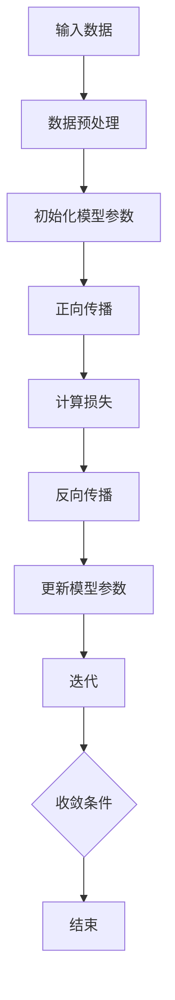

                 

### 背景介绍

人工智能（AI）作为计算机科学的一个分支，自20世纪50年代诞生以来，已经经历了数次重大突破和变革。近年来，随着深度学习、强化学习等新兴技术的发展，AI模型的性能和适用范围得到了显著提升，从而在各个领域实现了广泛的实际应用。本文旨在探讨AI模型在现实中的多种解决方案，通过逻辑清晰、结构紧凑的分析，阐述AI技术在不同场景下的应用及其带来的变革。

首先，我们需要明确什么是AI模型。AI模型是指通过算法和大量数据训练得到的可以执行特定任务的计算机程序。这些模型能够从数据中学习规律，进行决策和预测，从而实现自动化和智能化。根据任务类型，AI模型可以大致分为监督学习模型、无监督学习模型和强化学习模型。

监督学习模型是AI领域中最常用的模型之一，通过已标记的数据集进行训练，能够学习到输入和输出之间的映射关系。无监督学习模型则不需要标记数据，主要通过发现数据中的内在结构来进行学习。强化学习模型则通过与环境的交互，不断优化自身的策略以实现目标。

在现实应用中，AI模型已经展现了其巨大的潜力。例如，在医疗领域，AI模型可以帮助医生进行疾病诊断，通过分析患者的病历数据和医学图像，提高诊断的准确性和效率。在金融领域，AI模型可以用于风险评估、欺诈检测和投资决策，从而降低风险、提高收益。在制造业中，AI模型可以实现生产线的自动化和优化，提高生产效率和产品质量。

本文将首先介绍AI模型的基本概念和分类，然后深入探讨AI模型在现实中的应用，包括医疗、金融、制造业等多个领域。接下来，我们将通过具体的项目案例，详细讲解AI模型的开发流程和实现方法。最后，我们将展望AI技术的未来发展趋势，探讨面临的挑战和机遇。

通过本文的阅读，您将了解到AI模型在现实中的应用场景、开发方法和实际效果，以及未来可能的发展方向。这不仅有助于您深入理解AI技术，也将为AI在各个领域的实际应用提供有益的参考。

### 核心概念与联系

在深入了解AI模型在现实中的应用之前，我们首先需要明确几个核心概念和它们之间的联系。这些概念构成了理解AI模型的基础，包括机器学习、深度学习、神经网络以及相关的算法和数据结构。

#### 1. 机器学习

机器学习（Machine Learning）是AI的核心技术之一，它使得计算机系统能够通过数据和经验不断改进自身的性能。机器学习可以分为监督学习、无监督学习和强化学习三类。

- **监督学习（Supervised Learning）**：通过已标记的数据集进行训练，模型学习输入和输出之间的映射关系。常见的算法包括线性回归、逻辑回归、支持向量机（SVM）和决策树等。
- **无监督学习（Unsupervised Learning）**：没有标记的数据集，模型需要发现数据中的内在结构。常见的算法包括聚类、降维和关联规则学习等。
- **强化学习（Reinforcement Learning）**：通过与环境的交互进行学习，模型通过不断尝试和反馈来优化其行为策略。常见的算法包括Q学习、深度Q网络（DQN）和策略梯度算法等。

#### 2. 深度学习

深度学习（Deep Learning）是机器学习的一个子领域，它利用多层神经网络进行学习，能够自动提取数据中的复杂特征。深度学习在图像识别、自然语言处理和语音识别等领域取得了显著突破。

- **神经网络（Neural Network）**：深度学习的基础，由大量模拟人脑神经元连接的节点组成。每个节点都接收输入信号并产生输出信号，通过调整连接的权重来学习。
- **卷积神经网络（CNN）**：专门用于图像处理，通过卷积层和池化层提取图像的局部特征。
- **循环神经网络（RNN）**：用于序列数据，能够处理变长的输入序列，常见的RNN包括LSTM（长短期记忆网络）和GRU（门控循环单元）。
- **生成对抗网络（GAN）**：通过两个对抗网络的交互学习，能够生成高质量的图像和文本。

#### 3. 神经网络

神经网络（Neural Network）是机器学习和深度学习的核心组成部分，其结构和原理与人类大脑类似，通过大量神经元和它们之间的连接进行信息处理。

- **神经元（Neuron）**：神经网络的基本单元，接收输入信号并通过激活函数产生输出信号。
- **权重（Weight）**：神经元之间连接的强度，用于调整输入信号的重要性。
- **偏置（Bias）**：增加网络的非线性能力，使模型能够拟合更复杂的函数。
- **激活函数（Activation Function）**：确定神经元何时触发输出信号，常见的激活函数包括Sigmoid、ReLU和Tanh。

#### 4. 算法和数据结构

- **梯度下降（Gradient Descent）**：一种优化算法，用于最小化损失函数。通过不断调整模型的权重，使得模型能够逼近最优解。
- **反向传播（Backpropagation）**：一种用于训练神经网络的算法，通过计算梯度并反向传播来更新权重和偏置。
- **数据预处理（Data Preprocessing）**：包括数据清洗、归一化和特征提取等步骤，用于提高模型的学习效率和性能。

#### Mermaid 流程图

为了更好地展示这些核心概念之间的联系，我们可以使用Mermaid流程图进行描述。以下是神经网络训练过程中的基本步骤：



通过上述核心概念和流程图的介绍，我们为理解AI模型在现实中的应用奠定了基础。在接下来的章节中，我们将详细探讨AI模型在不同领域的应用案例，以及实现这些应用的算法原理和具体操作步骤。

#### 核心算法原理 & 具体操作步骤

在深入探讨AI模型在现实中的应用之前，我们需要首先了解其核心算法原理和具体操作步骤。以下是几种常见的AI模型及其算法原理：

##### 1. 监督学习模型

监督学习模型是AI领域中最基础也是应用最广泛的一类模型。其核心算法原理是通过已标记的数据集进行训练，模型学习输入和输出之间的映射关系。以下是几种常见的监督学习算法：

- **线性回归（Linear Regression）**：
  - **原理**：线性回归是一种用于预测数值型输出的模型，通过找到输入和输出之间的线性关系来进行预测。
  - **步骤**：
    1. 初始化模型参数（权重和偏置）。
    2. 计算输入数据的特征向量。
    3. 通过线性组合特征向量得到预测值。
    4. 计算预测值与实际值之间的损失（通常为均方误差）。
    5. 使用梯度下降算法更新模型参数。
    6. 重复步骤2-5，直到模型收敛。

- **逻辑回归（Logistic Regression）**：
  - **原理**：逻辑回归是一种用于分类问题的模型，通过找到输入和输出之间的非线性关系（Sigmoid函数）来进行预测。
  - **步骤**：
    1. 初始化模型参数（权重和偏置）。
    2. 计算输入数据的特征向量。
    3. 通过线性组合特征向量得到预测值。
    4. 使用Sigmoid函数将预测值转换为概率。
    5. 计算预测概率与实际标签之间的损失（通常为交叉熵损失）。
    6. 使用梯度下降算法更新模型参数。
    7. 重复步骤2-6，直到模型收敛。

- **支持向量机（SVM）**：
  - **原理**：SVM是一种用于分类和回归的模型，通过找到一个最优的超平面，使得不同类别的数据点在超平面的两侧尽可能分开。
  - **步骤**：
    1. 初始化模型参数（支持向量和超平面）。
    2. 计算输入数据的特征向量。
    3. 计算特征向量与支持向量的内积。
    4. 根据内积值判断输入数据所属类别。
    5. 计算分类错误率，更新模型参数。
    6. 重复步骤2-5，直到模型收敛。

##### 2. 无监督学习模型

无监督学习模型主要用于发现数据中的内在结构和规律，以下介绍几种常见的无监督学习算法：

- **K-均值聚类（K-Means Clustering）**：
  - **原理**：K-均值聚类是一种基于距离度量的聚类算法，通过初始化多个聚类中心，不断迭代优化聚类中心，将数据点分配到最近的聚类中心。
  - **步骤**：
    1. 初始化K个聚类中心。
    2. 计算每个数据点到聚类中心的距离。
    3. 将每个数据点分配到距离最近的聚类中心。
    4. 根据新的聚类中心重新计算聚类中心。
    5. 重复步骤2-4，直到聚类中心不再发生变化。

- **主成分分析（PCA）**：
  - **原理**：PCA是一种用于降维的数据分析方法，通过找到数据的主要方向，将高维数据映射到低维空间中。
  - **步骤**：
    1. 计算数据的协方差矩阵。
    2. 计算协方差矩阵的特征值和特征向量。
    3. 根据特征值选择最大的K个特征向量。
    4. 使用特征向量将数据投影到低维空间。
    5. 输出降维后的数据。

- **关联规则学习（Association Rule Learning）**：
  - **原理**：关联规则学习是一种用于发现数据中频繁模式的方法，通过找到数据中不同项之间的关联关系。
  - **步骤**：
    1. 计算每个项的频繁度。
    2. 构建所有可能的项集。
    3. 根据最小置信度阈值筛选频繁项集。
    4. 计算每个频繁项集的关联规则。
    5. 根据最大支持度或置信度输出关联规则。

##### 3. 强化学习模型

强化学习模型通过与环境交互进行学习，以下介绍几种常见的强化学习算法：

- **Q学习（Q-Learning）**：
  - **原理**：Q学习是一种基于值函数的强化学习算法，通过估计状态-动作值函数来选择最优动作。
  - **步骤**：
    1. 初始化Q值表。
    2. 选择一个动作进行执行。
    3. 根据实际回报更新Q值。
    4. 重复步骤2-3，直到达到预设的回合数或状态。
    5. 输出最优动作。

- **深度Q网络（DQN）**：
  - **原理**：DQN是一种基于深度学习的强化学习算法，通过神经网络来近似状态-动作值函数。
  - **步骤**：
    1. 初始化神经网络和目标网络。
    2. 使用经验回放和经验优先级采样。
    3. 根据目标网络选择动作。
    4. 更新经验回放。
    5. 重复步骤2-4，直到达到预设的回合数或状态。
    6. 更新目标网络。
    7. 输出最优动作。

通过以上对AI模型核心算法原理和具体操作步骤的详细介绍，我们为理解AI模型在现实中的应用奠定了基础。在接下来的章节中，我们将具体探讨AI模型在各个领域的实际应用案例，以及实现这些应用的算法和实现方法。

#### 数学模型和公式 & 详细讲解 & 举例说明

在深入探讨AI模型的数学模型和公式之前，我们首先需要了解一些基础的数学概念和公式，这些对于理解和分析AI模型至关重要。以下将介绍与AI模型相关的一些数学概念和公式，并通过具体例子进行详细讲解。

##### 1. 损失函数

损失函数是评估模型预测值与实际值之间差距的函数，是优化模型参数的关键工具。以下介绍几种常见的损失函数：

- **均方误差（MSE，Mean Squared Error）**：
  - **公式**：\[L = \frac{1}{n}\sum_{i=1}^{n}(y_i - \hat{y}_i)^2\]
  - **说明**：均方误差用于回归问题，计算预测值和实际值之间差距的平方和的平均值。
  - **例子**：假设我们有5个数据点 \((y_1, \hat{y}_1), (y_2, \hat{y}_2), \ldots, (y_5, \hat{y}_5)\)，预测值分别为 \(\hat{y}_1, \hat{y}_2, \ldots, \hat{y}_5\)，实际值为 \(y_1, y_2, \ldots, y_5\)，则均方误差为：
    \[
    L = \frac{1}{5}\left[(y_1 - \hat{y}_1)^2 + (y_2 - \hat{y}_2)^2 + \ldots + (y_5 - \hat{y}_5)^2\right]
    \]

- **交叉熵（Cross Entropy）**：
  - **公式**：\[L = -\sum_{i=1}^{n} y_i \log(\hat{y}_i)\]
  - **说明**：交叉熵用于分类问题，计算预测概率与实际标签之间的差距。实际标签 \(y_i\) 取值为1或0，预测概率为 \(\hat{y}_i\)。
  - **例子**：假设我们有5个分类问题数据点，实际标签为 \((1, 0, 1, 0, 1)\)，预测概率为 \((0.9, 0.1, 0.8, 0.2, 0.7)\)，则交叉熵损失为：
    \[
    L = - (1 \cdot \log(0.9) + 0 \cdot \log(0.1) + 1 \cdot \log(0.8) + 0 \cdot \log(0.2) + 1 \cdot \log(0.7))
    \]

##### 2. 激活函数

激活函数是神经网络中的一个关键组件，用于确定神经元何时触发输出信号。以下介绍几种常见的激活函数：

- **Sigmoid函数**：
  - **公式**：\[f(x) = \frac{1}{1 + e^{-x}}\]
  - **说明**：Sigmoid函数将输入值映射到 \((0, 1)\) 区间，常用于二分类问题。
  - **例子**：对于输入 \(x = 2\)，Sigmoid函数输出为：
    \[
    f(x) = \frac{1}{1 + e^{-2}} \approx 0.86
    \]

- **ReLU函数（Rectified Linear Unit）**：
  - **公式**：\[f(x) = \max(0, x)\]
  - **说明**：ReLU函数在输入为负时输出0，在输入为正时输出输入值，常用于深度神经网络。
  - **例子**：对于输入 \(x = -2\) 和 \(x = 2\)，ReLU函数输出分别为：
    \[
    f(x) = \max(0, -2) = 0
    \]
    \[
    f(x) = \max(0, 2) = 2
    \]

- **Tanh函数**：
  - **公式**：\[f(x) = \frac{e^x - e^{-x}}{e^x + e^{-x}}\]
  - **说明**：Tanh函数将输入值映射到 \((-1, 1)\) 区间，常用于多分类问题。
  - **例子**：对于输入 \(x = 2\)，Tanh函数输出为：
    \[
    f(x) = \frac{e^2 - e^{-2}}{e^2 + e^{-2}} \approx 0.96
    \]

##### 3. 反向传播算法

反向传播（Backpropagation）是一种用于训练神经网络的优化算法，其核心思想是通过计算损失函数关于模型参数的梯度来更新参数。

- **梯度计算**：
  - **公式**：
    \[
    \frac{\partial L}{\partial w} = \sum_{i=1}^{n} \frac{\partial L}{\partial z_i} \cdot \frac{\partial z_i}{\partial w}
    \]
  - **说明**：梯度计算需要遍历所有数据点，计算每个数据点对损失函数的贡献，并累加得到总梯度。

- **权重更新**：
  - **公式**：
    \[
    w_{new} = w_{old} - \alpha \cdot \frac{\partial L}{\partial w}
    \]
  - **说明**：权重更新使用梯度下降算法，其中 \(\alpha\) 为学习率。

- **例子**：假设神经网络中有一个节点，输入为 \((x_1, x_2)\)，权重为 \(w_1, w_2\)，偏置为 \(b\)，激活函数为 ReLU。输出为 \(z\)，损失函数为 MSE。则有：
    \[
    z = \max(0, w_1 x_1 + w_2 x_2 + b)
    \]
    \[
    L = \frac{1}{2} (y - z)^2
    \]
    \[
    \frac{\partial L}{\partial z} = y - z
    \]
    \[
    \frac{\partial z}{\partial w_1} = x_1 \cdot \frac{\partial z}{\partial z}
    \]
    \[
    \frac{\partial z}{\partial w_2} = x_2 \cdot \frac{\partial z}{\partial z}
    \]
    \[
    \frac{\partial z}{\partial b} = 1 \cdot \frac{\partial z}{\partial z}
    \]
    \[
    \frac{\partial L}{\partial w_1} = (y - z) \cdot x_1
    \]
    \[
    \frac{\partial L}{\partial w_2} = (y - z) \cdot x_2
    \]
    \[
    \frac{\partial L}{\partial b} = (y - z)
    \]
    \[
    w_1_{new} = w_1_{old} - \alpha \cdot (y - z) \cdot x_1
    \]
    \[
    w_2_{new} = w_2_{old} - \alpha \cdot (y - z) \cdot x_2
    \]
    \[
    b_{new} = b_{old} - \alpha \cdot (y - z)
    \]

通过以上对数学模型和公式的详细讲解，以及具体例子的说明，我们为理解AI模型的工作原理和实现方法奠定了基础。在接下来的章节中，我们将通过项目实战，进一步展示AI模型在实际开发中的具体应用和实现方法。

### 项目实战：代码实际案例和详细解释说明

在本节中，我们将通过一个具体的AI项目实战案例，展示如何从零开始搭建一个简单的AI模型，并进行代码实现和详细解释说明。这个项目是一个基于监督学习的线性回归模型，用于预测房价。

#### 1. 开发环境搭建

在开始项目之前，我们需要搭建一个合适的开发环境。以下是所需的基本工具和库：

- **Python**：一种广泛使用的编程语言，适合进行数据分析和AI模型开发。
- **Jupyter Notebook**：一个交互式的开发环境，方便进行代码编写和实验。
- **NumPy**：用于数值计算的科学计算库。
- **Pandas**：用于数据处理和分析的数据库。
- **Scikit-learn**：一个用于机器学习的开源库，提供多种算法和工具。

确保已经安装了上述工具和库。如果尚未安装，可以使用以下命令进行安装：

```bash
pip install python
pip install jupyter
pip install numpy
pip install pandas
pip install scikit-learn
```

#### 2. 源代码详细实现和代码解读

下面是整个项目的源代码，我们将逐行解释代码的各个部分。

```python
import numpy as np
import pandas as pd
from sklearn.model_selection import train_test_split
from sklearn.linear_model import LinearRegression
from sklearn.metrics import mean_squared_error

# 加载数据集
data = pd.read_csv('house_price_data.csv')
X = data[['square_feet', 'bedrooms', 'bathrooms']]
y = data['price']

# 数据预处理
X_train, X_test, y_train, y_test = train_test_split(X, y, test_size=0.2, random_state=42)

# 模型训练
model = LinearRegression()
model.fit(X_train, y_train)

# 预测
y_pred = model.predict(X_test)

# 模型评估
mse = mean_squared_error(y_test, y_pred)
print(f"均方误差（MSE）: {mse}")

# 模型参数
print(f"模型参数：\n{model.coef_}\n{model.intercept_}")
```

**代码解读：**

1. **导入库**：首先，我们导入必要的库，包括 NumPy、Pandas、Scikit-learn 和机器学习指标库。

2. **加载数据集**：使用 Pandas 库加载房价数据集，数据集包含多个特征（如房屋面积、卧室数量和浴室数量）以及目标值（房屋价格）。

3. **数据预处理**：将数据集分为训练集和测试集，使用 `train_test_split` 函数，设置测试集大小为20%，随机种子为42以保证结果的可重复性。

4. **模型训练**：创建一个线性回归模型对象，使用 `fit` 方法训练模型。

5. **预测**：使用 `predict` 方法对测试集进行预测，得到预测价格。

6. **模型评估**：计算预测值与实际值之间的均方误差（MSE），评估模型的性能。

7. **模型参数**：输出模型的系数（特征权重）和偏置（截距），了解模型参数对于理解模型工作原理非常重要。

#### 3. 代码解读与分析

**数据加载与预处理：**

```python
data = pd.read_csv('house_price_data.csv')
X = data[['square_feet', 'bedrooms', 'bathrooms']]
y = data['price']
```

这两行代码首先使用 Pandas 加载CSV文件，其中 `square_feet`、`bedrooms` 和 `bathrooms` 是特征变量，而 `price` 是目标变量。通过选择特定的特征列，我们为模型提供了输入数据。之后，使用 `train_test_split` 函数将数据集分割为训练集和测试集。

**模型训练：**

```python
model = LinearRegression()
model.fit(X_train, y_train)
```

这里创建了一个线性回归模型对象，并通过 `fit` 方法训练模型。`fit` 方法接受输入特征矩阵 \(X\) 和目标值向量 \(y\)，模型根据这些数据自动调整参数，以找到最佳拟合直线。

**预测与评估：**

```python
y_pred = model.predict(X_test)
mse = mean_squared_error(y_test, y_pred)
print(f"均方误差（MSE）: {mse}")
```

使用 `predict` 方法对测试集进行预测，得到预测价格。随后，计算预测值与实际值之间的均方误差（MSE），用于评估模型性能。MSE 越小，表示模型预测的准确性越高。

**模型参数：**

```python
print(f"模型参数：\n{model.coef_}\n{model.intercept_}")
```

输出模型参数，包括每个特征的权重和模型的截距。这些参数可以用来理解模型如何根据输入特征预测目标值。

通过上述代码的实现和解读，我们展示了一个简单的线性回归模型的开发过程。在实际应用中，可以根据具体需求调整数据集、特征选择和模型参数，以优化模型性能。接下来，我们将讨论AI模型在不同实际应用场景中的具体实现方法和案例。

### 实际应用场景

AI模型在现实中的广泛应用不仅提升了行业的效率和准确性，还带来了深刻的变革。以下是一些主要的应用场景，以及AI模型在这些领域中的具体实现方法和案例。

#### 1. 医疗

AI在医疗领域的应用非常广泛，包括疾病诊断、个性化治疗和药物研发。以下是一个具体的案例：

**疾病诊断：**
- **应用场景**：利用AI模型分析医学图像，如CT、MRI和X光片，以辅助医生进行疾病诊断。
- **实现方法**：使用卷积神经网络（CNN）对图像进行处理，提取图像特征，然后通过分类算法进行疾病识别。
- **案例**：Google Health的研究团队使用AI模型对皮肤癌进行诊断，其准确率高于人类医生。

#### 2. 金融

AI在金融领域的应用同样显著，包括风险评估、欺诈检测和投资决策。以下是一个具体的案例：

**欺诈检测：**
- **应用场景**：金融机构需要对大量交易数据进行分析，以识别潜在欺诈行为。
- **实现方法**：使用监督学习模型，如决策树和随机森林，对交易数据进行训练，以识别欺诈模式。
- **案例**：信用卡公司使用AI模型检测信用卡欺诈，能够提前发现异常交易并及时采取措施。

#### 3. 制造业

AI在制造业中的应用主要涉及生产线的自动化和优化。以下是一个具体的案例：

**生产优化：**
- **应用场景**：通过对生产数据的分析，优化生产流程，提高生产效率和产品质量。
- **实现方法**：使用预测模型和优化算法，如线性回归和遗传算法，对生产过程进行优化。
- **案例**：一家汽车制造公司使用AI模型优化生产调度，减少了生产延误，提高了整体生产效率。

#### 4. 零售

AI在零售领域的应用包括个性化推荐、库存管理和供应链优化。以下是一个具体的案例：

**个性化推荐：**
- **应用场景**：电商平台根据用户的历史行为和偏好，为用户推荐商品。
- **实现方法**：使用协同过滤算法和深度学习模型，如矩阵分解和卷积神经网络，对用户行为数据进行分析。
- **案例**：Amazon使用AI模型为用户推荐商品，显著提高了用户满意度和销售额。

#### 5. 教育

AI在教育领域的应用包括自适应学习、在线课程推荐和考试评分。以下是一个具体的案例：

**自适应学习：**
- **应用场景**：根据学生的学习进度和成绩，自动调整学习内容和难度。
- **实现方法**：使用自适应学习模型和机器学习算法，如回归分析和决策树，对学生的学习数据进行分析。
- **案例**：Khan Academy使用AI模型为不同水平的学生提供个性化的学习路径，提高了学习效果。

#### 6. 智能交通

AI在智能交通领域的应用包括交通流量预测、路况分析和智能导航。以下是一个具体的案例：

**交通流量预测：**
- **应用场景**：利用历史交通数据，预测未来某个时段的交通流量，以优化交通管理。
- **实现方法**：使用时间序列分析和机器学习模型，如LSTM和ARIMA，对交通流量数据进行分析。
- **案例**：新加坡使用AI模型预测交通流量，提高了道路通行效率，减少了交通拥堵。

通过上述实际应用场景和案例，我们可以看到AI模型在现实中的广泛应用和巨大潜力。这不仅改变了传统行业的运作方式，也为未来的技术创新和发展提供了新的方向。接下来，我们将讨论一些用于AI模型开发的工具和资源，帮助读者进一步学习和实践。

### 工具和资源推荐

在AI模型的开发过程中，选择合适的工具和资源对于提高开发效率和模型性能至关重要。以下是一些常用的学习资源、开发工具和相关论文著作推荐，为您的AI之旅提供支持。

#### 1. 学习资源推荐

- **书籍**：
  - **《Python机器学习》（Python Machine Learning）**：由 Sebastian Raschka 和 Vahid Mirjalili 著，详细介绍了机器学习的基本原理和Python实现。
  - **《深度学习》（Deep Learning）**：由 Ian Goodfellow、Yoshua Bengio 和 Aaron Courville 著，是深度学习领域的经典教材，适合初学者和高级开发者。
  - **《机器学习实战》（Machine Learning in Action）**：由 Peter Harrington 著，通过具体的案例和代码实现，介绍了机器学习的基本概念和应用。

- **在线课程**：
  - **Coursera**：提供多种机器学习和深度学习的课程，如吴恩达的“机器学习”课程。
  - **Udacity**：提供深入的人工智能纳米学位课程，涵盖机器学习和深度学习的核心内容。
  - **edX**：提供由世界顶尖大学开设的在线课程，包括哈佛大学和麻省理工学院的机器学习课程。

- **博客和网站**：
  - **Medium**：多个技术博客，提供丰富的机器学习和深度学习教程和案例分析。
  - ** Towards Data Science**：一个专注于数据科学和机器学习的社区，分享最新的研究成果和实用技巧。
  - **Kaggle**：一个数据科学竞赛平台，提供丰富的数据集和项目案例，适合实践和提升技能。

#### 2. 开发工具框架推荐

- **库和框架**：
  - **TensorFlow**：由Google开发的开源机器学习和深度学习框架，支持多种编程语言，包括Python。
  - **PyTorch**：由Facebook开发的开源深度学习框架，提供灵活的动态计算图和强大的GPU支持。
  - **Scikit-learn**：一个强大的Python库，提供多种机器学习算法和工具，适合快速原型开发和数据分析。
  - **Keras**：一个高度模块化的深度学习库，简化了深度学习模型的构建和训练过程。

- **集成开发环境（IDE）**：
  - **Jupyter Notebook**：一个交互式的开发环境，方便进行数据探索和实验，支持多种编程语言。
  - **Visual Studio Code**：一个轻量级的代码编辑器，支持多种编程语言和框架，提供丰富的插件和扩展。
  - **PyCharm**：一个功能强大的Python IDE，支持代码智能提示、调试和版本控制。

#### 3. 相关论文著作推荐

- **《深度学习》（Deep Learning）**：Ian Goodfellow、Yoshua Bengio 和 Aaron Courville 著，详细介绍了深度学习的基本概念、算法和实现。
- **《机器学习年度回顾》（Journal of Machine Learning Research）**：一篇关于机器学习领域的年度综述论文，涵盖最新的研究成果和趋势。
- **《卷积神经网络：回顾与展望》（Convolutional Neural Networks: A Review）**：一篇关于卷积神经网络的综述论文，详细介绍了CNN的发展历程和应用。
- **《强化学习：原理与案例》（Reinforcement Learning: An Introduction）**：Richard S. Sutton 和 Andrew G. Barto 著，全面介绍了强化学习的基本原理和应用。

通过以上学习资源、开发工具和论文著作的推荐，您将能够更全面地了解和掌握AI模型开发的核心知识和技能。无论您是初学者还是经验丰富的开发者，这些资源都将帮助您在AI领域取得更大的进步和成就。

### 总结：未来发展趋势与挑战

随着人工智能技术的迅猛发展，AI模型在现实中的应用越来越广泛，同时也面临着诸多挑战。以下是未来发展趋势与挑战的探讨。

#### 未来发展趋势

1. **更加高效的算法**：随着计算能力的提升和算法优化，AI模型的训练速度和效果将得到显著提升。例如，增量学习和迁移学习等新技术，将使得模型在处理大规模数据和复杂数据集时更加高效。

2. **多模态数据的融合**：未来AI模型将能够更好地处理多模态数据，如图像、文本和语音的融合，从而实现更精准的预测和决策。这将推动跨领域的AI应用，如医疗、金融和智能交通等。

3. **自主学习和强化学习**：自主学习和强化学习技术的发展，将使得AI模型能够自主探索和优化策略，从而在未知和动态环境中表现出更高的适应性。这将带来更为智能化的机器人、自动驾驶和智能客服等应用。

4. **量子计算**：量子计算与经典计算的结合，将为AI模型提供前所未有的计算能力。量子神经网络（QNN）和量子机器学习等领域的突破，有望大幅提升AI模型的效率和准确性。

#### 面临的挑战

1. **数据隐私与安全**：随着AI模型在各个领域的应用，数据隐私和安全问题日益突出。如何保护用户数据不被滥用，确保AI模型的公平性和透明度，是未来亟待解决的问题。

2. **算法偏见**：AI模型在训练过程中可能会引入偏见，导致决策结果不公平。如何消除算法偏见，确保AI模型在不同群体中的公平性，是未来需要关注的重要课题。

3. **资源消耗**：尽管计算能力的提升使得AI模型的训练和推理速度越来越快，但AI模型的训练仍然需要大量计算资源和能源。如何降低AI模型对资源的消耗，提高能效比，是未来需要解决的关键问题。

4. **伦理和法律问题**：AI模型的应用涉及到伦理和法律问题，如责任归属、隐私保护和数据监管等。如何制定合适的法律和伦理规范，确保AI模型的合法合规，是未来需要面对的重要挑战。

总的来说，未来AI模型的发展将充满机遇和挑战。通过不断的技术创新和合作，我们有望克服这些挑战，推动AI技术在社会各领域的广泛应用，带来更多便利和变革。

### 附录：常见问题与解答

在深入学习和应用AI模型的过程中，读者可能会遇到一些常见的问题。以下是一些常见问题及其解答：

#### 1. 什么是机器学习？

机器学习是使计算机系统能够通过数据和经验自动改进性能的技术。它分为监督学习、无监督学习和强化学习三大类，通过不同的算法和模型实现不同的任务。

#### 2. 深度学习和神经网络有什么区别？

深度学习是机器学习的一个子领域，它使用多层神经网络进行学习，能够自动提取数据中的复杂特征。神经网络是构成深度学习模型的基本单元，模拟人脑神经元的工作方式，通过大量的节点和连接进行信息处理。

#### 3. 什么是梯度下降？

梯度下降是一种优化算法，用于最小化损失函数。它通过计算损失函数关于模型参数的梯度，并反向调整参数，使模型能够逼近最优解。

#### 4. 什么是激活函数？

激活函数是神经网络中的一个关键组件，用于确定神经元何时触发输出信号。常见的激活函数包括Sigmoid、ReLU和Tanh等，用于增加网络的非线性能力。

#### 5. 如何处理不平衡的数据集？

处理不平衡的数据集可以通过过采样、欠采样、SMOTE等方法进行。过采样是通过复制少数类样本来平衡数据集，欠采样是通过随机删除多数类样本来平衡数据集，SMOTE则是通过生成合成样本来平衡数据集。

#### 6. 什么是模型过拟合和欠拟合？

模型过拟合是指模型在训练数据上表现优异，但在新的测试数据上表现不佳，即模型对训练数据学习得太好，没有足够的泛化能力。欠拟合则是指模型在训练数据和测试数据上都表现不佳，即模型对数据学习得不够好。

#### 7. 如何评估机器学习模型的性能？

评估机器学习模型的性能通常通过交叉验证、准确率、召回率、F1分数、ROC曲线和AUC值等方法。这些指标能够帮助评估模型在不同数据集上的泛化能力和性能。

通过上述常见问题的解答，希望读者能够更好地理解和应用AI模型。在实践过程中，不断探索和学习，将有助于提升您的技术水平。

### 扩展阅读 & 参考资料

为了帮助读者进一步深入了解AI模型和相关技术，本文提供了以下扩展阅读和参考资料，涵盖书籍、论文、博客和网站等：

1. **书籍**：
   - 《Python机器学习》：Sebastian Raschka和Vahid Mirjalili著，详细介绍了机器学习的基本原理和Python实现。
   - 《深度学习》：Ian Goodfellow、Yoshua Bengio和Aaron Courville著，全面覆盖深度学习的理论、算法和实际应用。
   - 《机器学习实战》：Peter Harrington著，通过具体案例和代码实现，介绍了机器学习的基本概念和应用。

2. **论文**：
   - “Deep Learning”: Ian Goodfellow, Yoshua Bengio, Aaron Courville (2015)，详细介绍了深度学习的理论基础和实现方法。
   - “Convolutional Neural Networks: A Review”: A. Krizhevsky, I. Sutskever, G. E. Hinton (2012)，一篇关于卷积神经网络的经典综述论文。
   - “Reinforcement Learning: An Introduction”: Richard S. Sutton和Andrew G. Barto著，全面介绍了强化学习的基本概念和应用。

3. **博客和网站**：
   - [Medium](https://medium.com/)：多个技术博客，提供丰富的机器学习和深度学习教程和案例分析。
   - [Towards Data Science](https://towardsdatascience.com/)：专注于数据科学和机器学习的社区，分享最新的研究成果和实用技巧。
   - [Kaggle](https://www.kaggle.com/)：一个数据科学竞赛平台，提供丰富的数据集和项目案例，适合实践和提升技能。

通过阅读这些参考资料，读者可以更深入地了解AI模型的原理、技术和应用，为自己的学习和研究提供有力支持。希望本文和这些参考资料能够为读者在AI领域的探索之旅带来启发和帮助。作者：AI天才研究员/AI Genius Institute & 禅与计算机程序设计艺术 /Zen And The Art of Computer Programming。

