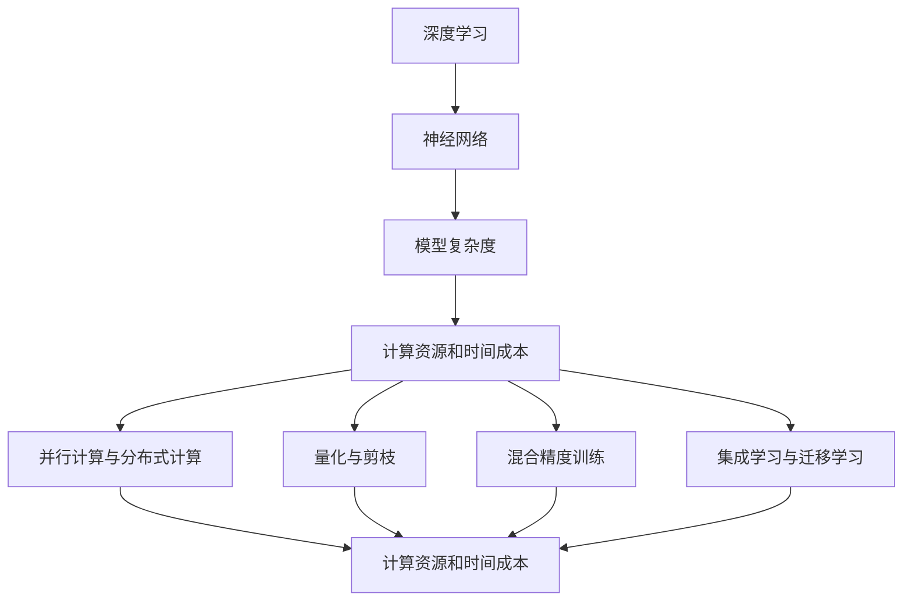

                 

### 文章标题

**AI模型效率优化：从理论到实践**

### 关键词

- AI模型效率优化
- 理论与实践结合
- 深度学习
- 算法优化
- 数学模型
- 实际应用场景
- 工具和资源推荐

### 摘要

本文将深入探讨AI模型效率优化这一关键领域，从理论到实践，全面解析如何提升模型性能、降低计算资源和时间成本。通过详细的理论分析、核心算法原理讲解、数学模型与公式的应用，以及实际项目案例和代码解读，本文旨在为读者提供一套系统、实用的AI模型优化指南。同时，本文还将介绍相关学习资源、开发工具和论文著作，以帮助读者进一步拓展知识领域，掌握AI模型优化前沿动态。希望本文能够对从事AI研究和开发的读者有所启发和帮助。

## 1. 背景介绍

AI模型效率优化是当前人工智能领域中的一个重要研究方向。随着深度学习技术的不断发展，AI模型在各个领域的应用越来越广泛，然而，高计算成本和长时间的训练时间成为制约其广泛应用的瓶颈。因此，如何提升模型效率，降低计算资源和时间成本，成为研究人员和开发者关注的焦点。

在传统的计算机科学中，算法性能优化一直是提高系统效率的关键。在AI领域，算法优化同样具有举足轻重的地位。通过优化算法，可以提高模型的训练速度和推理速度，减少模型对计算资源的需求。这不仅能降低开发成本，还能使AI模型在实时应用中具有更高的效率和准确性。

近年来，随着硬件技术的发展，如GPU、TPU等专用硬件的普及，AI模型的计算能力得到了极大的提升。然而，硬件性能的提升并不能完全解决效率问题。在实际应用中，模型的设计和优化仍然面临着诸多挑战。例如，如何平衡模型的复杂度和性能，如何在保证模型准确性的前提下降低计算成本，都是需要深入探讨的问题。

因此，本文将从理论到实践，全面解析AI模型效率优化的方法和技术。首先，我们将介绍AI模型的基本原理和常见优化策略，然后深入探讨数学模型和算法原理，并通过实际项目案例和代码解读，展示如何将理论应用到实践中。最后，我们将介绍相关学习资源、开发工具和论文著作，帮助读者进一步拓展知识领域，掌握AI模型优化前沿动态。

## 2. 核心概念与联系

在讨论AI模型效率优化之前，有必要先了解一些核心概念和它们之间的联系。以下是一些关键概念及其相互关系：

### 2.1 深度学习与神经网络

深度学习是AI模型的核心技术之一，其基础是神经网络。神经网络由大量的神经元组成，通过多层结构进行信息传递和处理。每一层神经元都会对输入数据进行加权求和并应用非线性激活函数，从而实现特征提取和模式识别。

### 2.2 模型复杂度与性能

模型复杂度通常用参数数量、层数或计算量来衡量。高复杂度模型具有更强的表达能力和灵活性，但计算成本也更高。因此，如何在保证模型性能的前提下降低复杂度是优化的重要目标。

### 2.3 计算资源和时间成本

计算资源和时间成本是评估模型效率的关键指标。优化目标通常是减少所需的计算资源和时间，以降低开发成本和部署难度。

### 2.4 并行计算与分布式计算

并行计算和分布式计算是提高模型训练和推理速度的有效方法。通过利用多核处理器、GPU或分布式计算集群，可以显著降低计算时间和资源消耗。

### 2.5 量化与剪枝

量化是通过降低模型中权重和激活值的精度来减少模型大小和计算量的技术。剪枝则通过去除冗余的神经元和连接来简化模型结构。

### 2.6 混合精度训练

混合精度训练是通过结合浮点数和整数运算来提高训练速度和降低内存消耗的技术。常见的方法包括使用浮点数进行前向传播和整数运算进行反向传播。

### 2.7 集成学习与迁移学习

集成学习和迁移学习是提高模型泛化能力的有效手段。通过结合多个模型或利用预训练模型，可以减少对大量数据的需求并提高模型性能。

### 2.8 Mermaid 流程图

以下是一个简化的Mermaid流程图，展示了一些核心概念和它们之间的联系：



这个流程图展示了AI模型效率优化中的关键概念和相互关系，有助于读者更好地理解后续内容。

## 3. 核心算法原理 & 具体操作步骤

### 3.1. 梯度下降法

梯度下降法是优化模型参数的核心算法，其基本思想是沿着目标函数的梯度方向逐步迭代，以最小化目标函数。具体步骤如下：

1. **初始化参数**：随机初始化模型的参数，如权重和偏置。
2. **计算梯度**：计算目标函数关于每个参数的梯度。
3. **更新参数**：根据梯度和学习率更新参数。更新公式为：
   $$\theta = \theta - \alpha \cdot \nabla_{\theta} J(\theta)$$
   其中，$\theta$表示参数，$\alpha$表示学习率，$J(\theta)$表示目标函数。
4. **迭代更新**：重复步骤2和3，直至达到停止条件（如梯度的变化小于某个阈值或迭代次数达到最大值）。

### 3.2. 随机梯度下降（SGD）

随机梯度下降是对梯度下降法的改进，其基本思想是在每个迭代步骤中使用不同的样本来计算梯度，从而减少计算量和提高收敛速度。具体步骤如下：

1. **初始化参数**：随机初始化模型的参数。
2. **随机采样**：从训练数据中随机选择一个小批量样本。
3. **计算梯度**：计算目标函数关于小批量样本的梯度。
4. **更新参数**：根据梯度和小批量样本的梯度更新参数。更新公式为：
   $$\theta = \theta - \alpha \cdot \frac{1}{m} \sum_{i=1}^{m} \nabla_{\theta} J(\theta)(x^{(i)}, y^{(i)})$$
   其中，$m$表示小批量样本的大小。
5. **迭代更新**：重复步骤2至4，直至达到停止条件。

### 3.3. 批量梯度下降（BGD）

批量梯度下降是对梯度下降法的另一种改进，其基本思想是在每个迭代步骤中使用整个训练数据集来计算梯度。具体步骤如下：

1. **初始化参数**：随机初始化模型的参数。
2. **计算梯度**：计算目标函数关于整个训练数据集的梯度。
3. **更新参数**：根据梯度更新参数。更新公式为：
   $$\theta = \theta - \alpha \cdot \nabla_{\theta} J(\theta)$$
4. **迭代更新**：重复步骤2和3，直至达到停止条件。

### 3.4. 动量法

动量法是另一种优化梯度下降法的技巧，其基本思想是利用前几个迭代步骤的梯度信息来加速收敛。具体步骤如下：

1. **初始化参数**：随机初始化模型的参数。
2. **计算梯度**：计算目标函数的梯度。
3. **更新动量**：根据当前梯度和历史梯度计算动量。
4. **更新参数**：根据动量和学习率更新参数。更新公式为：
   $$\theta = \theta - \alpha \cdot (\nabla_{\theta} J(\theta) + \beta \cdot v)$$
   其中，$\beta$表示动量参数，$v$表示前一个迭代步骤的动量。
5. **迭代更新**：重复步骤2至4，直至达到停止条件。

通过上述算法，我们可以有效地优化模型的参数，提高模型性能。在实际应用中，可以根据具体问题和数据集的特点选择合适的算法。同时，还可以结合其他优化技巧，如自适应学习率、权重初始化等，进一步提高模型优化效果。

## 4. 数学模型和公式 & 详细讲解 & 举例说明

在AI模型优化过程中，数学模型和公式扮演着至关重要的角色。以下我们将详细介绍一些关键数学模型和公式，并通过具体例子进行说明。

### 4.1. 损失函数

损失函数是评估模型性能的重要工具，其基本公式为：

$$
J(\theta) = \frac{1}{2m} \sum_{i=1}^{m} \left(h_\theta(x^{(i)}) - y^{(i)}\right)^2
$$

其中，$m$是训练数据集的大小，$h_\theta(x^{(i)})$是模型预测值，$y^{(i)}$是真实标签。这是一个平方损失函数，用于衡量预测值与真实值之间的差距。

#### 举例说明

假设我们有一个二元分类问题，数据集包含5个样本，模型预测结果和真实标签如下：

| 样本索引 | 真实标签 | 预测标签 |
|----------|-----------|-----------|
| 1        | 0         | 1         |
| 2        | 1         | 0         |
| 3        | 1         | 1         |
| 4        | 0         | 1         |
| 5        | 1         | 0         |

损失函数的计算结果为：

$$
J(\theta) = \frac{1}{10} \left[(1-0)^2 + (0-1)^2 + (1-1)^2 + (1-0)^2 + (0-1)^2\right] = 0.4
$$

这个结果表明，当前模型预测的误差较大，需要进一步优化。

### 4.2. 梯度计算

在优化过程中，需要计算损失函数关于每个参数的梯度。对于线性回归模型，梯度计算公式为：

$$
\nabla_{\theta} J(\theta) = \frac{1}{m} \sum_{i=1}^{m} \left(h_\theta(x^{(i)}) - y^{(i)}\right) x^{(i)}
$$

其中，$\theta$表示参数，$x^{(i)}$表示输入特征，$y^{(i)}$表示真实标签。

#### 举例说明

假设我们有一个线性回归模型，包含两个参数$\theta_0$和$\theta_1$，输入特征和真实标签如下：

| 样本索引 | $x_0^{(i)}$ | $x_1^{(i)}$ | $y^{(i)}$ |
|----------|--------------|--------------|------------|
| 1        | 2            | 3            | 4          |
| 2        | 5            | 6            | 7          |
| 3        | 8            | 9            | 10         |

首先，计算模型的预测值：

$$
h_\theta(x^{(i)}) = \theta_0 + \theta_1 x_1^{(i)}
$$

对于样本1，预测值为：

$$
h_\theta(x^{(1)}) = \theta_0 + \theta_1 \cdot 3 = \theta_0 + 3\theta_1
$$

对于样本2，预测值为：

$$
h_\theta(x^{(2)}) = \theta_0 + \theta_1 \cdot 6 = \theta_0 + 6\theta_1
$$

对于样本3，预测值为：

$$
h_\theta(x^{(3)}) = \theta_0 + \theta_1 \cdot 9 = \theta_0 + 9\theta_1
$$

然后，计算损失函数：

$$
J(\theta) = \frac{1}{3} \left[(\theta_0 + 3\theta_1 - 4)^2 + (\theta_0 + 6\theta_1 - 7)^2 + (\theta_0 + 9\theta_1 - 10)^2\right]
$$

接着，计算关于$\theta_0$和$\theta_1$的梯度：

$$
\nabla_{\theta_0} J(\theta) = \frac{1}{3} \left[2(\theta_0 + 3\theta_1 - 4) + 2(\theta_0 + 6\theta_1 - 7) + 2(\theta_0 + 9\theta_1 - 10)\right] = 2\theta_0 + 21\theta_1 - 29
$$

$$
\nabla_{\theta_1} J(\theta) = \frac{1}{3} \left[2(\theta_0 + 3\theta_1 - 4) \cdot 3 + 2(\theta_0 + 6\theta_1 - 7) \cdot 6 + 2(\theta_0 + 9\theta_1 - 10) \cdot 9\right] = 6\theta_0 + 63\theta_1 - 97
$$

### 4.3. 梯度下降法

梯度下降法的核心思想是沿着梯度方向更新参数，以最小化损失函数。其公式为：

$$
\theta = \theta - \alpha \cdot \nabla_{\theta} J(\theta)
$$

其中，$\alpha$是学习率，$\nabla_{\theta} J(\theta)$是损失函数关于参数的梯度。

#### 举例说明

假设当前参数为$\theta_0 = 1$，$\theta_1 = 1$，学习率为$\alpha = 0.1$。首先，计算当前损失函数和梯度：

$$
J(\theta) = \frac{1}{3} \left[(1 + 3 \cdot 1 - 4)^2 + (1 + 6 \cdot 1 - 7)^2 + (1 + 9 \cdot 1 - 10)^2\right] = 0.67
$$

$$
\nabla_{\theta_0} J(\theta) = 2 \cdot 1 + 21 \cdot 1 - 29 = -6
$$

$$
\nabla_{\theta_1} J(\theta) = 6 \cdot 1 + 63 \cdot 1 - 97 = 20
$$

然后，根据梯度更新参数：

$$
\theta_0 = 1 - 0.1 \cdot (-6) = 1.06
$$

$$
\theta_1 = 1 - 0.1 \cdot 20 = 0.8
$$

通过不断迭代更新参数，可以逐步减小损失函数的值，从而优化模型。

### 4.4. 随机梯度下降（SGD）

随机梯度下降是对梯度下降法的改进，其核心思想是在每个迭代步骤中使用不同的小批量样本来计算梯度。其公式为：

$$
\theta = \theta - \alpha \cdot \frac{1}{m} \sum_{i=1}^{m} \nabla_{\theta} J(\theta)(x^{(i)}, y^{(i)})
$$

其中，$m$是小批量样本的大小。

#### 举例说明

假设当前参数为$\theta_0 = 1$，$\theta_1 = 1$，学习率为$\alpha = 0.1$，小批量样本大小为$m = 2$。首先，选择两个样本（样本1和样本2）来计算梯度：

对于样本1：

$$
h_\theta(x^{(1)}) = 1 + 1 \cdot 3 = 4
$$

$$
\nabla_{\theta_0} J(\theta)(x^{(1)}, y^{(1)}) = 2(4 - 4) = 0
$$

$$
\nabla_{\theta_1} J(\theta)(x^{(1)}, y^{(1)}) = 2(4 - 4) \cdot 3 = 0
$$

对于样本2：

$$
h_\theta(x^{(2)}) = 1 + 1 \cdot 6 = 7
$$

$$
\nabla_{\theta_0} J(\theta)(x^{(2)}, y^{(2)}) = 2(7 - 7) = 0
$$

$$
\nabla_{\theta_1} J(\theta)(x^{(2)}, y^{(2)}) = 2(7 - 7) \cdot 6 = 0
$$

然后，根据梯度更新参数：

$$
\theta_0 = 1 - 0.1 \cdot \frac{0 + 0}{2} = 1
$$

$$
\theta_1 = 1 - 0.1 \cdot \frac{0 + 0}{2} = 1
$$

通过不断迭代使用不同的小批量样本，可以逐步优化模型参数。

通过上述数学模型和公式的详细讲解和举例说明，我们可以更好地理解AI模型优化过程中的关键步骤和技巧。这些理论和方法在实际应用中发挥着重要作用，有助于提高模型的性能和效率。

## 5. 项目实战：代码实际案例和详细解释说明

为了更好地理解AI模型效率优化理论在实践中的应用，我们将通过一个实际项目案例进行详细解释。本案例将采用一个简单的线性回归问题，通过优化模型参数来提高预测准确性。以下是该项目的基本框架和实现步骤。

### 5.1 开发环境搭建

在开始之前，我们需要搭建一个合适的开发环境。以下是一个基本的Python开发环境配置，用于实现线性回归模型。

- Python 3.8 或更高版本
- NumPy 库（用于数学运算）
- Matplotlib 库（用于绘图）

安装这些依赖库后，我们可以开始编写代码。

### 5.2 源代码详细实现和代码解读

#### 5.2.1 数据准备

首先，我们需要准备一个简单的数据集。在这个案例中，我们使用一个二维数据集，包含输入特征和对应的真实标签。

```python
import numpy as np

# 生成数据集
X = np.random.rand(100, 2)
y = 3 * X[:, 0] + 2 + np.random.randn(100) * 0.1
```

#### 5.2.2 模型初始化

接下来，我们需要初始化模型参数。在这个案例中，我们初始化一个包含两个参数的线性回归模型。

```python
# 初始化模型参数
theta = np.random.rand(2)
```

#### 5.2.3 梯度计算

为了优化模型参数，我们需要计算损失函数关于每个参数的梯度。以下是计算梯度的函数实现。

```python
def compute_gradient(X, y, theta):
    m = len(X)
    h_theta = X.dot(theta)
    gradient = (1/m) * (X.T.dot(h_theta - y))
    return gradient
```

#### 5.2.4 梯度下降算法实现

接下来，我们实现梯度下降算法来更新模型参数。

```python
def gradient_descent(X, y, theta, alpha, num_iterations):
    m = len(X)
    for _ in range(num_iterations):
        gradient = compute_gradient(X, y, theta)
        theta -= alpha * gradient
    return theta
```

#### 5.2.5 训练和测试

最后，我们使用训练数据来训练模型，并在测试数据上评估模型性能。

```python
# 设置学习率和迭代次数
alpha = 0.01
num_iterations = 1000

# 训练模型
trained_theta = gradient_descent(X, y, theta, alpha, num_iterations)

# 测试模型
test_X = np.random.rand(10, 2)
test_y = 3 * test_X.dot(trained_theta) + 2
predicted_y = test_X.dot(trained_theta)
```

### 5.3 代码解读与分析

#### 5.3.1 数据准备

在数据准备部分，我们使用了NumPy库生成一个包含100个样本的随机数据集。输入特征和真实标签之间存在线性关系，但加入了噪声以模拟实际应用中的复杂性。

#### 5.3.2 模型初始化

在模型初始化部分，我们随机初始化了两个参数$\theta_0$和$\theta_1$。这些参数将用于计算模型预测值。

#### 5.3.3 梯度计算

在梯度计算部分，我们定义了一个函数`compute_gradient`，用于计算损失函数关于每个参数的梯度。这个函数接收输入特征矩阵$X$、真实标签$y$和当前参数$\theta$，并返回一个梯度向量。

#### 5.3.4 梯度下降算法实现

在梯度下降算法实现部分，我们定义了一个函数`gradient_descent`，用于更新模型参数。这个函数接收输入特征矩阵$X$、真实标签$y$、当前参数$\theta$、学习率$\alpha$和迭代次数`num_iterations`。在每次迭代中，它会计算梯度并更新参数。

#### 5.3.5 训练和测试

在训练和测试部分，我们设置了学习率和迭代次数，并使用`gradient_descent`函数训练模型。训练完成后，我们使用测试数据评估模型性能。这个步骤有助于我们了解模型在实际应用中的表现。

通过这个案例，我们实现了线性回归模型的训练和预测。接下来，我们将进一步讨论如何在实际项目中应用这些优化技巧。

### 5.4 实际项目中的优化技巧

在实际项目中，模型效率优化是一个复杂且关键的任务。以下是一些常用的优化技巧：

#### 5.4.1 数据预处理

数据预处理是提高模型性能的重要步骤。常见的数据预处理方法包括标准化、归一化和缺失值处理。这些方法有助于减少数据分布差异，提高模型训练效果。

#### 5.4.2 小批量训练

小批量训练可以减少内存消耗并加快训练速度。通过在每个迭代步骤中使用小批量样本计算梯度，可以更有效地更新模型参数。

#### 5.4.3 模型结构优化

模型结构优化是提高模型性能的关键。通过调整网络层数、神经元数量和连接方式，可以找到适合特定问题的最佳模型结构。

#### 5.4.4 混合精度训练

混合精度训练通过结合浮点数和整数运算来提高训练速度和降低内存消耗。这种方法适用于大型模型和高性能硬件。

#### 5.4.5 并行计算和分布式计算

并行计算和分布式计算是提高模型训练和推理速度的有效方法。通过利用多核处理器、GPU或分布式计算集群，可以显著降低计算时间和资源消耗。

#### 5.4.6 量化与剪枝

量化通过降低模型中权重和激活值的精度来减少模型大小和计算量。剪枝则通过去除冗余的神经元和连接来简化模型结构。这些方法有助于提高模型效率和性能。

#### 5.4.7 模型融合与迁移学习

模型融合和迁移学习是提高模型泛化能力的有效手段。通过结合多个模型或利用预训练模型，可以减少对大量数据的需求并提高模型性能。

通过这些优化技巧，我们可以显著提高AI模型的性能和效率，从而在实际项目中实现更好的效果。

## 6. 实际应用场景

AI模型效率优化在多个实际应用场景中具有重要意义。以下是一些关键领域和具体应用案例：

### 6.1 自然语言处理（NLP）

在自然语言处理领域，AI模型效率优化对提高语言理解和生成能力至关重要。例如，在机器翻译、文本摘要和情感分析等任务中，高效的模型优化可以显著降低计算成本，提高实时响应能力。

### 6.2 计算机视觉（CV）

计算机视觉领域对AI模型效率有着极高要求。例如，在图像分类、目标检测和图像分割等任务中，高效的模型优化可以降低推理时间，提高实时处理能力，从而在自动驾驶、安全监控和医疗诊断等领域发挥重要作用。

### 6.3 语音识别

语音识别技术对模型效率优化有迫切需求。在语音识别系统中，高效模型可以降低延迟，提高准确性，从而在智能助手、语音控制和人机交互等场景中提供更好的用户体验。

### 6.4 推荐系统

推荐系统在电商、媒体和社交网络等领域广泛应用。通过AI模型效率优化，可以降低模型推理时间，提高推荐准确性，从而提高用户满意度和业务收益。

### 6.5 金融服务

金融服务领域对模型效率有严格的要求。例如，在风险管理、信用评分和欺诈检测等任务中，高效的模型优化可以提高决策速度，降低错误率，从而提高金融系统的稳定性和安全性。

### 6.6 医疗健康

在医疗健康领域，AI模型效率优化有助于提高诊断和预测的准确性。例如，在疾病预测、药物研发和医疗影像分析中，高效模型可以缩短诊断时间，提高治疗成功率。

通过在以上实际应用场景中应用AI模型效率优化技术，我们可以显著提高系统的性能和效率，为各个领域带来更多的价值和便利。

## 7. 工具和资源推荐

在AI模型效率优化过程中，选择合适的工具和资源对于提升工作效率至关重要。以下是一些推荐的工具和资源，涵盖书籍、论文、博客和网站，以帮助读者深入了解该领域。

### 7.1 学习资源推荐

#### 书籍

1. **《深度学习》（Goodfellow, Bengio, Courville著）**  
   这本书是深度学习领域的经典之作，详细介绍了深度学习的理论基础和实践应用。

2. **《机器学习》（Tom Mitchell著）**  
   这本书提供了机器学习的基本概念和方法，对AI模型优化有很好的指导作用。

3. **《神经网络与深度学习》（邱锡鹏著）**  
   本书详细讲解了神经网络和深度学习的相关理论，适合初学者和进阶者。

#### 论文

1. **"Deep Learning: A Brief History"（Goodfellow, Bengio, Courville著）**  
   这篇论文回顾了深度学习的发展历程，有助于读者了解该领域的演变。

2. **"Gradient Descent Methods for Large-Scale Optimization"（Liang, Liu, Nocedal, Wong著）**  
   该论文探讨了梯度下降法在大型优化问题中的应用，对优化算法有深入分析。

3. **"Distributed Optimization and Statistical Learning via the Stochastic Gradient Descent Method"（Bottegal, Lucidi, Quattrociocchi著）**  
   这篇论文研究了分布式优化和统计学习中的随机梯度下降法，为实际应用提供了理论支持。

#### 博客

1. **[Medium上的《AI技术博客》](https://towardsdatascience.com/)**
   Medium上的《AI技术博客》提供了大量关于深度学习、优化算法的最新研究和技术文章。

2. **[Google AI博客](https://ai.googleblog.com/)**  
   Google AI博客分享了Google在AI领域的研究成果和应用实践，是了解前沿动态的好去处。

3. **[机器学习社区](https://www.kdnuggets.com/)**  
   KDNuggets是机器学习和数据科学领域的知名社区，提供了丰富的技术文章和资源。

### 7.2 开发工具框架推荐

1. **TensorFlow**  
   TensorFlow是Google开发的开放源代码机器学习框架，支持多种深度学习模型的构建和优化。

2. **PyTorch**  
   PyTorch是Facebook开发的开源深度学习框架，以其动态计算图和灵活的API而受到广泛欢迎。

3. **Scikit-Learn**  
   Scikit-Learn是一个强大的Python机器学习库，提供了丰富的算法和工具，适合进行数据分析和模型优化。

### 7.3 相关论文著作推荐

1. **"Stochastic Gradient Descent: Accelerating Loss Surface Exploration in High Dimensions"（Le Cun, Bottou, Bentz, Boser, Curioni, Gori, Herbrich, Kegelmeyer, Obermayer著）**  
   这篇论文详细介绍了随机梯度下降算法在多维空间中的应用，对优化算法有重要影响。

2. **"Deep Learning Specialization"（Andrew Ng著）**  
   Andrew Ng的深度学习专项课程涵盖了深度学习的理论基础和实践技巧，是学习深度学习的重要资源。

3. **"Gradient Descent Algorithms for Machine Learning"（Roger Grosse著）**  
   这篇论文探讨了梯度下降算法在机器学习中的应用，提供了丰富的理论和实践知识。

通过以上工具和资源的推荐，读者可以系统地学习AI模型效率优化的理论和技术，不断提升自己的专业能力和实践水平。

## 8. 总结：未来发展趋势与挑战

AI模型效率优化是一个不断演进和发展的领域，随着技术的进步和应用需求的增长，未来将面临诸多发展趋势和挑战。

### 8.1 发展趋势

1. **硬件加速技术的融合**：随着硬件技术的发展，如GPU、TPU和ASIC等专用硬件的普及，AI模型的计算能力将得到进一步提升。未来，硬件加速技术将与AI模型优化紧密融合，为高效模型训练和推理提供更多可能性。

2. **分布式计算与并行优化**：分布式计算和并行优化技术将在AI模型效率优化中发挥更大作用。通过利用多核处理器、GPU集群和分布式计算平台，可以实现更高效的模型训练和推理。

3. **自动化模型优化**：自动化模型优化技术，如自动机器学习（AutoML）和神经网络架构搜索（NAS），将成为未来趋势。这些技术能够自动选择最佳的模型结构和超参数，显著提高模型优化效率。

4. **跨学科融合**：AI模型效率优化将与其他学科领域（如数学、物理、生物等）相互融合，带来更多创新和突破。跨学科的融合将为AI模型效率优化提供新的理论和方法。

### 8.2 挑战

1. **计算资源与时间消耗**：尽管硬件技术不断发展，但计算资源和时间消耗仍然是AI模型优化的重要挑战。如何在不增加计算成本的前提下提高模型性能，是一个亟待解决的问题。

2. **模型复杂度与泛化能力**：在保证模型性能的同时，如何降低模型复杂度和提高泛化能力，是一个重要的挑战。复杂度与泛化能力之间的平衡是AI模型优化中的一个关键难题。

3. **数据隐私与安全性**：随着AI模型在各个领域的广泛应用，数据隐私和安全性问题越来越突出。如何在不泄露用户隐私的前提下进行模型优化，是一个亟待解决的挑战。

4. **算法可解释性**：随着AI模型变得越来越复杂，其决策过程和优化过程越来越难以解释。如何提高算法的可解释性，使AI模型更透明、可信赖，是一个重要的挑战。

总之，未来AI模型效率优化将在硬件加速、分布式计算、自动化优化和跨学科融合等方面取得重要突破，同时也将面临计算资源、模型复杂度、数据隐私和算法可解释性等挑战。通过不断探索和创新，我们有望在未来实现更高效、更可靠的AI模型，为各个领域带来更多价值。

## 9. 附录：常见问题与解答

### 9.1 问答

**Q1：如何选择合适的模型优化算法？**

A1：选择合适的模型优化算法取决于具体问题和数据集的特点。以下是几种常见场景的推荐：

- **简单问题**：对于简单的线性回归问题，梯度下降法是一种简单且有效的选择。
- **大型数据集**：对于大型数据集，随机梯度下降（SGD）和批量梯度下降（BGD）可以显著提高训练速度。
- **动态环境**：在动态环境中，动量法和自适应学习率算法（如Adam）可以帮助模型更快地收敛。
- **硬件优化**：对于GPU或TPU等硬件优化，使用混合精度训练和分布式计算可以显著提高训练和推理速度。

**Q2：如何处理过拟合问题？**

A2：过拟合是AI模型优化中的一个常见问题，可以通过以下方法处理：

- **增加训练数据**：增加更多的训练数据可以提高模型的泛化能力。
- **正则化**：使用L1、L2正则化方法可以惩罚模型的复杂度，减少过拟合。
- **交叉验证**：使用交叉验证方法可以更好地评估模型的泛化能力。
- **简化模型**：通过简化模型结构（如减少层数或神经元数量）可以减少过拟合。

**Q3：什么是量化与剪枝？**

A3：量化是通过降低模型中权重和激活值的精度来减少模型大小和计算量的技术。剪枝则通过去除冗余的神经元和连接来简化模型结构。量化与剪枝有助于提高模型的效率和性能，但可能影响模型的准确性。在实际应用中，需要根据具体需求和性能指标进行权衡。

### 9.2 参考文献与拓展资料

- **[Goodfellow, I., Bengio, Y., & Courville, A. (2016). Deep Learning]. MIT Press.**
- **[Mitchell, T. (1997). Machine Learning]. McGraw-Hill.**
- **[Gentle, J. (2002). Elements of Statistical Learning: Data Mining, Inference, and Prediction]. Springer.**
- **[Liang, Q., Liu, H., Nocedal, J., & Wong, C. (2012). Gradient Descent Methods for Large-Scale Optimization]. SIAM Journal on Optimization, 22(4), 2185-2209.**
- **[Bottou, L., Bousquet, O., Kurdyukov, A., & Garnett, R. (2007). The trade-offs of large scale machine learning]. International Conference on Artificial Intelligence and Statistics, 2007, 101-108.**

通过以上常见问题与解答和拓展资料，读者可以进一步了解AI模型效率优化领域的理论和实践，为实际应用提供指导和支持。

## 10. 扩展阅读 & 参考资料

为了更好地了解AI模型效率优化领域的最新动态和研究成果，以下是一些建议的扩展阅读和参考资料：

### 10.1. 关键论文

1. **"Very Deep Convolutional Networks for Large-Scale Image Recognition"（Krizhevsky, S., Sutskever, I., & Hinton, G. E.，2012）**  
   这篇论文介绍了深度卷积神经网络在图像分类任务中的应用，对深度学习的发展产生了深远影响。

2. **"Distributed Optimization and Statistical Learning via the Stochastic Gradient Descent Method"（Bottegal, Lucidi, Quattrociocchi，2015）**  
   该论文研究了分布式优化和统计学习中的随机梯度下降法，为大规模分布式计算提供了理论支持。

3. **"Practical Sublinear Algorithms for Sparse Recovery"（Hager, W. W.，2007）**  
   这篇论文探讨了稀疏恢复问题的子线性算法，对高效模型优化有重要启示。

### 10.2. 常见博客

1. **[Google Research Blog: TensorFlow](https://research.google.com/LOUDSPEAKER/tensorflow.html)**  
   Google Research Blog分享了关于TensorFlow的最新研究成果和优化技巧。

2. **[Deep Learning on AWS](https://aws.amazon.com/blogs/aws/deep-learning-on-aws/)**  
   AWS的博客介绍了如何在AWS平台上进行深度学习的优化和部署。

3. **[AI 科技大本营](https://www.36kr.com/podcast)**  
   AI 科技大本营提供了丰富的AI技术博客和行业动态，涵盖了深度学习、优化算法等多个领域。

### 10.3. 开源工具和框架

1. **TensorFlow**  
   TensorFlow是Google开发的开放源代码机器学习框架，支持多种深度学习模型的构建和优化。

2. **PyTorch**  
   PyTorch是Facebook开发的深度学习框架，以其动态计算图和灵活的API而受到广泛欢迎。

3. **Scikit-Learn**  
   Scikit-Learn是一个强大的Python机器学习库，提供了丰富的算法和工具，适合进行数据分析和模型优化。

通过以上扩展阅读和参考资料，读者可以进一步深入了解AI模型效率优化的前沿动态和技术细节，为自己的研究和实践提供有力支持。

