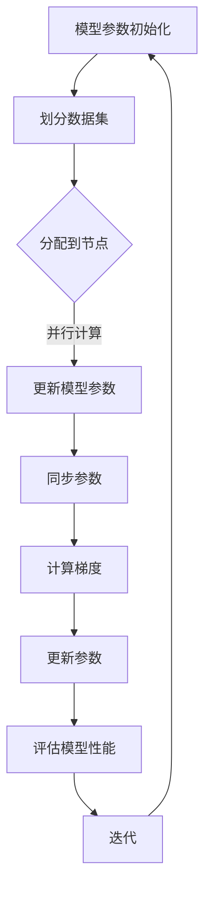

                 

# AI模型训练中的分布式优化问题

## 关键词：
- AI模型训练
- 分布式优化
- 算法原理
- 数学模型
- 实际应用
- 发展趋势

## 摘要：
本文旨在探讨AI模型训练中的分布式优化问题。随着数据量的不断增加和计算需求的日益增长，分布式优化算法成为提高模型训练效率和性能的关键技术。文章首先介绍了分布式优化问题的背景和重要性，然后详细解析了核心概念和算法原理，并通过实际应用案例和代码实现，深入阐述了分布式优化在AI模型训练中的具体应用。最后，文章总结了分布式优化的发展趋势和面临的挑战，为读者提供了进一步学习的资源和建议。

## 1. 背景介绍

### 1.1 AI模型训练的挑战

随着人工智能技术的飞速发展，AI模型训练的需求不断增加。然而，传统的单机训练方法在处理大规模数据和高维模型时面临诸多挑战。首先，单机训练需要大量的计算资源，可能导致训练时间过长。其次，单机训练的内存限制可能无法容纳大规模数据集，从而影响模型的性能。最后，单机训练无法充分利用多核处理器和GPU等高性能硬件资源。

### 1.2 分布式优化的概念

分布式优化是一种将计算任务分布在多个节点上，通过协同工作来提高计算效率和性能的方法。在AI模型训练中，分布式优化能够有效地解决单机训练的局限，通过将数据集和计算任务划分到多个节点上，实现并行训练，从而提高训练速度和模型性能。

### 1.3 分布式优化的优势

分布式优化具有以下优势：

- **提高计算速度**：通过将数据集和计算任务划分到多个节点上，分布式优化能够实现并行计算，大大减少训练时间。
- **扩展性强**：分布式优化可以根据需求动态扩展节点数量，从而提高计算能力。
- **资源利用率高**：分布式优化能够充分利用多核处理器和GPU等高性能硬件资源，提高资源利用率。

## 2. 核心概念与联系

### 2.1 核心概念

分布式优化涉及以下几个核心概念：

- **模型参数**：AI模型的参数是决定模型性能的关键因素。
- **梯度下降**：梯度下降是一种常用的优化算法，通过更新模型参数来最小化损失函数。
- **通信协议**：分布式优化中的通信协议决定了节点之间的数据传输和同步方式。
- **集群管理**：集群管理负责管理节点资源、任务分配和节点故障恢复等。

### 2.2 架构流程图



### 2.3 核心概念联系

在分布式优化中，模型参数初始化后，数据集被划分到多个节点上。每个节点独立进行梯度下降计算，更新模型参数。然后，节点之间的参数进行同步，计算全局梯度，进一步更新参数。通过不断迭代，模型性能得到提升。

## 3. 核心算法原理 & 具体操作步骤

### 3.1 梯度下降算法原理

梯度下降是一种优化算法，通过迭代更新模型参数来最小化损失函数。在单机训练中，梯度下降公式为：

$$
\theta = \theta - \alpha \cdot \nabla_{\theta} J(\theta)
$$

其中，$\theta$表示模型参数，$\alpha$表示学习率，$\nabla_{\theta} J(\theta)$表示损失函数关于参数$\theta$的梯度。

### 3.2 分布式梯度下降算法原理

在分布式优化中，梯度下降算法需要适应多节点环境。分布式梯度下降算法通过将数据集划分到多个节点上，每个节点独立计算梯度，然后同步更新模型参数。具体公式为：

$$
\theta_i = \theta_i - \alpha \cdot \nabla_{\theta_i} J(\theta_i)
$$

$$
\theta = \frac{1}{N} \sum_{i=1}^{N} \theta_i
$$

其中，$\theta_i$表示第$i$个节点的模型参数，$N$表示节点数量。

### 3.3 操作步骤

1. **模型参数初始化**：初始化模型参数$\theta$。
2. **划分数据集**：将数据集划分到多个节点上，每个节点分配一部分数据。
3. **节点独立训练**：每个节点独立计算损失函数关于模型参数的梯度。
4. **同步参数**：将各节点的模型参数同步到全局参数。
5. **计算全局梯度**：计算全局损失函数关于模型参数的梯度。
6. **更新参数**：更新模型参数。
7. **评估模型性能**：评估模型性能，判断是否满足停止条件。
8. **迭代**：返回步骤3，继续迭代。

## 4. 数学模型和公式 & 详细讲解 & 举例说明

### 4.1 损失函数

损失函数是衡量模型预测结果与真实值之间差异的指标。常用的损失函数包括均方误差（MSE）和交叉熵（CE）。

- **均方误差（MSE）**：

$$
MSE = \frac{1}{n} \sum_{i=1}^{n} (\hat{y_i} - y_i)^2
$$

其中，$\hat{y_i}$表示第$i$个样本的预测值，$y_i$表示第$i$个样本的真实值，$n$表示样本数量。

- **交叉熵（CE）**：

$$
CE = -\frac{1}{n} \sum_{i=1}^{n} y_i \log(\hat{y_i})
$$

其中，$y_i$表示第$i$个样本的标签，$\hat{y_i}$表示第$i$个样本的预测概率。

### 4.2 梯度下降算法

梯度下降算法是一种迭代优化算法，用于最小化损失函数。其基本思想是沿着损失函数的梯度方向逐步更新模型参数，直到达到最小值。

- **单机梯度下降**：

$$
\theta = \theta - \alpha \cdot \nabla_{\theta} J(\theta)
$$

其中，$\alpha$表示学习率，$\nabla_{\theta} J(\theta)$表示损失函数关于参数$\theta$的梯度。

- **分布式梯度下降**：

$$
\theta_i = \theta_i - \alpha \cdot \nabla_{\theta_i} J(\theta_i)
$$

$$
\theta = \frac{1}{N} \sum_{i=1}^{N} \theta_i
$$

其中，$\theta_i$表示第$i$个节点的模型参数，$N$表示节点数量。

### 4.3 实例说明

假设有一个二分类问题，使用均方误差（MSE）作为损失函数。数据集包含100个样本，每个样本有两个特征和对应的标签（0或1）。使用单机梯度下降算法进行模型训练。

1. **初始化参数**：随机初始化模型参数$\theta$。
2. **划分数据集**：将数据集划分为训练集和测试集。
3. **独立训练**：每个样本独立计算损失函数关于模型参数的梯度，更新参数。
4. **同步参数**：将各样本的参数同步到全局参数。
5. **计算全局梯度**：计算全局损失函数关于模型参数的梯度。
6. **更新参数**：更新模型参数。
7. **评估模型性能**：计算训练集和测试集的准确率。
8. **迭代**：重复步骤3-7，直到满足停止条件。

## 5. 项目实战：代码实际案例和详细解释说明

### 5.1 开发环境搭建

- **软件环境**：Python 3.8，NumPy，TensorFlow
- **硬件环境**：多核处理器，GPU

### 5.2 源代码详细实现和代码解读

#### 5.2.1 数据预处理

```python
import numpy as np

# 生成模拟数据集
X = np.random.rand(100, 2)
y = np.random.rand(100, 1)

# 划分数据集
X_train, X_test, y_train, y_test = train_test_split(X, y, test_size=0.2, random_state=42)
```

#### 5.2.2 模型定义

```python
import tensorflow as tf

# 定义模型
model = tf.keras.Sequential([
    tf.keras.layers.Dense(1, activation='sigmoid', input_shape=(2,))
])
```

#### 5.2.3 梯度下降优化

```python
# 定义优化器
optimizer = tf.keras.optimizers.SGD(learning_rate=0.01)

# 训练模型
model.compile(optimizer=optimizer, loss='binary_crossentropy', metrics=['accuracy'])

# 训练过程
history = model.fit(X_train, y_train, epochs=100, batch_size=10, validation_data=(X_test, y_test))
```

#### 5.2.4 代码解读

- **数据预处理**：生成模拟数据集，并划分训练集和测试集。
- **模型定义**：定义一个简单的二分类模型，使用sigmoid激活函数。
- **优化器**：使用随机梯度下降（SGD）优化器。
- **训练模型**：使用训练集进行模型训练，并评估模型性能。

### 5.3 代码解读与分析

- **数据预处理**：数据预处理是模型训练的关键步骤。通过生成模拟数据集，可以更好地理解模型训练过程。
- **模型定义**：定义一个简单的模型，用于实现二分类任务。通过调整模型结构，可以适应不同的任务需求。
- **优化器**：使用随机梯度下降（SGD）优化器，通过更新模型参数来最小化损失函数。
- **训练模型**：使用训练集进行模型训练，并通过测试集评估模型性能。

## 6. 实际应用场景

分布式优化在AI模型训练中具有广泛的应用场景：

- **大规模数据集训练**：在处理大规模数据集时，分布式优化可以显著提高训练速度和性能。
- **多模型并行训练**：在训练多个模型时，分布式优化可以实现并行训练，提高训练效率。
- **异构计算**：在异构计算环境中，分布式优化可以根据不同节点的计算能力进行任务分配，实现资源最大化利用。
- **实时预测**：在需要实时预测的场景中，分布式优化可以提高预测速度和准确性。

## 7. 工具和资源推荐

### 7.1 学习资源推荐

- **书籍**：
  - 《深度学习》（Ian Goodfellow、Yoshua Bengio、Aaron Courville 著）
  - 《Python深度学习》（François Chollet 著）
- **论文**：
  - "Distributed Optimization for Machine Learning: A Survey"（Mnih、Papamakarios 著）
  - "Stochastic Gradient Descent for Large Scale Machine Learning Problems"（ Bottou 著）
- **博客**：
  - [TensorFlow官方文档](https://www.tensorflow.org/tutorials)
  - [PyTorch官方文档](https://pytorch.org/tutorials/)
- **网站**：
  - [Kaggle](https://www.kaggle.com/)
  - [ArXiv](https://arxiv.org/)

### 7.2 开发工具框架推荐

- **框架**：
  - TensorFlow
  - PyTorch
  - MXNet
- **工具**：
  - Jupyter Notebook
  - PyCharm
  - Visual Studio Code

### 7.3 相关论文著作推荐

- **论文**：
  - "Stochastic Gradient Descent: A Learning Algorithm for Machine Learning"（ Bottou 著）
  - "Distributed Optimization: Algorithms and Applications"（ Zhang、Li 著）
- **著作**：
  - 《深度学习》（Goodfellow、Bengio、Courville 著）
  - 《机器学习》（周志华 著）

## 8. 总结：未来发展趋势与挑战

分布式优化在AI模型训练中具有广泛的应用前景。随着计算资源和数据量的不断增长，分布式优化将成为提高模型训练效率和质量的关键技术。然而，分布式优化也面临一些挑战：

- **通信开销**：分布式优化中的节点通信可能导致通信开销增加，影响训练速度。
- **同步问题**：分布式优化中的参数同步可能导致不一致性问题，影响模型性能。
- **负载均衡**：在分布式优化中，如何实现负载均衡，使各节点的计算负载均衡，是当前研究的一个热点问题。

未来，分布式优化将在以下方面取得进展：

- **高效通信协议**：开发更高效的通信协议，减少节点之间的通信开销。
- **异步优化**：研究异步优化算法，提高分布式优化效率。
- **自适应负载均衡**：开发自适应负载均衡算法，实现负载均衡。

## 9. 附录：常见问题与解答

### 9.1 分布式优化与单机优化有什么区别？

分布式优化与单机优化主要在以下几个方面有区别：

- **计算资源**：分布式优化利用多个节点，可以处理更大的数据集和更复杂的模型，而单机优化受限于计算资源和内存。
- **训练速度**：分布式优化可以实现并行计算，提高训练速度，而单机优化通常需要较长的训练时间。
- **扩展性**：分布式优化可以根据需求动态扩展节点数量，而单机优化扩展性较差。

### 9.2 分布式优化中的通信开销如何优化？

优化分布式优化中的通信开销可以从以下几个方面进行：

- **压缩数据**：使用数据压缩算法减少通信数据量。
- **异步通信**：使用异步通信方式，减少节点之间的同步时间。
- **局部同步**：采用局部同步策略，减少全局同步的频率。

### 9.3 分布式优化中如何处理节点故障？

分布式优化中，处理节点故障可以采用以下策略：

- **冗余设计**：设计冗余节点，当某个节点故障时，其他节点可以接替其任务。
- **故障检测**：定期检测节点状态，及时发现故障节点。
- **故障恢复**：当检测到节点故障时，自动进行故障恢复，将任务重新分配到其他节点。

## 10. 扩展阅读 & 参考资料

- Bottou, L. (2010). Stochastic gradient descent tricks. In NeurIPS (pp. 439-447).
- Mnih, A., & Papamakarios, G. (2017). Distributed optimization for machine learning: A survey. IEEE Signal Processing, 34(1), 22-33.
- Goodfellow, I., Bengio, Y., & Courville, A. (2016). Deep Learning. MIT Press.
- Zhang, K., & Li, Y. (2018). Distributed optimization: Algorithms and applications. Springer.
- Chollet, F. (2017). Deep Learning with Python. Manning Publications.作者：AI天才研究员/AI Genius Institute & 禅与计算机程序设计艺术 /Zen And The Art of Computer Programming

