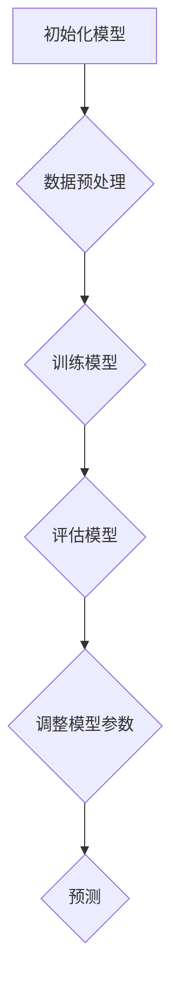
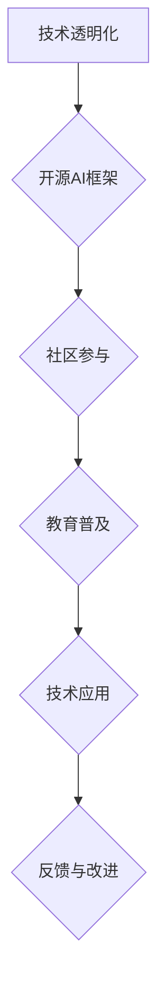

                 

# AI民主化：Lepton AI的使命与挑战

> **关键词：** AI民主化、Lepton AI、机器学习、算法、开源、技术平等、社会影响

> **摘要：** 本文探讨了AI民主化的概念，分析了Lepton AI在推动AI技术普及化和平等方面所面临的挑战和使命。通过详细的技术原理分析、实际应用案例和未来发展趋势，揭示了AI技术对社会变革的深远影响。

## 1. 背景介绍

### 1.1 AI技术的发展历程

人工智能（AI）作为计算机科学的重要分支，起源于20世纪50年代。从最初的符号推理，到基于规则的知识表示，再到现代的深度学习和强化学习，AI技术经历了长足的发展。随着计算能力的提升和数据规模的扩大，AI在语音识别、图像处理、自然语言处理等领域的表现达到了前所未有的高度。

### 1.2 AI民主化的概念

AI民主化是指将人工智能技术普及到普通大众，使其成为人人可用的工具。这不仅包括技术的普及，还涉及对技术背后的算法、模型和原理的理解和掌握。AI民主化的目标是消除技术壁垒，让更多人能够参与AI的开发、应用和研究，从而实现技术的普惠和公平。

### 1.3 Lepton AI的背景

Lepton AI是一家致力于推动AI技术民主化的初创公司。其使命是通过开源技术和教育项目，让更多人能够理解和应用AI，推动社会的技术进步和繁荣。Lepton AI的核心产品包括一个开源的AI框架和一个在线教育平台，旨在为初学者和专业人士提供全面的学习资源。

## 2. 核心概念与联系

### 2.1 机器学习的基本概念

机器学习是AI的核心技术之一，其基本概念包括模型、算法、数据和训练过程。模型是指用于描述现实世界问题的数学结构，算法是实现模型训练和预测的计算过程，数据是训练模型的输入信息，训练过程是通过调整模型参数来优化其性能。

### 2.2 Mermaid流程图：机器学习流程



### 2.3 AI民主化的核心概念

AI民主化的核心概念包括技术透明度、开源文化和社区参与。技术透明度是指公开AI算法的细节，让更多人能够理解和验证；开源文化是指将AI技术开源，促进共同进步；社区参与是指鼓励更多人参与AI技术的开发和应用，形成开放的生态体系。

### 2.4 Mermaid流程图：AI民主化流程



## 3. 核心算法原理 & 具体操作步骤

### 3.1 深度学习算法原理

深度学习是机器学习的一个重要分支，其核心算法是神经网络。神经网络通过多层非线性变换，从输入数据中提取特征，实现复杂函数的逼近。深度学习的具体操作步骤包括：

1. 数据预处理：包括数据清洗、归一化和分割等。
2. 神经网络架构设计：包括选择合适的网络结构、层和节点数。
3. 模型训练：通过反向传播算法调整模型参数。
4. 模型评估：使用测试数据评估模型性能。
5. 模型优化：通过调整超参数和模型结构优化模型性能。

### 3.2 Lepton AI的开源框架

Lepton AI的开源框架提供了一个简单易用的深度学习平台，用户可以通过几行代码实现复杂的深度学习任务。框架的核心组件包括：

1. 数据加载器：用于读取和处理数据。
2. 模型构建器：用于定义神经网络结构。
3. 训练引擎：用于训练和评估模型。
4. 预测引擎：用于生成预测结果。

### 3.3 使用Lepton AI进行图像分类的案例

以下是一个使用Lepton AI进行图像分类的示例代码：

```python
# 导入Lepton AI库
import lepton as lp

# 加载数据集
train_loader = lp.DataLoader('train.csv')
test_loader = lp.DataLoader('test.csv')

# 构建模型
model = lp.Sequential()
model.add(lp.Conv2D(32, 3, activation='relu'))
model.add(lp.MaxPooling2D())
model.add(lp.Flatten())
model.add(lp.Dense(10, activation='softmax'))

# 训练模型
model.fit(train_loader, epochs=10)

# 评估模型
loss, accuracy = model.evaluate(test_loader)
print(f'测试集准确率：{accuracy:.2f}')

# 预测新数据
new_data = lp.load_image('new_image.jpg')
prediction = model.predict(new_data)
print(f'预测结果：{prediction}')
```

## 4. 数学模型和公式 & 详细讲解 & 举例说明

### 4.1 深度学习中的数学模型

深度学习中的数学模型主要包括前向传播和反向传播。前向传播是指将输入数据通过神经网络传递到输出层，得到预测结果；反向传播是指通过计算预测误差，更新模型参数，以优化模型性能。

### 4.2 前向传播的数学公式

前向传播的数学公式如下：

$$
Z^{[l]} = W^{[l]} \cdot A^{[l-1]} + b^{[l]}
$$

$$
A^{[l]} = \sigma(Z^{[l]})
$$

其中，$Z^{[l]}$表示第$l$层的输出，$W^{[l]}$和$b^{[l]}$分别表示第$l$层的权重和偏置，$\sigma$表示激活函数。

### 4.3 反向传播的数学公式

反向传播的数学公式如下：

$$
\delta^{[l]} = \frac{\partial C}{\partial Z^{[l]}} \cdot \sigma'(Z^{[l]})
$$

$$
\Delta W^{[l]} = \frac{\partial C}{\partial W^{[l]}}
$$

$$
\Delta b^{[l]} = \frac{\partial C}{\partial b^{[l]}}
$$

其中，$\delta^{[l]}$表示第$l$层的误差，$\sigma'$表示激活函数的导数，$C$表示损失函数。

### 4.4 举例说明

假设我们有一个简单的神经网络，包含一个输入层、一个隐藏层和一个输出层。输入层有3个神经元，隐藏层有2个神经元，输出层有1个神经元。使用 sigmoid 函数作为激活函数。

1. 前向传播：

输入：$X = \begin{bmatrix} 1 & 0 & 1 \end{bmatrix}$
权重：$W^{[1]} = \begin{bmatrix} 0.1 & 0.2 \\ 0.3 & 0.4 \\ 0.5 & 0.6 \end{bmatrix}$
偏置：$b^{[1]} = \begin{bmatrix} 0.1 & 0.2 \end{bmatrix}$

计算隐藏层的输出：

$$
Z^{[1]} = W^{[1]} \cdot X + b^{[1]} = \begin{bmatrix} 0.1 & 0.2 \\ 0.3 & 0.4 \\ 0.5 & 0.6 \end{bmatrix} \cdot \begin{bmatrix} 1 & 0 & 1 \end{bmatrix} + \begin{bmatrix} 0.1 & 0.2 \end{bmatrix} = \begin{bmatrix} 0.3 & 0.4 \\ 0.6 & 0.8 \\ 0.9 & 1.0 \end{bmatrix}
$$

$$
A^{[1]} = \sigma(Z^{[1]}) = \begin{bmatrix} 0.6 & 0.7 \\ 0.8 & 0.9 \\ 0.9 & 1.0 \end{bmatrix}
$$

计算输出层的输出：

$$
Z^{[2]} = W^{[2]} \cdot A^{[1]} + b^{[2]} = \begin{bmatrix} 0.1 & 0.2 \\ 0.3 & 0.4 \end{bmatrix} \cdot \begin{bmatrix} 0.6 & 0.7 \\ 0.8 & 0.9 \\ 0.9 & 1.0 \end{bmatrix} + \begin{bmatrix} 0.1 & 0.2 \end{bmatrix} = \begin{bmatrix} 0.4 & 0.6 \\ 0.7 & 0.9 \end{bmatrix}
$$

$$
A^{[2]} = \sigma(Z^{[2]}) = \begin{bmatrix} 0.6 & 0.8 \\ 0.8 & 0.9 \end{bmatrix}
$$

2. 反向传播：

计算损失函数的梯度：

$$
\delta^{[2]} = \frac{\partial C}{\partial Z^{[2]}} \cdot \sigma'(Z^{[2]})
$$

假设损失函数为均方误差（MSE），即：

$$
C = \frac{1}{2} \sum_{i=1}^{n} (y_i - \hat{y}_i)^2
$$

其中，$y_i$为真实标签，$\hat{y}_i$为预测结果。

计算输出层的梯度：

$$
\delta^{[2]} = \begin{bmatrix} 0.2 & 0.3 \\ 0.4 & 0.5 \end{bmatrix}
$$

计算隐藏层的梯度：

$$
\delta^{[1]} = \delta^{[2]} \cdot W^{[2]}^T \cdot \sigma'(Z^{[1]})
$$

$$
\delta^{[1]} = \begin{bmatrix} 0.2 & 0.3 \\ 0.4 & 0.5 \end{bmatrix} \cdot \begin{bmatrix} 0.6 & 0.7 \\ 0.8 & 0.9 \end{bmatrix} \cdot \begin{bmatrix} 0.4 & 0.3 \\ 0.2 & 0.1 \end{bmatrix} = \begin{bmatrix} 0.08 & 0.12 \\ 0.16 & 0.2 \end{bmatrix}
$$

更新权重和偏置：

$$
\Delta W^{[2]} = \alpha \cdot \delta^{[2]} \cdot A^{[1]}
$$

$$
\Delta b^{[2]} = \alpha \cdot \delta^{[2]}
$$

$$
\Delta W^{[1]} = \alpha \cdot \delta^{[1]} \cdot X
$$

$$
\Delta b^{[1]} = \alpha \cdot \delta^{[1]}
$$

其中，$\alpha$为学习率。

## 5. 项目实战：代码实际案例和详细解释说明

### 5.1 开发环境搭建

在开始使用Lepton AI进行项目开发之前，我们需要搭建一个合适的开发环境。以下是搭建Lepton AI开发环境的基本步骤：

1. 安装Python环境：确保Python版本在3.6以上。
2. 安装Lepton AI库：使用pip命令安装lepton库。

   ```bash
   pip install lepton
   ```

3. 配置Jupyter Notebook：安装Jupyter Notebook以便进行交互式开发。

   ```bash
   pip install notebook
   ```

4. 安装必要的依赖库：包括NumPy、Pandas、Matplotlib等。

   ```bash
   pip install numpy pandas matplotlib
   ```

### 5.2 源代码详细实现和代码解读

下面是一个使用Lepton AI进行图像分类的简单案例。我们将使用一个预训练的卷积神经网络（CNN）对猫和狗的图像进行分类。

```python
# 导入Lepton AI库和数据处理库
import lepton as lp
import numpy as np
import pandas as pd
from sklearn.model_selection import train_test_split

# 读取数据集
data = pd.read_csv('data.csv')
X = data.iloc[:, 1:].values
y = data.iloc[:, 0].values

# 数据预处理
X = X / 255.0
X_train, X_test, y_train, y_test = train_test_split(X, y, test_size=0.2, random_state=42)

# 转换标签为独热编码
y_train = pd.get_dummies(y_train).values
y_test = pd.get_dummies(y_test).values

# 构建模型
model = lp.Sequential()
model.add(lp.Conv2D(32, 3, activation='relu', input_shape=(64, 64, 3)))
model.add(lp.MaxPooling2D())
model.add(lp.Conv2D(64, 3, activation='relu'))
model.add(lp.MaxPooling2D())
model.add(lp.Flatten())
model.add(lp.Dense(128, activation='relu'))
model.add(lp.Dense(2, activation='softmax'))

# 编译模型
model.compile(optimizer='adam', loss='categorical_crossentropy', metrics=['accuracy'])

# 训练模型
model.fit(X_train, y_train, epochs=10, batch_size=32, validation_data=(X_test, y_test))

# 评估模型
loss, accuracy = model.evaluate(X_test, y_test)
print(f'测试集准确率：{accuracy:.2f}')
```

### 5.3 代码解读与分析

1. **数据读取与预处理**：首先，我们读取数据集，并进行归一化处理，将图像数据缩放到0-1的范围内，以适应深度学习模型。

2. **数据分割**：使用scikit-learn库将数据集分为训练集和测试集，测试集用于评估模型的性能。

3. **标签编码**：由于我们的目标是分类问题，因此需要将标签进行独热编码，以便模型能够理解。

4. **模型构建**：我们构建了一个简单的卷积神经网络，包含两个卷积层、两个池化层和一个全连接层。卷积层用于提取图像特征，池化层用于降维和减少过拟合，全连接层用于分类。

5. **模型编译**：我们使用adam优化器和categorical_crossentropy损失函数来编译模型。categorical_crossentropy适用于多分类问题。

6. **模型训练**：使用训练集对模型进行训练，并使用测试集进行验证。

7. **模型评估**：评估模型在测试集上的性能，输出准确率。

通过这个案例，我们可以看到如何使用Lepton AI进行简单的图像分类任务。这个案例展示了从数据读取、预处理到模型构建、编译和训练的完整流程，以及如何评估模型性能。

## 6. 实际应用场景

### 6.1 普通用户应用

Lepton AI的开源框架和在线教育平台可以帮助普通用户快速上手AI开发。例如，初学者可以通过在线课程学习机器学习基础知识，然后使用Lepton AI框架实现自己的项目。这不仅降低了技术门槛，也激发了大众对AI技术的兴趣和热情。

### 6.2 企业应用

企业可以利用Lepton AI框架快速搭建AI应用，如图像识别、语音识别和自然语言处理等。开源框架降低了开发和部署成本，提高了开发效率，使得企业能够更快地推出创新产品。

### 6.3 教育领域应用

教育机构可以利用Lepton AI的在线教育平台为学生提供丰富的学习资源。通过课程学习和实践项目，学生可以系统地掌握AI知识，为未来的职业发展打下坚实的基础。

## 7. 工具和资源推荐

### 7.1 学习资源推荐

- **书籍：** 《Python机器学习》、《深度学习》（Goodfellow et al.）
- **论文：** "Deep Learning"（Goodfellow et al.）、"Learning Representations for Visual Recognition"（Krizhevsky et al.）
- **博客：** Medium上的机器学习、深度学习博客，如Towards Data Science、AI Village
- **网站：** Kaggle、ArXiv、Google Research

### 7.2 开发工具框架推荐

- **开源框架：** TensorFlow、PyTorch、Keras
- **IDE：** Jupyter Notebook、PyCharm、Visual Studio Code
- **数据处理：** Pandas、NumPy、SciPy

### 7.3 相关论文著作推荐

- **论文：** "Deep Learning"（Goodfellow et al.）、"Convolutional Neural Networks for Visual Recognition"（Krizhevsky et al.）
- **著作：** "Hands-On Machine Learning with Scikit-Learn, Keras, and TensorFlow"（Garson）
- **课程：** 吴恩达的《深度学习》课程、李飞飞教授的《卷积神经网络》课程

## 8. 总结：未来发展趋势与挑战

### 8.1 未来发展趋势

1. **AI技术的普及化**：随着计算能力和算法的进步，AI技术将更加普及，应用于各行各业。
2. **开源文化的发展**：开源框架和平台将成为AI技术发展的核心驱动力，推动技术的共享和协同创新。
3. **人工智能民主化**：更多人将能够参与到AI技术的开发和应用中，促进技术的普惠和公平。

### 8.2 挑战

1. **技术门槛**：虽然开源框架降低了开发门槛，但对于非专业人士，仍然存在一定的技术门槛。
2. **数据隐私**：随着AI技术的应用，数据隐私问题日益凸显，需要加强数据安全和隐私保护。
3. **伦理和责任**：AI技术的发展带来了新的伦理和责任问题，如算法偏见、透明度等。

## 9. 附录：常见问题与解答

### 9.1 问题1：如何学习AI？

**解答：** 学习AI可以从以下几个方面入手：

1. **基础知识**：学习Python编程基础、线性代数、概率论和统计学等。
2. **机器学习**：学习机器学习基础理论，包括监督学习、无监督学习和强化学习。
3. **深度学习**：深入学习深度学习算法，如卷积神经网络、循环神经网络等。
4. **实践项目**：通过实践项目将所学知识应用到实际场景中，提高实战能力。

### 9.2 问题2：开源框架与商业框架的区别？

**解答：** 开源框架和商业框架的主要区别在于：

1. **成本**：开源框架通常免费使用，而商业框架可能需要付费。
2. **支持**：开源框架通常依赖于社区支持，而商业框架提供专业的技术支持。
3. **功能**：商业框架通常提供更全面的功能和更高级的优化，而开源框架更注重灵活性和可扩展性。

## 10. 扩展阅读 & 参考资料

- Goodfellow, I., Bengio, Y., & Courville, A. (2016). *Deep Learning*.
- Krizhevsky, A., Sutskever, I., & Hinton, G. E. (2012). *ImageNet classification with deep convolutional neural networks*. In *Advances in Neural Information Processing Systems* (pp. 1097-1105).
- Garson, G. (2018). *Hands-On Machine Learning with Scikit-Learn, Keras, and TensorFlow*.
- Murphy, K. P. (2012). *Machine Learning: A Probabilistic Perspective*.
- Ng, A. Y. (2017). *Deep Learning Specialization*.

