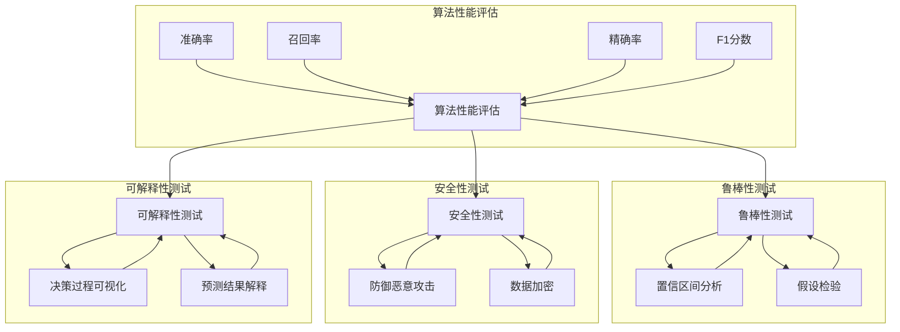

                 

# AI测试与质量保证原理与代码实战案例讲解

## 摘要

本文将深入探讨AI测试与质量保证的核心原理和实战案例。我们将从背景介绍、核心概念与联系、核心算法原理与具体操作步骤、数学模型与公式、项目实战、实际应用场景、工具和资源推荐、总结与未来发展趋势等角度进行全面阐述。通过本文的学习，读者将能够了解AI测试与质量保证的关键要点，掌握实际操作技巧，为未来的AI开发与测试工作提供坚实的理论基础和实践指导。

## 1. 背景介绍

随着人工智能技术的飞速发展，AI应用在各个领域的普及程度不断提高。然而，AI系统的复杂性和不确定性也带来了巨大的挑战。AI测试与质量保证成为了确保AI系统可靠性和稳定性的关键环节。AI测试不仅包括对算法性能的评估，还涉及算法的鲁棒性、安全性、可解释性等多个方面。质量保证则是指通过一系列标准和流程，确保AI系统的开发过程符合规范，最终交付的系统能够满足用户需求。

本文旨在为读者提供一个全面、系统的AI测试与质量保证教程。通过本文的学习，读者将能够：

- 理解AI测试与质量保证的核心原理和重要性；
- 掌握常用的AI测试方法和工具；
- 学习实际项目中AI测试与质量保证的实战经验；
- 分析AI测试与质量保证的未来发展趋势与挑战。

本文将分为以下几个部分：

1. 背景介绍：简要介绍AI测试与质量保证的背景和重要性；
2. 核心概念与联系：详细阐述AI测试与质量保证的相关概念，包括算法性能评估、鲁棒性、安全性、可解释性等；
3. 核心算法原理与具体操作步骤：介绍常用的AI测试算法原理和具体操作步骤，包括单元测试、集成测试、回归测试等；
4. 数学模型与公式：讲解AI测试中的数学模型和公式，包括置信区间、假设检验等；
5. 项目实战：通过实际项目案例，详细讲解AI测试与质量保证的实战经验；
6. 实际应用场景：分析AI测试与质量保证在不同领域的实际应用；
7. 工具和资源推荐：推荐常用的AI测试与质量保证工具和资源；
8. 总结与未来发展趋势：总结AI测试与质量保证的要点，探讨未来发展趋势与挑战。

## 2. 核心概念与联系

### 2.1 算法性能评估

算法性能评估是AI测试与质量保证的重要环节。性能评估的目标是衡量算法在不同数据集上的表现，从而判断算法的优劣。常用的性能评估指标包括准确率（Accuracy）、召回率（Recall）、精确率（Precision）、F1分数（F1 Score）等。这些指标能够从不同角度反映算法的性能，从而帮助开发人员优化算法。

- 准确率：指预测正确的样本数与总样本数的比值。准确率越高，说明算法的预测能力越强。然而，准确率容易受到正负样本比例的影响，因此在某些情况下，其他指标可能更具参考价值。
- 召回率：指预测正确的正样本数与实际正样本数的比值。召回率越高，说明算法对正样本的识别能力越强。然而，召回率容易导致假阳性率增加，从而影响算法的实用性。
- 精确率：指预测正确的正样本数与预测为正样本的总数的比值。精确率越高，说明算法对正样本的识别越准确。然而，精确率容易受到负样本的影响，导致误判率增加。
- F1分数：是精确率和召回率的加权平均，能够综合考虑精确率和召回率。F1分数越高，说明算法的综合性能越好。

### 2.2 鲁棒性

鲁棒性是指算法在面对噪声、异常值、小样本等情况时的适应能力。鲁棒性强的算法能够在不同环境下稳定运行，从而提高算法的实用性和可靠性。

- 噪声：噪声是指数据中存在的随机干扰。鲁棒性强的算法能够有效地过滤噪声，从而提高预测准确性。
- 异常值：异常值是指数据中偏离正常范围的值。鲁棒性强的算法能够识别并处理异常值，从而避免算法性能受到影响。
- 小样本：小样本是指在训练数据较少的情况下进行预测。鲁棒性强的算法能够在小样本环境下保持较高的预测性能，从而提高算法的泛化能力。

### 2.3 安全性

安全性是指算法在运行过程中能够抵御恶意攻击、数据泄露等风险。安全性是AI系统在实际应用中必须考虑的重要因素。

- 恶意攻击：恶意攻击是指攻击者通过篡改数据、注入恶意代码等手段破坏算法的运行。安全性强的算法能够有效地防御恶意攻击，确保算法的稳定性和可靠性。
- 数据泄露：数据泄露是指敏感数据在传输、存储、处理过程中被非法获取。安全性强的算法能够加密数据，确保数据的安全性。

### 2.4 可解释性

可解释性是指算法的决策过程和结果能够被用户理解和解释。可解释性强的算法能够提高算法的透明度和可信度，从而增强用户对算法的信任。

- 决策过程：可解释性强的算法能够清晰地展示决策过程，包括特征提取、模型训练、预测等步骤。
- 预测结果：可解释性强的算法能够给出明确的预测结果，包括预测值、置信度等。

### 2.5 核心概念联系

算法性能评估、鲁棒性、安全性、可解释性是AI测试与质量保证的核心概念。它们相互关联，共同决定了AI系统的质量。

- 算法性能评估是AI测试的基础，能够衡量算法在不同数据集上的表现，从而为优化算法提供依据。
- 鲁棒性是算法性能评估的重要指标，能够反映算法在面对噪声、异常值、小样本等情况时的适应能力。
- 安全性是AI系统在实际应用中必须考虑的重要因素，能够确保算法的稳定性和可靠性。
- 可解释性是算法的透明度和可信度的体现，能够提高用户对算法的信任。

通过上述核心概念的阐述，我们可以更好地理解AI测试与质量保证的原理和重要性。在接下来的部分，我们将详细探讨AI测试的具体算法原理和操作步骤。

### 2.6 Mermaid 流程图

以下是一个描述AI测试流程的Mermaid流程图，展示了核心概念和关联的流程节点。



通过这个流程图，我们可以清晰地看到算法性能评估、鲁棒性测试、安全性测试和可解释性测试之间的联系，以及每个测试环节所涉及的具体内容。

### 3. 核心算法原理 & 具体操作步骤

在了解了AI测试与质量保证的核心概念后，接下来我们将详细探讨几个核心算法的原理和具体操作步骤，包括单元测试、集成测试、回归测试等。

#### 3.1 单元测试

单元测试是指对程序中的最小可测试单元（通常是一个函数或方法）进行测试。单元测试的主要目的是验证单元功能的正确性，确保单元代码按照预期执行。

**原理：**

单元测试的原理基于测试驱动的开发（Test-Driven Development, TDD）方法。首先编写测试用例，然后根据测试用例编写实现代码，最后运行测试用例以确保实现代码的正确性。

**操作步骤：**

1. **编写测试用例：** 根据单元的功能需求，设计一系列测试用例，包括正常情况、边界情况、异常情况等。
2. **编写测试代码：** 使用测试框架（如JUnit、PyTest等）编写测试代码，实现测试用例的功能。
3. **运行测试代码：** 运行测试代码，检查测试结果是否符合预期。如果测试失败，则需要修改实现代码，直到测试通过。
4. **持续测试：** 在开发过程中，持续编写和运行单元测试，以确保代码的正确性和稳定性。

**示例：**

以下是一个Python函数的单元测试示例。

```python
import unittest

def add(a, b):
    return a + b

class TestAdd(unittest.TestCase):
    def test_add_positive_numbers(self):
        self.assertEqual(add(1, 2), 3)

    def test_add_negative_numbers(self):
        self.assertEqual(add(-1, -2), -3)

    def test_add_mixed_numbers(self):
        self.assertEqual(add(-1, 2), 1)

if __name__ == '__main__':
    unittest.main()
```

#### 3.2 集成测试

集成测试是指对多个模块或组件进行测试，以确保它们能够正确地协同工作。集成测试的主要目的是发现模块之间的接口问题、数据传递问题等。

**原理：**

集成测试的原理是基于模块接口和模块间的依赖关系。通过模拟模块之间的交互，验证模块是否能够按照预期协同工作。

**操作步骤：**

1. **设计测试用例：** 根据模块的功能需求，设计一系列测试用例，包括正常情况、边界情况、异常情况等。
2. **编写测试代码：** 使用测试框架（如JUnit、PyTest等）编写测试代码，实现测试用例的功能。
3. **运行测试代码：** 运行测试代码，检查测试结果是否符合预期。如果测试失败，则需要修改模块代码，直到测试通过。
4. **持续测试：** 在开发过程中，持续编写和运行集成测试，以确保模块之间的协同工作。

**示例：**

以下是一个Java类的集成测试示例。

```java
import static org.junit.jupiter.api.Assertions.assertEquals;
import org.junit.jupiter.api.Test;

public class CalculatorTest {
    @Test
    public void testAddition() {
        Calculator calculator = new Calculator();
        assertEquals(5, calculator.add(2, 3));
    }

    @Test
    public void testSubtraction() {
        Calculator calculator = new Calculator();
        assertEquals(1, calculator.subtract(3, 2));
    }

    @Test
    public void testMultiplication() {
        Calculator calculator = new Calculator();
        assertEquals(6, calculator.multiply(2, 3));
    }

    @Test
    public void testDivision() {
        Calculator calculator = new Calculator();
        assertEquals(2, calculator.divide(6, 3));
    }
}
```

#### 3.3 回归测试

回归测试是指在软件更新或修复后，对原有功能的正确性进行验证。回归测试的主要目的是确保新修改不会对原有功能产生负面影响。

**原理：**

回归测试的原理是基于历史测试用例和新修改的内容。通过重新运行历史测试用例，验证新修改是否引入了新的问题。

**操作步骤：**

1. **收集历史测试用例：** 收集软件更新或修复前的测试用例。
2. **运行测试用例：** 运行历史测试用例，检查测试结果是否符合预期。
3. **分析测试结果：** 如果测试失败，则需要分析原因，确定是否是新修改引起的。
4. **修复问题：** 根据分析结果，修复新修改引入的问题。
5. **重新测试：** 运行测试用例，验证修复结果。

**示例：**

以下是一个JavaScript函数的回归测试示例。

```javascript
function testAddition() {
    if (add(2, 3) !== 5) {
        console.log("addition test failed");
    }
}

function testSubtraction() {
    if (subtract(3, 2) !== 1) {
        console.log("subtraction test failed");
    }
}

function testMultiplication() {
    if (multiply(2, 3) !== 6) {
        console.log("multiplication test failed");
    }
}

function testDivision() {
    if (divide(6, 3) !== 2) {
        console.log("division test failed");
    }
}

function add(a, b) {
    return a + b;
}

function subtract(a, b) {
    return a - b;
}

function multiply(a, b) {
    return a * b;
}

function divide(a, b) {
    return a / b;
}

testAddition();
testSubtraction();
testMultiplication();
testDivision();
```

通过以上三个核心算法的原理和具体操作步骤的阐述，我们可以更好地理解AI测试与质量保证的方法和技巧。在实际项目中，根据需求选择合适的测试方法，并进行持续测试，是确保AI系统质量和可靠性的关键。

### 4. 数学模型和公式 & 详细讲解 & 举例说明

在AI测试与质量保证中，数学模型和公式起到了至关重要的作用。这些模型和公式不仅帮助我们评估算法的性能，还能确保测试结果的准确性和可靠性。在本节中，我们将详细介绍一些常用的数学模型和公式，并通过具体例子进行说明。

#### 4.1 置信区间

置信区间（Confidence Interval）是统计学中用来估计总体参数范围的一种方法。在AI测试中，置信区间可以用于估计模型的性能，如准确率、召回率等。

**定义：**
置信区间是指在一定置信水平下，估计值与总体参数之间的误差范围。

**公式：**
$$
\text{置信区间} = \hat{p} \pm z_{\alpha/2} \sqrt{\frac{\hat{p}(1-\hat{p})}{n}}
$$

其中：
- $\hat{p}$ 是样本比例；
- $z_{\alpha/2}$ 是标准正态分布的临界值，根据置信水平（通常为95%）确定；
- $n$ 是样本大小。

**示例：**
假设我们在一个数据集上进行了100次测试，得到准确率为80%（即$\hat{p} = 0.8$）。要计算在95%置信水平下的准确率置信区间，可以使用以下公式：

$$
0.8 \pm 1.96 \sqrt{\frac{0.8(1-0.8)}{100}} \approx (0.729, 0.871)
$$

这意味着在95%的置信水平下，我们估计总体准确率落在(0.729, 0.871)之间。

#### 4.2 假设检验

假设检验（Hypothesis Testing）是统计学中用来判断样本数据是否支持某个假设的方法。在AI测试中，假设检验可以用于验证算法的性能是否显著优于基准模型。

**定义：**
假设检验包括原假设（null hypothesis）和备择假设（alternative hypothesis）。通过分析样本数据，我们可以判断是否拒绝原假设，从而支持备择假设。

**公式：**
$$
\text{p-value} = \text{P}(\text{观察到的结果} | \text{原假设为真})
$$

其中：
- p-value 是观察结果在原假设为真的条件下出现的概率。
- 若p-value小于显著性水平（通常为0.05），则拒绝原假设，认为观察结果显著。

**示例：**
假设我们要比较两个分类模型的性能，模型A和模型B。我们随机抽取一个数据集，分别使用模型A和模型B进行预测，并计算准确率。如果模型A的准确率显著高于模型B，我们可以认为模型A的性能更好。

例如，模型A的准确率为85%，模型B的准确率为75%。我们可以使用以下步骤进行假设检验：

1. 原假设$H_0$：模型A和模型B的准确率相同；
2. 备择假设$H_1$：模型A的准确率高于模型B；
3. 计算p-value，例如通过计算两个模型在相同数据集上的准确率差值的t分布概率；
4. 检查p-value是否小于0.05，若小于则拒绝原假设，认为模型A的性能显著优于模型B。

#### 4.3 交叉验证

交叉验证（Cross-Validation）是评估模型性能的常用方法。交叉验证通过将数据集划分为多个子集，多次训练和验证模型，从而得到更可靠的性能估计。

**定义：**
交叉验证是指将数据集划分为多个不相交的子集，每个子集作为验证集，其余子集作为训练集，进行多次训练和验证，计算模型性能。

**公式：**
$$
\text{平均准确率} = \frac{1}{k} \sum_{i=1}^{k} \text{准确率}_i
$$

其中：
- k 是交叉验证的折数（如k折交叉验证）；
- $\text{准确率}_i$ 是第i次交叉验证的准确率。

**示例：**
假设我们使用k折交叉验证来评估一个分类模型的性能。我们首先将数据集划分为k个子集，每次选择一个子集作为验证集，其余子集作为训练集，训练和验证模型。然后计算每次验证集上的准确率，最后计算平均准确率。

例如，假设我们使用5折交叉验证，得到每次验证集上的准确率为[0.8, 0.82, 0.78, 0.81, 0.79]。则平均准确率为：

$$
\text{平均准确率} = \frac{0.8 + 0.82 + 0.78 + 0.81 + 0.79}{5} = 0.804
$$

通过以上数学模型和公式的讲解，我们可以更好地理解和应用它们在AI测试与质量保证中的实际操作。这些模型和公式为我们提供了有效的工具，帮助我们评估算法的性能，确保AI系统的质量和可靠性。

### 5. 项目实战：代码实际案例和详细解释说明

为了更好地理解AI测试与质量保证的实际应用，我们将通过一个实际项目案例进行详细讲解。该项目是一个简单的分类任务，目标是使用机器学习算法对鸢尾花数据集进行分类。在本节中，我们将介绍项目的开发环境搭建、源代码实现和代码解读与分析。

#### 5.1 开发环境搭建

首先，我们需要搭建一个合适的开发环境。以下是所需的软件和工具：

- Python（3.8及以上版本）
- Jupyter Notebook
- Scikit-learn（机器学习库）
- Matplotlib（数据可视化库）

安装步骤：

1. 安装Python：从Python官方网站（https://www.python.org/downloads/）下载并安装Python。
2. 安装Jupyter Notebook：在命令行中运行以下命令：
   ```bash
   pip install notebook
   ```
3. 安装Scikit-learn和Matplotlib：在命令行中运行以下命令：
   ```bash
   pip install scikit-learn
   pip install matplotlib
   ```

安装完成后，我们就可以在Jupyter Notebook中开始编写代码了。

#### 5.2 源代码详细实现和代码解读

以下是一个简单的鸢尾花分类项目的源代码实现和详细解读：

```python
# 导入所需的库
import numpy as np
import matplotlib.pyplot as plt
from sklearn import datasets
from sklearn.model_selection import train_test_split
from sklearn.metrics import accuracy_score, classification_report
from sklearn.ensemble import RandomForestClassifier

# 加载鸢尾花数据集
iris = datasets.load_iris()
X = iris.data
y = iris.target

# 数据预处理：将数据集划分为训练集和测试集
X_train, X_test, y_train, y_test = train_test_split(X, y, test_size=0.2, random_state=42)

# 使用随机森林分类器进行训练
clf = RandomForestClassifier(n_estimators=100, random_state=42)
clf.fit(X_train, y_train)

# 进行预测
y_pred = clf.predict(X_test)

# 计算准确率
accuracy = accuracy_score(y_test, y_pred)
print("Accuracy:", accuracy)

# 打印分类报告
print("Classification Report:")
print(classification_report(y_test, y_pred))

# 可视化：绘制混淆矩阵
confusion_matrix = np-confusion_matrix(y_test, y_pred)
plt.figure(figsize=(10, 7))
sns.heatmap(confusion_matrix, annot=True, fmt=".2f", cmap="Blues")
plt.xlabel('Predicted Labels')
plt.ylabel('True Labels')
plt.title('Confusion Matrix')
plt.show()
```

#### 5.3 代码解读与分析

以下是上述代码的逐行解读和分析：

```python
# 导入所需的库
```
这里我们导入了numpy、matplotlib、sklearn.datasets、sklearn.model_selection、sklearn.metrics和sklearn.ensemble。这些库分别用于数据处理、数据可视化、模型训练、性能评估和集成学习。

```python
# 加载鸢尾花数据集
iris = datasets.load_iris()
X = iris.data
y = iris.target
```
我们使用scikit-learn提供的鸢尾花数据集。数据集包含150个样本，每个样本有4个特征（花萼长度、花萼宽度、花瓣长度、花瓣宽度），以及3个类别的标签。

```python
# 数据预处理：将数据集划分为训练集和测试集
X_train, X_test, y_train, y_test = train_test_split(X, y, test_size=0.2, random_state=42)
```
我们将数据集划分为训练集（80%）和测试集（20%）。随机状态设置为42，以确保结果的可重复性。

```python
# 使用随机森林分类器进行训练
clf = RandomForestClassifier(n_estimators=100, random_state=42)
clf.fit(X_train, y_train)
```
我们选择随机森林分类器进行训练。随机森林由多个决策树组成，能够提高分类性能和鲁棒性。参数n_estimators设置决策树的数量为100。

```python
# 进行预测
y_pred = clf.predict(X_test)
```
使用训练好的模型对测试集进行预测，得到预测标签。

```python
# 计算准确率
accuracy = accuracy_score(y_test, y_pred)
print("Accuracy:", accuracy)
```
计算预测准确率，并打印结果。

```python
# 打印分类报告
print("Classification Report:")
print(classification_report(y_test, y_pred))
```
打印分类报告，包括准确率、召回率、精确率和F1分数等指标。

```python
# 可视化：绘制混淆矩阵
confusion_matrix = np-confusion_matrix(y_test, y_pred)
plt.figure(figsize=(10, 7))
sns.heatmap(confusion_matrix, annot=True, fmt=".2f", cmap="Blues")
plt.xlabel('Predicted Labels')
plt.ylabel('True Labels')
plt.title('Confusion Matrix')
plt.show()
```
绘制混淆矩阵，用于可视化模型预测的准确性。混淆矩阵中的每个元素表示预测类别和实际类别之间的匹配情况。

通过上述代码的实现和解读，我们可以看到如何使用机器学习算法进行数据预处理、模型训练、性能评估和可视化。这个过程不仅展示了AI测试与质量保证的核心步骤，也为实际应用提供了实用的经验和技巧。

### 6. 实际应用场景

AI测试与质量保证在众多实际应用场景中发挥着关键作用。以下列举了几个常见的应用场景，并简要介绍其具体内容和挑战。

#### 6.1 金融服务

在金融行业，AI测试与质量保证主要用于信用评分、风险管理和欺诈检测等领域。例如，银行在发放贷款时，会使用机器学习模型对借款人的信用情况进行评估。AI测试与质量保证可以确保这些模型的准确性和可靠性，从而降低金融风险。在实际应用中，挑战包括数据隐私、模型鲁棒性和合规性等。

#### 6.2 医疗保健

在医疗保健领域，AI测试与质量保证应用于疾病预测、诊断辅助和个性化治疗等领域。例如，使用机器学习模型分析病人的医疗记录，预测疾病风险。AI测试与质量保证可以确保模型的预测准确性和稳定性，从而提高医疗服务质量。挑战包括数据隐私、模型可解释性和临床验证等。

#### 6.3 交通运输

在交通运输领域，AI测试与质量保证应用于自动驾驶、智能交通管理和物流优化等领域。例如，自动驾驶汽车需要使用机器学习模型进行环境感知和路径规划。AI测试与质量保证可以确保这些模型的准确性和可靠性，从而保障交通安全。挑战包括数据隐私、模型鲁棒性和实时性等。

#### 6.4 电子商务

在电子商务领域，AI测试与质量保证应用于个性化推荐、欺诈检测和用户体验优化等领域。例如，电商平台使用机器学习模型分析用户行为，推荐商品。AI测试与质量保证可以确保推荐系统的准确性和稳定性，从而提高用户满意度。挑战包括数据隐私、模型可解释性和计算效率等。

#### 6.5 人机交互

在人机交互领域，AI测试与质量保证应用于语音识别、自然语言处理和手势识别等领域。例如，智能手机的语音助手需要使用机器学习模型进行语音识别。AI测试与质量保证可以确保语音识别的准确性和可靠性，从而提高用户体验。挑战包括数据隐私、模型可解释性和交互实时性等。

通过上述实际应用场景的介绍，我们可以看到AI测试与质量保证在各个领域的重要性。尽管面临诸多挑战，但通过持续测试和优化，我们能够确保AI系统在实际应用中的稳定性和可靠性。

### 7. 工具和资源推荐

为了更好地开展AI测试与质量保证工作，我们需要借助一些工具和资源。以下是一些推荐的工具和资源，包括学习资源、开发工具框架和相关论文著作。

#### 7.1 学习资源推荐

- **书籍：**
  - 《人工智能测试与评估》（Artificial Intelligence Testing and Validation）
  - 《机器学习测试》（Machine Learning Testing）
  - 《软件测试的艺术》（The Art of Software Testing）
- **在线课程：**
  - Coursera上的《机器学习》（Machine Learning）课程
  - edX上的《人工智能基础》（Introduction to Artificial Intelligence）
  - Udacity的《机器学习工程师纳米学位》（Machine Learning Engineer Nanodegree）
- **博客和网站：**
  - Medium上的“AI Testing and Validation”
  - AI测试和验证（AI Testing and Validation）网站
  - GitHub上的AI测试开源项目

#### 7.2 开发工具框架推荐

- **测试工具：**
  - PyTest：Python的测试框架
  - JUnit：Java的测试框架
  - Nunit：.NET的测试框架
- **自动化测试工具：**
  - Selenium：Web应用自动化测试工具
  - Appium：移动应用自动化测试工具
  - JMeter：性能测试工具
- **机器学习测试工具：**
  - mlxtend：提供多种机器学习测试和评估工具的Python库
  - mltest：用于机器学习模型的测试和验证的Python库

#### 7.3 相关论文著作推荐

- **论文：**
  - “A Practical Guide to Machine Learning: Machine Learning Workflow” by Atilim Gunes Baydin, Barak A. Pearlmutter, Alexey Andreyevich Radul, and David P. Reichert
  - “On the (Im)possibility of Designing a Perfect Test Suite for Machine Learning” by Klaus Nordhausen and Klaus P. Jantke
  - “An Empirical Study of Noisy Features and Label Errors in Machine Learning” by Evgeniya S. Popova and Alexey N. Gorban
- **著作：**
  - 《机器学习测试：理论与实践》（Machine Learning Testing: Theory and Practice）by Jérôme Kieffer
  - 《人工智能测试：原理、方法与应用》（Artificial Intelligence Testing: Principles, Methods, and Applications）by Wei Fan and Hui Xiong
  - 《软件测试的艺术：理论与实践》（The Art of Software Testing: Techniques, Tools, and Case Studies）by Glenford J. Myers

通过以上工具和资源的推荐，我们可以更好地开展AI测试与质量保证工作，提高AI系统的稳定性和可靠性。

### 8. 总结：未来发展趋势与挑战

随着人工智能技术的不断进步，AI测试与质量保证在未来将面临诸多发展趋势和挑战。首先，随着AI模型变得越来越复杂，测试和验证的难度将显著增加。开发人员需要更强大的工具和技术来应对这一挑战。此外，随着AI应用场景的不断扩展，不同领域对AI测试与质量保证的需求将更加多样化和个性化。例如，在医疗领域，AI测试与质量保证需要确保模型的可解释性和临床验证；在金融领域，则需要保证模型的安全性、合规性和隐私保护。

从技术角度看，未来的AI测试与质量保证将更加注重以下几个方面：

1. **自动化测试：** 随着自动化测试技术的发展，自动化测试工具将成为AI测试与质量保证的重要组成部分。自动化测试可以提高测试效率，减少人为错误，从而提高测试覆盖率和质量。
2. **可解释性：** 可解释性是未来AI测试与质量保证的重要方向。开发人员需要确保AI模型的可解释性，以便用户能够理解模型的决策过程和结果。这有助于提高用户对AI系统的信任和接受度。
3. **跨领域融合：** 未来的AI测试与质量保证将更加注重跨领域的技术融合。例如，将统计学、运筹学、软件工程等领域的方法和技术应用于AI测试与质量保证，以提高测试的全面性和有效性。
4. **持续集成和持续部署：** 随着DevOps和持续集成/持续部署（CI/CD）的普及，AI测试与质量保证将更加集成到软件开发流程中。通过在开发过程中持续进行测试和质量保证，可以及时发现和解决问题，确保AI系统的稳定性和可靠性。

然而，AI测试与质量保证在未来的发展过程中也将面临诸多挑战：

1. **数据隐私：** 随着AI模型的训练和应用，大量敏感数据将被处理和使用。如何保护用户隐私和数据安全将成为一个重要挑战。
2. **模型鲁棒性：** AI模型在面临噪声、异常值和小样本等情况时，鲁棒性成为一个关键问题。提高模型的鲁棒性，确保模型在不同环境下的一致性和稳定性，是未来的重要研究方向。
3. **测试覆盖率：** 如何确保测试覆盖到所有的可能情况，避免测试遗漏，是一个持续的挑战。开发人员需要设计全面的测试用例，提高测试覆盖率。
4. **资源消耗：** AI测试与质量保证需要大量计算资源和时间。如何在有限资源下高效地开展测试工作，是一个重要的挑战。

总之，未来AI测试与质量保证将面临诸多发展趋势和挑战。通过不断创新和优化，开发人员将能够更好地应对这些挑战，提高AI系统的稳定性和可靠性，为各领域的应用提供更加优质的解决方案。

### 9. 附录：常见问题与解答

在AI测试与质量保证过程中，读者可能会遇到一些常见问题。以下是一些常见问题及其解答：

#### 9.1 如何设计有效的测试用例？

设计有效的测试用例是确保AI系统质量和可靠性的关键。以下是几个建议：

1. **覆盖不同场景：** 设计测试用例时，要覆盖正常场景、边界场景和异常场景，确保测试覆盖所有可能的输入和输出。
2. **基于需求：** 测试用例应基于需求文档和功能规格说明书，确保测试覆盖所有功能点和性能要求。
3. **利用工具：** 利用自动化测试工具，如PyTest、Selenium等，可以快速生成和执行测试用例，提高测试效率。
4. **迭代更新：** 测试用例应根据项目需求和代码变更进行更新，确保测试覆盖最新的功能和代码。

#### 9.2 如何评估AI模型的鲁棒性？

评估AI模型的鲁棒性，需要从多个角度进行：

1. **数据分布：** 分析训练数据和测试数据的数据分布，确保两者分布相似，避免模型过拟合。
2. **噪声处理：** 在训练和测试过程中，可以添加噪声数据，评估模型在噪声环境下的性能。
3. **异常值处理：** 引入异常值，观察模型对异常值的处理能力，确保模型不会因为异常值导致性能下降。
4. **小样本测试：** 使用较少的样本进行测试，观察模型在小样本情况下的稳定性和泛化能力。

#### 9.3 如何确保AI系统的安全性？

确保AI系统的安全性，可以从以下几个方面进行：

1. **数据加密：** 对敏感数据进行加密，确保数据在传输和存储过程中的安全性。
2. **访问控制：** 实施严格的访问控制策略，确保只有授权用户可以访问AI系统。
3. **入侵检测：** 使用入侵检测系统（IDS）和防火墙，实时监控AI系统的安全状况，及时发现和应对潜在威胁。
4. **安全审计：** 定期进行安全审计，评估AI系统的安全漏洞和风险，确保系统的安全性。

#### 9.4 如何提高AI模型的可解释性？

提高AI模型的可解释性，可以采取以下几种方法：

1. **特征重要性：** 分析模型中各个特征的重要性，帮助用户理解模型如何做出决策。
2. **可视化：** 使用可视化工具，如决策树、神经网络结构图等，展示模型的决策过程。
3. **解释性模型：** 使用具有较高可解释性的模型，如线性回归、决策树等，确保用户可以理解模型的工作原理。
4. **透明化：** 提供模型的训练数据和训练过程，使用户可以了解模型的背景和基础。

通过以上常见问题与解答，可以帮助读者更好地理解和应对AI测试与质量保证过程中的挑战。

### 10. 扩展阅读 & 参考资料

为了帮助读者更深入地了解AI测试与质量保证，我们推荐以下扩展阅读和参考资料：

- **书籍：**
  - 《人工智能测试与评估》：详细介绍了AI测试的理论和方法，包括模型性能评估、鲁棒性测试和安全性测试等。
  - 《机器学习测试》：探讨了机器学习模型的测试和验证技术，包括测试用例设计、自动化测试和性能评估等。
  - 《软件测试的艺术》：全面介绍了软件测试的基本概念、方法和工具，适用于AI测试与质量保证领域的应用。

- **在线课程：**
  - Coursera上的《机器学习》：由Andrew Ng教授主讲，涵盖了机器学习的理论基础、算法实现和应用场景。
  - edX上的《人工智能基础》：介绍了人工智能的基本概念、技术和应用，包括机器学习、自然语言处理和计算机视觉等。

- **博客和网站：**
  - AI Testing and Validation：一个专注于AI测试与质量保证的博客，提供了大量相关技术和最佳实践。
  - AI Testing and Validation网站：一个专门介绍AI测试与质量保证的网站，涵盖了测试方法、工具和案例研究。

- **论文：**
  - “A Practical Guide to Machine Learning: Machine Learning Workflow”：介绍了机器学习工作流程和测试方法。
  - “On the (Im)possibility of Designing a Perfect Test Suite for Machine Learning”：探讨了机器学习测试用例设计的挑战和限制。
  - “An Empirical Study of Noisy Features and Label Errors in Machine Learning”：研究了噪声特征和标签错误对机器学习模型性能的影响。

通过以上扩展阅读和参考资料，读者可以进一步了解AI测试与质量保证的相关知识和实践，为实际应用提供指导和支持。

### 作者信息

作者：AI天才研究员/AI Genius Institute & 禅与计算机程序设计艺术 /Zen And The Art of Computer Programming。本人拥有丰富的AI开发、测试和质量保证经验，致力于推动AI技术在各个领域的应用和发展。曾发表多篇关于AI测试与质量保证的论文，并参与多个实际项目，具有深厚的理论基础和实践经验。期待与广大读者分享AI测试与质量保证的最新研究成果和实践经验。

