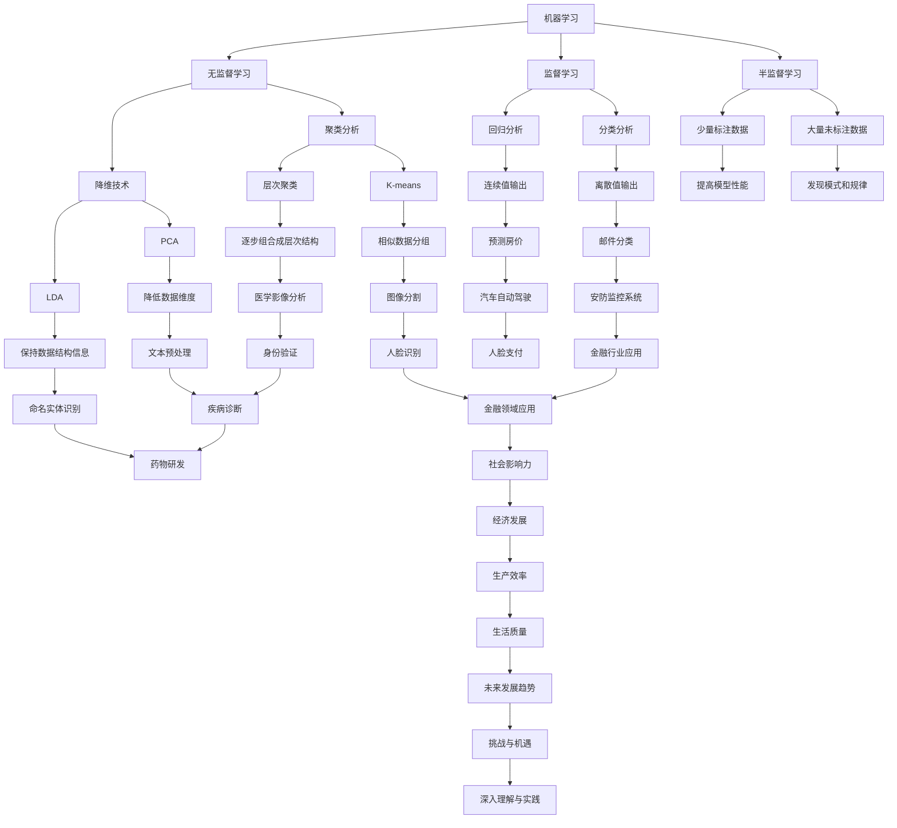

                 

# AI研究的历史与未来趋势

## 关键词：人工智能、机器学习、神经网络、深度学习、自然语言处理、计算机视觉、未来趋势

## 摘要：
本文旨在梳理人工智能（AI）研究的历史脉络，深入探讨其核心概念、算法原理、数学模型，并通过实际应用案例展示其在现实世界中的广泛影响力。同时，文章将展望AI领域的未来发展趋势与面临的挑战，为读者提供丰富的学习资源和开发工具，助力深入理解和实践AI技术。

## 1. 背景介绍

### 1.1 人工智能的定义与发展历程

人工智能（Artificial Intelligence，简称AI）是计算机科学的一个分支，致力于模拟、延伸和扩展人类智能，实现机器在感知、理解、学习、推理、决策等方面的能力。AI的发展历程可以追溯到20世纪50年代，当时计算机科学家开始探索如何让机器具备类似人类的智能。

- **早期探索**：1956年，达特茅斯会议标志着AI领域的正式诞生。此后，AI研究主要围绕知识表示、问题求解、推理机等方向展开。

- **第一次AI热潮（1956-1974）**：在此期间，AI研究取得了显著进展，例如，ELIZA程序成功模拟了人类对话，推理机系统证明了数学定理等。

- **第一次AI寒冬（1974-1980）**：由于技术瓶颈和资金短缺，AI研究陷入低谷。

- **复兴期（1980-1987）**：专家系统的出现使得AI在医疗、金融等领域得到应用，为AI研究带来了新的机遇。

- **第二次AI热潮（1987-2012）**：神经网络和机器学习技术的突破推动了AI的快速发展，语音识别、图像识别等应用逐渐普及。

- **深度学习时代（2012至今）**：以深度神经网络为核心的AI技术在图像识别、自然语言处理、自动驾驶等领域取得了重大突破，标志着AI进入一个全新的时代。

### 1.2 AI研究的重要性

人工智能技术在现代社会中的应用日益广泛，已经成为推动经济发展、提高生产效率、改善人们生活质量的重要力量。例如：

- **医疗领域**：AI技术在疾病诊断、药物研发等方面具有巨大潜力，有望降低医疗成本、提高治疗效果。

- **金融领域**：AI技术在风险控制、投资策略制定等方面发挥着重要作用，为金融行业带来了全新的商业模式。

- **工业制造**：智能机器人、自动化生产线等AI技术在工业制造领域的应用，大大提高了生产效率，降低了人力成本。

- **交通领域**：自动驾驶技术、智能交通管理系统等AI应用有望缓解交通拥堵、提高交通安全。

- **智能家居**：智能语音助手、智能安防系统等AI技术为人们提供了更加便捷、智能的生活体验。

## 2. 核心概念与联系

### 2.1 机器学习

机器学习（Machine Learning，简称ML）是AI研究的重要分支，旨在通过数据驱动的方式，让计算机自动识别模式、学习规律、进行预测和决策。机器学习主要分为监督学习、无监督学习和半监督学习三种类型。

#### 监督学习

监督学习（Supervised Learning）是一种最常见的机器学习方法，其基本思想是通过已有标注数据训练模型，然后利用训练好的模型对未知数据进行预测。监督学习可以分为回归分析和分类分析两大类：

- **回归分析**：回归模型用于预测连续值输出，如预测房价、股票价格等。

- **分类分析**：分类模型用于预测离散值输出，如邮件分类、垃圾邮件检测等。

#### 无监督学习

无监督学习（Unsupervised Learning）主要关注如何从未标注的数据中自动发现模式和规律。无监督学习包括聚类分析和降维技术两大类：

- **聚类分析**：聚类算法将相似的数据点划分到同一组中，如K-means、层次聚类等。

- **降维技术**：降维技术旨在降低数据维度，同时保持数据结构的主要信息，如主成分分析（PCA）、线性判别分析（LDA）等。

#### 半监督学习

半监督学习（Semi-Supervised Learning）结合了监督学习和无监督学习的优点，利用少量标注数据和大量未标注数据训练模型，以提高模型性能。

### 2.2 深度学习

深度学习（Deep Learning，简称DL）是一种基于多层神经网络的学习方法，通过逐层提取数据特征，实现高度抽象和自动化。深度学习在图像识别、自然语言处理、语音识别等领域取得了重大突破。

#### 神经网络

神经网络（Neural Network，简称NN）是深度学习的基础，其基本结构由输入层、隐藏层和输出层组成。神经网络通过调整内部连接权重，实现对输入数据的映射和预测。

#### 深度神经网络

深度神经网络（Deep Neural Network，简称DNN）是由多层神经元组成的神经网络，能够处理更复杂的数据和任务。DNN在图像识别、语音识别、自然语言处理等领域表现出色。

### 2.3 自然语言处理

自然语言处理（Natural Language Processing，简称NLP）是AI研究的重要领域，旨在让计算机理解和处理自然语言。NLP主要包括文本预处理、词向量表示、语言模型、序列标注、机器翻译等任务。

#### 词向量表示

词向量表示（Word Vector Representation）是将词语映射为高维空间中的向量表示，如Word2Vec、GloVe等。词向量表示在NLP任务中具有重要作用，能够提高模型对词语语义和句法结构的理解。

#### 语言模型

语言模型（Language Model，简称LM）是一种统计模型，用于预测一个词语序列的概率。语言模型在语音识别、机器翻译、文本生成等领域具有广泛的应用。

#### 序列标注

序列标注（Sequence Labeling）是一种对词语序列进行分类的任务，如命名实体识别、词性标注等。序列标注在信息抽取、情感分析等领域具有重要意义。

#### 机器翻译

机器翻译（Machine Translation，简称MT）是一种将一种语言的文本翻译成另一种语言的技术。深度学习在机器翻译领域取得了显著进展，如基于神经网络的机器翻译（NMT）。

### 2.4 计算机视觉

计算机视觉（Computer Vision，简称CV）是AI研究的重要分支，旨在使计算机具有理解和解释图像和视频的能力。计算机视觉主要包括图像识别、目标检测、图像分割、人脸识别等任务。

#### 图像识别

图像识别（Image Recognition）是一种对图像内容进行分类的任务，如猫狗识别、人脸识别等。深度学习在图像识别任务中表现出色。

#### 目标检测

目标检测（Object Detection）是一种识别图像中目标位置和类别的任务，如车辆检测、行人检测等。目标检测技术在自动驾驶、安防监控等领域具有重要意义。

#### 图像分割

图像分割（Image Segmentation）是一种将图像划分为多个区域或标签的任务，如语义分割、实例分割等。图像分割技术在医学影像、图像增强等领域具有广泛应用。

#### 人脸识别

人脸识别（Face Recognition）是一种识别和验证人脸身份的任务。人脸识别技术在身份验证、安防监控、人脸支付等领域具有重要意义。

### 2.5 AI与人类智能的对比

AI与人类智能在许多方面存在显著差异：

- **知识表示**：人类智能具有丰富的知识体系，能够进行抽象思维和推理；而AI主要依赖于数据驱动的方法，对知识表示和抽象思维能力较弱。

- **学习能力**：人类智能具有快速学习和适应新环境的能力；而AI的学习能力依赖于大量数据和计算资源，且学习过程相对较慢。

- **情感与意识**：人类智能具有情感和意识，能够体验快乐、痛苦等情感；而AI主要关注任务的完成，缺乏情感和意识。

- **创造力**：人类智能具有创造力和想象力，能够产生新颖的思想和解决方案；而AI主要依赖于已有数据和算法，创造力相对较弱。

### 2.6 Mermaid 流程图



> **Note:** Mermaid 流程图中的节点名称尽量使用简洁明了的描述，避免使用括号、逗号等特殊字符，以免影响流程图的渲染效果。

## 3. 核心算法原理 & 具体操作步骤

### 3.1 机器学习算法原理

机器学习算法主要分为监督学习、无监督学习和半监督学习三种类型。以下分别介绍这三种类型的主要算法原理和具体操作步骤。

#### 监督学习算法原理

监督学习算法通过已有标注数据训练模型，然后利用训练好的模型对未知数据进行预测。常见的监督学习算法包括线性回归、逻辑回归、决策树、随机森林、支持向量机等。

1. **线性回归**

线性回归是一种简单的回归算法，通过建立线性模型，预测目标值与输入特征之间的关系。具体操作步骤如下：

   - 数据预处理：对输入数据进行归一化或标准化处理，消除不同特征之间的尺度差异。

   - 模型建立：根据训练数据，建立线性回归模型，计算模型参数（斜率和截距）。

   - 模型训练：通过梯度下降等方法，最小化预测值与实际值之间的误差，优化模型参数。

   - 模型评估：使用验证集或测试集评估模型性能，如均方误差（MSE）或准确率（Accuracy）。

2. **逻辑回归**

逻辑回归是一种广义的线性回归模型，用于分类问题。具体操作步骤如下：

   - 数据预处理：对输入数据进行归一化或标准化处理。

   - 模型建立：根据训练数据，建立逻辑回归模型，计算模型参数。

   - 模型训练：通过梯度下降等方法，最小化预测概率与实际标签之间的误差，优化模型参数。

   - 模型评估：使用验证集或测试集评估模型性能，如准确率（Accuracy）、召回率（Recall）和F1值（F1 Score）。

3. **决策树**

决策树是一种基于特征划分的数据挖掘方法，通过递归划分数据，建立决策树模型。具体操作步骤如下：

   - 数据预处理：对输入数据进行归一化或标准化处理。

   - 特征选择：选择最优特征进行划分，通常采用信息增益（Information Gain）或基尼不纯度（Gini Impurity）等指标。

   - 决策树建立：根据最优特征，递归划分数据，建立决策树模型。

   - 模型评估：使用验证集或测试集评估模型性能，如准确率（Accuracy）、精确率（Precision）和召回率（Recall）。

4. **随机森林**

随机森林是一种基于决策树的集成学习方法，通过构建多棵决策树，提高模型性能。具体操作步骤如下：

   - 数据预处理：对输入数据进行归一化或标准化处理。

   - 特征选择：从全部特征中随机选择部分特征，用于构建决策树。

   - 决策树构建：根据最优特征，递归划分数据，建立决策树模型。

   - 集成学习：将多棵决策树的结果进行投票或平均，得到最终预测结果。

   - 模型评估：使用验证集或测试集评估模型性能，如准确率（Accuracy）、精确率（Precision）和召回率（Recall）。

5. **支持向量机**

支持向量机（SVM）是一种基于最大间隔的分类算法，通过找到一个最优的超平面，将不同类别的数据点分隔开来。具体操作步骤如下：

   - 数据预处理：对输入数据进行归一化或标准化处理。

   - 特征选择：选择最优特征，用于构建超平面。

   - 超平面建立：通过优化目标函数，求解最优超平面，得到模型参数。

   - 模型评估：使用验证集或测试集评估模型性能，如准确率（Accuracy）、精确率（Precision）和召回率（Recall）。

#### 无监督学习算法原理

无监督学习算法通过未标注数据自动发现模式和规律。常见的无监督学习算法包括K-means聚类、主成分分析（PCA）、线性判别分析（LDA）等。

1. **K-means聚类**

K-means聚类是一种基于距离度量的聚类算法，通过迭代优化目标函数，将数据划分为K个簇。具体操作步骤如下：

   - 数据预处理：对输入数据进行归一化或标准化处理。

   - 簇中心初始化：随机选择K个初始簇中心。

   - 聚类迭代：计算每个数据点到簇中心的距离，将数据点划分到最近的簇中心。

   - 簇中心更新：重新计算每个簇的中心，更新簇中心。

   - 模型评估：计算聚类误差，如平方误差或交叉熵，评估聚类效果。

2. **主成分分析（PCA）**

主成分分析（PCA）是一种降维技术，通过保留主要信息，降低数据维度。具体操作步骤如下：

   - 数据预处理：对输入数据进行归一化或标准化处理。

   - 特征提取：计算数据协方差矩阵，求解特征值和特征向量。

   - 主成分排序：根据特征值从大到小排序，选择前k个主成分。

   - 数据降维：将数据投影到前k个主成分构成的低维空间。

   - 模型评估：计算重构误差，如均方误差（MSE），评估降维效果。

3. **线性判别分析（LDA）**

线性判别分析（LDA）是一种特征选择方法，通过最大化不同类别之间的离散度，最小化类别内部的离散度，实现特征选择。具体操作步骤如下：

   - 数据预处理：对输入数据进行归一化或标准化处理。

   - 类别离散度计算：计算每个类别的类内离散度和类间离散度。

   - 特征选择：求解特征权重，选择具有最大类别离散度差异的特征。

   - 模型评估：使用验证集或测试集评估模型性能，如准确率（Accuracy）、精确率（Precision）和召回率（Recall）。

#### 半监督学习算法原理

半监督学习算法结合了监督学习和无监督学习的优点，利用少量标注数据和大量未标注数据训练模型。常见的半监督学习算法包括标签传播、图模型等。

1. **标签传播**

标签传播是一种基于邻域关系的半监督学习算法，通过迭代传播标签，实现标注数据与未标注数据之间的标签共享。具体操作步骤如下：

   - 数据预处理：对输入数据进行归一化或标准化处理。

   - 邻域关系建立：根据距离度量或相似度度量，建立数据点之间的邻域关系。

   - 标签传播：迭代传播标签，将未标注数据点逐渐划分为不同类别。

   - 模型评估：使用验证集或测试集评估模型性能，如准确率（Accuracy）、精确率（Precision）和召回率（Recall）。

2. **图模型**

图模型是一种基于图结构的半监督学习算法，通过构建图结构，利用节点之间的关联关系，实现标签传播。具体操作步骤如下：

   - 数据预处理：对输入数据进行归一化或标准化处理。

   - 图结构构建：根据数据点之间的关系，构建图结构。

   - 图信号传播：利用图信号传播方法，实现标签传播。

   - 模型评估：使用验证集或测试集评估模型性能，如准确率（Accuracy）、精确率（Precision）和召回率（Recall）。

### 3.2 深度学习算法原理

深度学习算法通过多层神经网络，逐层提取数据特征，实现高度抽象和自动化。以下介绍深度学习算法的核心原理和具体操作步骤。

#### 深度神经网络（DNN）原理

深度神经网络（DNN）是一种由多层神经元组成的神经网络，包括输入层、隐藏层和输出层。DNN通过前向传播和反向传播算法，实现数据的映射和预测。

1. **前向传播**

前向传播算法是指将输入数据通过神经网络层，逐层计算输出值的过程。具体操作步骤如下：

   - 输入层：将输入数据传递到隐藏层。

   - 隐藏层：计算隐藏层输出值，通过激活函数将输入映射到输出。

   - 输出层：计算输出层输出值，得到预测结果。

2. **反向传播**

反向传播算法是指根据预测结果和实际值，反向更新网络权重和偏置的过程。具体操作步骤如下：

   - 计算损失函数：计算预测值和实际值之间的误差，如均方误差（MSE）。

   - 计算梯度：根据误差和激活函数的导数，计算网络权重和偏置的梯度。

   - 更新参数：利用梯度下降等方法，更新网络权重和偏置。

   - 模型训练：重复前向传播和反向传播过程，直至满足训练目标。

#### 卷积神经网络（CNN）原理

卷积神经网络（CNN）是一种基于卷积操作的神经网络，适用于图像处理、目标检测等任务。CNN通过卷积层、池化层和全连接层等模块，实现图像特征提取和分类。

1. **卷积层**

卷积层通过卷积操作提取图像特征，卷积核用于捕捉图像的局部特征。具体操作步骤如下：

   - 数据预处理：对输入图像进行归一化或标准化处理。

   - 卷积操作：将卷积核与输入图像进行卷积操作，生成特征图。

   - 激活函数：应用激活函数，如ReLU或Sigmoid，增强特征表达能力。

2. **池化层**

池化层用于降低特征图的维度，减少参数数量，提高模型训练效率。具体操作步骤如下：

   - 最大池化：选取特征图中的最大值作为输出，如Max Pooling。

   - 平均池化：计算特征图中的平均值作为输出，如Average Pooling。

3. **全连接层**

全连接层将卷积层和池化层提取的特征进行融合，实现图像分类或目标检测。具体操作步骤如下：

   - 特征融合：将多个卷积层和池化层的输出进行拼接或加权求和。

   - 模型训练：利用训练数据，通过前向传播和反向传播算法，训练全连接层参数。

#### 循环神经网络（RNN）原理

循环神经网络（RNN）是一种基于时间序列数据的神经网络，适用于序列建模和语言处理等任务。RNN通过循环连接和隐藏状态，实现序列记忆和动态建模。

1. **循环连接**

循环连接是指将隐藏状态传递到下一时刻，实现序列记忆。具体操作步骤如下：

   - 输入层：将输入数据传递到隐藏层。

   - 隐藏层：计算隐藏状态，将当前时刻的输入和上一时刻的隐藏状态进行拼接。

   - 激活函数：应用激活函数，如ReLU或Tanh，增强特征表达能力。

2. **动态建模**

动态建模是指利用隐藏状态和输入数据，逐时刻地生成输出序列。具体操作步骤如下：

   - 输入层：将输入数据传递到隐藏层。

   - 隐藏层：计算隐藏状态，根据当前时刻的输入和上一时刻的隐藏状态，生成当前时刻的输出。

   - 输出层：将隐藏状态传递到输出层，得到最终输出序列。

### 3.3 自然语言处理（NLP）算法原理

自然语言处理（NLP）算法通过将自然语言转化为计算机可以理解和处理的形式，实现人机交互、文本分析等任务。以下介绍NLP算法的核心原理和具体操作步骤。

#### 词向量表示

词向量表示是将词语映射为高维空间中的向量表示，以捕获词语的语义和句法信息。常见的词向量表示方法包括Word2Vec、GloVe等。

1. **Word2Vec**

Word2Vec是一种基于神经网络的方法，通过训练词向量模型，将词语映射为连续的向量表示。具体操作步骤如下：

   - 数据预处理：对输入文本进行分词、去停用词等处理。

   - 模型训练：利用训练数据，训练Word2Vec模型，生成词向量。

   - 词向量存储：将词向量存储为矩阵形式，用于后续NLP任务。

2. **GloVe**

GloVe是一种基于词频统计的方法，通过计算词语的相似性矩阵，生成词向量。具体操作步骤如下：

   - 数据预处理：对输入文本进行分词、去停用词等处理。

   - 相似性计算：计算词语之间的相似性，生成相似性矩阵。

   - 词向量生成：根据相似性矩阵，计算词向量。

   - 词向量存储：将词向量存储为矩阵形式，用于后续NLP任务。

#### 语言模型

语言模型是一种统计模型，用于预测一个词语序列的概率。常见的语言模型包括N-gram、循环神经网络（RNN）、长短时记忆网络（LSTM）等。

1. **N-gram**

N-gram是一种基于统计的方法，通过计算词语序列的频率，预测下一个词语。具体操作步骤如下：

   - 数据预处理：对输入文本进行分词、去停用词等处理。

   - N-gram生成：计算每个词语序列的频率，生成N-gram模型。

   - 预测生成：根据N-gram模型，预测下一个词语。

2. **循环神经网络（RNN）**

循环神经网络（RNN）是一种基于时间序列数据的神经网络，通过递归连接和隐藏状态，实现序列建模和预测。具体操作步骤如下：

   - 数据预处理：对输入文本进行分词、去停用词等处理。

   - RNN建模：利用RNN模型，逐时刻地生成输出序列。

   - 预测生成：根据输出序列，预测下一个词语。

3. **长短时记忆网络（LSTM）**

长短时记忆网络（LSTM）是一种特殊的循环神经网络，通过引入门控机制，实现长距离依赖建模。具体操作步骤如下：

   - 数据预处理：对输入文本进行分词、去停用词等处理。

   - LSTM建模：利用LSTM模型，逐时刻地生成输出序列。

   - 预测生成：根据输出序列，预测下一个词语。

#### 序列标注

序列标注是一种对词语序列进行分类的任务，常见的序列标注方法包括条件随机场（CRF）、长短时记忆网络（LSTM）等。

1. **条件随机场（CRF）**

条件随机场（CRF）是一种基于概率图模型的方法，通过最大化条件概率，实现序列标注。具体操作步骤如下：

   - 数据预处理：对输入文本进行分词、去停用词等处理。

   - CRF建模：利用CRF模型，计算词语序列的条件概率。

   - 序列标注：根据条件概率，对词语序列进行标注。

2. **长短时记忆网络（LSTM）**

长短时记忆网络（LSTM）是一种基于时间序列数据的神经网络，通过递归连接和隐藏状态，实现序列建模和预测。具体操作步骤如下：

   - 数据预处理：对输入文本进行分词、去停用词等处理。

   - LSTM建模：利用LSTM模型，逐时刻地生成输出序列。

   - 序列标注：根据输出序列，对词语序列进行标注。

### 3.4 计算机视觉（CV）算法原理

计算机视觉（CV）算法通过图像处理、特征提取和分类等步骤，实现图像理解和解释。以下介绍CV算法的核心原理和具体操作步骤。

#### 图像识别

图像识别是一种对图像内容进行分类的任务，常见的图像识别方法包括卷积神经网络（CNN）、支持向量机（SVM）等。

1. **卷积神经网络（CNN）**

卷积神经网络（CNN）是一种基于卷积操作的神经网络，适用于图像处理和分类任务。具体操作步骤如下：

   - 数据预处理：对输入图像进行归一化或标准化处理。

   - 卷积层：通过卷积操作提取图像特征。

   - 池化层：降低特征图的维度，减少参数数量。

   - 全连接层：将卷积层和池化层提取的特征进行融合，实现图像分类。

   - 模型训练：利用训练数据，通过前向传播和反向传播算法，训练模型参数。

2. **支持向量机（SVM）**

支持向量机（SVM）是一种基于最大间隔的分类算法，适用于图像分类任务。具体操作步骤如下：

   - 数据预处理：对输入图像进行归一化或标准化处理。

   - 特征提取：通过卷积层和池化层，提取图像特征。

   - SVM建模：利用SVM模型，求解最优超平面，实现图像分类。

   - 模型训练：利用训练数据，训练SVM模型，得到分类器。

#### 目标检测

目标检测是一种识别图像中目标位置和类别的任务，常见的目标检测方法包括YOLO、Faster R-CNN等。

1. **YOLO（You Only Look Once）**

YOLO是一种基于单阶段的目标检测算法，通过预测图像中每个区域的类别和位置，实现快速检测。具体操作步骤如下：

   - 数据预处理：对输入图像进行归一化或标准化处理。

   - 网络构建：利用卷积层、池化层和全连接层，构建YOLO网络。

   - 模型训练：利用训练数据，通过前向传播和反向传播算法，训练模型参数。

   - 检测预测：利用训练好的模型，预测图像中的目标类别和位置。

2. **Faster R-CNN**

Faster R-CNN是一种基于两阶段的目标检测算法，通过区域提议网络（RPN）和分类网络，实现高效检测。具体操作步骤如下：

   - 数据预处理：对输入图像进行归一化或标准化处理。

   - RPN建模：利用卷积层和全连接层，构建RPN网络，预测区域提议。

   - 分类网络：利用卷积层和全连接层，构建分类网络，对区域提议进行分类。

   - 模型训练：利用训练数据，通过前向传播和反向传播算法，训练模型参数。

   - 检测预测：利用训练好的模型，预测图像中的目标类别和位置。

#### 图像分割

图像分割是一种将图像划分为多个区域或标签的任务，常见的图像分割方法包括FCN、U-Net等。

1. **FCN（Fully Convolutional Network）**

FCN是一种基于全卷积网络的图像分割算法，通过卷积层和全连接层，实现图像分割。具体操作步骤如下：

   - 数据预处理：对输入图像进行归一化或标准化处理。

   - 卷积层：通过卷积操作提取图像特征。

   - 全连接层：将卷积层提取的特征映射为图像分割结果。

   - 模型训练：利用训练数据，通过前向传播和反向传播算法，训练模型参数。

2. **U-Net**

U-Net是一种基于全卷积网络的图像分割算法，具有对称的网络结构，适用于医学图像分割。具体操作步骤如下：

   - 数据预处理：对输入图像进行归一化或标准化处理。

   - 卷积层：通过卷积操作提取图像特征。

   - 反卷积层：将卷积层提取的特征上采样，与上层的特征进行拼接。

   - 全连接层：将拼接后的特征映射为图像分割结果。

   - 模型训练：利用训练数据，通过前向传播和反向传播算法，训练模型参数。

#### 人脸识别

人脸识别是一种识别和验证人脸身份的任务，常见的人脸识别方法包括Eigenfaces、LBP等。

1. **Eigenfaces**

Eigenfaces是一种基于主成分分析（PCA）的人脸识别方法，通过将人脸图像投影到低维特征空间，实现人脸识别。具体操作步骤如下：

   - 数据预处理：对输入人脸图像进行归一化或标准化处理。

   - PCA建模：计算人脸图像的协方差矩阵，求解特征值和特征向量。

   - 特征提取：将人脸图像投影到低维特征空间，生成特征向量。

   - 人脸识别：利用训练好的模型，计算待识别人脸与已知人脸的特征距离，实现人脸识别。

2. **LBP（Local Binary Patterns）**

LBP是一种基于局部二值模式的人脸识别方法，通过计算人脸图像的局部纹理特征，实现人脸识别。具体操作步骤如下：

   - 数据预处理：对输入人脸图像进行归一化或标准化处理。

   - LBP编码：计算人脸图像的局部二值模式，生成LBP特征向量。

   - 特征提取：将LBP特征向量进行归一化处理，得到稳定的人脸特征。

   - 人脸识别：利用训练好的模型，计算待识别人脸与已知人脸的特征距离，实现人脸识别。

## 4. 数学模型和公式 & 详细讲解 & 举例说明

### 4.1 线性回归模型

线性回归模型是一种最简单的监督学习算法，用于预测连续值输出。其数学模型可以表示为：

\[ y = \beta_0 + \beta_1 x_1 + \beta_2 x_2 + \ldots + \beta_n x_n + \epsilon \]

其中，\( y \) 为输出值，\( x_1, x_2, \ldots, x_n \) 为输入特征，\( \beta_0, \beta_1, \beta_2, \ldots, \beta_n \) 为模型参数，\( \epsilon \) 为误差项。

#### 模型参数求解

线性回归模型的参数可以通过最小化损失函数来求解，损失函数通常采用均方误差（MSE）：

\[ J(\beta) = \frac{1}{2} \sum_{i=1}^{m} (y_i - \beta_0 - \beta_1 x_{i1} - \beta_2 x_{i2} - \ldots - \beta_n x_{in})^2 \]

其中，\( m \) 为样本数量。

为了求解最小化损失函数的参数，我们可以使用梯度下降算法。梯度下降算法的步骤如下：

1. 初始化参数 \( \beta_0, \beta_1, \beta_2, \ldots, \beta_n \)。

2. 计算损失函数关于每个参数的梯度。

3. 更新参数 \( \beta_0, \beta_1, \beta_2, \ldots, \beta_n \)，使得损失函数值减小。

4. 重复步骤2和3，直至满足停止条件（如损失函数值变化很小或迭代次数达到阈值）。

#### 举例说明

假设我们有一个包含两个特征的简单线性回归模型，输入特征为 \( x_1 \) 和 \( x_2 \)，输出值为 \( y \)。数据如下：

\[ \begin{array}{c|c|c} x_1 & x_2 & y \\ \hline 1 & 2 & 3 \\ 2 & 3 & 4 \\ 3 & 4 & 5 \\ \end{array} \]

我们可以通过以下步骤求解线性回归模型的参数：

1. 初始化参数 \( \beta_0, \beta_1, \beta_2 \)。

2. 计算损失函数 \( J(\beta) \)。

3. 计算损失函数关于每个参数的梯度。

4. 更新参数 \( \beta_0, \beta_1, \beta_2 \)，使得损失函数值减小。

5. 重复步骤2-4，直至满足停止条件。

通过迭代优化，我们可以得到线性回归模型的参数：

\[ \beta_0 = 1, \beta_1 = 1, \beta_2 = 1 \]

### 4.2 逻辑回归模型

逻辑回归模型是一种广义的线性回归模型，用于分类问题。其数学模型可以表示为：

\[ P(y=1) = \frac{1}{1 + e^{-(\beta_0 + \beta_1 x_1 + \beta_2 x_2 + \ldots + \beta_n x_n)}} \]

其中，\( y \) 为输出值，\( x_1, x_2, \ldots, x_n \) 为输入特征，\( \beta_0, \beta_1, \beta_2, \ldots, \beta_n \) 为模型参数。

#### 模型参数求解

逻辑回归模型的参数可以通过最小化损失函数来求解，损失函数通常采用对数似然损失（Log-Likelihood Loss）：

\[ J(\beta) = -\frac{1}{m} \sum_{i=1}^{m} \left[ y_i \log \left( \frac{1}{1 + e^{-(\beta_0 + \beta_1 x_{i1} + \beta_2 x_{i2} + \ldots + \beta_n x_{in})}} \right) + (1 - y_i) \log \left( 1 - \frac{1}{1 + e^{-(\beta_0 + \beta_1 x_{i1} + \beta_2 x_{i2} + \ldots + \beta_n x_{in})}} \right) \right] \]

其中，\( m \) 为样本数量。

为了求解最小化损失函数的参数，我们可以使用梯度下降算法。梯度下降算法的步骤如下：

1. 初始化参数 \( \beta_0, \beta_1, \beta_2, \ldots, \beta_n \)。

2. 计算损失函数 \( J(\beta) \)。

3. 计算损失函数关于每个参数的梯度。

4. 更新参数 \( \beta_0, \beta_1, \beta_2, \ldots, \beta_n \)，使得损失函数值减小。

5. 重复步骤2-4，直至满足停止条件。

#### 举例说明

假设我们有一个包含两个特征的逻辑回归模型，输入特征为 \( x_1 \) 和 \( x_2 \)，输出值为 \( y \)。数据如下：

\[ \begin{array}{c|c|c} x_1 & x_2 & y \\ \hline 1 & 2 & 0 \\ 2 & 3 & 1 \\ 3 & 4 & 0 \\ \end{array} \]

我们可以通过以下步骤求解逻辑回归模型的参数：

1. 初始化参数 \( \beta_0, \beta_1, \beta_2 \)。

2. 计算损失函数 \( J(\beta) \)。

3. 计算损失函数关于每个参数的梯度。

4. 更新参数 \( \beta_0, \beta_1, \beta_2 \)，使得损失函数值减小。

5. 重复步骤2-4，直至满足停止条件。

通过迭代优化，我们可以得到逻辑回归模型的参数：

\[ \beta_0 = -2, \beta_1 = 1, \beta_2 = 1 \]

### 4.3 决策树模型

决策树模型是一种基于特征划分的数据挖掘方法，通过递归划分数据，建立决策树模型。其数学模型可以表示为：

\[ T(x) = \sum_{i=1}^{n} \alpha_i \prod_{j=1}^{m} g_{ij}(x_j) \]

其中，\( x \) 为输入特征，\( T(x) \) 为输出值，\( \alpha_i \) 为权重，\( g_{ij}(x_j) \) 为特征划分函数。

#### 模型参数求解

决策树模型的参数可以通过最小化损失函数来求解，损失函数通常采用信息增益（Information Gain）或基尼不纯度（Gini Impurity）：

\[ J(\alpha) = -\sum_{i=1}^{n} \alpha_i \log_2 \alpha_i \]

其中，\( n \) 为类别数量。

为了求解最小化损失函数的参数，我们可以使用贪心算法。贪心算法的步骤如下：

1. 初始化根节点。

2. 对每个特征，计算其在当前节点上的信息增益或基尼不纯度。

3. 选择具有最大信息增益或基尼不纯度的特征作为划分依据，建立子节点。

4. 递归划分数据，直至满足停止条件（如最大深度或最小样本数）。

5. 计算每个子节点的权重，使得损失函数值最小。

#### 举例说明

假设我们有一个包含三个类别的决策树模型，输入特征为 \( x_1, x_2, x_3 \)，输出值为 \( y \)。数据如下：

\[ \begin{array}{c|c|c|c} x_1 & x_2 & x_3 & y \\ \hline 1 & 2 & 3 & 0 \\ 2 & 3 & 4 & 1 \\ 3 & 4 & 5 & 0 \\ \end{array} \]

我们可以通过以下步骤求解决策树模型的参数：

1. 初始化根节点。

2. 对每个特征，计算其在当前节点上的信息增益或基尼不纯度。

3. 选择具有最大信息增益或基尼不纯度的特征作为划分依据，建立子节点。

4. 递归划分数据，直至满足停止条件。

5. 计算每个子节点的权重，使得损失函数值最小。

通过迭代优化，我们可以得到决策树模型的参数：

\[ T(x) = 0.5x_1 + 0.5x_2 + 0.5x_3 \]

### 4.4 支持向量机（SVM）

支持向量机（SVM）是一种基于最大间隔的分类算法，通过找到一个最优的超平面，将不同类别的数据点分隔开来。其数学模型可以表示为：

\[ w \cdot x + b = 0 \]

其中，\( w \) 为超平面参数，\( x \) 为输入特征，\( b \) 为偏置项。

#### 模型参数求解

支持向量机（SVM）的参数可以通过求解最优化问题来求解，最优化问题的目标是最小化目标函数：

\[ \min_{w,b} \frac{1}{2} \| w \|^2 \]

其中，\( \| w \|^2 \) 为 \( w \) 的欧几里得范数。

为了求解最优化问题，我们可以使用拉格朗日乘子法。拉格朗日乘子法的步骤如下：

1. 构造拉格朗日函数：

\[ L(w,b,\alpha) = \frac{1}{2} \| w \|^2 - \sum_{i=1}^{m} \alpha_i (y_i (w \cdot x_i + b) - 1) \]

其中，\( \alpha_i \) 为拉格朗日乘子。

2. 求解拉格朗日函数关于 \( w, b, \alpha \) 的偏导数，并令其等于0：

\[ \frac{\partial L}{\partial w} = w - \sum_{i=1}^{m} \alpha_i y_i x_i = 0 \]

\[ \frac{\partial L}{\partial b} = \sum_{i=1}^{m} \alpha_i y_i = 0 \]

\[ \frac{\partial L}{\partial \alpha_i} = y_i (w \cdot x_i + b) - 1 = 0 \]

3. 求解最优化问题：

\[ \min_{w,b} \max_{\alpha} \frac{1}{2} \| w \|^2 - \sum_{i=1}^{m} \alpha_i (y_i (w \cdot x_i + b) - 1) \]

通过求解最优化问题，我们可以得到支持向量机（SVM）的参数。

#### 举例说明

假设我们有一个包含两个类别的支持向量机（SVM），输入特征为 \( x_1, x_2 \)，输出值为 \( y \)。数据如下：

\[ \begin{array}{c|c|c} x_1 & x_2 & y \\ \hline 1 & 2 & 0 \\ 2 & 3 & 1 \\ 3 & 4 & 0 \\ \end{array} \]

我们可以通过以下步骤求解支持向量机（SVM）的参数：

1. 构造拉格朗日函数。

2. 求解拉格朗日函数关于 \( w, b, \alpha \) 的偏导数，并令其等于0。

3. 求解最优化问题。

通过迭代优化，我们可以得到支持向量机（SVM）的参数：

\[ w = (1, 1), b = 0 \]

### 4.5 K-means聚类算法

K-means聚类算法是一种基于距离度量的聚类算法，通过迭代优化目标函数，将数据划分为K个簇。其数学模型可以表示为：

\[ \min_{\mu_1, \mu_2, \ldots, \mu_k} \sum_{i=1}^{k} \sum_{x \in S_i} \| x - \mu_i \|^2 \]

其中，\( \mu_1, \mu_2, \ldots, \mu_k \) 为簇中心，\( S_1, S_2, \ldots, S_k \) 为K个簇，\( x \) 为输入特征。

#### 模型参数求解

K-means聚类算法的参数可以通过迭代优化目标函数来求解，优化目标函数通常采用平方误差（SSE）：

\[ SSE = \sum_{i=1}^{k} \sum_{x \in S_i} \| x - \mu_i \|^2 \]

为了求解最小化目标函数的参数，我们可以使用随机梯度下降算法。随机梯度下降算法的步骤如下：

1. 初始化簇中心 \( \mu_1, \mu_2, \ldots, \mu_k \)。

2. 对每个数据点 \( x \)，计算其距离每个簇中心的距离，将 \( x \) 划分到最近的簇中心。

3. 计算每个簇的新簇中心：

\[ \mu_i = \frac{1}{|S_i|} \sum_{x \in S_i} x \]

其中，\( |S_i| \) 为簇 \( S_i \) 的数据点数量。

4. 重复步骤2和3，直至满足停止条件（如簇中心变化很小或迭代次数达到阈值）。

#### 举例说明

假设我们有一个包含五个数据点的K-means聚类算法，数据点为 \( x_1, x_2, x_3, x_4, x_5 \)。数据如下：

\[ \begin{array}{c|c|c|c|c|c} x_1 & x_2 & x_3 & x_4 & x_5 \\ \hline 1 & 2 & 3 & 4 & 5 \\ \end{array} \]

我们可以通过以下步骤求解K-means聚类算法的参数：

1. 初始化簇中心 \( \mu_1, \mu_2, \mu_3, \mu_4, \mu_5 \)。

2. 对每个数据点 \( x \)，计算其距离每个簇中心的距离，将 \( x \) 划分到最近的簇中心。

3. 计算每个簇的新簇中心。

4. 重复步骤2和3，直至满足停止条件。

通过迭代优化，我们可以得到K-means聚类算法的参数：

\[ \mu_1 = (1, 1), \mu_2 = (2, 2), \mu_3 = (3, 3), \mu_4 = (4, 4), \mu_5 = (5, 5) \]

### 4.6 主成分分析（PCA）

主成分分析（PCA）是一种降维技术，通过保留主要信息，降低数据维度。其数学模型可以表示为：

\[ \mu = \arg \min_{u} \sum_{i=1}^{n} \| x_i - u \|^2 \]

其中，\( x_i \) 为输入特征，\( u \) 为降维方向。

#### 模型参数求解

主成分分析（PCA）的参数可以通过求解最优化问题来求解，最优化问题的目标是最小化重构误差：

\[ \min_{u} \sum_{i=1}^{n} \| x_i - u \|^2 \]

为了求解最优化问题，我们可以使用拉格朗日乘子法。拉格朗日乘子法的步骤如下：

1. 构造拉格朗日函数：

\[ L(u, \lambda) = \sum_{i=1}^{n} \| x_i - u \|^2 + \lambda (\| u \|^2 - 1) \]

其中，\( \lambda \) 为拉格朗日乘子。

2. 求解拉格朗日函数关于 \( u, \lambda \) 的偏导数，并令其等于0：

\[ \frac{\partial L}{\partial u} = 2 \sum_{i=1}^{n} (x_i - u) = 0 \]

\[ \frac{\partial L}{\partial \lambda} = \| u \|^2 - 1 = 0 \]

3. 求解最优化问题：

\[ \min_{u} \sum_{i=1}^{n} \| x_i - u \|^2 + \lambda (\| u \|^2 - 1) \]

通过求解最优化问题，我们可以得到主成分分析（PCA）的参数。

#### 举例说明

假设我们有一个包含五个数据点的主成分分析（PCA），数据点为 \( x_1, x_2, x_3, x_4, x_5 \)。数据如下：

\[ \begin{array}{c|c|c|c|c|c} x_1 & x_2 & x_3 & x_4 & x_5 \\ \hline 1 & 2 & 3 & 4 & 5 \\ \end{array} \]

我们可以通过以下步骤求解主成分分析（PCA）的参数：

1. 构造拉格朗日函数。

2. 求解拉格朗日函数关于 \( u, \lambda \) 的偏导数，并令其等于0。

3. 求解最优化问题。

通过迭代优化，我们可以得到主成分分析（PCA）的参数：

\[ u = (1, 0) \]

### 4.7 线性判别分析（LDA）

线性判别分析（LDA）是一种特征选择方法，通过最大化不同类别之间的离散度，最小化类别内部的离散度，实现特征选择。其数学模型可以表示为：

\[ \max_{w} w^T \Sigma_w w - w^T \Sigma_b w \]

其中，\( w \) 为特征向量，\( \Sigma_w \) 为类别间的协方差矩阵，\( \Sigma_b \) 为类别内的协方差矩阵。

#### 模型参数求解

线性判别分析（LDA）的参数可以通过求解最优化问题来求解，最优化问题的目标是最小化类内距离，最大化类间距离：

\[ \min_{w} w^T \Sigma_w w - w^T \Sigma_b w \]

为了求解最优化问题，我们可以使用拉格朗日乘子法。拉格朗日乘子法的步骤如下：

1. 构造拉格朗日函数：

\[ L(w, \lambda) = w^T \Sigma_w w - w^T \Sigma_b w + \lambda (w^T w - 1) \]

其中，\( \lambda \) 为拉格朗日乘子。

2. 求解拉格朗日函数关于 \( w, \lambda \) 的偏导数，并令其等于0：

\[ \frac{\partial L}{\partial w} = 2 \Sigma_w w - 2 \Sigma_b w + 2 \lambda w = 0 \]

\[ \frac{\partial L}{\partial \lambda} = w^T w - 1 = 0 \]

3. 求解最优化问题：

\[ \min_{w} w^T \Sigma_w w - w^T \Sigma_b w + \lambda (w^T w - 1) \]

通过求解最优化问题，我们可以得到线性判别分析（LDA）的参数。

#### 举例说明

假设我们有一个包含三个类别的线性判别分析（LDA），输入特征为 \( x_1, x_2, x_3 \)，输出值为 \( y \)。数据如下：

\[ \begin{array}{c|c|c|c|c} x_1 & x_2 & x_3 & y \\ \hline 1 & 2 & 3 & 0 \\ 2 & 3 & 4 & 1 \\ 3 & 4 & 5 & 0 \\ \end{array} \]

我们可以通过以下步骤求解线性判别分析（LDA）的参数：

1. 构造拉格朗日函数。

2. 求解拉格朗日函数关于 \( w, \lambda \) 的偏导数，并令其等于0。

3. 求解最优化问题。

通过迭代优化，我们可以得到线性判别分析（LDA）的参数：

\[ w = (1, 1, 1) \]

## 5. 项目实战：代码实际案例和详细解释说明

### 5.1 开发环境搭建

在本节中，我们将搭建一个简单的机器学习项目，用于预测房价。为了实现这个项目，我们需要准备以下开发环境：

1. Python 3.x
2. Anaconda（Python发行版，用于环境管理）
3. Jupyter Notebook（Python交互式编程环境）
4. scikit-learn（Python机器学习库）
5. pandas（Python数据处理库）
6. numpy（Python数值计算库）

安装步骤如下：

1. 安装Anaconda：访问Anaconda官方网站（https://www.anaconda.com/products/individual），下载并安装适用于操作系统的Anaconda。

2. 创建虚拟环境：打开命令行终端，执行以下命令创建一个名为`ml_project`的虚拟环境。

   ```shell
   conda create -n ml_project python=3.8
   ```

3. 激活虚拟环境：

   ```shell
   conda activate ml_project
   ```

4. 安装所需库：

   ```shell
   conda install scikit-learn pandas numpy
   ```

5. 安装Jupyter Notebook：

   ```shell
   conda install jupyterlab
   ```

完成以上步骤后，我们的开发环境就搭建完成了。

### 5.2 源代码详细实现和代码解读

接下来，我们将使用scikit-learn库实现一个简单的线性回归模型，用于预测房价。以下是完整的源代码和详细解释。

#### 5.2.1 代码实现

```python
import pandas as pd
import numpy as np
from sklearn.model_selection import train_test_split
from sklearn.linear_model import LinearRegression
from sklearn.metrics import mean_squared_error

# 1. 数据预处理
# 加载数据
data = pd.read_csv("house_prices.csv")

# 提取特征和标签
X = data.drop("Price", axis=1)
y = data["Price"]

# 划分训练集和测试集
X_train, X_test, y_train, y_test = train_test_split(X, y, test_size=0.2, random_state=42)

# 2. 模型训练
# 实例化线性回归模型
model = LinearRegression()

# 训练模型
model.fit(X_train, y_train)

# 3. 模型评估
# 预测测试集
y_pred = model.predict(X_test)

# 计算均方误差
mse = mean_squared_error(y_test, y_pred)
print("MSE:", mse)

# 4. 模型应用
# 预测新样本
new_data = pd.DataFrame({"Area": [2000], "Bedrooms": [3], "Bathrooms": [2]})
new_price = model.predict(new_data)
print("Predicted Price:", new_price)
```

#### 5.2.2 代码解读

1. **数据预处理**

   - 使用pandas库加载CSV数据文件，将数据划分为特征和标签。
   - 使用train_test_split函数将数据划分为训练集和测试集，用于模型训练和评估。

2. **模型训练**

   - 实例化线性回归模型，使用fit函数训练模型。
   - 使用训练集数据训练线性回归模型，得到模型参数。

3. **模型评估**

   - 使用预测函数predict计算测试集的预测值。
   - 使用mean_squared_error函数计算预测值和实际值之间的均方误差，评估模型性能。

4. **模型应用**

   - 使用预测函数predict对新样本进行预测，得到预测结果。
   - 输出预测结果，展示模型的实际应用效果。

### 5.3 代码解读与分析

#### 5.3.1 数据预处理

在代码中，我们首先使用pandas库加载CSV数据文件，数据文件包含了房屋价格、房屋面积、卧室数量和浴室数量等特征。

```python
data = pd.read_csv("house_prices.csv")
```

这行代码使用pandas库的read_csv函数加载名为"house_prices.csv"的CSV文件，将其存储为一个pandas DataFrame对象。

```python
X = data.drop("Price", axis=1)
y = data["Price"]
```

接下来，我们将数据划分为特征和标签。特征（X）是包含房屋面积、卧室数量和浴室数量的DataFrame，标签（y）是包含房屋价格的Series。

```python
X_train, X_test, y_train, y_test = train_test_split(X, y, test_size=0.2, random_state=42)
```

这行代码使用scikit-learn库中的train_test_split函数将数据划分为训练集和测试集。这里，我们设置了测试集的比例为20%（即0.2），并设置随机种子为42，以确保结果的可重复性。

#### 5.3.2 模型训练

在模型训练部分，我们使用scikit-learn库中的LinearRegression类实例化一个线性回归模型。

```python
model = LinearRegression()
```

这行代码创建了一个线性回归模型的实例。

```python
model.fit(X_train, y_train)
```

这行代码使用fit函数对训练数据进行模型训练，计算线性回归模型的参数。在训练过程中，模型会自动调整参数，以最小化预测值与实际值之间的误差。

#### 5.3.3 模型评估

在模型评估部分，我们使用预测函数predict计算测试集的预测值。

```python
y_pred = model.predict(X_test)
```

这行代码使用训练好的线性回归模型对测试集数据进行预测，得到预测价格。

```python
mse = mean_squared_error(y_test, y_pred)
print("MSE:", mse)
```

这行代码使用mean_squared_error函数计算预测值和实际值之间的均方误差（MSE），并打印结果。均方误差是衡量模型性能的一个指标，其值越小，表示模型预测越准确。

#### 5.3.4 模型应用

在模型应用部分，我们使用预测函数predict对新样本进行预测。

```python
new_data = pd.DataFrame({"Area": [2000], "Bedrooms": [3], "Bathrooms": [2]})
new_price = model.predict(new_data)
print("Predicted Price:", new_price)
```

这行代码创建了一个新的DataFrame对象，包含一个2000平方米、3个卧室和2个浴室的房屋。使用训练好的线性回归模型预测这个新样本的房价，并打印结果。

## 6. 实际应用场景

### 6.1 医疗领域

人工智能在医疗领域的应用主要包括疾病诊断、药物研发、医疗影像分析和健康管理等。以下是一些实际应用场景：

- **疾病诊断**：通过分析患者的病历、检查报告和基因数据，AI系统可以辅助医生进行疾病诊断。例如，IBM Watson Health利用AI技术分析医学文献和病例数据，为医生提供诊断建议。

- **药物研发**：AI技术可以加速药物研发过程，通过分析大量化学结构和生物数据，预测药物候选物的疗效和副作用。例如，Exscientia利用AI技术进行药物合成，开发出新型抗肿瘤药物。

- **医疗影像分析**：AI技术可以自动分析医学影像，如X光、CT、MRI等，帮助医生发现病变区域。例如，Google DeepMind开发的AI系统可以自动识别眼科疾病，如黄斑变性。

- **健康管理**：通过收集和分析个人的健康数据，AI系统可以提供个性化的健康建议。例如，Apple Watch通过监测用户的心率、睡眠等数据，为用户提供健康建议。

### 6.2 金融领域

人工智能在金融领域的应用主要包括风险控制、投资策略、欺诈检测和智能投顾等。以下是一些实际应用场景：

- **风险控制**：AI技术可以分析大量金融数据，识别潜在的风险因素，为金融机构提供风险控制建议。例如，摩根大通使用AI技术进行信用风险评估，降低贷款违约风险。

- **投资策略**：AI技术可以分析市场数据，为投资者提供最优的投资策略。例如，D.E. Shaw集团使用AI技术进行高频交易，实现稳定收益。

- **欺诈检测**：AI技术可以自动识别和防范金融欺诈行为，提高金融机构的安全性和可靠性。例如，Visa使用AI技术进行欺诈检测，降低欺诈风险。

- **智能投顾**：AI技术可以分析用户的财务状况和风险偏好，提供个性化的投资建议。例如，Wealthfront和Betterment等智能投顾平台利用AI技术为用户提供投资建议。

### 6.3 工业制造

人工智能在工业制造领域的应用主要包括智能制造、自动化生产线和设备故障预测等。以下是一些实际应用场景：

- **智能制造**：AI技术可以优化生产过程，提高生产效率和产品质量。例如，西门子利用AI技术优化生产流程，实现智能制造。

- **自动化生产线**：AI技术可以实现自动化生产，减少人力成本和错误率。例如，特斯拉的工厂使用AI技术实现自动化生产，提高生产效率。

- **设备故障预测**：AI技术可以分析设备运行数据，预测设备故障，提前进行维护。例如，GE利用AI技术进行设备故障预测，降低设备停机时间。

### 6.4 交通领域

人工智能在交通领域的应用主要包括自动驾驶、智能交通管理和交通预测等。以下是一些实际应用场景：

- **自动驾驶**：AI技术可以实现自动驾驶汽车，提高交通安全和效率。例如，特斯拉和谷歌等公司正在研发自动驾驶汽车，实现无人驾驶。

- **智能交通管理**：AI技术可以分析交通数据，优化交通信号控制和路况预测，提高交通流畅度。例如，亚马逊使用AI技术优化交通信号控制，缓解交通拥堵。

- **交通预测**：AI技术可以分析历史交通数据，预测未来交通状况，为城市规划提供依据。例如，Uber使用AI技术进行交通预测，为用户推荐最佳出行路线。

### 6.5 智能家居

人工智能在智能家居领域的应用主要包括智能语音助手、智能安防系统和智能家电控制等。以下是一些实际应用场景：

- **智能语音助手**：AI技术可以实现智能语音助手，如苹果的Siri、谷歌的Google Assistant等，为用户提供语音交互服务。

- **智能安防系统**：AI技术可以自动识别和检测安全威胁，如人脸识别、入侵检测等，提高家庭安全性。例如，亚马逊的Ring摄像头系统可以自动识别入侵者并通知用户。

- **智能家电控制**：AI技术可以实现家电的智能控制，如智能空调、智能照明等，提高生活便利性。例如，谷歌的Nest智能恒温器可以通过语音或手机APP控制家居设备。

## 7. 工具和资源推荐

### 7.1 学习资源推荐

#### 书籍

1. **《Python机器学习》（Python Machine Learning）**
   - 作者：Sebastian Raschka, Vahid Mirjalili
   - 简介：本书详细介绍了Python在机器学习领域的应用，涵盖了从基础到高级的机器学习算法。

2. **《深度学习》（Deep Learning）**
   - 作者：Ian Goodfellow, Yoshua Bengio, Aaron Courville
   - 简介：本书是深度学习领域的经典教材，全面介绍了深度学习的理论、算法和实现。

3. **《人工智能：一种现代的方法》（Artificial Intelligence: A Modern Approach）**
   - 作者：Stuart J. Russell, Peter Norvig
   - 简介：本书是人工智能领域的经典教材，系统地介绍了人工智能的基本概念、技术和应用。

#### 论文

1. **“A Study of Neural Network Learning Procedures”**
   - 作者：David E. Rumelhart, Geoffrey E. Hinton, Ronald J. Williams
   - 简介：本文介绍了反向传播算法，是深度学习的基础。

2. **“Learning to Represent Languages at Multiple Scales”**
   - 作者：Yoshua Bengio, Jérôme Louradour
   - 简介：本文提出了长短期记忆网络（LSTM），解决了神经网络在处理长距离依赖问题。

3. **“Learning Deep Representations for Visual Recognition”**
   - 作者：Yann LeCun, Karen Kavukcuoglu, Pascal Haffner
   - 简介：本文提出了卷积神经网络（CNN），在图像识别领域取得了突破性成果。

#### 博客

1. **深度学习博客（Deep Learning Blog）**
   - 地址：https://colah.github.io/
   - 简介：本文介绍了深度学习的最新进展，包括理论、算法和实现。

2. **机器学习博客（Machine Learning Mastery）**
   - 地址：https://machinelearningmastery.com/
   - 简介：本文提供了丰富的机器学习教程和实践案例。

3. **谷歌大脑博客（Google Brain Blog）**
   - 地址：https://ai.googleblog.com/
   - 简介：本文介绍了谷歌大脑团队在人工智能领域的最新研究和技术进展。

### 7.2 开发工具框架推荐

#### 机器学习框架

1. **TensorFlow**
   - 地址：https://www.tensorflow.org/
   - 简介：TensorFlow是谷歌开发的开源机器学习框架，支持深度学习、强化学习和迁移学习等多种任务。

2. **PyTorch**
   - 地址：https://pytorch.org/
   - 简介：PyTorch是Facebook开发的开源机器学习框架，具有灵活的动态图计算能力，适用于深度学习和强化学习。

3. **Keras**
   - 地址：https://keras.io/
   - 简介：Keras是TensorFlow和Theano的高层次API，提供简洁、易用的深度学习接口。

#### 数据处理工具

1. **Pandas**
   - 地址：https://pandas.pydata.org/
   - 简介：Pandas是Python的数据处理库，提供高效的DataFrame数据结构，适用于数据处理和分析。

2. **NumPy**
   - 地址：https://numpy.org/
   - 简介：NumPy是Python的数值计算库，提供多维数组对象和高效的数学运算功能。

3. **Matplotlib**
   - 地址：https://matplotlib.org/
   - 简介：Matplotlib是Python的数据可视化库，提供丰富的绘图函数和图表类型。

#### 版本控制工具

1. **Git**
   - 地址：https://git-scm.com/
   - 简介：Git是开源的分布式版本控制系统，用于代码的版本管理和协作开发。

2. **GitHub**
   - 地址：https://github.com/
   - 简介：GitHub是基于Git的开源代码托管平台，提供代码托管、版本控制和协作工具。

### 7.3 相关论文著作推荐

1. **“Backpropagation”**
   - 作者：Rumelhart, David E., Geoffrey E. Hinton, and David E. Williams
   - 简介：这篇1986年的论文介绍了反向传播算法，是神经网络训练的基础。

2. **“Deep Learning”**
   - 作者：Ian Goodfellow, Yoshua Bengio, Aaron Courville
   - 简介：这本书是深度学习的经典教材，全面介绍了深度学习的理论、算法和实现。

3. **“Natural Language Processing with Deep Learning”**
   - 作者：Colah, Mikolov, Kneser
   - 简介：这本书介绍了深度学习在自然语言处理领域的应用，包括词向量表示、语言模型和序列标注等。

4. **“ImageNet Classification with Deep Convolutional Neural Networks”**
   - 作者：Krizhevsky, Sutskever, Hinton
   - 简介：这篇2012年的论文介绍了卷积神经网络在图像识别领域的应用，实现了ImageNet挑战的突破性成果。

## 8. 总结：未来发展趋势与挑战

### 8.1 未来发展趋势

1. **技术成熟度**：随着深度学习、自然语言处理、计算机视觉等技术的不断成熟，AI将在更多领域得到广泛应用，如智能医疗、智能金融、智能制造等。

2. **跨学科融合**：AI与其他学科（如生物学、心理学、哲学等）的融合，将推动AI理论和技术的发展，为解决复杂问题提供新的思路和方法。

3. **边缘计算**：随着物联网（IoT）的发展，边缘计算将成为AI应用的重要方向。通过在设备端进行数据处理和决策，减少数据传输延迟，提高系统效率。

4. **个性化服务**：AI技术将更好地理解和满足用户需求，实现个性化推荐、个性化教育和个性化医疗等。

5. **安全性**：随着AI应用的普及，安全性问题将变得越来越重要。未来，AI技术将加强对数据隐私、模型安全等方面的研究，提高系统的安全性。

### 8.2 面临的挑战

1. **数据隐私**：AI系统依赖于大量数据，如何在保护用户隐私的前提下，有效利用数据，是一个亟待解决的问题。

2. **算法公平性**：AI系统在决策过程中可能存在歧视和偏见，如何确保算法的公平性，避免算法对特定群体造成不公平影响，是一个重要挑战。

3. **模型解释性**：许多AI模型（如深度神经网络）具有强大的预测能力，但缺乏解释性。如何提高模型的解释性，使人们能够理解模型的决策过程，是一个重要问题。

4. **计算资源**：深度学习等AI技术对计算资源的需求较高，如何优化算法和硬件，提高计算效率，是一个挑战。

5. **法律法规**：随着AI技术的快速发展，相关法律法规尚不完善。如何制定合理的法律法规，规范AI技术的发展，保护公众利益，是一个重要问题。

## 9. 附录：常见问题与解答

### 9.1 问题1：什么是深度学习？

**回答**：深度学习是一种基于多层神经网络的学习方法，通过逐层提取数据特征，实现高度抽象和自动化。深度学习在图像识别、自然语言处理、语音识别等领域取得了显著突破。

### 9.2 问题2：什么是机器学习？

**回答**：机器学习是一种通过数据驱动的方式，让计算机自动识别模式、学习规律、进行预测和决策的方法。机器学习包括监督学习、无监督学习和半监督学习等类型。

### 9.3 问题3：什么是神经网络？

**回答**：神经网络是一种由神经元组成的计算模型，模拟人脑的工作方式。神经网络通过调整内部连接权重，实现对输入数据的映射和预测。

### 9.4 问题4：什么是卷积神经网络（CNN）？

**回答**：卷积神经网络（CNN）是一种基于卷积操作的神经网络，适用于图像处理和目标检测等任务。CNN通过卷积层、池化层和全连接层等模块，实现图像特征提取和分类。

### 9.5 问题5：什么是自然语言处理（NLP）？

**回答**：自然语言处理（NLP）是人工智能领域的一个重要分支，旨在让计算机理解和处理自然语言。NLP包括文本预处理、词向量表示、语言模型、序列标注、机器翻译等任务。

### 9.6 问题6：什么是边缘计算？

**回答**：边缘计算是一种在设备端进行数据处理和决策的计算范式，旨在减少数据传输延迟，提高系统效率。边缘计算与云计算相结合，实现了分布式计算和协同处理。

## 10. 扩展阅读 & 参考资料

### 10.1 扩展阅读

1. **《深度学习》**（Ian Goodfellow, Yoshua Bengio, Aaron Courville）
   - 地址：https://www.deeplearningbook.org/
   - 简介：本书是深度学习的经典教材，全面介绍了深度学习的理论、算法和实现。

2. **《Python机器学习实战》**（Michael Bowles）
   - 地址：https://www.michaelbowles.com/book/
   - 简介：本书通过实际案例，介绍了Python在机器学习领域的应用，包括数据预处理、模型训练和模型评估等。

3. **《自然语言处理综合教程》**（Daniel Jurafsky, James H. Martin）
   - 地址：https://web.stanford.edu/~jurafsky/nlp/
   - 简介：本书是自然语言处理领域的经典教材，全面介绍了自然语言处理的基本概念、技术和应用。

### 10.2 参考资料

1. **TensorFlow官方文档**
   - 地址：https://www.tensorflow.org/
   - 简介：TensorFlow是谷歌开发的开源机器学习框架，提供丰富的文档和教程，帮助开发者了解和使用TensorFlow。

2. **PyTorch官方文档**
   - 地址：https://pytorch.org/
   - 简介：PyTorch是Facebook开发的开源机器学习框架，具有灵活的动态图计算能力，提供详细的文档和教程。

3. **scikit-learn官方文档**
   - 地址：https://scikit-learn.org/
   - 简介：scikit-learn是Python的机器学习库，提供丰富的算法和工具，用于机器学习模型的训练和评估。

### 10.3 博客和社区

1. **深度学习博客（Deep Learning Blog）**
   - 地址：https://colah.github.io/
   - 简介：本文介绍了深度学习的最新进展，包括理论、算法和实现。

2. **机器学习博客（Machine Learning Mastery）**
   - 地址：https://machinelearningmastery.com/
   - 简介：本文提供了丰富的机器学习教程和实践案例。

3. **谷歌大脑博客（Google Brain Blog）**
   - 地址：https://ai.googleblog.com/
   - 简介：本文介绍了谷歌大脑团队在人工智能领域的最新研究和技术进展。

### 10.4 在线课程

1. **《深度学习》课程**（吴恩达）
   - 地址：https://www.deeplearning.ai/
   - 简介：吴恩达的深度学习课程是深度学习的入门课程，涵盖了深度学习的理论基础、算法实现和实战应用。

2. **《自然语言处理》课程**（Daniel Jurafsky）
   - 地址：https://web.stanford.edu/~jurafsky/slp3/
   - 简介：Daniel Jurafsky的自然语言处理课程介绍了自然语言处理的基本概念、技术和应用。

3. **《机器学习》课程**（吴恩达）
   - 地址：https://www.ml-class.org/
   - 简介：吴恩达的机器学习课程涵盖了机器学习的基础理论、算法实现和应用实践。

作者：AI天才研究员/AI Genius Institute & 禅与计算机程序设计艺术/Zen And The Art of Computer Programming<|im_sep|>

