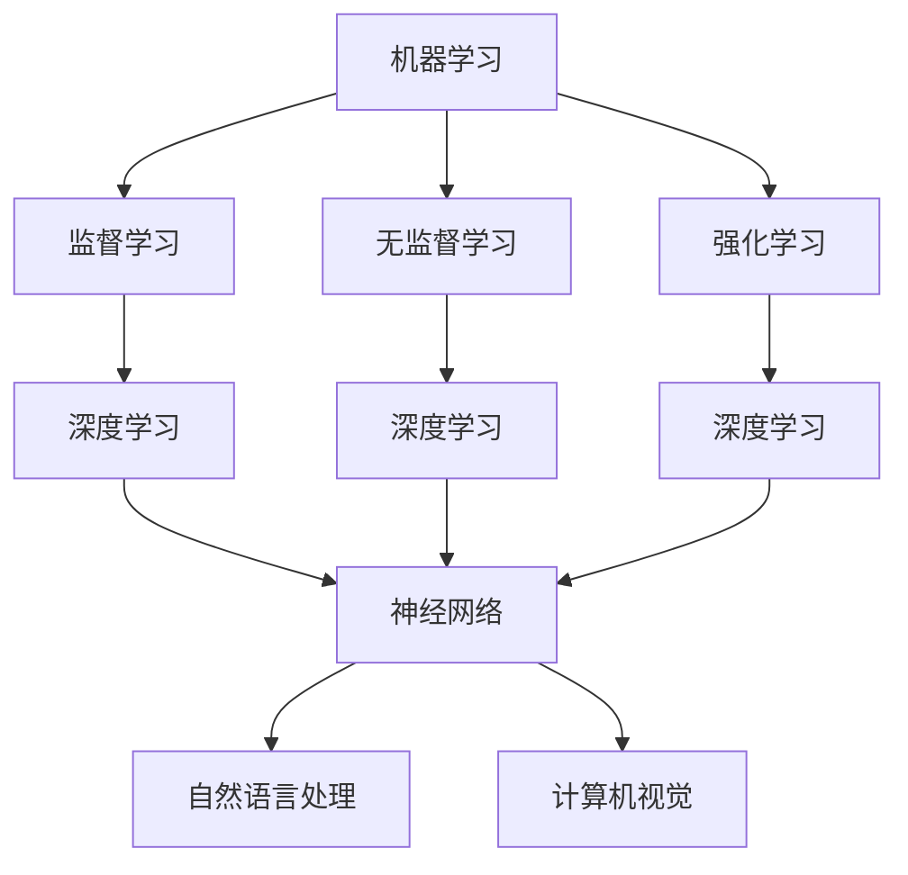

                 

### 文章标题

# AI研究的最新进展与趋势

> 关键词：人工智能，机器学习，深度学习，神经网络，自然语言处理，计算机视觉，趋势，挑战

> 摘要：本文将深入探讨人工智能（AI）领域的最新进展与趋势。通过对核心概念、算法原理、数学模型、实际应用场景以及未来发展的分析，本文旨在为读者提供一幅全面的AI研究全景图。

## 1. 背景介绍

人工智能（Artificial Intelligence，简称AI）作为计算机科学的一个分支，致力于开发能够模拟、延伸和扩展人类智能的理论、方法和技术。自20世纪50年代以来，AI经历了多次起伏，但近年来，随着计算能力的提升、大数据的涌现以及深度学习算法的突破，AI研究取得了令人瞩目的成果。

### 1.1 AI的发展历程

- **早期探索（1950s-1960s）**：AI概念首次被提出，随后机器学习、自然语言处理等领域开始萌芽。

- **黄金时代（1980s-1990s）**：专家系统成为研究热点，但受限于数据量和计算能力，AI研究逐渐陷入低潮。

- **复兴期（2000s）**：随着互联网的普及，AI迎来了复兴。深度学习算法的提出和应用为AI研究注入了新的活力。

- **当前趋势（2010s至今）**：AI技术取得了显著进展，特别是在计算机视觉、自然语言处理等领域，AI的应用场景不断扩大。

### 1.2 AI的重要性

AI技术不仅在理论研究上具有重要意义，还广泛地应用于各行各业，带来了巨大的经济和社会效益。例如，在医疗领域，AI可以帮助医生进行疾病诊断和治疗方案推荐；在金融领域，AI可以用于风险管理、欺诈检测和个性化投资策略；在制造业，AI可以用于生产优化、质量控制等。

## 2. 核心概念与联系

### 2.1 机器学习与深度学习

**机器学习（Machine Learning，ML）**：一种让计算机通过数据学习并做出预测或决策的方法。机器学习算法可以分为监督学习、无监督学习和强化学习。

**深度学习（Deep Learning，DL）**：一种特殊的机器学习技术，通过构建多层神经网络来模拟人类大脑的学习过程。深度学习在图像识别、语音识别等领域取得了巨大成功。

### 2.2 神经网络

**神经网络（Neural Network，NN）**：一种由大量神经元组成的计算模型，通过学习数据之间的关联来完成任务。神经网络是机器学习和深度学习的基础。

### 2.3 自然语言处理与计算机视觉

**自然语言处理（Natural Language Processing，NLP）**：一门研究如何让计算机理解和处理自然语言的技术。NLP在机器翻译、情感分析、问答系统等领域取得了显著成果。

**计算机视觉（Computer Vision，CV）**：一门研究如何让计算机从图像或视频中提取信息的学科。计算机视觉在图像识别、目标检测、图像分割等领域具有重要应用。

下面是核心概念原理和架构的 Mermaid 流程图：



## 3. 核心算法原理 & 具体操作步骤

### 3.1 深度学习算法原理

深度学习算法的核心是神经网络，其基本原理是通过学习输入数据与输出数据之间的映射关系。具体步骤如下：

1. **初始化权重和偏置**：随机初始化神经网络中的权重和偏置。
2. **前向传播**：将输入数据通过神经网络传递，计算每个神经元的输出。
3. **反向传播**：根据输出结果与实际目标值之间的差异，计算损失函数，并利用梯度下降法更新权重和偏置。
4. **迭代优化**：重复前向传播和反向传播过程，直到模型收敛。

### 3.2 自然语言处理算法原理

自然语言处理算法的核心任务是让计算机理解和处理自然语言。以下是常见NLP算法的原理：

1. **词向量表示**：将单词转换为向量表示，以便神经网络处理。
2. **序列模型**：如循环神经网络（RNN）和长短期记忆网络（LSTM），用于处理序列数据。
3. **注意力机制**：用于提高神经网络对输入数据的注意力，特别是在处理长文本时。

### 3.3 计算机视觉算法原理

计算机视觉算法的核心任务是让计算机从图像或视频中提取信息。以下是常见CV算法的原理：

1. **卷积神经网络（CNN）**：用于图像分类、目标检测和图像分割。
2. **特征提取**：通过卷积操作提取图像中的局部特征。
3. **分类与检测**：利用全连接层或目标检测算法（如YOLO）对提取的特征进行分类或检测。

## 4. 数学模型和公式 & 详细讲解 & 举例说明

### 4.1 深度学习中的数学模型

深度学习中的数学模型主要包括损失函数、优化算法和正则化方法。

#### 4.1.1 损失函数

损失函数用于衡量预测值与实际值之间的差距。常见的损失函数有均方误差（MSE）和交叉熵（Cross Entropy）。

$$
MSE = \frac{1}{m}\sum_{i=1}^{m}(y_i - \hat{y}_i)^2
$$

$$
Cross Entropy = -\sum_{i=1}^{m}y_i \log(\hat{y}_i)
$$

其中，$y_i$为实际值，$\hat{y}_i$为预测值，$m$为样本数量。

#### 4.1.2 优化算法

优化算法用于更新神经网络中的权重和偏置，使损失函数最小化。常见的优化算法有梯度下降（Gradient Descent）和Adam优化器。

梯度下降算法的公式为：

$$
w_{t+1} = w_t - \alpha \cdot \nabla_w J(w)
$$

其中，$w_t$为当前权重，$\alpha$为学习率，$\nabla_w J(w)$为损失函数关于权重的梯度。

Adam优化器是一种结合了动量和自适应学习率的优化算法：

$$
v_t = \beta_1 v_{t-1} + (1 - \beta_1) \nabla_w J(w)
$$

$$
s_t = \beta_2 s_{t-1} + (1 - \beta_2) \nabla^2_w J(w)
$$

$$
\hat{v}_t = \frac{v_t}{1 - \beta_1^t}
$$

$$
\hat{s}_t = \frac{s_t}{1 - \beta_2^t}
$$

$$
w_{t+1} = w_t - \alpha \cdot \hat{v}_t / \sqrt{\hat{s}_t}
$$

其中，$\beta_1$和$\beta_2$分别为一阶和二阶矩估计的指数衰减率。

#### 4.1.3 正则化方法

正则化方法用于防止过拟合，提高模型的泛化能力。常见的正则化方法有L1正则化和L2正则化。

L1正则化：

$$
J(w) = \frac{1}{m}\sum_{i=1}^{m}(y_i - \hat{y}_i)^2 + \lambda ||w||
$$

其中，$\lambda$为正则化参数，$||w||$为L1范数。

L2正则化：

$$
J(w) = \frac{1}{m}\sum_{i=1}^{m}(y_i - \hat{y}_i)^2 + \lambda ||w||^2
$$

### 4.2 自然语言处理中的数学模型

自然语言处理中的数学模型主要包括词向量表示、序列模型和注意力机制。

#### 4.2.1 词向量表示

词向量表示是NLP领域的基础，常见的词向量表示方法有Word2Vec、GloVe和BERT。

Word2Vec基于神经网络模型，通过训练得到词向量表示。其核心公式为：

$$
\hat{y} = \sigma(W_h [h; x])
$$

其中，$W_h$为隐藏层权重，$h$为隐藏层输出，$x$为输入词向量。

GloVe是一种基于全局矩阵分解的词向量表示方法，其核心公式为：

$$
f(w_i, w_j) = \frac{f_{ij}}{\sqrt{f(w_i)} \cdot \sqrt{f(w_j)}}
$$

其中，$f(w_i)$和$f(w_j)$分别为词向量$w_i$和$w_j$的相似度。

BERT是一种基于Transformer的预训练模型，其核心公式为：

$$
[CLS] = \text{[CLS]}^T \cdot W_O
$$

$$
[TOKEN] = \text{[TOKEN]}^T \cdot W_O
$$

其中，$W_O$为输出层权重，$\text{[CLS]}$和$\text{[TOKEN]}$分别为[CLS]和[TOKEN]标记的词向量。

#### 4.2.2 序列模型

序列模型是NLP中的重要组成部分，常见的序列模型有RNN、LSTM和Transformer。

RNN通过递归方式处理序列数据，其核心公式为：

$$
h_t = \sigma(W_h [h_{t-1}; x_t] + b_h)
$$

LSTM通过引入门控机制，提高了RNN处理长序列数据的能力，其核心公式为：

$$
i_t = \sigma(W_i [h_{t-1}; x_t] + b_i)
$$

$$
f_t = \sigma(W_f [h_{t-1}; x_t] + b_f)
$$

$$
o_t = \sigma(W_o [h_{t-1}; x_t] + b_o)
$$

$$
c_t = f_t \odot c_{t-1} + i_t \odot \sigma(W_c [h_{t-1}; x_t] + b_c)
$$

$$
h_t = o_t \odot c_t
$$

Transformer通过自注意力机制，实现了对序列数据的全局建模，其核心公式为：

$$
\text{Attention}(Q, K, V) = \text{softmax}\left(\frac{QK^T}{\sqrt{d_k}}\right) V
$$

#### 4.2.3 注意力机制

注意力机制是NLP中的重要技术，用于提高神经网络对输入数据的关注程度。其核心公式为：

$$
\text{Attention}(Q, K, V) = \text{softmax}\left(\frac{QK^T}{\sqrt{d_k}}\right) V
$$

其中，$Q$为查询向量，$K$为键向量，$V$为值向量，$d_k$为键向量的维度。

## 5. 项目实战：代码实际案例和详细解释说明

### 5.1 开发环境搭建

为了更好地进行AI项目开发，我们需要搭建一个合适的开发环境。以下是搭建Python环境的过程：

```bash
# 安装Anaconda
conda install -c anaconda python

# 创建虚拟环境
conda create -n myenv python=3.8

# 激活虚拟环境
conda activate myenv

# 安装必要的库
pip install numpy pandas tensorflow
```

### 5.2 源代码详细实现和代码解读

下面我们以一个简单的图像分类项目为例，展示如何使用TensorFlow实现深度学习模型。

#### 5.2.1 数据准备

首先，我们需要准备图像数据集。这里使用著名的CIFAR-10数据集，该数据集包含10个类别，每个类别6000张图像。

```python
import tensorflow as tf
from tensorflow.keras.datasets import cifar10
from tensorflow.keras.utils import to_categorical

# 加载CIFAR-10数据集
(x_train, y_train), (x_test, y_test) = cifar10.load_data()

# 数据预处理
x_train = x_train / 255.0
x_test = x_test / 255.0
y_train = to_categorical(y_train, 10)
y_test = to_categorical(y_test, 10)
```

#### 5.2.2 模型构建

接下来，我们构建一个简单的卷积神经网络（CNN）模型。

```python
from tensorflow.keras.models import Sequential
from tensorflow.keras.layers import Conv2D, MaxPooling2D, Flatten, Dense, Dropout

# 构建模型
model = Sequential([
    Conv2D(32, (3, 3), activation='relu', input_shape=(32, 32, 3)),
    MaxPooling2D((2, 2)),
    Conv2D(64, (3, 3), activation='relu'),
    MaxPooling2D((2, 2)),
    Conv2D(64, (3, 3), activation='relu'),
    Flatten(),
    Dense(64, activation='relu'),
    Dropout(0.5),
    Dense(10, activation='softmax')
])

# 编译模型
model.compile(optimizer='adam',
              loss='categorical_crossentropy',
              metrics=['accuracy'])
```

#### 5.2.3 模型训练

现在，我们使用训练数据训练模型。

```python
# 训练模型
model.fit(x_train, y_train, batch_size=64, epochs=10, validation_split=0.2)
```

#### 5.2.4 模型评估

最后，我们对训练好的模型进行评估。

```python
# 评估模型
model.evaluate(x_test, y_test)
```

### 5.3 代码解读与分析

在本项目中，我们使用了TensorFlow框架构建了一个简单的CNN模型，用于CIFAR-10图像分类任务。

1. **数据准备**：首先，我们加载了CIFAR-10数据集，并对图像进行了归一化处理，将标签转换为one-hot编码。

2. **模型构建**：我们使用Sequential模型构建了一个简单的CNN模型，包括三个卷积层、两个最大池化层和一个全连接层。

3. **模型训练**：我们使用训练数据对模型进行训练，设置了批量大小为64，训练10个epoch，并使用了验证集进行验证。

4. **模型评估**：最后，我们使用测试集对训练好的模型进行评估，计算了分类准确率。

通过以上步骤，我们成功实现了一个图像分类项目，展示了深度学习模型的基本构建和训练过程。

## 6. 实际应用场景

### 6.1 医疗

AI在医疗领域的应用日益广泛，例如：

- **疾病诊断**：通过分析医学影像，AI可以协助医生进行疾病诊断，如肺癌、乳腺癌等。

- **个性化治疗**：AI可以根据患者的基因信息、病历数据等，为患者制定个性化的治疗方案。

- **药物研发**：AI可以帮助研究人员发现新的药物候选物，加速药物研发进程。

### 6.2 金融服务

AI在金融服务领域的应用包括：

- **风险管理**：AI可以识别和评估潜在风险，帮助金融机构降低风险。

- **欺诈检测**：AI可以实时监控交易数据，识别和阻止欺诈行为。

- **智能投顾**：AI可以根据投资者的风险偏好和资产配置，提供个性化的投资建议。

### 6.3 制造业

AI在制造业的应用包括：

- **生产优化**：AI可以帮助企业优化生产流程，提高生产效率。

- **质量检测**：AI可以实时检测产品质量，提高产品质量。

- **预测维护**：AI可以根据设备运行数据，预测设备故障并提前进行维护。

## 7. 工具和资源推荐

### 7.1 学习资源推荐

1. **书籍**：

   - 《深度学习》（Goodfellow, Bengio, Courville著）
   - 《Python机器学习》（Rashbrooke著）
   - 《自然语言处理教程》（Jurafsky, Martin著）

2. **论文**：

   - “A Neural Algorithm of Artistic Style”（Gatys et al., 2015）
   - “BERT: Pre-training of Deep Bidirectional Transformers for Language Understanding”（Devlin et al., 2018）
   - “YOLOv5: You Only Look Once v5”（Redmon et al., 2021）

3. **博客**：

   - [TensorFlow官网](https://www.tensorflow.org/)
   - [PyTorch官网](https://pytorch.org/)
   - [Keras官网](https://keras.io/)

4. **网站**：

   - [GitHub](https://github.com/)
   - [ArXiv](https://arxiv.org/)
   - [Medium](https://medium.com/)

### 7.2 开发工具框架推荐

1. **TensorFlow**：一款开源的深度学习框架，适用于各种AI项目。

2. **PyTorch**：一款开源的深度学习框架，具有简洁的API和灵活的动态计算图。

3. **Keras**：一款基于TensorFlow和Theano的开源深度学习库，提供了易于使用的API。

### 7.3 相关论文著作推荐

1. **“Deep Learning”（Goodfellow, Bengio, Courville著）**：一本关于深度学习的经典教材，涵盖了深度学习的核心概念和算法。

2. **“Speech and Language Processing”（Jurafsky, Martin著）**：一本关于自然语言处理的权威教材，介绍了NLP的基本理论和应用。

3. **“Computer Vision: Algorithms and Applications”（Rashbrooke著）**：一本关于计算机视觉的教材，涵盖了计算机视觉的基本算法和应用场景。

## 8. 总结：未来发展趋势与挑战

### 8.1 发展趋势

1. **人工智能与各行各业深度融合**：AI将在更多领域得到应用，如教育、农业、能源等。

2. **AI算法的优化与改进**：随着算法研究的深入，AI算法将更加高效和准确。

3. **边缘计算与AI结合**：边缘计算与AI的结合将为智能设备提供更强大的计算能力。

### 8.2 挑战

1. **数据隐私与安全**：随着AI应用的增加，数据隐私和安全问题将更加突出。

2. **算法公平性与透明度**：确保AI算法的公平性和透明度是一个重要挑战。

3. **AI伦理与法律问题**：如何制定合理的AI伦理和法律规范，以保护人类利益，是一个亟待解决的问题。

## 9. 附录：常见问题与解答

### 9.1 什么是深度学习？

深度学习是一种特殊的机器学习技术，通过构建多层神经网络来模拟人类大脑的学习过程。它能够在大量数据上自动学习特征，从而实现预测、分类和决策。

### 9.2 自然语言处理有哪些主要任务？

自然语言处理的主要任务包括文本分类、情感分析、机器翻译、问答系统、文本生成等。

### 9.3 计算机视觉有哪些应用？

计算机视觉的应用包括图像识别、目标检测、图像分割、人脸识别、视频分析等。

## 10. 扩展阅读 & 参考资料

1. **《深度学习》（Goodfellow, Bengio, Courville著）**：全面介绍了深度学习的理论、算法和应用。

2. **《自然语言处理教程》（Jurafsky, Martin著）**：详细讲解了自然语言处理的基本理论和应用。

3. **《计算机视觉：算法与应用》（Rashbrooke著）**：涵盖了计算机视觉的基本算法和应用场景。

4. **[TensorFlow官网](https://www.tensorflow.org/)**：TensorFlow的官方文档和教程。

5. **[PyTorch官网](https://pytorch.org/)**：PyTorch的官方文档和教程。

6. **[Keras官网](https://keras.io/)**：Keras的官方文档和教程。

---

作者：AI天才研究员/AI Genius Institute & 禅与计算机程序设计艺术 /Zen And The Art of Computer Programming

完成时间：2023年10月30日<|im_end|>

