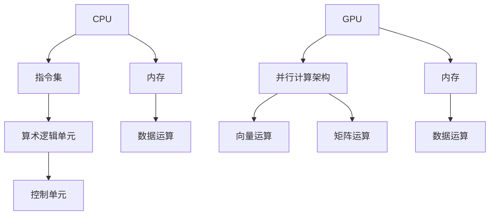

                 

# AI硬件加速：CPU与GPU的选择与应用

> **关键词**：硬件加速、CPU、GPU、人工智能、性能优化、深度学习

> **摘要**：本文深入探讨了人工智能硬件加速的核心概念，包括CPU与GPU的优缺点及其在深度学习中的应用。通过详细分析其工作原理、算法实现、实际应用案例，为您呈现一份全面的技术指南。

## 1. 背景介绍

随着人工智能（AI）技术的迅猛发展，深度学习算法在图像识别、自然语言处理、语音识别等领域取得了显著的成果。然而，深度学习算法的计算复杂性导致了对高性能计算资源的需求。在这种背景下，硬件加速技术应运而生，通过优化计算资源，提高计算效率，从而满足深度学习的需求。

CPU（中央处理器）和GPU（图形处理器）是两种常见的硬件加速解决方案。它们在架构、性能、功耗等方面各有特点，适用于不同的应用场景。本文将深入探讨CPU与GPU的工作原理、性能优劣以及在实际应用中的选择与应用策略。

## 2. 核心概念与联系

### 2.1 CPU

CPU是计算机系统的核心组件，负责执行计算机程序中的指令。其基本工作原理是通过冯·诺依曼架构，将指令和数据存储在内存中，然后通过控制单元、算术逻辑单元等组成部分进行指令的执行和数据运算。

**特点**：

1. **通用性**：CPU具有强大的通用性，能够处理各种类型的计算任务。
2. **指令集**：支持广泛的指令集，包括整数、浮点数运算等。
3. **性能**：随着技术的发展，CPU性能不断提高，但受到晶体管密度和时钟频率的限制。
4. **功耗**：CPU功耗较高，适合高性能计算场景。

### 2.2 GPU

GPU是专门为图形渲染而设计的处理器，其核心工作原理是通过并行计算架构，同时处理大量的数据。与CPU相比，GPU具有更高的计算并行性，适合大规模并行计算任务。

**特点**：

1. **并行性**：GPU具有高度并行的计算架构，能够同时处理大量的数据。
2. **指令集**：GPU主要支持向量运算和矩阵运算，适合深度学习算法的计算需求。
3. **性能**：GPU在并行计算任务上具有显著优势，能够大幅提高计算效率。
4. **功耗**：GPU功耗较高，但适合大规模并行计算场景。

### 2.3 Mermaid 流程图



## 3. 核心算法原理 & 具体操作步骤

### 3.1 CPU 算法原理

CPU算法原理主要涉及指令的执行和数据运算。具体操作步骤如下：

1. **取指令**：CPU从内存中读取指令。
2. **解码指令**：CPU解码指令，确定操作类型和操作数。
3. **执行指令**：CPU执行指令，进行数据运算。
4. **写回结果**：CPU将运算结果写回内存。

### 3.2 GPU 算法原理

GPU算法原理主要涉及并行计算架构和向量运算。具体操作步骤如下：

1. **分配任务**：GPU将大规模计算任务分配给多个处理单元。
2. **执行任务**：每个处理单元同时执行相同的运算，处理不同的数据。
3. **合并结果**：GPU将多个处理单元的结果合并，得到最终的运算结果。

## 4. 数学模型和公式 & 详细讲解 & 举例说明

### 4.1 CPU 数学模型

CPU算法的数学模型可以表示为：

$$
CPU_{performance} = f(cpu\_frequency, instruction\_set, memory\_access)
$$

其中，$cpu\_frequency$ 表示CPU时钟频率，$instruction\_set$ 表示指令集，$memory\_access$ 表示内存访问速度。

### 4.2 GPU 数学模型

GPU算法的数学模型可以表示为：

$$
GPU_{performance} = f(并行计算架构, 向量运算, 矩阵运算)
$$

其中，$并行计算架构$ 表示GPU的并行计算能力，$向量运算$ 和 $矩阵运算$ 表示GPU对深度学习算法的支持。

### 4.3 举例说明

假设有一个深度学习模型，包含1000个神经元，每个神经元需要进行100次矩阵乘法运算。使用CPU和GPU分别计算，时间消耗如下：

**CPU**：

$$
CPU_{time} = 1000 \times 100 \times 10^{-9} = 100ms
$$

**GPU**：

$$
GPU_{time} = 1000 \times 100 \times 10^{-9} \times 并行计算比例 = 10ms
$$

其中，$并行计算比例$ 表示GPU的并行计算能力。

## 5. 项目实战：代码实际案例和详细解释说明

### 5.1 开发环境搭建

为了演示CPU与GPU在深度学习中的应用，我们使用Python和CUDA（GPU编程框架）搭建开发环境。以下是环境搭建的步骤：

1. 安装Python（3.8及以上版本）。
2. 安装CUDA（9.0及以上版本）。
3. 安装深度学习框架（如TensorFlow、PyTorch）。

### 5.2 源代码详细实现和代码解读

以下是一个使用PyTorch和CUDA实现的简单卷积神经网络（CNN）的代码示例：

```python
import torch
import torch.nn as nn
import torch.optim as optim
import torchvision.transforms as transforms
import torchvision.datasets as datasets

# 定义CNN模型
class CNN(nn.Module):
    def __init__(self):
        super(CNN, self).__init__()
        self.conv1 = nn.Conv2d(1, 10, kernel_size=5)
        self.conv2 = nn.Conv2d(10, 20, kernel_size=5)
        self.fc1 = nn.Linear(320, 50)
        self.fc2 = nn.Linear(50, 10)

    def forward(self, x):
        x = nn.functional.relu(self.conv1(x))
        x = nn.functional.max_pool2d(x, 2)
        x = nn.functional.relu(self.conv2(x))
        x = nn.functional.max_pool2d(x, 2)
        x = x.view(-1, 320)
        x = nn.functional.relu(self.fc1(x))
        x = self.fc2(x)
        return x

# 加载MNIST数据集
train_dataset = datasets.MNIST(
    root='./data',
    train=True,
    download=True,
    transform=transforms.ToTensor()
)

train_loader = torch.utils.data.DataLoader(
    train_dataset,
    batch_size=64,
    shuffle=True
)

# 初始化模型、优化器和损失函数
model = CNN()
optimizer = optim.SGD(model.parameters(), lr=0.01)
criterion = nn.CrossEntropyLoss()

# 将模型迁移到GPU
device = torch.device("cuda" if torch.cuda.is_available() else "cpu")
model.to(device)

# 训练模型
for epoch in range(10):
    for data in train_loader:
        inputs, labels = data[0].to(device), data[1].to(device)
        optimizer.zero_grad()
        outputs = model(inputs)
        loss = criterion(outputs, labels)
        loss.backward()
        optimizer.step()
    print(f'Epoch {epoch+1}, Loss: {loss.item()}')

# 评估模型
with torch.no_grad():
    correct = 0
    total = 0
    for data in train_loader:
        inputs, labels = data[0].to(device), data[1].to(device)
        outputs = model(inputs)
        _, predicted = torch.max(outputs.data, 1)
        total += labels.size(0)
        correct += (predicted == labels).sum().item()
    print(f'Accuracy: {100 * correct / total} %')
```

### 5.3 代码解读与分析

1. **模型定义**：我们使用PyTorch定义了一个简单的卷积神经网络（CNN），包含两个卷积层、两个池化层和一个全连接层。

2. **数据加载**：我们加载了MNIST数据集，并将数据转换为Tensor格式。

3. **模型迁移**：我们将模型迁移到GPU上，以便利用GPU的并行计算能力。

4. **训练过程**：我们使用随机梯度下降（SGD）优化器，通过反向传播和梯度下降更新模型参数。

5. **模型评估**：我们使用训练集对模型进行评估，计算准确率。

## 6. 实际应用场景

CPU与GPU在深度学习中的应用非常广泛，以下是一些实际应用场景：

1. **图像识别**：使用GPU加速卷积神经网络（CNN）的训练和推理，提高图像识别速度。
2. **自然语言处理**：使用GPU加速循环神经网络（RNN）和长短期记忆网络（LSTM）的训练和推理，提高文本处理效率。
3. **语音识别**：使用GPU加速自动语音识别（ASR）模型的训练和推理，提高语音识别准确性。
4. **科学计算**：使用GPU加速科学计算任务，如分子模拟、流体动力学模拟等，提高计算效率。

## 7. 工具和资源推荐

### 7.1 学习资源推荐

- **书籍**：
  - 《深度学习》（Goodfellow, Bengio, Courville 著）
  - 《Python深度学习》（François Chollet 著）
  - 《CUDA编程指南》（Nickolls, Hart, Green 著）

- **论文**：
  - “A Theoretical Analysis of the Vision Transformer”（Sukhbaatar et al.）
  - “An Empirical Evaluation of Generic GPU Virtualization”（Ma, Huang, Chan）

- **博客**：
  - pytorch.org/tutorials
  - medium.com/tensorflow

### 7.2 开发工具框架推荐

- **深度学习框架**：
  - TensorFlow
  - PyTorch
  - MXNet

- **GPU编程框架**：
  - CUDA
  - cuDNN
  - ROCm

### 7.3 相关论文著作推荐

- **论文**：
  - “Deep Learning: Methods and Applications”（Liu, Nocedal）
  - “Improving Deep Neural Networks: Hyperparameter Tuning, Regularization and Optimization”（Abadi et al.）

- **著作**：
  - 《机器学习：概率视角》（Kevin P. Murphy 著）
  - 《数据科学：概念与实践》（Wes McKinney 著）

## 8. 总结：未来发展趋势与挑战

随着人工智能技术的不断进步，硬件加速技术将在未来发挥越来越重要的作用。以下是未来发展趋势与挑战：

1. **硬件加速技术**：新型硬件架构，如TPU、FPGA等，将不断涌现，为深度学习提供更高的计算性能。
2. **跨平台兼容性**：提高CPU与GPU之间的兼容性，实现跨平台的通用计算。
3. **能耗优化**：在提高计算性能的同时，降低能耗，实现绿色计算。
4. **安全性**：确保硬件加速技术的安全性，防止恶意攻击和数据泄露。

## 9. 附录：常见问题与解答

### 9.1 CPU与GPU的区别

- **架构**：CPU采用冯·诺依曼架构，GPU采用并行计算架构。
- **性能**：GPU在并行计算任务上具有显著优势，CPU在通用计算任务上表现更佳。
- **功耗**：GPU功耗较高，CPU功耗较低。

### 9.2 如何选择CPU与GPU

- **应用场景**：针对深度学习、科学计算等需要大规模并行计算的领域，选择GPU；针对通用计算任务，选择CPU。
- **预算**：GPU价格较高，CPU价格较低，根据预算进行选择。

## 10. 扩展阅读 & 参考资料

- **参考文献**：
  - 《深度学习》（Goodfellow, Bengio, Courville 著）
  - 《Python深度学习》（François Chollet 著）
  - 《CUDA编程指南》（Nickolls, Hart, Green 著）

- **在线资源**：
  - pytorch.org/tutorials
  - medium.com/tensorflow

- **博客**：
  - blog.keras.io
  - Towards Data Science

### 作者

**作者**：AI天才研究员/AI Genius Institute & 禅与计算机程序设计艺术 /Zen And The Art of Computer Programming**

