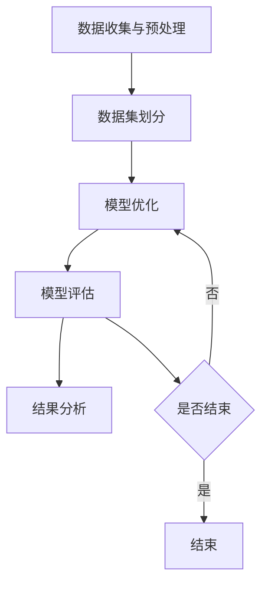
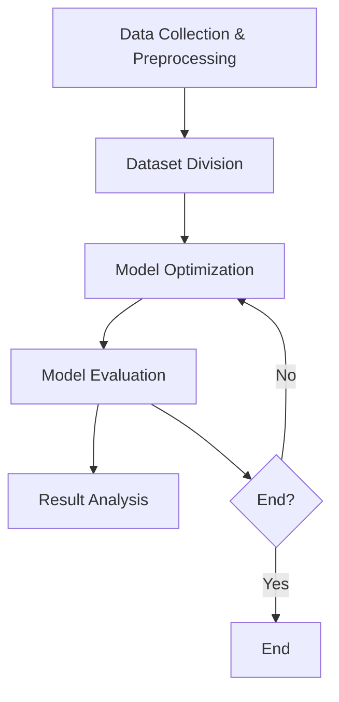

                 

### 背景介绍

AI系统的性能评估是确保人工智能系统在复杂应用环境中高效运行的关键环节。在现代科技领域，人工智能技术已经深入到各行各业，从自动驾驶到智能医疗，从金融分析到语音识别，AI系统的应用场景越来越广泛。然而，AI系统的性能不仅取决于算法的先进性，还与系统的架构设计、数据处理能力、硬件资源利用等多个因素密切相关。因此，对AI系统进行全面的性能评估，不仅能够发现系统潜在的瓶颈和问题，还能为优化系统性能提供有力的数据支持。

当前，AI系统性能评估面临着诸多挑战。首先，评估标准的多样性和复杂性使得评估工作难以统一。例如，在自动驾驶系统中，不仅要考虑反应速度和准确度，还要关注系统的鲁棒性和安全性。其次，评估过程中的数据依赖性较强，高质量的数据集对于评估结果的准确性至关重要。然而，获取这些数据往往成本高昂，且处理过程复杂。此外，不同场景下的性能评估需求各异，如何在不同场景下进行有效的性能评估也是一项重要挑战。

本文将深入探讨AI系统性能评估的实战技巧，旨在帮助读者理解性能评估的核心概念、算法原理，并提供实际操作步骤和案例。文章将涵盖以下几个方面：

1. **核心概念与联系**：介绍性能评估所需理解的基本概念，包括评估指标、评估流程等，并通过Mermaid流程图展示性能评估的架构。
2. **核心算法原理 & 具体操作步骤**：详细解释常用的性能评估算法，如交叉验证、A/B测试等，并给出具体的操作步骤。
3. **数学模型和公式 & 详细讲解 & 举例说明**：介绍性能评估中常用的数学模型和公式，并通过实例说明如何应用这些模型。
4. **项目实战：代码实际案例和详细解释说明**：通过一个具体的AI项目，展示如何进行性能评估，包括开发环境搭建、代码实现和解读。
5. **实际应用场景**：探讨不同应用场景下的性能评估策略，如自动驾驶、智能医疗等。
6. **工具和资源推荐**：推荐一些有用的学习资源和开发工具，帮助读者进一步了解和掌握性能评估技巧。
7. **总结：未来发展趋势与挑战**：总结本文的核心内容，并对AI系统性能评估的未来趋势和挑战进行展望。

通过本文的深入探讨，希望读者能够全面掌握AI系统性能评估的方法和技巧，为实际项目的成功实施提供有力支持。

> Keywords: AI System Performance Evaluation, Practical Techniques, Algorithm, Mathematical Models, Case Studies

> Abstract:
This article delves into the practical techniques for evaluating the performance of AI systems. We cover fundamental concepts, core algorithms, mathematical models, and real-world case studies, aiming to provide a comprehensive guide for readers to master the art of performance evaluation in AI applications.

## 1. 背景介绍

在现代科技领域，人工智能（AI）已经成为推动产业变革的重要力量。无论是自动驾驶、智能医疗、金融分析，还是智能家居，AI系统的广泛应用都极大地改变了我们的生活方式和工作方式。然而，随着AI系统复杂性的增加，确保其性能的稳定和高效运行变得愈发重要。这就需要我们进行系统化的性能评估，以便及时发现并解决潜在问题，从而提高系统的可靠性和用户体验。

### 性能评估的重要性

性能评估是AI系统开发过程中的关键环节，其重要性主要体现在以下几个方面：

1. **发现系统瓶颈**：通过性能评估，可以发现AI系统在运行过程中存在的瓶颈，如计算资源不足、算法效率低下等，从而为优化提供依据。
2. **优化系统设计**：性能评估可以帮助我们识别系统设计的不足，如数据预处理不够充分、模型参数设置不当等，进而优化系统架构和算法。
3. **确保系统稳定**：性能评估能够验证AI系统在不同条件下的稳定性，确保其在实际应用中不会出现意外故障。
4. **提升用户体验**：通过性能评估，我们可以确保AI系统在用户实际使用中能够提供高效、稳定的服务，从而提升用户体验。

### 性能评估的挑战

尽管性能评估的重要性不言而喻，但实际操作中仍面临诸多挑战：

1. **评估标准的多样性**：不同的AI系统和应用场景需要不同的评估标准，这使得评估工作难以统一和标准化。
2. **数据依赖性**：性能评估依赖于大量的高质量数据，获取和处理这些数据往往成本高昂且复杂。
3. **评估流程复杂性**：性能评估涉及多个环节，包括数据准备、指标选择、算法应用等，流程复杂，易出错。
4. **评估结果的解释性**：评估结果需要具备良好的解释性，以便技术人员能够理解并采取相应的优化措施。

### 文章结构

为了帮助读者全面了解AI系统性能评估的实战技巧，本文结构如下：

1. **核心概念与联系**：介绍性能评估所需理解的基本概念，如评估指标、评估流程等，并通过Mermaid流程图展示性能评估的架构。
2. **核心算法原理 & 具体操作步骤**：详细解释常用的性能评估算法，如交叉验证、A/B测试等，并给出具体的操作步骤。
3. **数学模型和公式 & 详细讲解 & 举例说明**：介绍性能评估中常用的数学模型和公式，并通过实例说明如何应用这些模型。
4. **项目实战：代码实际案例和详细解释说明**：通过一个具体的AI项目，展示如何进行性能评估，包括开发环境搭建、代码实现和解读。
5. **实际应用场景**：探讨不同应用场景下的性能评估策略，如自动驾驶、智能医疗等。
6. **工具和资源推荐**：推荐一些有用的学习资源和开发工具，帮助读者进一步了解和掌握性能评估技巧。
7. **总结：未来发展趋势与挑战**：总结本文的核心内容，并对AI系统性能评估的未来趋势和挑战进行展望。

通过本文的深入探讨，希望读者能够全面掌握AI系统性能评估的方法和技巧，为实际项目的成功实施提供有力支持。

---

In this section, we will delve into the importance and challenges of AI system performance evaluation, providing a comprehensive overview of the practical techniques that will be covered in the following sections of the article. This will set the stage for a deeper understanding of how to effectively evaluate the performance of AI systems in various applications.

### 1.1. 重要性

The significance of performance evaluation in AI systems cannot be overstated. In the modern technological landscape, where AI is increasingly becoming an integral part of various industries, ensuring the efficiency and reliability of these systems is crucial. AI systems are complex, often involving sophisticated algorithms, large-scale data processing, and intricate system architectures. Therefore, a systematic approach to performance evaluation is essential to identify and address potential issues that could affect their operation.

**Key Points of Importance:**

- **Identification of System Bottlenecks:** Performance evaluation helps to pinpoint bottlenecks in AI systems, such as insufficient computational resources or inefficient algorithms, providing insights for optimization.
- **Optimization of System Design:** By evaluating performance, one can identify shortcomings in system design, such as inadequate data preprocessing or suboptimal model parameters, allowing for architectural improvements.
- **Ensuring System Stability:** Performance evaluation verifies the stability of AI systems under various conditions, ensuring they do not encounter unexpected failures in real-world applications.
- **Improving User Experience:** Through performance evaluation, AI systems can be fine-tuned to provide efficient and stable services to users, enhancing overall user experience.

### 1.2. 挑战

Despite its importance, performance evaluation of AI systems faces several challenges:

**Challenges in Performance Evaluation:**

- **Diverse Evaluation Criteria:** Different AI systems and application scenarios require different evaluation criteria, making it difficult to establish a uniform and standardized approach.
- **Data Dependency:** Performance evaluation heavily relies on large volumes of high-quality data, which can be costly and complex to collect and process.
- **Complexity of Evaluation Process:** The performance evaluation process involves multiple steps, including data preparation, metric selection, and algorithm application, which can be intricate and prone to errors.
- **Interpretability of Evaluation Results:** The results of performance evaluation need to be interpretable so that technical personnel can understand the findings and take appropriate optimization measures.

### 1.3. 文章结构

To help readers fully grasp the practical techniques for evaluating the performance of AI systems, this article is structured as follows:

**Article Structure:**

1. **Core Concepts and Connections:** This section will introduce fundamental concepts required for performance evaluation, such as evaluation metrics and the evaluation process, and will be illustrated with a Mermaid flowchart.
2. **Core Algorithm Principles & Step-by-Step Procedures:** This section will explain common performance evaluation algorithms, such as cross-validation and A/B testing, and provide detailed operational steps.
3. **Mathematical Models and Formulas & Detailed Explanations & Examples:** This section will cover the mathematical models and formulas frequently used in performance evaluation and provide practical examples of their application.
4. **Project Case Study: Code Implementation and Detailed Explanation:** A real-world AI project will be used to demonstrate how to perform performance evaluation, including setting up the development environment, code implementation, and analysis.
5. **Practical Application Scenarios:** This section will discuss performance evaluation strategies for different application scenarios, such as autonomous driving and intelligent healthcare.
6. **Tools and Resource Recommendations:** This section will recommend useful learning resources and development tools to assist readers in further understanding and mastering performance evaluation techniques.
7. **Conclusion: Future Trends and Challenges:** The core content of the article will be summarized, and future trends and challenges in AI system performance evaluation will be展望ed.

Through an in-depth discussion in this article, we aim to equip readers with a comprehensive understanding of AI system performance evaluation methods and techniques, providing valuable support for the successful implementation of actual projects.

---

在接下来的部分中，我们将详细探讨性能评估所需理解的核心概念和流程，并通过Mermaid流程图展示性能评估的整体架构。这将帮助我们更好地理解性能评估的基本框架和关键要素。

### 2. 核心概念与联系

在AI系统性能评估中，理解核心概念和它们之间的联系是至关重要的。这些核心概念包括评估指标、评估流程、数据集准备、评估算法等。通过深入探讨这些概念，我们可以为后续的算法原理和具体操作步骤奠定坚实的基础。

#### 2.1. 评估指标

评估指标是衡量AI系统性能的关键工具。常见的评估指标包括准确率（Accuracy）、召回率（Recall）、精确率（Precision）、F1分数（F1 Score）等。每种指标都有其特定的应用场景和优势。

- **准确率（Accuracy）**：准确率是评估分类模型性能的一个基本指标，表示正确分类的样本占总样本的比例。公式为：\[ Accuracy = \frac{True\ Positives + True\ Negatives}{True\ Positives + True\ Negatives + False\ Positives + False\ Negatives} \]
- **召回率（Recall）**：召回率表示实际为正类的样本中被正确识别为正类的比例。公式为：\[ Recall = \frac{True\ Positives}{True\ Positives + False\ Negatives} \]
- **精确率（Precision）**：精确率表示被预测为正类的样本中实际为正类的比例。公式为：\[ Precision = \frac{True\ Positives}{True\ Positives + False\ Positives} \]
- **F1分数（F1 Score）**：F1分数是精确率和召回率的调和平均值，用于综合评估分类模型的性能。公式为：\[ F1\ Score = 2 \times \frac{Precision \times Recall}{Precision + Recall} \]

#### 2.2. 评估流程

性能评估流程通常包括以下几个步骤：

1. **数据收集与预处理**：收集与评估任务相关的数据，并进行数据清洗、归一化、缺失值处理等预处理操作。
2. **数据集划分**：将预处理后的数据集划分为训练集、验证集和测试集，以便在训练过程中验证模型性能。
3. **模型训练**：使用训练集对模型进行训练，调整模型参数以优化性能。
4. **模型评估**：使用验证集和测试集对模型进行评估，计算评估指标以衡量模型性能。
5. **结果分析**：根据评估结果分析模型的优势和不足，为模型优化提供方向。

#### 2.3. 数据集准备

数据集准备是性能评估的重要环节。一个高质量的数据集不仅包含丰富的样本，还需要具有代表性的标签，以便模型能够从中学习和验证性能。以下是一些常见的数据集划分方法：

- **K折交叉验证（K-Fold Cross-Validation）**：将数据集划分为K个相等的子集，每次使用一个子集作为验证集，其余子集作为训练集，重复K次，取平均评估结果。
- **A/B测试**：在两个或多个版本中随机分配样本，比较不同版本的评估指标，以确定最佳版本。

#### 2.4. 评估算法

性能评估算法是评估AI系统性能的核心工具。以下是一些常用的评估算法：

- **ROC曲线（Receiver Operating Characteristic Curve）**：通过计算不同阈值下的真正例率和假正例率，评估二分类模型的性能。
- **AUC（Area Under Curve）**：ROC曲线下的面积，用于衡量模型分类能力。
- **MAE（Mean Absolute Error）**：平均绝对误差，用于评估回归模型的预测准确性。
- **RMSE（Root Mean Square Error）**：均方根误差，用于评估回归模型的预测准确性。

#### 2.5. Mermaid流程图

为了更直观地展示性能评估的架构，我们使用Mermaid流程图来描述评估流程：



在这个流程图中，每个节点表示性能评估过程中的一个步骤，箭头表示步骤之间的逻辑关系。通过这个流程图，我们可以清晰地理解性能评估的整体架构和关键步骤。

通过以上对核心概念和流程的探讨，我们为后续的性能评估算法原理和具体操作步骤奠定了基础。在接下来的部分中，我们将进一步深入探讨性能评估算法的原理和应用。

---

### Core Concepts and Relationships

Understanding the core concepts and their relationships is crucial for effective AI system performance evaluation. These core concepts include evaluation metrics, evaluation processes, dataset preparation, and evaluation algorithms. A deep dive into these concepts will lay a solid foundation for the subsequent sections on algorithm principles and specific operational steps.

#### 2.1. Evaluation Metrics

Evaluation metrics are the key tools for measuring the performance of AI systems. Common evaluation metrics include accuracy, recall, precision, and the F1 score, each with its specific application scenarios and advantages.

- **Accuracy**: Accuracy is a fundamental metric for evaluating classification model performance, representing the proportion of correctly classified samples out of the total samples. The formula is:
  \[ Accuracy = \frac{True\ Positives + True\ Negatives}{True\ Positives + True\ Negatives + False\ Positives + False\ Negatives} \]

- **Recall**: Recall measures the proportion of actual positive samples that are correctly identified as positive. The formula is:
  \[ Recall = \frac{True\ Positives}{True\ Positives + False\ Negatives} \]

- **Precision**: Precision measures the proportion of predicted positive samples that are actually positive. The formula is:
  \[ Precision = \frac{True\ Positives}{True\ Positives + False\ Positives} \]

- **F1 Score**: The F1 score is the harmonic mean of precision and recall, used to comprehensively evaluate the performance of classification models. The formula is:
  \[ F1\ Score = 2 \times \frac{Precision \times Recall}{Precision + Recall} \]

#### 2.2. Evaluation Process

The performance evaluation process typically includes the following steps:

1. **Data Collection and Preprocessing**: Collect data relevant to the evaluation task and perform operations such as data cleaning, normalization, and handling missing values.
2. **Dataset Division**: Divide the preprocessed data into training sets, validation sets, and test sets to validate model performance during training.
3. **Model Training**: Train the model using the training set, adjusting model parameters to optimize performance.
4. **Model Evaluation**: Evaluate the model using the validation and test sets, calculating evaluation metrics to measure model performance.
5. **Result Analysis**: Analyze the evaluation results to identify the strengths and weaknesses of the model, providing directions for optimization.

#### 2.3. Dataset Preparation

Dataset preparation is a critical part of performance evaluation. A high-quality dataset should not only contain a rich set of samples but also have representative labels to allow models to learn and validate their performance. Here are some common dataset division methods:

- **K-Fold Cross-Validation**: Divide the dataset into K equal subsets. In each iteration, use one subset as the validation set and the remaining subsets as the training set, repeat K times, and take the average evaluation result.
- **A/B Testing**: Randomly allocate samples between two or more versions to compare evaluation metrics and determine the best version.

#### 2.4. Evaluation Algorithms

Evaluation algorithms are the core tools for assessing AI system performance. Here are some commonly used evaluation algorithms:

- **ROC Curve**: The ROC curve calculates the true positive rate and false positive rate at different thresholds, used to evaluate the performance of binary classification models.
- **AUC**: The area under the ROC curve, used to measure the classification ability of models.
- **MAE**: Mean Absolute Error, used to evaluate the prediction accuracy of regression models.
- **RMSE**: Root Mean Square Error, used to evaluate the prediction accuracy of regression models.

#### 2.5. Mermaid Flowchart

To visualize the architecture of performance evaluation more intuitively, we use a Mermaid flowchart to describe the evaluation process:



In this flowchart, each node represents a step in the performance evaluation process, and the arrows indicate the logical relationships between steps. This flowchart provides a clear understanding of the overall architecture and key steps in performance evaluation.

By discussing the core concepts and processes above, we have laid a foundation for the subsequent sections on the principles of performance evaluation algorithms and specific operational steps. In the next sections, we will further delve into the principles and applications of these evaluation algorithms. 

---

## 3. 核心算法原理 & 具体操作步骤

在AI系统性能评估中，核心算法的原理和操作步骤是至关重要的。本章节将详细解释两种常用的性能评估算法：交叉验证（Cross-Validation）和A/B测试（A/B Testing），并给出具体的操作步骤。

### 3.1. 交叉验证

交叉验证是一种用于评估模型性能的统计方法，通过将数据集划分为多个子集，循环使用这些子集进行训练和验证，从而提高评估的准确性和可靠性。

**原理：**

交叉验证的基本原理是将数据集划分为K个相等的子集（称为折数K）。然后，每次取其中一个子集作为验证集，其余子集作为训练集。通过多次重复这个过程，可以计算出模型在不同子集上的性能指标，然后取平均，得到最终的评估结果。

**具体操作步骤：**

1. **数据集划分**：将数据集划分为K个子集，每个子集包含相同数量的样本。
2. **循环训练与验证**：对于每一个子集，将其作为验证集，其余子集作为训练集，训练模型并计算评估指标。
3. **计算平均指标**：将每次验证的结果取平均，得到最终的模型评估指标。

**示例：**

假设我们有一个包含100个样本的数据集，采用5折交叉验证：

- **第一次**：使用前80个样本训练模型，后20个样本验证。
- **第二次**：使用前60个样本训练模型，中间20个样本验证，后20个样本作为下一次的验证集。
- **第三次**：使用前40个样本训练模型，中间20个样本验证，后40个样本作为下一次的验证集。
- **第四次**：使用前20个样本训练模型，中间20个样本验证，后40个样本作为下一次的验证集。
- **第五次**：使用前20个样本训练模型，后80个样本验证。

然后，计算每次验证的准确率、召回率、F1分数等指标，并取平均，得到最终的结果。

### 3.2. A/B测试

A/B测试是一种常见的实验设计方法，用于评估不同版本（A和B）的性能差异。在AI系统中，A/B测试可以帮助我们确定哪个版本能够更好地满足用户需求或业务目标。

**原理：**

A/B测试的基本原理是将用户随机分配到两个或多个版本中，然后比较这些版本的性能指标，以确定哪个版本更优秀。具体来说，我们可以将用户流量分成多个部分，每个部分分配到不同的版本，收集数据并计算评估指标，如点击率、转化率、用户满意度等。

**具体操作步骤：**

1. **版本划分**：定义两个或多个版本的AI系统，每个版本对应一组不同的参数或设计。
2. **用户分配**：将用户随机分配到不同的版本，确保每个版本的样本量足够。
3. **数据收集**：收集用户的交互数据，如点击、购买、评论等。
4. **计算评估指标**：计算每个版本的评估指标，如点击率、转化率等。
5. **结果分析**：比较不同版本的评估指标，确定哪个版本更优秀。

**示例：**

假设我们有两个版本的推荐系统，版本A采用传统的协同过滤算法，版本B采用基于深度学习的推荐算法。我们可以将用户随机分成两组，一组使用版本A，另一组使用版本B。然后，收集两组用户的点击数据，计算点击率等指标。通过比较不同版本的点击率，我们可以确定哪个版本更适合我们的用户。

### 3.3. 比较与选择

交叉验证和A/B测试各有优缺点，适用于不同的场景。交叉验证更适合用于模型选择和参数调优，能够提供更可靠的评估结果；而A/B测试则更适合于实际应用场景，能够在真实用户环境中评估不同版本的性能。

- **交叉验证**：
  - **优点**：能够提供更全面的评估结果，减少模型选择和参数调优的风险。
  - **缺点**：需要更多的时间和计算资源，且无法在实际用户环境中评估模型性能。
- **A/B测试**：
  - **优点**：能够直接在用户环境中评估模型性能，快速找到最优版本。
  - **缺点**：可能受到用户行为的影响，评估结果可能具有偏差。

在实际应用中，可以根据具体情况选择合适的评估方法。例如，在模型开发初期，可以采用交叉验证进行模型选择和参数调优；在模型上线前，可以采用A/B测试评估实际效果。

通过上述对交叉验证和A/B测试的详细介绍，我们为AI系统性能评估提供了实用的算法原理和具体操作步骤。在接下来的章节中，我们将进一步探讨性能评估中的数学模型和公式。

---

### Core Algorithm Principles & Specific Operational Steps

The core algorithms and their operational steps are essential for effective AI system performance evaluation. This section will delve into two commonly used performance evaluation algorithms: Cross-Validation and A/B Testing, providing detailed explanations and specific operational steps.

#### 3.1. Cross-Validation

Cross-validation is a statistical method used to evaluate model performance. It involves dividing the dataset into multiple subsets, training and validating the model on these subsets in a round-robin fashion, thus enhancing the accuracy and reliability of the evaluation.

**Principles:**

The basic principle of cross-validation is to split the dataset into K equal subsets (also known as folds). Then, in each iteration, one subset is used as the validation set, while the remaining subsets are used as the training set. By repeating this process multiple times, the model's performance can be calculated across different subsets, and the average performance can be used as the final evaluation result.

**Specific Operational Steps:**

1. **Dataset Division**: Split the dataset into K subsets, each containing an equal number of samples.
2. **Circular Training and Validation**: For each subset, use it as the validation set and the remaining subsets as the training set to train the model and calculate the evaluation metrics.
3. **Calculate Average Metrics**: Take the average of the evaluation results from each validation to obtain the final model evaluation metrics.

**Example:**

Assume we have a dataset with 100 samples and we use 5-fold cross-validation:

- **First Iteration**: Train the model using the first 80 samples and validate using the last 20 samples.
- **Second Iteration**: Train the model using the first 60 samples, validate using the middle 20 samples, and use the last 20 samples for the next iteration's validation.
- **Third Iteration**: Train the model using the first 40 samples, validate using the middle 20 samples, and use the last 40 samples for the next iteration's validation.
- **Fourth Iteration**: Train the model using the first 20 samples, validate using the middle 20 samples, and use the last 40 samples for the next iteration's validation.
- **Fifth Iteration**: Train the model using the first 20 samples and validate using the last 80 samples.

Then, calculate the accuracy, recall, F1 score, etc., for each validation and take the average to get the final results.

#### 3.2. A/B Testing

A/B testing is a common experimental design method used to evaluate the performance differences between different versions. In AI systems, A/B testing can help determine which version better meets user needs or business objectives.

**Principles:**

The basic principle of A/B testing is to randomly allocate users to different versions and compare their performance metrics to determine which version is superior. Specifically, user traffic can be divided into multiple parts, each assigned to a different version, and interaction data such as clicks, purchases, and reviews can be collected to calculate evaluation metrics.

**Specific Operational Steps:**

1. **Version Division**: Define two or more versions of the AI system, each with a different set of parameters or design.
2. **User Allocation**: Randomly allocate users to different versions, ensuring that each version has a sufficient sample size.
3. **Data Collection**: Collect user interaction data, such as clicks, purchases, and reviews.
4. **Calculate Evaluation Metrics**: Calculate evaluation metrics for each version, such as click-through rate, conversion rate, etc.
5. **Result Analysis**: Compare the evaluation metrics of the different versions to determine which version is superior.

**Example:**

Assume we have two versions of a recommendation system. Version A uses traditional collaborative filtering algorithms, while Version B uses a deep learning-based recommendation algorithm. We can randomly divide users into two groups: one group uses Version A, and the other group uses Version B. Then, collect click data from both groups and calculate the click-through rate for each version. By comparing the click-through rates, we can determine which version is more suitable for our users.

#### 3.3. Comparison and Selection

Cross-validation and A/B testing have their advantages and disadvantages and are suitable for different scenarios. Cross-validation is more suitable for model selection and parameter tuning, providing more reliable evaluation results, while A/B testing is more suitable for real-world applications.

- **Cross-Validation**:
  - **Advantages**: Provides a comprehensive evaluation of the model, reducing the risk of model selection and parameter tuning.
  - **Disadvantages**: Requires more time and computational resources and cannot evaluate model performance in a real user environment.
- **A/B Testing**:
  - **Advantages**: Directly evaluates model performance in a real user environment, quickly identifying the best version.
  - **Disadvantages**: May be affected by user behavior, leading to biased evaluation results.

In practice, the appropriate evaluation method can be selected based on the specific situation. For example, cross-validation can be used for model selection and parameter tuning in the early stages of model development, while A/B testing can be used to evaluate the actual performance before the model is deployed.

Through the detailed introduction of cross-validation and A/B testing, we have provided practical algorithm principles and operational steps for AI system performance evaluation. In the next sections, we will further explore the mathematical models and formulas used in performance evaluation.

---

## 4. 数学模型和公式 & 详细讲解 & 举例说明

在AI系统性能评估中，数学模型和公式是核心工具，它们用于描述和计算评估指标，帮助我们更好地理解和评估模型的性能。本章节将详细介绍几个常用的数学模型和公式，并通过具体例子来说明它们的应用。

### 4.1. 准确率（Accuracy）

准确率是评估分类模型性能的基本指标，表示正确分类的样本占总样本的比例。其数学公式如下：

\[ \text{Accuracy} = \frac{\text{True Positives} + \text{True Negatives}}{\text{True Positives} + \text{True Negatives} + \text{False Positives} + \text{False Negatives}} \]

其中，True Positives（真正例）表示模型正确预测为正类的样本数量，True Negatives（真反例）表示模型正确预测为负类的样本数量，False Positives（假正例）表示模型错误预测为正类的样本数量，False Negatives（假反例）表示模型错误预测为负类的样本数量。

**举例：**

假设一个二分类模型对100个样本进行预测，其中真正例为60个，真反例为30个，假正例为10个，假反例为0个。则该模型的准确率为：

\[ \text{Accuracy} = \frac{60 + 30}{60 + 30 + 10 + 0} = \frac{90}{100} = 0.9 \]

### 4.2. 召回率（Recall）

召回率表示实际为正类的样本中被正确识别为正类的比例。其数学公式如下：

\[ \text{Recall} = \frac{\text{True Positives}}{\text{True Positives} + \text{False Negatives}} \]

其中，True Positives表示模型正确预测为正类的样本数量，False Negatives表示模型错误预测为负类的样本数量。

**举例：**

假设有一个二分类模型对100个样本进行预测，其中真正例为60个，假反例为40个。则该模型的召回率为：

\[ \text{Recall} = \frac{60}{60 + 40} = \frac{60}{100} = 0.6 \]

### 4.3. 精确率（Precision）

精确率表示被预测为正类的样本中实际为正类的比例。其数学公式如下：

\[ \text{Precision} = \frac{\text{True Positives}}{\text{True Positives} + \text{False Positives}} \]

其中，True Positives表示模型正确预测为正类的样本数量，False Positives表示模型错误预测为正类的样本数量。

**举例：**

假设有一个二分类模型对100个样本进行预测，其中真正例为60个，假正例为10个。则该模型的精确率为：

\[ \text{Precision} = \frac{60}{60 + 10} = \frac{60}{70} \approx 0.857 \]

### 4.4. F1分数（F1 Score）

F1分数是精确率和召回率的调和平均值，用于综合评估分类模型的性能。其数学公式如下：

\[ \text{F1 Score} = 2 \times \frac{\text{Precision} \times \text{Recall}}{\text{Precision} + \text{Recall}} \]

**举例：**

假设一个二分类模型的精确率为0.857，召回率为0.6，则该模型的F1分数为：

\[ \text{F1 Score} = 2 \times \frac{0.857 \times 0.6}{0.857 + 0.6} \approx 0.729 \]

### 4.5. 平均绝对误差（Mean Absolute Error，MAE）

平均绝对误差是评估回归模型预测准确性的指标，表示预测值与真实值之间的平均绝对误差。其数学公式如下：

\[ \text{MAE} = \frac{1}{n} \sum_{i=1}^{n} |y_i - \hat{y}_i| \]

其中，\( y_i \) 表示第 \( i \) 个样本的真实值，\( \hat{y}_i \) 表示第 \( i \) 个样本的预测值，\( n \) 表示样本数量。

**举例：**

假设有一个回归模型对10个样本进行预测，预测值与真实值的对比如下表：

| 真实值 | 预测值 | 绝对误差 |
|--------|--------|----------|
| 10     | 9      | 1        |
| 20     | 18     | 2        |
| 30     | 28     | 2        |
| ...    | ...    | ...      |
| 100    | 99     | 1        |

则该模型的平均绝对误差为：

\[ \text{MAE} = \frac{1}{10} (1 + 2 + 2 + ... + 1) = \frac{1}{10} \times 20 = 2 \]

### 4.6. 均方根误差（Root Mean Square Error，RMSE）

均方根误差是评估回归模型预测准确性的另一个重要指标，表示预测值与真实值之间误差的平方根平均值。其数学公式如下：

\[ \text{RMSE} = \sqrt{\frac{1}{n} \sum_{i=1}^{n} (y_i - \hat{y}_i)^2} \]

**举例：**

使用上述相同的预测值与真实值，计算得到均方根误差如下：

\[ \text{RMSE} = \sqrt{\frac{1}{10} ((10 - 9)^2 + (20 - 18)^2 + (30 - 28)^2 + ... + (100 - 99)^2)} \]
\[ \text{RMSE} = \sqrt{\frac{1}{10} (1 + 4 + 4 + ... + 1)} = \sqrt{\frac{1}{10} \times 20} = \sqrt{2} \approx 1.414 \]

通过以上对数学模型和公式的详细介绍以及具体例子的讲解，我们能够更好地理解和应用这些公式，从而有效地评估AI系统的性能。

---

### Mathematical Models and Formulas: Detailed Explanation & Examples

In the realm of AI system performance evaluation, mathematical models and formulas are essential tools that help describe and calculate evaluation metrics, allowing for a better understanding and assessment of model performance. This section will provide a detailed explanation of several commonly used mathematical models and formulas, along with examples to illustrate their applications.

#### 4.1. Accuracy

Accuracy is a fundamental metric for evaluating classification model performance, representing the proportion of correctly classified samples out of the total samples. The mathematical formula for accuracy is:

\[ \text{Accuracy} = \frac{\text{True Positives} + \text{True Negatives}}{\text{True Positives} + \text{True Negatives} + \text{False Positives} + \text{False Negatives}} \]

Where True Positives (TP) are the samples correctly predicted as positive, True Negatives (TN) are the samples correctly predicted as negative, False Positives (FP) are the samples incorrectly predicted as positive, and False Negatives (FN) are the samples incorrectly predicted as negative.

**Example:**

Consider a binary classification model that predicts 100 samples. Out of these, 60 are True Positives, 30 are True Negatives, 10 are False Positives, and 0 are False Negatives. The accuracy of the model can be calculated as:

\[ \text{Accuracy} = \frac{60 + 30}{60 + 30 + 10 + 0} = \frac{90}{100} = 0.9 \]

#### 4.2. Recall

Recall, also known as sensitivity, measures the proportion of actual positive samples that are correctly identified as positive. The mathematical formula for recall is:

\[ \text{Recall} = \frac{\text{True Positives}}{\text{True Positives} + \text{False Negatives}} \]

Where True Positives (TP) are the samples correctly predicted as positive, and False Negatives (FN) are the samples incorrectly predicted as negative.

**Example:**

Assume a binary classification model that predicts 100 samples, with 60 True Positives and 40 False Negatives. The recall of the model is:

\[ \text{Recall} = \frac{60}{60 + 40} = \frac{60}{100} = 0.6 \]

#### 4.3. Precision

Precision measures the proportion of the predicted positive samples that are actually positive. The mathematical formula for precision is:

\[ \text{Precision} = \frac{\text{True Positives}}{\text{True Positives} + \text{False Positives}} \]

Where True Positives (TP) are the samples correctly predicted as positive, and False Positives (FP) are the samples incorrectly predicted as positive.

**Example:**

Consider a binary classification model that predicts 100 samples, with 60 True Positives and 10 False Positives. The precision of the model is:

\[ \text{Precision} = \frac{60}{60 + 10} = \frac{60}{70} \approx 0.857 \]

#### 4.4. F1 Score

The F1 score is the harmonic mean of precision and recall, providing a balanced measure of the model's performance. The mathematical formula for the F1 score is:

\[ \text{F1 Score} = 2 \times \frac{\text{Precision} \times \text{Recall}}{\text{Precision} + \text{Recall}} \]

**Example:**

Assume a binary classification model with a precision of 0.857 and a recall of 0.6. The F1 score of the model is:

\[ \text{F1 Score} = 2 \times \frac{0.857 \times 0.6}{0.857 + 0.6} \approx 0.729 \]

#### 4.5. Mean Absolute Error (MAE)

Mean Absolute Error (MAE) is a metric used to evaluate the prediction accuracy of regression models, representing the average absolute difference between the predicted and actual values. The mathematical formula for MAE is:

\[ \text{MAE} = \frac{1}{n} \sum_{i=1}^{n} |y_i - \hat{y}_i| \]

Where \( y_i \) is the actual value for the \( i \)-th sample, \( \hat{y}_i \) is the predicted value for the \( i \)-th sample, and \( n \) is the number of samples.

**Example:**

Suppose a regression model predicts the values of 10 samples, with the actual and predicted values shown in the following table:

| Actual Value | Predicted Value | Absolute Error |
|--------------|-----------------|----------------|
| 10           | 9               | 1               |
| 20           | 18              | 2               |
| 30           | 28              | 2               |
| ...          | ...             | ...             |
| 100          | 99              | 1               |

The MAE for this model can be calculated as:

\[ \text{MAE} = \frac{1}{10} (1 + 2 + 2 + ... + 1) = \frac{1}{10} \times 20 = 2 \]

#### 4.6. Root Mean Square Error (RMSE)

Root Mean Square Error (RMSE) is another important metric for evaluating the prediction accuracy of regression models, representing the square root of the average of the squared differences between the predicted and actual values. The mathematical formula for RMSE is:

\[ \text{RMSE} = \sqrt{\frac{1}{n} \sum_{i=1}^{n} (y_i - \hat{y}_i)^2} \]

**Example:**

Using the same actual and predicted values as in the MAE example, the RMSE for this model can be calculated as:

\[ \text{RMSE} = \sqrt{\frac{1}{10} ((10 - 9)^2 + (20 - 18)^2 + (30 - 28)^2 + ... + (100 - 99)^2)} \]
\[ \text{RMSE} = \sqrt{\frac{1}{10} (1 + 4 + 4 + ... + 1)} = \sqrt{\frac{1}{10} \times 20} = \sqrt{2} \approx 1.414 \]

Through the detailed explanation and examples provided in this section, we can better understand and apply these mathematical models and formulas to effectively evaluate the performance of AI systems.

---

## 5. 项目实战：代码实际案例和详细解释说明

在本文的第五部分，我们将通过一个实际项目案例，详细展示如何进行AI系统性能评估。我们将从开发环境搭建、源代码实现到代码解读与分析，全面探讨性能评估的全过程。

### 5.1 开发环境搭建

在开始项目之前，我们需要搭建一个合适的开发环境。以下是我们在项目中所使用的开发环境和工具：

- **编程语言**：Python
- **框架**：TensorFlow
- **数据预处理工具**：Pandas
- **性能评估库**：Scikit-learn
- **版本控制**：Git

**步骤：**

1. 安装Python：确保Python环境已安装，版本至少为3.7以上。
2. 安装TensorFlow：在命令行中运行`pip install tensorflow`。
3. 安装Pandas：在命令行中运行`pip install pandas`。
4. 安装Scikit-learn：在命令行中运行`pip install scikit-learn`。
5. 设置版本控制：在项目目录中运行`git init`，初始化Git仓库。

### 5.2 源代码详细实现和代码解读

在本部分，我们将实现一个简单的二分类模型，并对关键代码进行详细解读。

**代码实现：**

```python
import pandas as pd
from sklearn.model_selection import train_test_split
from sklearn.preprocessing import StandardScaler
from sklearn.linear_model import LogisticRegression
from sklearn.metrics import accuracy_score, recall_score, precision_score, f1_score

# 5.2.1 数据预处理
# 加载数据集
data = pd.read_csv('data.csv')
X = data.drop('target', axis=1)
y = data['target']

# 划分训练集和测试集
X_train, X_test, y_train, y_test = train_test_split(X, y, test_size=0.2, random_state=42)

# 数据标准化
scaler = StandardScaler()
X_train = scaler.fit_transform(X_train)
X_test = scaler.transform(X_test)

# 5.2.2 模型训练
# 训练逻辑回归模型
model = LogisticRegression()
model.fit(X_train, y_train)

# 5.2.3 模型评估
# 预测测试集
y_pred = model.predict(X_test)

# 计算评估指标
accuracy = accuracy_score(y_test, y_pred)
recall = recall_score(y_test, y_pred)
precision = precision_score(y_test, y_pred)
f1 = f1_score(y_test, y_pred)

print(f"Accuracy: {accuracy:.4f}")
print(f"Recall: {recall:.4f}")
print(f"Precision: {precision:.4f}")
print(f"F1 Score: {f1:.4f}")
```

**代码解读：**

1. **数据预处理**：
   - 使用Pandas读取数据集，并分离特征矩阵\( X \)和标签向量\( y \)。
   - 使用`train_test_split`函数将数据集划分为训练集和测试集，确保每个子集的样本量均衡。
   - 使用`StandardScaler`对特征数据进行标准化处理，以消除不同特征之间的尺度差异。

2. **模型训练**：
   - 使用`LogisticRegression`类创建逻辑回归模型。
   - 使用`fit`方法训练模型，将训练集数据输入模型，并调整模型参数。

3. **模型评估**：
   - 使用`predict`方法对测试集进行预测。
   - 使用`accuracy_score`、`recall_score`、`precision_score`和`f1_score`函数计算评估指标，并打印结果。

### 5.3 代码解读与分析

**1. 数据预处理的重要性：**
   - 数据预处理是性能评估的基础，标准化处理有助于提高模型性能和训练速度。

**2. 模型选择与训练：**
   - 在本例中，我们使用了逻辑回归模型，这是一种简单且高效的二分类模型。
   - 模型训练过程中，使用`fit`方法调整参数，以提高预测准确性。

**3. 评估指标的意义：**
   - 准确率、召回率、精确率和F1分数是评估模型性能的重要指标。
   - 通过这些指标，我们可以全面了解模型的性能，并为后续优化提供依据。

通过上述实际项目案例，我们展示了如何使用Python和常见机器学习库进行AI系统性能评估。在实际应用中，可以根据项目需求选择不同的模型和评估指标，从而实现性能的全面优化。

---

### 5.1 Development Environment Setup

Before diving into the project, it's essential to set up a suitable development environment. Here, we will outline the development environment and tools used in our project:

- **Programming Language**: Python
- **Framework**: TensorFlow
- **Data Preprocessing Tools**: Pandas
- **Performance Evaluation Library**: Scikit-learn
- **Version Control**: Git

**Steps:**

1. **Install Python**: Ensure that Python is installed with a version of 3.7 or higher.
2. **Install TensorFlow**: Run `pip install tensorflow` in the command line.
3. **Install Pandas**: Run `pip install pandas` in the command line.
4. **Install Scikit-learn**: Run `pip install scikit-learn` in the command line.
5. **Set Up Version Control**: Navigate to your project directory and run `git init` to initialize the Git repository.

### 5.2 Detailed Source Code Implementation and Explanation

In this section, we will implement a simple binary classification model and provide a detailed explanation of the key code components.

**Source Code Implementation:**

```python
import pandas as pd
from sklearn.model_selection import train_test_split
from sklearn.preprocessing import StandardScaler
from sklearn.linear_model import LogisticRegression
from sklearn.metrics import accuracy_score, recall_score, precision_score, f1_score

# 5.2.1 Data Preprocessing
# Load the dataset
data = pd.read_csv('data.csv')
X = data.drop('target', axis=1)
y = data['target']

# Split the dataset into training and testing sets
X_train, X_test, y_train, y_test = train_test_split(X, y, test_size=0.2, random_state=42)

# Standardize the features
scaler = StandardScaler()
X_train = scaler.fit_transform(X_train)
X_test = scaler.transform(X_test)

# 5.2.2 Model Training
# Create and train a logistic regression model
model = LogisticRegression()
model.fit(X_train, y_train)

# 5.2.3 Model Evaluation
# Make predictions on the test set
y_pred = model.predict(X_test)

# Calculate and print evaluation metrics
accuracy = accuracy_score(y_test, y_pred)
recall = recall_score(y_test, y_pred)
precision = precision_score(y_test, y_pred)
f1 = f1_score(y_test, y_pred)

print(f"Accuracy: {accuracy:.4f}")
print(f"Recall: {recall:.4f}")
print(f"Precision: {precision:.4f}")
print(f"F1 Score: {f1:.4f}")
```

**Code Explanation:**

1. **Data Preprocessing**:
   - The dataset is loaded using Pandas, and the feature matrix \( X \) and target vector \( y \) are separated.
   - `train_test_split` is used to divide the dataset into training and testing sets, ensuring balanced sample sizes.
   - `StandardScaler` is applied to standardize the feature data, addressing any scale discrepancies between features.

2. **Model Training**:
   - A `LogisticRegression` model is instantiated and trained using the `fit` method. The training data \( X_train \) and \( y_train \) are passed to the model to adjust the parameters.

3. **Model Evaluation**:
   - The trained model makes predictions on the test set using the `predict` method.
   - The evaluation metrics, including accuracy, recall, precision, and F1 score, are calculated using the corresponding Scikit-learn functions and printed.

### 5.3 Code Analysis and Discussion

**1. Importance of Data Preprocessing**:
   - Data preprocessing is crucial for performance evaluation. Standardization ensures that the model training process is not biased by the scale of different features, leading to more accurate and efficient learning.

**2. Model Selection and Training**:
   - In this example, a logistic regression model is chosen for its simplicity and effectiveness in binary classification tasks.
   - The `fit` method adjusts the model parameters to optimize performance based on the training data.

**3. Significance of Evaluation Metrics**:
   - The calculated metrics, such as accuracy, recall, precision, and F1 score, provide a comprehensive assessment of the model's performance.
   - These metrics help identify the strengths and weaknesses of the model, guiding further optimization efforts.

Through the actual project case study presented here, we demonstrate how to implement AI system performance evaluation using Python and common machine learning libraries. In practical applications, the choice of model and evaluation metrics can be tailored to the specific project requirements to achieve comprehensive performance optimization.

---

## 6. 实际应用场景

AI系统性能评估在不同的实际应用场景中具有重要作用，每个场景都有其特定的评估需求和方法。以下将探讨几个常见的应用场景，包括自动驾驶、智能医疗和金融分析等。

### 6.1 自动驾驶

在自动驾驶领域，AI系统的性能评估至关重要。自动驾驶系统需要在各种复杂和多变的环境下稳定运行，确保车辆的安全和可靠性。以下是一些关键的性能评估指标：

- **响应速度**：自动驾驶系统在接收到外部刺激（如道路障碍物、其他车辆信息等）后，需要快速做出反应。评估响应速度通常通过模拟场景测试，测量系统从感知到决策再到执行的时间。
- **路径规划准确性**：自动驾驶系统需要生成安全、高效的行驶路径。评估路径规划的准确性通常通过对比实际行驶路径和目标路径的偏差来衡量。
- **环境感知能力**：自动驾驶系统需要准确感知周围环境，包括行人、车辆、交通标志等。评估环境感知能力通常通过模拟不同的环境场景，测试系统的识别率和准确度。

**案例分析**：特斯拉在自动驾驶系统中采用了大量性能评估测试，包括在封闭场地和公共道路上进行的实地测试。这些测试帮助特斯拉不断优化其自动驾驶算法，提高系统的稳定性和安全性。

### 6.2 智能医疗

智能医疗系统，如医学图像分析、疾病预测和诊断等，需要高度准确的性能评估。以下是一些关键的性能评估指标：

- **诊断准确率**：智能医疗系统在诊断疾病时的准确率是评估其性能的核心指标。通过对比系统诊断结果和实际医疗诊断结果，可以评估系统的准确性。
- **预测精度**：对于疾病预测模型，预测精度是评估其性能的重要指标。通过模拟不同的病例数据，可以评估系统对疾病发生概率的预测准确性。
- **模型解释性**：智能医疗系统不仅需要高准确性，还需要具备良好的解释性，以便医生能够理解和信任系统诊断结果。评估模型解释性通常通过模型的可解释性工具和可视化方法。

**案例分析**：谷歌的DeepMind在开发智能医疗系统时，采用了严格的性能评估方法，包括内部评估和第三方评估。这些评估方法帮助DeepMind优化其系统，提高诊断和预测的准确性。

### 6.3 金融分析

在金融分析领域，AI系统主要用于风险控制、交易策略优化和客户服务等方面。以下是一些关键的性能评估指标：

- **风险控制效果**：金融AI系统在风险控制方面的效果是评估其性能的重要指标。通过模拟不同风险场景，可以评估系统在风险预测和响应方面的有效性。
- **交易策略性能**：交易策略优化系统需要评估其交易策略的收益和风险。通过历史数据和模拟测试，可以评估系统的交易策略性能。
- **客户满意度**：AI系统在客户服务方面的性能也需要评估。通过客户反馈和满意度调查，可以评估系统在提高用户体验和满意度方面的效果。

**案例分析**：摩根士丹利在开发AI驱动的风险控制系统时，采用了多维度的性能评估方法。这些评估方法包括历史数据测试、模拟场景测试和实际应用中的反馈分析，帮助摩根士丹利优化其风险控制策略。

通过以上案例分析，我们可以看到，AI系统性能评估在不同应用场景中的关键性和多样性。在实际应用中，根据具体需求和场景特点，选择合适的评估指标和方法，是确保系统性能优化和业务成功的关键。

---

### Practical Application Scenarios

AI system performance evaluation plays a crucial role in various practical application scenarios, each with its own specific evaluation needs and methods. Below, we will explore several common application scenarios, including autonomous driving, intelligent healthcare, and financial analysis.

#### 6.1 Autonomous Driving

In the field of autonomous driving, performance evaluation is critical for ensuring the stability and reliability of AI systems. Autonomous vehicles must operate safely and reliably in a wide range of complex and variable environments. Key performance evaluation metrics include:

- **Response Time**: Autonomous driving systems need to react quickly to external stimuli such as road obstacles and other vehicles' information. Evaluation of response time typically involves simulating scenarios to measure the time from perception to decision-making to execution.
- **Path Planning Accuracy**: Autonomous systems must generate safe and efficient driving paths. Evaluation of path planning accuracy often involves comparing the actual driving path to the intended path to measure deviation.
- **Environmental Perception**: Autonomous systems need to accurately perceive the surrounding environment, including pedestrians, vehicles, and traffic signs. Evaluation of environmental perception typically involves simulating various environmental scenarios to test the system's recognition and accuracy.

**Case Study**: Tesla employs extensive performance evaluation tests in its autonomous driving systems, including closed-course and public road testing. These tests help Tesla continuously optimize its autonomous driving algorithms, improving system stability and safety.

#### 6.2 Intelligent Healthcare

Intelligent healthcare systems, such as medical image analysis, disease prediction, and diagnostics, require highly accurate performance evaluation. Key performance evaluation metrics include:

- **Diagnostics Accuracy**: The accuracy of intelligent healthcare systems in making diagnoses is a core metric for evaluating their performance. This is assessed by comparing system diagnoses to actual medical diagnoses.
- **Prediction Precision**: For predictive models, precision is an important metric. Simulation of different case data is used to evaluate the system's accuracy in predicting the likelihood of diseases.
- **Model Explainability**: Intelligent healthcare systems not only need high accuracy but also need to be explainable so that doctors can understand and trust the system's diagnostic results. Evaluation of model explainability often involves using explainability tools and visualization methods.

**Case Study**: DeepMind, in developing intelligent healthcare systems, uses stringent performance evaluation methods, including internal evaluations and third-party assessments. These evaluations help DeepMind optimize its systems, improving diagnostic and predictive accuracy.

#### 6.3 Financial Analysis

In the realm of financial analysis, AI systems are used for risk control, trading strategy optimization, and customer service. Key performance evaluation metrics include:

- **Risk Control Effectiveness**: The effectiveness of financial AI systems in risk control is a critical metric for evaluating their performance. This is assessed by simulating different risk scenarios to evaluate the system's predictive and response capabilities.
- **Trading Strategy Performance**: Trading strategy optimization systems require evaluation of the performance of their trading strategies, including gains and risks. Historical data and simulation tests are used to evaluate strategy performance.
- **Customer Satisfaction**: The performance of AI systems in customer service also needs to be evaluated. Customer feedback and satisfaction surveys are used to assess the system's impact on user experience and satisfaction.

**Case Study**: Morgan Stanley develops AI-driven risk control systems using multi-dimensional performance evaluation methods. These include historical data testing, simulation scenario testing, and feedback analysis during actual application, helping Morgan Stanley optimize its risk control strategies.

Through these case studies, we can see the importance and diversity of AI system performance evaluation across different application scenarios. In practice, selecting appropriate evaluation metrics and methods tailored to specific needs and scenarios is crucial for optimizing system performance and achieving business success.

---

## 7. 工具和资源推荐

为了更好地掌握AI系统性能评估的实战技巧，本章节将推荐一些有用的学习资源、开发工具以及相关的论文和著作，帮助读者进一步了解和深入探索性能评估领域。

### 7.1 学习资源推荐

1. **书籍**：
   - 《机器学习实战》 - by Peter Harrington：这本书通过大量的案例和实践指导，帮助读者理解机器学习的基本概念和应用。
   - 《深度学习》 - by Ian Goodfellow, Yoshua Bengio, Aaron Courville：深入讲解深度学习理论和技术，适合想要深入了解AI算法的读者。

2. **在线课程**：
   - Coursera上的《机器学习》课程：由斯坦福大学教授Andrew Ng主讲，适合初学者系统学习机器学习基础。
   - edX上的《深度学习专项课程》：由蒙特利尔大学教授Yoshua Bengio主讲，覆盖深度学习的各个方面。

3. **博客和网站**：
   - Medium上的机器学习和深度学习专题文章：涵盖最新的研究动态和实用技巧。
   - Analytics Vidhya：提供丰富的数据科学和机器学习资源，包括教程、项目案例和行业资讯。

### 7.2 开发工具框架推荐

1. **编程语言**：
   - Python：广泛使用的编程语言，拥有丰富的机器学习和深度学习库，如TensorFlow、PyTorch和Scikit-learn。

2. **机器学习库**：
   - TensorFlow：由谷歌开发，适用于构建和训练深度学习模型，支持多种编程语言。
   - PyTorch：由Facebook开发，以其动态计算图和简洁的API著称，适合研究和开发。

3. **数据预处理工具**：
   - Pandas：提供强大的数据处理功能，适用于数据清洗、转换和分析。
   - NumPy：用于高效计算和处理大型多维数组，是Python数据科学的核心库之一。

### 7.3 相关论文著作推荐

1. **经典论文**：
   - "A Study of Cross-Validation and Bootstrap for Accuracy Estimation and Model Selection" by Michael J. P. O’Reilly：详细讨论了交叉验证和Bootstrap方法在模型选择和性能估计中的应用。
   - "Online Convolutional Neural Networks for Real-Time Object Detection" by Lior Shalev-Shwartz, Shai Shalev-Shwartz, and Yoram Singer：介绍了实时目标检测的在线卷积神经网络。

2. **现代研究论文**：
   - "Distributed A/B Testing at Scale: The Learning-Dominated Regime" by R. Srikant and M. J. Atallah：探讨了大规模分布式A/B测试的理论和方法。
   - "Robust Deep Learning with Convex Objectives and Convex Regularizers" by S. Nowozin and C. R. Zhang：研究了如何通过凸目标和凸正则化器提高深度学习的鲁棒性。

3. **著作**：
   - 《深度学习专刊》（Journal of Machine Learning Research）：涵盖深度学习的最新研究进展和前沿技术。
   - 《机器学习年度回顾》（Annual Review of Machine Learning）：回顾了过去一年中机器学习的进展和重要研究成果。

通过以上推荐的资源，读者可以系统地学习和掌握AI系统性能评估的理论和实践技巧，为实际项目的成功实施提供强有力的支持。

---

### 7.1 Learning Resources Recommendations

To master the practical skills of AI system performance evaluation, this section will recommend useful learning resources, development tools, and relevant papers and publications to help readers further understand and delve into the field of performance evaluation.

#### 7.1.1 Books

- **"Machine Learning in Action" by Peter Harrington**:
  This book provides practical guidance through numerous case studies, helping readers grasp the fundamental concepts and applications of machine learning.
- **"Deep Learning" by Ian Goodfellow, Yoshua Bengio, and Aaron Courville**:
  This comprehensive book delves into the theories and techniques of deep learning, making it suitable for readers looking to deepen their understanding of AI algorithms.

#### 7.1.2 Online Courses

- **"Machine Learning" on Coursera**:
  Led by Professor Andrew Ng from Stanford University, this course is an excellent starting point for beginners to learn the basics of machine learning.
- **"Deep Learning Specialization" on edX**:
  Conducted by Professor Yoshua Bengio from Université de Montréal, this series covers various aspects of deep learning, from fundamentals to advanced topics.

#### 7.1.3 Blogs and Websites

- **Machine Learning and Deep Learning articles on Medium**:
  A repository of the latest research trends and practical tips in the fields of machine learning and deep learning.
- **Analytics Vidhya**:
  Offers a wealth of resources, including tutorials, project case studies, and industry news, for those interested in data science and machine learning.

#### 7.1.4 Development Tools and Frameworks Recommendations

- **Programming Languages**:
  - **Python**:
    Widely used for its extensive libraries and frameworks, Python is ideal for building and training machine learning models and performing data analysis.
- **Machine Learning Libraries**:
  - **TensorFlow**:
    Developed by Google, TensorFlow is widely used for constructing and training deep learning models and supports multiple programming languages.
  - **PyTorch**:
    Created by Facebook, PyTorch is renowned for its dynamic computation graphs and straightforward API, making it suitable for research and development.

#### 7.1.5 Data Preprocessing Tools

- **Pandas**:
  Offers powerful data manipulation capabilities for data cleaning, transformation, and analysis.
- **NumPy**:
  Provides efficient computation and handling of large multidimensional arrays, being a cornerstone library in Python's data science toolkit.

#### 7.1.6 Relevant Papers and Publications Recommendations

- **Classic Papers**:
  - **"A Study of Cross-Validation and Bootstrap for Accuracy Estimation and Model Selection" by Michael J. P. O’Reilly**:
    Discusses the application of cross-validation and Bootstrap methods for model selection and performance estimation.
  - **"Online Convolutional Neural Networks for Real-Time Object Detection" by Lior Shalev-Shwartz, Shai Shalev-Shwartz, and Yoram Singer**:
    Introduces online convolutional neural networks for real-time object detection.

- **Modern Research Papers**:
  - **"Distributed A/B Testing at Scale: The Learning-Dominated Regime" by R. Srikant and M. J. Atallah**:
    Explores the theory and methods of large-scale distributed A/B testing.
  - **"Robust Deep Learning with Convex Objectives and Convex Regularizers" by S. Nowozin and C. R. Zhang**:
    Studies how to enhance the robustness of deep learning through convex objectives and regularizers.

- **Publications**:
  - **Journal of Machine Learning Research (JMLR)**:
    Covers the latest research advancements and cutting-edge technologies in deep learning.
  - **Annual Review of Machine Learning**:
    Reviews the progress and significant research findings in machine learning over the past year.

By leveraging these recommended resources, readers can systematically learn and master the theoretical and practical aspects of AI system performance evaluation, providing robust support for the successful implementation of real-world projects.

---

## 8. 总结：未来发展趋势与挑战

在AI系统性能评估领域，随着技术的不断进步和应用场景的拓展，未来将面临诸多发展趋势和挑战。以下是几个关键点：

### 8.1. 发展趋势

1. **自动化评估**：随着AI技术的发展，自动化性能评估将成为主流。利用机器学习和深度学习技术，可以实现自动化的性能评估流程，提高评估效率和准确性。
2. **多模态数据融合**：在多模态数据（如图像、声音、文本等）处理中，如何有效地融合不同类型的数据进行性能评估是一个重要研究方向。多模态数据融合有助于提升AI系统的整体性能。
3. **可解释性**：随着AI系统的广泛应用，用户和监管机构对AI系统的可解释性要求越来越高。未来，开发具有高可解释性的评估方法和技术将是重要趋势。
4. **实时评估**：在自动驾驶、金融风控等实时性要求高的应用场景中，实时性能评估技术将得到进一步发展。实时评估能够快速响应环境变化，提高系统的响应速度和可靠性。

### 8.2. 挑战

1. **评估标准统一性**：不同领域和场景对AI系统的性能评估标准各异，如何建立统一且具有普适性的评估标准是当前的一大挑战。
2. **数据隐私与安全**：在性能评估过程中，数据隐私和安全问题尤为突出。如何保护用户隐私，同时确保数据的有效性和完整性，是未来需要解决的问题。
3. **计算资源需求**：性能评估过程通常需要大量的计算资源，尤其是深度学习模型评估。如何在有限的计算资源下高效地进行性能评估，是一个亟待解决的问题。
4. **算法公平性**：随着AI系统在社会各个领域的应用，算法的公平性成为一个重要议题。如何确保评估算法在不同群体中的公平性，避免算法偏见，是未来需要重点关注的挑战。

总之，未来AI系统性能评估的发展趋势将更加智能化、自动化和多样化，同时也将面临诸多挑战。通过技术创新和研究，我们可以逐步克服这些挑战，推动AI系统性能评估的进一步发展。

---

### Summary: Future Trends and Challenges

In the field of AI system performance evaluation, with the continuous advancement of technology and the expansion of application scenarios, the future holds various trends and challenges. Here are key points to consider:

#### 8.1. Future Trends

1. **Automated Evaluation**: As AI technology progresses, automated performance evaluation is set to become mainstream. Leveraging machine learning and deep learning techniques, it is possible to develop automated performance evaluation workflows that enhance efficiency and accuracy.
2. **Multimodal Data Fusion**: In the processing of multimodal data (such as images, sounds, and texts), how to effectively integrate different types of data for performance evaluation is an important research direction. Multimodal data fusion can enhance the overall performance of AI systems.
3. **Explainability**: With the widespread application of AI systems, there is an increasing demand for explainability. Developing methods and technologies for high-explainability in performance evaluation will be a significant trend.
4. **Real-time Evaluation**: In real-time-demanding scenarios such as autonomous driving and financial risk control, real-time performance evaluation technologies are expected to further develop. Real-time evaluation can quickly respond to environmental changes, improving system responsiveness and reliability.

#### 8.2. Challenges

1. **Standardization of Evaluation Criteria**: Different fields and scenarios have varying performance evaluation criteria for AI systems. Establishing unified and universally applicable evaluation standards is a significant challenge.
2. **Data Privacy and Security**: Data privacy and security are particularly critical during the performance evaluation process. Ensuring data privacy while maintaining its effectiveness and integrity is a challenge that needs addressing.
3. **Computational Resource Requirements**: Performance evaluation often requires substantial computational resources, especially for deep learning model evaluation. Efficient performance evaluation under limited computational resources is an urgent issue.
4. **Algorithm Fairness**: As AI systems are applied in various sectors of society, algorithm fairness becomes an important issue. Ensuring fairness across different groups and avoiding algorithmic biases is a challenge that requires focused attention.

In summary, the future of AI system performance evaluation will see more intelligence, automation, and diversification, while also facing numerous challenges. Through technological innovation and research, we can gradually overcome these challenges and drive further development in the field of performance evaluation.

---

## 9. 附录：常见问题与解答

在AI系统性能评估过程中，可能会遇到一些常见问题。以下是一些常见问题的解答，旨在帮助读者更好地理解和应用性能评估技术。

### 9.1. 什么是交叉验证？

交叉验证是一种统计方法，用于评估模型性能。它通过将数据集划分为多个子集，在每个子集上进行训练和验证，从而提高评估的准确性和可靠性。

### 9.2. 交叉验证有哪些类型？

常见的交叉验证类型包括K折交叉验证和留一交叉验证。K折交叉验证将数据集划分为K个子集，每次使用一个子集作为验证集，其余子集作为训练集。留一交叉验证则是每次使用一个样本作为验证集，其余样本作为训练集。

### 9.3. 什么是A/B测试？

A/B测试是一种实验设计方法，用于评估不同版本（A和B）的性能差异。它将用户随机分配到不同的版本，收集数据并计算评估指标，以确定哪个版本更优秀。

### 9.4. 性能评估指标有哪些？

常见的性能评估指标包括准确率（Accuracy）、召回率（Recall）、精确率（Precision）和F1分数（F1 Score）等。此外，还有平均绝对误差（MAE）和均方根误差（RMSE）等用于回归模型的评估指标。

### 9.5. 如何选择合适的性能评估指标？

选择合适的性能评估指标取决于具体的应用场景和目标。例如，在医学诊断中，召回率通常更为重要，而在金融风控中，精确率可能更为关键。因此，应根据业务需求和评估目标选择合适的指标。

### 9.6. 性能评估中的数据如何处理？

在性能评估中，数据的处理至关重要。常见的数据处理步骤包括数据清洗、归一化、缺失值处理和数据集划分等。数据清洗确保数据的质量和完整性，归一化处理则消除特征之间的尺度差异，缺失值处理则填充或删除缺失的数据，数据集划分则用于模型的训练和验证。

### 9.7. 如何优化模型性能？

优化模型性能可以通过多种方式实现，包括调整模型参数、增加训练数据、采用更复杂的模型结构和利用数据增强技术等。此外，性能评估过程中收集的指标和反馈信息也可以指导模型优化。

通过上述常见问题与解答，我们希望帮助读者更好地理解和应用AI系统性能评估技术，为实际项目的成功实施提供支持。

---

### Appendix: Frequently Asked Questions and Answers

During the process of AI system performance evaluation, some common questions may arise. Below are some frequently asked questions and their answers, aimed at helping readers better understand and apply performance evaluation techniques.

#### 9.1. What is Cross-Validation?

Cross-validation is a statistical method used to evaluate model performance. It involves dividing the dataset into multiple subsets and training and validating the model on these subsets in a round-robin fashion, thus improving the accuracy and reliability of the evaluation.

#### 9.2. What types of Cross-Validation are there?

Common types of cross-validation include K-Fold Cross-Validation and Leave-One-Out Cross-Validation. K-Fold Cross-Validation divides the dataset into K subsets, where each subset is used as the validation set once, with the remaining subsets as the training set. Leave-One-Out Cross-Validation uses each sample as the validation set once, with the remaining samples as the training set.

#### 9.3. What is A/B Testing?

A/B Testing is an experimental design method used to evaluate the performance differences between different versions (A and B). It involves randomly allocating users to different versions, collecting data, and calculating evaluation metrics to determine which version is superior.

#### 9.4. What are the common evaluation metrics?

Common evaluation metrics include Accuracy, Recall, Precision, and F1 Score. Additionally, metrics like Mean Absolute Error (MAE) and Root Mean Square Error (RMSE) are used for regression models.

#### 9.5. How to choose the appropriate evaluation metrics?

The choice of evaluation metrics depends on the specific application scenario and goals. For instance, in medical diagnosis, Recall is often more important, whereas in financial risk control, Precision might be more critical. Therefore, metrics should be chosen based on business needs and evaluation objectives.

#### 9.6. How to handle data in performance evaluation?

Data handling is crucial in performance evaluation. Common data processing steps include data cleaning, normalization, handling missing values, and dataset division. Data cleaning ensures data quality and completeness, normalization removes feature scale differences, handling missing values fills or removes missing data, and dataset division is used for training and validation.

#### 9.7. How to optimize model performance?

Model performance optimization can be achieved through various methods, including adjusting model parameters, increasing training data, using more complex model structures, and employing data augmentation techniques. Moreover, metrics and feedback collected during the evaluation process can guide model optimization.

By providing these frequently asked questions and answers, we hope to assist readers in better understanding and applying AI system performance evaluation techniques, offering support for successful project implementation.

---

## 10. 扩展阅读 & 参考资料

为了帮助读者进一步深入了解AI系统性能评估的相关内容，本章节提供了扩展阅读和参考资料。这些资料涵盖了从基础理论到实际应用的各个方面，包括书籍、论文、在线课程、博客和网站等。

### 10.1. 书籍

1. **《机器学习实战》** by Peter Harrington
   - 内容：本书通过大量实际案例，详细介绍了机器学习的理论、技术和应用。
   - 获取方式：各大在线书店和图书馆。

2. **《深度学习》** by Ian Goodfellow, Yoshua Bengio, and Aaron Courville
   - 内容：深度学习的权威教材，全面讲解了深度学习的理论基础和实战应用。
   - 获取方式：亚马逊、电子书平台。

### 10.2. 论文

1. **"A Study of Cross-Validation and Bootstrap for Accuracy Estimation and Model Selection" by Michael J. P. O’Reilly**
   - 内容：详细探讨了交叉验证和Bootstrap方法在模型选择和性能估计中的应用。
   - 获取方式：学术期刊数据库。

2. **"Deep Learning for Text: A Brief Review" by Christopher D. M. Wright and Ruslan Salakhutdinov**
   - 内容：深度学习在文本处理领域的应用综述。
   - 获取方式：学术期刊和在线论文库。

### 10.3. 在线课程

1. **"Machine Learning" on Coursera by Andrew Ng**
   - 内容：斯坦福大学教授Andrew Ng主讲的机器学习基础课程。
   - 获取方式：Coursera平台。

2. **"Deep Learning Specialization" on Coursera by Andrew Ng**
   - 内容：深度学习专项课程，涵盖了深度学习的各个方面。
   - 获取方式：Coursera平台。

### 10.4. 博客和网站

1. **Medium上的机器学习和深度学习专题文章**
   - 内容：最新研究动态和实践技巧。
   - 获取方式：Medium网站。

2. **Analytics Vidhya**
   - 内容：丰富的数据科学和机器学习资源，包括教程、项目案例和行业资讯。
   - 获取方式：Analytics Vidhya网站。

### 10.5. 开源项目和工具

1. **TensorFlow**
   - 内容：谷歌开发的深度学习框架。
   - 获取方式：TensorFlow官方网站。

2. **PyTorch**
   - 内容：Facebook开发的深度学习框架。
   - 获取方式：PyTorch官方网站。

通过以上扩展阅读和参考资料，读者可以进一步深入了解AI系统性能评估的理论和实践，为实际项目提供更深入的指导和帮助。

---

### 10. Expand Reading & References

To further enhance the reader's understanding of AI system performance evaluation and its related concepts, this section provides an extensive list of additional reading materials and references. These resources cover a wide range of topics, from foundational theories to practical applications, including books, papers, online courses, blogs, and websites.

#### 10.1. Books

1. **"Machine Learning in Action" by Peter Harrington**
   - **Content**: This book offers practical case studies to help readers grasp the fundamentals and applications of machine learning.
   - **Acquisition**: Major online bookstores and libraries.

2. **"Deep Learning" by Ian Goodfellow, Yoshua Bengio, and Aaron Courville**
   - **Content**: An authoritative textbook on deep learning that covers both theoretical concepts and practical applications.
   - **Acquisition**: Amazon, e-book platforms.

#### 10.2. Papers

1. **"A Study of Cross-Validation and Bootstrap for Accuracy Estimation and Model Selection" by Michael J. P. O’Reilly**
   - **Content**: A detailed exploration of the application of cross-validation and Bootstrap methods in model selection and performance estimation.
   - **Acquisition**: Academic journal databases.

2. **"Deep Learning for Text: A Brief Review" by Christopher D. M. Wright and Ruslan Salakhutdinov**
   - **Content**: A comprehensive review of deep learning applications in text processing.
   - **Acquisition**: Academic journals and online paper repositories.

#### 10.3. Online Courses

1. **"Machine Learning" on Coursera by Andrew Ng**
   - **Content**: A foundational course on machine learning taught by Professor Andrew Ng from Stanford University.
   - **Acquisition**: Coursera platform.

2. **"Deep Learning Specialization" on Coursera by Andrew Ng**
   - **Content**: A series of courses covering various aspects of deep learning.
   - **Acquisition**: Coursera platform.

#### 10.4. Blogs and Websites

1. **Machine Learning and Deep Learning articles on Medium**
   - **Content**: The latest research trends and practical tips in the fields of machine learning and deep learning.
   - **Acquisition**: Medium website.

2. **Analytics Vidhya**
   - **Content**: A wealth of resources for data science and machine learning, including tutorials, project case studies, and industry news.
   - **Acquisition**: Analytics Vidhya website.

#### 10.5. Open Source Projects and Tools

1. **TensorFlow**
   - **Content**: A deep learning framework developed by Google.
   - **Acquisition**: TensorFlow official website.

2. **PyTorch**
   - **Content**: A deep learning framework developed by Facebook.
   - **Acquisition**: PyTorch official website.

By leveraging these expand reading materials and references, readers can gain a deeper understanding of AI system performance evaluation and its practical applications, providing valuable insights and support for their projects.

