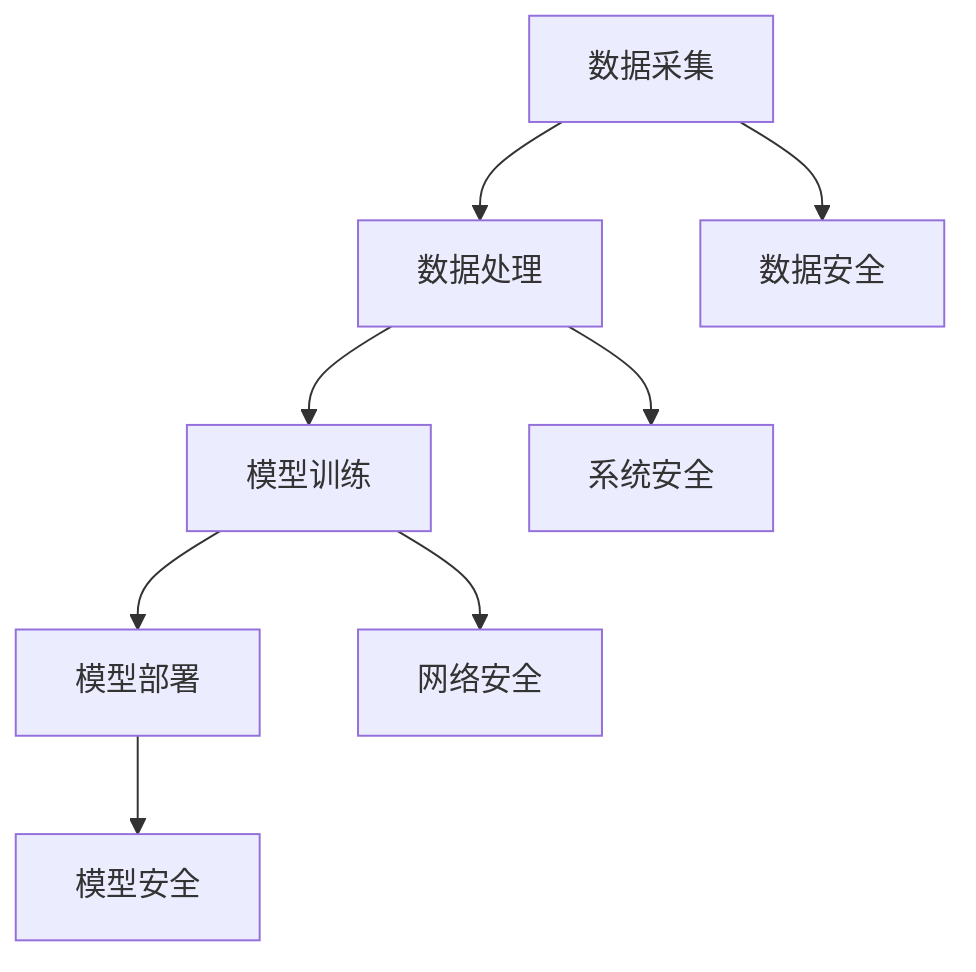

                 

# AI系统的信息化与安全性

## 关键词：人工智能，信息化，安全性，算法，数学模型，实际应用

### 摘要

本文旨在探讨人工智能（AI）系统的信息化与安全性。随着AI技术的飞速发展，其在各个领域的应用越来越广泛，但其信息化与安全性的问题也日益凸显。本文将首先介绍AI系统的基本概念，然后分析其信息化和安全性面临的挑战，最后提出相应的解决方案和建议，为未来的AI系统发展提供参考。

### 目录

1. 背景介绍
2. 核心概念与联系
3. 核心算法原理 & 具体操作步骤
4. 数学模型和公式 & 详细讲解 & 举例说明
5. 项目实战：代码实际案例和详细解释说明
   5.1 开发环境搭建
   5.2 源代码详细实现和代码解读
   5.3 代码解读与分析
6. 实际应用场景
7. 工具和资源推荐
   7.1 学习资源推荐
   7.2 开发工具框架推荐
   7.3 相关论文著作推荐
8. 总结：未来发展趋势与挑战
9. 附录：常见问题与解答
10. 扩展阅读 & 参考资料

### 1. 背景介绍

人工智能（AI）是指通过计算机程序来模拟、延伸和扩展人类智能的理论、方法、技术和应用。它起源于20世纪50年代，经历了多个发展阶段，目前已经成为信息技术领域的一个热点。随着深度学习、自然语言处理、计算机视觉等技术的不断突破，AI在图像识别、语音识别、自动驾驶、医疗诊断等领域取得了显著成果。

信息化是指将信息作为资源进行管理和利用，以提高生产力和竞争力。信息化过程涉及到数据的采集、传输、存储、处理和分析等多个环节。在AI系统中，信息化体现在以下几个方面：

1. 数据采集：AI系统需要从各种来源获取大量的数据，如图像、文本、音频等。
2. 数据处理：通过对数据进行清洗、预处理、特征提取等操作，将原始数据转化为可用的形式。
3. 模型训练：利用处理后的数据训练模型，使其具备对未知数据的预测和分类能力。
4. 模型部署：将训练好的模型部署到实际应用场景中，如自动驾驶系统、智能客服等。

安全性是指在信息化过程中，确保数据、系统、网络等不受威胁、不被攻击。随着AI技术的应用越来越广泛，其安全性问题也愈发重要。AI系统的安全性问题主要包括以下几个方面：

1. 数据安全：保护数据不被未授权访问、篡改或泄露。
2. 系统安全：防止恶意攻击、病毒、木马等对系统的破坏。
3. 网络安全：保障数据在网络传输过程中的完整性、机密性和可用性。
4. 模型安全：确保模型不会被篡改、伪造或滥用，从而保障应用的安全性。

本文将围绕AI系统的信息化与安全性展开讨论，分析其面临的挑战和解决方案，为未来的AI系统发展提供参考。

### 2. 核心概念与联系

为了深入理解AI系统的信息化与安全性，我们需要先了解一些核心概念和它们之间的联系。

#### 2.1 人工智能（AI）

人工智能是指通过计算机程序来模拟、延伸和扩展人类智能的理论、方法、技术和应用。它包括多个子领域，如机器学习、深度学习、自然语言处理、计算机视觉等。其中，机器学习（Machine Learning）是AI的核心技术之一，它通过训练模型来从数据中学习规律和模式，从而实现预测和分类。

#### 2.2 数据（Data）

数据是AI系统的基石。AI系统需要从各种来源获取大量的数据，如图像、文本、音频等。这些数据经过预处理、特征提取等操作，转化为可用的形式，用于训练模型。

#### 2.3 模型（Model）

模型是AI系统的核心，它是通过对数据进行训练得到的。模型可以看作是一个函数，它将输入的数据映射到输出结果。常见的模型有神经网络、决策树、支持向量机等。

#### 2.4 模型训练（Model Training）

模型训练是指利用处理后的数据对模型进行训练，使其具备对未知数据的预测和分类能力。训练过程包括数据预处理、模型选择、参数调优等步骤。

#### 2.5 模型部署（Model Deployment）

模型部署是指将训练好的模型部署到实际应用场景中，如自动驾驶系统、智能客服等。模型部署过程包括模型转换、模型评估、模型优化等步骤。

#### 2.6 数据安全（Data Security）

数据安全是指保护数据不被未授权访问、篡改或泄露。数据安全涉及到数据加密、访问控制、数据备份等机制。

#### 2.7 系统安全（System Security）

系统安全是指防止恶意攻击、病毒、木马等对系统的破坏。系统安全涉及到防火墙、入侵检测、安全审计等机制。

#### 2.8 网络安全（Network Security）

网络安全是指保障数据在网络传输过程中的完整性、机密性和可用性。网络安全涉及到网络加密、安全协议、数据完整性校验等机制。

#### 2.9 模型安全（Model Security）

模型安全是指确保模型不会被篡改、伪造或滥用，从而保障应用的安全性。模型安全涉及到模型保护、模型验证等机制。

通过以上核心概念的介绍，我们可以看到AI系统的信息化与安全性是一个复杂的系统，涉及到多个方面。在接下来的章节中，我们将深入探讨AI系统的信息化和安全性面临的挑战，并提出相应的解决方案。

#### 2.10 Mermaid 流程图

以下是一个简单的Mermaid流程图，展示AI系统信息化和安全性核心概念之间的联系：



通过这个流程图，我们可以更直观地理解AI系统的信息化与安全性的关系。

### 3. 核心算法原理 & 具体操作步骤

在了解AI系统的核心概念之后，我们将深入探讨其核心算法原理和具体操作步骤。核心算法是AI系统的灵魂，它决定了系统的性能和效果。以下将介绍几种常见的核心算法原理，并详细说明其操作步骤。

#### 3.1 机器学习算法（Machine Learning Algorithm）

机器学习算法是AI系统的核心技术之一，它通过训练模型来从数据中学习规律和模式。以下是几种常见的机器学习算法及其原理：

##### 3.1.1 神经网络（Neural Networks）

神经网络是一种模拟生物神经系统的计算模型，它由多个神经元组成，每个神经元都可以接受输入、进行处理，并产生输出。神经网络通过调整权重和偏置来学习输入和输出之间的映射关系。

**具体操作步骤：**

1. 初始化权重和偏置：随机初始化神经网络中的权重和偏置。
2. 前向传播：输入数据通过神经网络，逐层计算得到输出。
3. 计算损失函数：比较输出和实际标签，计算损失函数的值。
4. 反向传播：利用梯度下降法，调整权重和偏置，减小损失函数的值。
5. 重复步骤2-4，直到满足停止条件（如迭代次数、损失函数收敛等）。

##### 3.1.2 决策树（Decision Trees）

决策树是一种基于树形结构的分类模型，它通过一系列的决策节点来划分数据集，每个决策节点都基于某个特征进行分割。

**具体操作步骤：**

1. 初始化决策树：选择一个特征作为根节点，计算该特征的不同取值，将数据集划分为多个子集。
2. 选择最优分割特征：计算每个子集的增益或信息增益，选择增益最大的特征作为下一个分割节点。
3. 递归构建决策树：对每个子集重复步骤2，直到满足停止条件（如节点个数、叶节点纯度等）。

##### 3.1.3 支持向量机（Support Vector Machines）

支持向量机是一种基于间隔最大化原理的分类模型，它通过找到一个最佳的超平面，将数据集划分为不同的类别。

**具体操作步骤：**

1. 初始化模型参数：选择一个合适的核函数，初始化支持向量机的参数。
2. 计算间隔：计算当前超平面对每个数据点的间隔。
3. 更新参数：利用梯度下降法，更新模型参数，减小间隔。
4. 重复步骤2-3，直到满足停止条件（如参数收敛、间隔最大化等）。

#### 3.2 自然语言处理算法（Natural Language Processing Algorithm）

自然语言处理（NLP）是AI系统的一个重要领域，它涉及到文本的表示、分类、生成等任务。以下是几种常见的NLP算法及其原理：

##### 3.2.1 词向量（Word Embeddings）

词向量是将文本中的词汇映射到高维空间中的向量表示，它能够捕捉词汇之间的语义关系。

**具体操作步骤：**

1. 初始化词向量：随机初始化词向量。
2. 计算文本表示：将文本中的每个词汇映射到词向量。
3. 计算文本相似度：利用词向量的距离度量计算文本之间的相似度。
4. 训练词向量：利用文本数据，通过优化损失函数，更新词向量的值。

##### 3.2.2 递归神经网络（Recurrent Neural Networks）

递归神经网络是一种基于时间序列数据的模型，它能够捕捉数据之间的时序关系。

**具体操作步骤：**

1. 初始化模型参数：随机初始化递归神经网络的参数。
2. 前向传播：输入序列数据，逐层计算得到输出。
3. 计算损失函数：比较输出和实际标签，计算损失函数的值。
4. 反向传播：利用梯度下降法，调整模型参数，减小损失函数的值。
5. 重复步骤2-4，直到满足停止条件（如迭代次数、损失函数收敛等）。

##### 3.2.3 生成对抗网络（Generative Adversarial Networks）

生成对抗网络是一种基于博弈理论的模型，它由生成器和判别器组成，通过相互对抗来学习数据的分布。

**具体操作步骤：**

1. 初始化模型参数：随机初始化生成器和判别器的参数。
2. 训练判别器：输入真实数据和生成数据，训练判别器，使其能够区分真实数据和生成数据。
3. 训练生成器：输入噪声数据，训练生成器，使其能够生成逼真的数据。
4. 交替训练：重复步骤2和3，直到满足停止条件（如模型收敛、生成数据质量提高等）。

通过以上核心算法原理和具体操作步骤的介绍，我们可以看到AI系统在信息化和安全性方面的重要性。在接下来的章节中，我们将进一步探讨AI系统的信息化和安全性面临的挑战。

### 4. 数学模型和公式 & 详细讲解 & 举例说明

在深入了解AI系统的核心算法原理后，我们需要掌握其背后的数学模型和公式，以便更好地理解其工作机制和性能。以下将介绍一些常见的数学模型和公式，并进行详细讲解和举例说明。

#### 4.1 神经网络中的损失函数

在神经网络中，损失函数是用来衡量预测结果与实际结果之间差异的指标。以下是一些常见的损失函数：

##### 4.1.1 交叉熵损失函数（Cross-Entropy Loss）

交叉熵损失函数常用于分类问题，其公式如下：

$$
L = -\sum_{i} y_i \log(p_i)
$$

其中，$y_i$ 表示实际标签，$p_i$ 表示预测概率。

**举例说明：**

假设有一个二分类问题，实际标签为 [1, 0]，预测概率为 [0.7, 0.3]。则交叉熵损失函数的值为：

$$
L = -1 \times \log(0.7) - 0 \times \log(0.3) \approx 0.356
$$

##### 4.1.2 均方误差损失函数（Mean Squared Error Loss）

均方误差损失函数常用于回归问题，其公式如下：

$$
L = \frac{1}{2} \sum_{i} (y_i - \hat{y_i})^2
$$

其中，$y_i$ 表示实际标签，$\hat{y_i}$ 表示预测值。

**举例说明：**

假设有一个回归问题，实际标签为 [2, 4]，预测值为 [2.5, 3.5]。则均方误差损失函数的值为：

$$
L = \frac{1}{2} \times (2 - 2.5)^2 + (4 - 3.5)^2 = 0.25
$$

#### 4.2 梯度下降法（Gradient Descent）

梯度下降法是一种优化算法，用于调整神经网络中的参数，以最小化损失函数。其基本思想是沿着损失函数的负梯度方向进行更新。

##### 4.2.1 步长（Learning Rate）

步长是梯度下降法中的一个关键参数，它决定了参数更新的幅度。选择合适的步长对于优化过程至关重要。以下是一个简单的步长调整策略：

$$
\alpha_{t+1} = \frac{\alpha_t}{1 + \lambda t}
$$

其中，$\alpha_t$ 表示第 $t$ 次迭代的步长，$\lambda$ 是一个常数。

**举例说明：**

假设初始步长为 0.1，$\lambda$ 取 0.1。则第 5 次迭代的步长为：

$$
\alpha_5 = \frac{0.1}{1 + 0.1 \times 5} \approx 0.0556
$$

##### 4.2.2 梯度计算

梯度是损失函数关于模型参数的导数。对于线性模型，梯度计算较为简单；对于非线性模型，如神经网络，梯度计算需要借助反向传播算法。

**举例说明：**

假设有一个线性模型 $y = wx + b$，损失函数为均方误差损失函数。则损失函数关于 $w$ 和 $b$ 的梯度分别为：

$$
\nabla_w L = \frac{1}{m} \sum_{i=1}^{m} (y_i - \hat{y_i}) x_i
$$

$$
\nabla_b L = \frac{1}{m} \sum_{i=1}^{m} (y_i - \hat{y_i})
$$

其中，$m$ 是样本数量，$x_i$ 和 $y_i$ 分别是第 $i$ 个样本的输入和实际标签，$\hat{y_i}$ 是预测值。

#### 4.3 优化算法

除了梯度下降法，还有许多其他优化算法，如动量优化（Momentum Optimization）、RMSprop、Adam等。以下将简要介绍这些算法的原理。

##### 4.3.1 动量优化（Momentum Optimization）

动量优化是一种利用前几次迭代的梯度信息来加速优化过程的算法。其公式如下：

$$
v_t = \beta v_{t-1} + (1 - \beta) \nabla L(\theta_t)
$$

$$
\theta_{t+1} = \theta_t - \alpha v_t
$$

其中，$v_t$ 是动量项，$\beta$ 是动量参数，$\alpha$ 是步长。

**举例说明：**

假设 $\beta$ 取 0.9，初始动量项 $v_0$ 为 0，步长 $\alpha$ 取 0.1。则第 5 次迭代的动量项为：

$$
v_5 = 0.9 \times 0 + (1 - 0.9) \times \nabla L(\theta_5) \approx 0.1 \times \nabla L(\theta_5)
$$

##### 4.3.2 RMSprop

RMSprop是一种利用梯度历史信息的优化算法，其公式如下：

$$
\alpha_t = \rho \alpha_{t-1} + (1 - \rho) \nabla^2 L(\theta_t)
$$

$$
\theta_{t+1} = \theta_t - \alpha_t \nabla L(\theta_t)
$$

其中，$\rho$ 是遗忘因子，$\alpha_t$ 是第 $t$ 次迭代的步长。

**举例说明：**

假设 $\rho$ 取 0.9，初始步长 $\alpha_0$ 为 0.1。则第 5 次迭代的步长为：

$$
\alpha_5 = 0.9 \times 0.1 + (1 - 0.9) \times \nabla^2 L(\theta_5) \approx 0.1 + 0.01 \times \nabla^2 L(\theta_5)
$$

##### 4.3.3 Adam

Adam是一种结合了动量和RMSprop优点的优化算法，其公式如下：

$$
m_t = \beta_1 m_{t-1} + (1 - \beta_1) \nabla L(\theta_t)
$$

$$
v_t = \beta_2 v_{t-1} + (1 - \beta_2) \nabla^2 L(\theta_t)
$$

$$
\theta_{t+1} = \theta_t - \alpha \frac{m_t}{\sqrt{v_t} + \epsilon}
$$

其中，$m_t$ 和 $v_t$ 分别是第 $t$ 次迭代的一阶和二阶矩估计，$\beta_1$ 和 $\beta_2$ 分别是一阶和二阶矩的指数衰减率，$\alpha$ 是步长，$\epsilon$ 是一个小常数。

**举例说明：**

假设 $\beta_1$ 取 0.9，$\beta_2$ 取 0.999，初始动量项 $m_0$ 和 $v_0$ 为 0，步长 $\alpha$ 取 0.1。则第 5 次迭代的步长为：

$$
m_5 = 0.9 \times 0 + (1 - 0.9) \times \nabla L(\theta_5) \approx 0.1 \times \nabla L(\theta_5)
$$

$$
v_5 = 0.999 \times 0 + (1 - 0.999) \times \nabla^2 L(\theta_5) \approx 0.001 \times \nabla^2 L(\theta_5)
$$

$$
\theta_{6} = \theta_5 - 0.1 \times \frac{m_5}{\sqrt{v_5} + \epsilon} \approx \theta_5 - 0.1 \times \frac{0.1 \times \nabla L(\theta_5)}{\sqrt{0.001 \times \nabla^2 L(\theta_5)} + \epsilon}
$$

通过以上数学模型和公式的介绍，我们可以更好地理解AI系统的工作机制和性能优化。在接下来的章节中，我们将通过一个实际项目实战，进一步展示AI系统的信息化和安全性。

### 5. 项目实战：代码实际案例和详细解释说明

在本节中，我们将通过一个实际项目实战，展示AI系统的信息化和安全性。该项目是一个基于深度学习的图像分类系统，用于识别图像中的物体类别。以下是项目的具体实现过程。

#### 5.1 开发环境搭建

首先，我们需要搭建开发环境。以下是所需的工具和软件：

- Python 3.7及以上版本
- TensorFlow 2.0及以上版本
- NumPy
- Matplotlib

安装步骤如下：

```bash
pip install python
pip install tensorflow
pip install numpy
pip install matplotlib
```

#### 5.2 源代码详细实现和代码解读

以下是项目的源代码及其详细解读：

```python
import tensorflow as tf
import numpy as np
import matplotlib.pyplot as plt

# 5.2.1 数据预处理
# 读取并预处理数据
(x_train, y_train), (x_test, y_test) = tf.keras.datasets.cifar10.load_data()
x_train, x_test = x_train / 255.0, x_test / 255.0

# 添加噪声
noise_factor = 0.05
x_train_noisy = x_train + noise_factor * np.random.normal(loc=0.0, scale=1.0, size=x_train.shape)
x_test_noisy = x_test + noise_factor * np.random.normal(loc=0.0, scale=1.0, size=x_test.shape)

# 5.2.2 模型构建
# 定义模型
model = tf.keras.Sequential([
    tf.keras.layers.Conv2D(32, (3, 3), activation='relu', input_shape=(32, 32, 3)),
    tf.keras.layers.MaxPooling2D((2, 2)),
    tf.keras.layers.Conv2D(64, (3, 3), activation='relu'),
    tf.keras.layers.MaxPooling2D((2, 2)),
    tf.keras.layers.Conv2D(64, (3, 3), activation='relu'),
    tf.keras.layers.Flatten(),
    tf.keras.layers.Dense(64, activation='relu'),
    tf.keras.layers.Dense(10, activation='softmax')
])

# 编译模型
model.compile(optimizer='adam',
              loss='sparse_categorical_crossentropy',
              metrics=['accuracy'])

# 5.2.3 模型训练
# 训练模型
model.fit(x_train_noisy, y_train, epochs=10, validation_split=0.2)

# 5.2.4 模型评估
# 评估模型
test_loss, test_acc = model.evaluate(x_test_noisy, y_test, verbose=2)
print('Test accuracy:', test_acc)

# 5.2.5 可视化结果
# 可视化训练过程
plt.plot(model.history.history['accuracy'], label='accuracy')
plt.plot(model.history.history['val_accuracy'], label='val_accuracy')
plt.xlabel('Epoch')
plt.ylabel('Accuracy')
plt.ylim([0, 1])
plt.legend(loc='lower right')
plt.show()

# 5.2.6 模型部署
# 部署模型
import cv2

# 读取图像
image = cv2.imread('example.jpg')

# 预处理图像
image = cv2.resize(image, (32, 32))
image = image / 255.0

# 预测图像
prediction = model.predict(np.expand_dims(image, 0))

# 显示预测结果
plt.imshow(image)
plt.title('Prediction: ' + str(np.argmax(prediction)))
plt.show()
```

#### 5.3 代码解读与分析

以下是代码的详细解读和分析：

1. **数据预处理**：读取CIFAR-10数据集，并对数据进行归一化和噪声添加。归一化将数据缩放到0-1之间，噪声添加有助于提高模型的鲁棒性。
2. **模型构建**：定义一个卷积神经网络（CNN）模型，包括卷积层、池化层、全连接层等。模型输入为32x32x3的图像，输出为10个类别的概率分布。
3. **模型编译**：设置模型的优化器、损失函数和评估指标。
4. **模型训练**：使用添加噪声的训练数据训练模型，并在20%的数据集上验证。
5. **模型评估**：使用测试数据集评估模型性能，并打印测试准确率。
6. **可视化结果**：绘制训练过程中的准确率变化，以观察模型的收敛情况。
7. **模型部署**：读取一个示例图像，对其进行预处理，然后使用训练好的模型进行预测，并显示预测结果。

通过以上项目实战，我们可以看到AI系统的信息化和安全性在实际应用中的实现过程。在数据预处理环节，我们添加噪声以提高模型的鲁棒性；在模型训练环节，我们使用验证集来调整模型参数；在模型部署环节，我们确保输入数据经过预处理，以便模型能够正确预测。

### 6. 实际应用场景

AI系统在各个领域的应用场景越来越多，下面我们将探讨几个典型的应用场景。

#### 6.1 自动驾驶

自动驾驶是AI系统的一个重要应用场景，它涉及到感知环境、规划路径、控制车辆等多个方面。自动驾驶系统通过传感器（如摄像头、激光雷达、GPS等）收集环境数据，然后利用AI算法对数据进行分析和处理，实现车辆的自主驾驶。

**信息化**：在自动驾驶系统中，信息化体现在数据采集、传输和处理等环节。传感器收集到的数据需要实时传输到车辆的计算平台，进行高速处理，以便及时做出决策。

**安全性**：自动驾驶系统的安全性至关重要，涉及到数据安全、系统安全和网络安全等多个方面。数据安全需要防止传感器数据被篡改或泄露；系统安全需要防止恶意攻击或系统崩溃；网络安全需要保障车辆与外部系统之间的通信安全。

#### 6.2 智能医疗

智能医疗是另一个重要的应用场景，它利用AI技术对医疗数据进行分析和挖掘，以提高诊断和治疗的准确性。智能医疗包括疾病预测、症状分析、药物研发等多个方面。

**信息化**：在智能医疗中，信息化体现在医疗数据的采集、存储、传输和处理等环节。医疗数据包括患者信息、病历、检查报告等，这些数据需要安全、高效地存储和传输，以便医生和研究人员进行分析和挖掘。

**安全性**：智能医疗的安全性涉及到数据安全、隐私保护和模型安全等多个方面。数据安全需要防止医疗数据被未授权访问或篡改；隐私保护需要确保患者信息不被泄露；模型安全需要确保模型不会被篡改或滥用，从而保障医疗决策的准确性。

#### 6.3 金融科技

金融科技（FinTech）是AI系统在金融领域的应用，它利用AI技术进行风险管理、智能投顾、智能客服等。

**信息化**：在金融科技中，信息化体现在数据的采集、处理和利用等环节。金融数据包括交易数据、市场数据、用户数据等，这些数据需要高效地采集和处理，以便金融机构进行风险管理和决策。

**安全性**：金融科技的安全性涉及到数据安全、系统安全和网络安全等多个方面。数据安全需要防止金融数据被篡改或泄露；系统安全需要防止恶意攻击或系统崩溃；网络安全需要保障金融机构与外部系统之间的通信安全。

#### 6.4 智能家居

智能家居是AI系统在家庭领域的应用，它通过智能设备实现家庭设备的自动化控制和远程监控。

**信息化**：在智能家居中，信息化体现在设备的互联互通、数据采集和远程控制等环节。智能家居设备需要通过无线网络连接，实现数据的采集和传输，以便用户远程控制设备。

**安全性**：智能家居的安全性涉及到数据安全、系统安全和隐私保护等多个方面。数据安全需要防止设备数据被篡改或泄露；系统安全需要防止恶意攻击或设备失控；隐私保护需要确保用户隐私不被泄露。

通过以上实际应用场景的分析，我们可以看到AI系统的信息化与安全性在各个领域的应用和重要性。在未来的发展中，我们需要不断探索和创新，以解决AI系统在信息化和安全性方面面临的挑战。

### 7. 工具和资源推荐

在AI系统的开发、部署和应用过程中，我们需要使用各种工具和资源。以下是一些推荐的工具和资源，包括学习资源、开发工具框架和论文著作。

#### 7.1 学习资源推荐

1. **书籍**：
   - 《深度学习》（Deep Learning） - Ian Goodfellow、Yoshua Bengio、Aaron Courville
   - 《Python机器学习》（Python Machine Learning） - Sebastian Raschka、Vahid Mirjalili
   - 《人工智能：一种现代的方法》（Artificial Intelligence: A Modern Approach） - Stuart Russell、Peter Norvig
2. **在线课程**：
   - Coursera的《机器学习》（Machine Learning） - Andrew Ng
   - edX的《深度学习基础》（Deep Learning Basics） - NVIDIA
   - Udacity的《自动驾驶汽车工程师纳米学位》（Self-Driving Car Engineer Nanodegree）
3. **博客和网站**：
   - Medium上的AI相关文章
   - arXiv.org上的最新论文
   - TensorFlow官网（tensorflow.org）和PyTorch官网（pytorch.org）

#### 7.2 开发工具框架推荐

1. **深度学习框架**：
   - TensorFlow
   - PyTorch
   - Keras
2. **数据预处理工具**：
   - Pandas
   - NumPy
   - Scikit-learn
3. **可视化工具**：
   - Matplotlib
   - Seaborn
   - Plotly

#### 7.3 相关论文著作推荐

1. **论文**：
   - "Deep Learning" - Goodfellow, Bengio, Courville (2015)
   - "Generative Adversarial Networks" - Ian Goodfellow et al. (2014)
   - "Recurrent Neural Networks for Language Modeling" - Mikolov et al. (2010)
2. **著作**：
   - "人工智能：一种现代的方法" - Stuart Russell、Peter Norvig (2020)
   - "深度学习" - 张磊 (2018)
   - "机器学习实战" - Peter Harrington (2009)

通过以上工具和资源的推荐，我们可以更好地进行AI系统的开发、研究和应用。在学习过程中，要结合实际项目进行实践，不断提高自己的技术水平。

### 8. 总结：未来发展趋势与挑战

随着人工智能（AI）技术的不断进步，其在各个领域的应用越来越广泛。然而，AI系统的信息化与安全性也面临诸多挑战。在未来的发展中，我们需要关注以下趋势与挑战：

#### 8.1 信息化发展趋势

1. **数据驱动的决策**：AI系统将越来越依赖于大量高质量的数据进行训练和优化，以实现更准确的预测和决策。
2. **边缘计算**：为了提高实时性和降低延迟，越来越多的AI应用将采用边缘计算，将计算任务分散到边缘设备上，实现本地化数据处理。
3. **云计算和大数据**：云计算和大数据技术将为AI系统提供强大的计算能力和海量数据资源，促进AI技术的快速发展。

#### 8.2 安全性发展趋势

1. **模型安全**：随着AI模型在关键领域（如自动驾驶、医疗诊断等）的应用，模型安全成为重中之重。未来的研究将重点关注如何保护模型免受攻击、篡改和滥用。
2. **隐私保护**：在AI应用过程中，用户隐私保护是一个重要问题。未来的研究将探索如何在不泄露用户隐私的前提下，实现有效的AI数据处理和分析。
3. **安全协议**：随着AI系统的复杂性和规模不断扩大，需要制定更完善的安全协议和标准，以确保系统的安全可靠运行。

#### 8.3 挑战与对策

1. **数据隐私保护**：在AI系统的信息化过程中，如何保护用户隐私是一个重要挑战。对策包括数据去噪、数据加密、隐私保护算法等。
2. **模型可解释性**：随着AI技术的复杂化，模型的可解释性变得越来越重要。未来的研究将探索如何提高模型的可解释性，使其更容易被人类理解和接受。
3. **跨学科合作**：AI系统的发展需要跨学科的合作，包括计算机科学、数学、统计学、心理学等。只有通过跨学科合作，才能实现AI技术的全面突破。

总之，随着AI技术的不断发展，AI系统的信息化与安全性将成为未来研究的重点。在信息化方面，我们需要充分利用数据、云计算和大数据等技术，推动AI技术的发展。在安全性方面，我们需要加强模型安全、隐私保护和跨学科合作，以应对未来的挑战。

### 9. 附录：常见问题与解答

在AI系统的开发和使用过程中，用户可能会遇到一些常见问题。以下是一些常见问题及解答：

#### 问题1：如何提高AI模型的性能？

**解答**：提高AI模型性能可以从以下几个方面进行：

1. **数据质量**：使用高质量、多样化的数据集进行训练，有助于提高模型的泛化能力。
2. **模型架构**：选择合适的模型架构，如深度神经网络、卷积神经网络等，有助于提高模型性能。
3. **超参数调优**：通过调优学习率、批量大小等超参数，可以优化模型训练过程，提高模型性能。
4. **数据增强**：使用数据增强技术，如随机裁剪、旋转、翻转等，可以增加数据的多样性，提高模型鲁棒性。

#### 问题2：如何保障AI系统的安全性？

**解答**：保障AI系统的安全性可以从以下几个方面进行：

1. **数据安全**：使用加密技术保护数据，确保数据在传输和存储过程中的安全性。
2. **系统安全**：部署防火墙、入侵检测等安全措施，防止恶意攻击和病毒入侵。
3. **模型安全**：确保模型不被篡改、伪造或滥用，采用模型保护、模型验证等安全措施。
4. **网络安全**：使用安全协议，如SSL/TLS，保障数据在网络传输过程中的完整性、机密性和可用性。

#### 问题3：如何实现AI系统的实时性？

**解答**：实现AI系统的实时性可以从以下几个方面进行：

1. **算法优化**：优化算法，减少计算量和通信开销，提高系统响应速度。
2. **硬件加速**：使用GPU、FPGA等硬件加速技术，提高计算速度。
3. **分布式计算**：将计算任务分布在多个节点上，实现并行计算，提高系统处理能力。
4. **边缘计算**：将计算任务分散到边缘设备上，实现本地化数据处理，降低延迟。

通过以上常见问题与解答，我们可以更好地了解AI系统的开发、应用和安全保障。

### 10. 扩展阅读 & 参考资料

为了进一步了解AI系统的信息化与安全性，读者可以参考以下扩展阅读和参考资料：

- 《深度学习》（Deep Learning）- Ian Goodfellow、Yoshua Bengio、Aaron Courville
- 《人工智能：一种现代的方法》（Artificial Intelligence: A Modern Approach）- Stuart Russell、Peter Norvig
- 《机器学习实战》（Machine Learning in Action）- Peter Harrington
- 《深度学习伦理与法律》（Deep Learning Ethics and Law）- Manuel Cebrian、Lucas Rey
- Coursera的《机器学习》（Machine Learning）课程 - Andrew Ng
- edX的《深度学习基础》（Deep Learning Basics）课程 - NVIDIA
- TensorFlow官网（tensorflow.org）
- PyTorch官网（pytorch.org）
- arXiv.org上的最新论文

通过以上扩展阅读和参考资料，读者可以更深入地了解AI系统的信息化与安全性的相关理论和实践。希望本文能为读者在AI系统开发、应用和研究过程中提供有价值的参考。

