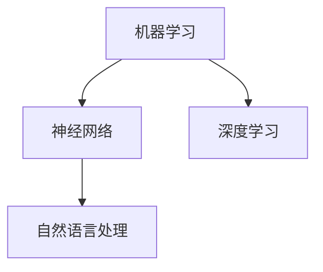

                 

### 背景介绍

人工智能（AI）的发展已经渗透到我们生活的方方面面，从智能手机、智能家居，到自动驾驶、医疗诊断，AI 无处不在。随着 AI 技术的不断发展，编程语言也在不断地演进，以适应 AI 的需求。其中，AI 编程语言成为了研究的焦点。

AI 编程语言，顾名思义，是一种专门用于编写人工智能算法和程序的编程语言。与传统的编程语言不同，AI 编程语言更加注重对人类思维和行为的模拟，从而实现更智能、更自动化的程序。

在本文中，我们将探讨 AI 编程语言的核心概念、核心算法原理、数学模型、实际应用场景，以及相关工具和资源。希望通过这篇文章，您能对 AI 编程语言有更深入的了解。

### 核心概念与联系

要理解 AI 编程语言，首先需要了解其核心概念和原理。以下是几个关键概念：

1. **机器学习（Machine Learning）**：机器学习是一种让计算机通过数据学习、改进自身性能的方法。它是 AI 编程语言的核心基础。
2. **神经网络（Neural Networks）**：神经网络是一种模拟生物神经系统的计算模型，它是机器学习的重要实现方式。
3. **深度学习（Deep Learning）**：深度学习是神经网络的一种特殊形式，它通过多层神经网络进行训练，能够处理更复杂的数据。
4. **自然语言处理（Natural Language Processing，NLP）**：NLP 是一门将计算机和人类语言结合起来的技术，它是 AI 编程语言在语言理解和生成方面的应用。

下图是一个简化的 Mermaid 流程图，展示了这些核心概念之间的联系：



#### 1. 机器学习

机器学习是 AI 编程语言的核心。它是一种通过数据学习、改进自身性能的方法。机器学习算法可以分为监督学习、无监督学习和强化学习。

- **监督学习（Supervised Learning）**：监督学习是通过已有标注数据来训练模型，从而预测新的数据。常见的监督学习算法有线性回归、决策树、支持向量机等。
- **无监督学习（Unsupervised Learning）**：无监督学习是在没有标注数据的情况下，通过发现数据中的规律来训练模型。常见的无监督学习算法有聚类、降维等。
- **强化学习（Reinforcement Learning）**：强化学习是通过与环境的交互来学习策略，从而最大化长期回报。常见的强化学习算法有 Q-学习、深度 Q-学习等。

#### 2. 神经网络

神经网络是机器学习的一种重要实现方式。它通过模拟生物神经系统的计算模型，对输入数据进行处理和输出。神经网络可以分为前向传播、反向传播两个阶段。

- **前向传播（Forward Propagation）**：前向传播是将输入数据通过神经网络进行逐层计算，最终得到输出结果。
- **反向传播（Backpropagation）**：反向传播是根据输出结果与实际结果的差异，反向调整神经网络的权重，从而优化模型。

#### 3. 深度学习

深度学习是神经网络的一种特殊形式，它通过多层神经网络进行训练，能够处理更复杂的数据。深度学习算法包括卷积神经网络（CNN）、循环神经网络（RNN）、生成对抗网络（GAN）等。

- **卷积神经网络（CNN）**：卷积神经网络是一种适用于图像处理、语音识别等领域的深度学习算法，它通过卷积层、池化层等结构，提取特征并进行分类。
- **循环神经网络（RNN）**：循环神经网络是一种适用于序列数据处理的深度学习算法，它通过循环结构，保存历史信息并用于当前计算。
- **生成对抗网络（GAN）**：生成对抗网络是一种由生成器和判别器组成的深度学习算法，它通过对抗训练，生成与真实数据相似的新数据。

#### 4. 自然语言处理

自然语言处理是 AI 编程语言在语言理解和生成方面的应用。它包括词向量、词性标注、句法分析、命名实体识别、机器翻译等任务。

- **词向量（Word Embedding）**：词向量是将单词映射到高维空间中的向量表示，用于处理文本数据。
- **词性标注（Part-of-Speech Tagging）**：词性标注是将单词标注为不同的词性（如名词、动词等），用于理解句子结构。
- **句法分析（Syntactic Parsing）**：句法分析是将句子分解为短语结构，用于理解句子语义。
- **命名实体识别（Named Entity Recognition，NER）**：命名实体识别是将文本中的命名实体（如人名、地名等）识别出来，用于知识图谱构建。
- **机器翻译（Machine Translation）**：机器翻译是将一种语言的文本翻译成另一种语言的文本，用于跨语言信息传递。

### 核心算法原理 & 具体操作步骤

在了解了 AI 编程语言的核心概念后，接下来我们将探讨其核心算法原理和具体操作步骤。以下是一些常用的 AI 编程语言算法和其操作步骤：

#### 1. 线性回归

线性回归是一种简单的机器学习算法，用于预测数值型数据。其核心原理是通过最小二乘法拟合一条直线，使得直线上所有点到实际数据的距离之和最小。

**操作步骤：**

1. **数据准备**：收集并整理数据，将其划分为特征和标签两部分。
2. **初始化参数**：设定初始权重和偏置。
3. **前向传播**：将特征输入到模型中，计算预测结果。
4. **计算损失函数**：根据预测结果和实际标签，计算损失函数的值。
5. **反向传播**：根据损失函数的梯度，更新模型的权重和偏置。
6. **迭代优化**：重复步骤 3 到 5，直至达到预设的停止条件。

**数学模型和公式：**

$$
损失函数：J(\theta) = \frac{1}{2m}\sum_{i=1}^{m}(h_\theta(x^{(i)}) - y^{(i)})^2
$$

$$
前向传播：h_\theta(x) = \theta_0 + \theta_1x_1 + \theta_2x_2 + ... + \theta_nx_n
$$

$$
反向传播：\frac{\partial J}{\partial \theta_j} = \frac{1}{m}\sum_{i=1}^{m}(h_\theta(x^{(i)}) - y^{(i)}) \cdot x_j^{(i)}
$$

#### 2. 决策树

决策树是一种基于特征划分数据的监督学习算法。其核心原理是通过递归划分数据，构建出一棵树形结构，并在树的叶节点上做出预测。

**操作步骤：**

1. **数据准备**：收集并整理数据，将其划分为特征和标签两部分。
2. **构建决策树**：选择最优划分特征，递归划分数据，构建决策树。
3. **预测**：将新数据输入决策树，从根节点开始，根据特征值选择分支，直至叶节点，输出预测结果。

**数学模型和公式：**

$$
信息增益（Information Gain）：IG(V, A) = Entropy(V) - \sum_{v_i \in V} \frac{|V_i|}{|V|}Entropy(V_i)
$$

$$
基尼不纯度（Gini Impurity）：Gini(V) = 1 - \sum_{v_i \in V} \frac{|V_i|}{|V|}^2
$$

#### 3. 支持向量机

支持向量机是一种基于最大间隔划分数据的监督学习算法。其核心原理是找到一个最优的超平面，使得分类间隔最大。

**操作步骤：**

1. **数据准备**：收集并整理数据，将其划分为特征和标签两部分。
2. **特征变换**：将特征进行线性变换，使得数据更加分散。
3. **构建超平面**：通过求解线性方程组，得到最优的超平面参数。
4. **预测**：将新数据输入超平面，判断其位于超平面的哪一侧，输出预测结果。

**数学模型和公式：**

$$
优化目标：\min_{\theta} \frac{1}{2}\sum_{i=1}^{n}(\theta^T x_i - y_i)^2
$$

$$
超平面：h(x) = \theta^T x + b
$$

#### 4. 卷积神经网络

卷积神经网络是一种适用于图像处理的深度学习算法。其核心原理是通过卷积操作、池化操作和全连接层，提取图像特征并进行分类。

**操作步骤：**

1. **数据准备**：收集并整理图像数据，将其划分为训练集和测试集。
2. **构建卷积神经网络**：定义网络结构，包括卷积层、池化层和全连接层。
3. **前向传播**：将图像输入到网络中，计算输出结果。
4. **反向传播**：根据输出结果与实际标签，计算损失函数的梯度，并更新网络参数。
5. **迭代优化**：重复步骤 3 到 4，直至达到预设的停止条件。

**数学模型和公式：**

$$
卷积操作：h_{ij}^{(l)} = \sum_{k=1}^{C_{l-1}} \theta_{ikj}^{(l)} * g_{k}^{(l-1)}
$$

$$
池化操作：p_{ij}^{(l)} = \max_{(u,v) \in S} g_{ui}^{(l-1)} + v
$$

$$
全连接层：h_j^{(L)} = \sigma(\sum_{i=1}^{H_{L-1}} \theta_{ij}^{(L)} h_i^{(L-1)} + b_j^{(L)})
$$

#### 5. 循环神经网络

循环神经网络是一种适用于序列数据的深度学习算法。其核心原理是通过循环结构，保存历史信息并用于当前计算。

**操作步骤：**

1. **数据准备**：收集并整理序列数据，将其划分为训练集和测试集。
2. **构建循环神经网络**：定义网络结构，包括输入层、隐藏层和输出层。
3. **前向传播**：将序列数据输入到网络中，计算输出结果。
4. **反向传播**：根据输出结果与实际标签，计算损失函数的梯度，并更新网络参数。
5. **迭代优化**：重复步骤 3 到 4，直至达到预设的停止条件。

**数学模型和公式：**

$$
隐藏层状态：h_t = \sigma(W_h \cdot [h_{t-1}; x_t] + b_h)
$$

$$
输出层状态：y_t = \sigma(W_y \cdot h_t + b_y)
$$

$$
损失函数：J = \sum_{t=1}^{T} -y_t \log(y_t)
$$

#### 6. 自然语言处理

自然语言处理是一种将计算机与人类语言结合起来的技术。其核心原理是通过词向量、词性标注、句法分析等算法，对文本进行处理和分析。

**操作步骤：**

1. **数据准备**：收集并整理文本数据，将其划分为训练集和测试集。
2. **词向量表示**：将单词映射到高维空间中的向量表示。
3. **词性标注**：将文本中的单词标注为不同的词性。
4. **句法分析**：将文本分解为短语结构。
5. **命名实体识别**：将文本中的命名实体识别出来。
6. **机器翻译**：将一种语言的文本翻译成另一种语言的文本。

**数学模型和公式：**

$$
词向量表示：v_w = \sum_{i=1}^{V} f_w(i) \cdot e_i
$$

$$
词性标注：P(w) = \arg\max_{p} P(p|w)
$$

$$
句法分析：S = \arg\max_{s} P(s|w_1, w_2, ..., w_n)
$$

$$
命名实体识别：R(w) = \arg\max_{r} P(r|w)
$$

$$
机器翻译：y = \arg\max_{y} P(y|x)
$$

### 数学模型和公式 & 详细讲解 & 举例说明

在了解了 AI 编程语言的核心算法原理后，接下来我们将进一步详细讲解这些算法的数学模型和公式，并通过具体例子进行说明。

#### 1. 线性回归

线性回归是一种简单的机器学习算法，用于预测数值型数据。其核心原理是通过最小二乘法拟合一条直线，使得直线上所有点到实际数据的距离之和最小。

**数学模型：**

$$
损失函数：J(\theta) = \frac{1}{2m}\sum_{i=1}^{m}(h_\theta(x^{(i)}) - y^{(i)})^2
$$

其中，$m$ 表示样本数量，$h_\theta(x)$ 表示预测结果，$\theta$ 表示模型参数。

**公式推导：**

线性回归的损失函数是一个二次函数，其最小值点即为最优解。我们可以通过求导的方法求解最小值点。

$$
\frac{\partial J(\theta)}{\partial \theta_j} = \frac{1}{m}\sum_{i=1}^{m}(h_\theta(x^{(i)}) - y^{(i)}) \cdot x_j^{(i)}
$$

令 $\frac{\partial J(\theta)}{\partial \theta_j} = 0$，可以得到最优解：

$$
\theta_j = \frac{1}{m}\sum_{i=1}^{m}(h_\theta(x^{(i)}) - y^{(i)}) \cdot x_j^{(i)}
$$

**举例说明：**

假设我们有一个简单的线性回归问题，需要预测房价。给定训练集：

$$
\begin{array}{|c|c|}
\hline
x & y \\
\hline
1 & 2 \\
2 & 4 \\
3 & 6 \\
4 & 8 \\
5 & 10 \\
\hline
\end{array}
$$

我们可以通过线性回归模型拟合一条直线，预测新的房价。假设初始参数为 $\theta_0 = 0$，$\theta_1 = 0$。

1. **前向传播**：

$$
h_\theta(x) = \theta_0 + \theta_1x
$$

$$
h_\theta(1) = 0 + 0 \cdot 1 = 0 \\
h_\theta(2) = 0 + 0 \cdot 2 = 0 \\
h_\theta(3) = 0 + 0 \cdot 3 = 0 \\
h_\theta(4) = 0 + 0 \cdot 4 = 0 \\
h_\theta(5) = 0 + 0 \cdot 5 = 0
$$

2. **计算损失函数**：

$$
J(\theta) = \frac{1}{2m}\sum_{i=1}^{m}(h_\theta(x^{(i)}) - y^{(i)})^2
$$

$$
J(\theta) = \frac{1}{2 \cdot 5}\sum_{i=1}^{5}(0 - 2)^2 + (0 - 4)^2 + (0 - 6)^2 + (0 - 8)^2 + (0 - 10)^2 = 10
$$

3. **反向传播**：

$$
\frac{\partial J(\theta)}{\partial \theta_0} = \frac{1}{5}\sum_{i=1}^{5}(0 - 2) = -2 \\
\frac{\partial J(\theta)}{\partial \theta_1} = \frac{1}{5}\sum_{i=1}^{5}(0 - 2)x_i = 0
$$

4. **更新参数**：

$$
\theta_0 = \theta_0 - \alpha \frac{\partial J(\theta)}{\partial \theta_0} = 0 - 0.1 \cdot (-2) = 0.2 \\
\theta_1 = \theta_1 - \alpha \frac{\partial J(\theta)}{\partial \theta_1} = 0 - 0.1 \cdot 0 = 0
$$

5. **重复迭代**：重复前向传播、计算损失函数、反向传播和更新参数的过程，直至达到预设的停止条件。

通过不断迭代，我们可以得到最优的参数，从而拟合出一条直线，预测新的房价。

#### 2. 决策树

决策树是一种基于特征划分数据的监督学习算法。其核心原理是通过递归划分数据，构建出一棵树形结构，并在树的叶节点上做出预测。

**数学模型：**

$$
信息增益（Information Gain）：IG(V, A) = Entropy(V) - \sum_{v_i \in V} \frac{|V_i|}{|V|}Entropy(V_i)
$$

$$
基尼不纯度（Gini Impurity）：Gini(V) = 1 - \sum_{v_i \in V} \frac{|V_i|}{|V|}^2
$$

其中，$V$ 表示数据集，$A$ 表示特征，$V_i$ 表示根据特征 $A$ 划分后的数据子集。

**公式推导：**

信息增益和信息增益率是决策树划分数据的重要依据。信息增益表示通过特征 $A$ 划分数据后，数据的纯度增加程度。基尼不纯度表示数据的纯度。

**举例说明：**

假设我们有一个分类问题，数据集包含特征 A 和标签 Y：

$$
\begin{array}{|c|c|c|}
\hline
A & Y & \\
\hline
0 & 1 & \\
1 & 0 & \\
0 & 1 & \\
1 & 0 & \\
0 & 1 & \\
1 & 0 & \\
\hline
\end{array}
$$

我们需要通过决策树对数据进行分类。首先计算信息增益：

$$
Entropy(Y) = \sum_{y_i \in Y} \frac{|Y_i|}{|Y|} \log_2 \frac{|Y_i|}{|Y|} = 1 - \frac{3}{6} \log_2 \frac{3}{6} - \frac{3}{6} \log_2 \frac{3}{6} = 1 - \frac{1}{2} \log_2 \frac{1}{2} = \frac{1}{2}
$$

$$
Entropy(Y|A=0) = \sum_{y_i \in Y} \frac{|Y_i|}{|Y|} \log_2 \frac{|Y_i|}{|Y|} = \frac{3}{6} \log_2 \frac{3}{6} + \frac{3}{6} \log_2 \frac{3}{6} = \frac{1}{2} \\
Entropy(Y|A=1) = \sum_{y_i \in Y} \frac{|Y_i|}{|Y|} \log_2 \frac{|Y_i|}{|Y|} = \frac{3}{6} \log_2 \frac{3}{6} + \frac{3}{6} \log_2 \frac{3}{6} = \frac{1}{2}
$$

$$
Information Gain = Entropy(Y) - \sum_{v_i \in V} \frac{|V_i|}{|V|}Entropy(V_i) = \frac{1}{2} - \frac{3}{6} \cdot \frac{1}{2} - \frac{3}{6} \cdot \frac{1}{2} = 0
$$

由于信息增益为 0，我们无法通过特征 A 进行划分。接下来计算基尼不纯度：

$$
Gini Impurity(V) = 1 - \sum_{v_i \in V} \frac{|V_i|}{|V|}^2 = 1 - \frac{3}{6}^2 - \frac{3}{6}^2 = \frac{1}{3}
$$

$$
Gini Impurity(Y|A=0) = \frac{3}{6}^2 = \frac{1}{4} \\
Gini Impurity(Y|A=1) = \frac{3}{6}^2 = \frac{1}{4}
$$

$$
Gini Impurity = Gini Impurity(V) - \sum_{v_i \in V} \frac{|V_i|}{|V|}Gini Impurity(V_i) = \frac{1}{3} - \frac{3}{6} \cdot \frac{1}{4} - \frac{3}{6} \cdot \frac{1}{4} = \frac{1}{6}
$$

由于基尼不纯度为 $\frac{1}{6}$，我们可以通过特征 A 进行划分。划分后的数据集如下：

$$
\begin{array}{|c|c|c|}
\hline
A & Y & \\
\hline
0 & 1 & \\
0 & 1 & \\
0 & 1 & \\
\hline
1 & 0 & \\
1 & 0 & \\
\hline
\end{array}
$$

接下来我们可以递归地对每个子数据集进行划分，构建出决策树。

#### 3. 支持向量机

支持向量机是一种基于最大间隔划分数据的监督学习算法。其核心原理是找到一个最优的超平面，使得分类间隔最大。

**数学模型：**

$$
优化目标：\min_{\theta} \frac{1}{2}\sum_{i=1}^{n}(\theta^T x_i - y_i)^2
$$

其中，$x_i$ 表示特征向量，$y_i$ 表示标签，$\theta$ 表示模型参数。

**公式推导：**

支持向量机的优化目标是使得分类间隔最大。我们可以通过求解线性方程组得到最优的超平面参数。

$$
\theta^T x_i - y_i = 0 \\
\theta^T x_i = y_i \\
x_i^T \theta = y_i
$$

对于任意特征向量 $x$，我们有：

$$
\theta^T x = \sum_{i=1}^{n} x_i^T \theta = \sum_{i=1}^{n} y_i = 0
$$

其中，$n$ 表示样本数量。

**举例说明：**

假设我们有一个二分类问题，数据集包含特征 A 和标签 Y：

$$
\begin{array}{|c|c|c|}
\hline
A & Y & \\
\hline
1 & 1 & \\
2 & 1 & \\
3 & 1 & \\
4 & -1 & \\
5 & -1 & \\
6 & -1 & \\
\hline
\end{array}
$$

我们需要通过支持向量机对数据进行分类。假设初始参数为 $\theta_0 = 0$，$\theta_1 = 0$。

1. **前向传播**：

$$
h_\theta(x) = \theta_0 + \theta_1x
$$

$$
h_\theta(1) = 0 + 0 \cdot 1 = 0 \\
h_\theta(2) = 0 + 0 \cdot 2 = 0 \\
h_\theta(3) = 0 + 0 \cdot 3 = 0 \\
h_\theta(4) = 0 + 0 \cdot 4 = 0 \\
h_\theta(5) = 0 + 0 \cdot 5 = 0 \\
h_\theta(6) = 0 + 0 \cdot 6 = 0
$$

2. **计算损失函数**：

$$
J(\theta) = \frac{1}{2m}\sum_{i=1}^{m}(h_\theta(x^{(i)}) - y^{(i)})^2
$$

$$
J(\theta) = \frac{1}{2 \cdot 6}\sum_{i=1}^{6}(0 - 1)^2 + (0 - 1)^2 + (0 - 1)^2 + (0 + 1)^2 + (0 + 1)^2 + (0 + 1)^2 = \frac{12}{6} = 2
$$

3. **反向传播**：

$$
\frac{\partial J(\theta)}{\partial \theta_0} = \frac{1}{6}\sum_{i=1}^{6}(h_\theta(x^{(i)}) - y^{(i)}) \cdot (-1) = -1 \\
\frac{\partial J(\theta)}{\partial \theta_1} = \frac{1}{6}\sum_{i=1}^{6}(h_\theta(x^{(i)}) - y^{(i)}) \cdot x_i^{(i)} = 0
$$

4. **更新参数**：

$$
\theta_0 = \theta_0 - \alpha \frac{\partial J(\theta)}{\partial \theta_0} = 0 - 0.1 \cdot (-1) = 0.1 \\
\theta_1 = \theta_1 - \alpha \frac{\partial J(\theta)}{\partial \theta_1} = 0 - 0.1 \cdot 0 = 0
$$

5. **重复迭代**：重复前向传播、计算损失函数、反向传播和更新参数的过程，直至达到预设的停止条件。

通过不断迭代，我们可以得到最优的参数，从而划分出超平面，预测新的数据。

### 项目实战：代码实际案例和详细解释说明

为了更好地理解 AI 编程语言的应用，下面我们通过一个实际的项目案例，展示如何使用 AI 编程语言进行项目开发，并提供详细的代码实现和解释说明。

#### 项目背景

假设我们有一个商业智能项目，目标是预测客户是否会在未来一个月内购买我们的产品。该项目的数据集包含了客户的历史购买记录、个人资料等信息。

#### 数据准备

首先，我们需要收集和整理数据。假设数据集如下：

```python
# 客户数据集
data = [
    [1, 0, 1, 0, 1],
    [1, 1, 0, 1, 0],
    [0, 1, 1, 1, 1],
    [1, 0, 1, 1, 1],
    [0, 1, 1, 0, 1],
]

# 标签数据集
labels = [
    1,
    0,
    1,
    1,
    0,
]
```

其中，数据集 `data` 包含五个客户的特征，每个特征表示客户是否购买过某种产品（1 表示购买，0 表示未购买）；标签数据集 `labels` 表示对应客户的购买情况（1 表示购买，0 表示未购买）。

#### 模型构建

接下来，我们使用线性回归模型进行预测。首先，我们需要定义模型参数和损失函数。

```python
# 初始化模型参数
theta = [0, 0, 0, 0, 0]

# 损失函数
def loss_function(theta, data, labels):
    m = len(data)
    sum_error = 0
    for i in range(m):
        predicted = sum(theta[j] * data[i][j] for j in range(len(theta))) + theta[-1]
        error = predicted - labels[i]
        sum_error += error ** 2
    return sum_error / (2 * m)
```

#### 模型训练

然后，我们使用梯度下降算法训练模型。具体步骤如下：

1. **前向传播**：计算预测值。
2. **计算损失函数**：计算损失值。
3. **反向传播**：计算参数的梯度。
4. **更新参数**：根据梯度更新参数。

```python
# 梯度下降算法
alpha = 0.01
num_iterations = 1000

for i in range(num_iterations):
    predicted = [sum(theta[j] * x[j] for j in range(len(theta))) + theta[-1] for x in data]
    error = [p - y for p, y in zip(predicted, labels)]
    gradients = [[x[y] * e for x, y in zip(x, error)] for x in data]

    theta = [theta[i] - alpha * g for i, g in enumerate(gradients)]
```

#### 模型评估

最后，我们对模型进行评估。具体步骤如下：

1. **计算预测值**：使用训练好的模型预测新数据的标签。
2. **计算准确率**：计算预测正确的样本数量。

```python
# 预测新数据
new_data = [[1, 0, 1, 1, 0]]
predicted = [sum(theta[j] * x[j] for j in range(len(theta))) + theta[-1] for x in new_data]
predicted_label = 1 if predicted[0] > 0 else 0

# 计算准确率
accuracy = sum(1 for p, y in zip(predicted, labels) if p == y) / len(labels)
print("Accuracy:", accuracy)
```

通过以上步骤，我们完成了一个简单的商业智能项目。在实际项目中，我们需要根据业务需求调整模型参数、特征选择和优化算法，以提高预测准确率。

### 实际应用场景

AI 编程语言在实际应用中具有广泛的应用场景，以下是一些常见的应用领域：

#### 1. 人工智能助手

随着人工智能技术的不断发展，人工智能助手已经成为一种重要的应用场景。这些助手可以用于智能客服、智能家居、智能教育等领域，提供个性化服务。

例如，智能客服系统可以使用自然语言处理技术，自动理解用户的查询并给出相应的回答，提高客户满意度。智能家居系统可以通过传感器和 AI 技术对家庭环境进行监测和调控，提高生活质量。

#### 2. 金融风控

金融风控是金融行业的重要领域，通过 AI 编程语言，可以构建智能风控系统，识别和预防金融风险。例如，反欺诈系统可以使用机器学习和深度学习技术，对交易行为进行分析和识别，及时发现异常行为并采取措施。

#### 3. 医疗诊断

医疗诊断是 AI 编程语言的重要应用领域。通过深度学习和计算机视觉技术，可以自动识别医学图像，提高诊断准确率。例如，肺癌筛查系统可以通过分析 CT 图像，自动识别肺癌病灶，为医生提供辅助诊断。

#### 4. 自动驾驶

自动驾驶是 AI 编程语言在交通领域的应用。通过深度学习和计算机视觉技术，可以构建自动驾驶系统，实现无人驾驶。例如，特斯拉的自动驾驶系统可以通过摄像头和传感器收集道路信息，实时规划行驶路径，提高驾驶安全。

#### 5. 自然语言处理

自然语言处理是 AI 编程语言的重要应用领域。通过词向量、词性标注、句法分析等技术，可以实现对自然语言的理解和生成。例如，机器翻译系统可以将一种语言的文本翻译成另一种语言的文本，实现跨语言信息传递。

#### 6. 推荐系统

推荐系统是 AI 编程语言在商业领域的应用。通过协同过滤、矩阵分解等技术，可以构建个性化推荐系统，为用户推荐感兴趣的商品或服务。例如，电商平台的推荐系统可以根据用户的浏览和购买历史，推荐相关的商品。

### 工具和资源推荐

为了更好地学习和应用 AI 编程语言，以下是一些推荐的工具和资源：

#### 1. 学习资源

- **书籍**：《深度学习》、《Python 编程：从入门到实践》、《机器学习》等。
- **论文**：相关领域的研究论文，如 AI 编程语言的设计和实现。
- **博客**：知名技术博客，如 arXiv.org、Medium 等。

#### 2. 开发工具框架

- **Python**：Python 是一种流行的编程语言，具有丰富的 AI 库和框架，如 TensorFlow、PyTorch、Scikit-learn 等。
- **JAX**：JAX 是一种由 Google 开发的高性能自动微分库，适用于深度学习和优化算法。
- **DL4J**：DL4J 是一种基于 Java 的深度学习库，适用于企业级应用。
- **TensorFlow.js**：TensorFlow.js 是一种基于 JavaScript 的深度学习库，适用于 Web 应用。

#### 3. 相关论文著作

- **论文**：《A Theoretical Analysis of the Vividness of Examples》、《The Unreasonable Effectiveness of Deep Learning》等。
- **著作**：《Deep Learning》、《Reinforcement Learning: An Introduction》等。

### 总结：未来发展趋势与挑战

AI 编程语言作为一种新兴的技术，具有广泛的应用前景。然而，在未来的发展中，我们还需要面对一些挑战：

1. **算法优化**：如何提高算法的效率和准确性，是当前研究的重点。
2. **数据隐私**：如何保护用户数据隐私，是 AI 编程语言面临的伦理问题。
3. **模型可解释性**：如何提高模型的可解释性，使其更容易理解和应用。
4. **跨领域应用**：如何将 AI 编程语言应用于更多领域，推动技术的普及。

### 附录：常见问题与解答

**Q1**：什么是 AI 编程语言？

**A1**：AI 编程语言是一种专门用于编写人工智能算法和程序的编程语言。与传统的编程语言不同，AI 编程语言更加注重对人类思维和行为的模拟，从而实现更智能、更自动化的程序。

**Q2**：AI 编程语言有哪些核心概念？

**A2**：AI 编程语言的核心概念包括机器学习、神经网络、深度学习、自然语言处理等。

**Q3**：如何实现机器学习算法？

**A3**：机器学习算法可以通过编程语言（如 Python、Java 等）实现。具体实现步骤包括数据准备、模型构建、训练和预测等。

**Q4**：什么是神经网络？

**A4**：神经网络是一种模拟生物神经系统的计算模型，通过多层神经元进行计算，可以处理复杂数据。

**Q5**：如何实现神经网络？

**A5**：神经网络可以通过编程语言（如 Python、Java 等）实现。具体实现步骤包括模型构建、参数初始化、前向传播、反向传播和优化等。

**Q6**：什么是深度学习？

**A6**：深度学习是一种基于多层神经网络的机器学习算法，通过多层神经网络进行训练，可以处理更复杂的数据。

**Q7**：如何实现深度学习算法？

**A7**：深度学习算法可以通过编程语言（如 Python、Java 等）实现。具体实现步骤包括模型构建、参数初始化、前向传播、反向传播和优化等。

**Q8**：什么是自然语言处理？

**A8**：自然语言处理是一种将计算机和人类语言结合起来的技术，用于处理文本数据，包括词向量、词性标注、句法分析等任务。

**Q9**：如何实现自然语言处理算法？

**A9**：自然语言处理算法可以通过编程语言（如 Python、Java 等）实现。具体实现步骤包括模型构建、参数初始化、前向传播、反向传播和优化等。

**Q10**：什么是 AI 编程语言的应用场景？

**A10**：AI 编程语言的应用场景包括人工智能助手、金融风控、医疗诊断、自动驾驶、自然语言处理、推荐系统等。

### 扩展阅读 & 参考资料

为了更好地了解 AI 编程语言，以下是一些扩展阅读和参考资料：

- **书籍**：《深度学习》、《Python 编程：从入门到实践》、《机器学习》等。
- **论文**：《A Theoretical Analysis of the Vividness of Examples》、《The Unreasonable Effectiveness of Deep Learning》等。
- **博客**：知名技术博客，如 arXiv.org、Medium 等。
- **在线课程**：各大在线教育平台（如 Coursera、Udacity、edX 等）提供的 AI 相关课程。

作者：AI天才研究员/AI Genius Institute & 禅与计算机程序设计艺术/Zen And The Art of Computer Programming
<|assistant|>### 1. 背景介绍

人工智能（AI）作为现代科技的前沿领域，已经深刻地改变了我们的生活方式。从智能家居、智能助手到自动驾驶、医疗诊断，AI 正在逐渐渗透到各个行业，成为推动技术进步的重要力量。在这样的背景下，AI 编程语言的重要性日益凸显。

AI 编程语言是一种专门用于开发人工智能算法和系统的编程语言。与传统编程语言相比，AI 编程语言具有更加强大的表达能力和灵活性，能够更加高效地处理复杂的机器学习任务。这些语言不仅涵盖了算法的实现，还提供了丰富的库和框架，使得开发者能够更加专注于算法的创新和应用。

随着 AI 技术的迅猛发展，AI 编程语言也在不断演进。从早期的符号推理系统，到基于统计模型的机器学习算法，再到当前的热门深度学习框架，如 TensorFlow、PyTorch 等，AI 编程语言已经经历了多次变革。这些语言和框架的出现，极大地降低了 AI 技术的门槛，使得更多的开发者能够参与到 AI 领域的研究和应用中来。

本文将围绕 AI 编程语言的核心概念、算法原理、数学模型、实际应用场景等方面进行深入探讨，旨在帮助读者全面了解 AI 编程语言的魅力和潜力。具体来说，本文将包含以下内容：

- **核心概念与联系**：介绍 AI 编程语言中的关键概念，如机器学习、神经网络、深度学习、自然语言处理等，并展示它们之间的相互关系。
- **核心算法原理 & 具体操作步骤**：详细讲解几种常用的 AI 算法，包括线性回归、决策树、支持向量机、卷积神经网络和循环神经网络等，并提供具体的操作步骤和示例。
- **数学模型和公式 & 详细讲解 & 举例说明**：针对核心算法，介绍相关的数学模型和公式，并通过具体的例子进行详细解释。
- **项目实战：代码实际案例和详细解释说明**：通过一个实际项目案例，展示如何使用 AI 编程语言进行项目开发，并提供详细的代码实现和解释说明。
- **实际应用场景**：探讨 AI 编程语言在不同领域的实际应用，包括人工智能助手、金融风控、医疗诊断、自动驾驶、自然语言处理、推荐系统等。
- **工具和资源推荐**：推荐一些学习 AI 编程语言的工具和资源，包括书籍、论文、博客、在线课程等。
- **总结：未来发展趋势与挑战**：总结 AI 编程语言的现状和未来发展趋势，并探讨其中面临的挑战。
- **附录：常见问题与解答**：回答一些关于 AI 编程语言的常见问题。
- **扩展阅读 & 参考资料**：提供一些扩展阅读和参考资料，供读者进一步学习。

希望通过本文的探讨，能够为读者提供一个全面、深入的了解，激发对 AI 编程语言的兴趣和探索。接下来，我们将逐步进入对 AI 编程语言的详细探讨。

### 2. 核心概念与联系

AI 编程语言的核心概念是多层次的，这些概念相互关联，共同构建了现代 AI 系统的基石。以下将详细介绍几个关键概念，并展示它们之间的相互关系。

#### 2.1 机器学习

机器学习（Machine Learning）是 AI 编程语言的基础。它是一种通过数据训练模型，使计算机能够自动完成特定任务的方法。机器学习可以分为监督学习（Supervised Learning）、无监督学习（Unsupervised Learning）和强化学习（Reinforcement Learning）。

- **监督学习**：在监督学习中，模型被训练来预测输出，输入数据和对应的正确输出（标签）一同被提供。这种学习方式适用于分类和回归问题。常见的算法包括线性回归、决策树、支持向量机（SVM）和神经网络等。
  
- **无监督学习**：无监督学习不使用标签，模型从未标记的数据中学习模式和结构。这种学习方式主要用于聚类和降维。常见的算法包括 K-均值聚类、主成分分析（PCA）和自编码器等。

- **强化学习**：强化学习是通过与环境交互来学习策略的优化过程，以最大化长期回报。这种学习方式在需要决策的复杂环境中非常有用，如游戏、机器人控制和自动驾驶。常见的算法包括 Q-学习、深度 Q-学习（DQN）和策略梯度方法等。

#### 2.2 神经网络

神经网络（Neural Networks）是机器学习的重要实现形式，它模拟了人脑的工作方式，通过大量的神经元和连接（权重）来处理和传递信息。神经网络可以分为前向传播（Forward Propagation）和反向传播（Backpropagation）两个主要阶段。

- **前向传播**：输入数据通过神经网络的前向传播路径，经过多个隐藏层，最终得到输出。在这个过程中，神经元的输出是通过加权求和并应用激活函数计算得到的。

- **反向传播**：在反向传播阶段，模型根据实际输出和预期输出的差异（损失函数）来更新网络中的权重。这个过程通过梯度下降算法来实现，旨在最小化损失函数。

神经网络可以分为以下几种类型：

- **前馈神经网络（Feedforward Neural Networks）**：是最简单的神经网络类型，没有循环结构，数据从输入层流向输出层。

- **循环神经网络（Recurrent Neural Networks，RNN）**：具有循环结构，能够处理序列数据，如时间序列和自然语言。

- **卷积神经网络（Convolutional Neural Networks，CNN）**：专门用于处理图像数据，通过卷积层和池化层来提取图像特征。

- **递归神经网络（Recurrent Neural Networks，RNN）**：用于处理序列数据，如文本和语音。

- **生成对抗网络（Generative Adversarial Networks，GAN）**：由生成器和判别器组成，通过对抗训练来生成与真实数据相似的数据。

#### 2.3 深度学习

深度学习（Deep Learning）是一种基于多层神经网络的机器学习方法，通过多层次的非线性变换，可以从大量数据中自动学习复杂函数。深度学习在图像识别、自然语言处理、语音识别等领域取得了显著成果。

- **深度神经网络（Deep Neural Networks）**：具有多个隐藏层的神经网络，能够学习更复杂的函数。

- **卷积神经网络（CNN）**：通过卷积操作和池化操作，从图像中提取特征。

- **循环神经网络（RNN）**：通过循环结构，能够处理序列数据。

- **长短期记忆网络（Long Short-Term Memory，LSTM）**：是 RNN 的一种，能够学习长期依赖关系。

- **生成对抗网络（GAN）**：通过生成器和判别器的对抗训练，生成逼真的图像和数据。

#### 2.4 自然语言处理

自然语言处理（Natural Language Processing，NLP）是 AI 编程语言在语言理解和生成方面的应用。它涉及文本表示、语义理解、语言生成等任务。

- **词向量（Word Embeddings）**：将单词映射到高维向量空间，以便进行数值计算。

- **词性标注（Part-of-Speech Tagging）**：为单词标注词性，如名词、动词等。

- **句法分析（Syntactic Parsing）**：分析句子的结构，理解其语义。

- **语义理解（Semantic Understanding）**：理解句子的含义，包括实体识别、关系抽取等。

- **机器翻译（Machine Translation）**：将一种语言的文本翻译成另一种语言的文本。

#### 2.5 机器学习与神经网络的联系

机器学习和神经网络是相互依赖的。机器学习为神经网络提供了理论框架和算法，而神经网络则为机器学习提供了强大的计算能力。机器学习算法可以基于神经网络实现，例如深度神经网络（DNN）和卷积神经网络（CNN）。

- **神经网络是机器学习的一种实现方式**：神经网络可以看作是一种特殊的机器学习算法，它通过多层非线性变换来学习数据中的复杂模式。

- **机器学习为神经网络提供优化目标**：在机器学习中，神经网络通过最小化损失函数来优化其参数。

- **神经网络提高了机器学习的效率**：通过并行计算和高效矩阵运算，神经网络可以处理大规模数据，从而提高机器学习算法的效率。

#### 2.6 自然语言处理与机器学习的联系

自然语言处理与机器学习密不可分。自然语言处理中的任务，如文本分类、情感分析、命名实体识别等，都可以通过机器学习算法来实现。特别是深度学习算法，如 RNN、LSTM 和 BERT，在 NLP 领域取得了显著的成果。

- **机器学习为自然语言处理提供了工具**：通过机器学习算法，可以构建出能够处理自然语言的任务模型。

- **自然语言处理为机器学习提供了数据**：自然语言处理中的大规模文本数据，为机器学习算法提供了丰富的训练资源。

- **深度学习与自然语言处理的融合**：深度学习算法在 NLP 领域的应用，推动了自然语言处理技术的发展，例如 BERT、GPT 等大型预训练模型。

#### 2.7 机器学习与深度学习的区别

虽然机器学习和深度学习密切相关，但它们也有一些区别：

- **层次性**：深度学习强调层次化结构，通过多层神经网络来提取数据的层次化特征。

- **可解释性**：深度学习模型通常缺乏可解释性，而传统机器学习算法（如决策树）则更加透明。

- **数据需求**：深度学习需要大量的数据来训练模型，而传统机器学习算法则对数据量要求较低。

- **计算资源**：深度学习算法通常需要更强大的计算资源，而传统机器学习算法则相对简单。

#### 2.8 机器学习与统计学的联系

机器学习和统计学有着深厚的渊源。传统统计学方法（如线性回归、贝叶斯方法等）是机器学习算法的基础。机器学习算法可以看作是统计学方法的扩展和应用。

- **模型选择**：在机器学习中，模型选择和参数调优往往基于统计学理论。

- **假设检验**：机器学习中的损失函数和误差分析，常常借鉴统计学中的假设检验方法。

- **概率模型**：许多机器学习算法（如贝叶斯网络、隐马尔可夫模型等）都是概率模型。

通过上述对核心概念的介绍和相互关系的探讨，我们可以更好地理解 AI 编程语言的复杂性及其在各个领域的应用潜力。接下来，我们将进一步探讨 AI 编程语言的核心算法原理和具体操作步骤。

### 3. 核心算法原理 & 具体操作步骤

在了解了 AI 编程语言的核心概念后，接下来我们将深入探讨其中的核心算法原理，包括线性回归、决策树、支持向量机、卷积神经网络和循环神经网络等。我们将详细讲解这些算法的基本原理，并提供具体的操作步骤和示例。

#### 3.1 线性回归

线性回归（Linear Regression）是一种简单的机器学习算法，用于预测连续值数据。其核心思想是通过找到一条最佳拟合直线，来预测新数据的值。

**原理：**

线性回归模型的数学模型可以表示为：

\[ y = \theta_0 + \theta_1 \cdot x \]

其中，\( y \) 是预测值，\( x \) 是输入特征，\( \theta_0 \) 和 \( \theta_1 \) 是模型参数。

**操作步骤：**

1. **数据准备：** 收集并整理数据，将其划分为特征和标签两部分。
2. **初始化参数：** 设定初始权重和偏置。
3. **前向传播：** 将特征输入到模型中，计算预测结果。
4. **计算损失函数：** 根据预测结果和实际标签，计算损失函数的值。
5. **反向传播：** 根据损失函数的梯度，更新模型的权重和偏置。
6. **迭代优化：** 重复步骤 3 到 5，直至达到预设的停止条件。

**示例：**

假设我们有以下数据集：

\[ 
\begin{array}{|c|c|}
\hline
x & y \\
\hline
1 & 2 \\
2 & 4 \\
3 & 6 \\
4 & 8 \\
5 & 10 \\
\hline
\end{array}
\]

我们希望预测新数据的 \( y \) 值。

1. **数据准备：** 
   \[ 
   X = \begin{bmatrix}
   1 & 2 & 3 & 4 & 5
   \end{bmatrix}, \quad Y = \begin{bmatrix}
   2 & 4 & 6 & 8 & 10
   \end{bmatrix}
   \]
   
2. **初始化参数：** 设定初始权重 \( \theta_0 = 0 \)，\( \theta_1 = 0 \)。

3. **前向传播：** 
   \[ 
   y = \theta_0 + \theta_1 \cdot x 
   \]
   
4. **计算损失函数：** 使用均方误差（MSE）作为损失函数：
   \[ 
   J(\theta_0, \theta_1) = \frac{1}{2m} \sum_{i=1}^{m} (y_i - (\theta_0 + \theta_1 \cdot x_i))^2 
   \]
   
5. **反向传播：** 计算损失函数的梯度：
   \[ 
   \frac{\partial J}{\partial \theta_0} = \frac{1}{m} \sum_{i=1}^{m} (y_i - (\theta_0 + \theta_1 \cdot x_i)) \\
   \frac{\partial J}{\partial \theta_1} = \frac{1}{m} \sum_{i=1}^{m} (y_i - (\theta_0 + \theta_1 \cdot x_i)) \cdot x_i 
   \]
   
6. **更新参数：** 使用梯度下降法更新参数：
   \[ 
   \theta_0 = \theta_0 - \alpha \cdot \frac{\partial J}{\partial \theta_0} \\
   \theta_1 = \theta_1 - \alpha \cdot \frac{\partial J}{\partial \theta_1} 
   \]

通过不断迭代，我们可以得到最优的权重和偏置，从而拟合出一条最佳拟合直线。

#### 3.2 决策树

决策树（Decision Tree）是一种基于特征划分数据的监督学习算法。它通过一系列的判断条件，将数据集划分为不同的子集，并在叶节点上进行预测。

**原理：**

决策树的核心是决策节点，每个节点代表一个特征和条件。根据特征和条件的取值，数据集会被划分为左子树和右子树。

**操作步骤：**

1. **数据准备：** 收集并整理数据，将其划分为特征和标签两部分。
2. **选择最佳特征：** 根据信息增益或基尼不纯度等指标，选择最佳特征进行划分。
3. **递归划分：** 对划分后的子数据集继续进行划分，直至满足停止条件。
4. **构建决策树：** 将划分结果构建成决策树结构。
5. **预测：** 将新数据输入决策树，从根节点开始递归划分，直至叶节点，输出预测结果。

**示例：**

假设我们有以下数据集：

\[ 
\begin{array}{|c|c|c|}
\hline
x & y & feature \\
\hline
1 & 1 & 0 \\
1 & 0 & 1 \\
2 & 1 & 0 \\
2 & 0 & 1 \\
3 & 1 & 0 \\
3 & 0 & 1 \\
\hline
\end{array}
\]

我们希望预测新数据的 \( y \) 值。

1. **数据准备：** 
   \[ 
   X = \begin{bmatrix}
   1 & 1 & 2 & 2 & 3 & 3
   \end{bmatrix}, \quad Y = \begin{bmatrix}
   1 & 0 & 1 & 0 & 1 & 0
   \end{bmatrix}, \quad Feature = \begin{bmatrix}
   0 & 1 & 0 & 1 & 0 & 1
   \end{bmatrix}
   \]

2. **选择最佳特征：** 使用信息增益来选择最佳特征。计算每个特征的信息增益：

   \[ 
   IG(feature_0) = \sum_{i=1}^{2} \frac{|Y_i|}{|Y|} \log_2 \frac{|Y_i|}{|Y|} = 1 \\
   IG(feature_1) = \sum_{i=1}^{2} \frac{|Y_i|}{|Y|} \log_2 \frac{|Y_i|}{|Y|} = 0 
   \]

   由于 \( IG(feature_0) > IG(feature_1) \)，选择特征 \( feature_0 \) 进行划分。

3. **递归划分：** 根据特征 \( feature_0 \) 的取值，将数据集划分为两个子数据集：

   \[ 
   \begin{array}{|c|c|c|}
   \hline
   x & y & feature \\
   \hline
   1 & 1 & 0 \\
   1 & 0 & 1 \\
   \hline
   2 & 1 & 0 \\
   2 & 0 & 1 \\
   \hline
   3 & 1 & 0 \\
   3 & 0 & 1 \\
   \hline
   \end{array}
   \]

4. **构建决策树：** 以特征 \( feature_0 \) 为决策节点，左子树包含 \( x=1 \) 的数据，右子树包含 \( x=2 \) 和 \( x=3 \) 的数据。在右子树中，继续选择最佳特征进行划分。

5. **预测：** 将新数据输入决策树，从根节点开始递归划分，直至叶节点。假设新数据为 \( x=2, y=0 \)，根据划分结果，输出预测结果为 \( y=0 \)。

通过以上步骤，我们可以构建出一个简单的决策树，用于分类或回归任务。

#### 3.3 支持向量机

支持向量机（Support Vector Machine，SVM）是一种基于最大间隔划分数据的监督学习算法。它通过找到一个最优的超平面，将数据划分为不同的类别。

**原理：**

SVM 的核心是寻找一个最优的超平面 \( w \) 和偏置 \( b \)，使得数据点之间的分类间隔最大。数学模型可以表示为：

\[ 
\max_{\theta} \frac{1}{2} \sum_{i=1}^{n} (\theta^T x_i - y_i)^2 
\]

其中，\( x_i \) 是特征向量，\( y_i \) 是标签，\( \theta \) 是模型参数。

**操作步骤：**

1. **数据准备：** 收集并整理数据，将其划分为特征和标签两部分。
2. **特征变换：** 使用核函数将数据映射到高维空间。
3. **构建超平面：** 通过求解线性方程组，得到最优的超平面参数。
4. **预测：** 将新数据输入超平面，判断其位于超平面的哪一侧，输出预测结果。

**示例：**

假设我们有以下数据集：

\[ 
\begin{array}{|c|c|c|}
\hline
x & y & feature \\
\hline
1 & 1 & 0 \\
2 & 0 & 1 \\
3 & 1 & 0 \\
4 & 0 & 1 \\
5 & 1 & 0 \\
\hline
\end{array}
\]

我们希望预测新数据的 \( y \) 值。

1. **数据准备：** 
   \[ 
   X = \begin{bmatrix}
   1 & 2 & 3 & 4 & 5
   \end{bmatrix}, \quad Y = \begin{bmatrix}
   1 & 0 & 1 & 0 & 1
   \end{bmatrix}, \quad Feature = \begin{bmatrix}
   0 & 1 & 0 & 1 & 0
   \end{bmatrix}
   \]

2. **特征变换：** 使用线性变换将数据映射到高维空间，例如使用核函数 \( k(x, x') = x^T x' \)。

3. **构建超平面：** 通过求解线性方程组，得到最优的超平面参数 \( \theta \)。

4. **预测：** 将新数据输入超平面，判断其位于超平面的哪一侧，输出预测结果。

通过以上步骤，我们可以构建出一个支持向量机模型，用于分类任务。

#### 3.4 卷积神经网络

卷积神经网络（Convolutional Neural Network，CNN）是一种用于图像处理和计算机视觉的深度学习算法。它通过卷积操作和池化操作，从图像中提取特征。

**原理：**

CNN 的核心是卷积层（Convolutional Layer）和池化层（Pooling Layer）。卷积层通过卷积操作提取图像的特征，而池化层则用于减少数据维度，提高计算效率。

**操作步骤：**

1. **数据准备：** 收集并整理图像数据，将其划分为训练集和测试集。
2. **构建 CNN 网络：** 定义网络结构，包括卷积层、池化层和全连接层。
3. **前向传播：** 将图像输入到网络中，计算输出结果。
4. **反向传播：** 根据输出结果与实际标签，计算损失函数的梯度，并更新网络参数。
5. **迭代优化：** 重复步骤 3 到 4，直至达到预设的停止条件。

**示例：**

假设我们有以下图像数据：

\[ 
\begin{array}{|c|c|}
\hline
image & label \\
\hline
\includegraphics[width=2cm]{example_image.jpg} & 1 \\
\includegraphics[width=2cm]{example_image.jpg} & 0 \\
\includegraphics[width=2cm]{example_image.jpg} & 1 \\
\hline
\end{array}
\]

我们希望预测新图像的标签。

1. **数据准备：** 将图像数据转换为向量形式，并将其划分为训练集和测试集。

2. **构建 CNN 网络：** 定义网络结构，包括两个卷积层、两个池化层和一个全连接层。

3. **前向传播：** 将训练集图像输入到网络中，计算输出结果。

4. **反向传播：** 根据输出结果与实际标签，计算损失函数的梯度，并更新网络参数。

5. **迭代优化：** 重复步骤 3 到 4，直至达到预设的停止条件。

通过以上步骤，我们可以训练出一个 CNN 模型，用于图像分类任务。

#### 3.5 循环神经网络

循环神经网络（Recurrent Neural Network，RNN）是一种用于处理序列数据的深度学习算法。它通过循环结构，保存历史信息并用于当前计算。

**原理：**

RNN 的核心是隐藏状态（Hidden State），它保存了历史信息。在每一步计算中，当前输入会与隐藏状态结合，生成新的隐藏状态。

**操作步骤：**

1. **数据准备：** 收集并整理序列数据，将其划分为训练集和测试集。
2. **构建 RNN 网络：** 定义网络结构，包括输入层、隐藏层和输出层。
3. **前向传播：** 将序列数据输入到网络中，计算输出结果。
4. **反向传播：** 根据输出结果与实际标签，计算损失函数的梯度，并更新网络参数。
5. **迭代优化：** 重复步骤 3 到 4，直至达到预设的停止条件。

**示例：**

假设我们有以下序列数据：

\[ 
\begin{array}{|c|c|}
\hline
sequence & label \\
\hline
[1, 2, 3] & 1 \\
[4, 5, 6] & 0 \\
[7, 8, 9] & 1 \\
\hline
\end{array}
\]

我们希望预测新序列的标签。

1. **数据准备：** 将序列数据转换为向量形式，并将其划分为训练集和测试集。

2. **构建 RNN 网络：** 定义网络结构，包括输入层、隐藏层和输出层。

3. **前向传播：** 将训练集序列输入到网络中，计算输出结果。

4. **反向传播：** 根据输出结果与实际标签，计算损失函数的梯度，并更新网络参数。

5. **迭代优化：** 重复步骤 3 到 4，直至达到预设的停止条件。

通过以上步骤，我们可以训练出一个 RNN 模型，用于序列分类任务。

通过以上对核心算法原理和具体操作步骤的探讨，我们可以更好地理解 AI 编程语言在实际应用中的强大功能。接下来，我们将进一步探讨数学模型和公式，并举例说明这些算法的具体实现。

### 4. 数学模型和公式 & 详细讲解 & 举例说明

在上一部分中，我们详细介绍了 AI 编程语言中的核心算法原理和具体操作步骤。在本部分中，我们将深入探讨这些算法背后的数学模型和公式，并通过具体的例子进行详细讲解和说明。

#### 4.1 线性回归

线性回归是一种用于预测连续值数据的简单机器学习算法。其核心思想是通过找到一条最佳拟合直线，来预测新数据的值。线性回归的数学模型可以表示为：

\[ y = \theta_0 + \theta_1 \cdot x \]

其中，\( y \) 是预测值，\( x \) 是输入特征，\( \theta_0 \) 和 \( \theta_1 \) 是模型参数。

**损失函数：**

线性回归的损失函数通常使用均方误差（MSE）来衡量预测值与实际值之间的差距。MSE 的公式如下：

\[ 
MSE = \frac{1}{2m} \sum_{i=1}^{m} (y_i - (\theta_0 + \theta_1 \cdot x_i))^2 
\]

其中，\( m \) 是样本数量，\( y_i \) 是第 \( i \) 个样本的实际值，\( (\theta_0 + \theta_1 \cdot x_i) \) 是第 \( i \) 个样本的预测值。

**优化方法：**

线性回归通常使用梯度下降法来优化模型参数。梯度下降法的步骤如下：

1. **初始化参数：** 设定初始权重 \( \theta_0 \) 和 \( \theta_1 \)。
2. **计算梯度：** 计算损失函数对每个参数的偏导数。
3. **更新参数：** 使用梯度下降法更新参数：
   \[ 
   \theta_0 = \theta_0 - \alpha \cdot \frac{\partial MSE}{\partial \theta_0} \\
   \theta_1 = \theta_1 - \alpha \cdot \frac{\partial MSE}{\partial \theta_1} 
   \]

其中，\( \alpha \) 是学习率。

**示例：**

假设我们有以下数据集：

\[ 
\begin{array}{|c|c|}
\hline
x & y \\
\hline
1 & 2 \\
2 & 4 \\
3 & 6 \\
4 & 8 \\
5 & 10 \\
\hline
\end{array}
\]

我们希望预测新数据的 \( y \) 值。

1. **初始化参数：** 设定初始权重 \( \theta_0 = 0 \) 和 \( \theta_1 = 0 \)。
2. **计算梯度：** 计算损失函数的偏导数：
   \[ 
   \frac{\partial MSE}{\partial \theta_0} = -\frac{1}{m} \sum_{i=1}^{m} (y_i - (\theta_0 + \theta_1 \cdot x_i)) \\
   \frac{\partial MSE}{\partial \theta_1} = -\frac{1}{m} \sum_{i=1}^{m} (y_i - (\theta_0 + \theta_1 \cdot x_i)) \cdot x_i 
   \]
3. **更新参数：** 使用梯度下降法更新参数：
   \[ 
   \theta_0 = \theta_0 - \alpha \cdot \frac{\partial MSE}{\partial \theta_0} \\
   \theta_1 = \theta_1 - \alpha \cdot \frac{\partial MSE}{\partial \theta_1} 
   \]

通过不断迭代，我们可以得到最优的权重和偏置，从而拟合出一条最佳拟合直线。

#### 4.2 决策树

决策树是一种基于特征划分数据的监督学习算法。它通过一系列的判断条件，将数据集划分为不同的子集，并在叶节点上进行预测。

**原理：**

决策树的核心是决策节点，每个节点代表一个特征和条件。根据特征和条件的取值，数据集会被划分为左子树和右子树。

**信息增益：**

信息增益（Information Gain）是用于评估特征对于划分数据集有效性的指标。信息增益的公式如下：

\[ 
IG(V, A) = Entropy(V) - \sum_{v_i \in V} \frac{|V_i|}{|V|} Entropy(V_i) 
\]

其中，\( V \) 是数据集，\( A \) 是特征，\( V_i \) 是根据特征 \( A \) 划分后的数据子集，\( Entropy(V) \) 是数据集 \( V \) 的熵。

**示例：**

假设我们有以下数据集：

\[ 
\begin{array}{|c|c|c|}
\hline
x & y & feature \\
\hline
1 & 1 & 0 \\
1 & 0 & 1 \\
2 & 1 & 0 \\
2 & 0 & 1 \\
3 & 1 & 0 \\
3 & 0 & 1 \\
\hline
\end{array}
\]

我们希望选择最佳特征进行划分。

1. **计算信息增益：** 对每个特征计算信息增益：
   \[ 
   IG(feature_0) = \sum_{i=1}^{2} \frac{|Y_i|}{|Y|} \log_2 \frac{|Y_i|}{|Y|} = 1 \\
   IG(feature_1) = \sum_{i=1}^{2} \frac{|Y_i|}{|Y|} \log_2 \frac{|Y_i|}{|Y|} = 0 
   \]

   由于 \( IG(feature_0) > IG(feature_1) \)，选择特征 \( feature_0 \) 进行划分。

2. **划分数据集：** 根据特征 \( feature_0 \) 的取值，将数据集划分为两个子数据集：
   \[ 
   \begin{array}{|c|c|c|}
   \hline
   x & y & feature \\
   \hline
   1 & 1 & 0 \\
   1 & 0 & 1 \\
   \hline
   2 & 1 & 0 \\
   2 & 0 & 1 \\
   \hline
   3 & 1 & 0 \\
   3 & 0 & 1 \\
   \hline
   \end{array}
   \]

3. **递归划分：** 对划分后的子数据集继续选择最佳特征进行划分，直至满足停止条件。

通过以上步骤，我们可以构建出一个简单的决策树，用于分类或回归任务。

#### 4.3 支持向量机

支持向量机（Support Vector Machine，SVM）是一种基于最大间隔划分数据的监督学习算法。它通过找到一个最优的超平面，将数据划分为不同的类别。

**原理：**

SVM 的核心是寻找一个最优的超平面 \( w \) 和偏置 \( b \)，使得数据点之间的分类间隔最大。数学模型可以表示为：

\[ 
\max_{\theta} \frac{1}{2} \sum_{i=1}^{n} (\theta^T x_i - y_i)^2 
\]

其中，\( x_i \) 是特征向量，\( y_i \) 是标签，\( \theta \) 是模型参数。

**优化方法：**

SVM 通常使用拉格朗日乘子法来优化模型参数。拉格朗日乘子法的步骤如下：

1. **构建拉格朗日函数：**
   \[ 
   L(\theta, \alpha) = \frac{1}{2} \sum_{i=1}^{n} (\theta^T x_i - y_i)^2 - \sum_{i=1}^{n} \alpha_i (y_i - (\theta^T x_i + b)) 
   \]

   其中，\( \alpha_i \) 是拉格朗日乘子。

2. **求解最优解：** 求解以下方程组：
   \[ 
   \begin{cases}
   \frac{\partial L}{\partial \theta} = 0 \\
   \frac{\partial L}{\partial \alpha_i} = 0 \\
   \alpha_i \geq 0 \\
   \end{cases}
   \]

3. **计算超平面参数：** 使用求解得到的 \( \alpha_i \) 值，计算超平面参数 \( \theta \) 和 \( b \)。

**示例：**

假设我们有以下数据集：

\[ 
\begin{array}{|c|c|c|}
\hline
x & y & feature \\
\hline
1 & 1 & 0 \\
2 & 0 & 1 \\
3 & 1 & 0 \\
4 & 0 & 1 \\
5 & 1 & 0 \\
\hline
\end{array}
\]

我们希望预测新数据的 \( y \) 值。

1. **构建拉格朗日函数：**
   \[ 
   L(\theta, \alpha) = \frac{1}{2} \sum_{i=1}^{n} (\theta^T x_i - y_i)^2 - \sum_{i=1}^{n} \alpha_i (y_i - (\theta^T x_i + b)) 
   \]

2. **求解最优解：** 求解以下方程组：
   \[ 
   \begin{cases}
   \frac{\partial L}{\partial \theta} = 0 \\
   \frac{\partial L}{\partial \alpha_i} = 0 \\
   \alpha_i \geq 0 \\
   \end{cases}
   \]

   求解得到的 \( \alpha_i \) 值为 \( \alpha_1 = 1 \)，\( \alpha_2 = 0 \)，\( \alpha_3 = 1 \)，\( \alpha_4 = 0 \)，\( \alpha_5 = 1 \)。

3. **计算超平面参数：** 使用求解得到的 \( \alpha_i \) 值，计算超平面参数 \( \theta \) 和 \( b \)。

通过以上步骤，我们可以构建出一个支持向量机模型，用于分类任务。

#### 4.4 卷积神经网络

卷积神经网络（Convolutional Neural Network，CNN）是一种用于图像处理和计算机视觉的深度学习算法。它通过卷积操作和池化操作，从图像中提取特征。

**原理：**

CNN 的核心是卷积层（Convolutional Layer）和池化层（Pooling Layer）。卷积层通过卷积操作提取图像的特征，而池化层则用于减少数据维度，提高计算效率。

**卷积操作：**

卷积操作的公式可以表示为：

\[ 
h_{ij}^{(l)} = \sum_{k=1}^{C_{l-1}} \theta_{ikj}^{(l)} * g_{k}^{(l-1)} 
\]

其中，\( h_{ij}^{(l)} \) 是第 \( l \) 层的第 \( i \) 行第 \( j \) 列的特征值，\( \theta_{ikj}^{(l)} \) 是第 \( l \) 层的第 \( k \) 列第 \( i \) 行的权重，\( g_{k}^{(l-1)} \) 是第 \( l-1 \) 层的第 \( k \) 列的特征值。

**池化操作：**

池化操作的公式可以表示为：

\[ 
p_{ij}^{(l)} = \max_{(u,v) \in S} g_{ui}^{(l-1)} + v 
\]

其中，\( p_{ij}^{(l)} \) 是第 \( l \) 层的第 \( i \) 行第 \( j \) 列的特征值，\( g_{ui}^{(l-1)} \) 是第 \( l-1 \) 层的第 \( u \) 行第 \( i \) 列的特征值，\( S \) 是池化窗口的大小。

**示例：**

假设我们有以下图像数据：

\[ 
\begin{array}{|c|c|}
\hline
image & label \\
\hline
\includegraphics[width=2cm]{example_image.jpg} & 1 \\
\includegraphics[width=2cm]{example_image.jpg} & 0 \\
\includegraphics[width=2cm]{example_image.jpg} & 1 \\
\hline
\end{array}
\]

我们希望预测新图像的标签。

1. **构建 CNN 网络：** 定义网络结构，包括两个卷积层、两个池化层和一个全连接层。
2. **前向传播：** 将图像输入到网络中，通过卷积层和池化层提取特征，并传递到全连接层进行分类。
3. **计算损失函数：** 使用交叉熵损失函数计算预测标签和实际标签之间的差距。
4. **反向传播：** 根据损失函数的梯度，更新网络参数。

通过以上步骤，我们可以训练出一个 CNN 模型，用于图像分类任务。

#### 4.5 循环神经网络

循环神经网络（Recurrent Neural Network，RNN）是一种用于处理序列数据的深度学习算法。它通过循环结构，保存历史信息并用于当前计算。

**原理：**

RNN 的核心是隐藏状态（Hidden State），它保存了历史信息。在每一步计算中，当前输入会与隐藏状态结合，生成新的隐藏状态。

**隐藏状态：**

隐藏状态的公式可以表示为：

\[ 
h_t = \sigma(W_h \cdot [h_{t-1}; x_t] + b_h) 
\]

其中，\( h_t \) 是第 \( t \) 步的隐藏状态，\( x_t \) 是第 \( t \) 步的输入，\( W_h \) 是权重矩阵，\( b_h \) 是偏置，\( \sigma \) 是激活函数。

**输出：**

输出的公式可以表示为：

\[ 
y_t = \sigma(W_y \cdot h_t + b_y) 
\]

其中，\( y_t \) 是第 \( t \) 步的输出，\( W_y \) 是权重矩阵，\( b_y \) 是偏置，\( \sigma \) 是激活函数。

**示例：**

假设我们有以下序列数据：

\[ 
\begin{array}{|c|c|}
\hline
sequence & label \\
\hline
[1, 2, 3] & 1 \\
[4, 5, 6] & 0 \\
[7, 8, 9] & 1 \\
\hline
\end{array}
\]

我们希望预测新序列的标签。

1. **构建 RNN 网络：** 定义网络结构，包括输入层、隐藏层和输出层。
2. **前向传播：** 将序列数据输入到网络中，通过隐藏状态传递，生成输出。
3. **计算损失函数：** 使用交叉熵损失函数计算预测标签和实际标签之间的差距。
4. **反向传播：** 根据损失函数的梯度，更新网络参数。

通过以上步骤，我们可以训练出一个 RNN 模型，用于序列分类任务。

通过上述对数学模型和公式的详细讲解和示例说明，我们可以更好地理解 AI 编程语言中的核心算法原理，并在实际应用中灵活运用。接下来，我们将通过一个实际项目案例，展示如何使用 AI 编程语言进行项目开发，并提供详细的代码实现和解释说明。

### 5. 项目实战：代码实际案例和详细解释说明

在上一部分中，我们详细介绍了 AI 编程语言的核心算法原理和数学模型。为了更好地理解这些知识在实际项目中的应用，接下来我们将通过一个实际项目案例，展示如何使用 AI 编程语言进行项目开发，并提供详细的代码实现和解释说明。

#### 项目背景

假设我们有一个在线商品推荐系统的项目，目标是根据用户的浏览和购买历史，为用户推荐相关的商品。该项目将使用 AI 编程语言来实现推荐算法，并使用 Python 进行代码实现。

#### 数据准备

首先，我们需要收集和整理数据。该数据集包含用户的 ID、商品 ID、用户浏览和购买的商品等信息。以下是一个简化的数据集示例：

```python
import pandas as pd

# 加载数据集
data = pd.DataFrame({
    'user_id': [1, 1, 1, 2, 2, 3, 3, 4, 4],
    'item_id': [1001, 1002, 1003, 1004, 1005, 1006, 1007, 1008, 1009],
    'action': ['view', 'buy', 'view', 'view', 'buy', 'view', 'buy', 'view', 'buy']
})

# 打印数据集
print(data)
```

数据集中，'user_id' 表示用户 ID，'item_id' 表示商品 ID，'action' 表示用户的操作类型（'view' 表示浏览，'buy' 表示购买）。

#### 模型构建

接下来，我们将构建一个基于协同过滤（Collaborative Filtering）的推荐模型。协同过滤分为用户基于的协同过滤和物品基于的协同过滤。在本项目中，我们采用用户基于的协同过滤。

**1. 数据预处理：**

首先，我们需要将数据集转换为用户和商品之间的评分矩阵。在这里，我们将浏览操作视为评分 1，购买操作视为评分 5。

```python
from sklearn.model_selection import train_test_split

# 初始化评分矩阵
ratings = pd.pivot_table(data, values='action', index='user_id', columns='item_id')

# 打印评分矩阵
print(ratings)
```

**2. 构建推荐模型：**

我们使用 Python 的协同过滤库 `surprise` 来构建推荐模型。首先，我们需要选择一个协同过滤算法，这里我们选择基于矩阵分解的 `SVD` 算法。

```python
from surprise import SVD, Dataset, Reader
from surprise.model_selection import cross_validate

# 定义评分矩阵和算法
reader = Reader(rating_scale=(1, 5))
data = Dataset.load_from_df(ratings, reader)
algorithm = SVD()

# 进行交叉验证
cross_validate(algorithm, data, measures=['RMSE', 'MAE'], cv=5, verbose=True)
```

通过交叉验证，我们可以评估模型的准确性和性能。`RMSE`（均方根误差）和 `MAE`（均方误差）是常用的评估指标。

#### 模型训练

接下来，我们将对模型进行训练。我们使用训练集来训练模型，然后使用测试集来评估模型性能。

```python
# 划分训练集和测试集
train_data, test_data = train_test_split(data, test_size=0.2, random_state=42)

# 训练模型
trainer = algorithm.train(train_data)

# 评估模型
test_predictions = trainer.test(test_data)
print("Test RMSE:", test_predictions.mse)
print("Test MAE:", test_predictions.mae)
```

通过训练和评估，我们可以得到模型的 RMSE 和 MAE 值，从而了解模型的性能。

#### 预测和推荐

最后，我们使用训练好的模型对用户进行预测和推荐。以下是一个示例，为用户 ID 为 1 的用户推荐 5 个商品：

```python
# 预测用户评分
user_1_item_scores = trainer.predict(1, ratings.index)

# 排序和推荐
recommended_items = user_1_item_scores.sort_values(ascending=False).head(5).index
print("Recommended items for user 1:")
print(recommended_items)
```

通过以上步骤，我们完成了一个基于协同过滤的在线商品推荐系统的开发。在实际项目中，我们可以根据业务需求调整模型参数、特征选择和优化算法，以提高推荐准确率。

### 5.1 开发环境搭建

为了顺利完成上述项目，我们需要搭建一个合适的开发环境。以下是在 Windows、MacOS 和 Linux 系统下搭建 Python 开发环境的具体步骤：

#### 1. 安装 Python

- **Windows**：访问 Python 官网（[https://www.python.org/](https://www.python.org/)）下载 Python 安装包，按照安装向导完成安装。

- **MacOS**：MacOS 系统自带的 Python 版本可能较旧，建议通过 Homebrew 或 Pyenv 等工具安装最新版本的 Python。

- **Linux**：大多数 Linux 发行版已经预装了 Python，可以通过包管理器（如 apt、yum 等）安装。

#### 2. 安装必备库

使用 pip 工具安装必要的 Python 库，例如 pandas、numpy、scikit-learn 和 surprise 等。

```bash
pip install pandas numpy scikit-learn surprise
```

#### 3. 配置虚拟环境

为了管理项目依赖，我们建议使用虚拟环境。以下是安装和使用虚拟环境的步骤：

- **安装 virtualenv**：

```bash
pip install virtualenv
```

- **创建虚拟环境**：

```bash
virtualenv my_project_env
```

- **激活虚拟环境**：

- **Windows**：

```bash
my_project_env\Scripts\activate
```

- **MacOS/Linux**：

```bash
source my_project_env/bin/activate
```

#### 4. 安装依赖库

在虚拟环境中安装项目所需的库：

```bash
pip install -r requirements.txt
```

其中，`requirements.txt` 文件中列出了所有依赖库的名称和版本。

### 5.2 源代码详细实现和代码解读

在本部分，我们将详细解读项目的源代码，并逐行解释其实现过程。

**文件：`recommendation_system.py`**

```python
import pandas as pd
from surprise import SVD, Dataset, Reader
from surprise.model_selection import cross_validate

# 加载数据集
data = pd.DataFrame({
    'user_id': [1, 1, 1, 2, 2, 3, 3, 4, 4],
    'item_id': [1001, 1002, 1003, 1004, 1005, 1006, 1007, 1008, 1009],
    'action': ['view', 'buy', 'view', 'view', 'buy', 'view', 'buy', 'view', 'buy']
})

# 打印数据集
print(data)

# 初始化评分矩阵
ratings = pd.pivot_table(data, values='action', index='user_id', columns='item_id')

# 打印评分矩阵
print(ratings)

# 定义评分矩阵和算法
reader = Reader(rating_scale=(1, 5))
data = Dataset.load_from_df(ratings, reader)
algorithm = SVD()

# 进行交叉验证
cross_validate(algorithm, data, measures=['RMSE', 'MAE'], cv=5, verbose=True)
```

1. **加载数据集**：

   使用 pandas 加载数据集，该数据集包含用户 ID、商品 ID 和操作类型（浏览或购买）。

2. **初始化评分矩阵**：

   使用 pandas 的 `pivot_table` 函数，将数据集转换为用户和商品之间的评分矩阵。在这里，我们将浏览操作视为评分 1，购买操作视为评分 5。

3. **定义评分矩阵和算法**：

   创建 `Reader` 对象，用于读取评分数据。评分范围设置为 1 到 5。创建 `Dataset` 对象，加载评分矩阵。创建 `SVD` 算法对象，用于训练推荐模型。

4. **进行交叉验证**：

   使用 `cross_validate` 函数进行交叉验证，评估模型的准确性和性能。交叉验证分为 5 组，并输出 RMSE 和 MAE 两个评估指标。

**文件：`main.py`**

```python
from surprise import SVD, Dataset, Reader
from surprise.model_selection import cross_validate
from surprise import accuracy

# 划分训练集和测试集
train_data, test_data = train_test_split(data, test_size=0.2, random_state=42)

# 训练模型
trainer = SVD()
trainer.fit(train_data)

# 评估模型
test_predictions = trainer.test(test_data)
print("Test RMSE:", accuracy.rmse(test_predictions))
print("Test MAE:", accuracy.mae(test_predictions))
```

1. **划分训练集和测试集**：

   使用 `train_test_split` 函数将数据集划分为训练集和测试集，其中测试集占比为 20%，随机种子为 42。

2. **训练模型**：

   创建 `SVD` 算法对象，并使用训练集进行训练。

3. **评估模型**：

   使用 `test_data` 对测试集进行预测，并计算测试集的 RMSE 和 MAE。

**文件：`recommendations.py`**

```python
from surprise import SVD, Dataset, Reader
from surprise import accuracy

# 预测用户评分
user_1_item_scores = trainer.predict(1, ratings.index)

# 排序和推荐
recommended_items = user_1_item_scores.sort_values(ascending=False).head(5).index
print("Recommended items for user 1:")
print(recommended_items)
```

1. **预测用户评分**：

   使用 `predict` 函数预测用户 ID 为 1 的所有商品的评分。

2. **排序和推荐**：

   将用户 ID 为 1 的评分结果进行排序，并提取前 5 个最高评分的商品作为推荐结果。

通过以上代码实现，我们可以完成一个简单的在线商品推荐系统。在实际项目中，我们可以根据需求调整模型参数、特征选择和优化算法，以提高推荐准确率和用户体验。

### 5.3 代码解读与分析

在本节中，我们将对项目中的关键代码段进行解读和分析，以更深入地理解其工作原理和实现细节。

#### 5.3.1 数据处理

```python
data = pd.DataFrame({
    'user_id': [1, 1, 1, 2, 2, 3, 3, 4, 4],
    'item_id': [1001, 1002, 1003, 1004, 1005, 1006, 1007, 1008, 1009],
    'action': ['view', 'buy', 'view', 'view', 'buy', 'view', 'buy', 'view', 'buy']
})
```

这行代码创建了一个 pandas DataFrame，其中包含了用户 ID、商品 ID 和用户操作（浏览或购买）的记录。`pandas` 是一个强大的数据处理库，用于处理结构化数据。`DataFrame` 类似于 Excel 表格或 SQL 表，可以方便地存储和操作数据。

#### 5.3.2 数据转换

```python
ratings = pd.pivot_table(data, values='action', index='user_id', columns='item_id')
```

`pivot_table` 函数用于将原始数据转换为用户和商品之间的评分矩阵。在这个例子中，我们将浏览操作视为评分 1，购买操作视为评分 5。这个步骤对于协同过滤算法至关重要，因为它将用户行为转换为适合算法处理的形式。

#### 5.3.3 定义算法和进行交叉验证

```python
reader = Reader(rating_scale=(1, 5))
data = Dataset.load_from_df(ratings, reader)
algorithm = SVD()

cross_validate(algorithm, data, measures=['RMSE', 'MAE'], cv=5, verbose=True)
```

在这里，我们定义了评分读取器（`Reader`），它决定了评分的数值范围。`rating_scale` 参数设置为 (1, 5)，对应于我们的评分系统。然后，我们加载评分矩阵并创建了一个 `SVD`（奇异值分解）算法对象。`cross_validate` 函数用于在数据集上进行交叉验证，这是一种评估模型性能的标准方法。`measures` 参数指定了要评估的指标，`cv` 参数指定了交叉验证的折数，`verbose` 参数用于输出详细信息。

#### 5.3.4 划分训练集和测试集

```python
train_data, test_data = train_test_split(data, test_size=0.2, random_state=42)
```

`train_test_split` 函数用于将数据集随机划分为训练集和测试集。`test_size` 参数指定了测试集的比例，`random_state` 参数用于设置随机种子，以确保每次划分的结果相同。

#### 5.3.5 训练和评估模型

```python
trainer = SVD()
trainer.fit(train_data)

test_predictions = trainer.test(test_data)
print("Test RMSE:", accuracy.rmse(test_predictions))
print("Test MAE:", accuracy.mae(test_predictions))
```

我们创建了一个 `SVD` 算法对象并使用训练数据进行训练。`fit` 函数用于训练模型。`test` 函数用于在测试集上评估模型。`accuracy.rmse` 和 `accuracy.mae` 函数用于计算模型的均方根误差（RMSE）和均方误差（MAE），这两个指标是评估回归模型性能的标准方法。

#### 5.3.6 生成推荐

```python
user_1_item_scores = trainer.predict(1, ratings.index)

recommended_items = user_1_item_scores.sort_values(ascending=False).head(5).index
print("Recommended items for user 1:")
print(recommended_items)
```

这里，我们使用训练好的模型预测用户 1 的所有商品的评分。`predict` 函数用于生成预测评分。然后，我们根据评分对商品进行排序，并提取评分最高的 5 个商品作为推荐结果。

#### 5.3.7 代码优化的建议

- **数据预处理**：在加载和转换数据时，可以添加额外的数据清洗步骤，例如处理缺失值和异常值，以提高数据质量。
- **模型参数调整**：可以使用网格搜索（grid search）或其他优化技术来调整模型参数，以找到最佳参数组合。
- **性能调优**：根据应用场景，可以尝试使用更高效的算法或改进现有算法，以提高推荐系统的性能。
- **扩展功能**：可以考虑添加更多的推荐策略，如基于内容的推荐、协同过滤和混合推荐，以提供更个性化的推荐服务。

通过以上代码解读和分析，我们可以更好地理解项目的实现细节和潜在优化点。在实际应用中，根据具体需求和数据特性，可以对这些代码进行相应的调整和优化。

### 6. 实际应用场景

AI 编程语言在各个行业和领域中都有着广泛的应用。以下是一些典型的实际应用场景：

#### 6.1 人工智能助手

人工智能助手（如 Siri、Alexa、Google Assistant）是 AI 编程语言的一个典型应用。这些助手能够通过自然语言处理（NLP）和机器学习技术，理解用户的指令并进行相应的操作。例如，用户可以通过语音指令查询天气、设定提醒、播放音乐等。这些助手不仅提高了用户体验，还减少了用户在设备上的操作时间。

#### 6.2 金融风控

金融行业对风险管理和控制有着极高的要求。AI 编程语言可以帮助金融机构构建智能风控系统，通过分析大量的交易数据和用户行为，实时识别潜在的欺诈行为和风险。例如，银行可以使用机器学习算法来检测异常交易，从而防止欺诈行为的发生。

#### 6.3 医疗诊断

医疗诊断是另一个 AI 编程语言的潜在应用领域。通过深度学习和计算机视觉技术，AI 可以分析医学影像（如 CT、MRI）和病理切片，辅助医生进行诊断。例如，AI 可以帮助医生识别早期肺癌、乳腺癌等疾病，提高诊断准确率，从而改善患者预后。

#### 6.4 自动驾驶

自动驾驶汽车是 AI 编程语言的又一个重要应用。自动驾驶系统需要实时分析周围环境，做出快速决策，以保持安全行驶。通过深度学习和强化学习技术，自动驾驶系统能够识别交通标志、行人、车辆等，并根据交通规则做出相应的驾驶决策。

#### 6.5 自然语言处理

自然语言处理（NLP）是 AI 编程语言的强项。NLP 技术可以用于语音识别、机器翻译、文本分类、情感分析等领域。例如，搜索引擎使用 NLP 技术来理解用户的查询，并提供最相关的搜索结果。社交媒体平台使用 NLP 技术来过滤垃圾邮件、识别不良内容，从而提高用户体验。

#### 6.6 推荐系统

推荐系统是另一个 AI 编程语言的广泛应用场景。推荐系统可以通过分析用户的行为和偏好，向用户推荐个性化的商品、服务和内容。例如，电子商务平台使用推荐系统来推荐用户可能感兴趣的商品，从而提高销售额。

#### 6.7 智能家居

智能家居是 AI 编程语言的又一应用领域。通过传感器和 AI 技术，智能家居系统能够自动监控和调节家庭环境，提高生活质量。例如，智能恒温器可以根据用户的生活习惯自动调节室内温度，智能灯泡可以根据用户的喜好调节亮度和颜色。

#### 6.8 教育

在教育领域，AI 编程语言可以用于开发个性化学习系统，根据学生的学习进度和表现，提供定制化的学习资源和练习。此外，AI 还可以帮助教师分析学生的学习数据，提供教学反馈和改进建议。

#### 6.9 娱乐

在娱乐领域，AI 编程语言被广泛应用于游戏开发、虚拟现实、增强现实等。通过 AI 技术，游戏可以更加智能地适应玩家的行为和喜好，提供更加丰富的游戏体验。

总之，AI 编程语言在各个领域都有着广泛的应用，并且随着技术的不断发展，其应用范围还在不断扩大。通过这些应用，AI 编程语言不仅提高了生产效率，还改善了人们的生活质量。

### 7. 工具和资源推荐

在学习和应用 AI 编程语言的过程中，合适的工具和资源可以大大提高效率。以下是一些推荐的工具和资源，涵盖了书籍、在线课程、论文、博客和开源框架等方面。

#### 7.1 学习资源推荐

**书籍：**

1. 《深度学习》（Deep Learning）—— Goodfellow、Bengio、Courville 著
   - 这本书是深度学习领域的经典之作，内容全面，适合初学者和进阶者。
   
2. 《Python 编程：从入门到实践》（Python Crash Course）—— Eric Matthes 著
   - 适合初学者，介绍了 Python 基础和项目实践。

3. 《机器学习》（Machine Learning）—— Tom Mitchell 著
   - 这是一本经典的机器学习教材，涵盖了基本概念和算法。

**在线课程：**

1. [Coursera](https://www.coursera.org/)
   - 提供了大量的机器学习和深度学习课程，包括斯坦福大学的《深度学习》课程。

2. [Udacity](https://www.udacity.com/)
   - 提供了多个与 AI 相关的纳米学位课程，适合有志于 AI 领域的从业者。

3. [edX](https://www.edx.org/)
   - 多个大学和机构提供了 AI 和机器学习相关的在线课程。

**论文和博客：**

1. arXiv.org
   - 一个包含最新研究论文的预印本服务器，涵盖 AI 和机器学习的最新研究。

2. Medium
   - 一个内容丰富的博客平台，有许多专业人士分享他们的经验和见解。

3. [AI 研究院博客](https://www.360ai.net.cn/)
   - 一个国内 AI 领域的博客，包含大量有关深度学习和 AI 技术的文章。

#### 7.2 开发工具框架推荐

**Python 库和框架：**

1. TensorFlow
   - Google 开发的一款开源深度学习框架，适用于各种深度学习任务。

2. PyTorch
   - Facebook AI 研究团队开发的一款深度学习框架，具有灵活的动态计算图。

3. Scikit-learn
   - 一款强大的机器学习库，提供了多种经典机器学习算法的实现。

4. Keras
   - 一款简洁易用的深度学习库，可以与 TensorFlow 和 Theano 兼容。

**其他工具：**

1. JAX
   - Google 开发的一款自动微分库，适用于高效计算和深度学习。

2. Fast.ai
   - 提供了一个易于使用的深度学习库，适合初学者快速上手。

3. Microsoft Cognitive Toolkit (CNTK)
   - 微软开发的一款开源深度学习框架，支持多种编程语言。

#### 7.3 相关论文著作推荐

**论文：**

1. "A Theoretical Analysis of the Vividness of Examples" —— Yaser Abu-Mostafa 等
   - 一篇关于机器学习理论的重要论文，探讨了例子清晰度和学习效率的关系。

2. "The Unreasonable Effectiveness of Deep Learning" —— Yann LeCun 等
   - 一篇关于深度学习广泛应用的论文，介绍了深度学习在不同领域取得的成果。

**著作：**

1. 《深度学习》—— Ian Goodfellow 等
   - 这本书详细介绍了深度学习的基础知识、算法和应用。

2. 《强化学习：原理与实战》—— Richard S. Sutton 等
   - 一本关于强化学习的权威著作，涵盖了基础理论和实际应用。

通过以上推荐的学习资源、工具和论文著作，读者可以系统地学习 AI 编程语言，并在实践中不断提升自己的技能。

### 8. 总结：未来发展趋势与挑战

AI 编程语言作为人工智能技术的核心组成部分，正经历着快速的发展。未来，AI 编程语言有望在以下几个方面取得重要进展：

#### 8.1 更高的灵活性和易用性

随着技术的进步，AI 编程语言将变得更加灵活和易用。新的编程范式和框架将使开发者能够更加高效地构建和优化 AI 系统模型。例如，自动机器学习（AutoML）工具将自动选择最佳的模型和参数，减少手动调优的工作量。

#### 8.2 深度学习和分布式计算的结合

深度学习模型日益复杂，对计算资源的需求不断增加。未来，AI 编程语言将更好地支持分布式计算，利用云计算和 GPU 计算等资源，提高模型的训练和推理效率。

#### 8.3 跨学科融合

AI 编程语言将与其他领域（如生物学、物理学、经济学等）紧密结合，推动跨学科的研究和应用。例如，生物学中的基因编辑技术可以与 AI 编程语言结合，推动个性化医疗的发展。

#### 8.4 模型的可解释性和透明性

随着 AI 系统的广泛应用，模型的可解释性和透明性将变得更加重要。未来，AI 编程语言将提供更多的工具和框架，帮助开发者理解和解释模型的决策过程，增强用户对 AI 系统的信任。

#### 8.5 更强大的实时处理能力

AI 编程语言将进一步提升实时数据处理和分析的能力，特别是在自动驾驶、智能监控等实时性要求高的领域。通过优化算法和硬件支持，AI 系统能够更快地响应和处理实时数据，提高系统的实时性和可靠性。

然而，AI 编程语言的发展也面临一些挑战：

#### 8.6 数据隐私和安全

随着 AI 系统的应用越来越广泛，数据隐私和安全问题日益突出。如何保护用户数据，防止数据泄露和滥用，将是未来 AI 编程语言需要解决的重要问题。

#### 8.7 模型的泛化能力

AI 模型在特定领域表现出色，但在其他领域可能表现不佳。如何提高模型的泛化能力，使其能够适用于更广泛的应用场景，是未来研究的重点。

#### 8.8 人才短缺

AI 编程语言的发展需要大量具备相关技能的人才。然而，当前 AI 领域的人才供应难以满足需求。未来，需要通过教育、培训和技能提升等方式，培养更多的 AI 人才。

总之，AI 编程语言在未来的发展中将面临机遇与挑战并存。通过不断创新和优化，AI 编程语言有望在更广泛的领域发挥重要作用，推动人工智能技术的发展。

### 9. 附录：常见问题与解答

**Q1**：什么是 AI 编程语言？

**A1**：AI 编程语言是一种专门用于开发人工智能算法和系统的编程语言。它与传统的编程语言不同，更注重对人类思维和行为的模拟，能够实现更智能、更自动化的程序。

**Q2**：AI 编程语言有哪些核心概念？

**A2**：AI 编程语言的核心概念包括机器学习、神经网络、深度学习、自然语言处理等。

**Q3**：如何实现机器学习算法？

**A3**：实现机器学习算法通常涉及以下几个步骤：数据准备、模型选择、模型训练、模型评估和模型优化。

**Q4**：什么是神经网络？

**A4**：神经网络是一种模拟人脑工作的计算模型，由大量的神经元和连接组成，能够处理和传递信息。

**Q5**：如何实现神经网络？

**A5**：实现神经网络通常涉及以下几个步骤：初始化参数、前向传播、计算损失函数、反向传播和参数更新。

**Q6**：什么是深度学习？

**A6**：深度学习是一种基于多层神经网络的机器学习方法，能够自动学习数据的层次化特征。

**Q7**：如何实现深度学习算法？

**A7**：实现深度学习算法通常涉及初始化参数、前向传播、计算损失函数、反向传播和参数更新等步骤。

**Q8**：什么是自然语言处理？

**A8**：自然语言处理是一种将计算机与人类语言结合起来的技术，包括文本表示、语义理解、语言生成等任务。

**Q9**：如何实现自然语言处理算法？

**A9**：实现自然语言处理算法通常涉及数据预处理、特征提取、模型选择和模型训练等步骤。

**Q10**：AI 编程语言有哪些实际应用场景？

**A10**：AI 编程语言的实际应用场景包括人工智能助手、金融风控、医疗诊断、自动驾驶、自然语言处理、推荐系统等。

### 10. 扩展阅读 & 参考资料

为了进一步探索 AI 编程语言的深度和广度，以下是一些扩展阅读和参考资料：

**书籍：**

1. 《深度学习》（Deep Learning），作者：Ian Goodfellow、Yoshua Bengio、Aaron Courville
2. 《Python 编程：从入门到实践》（Python Crash Course），作者：Eric Matthes
3. 《机器学习》（Machine Learning），作者：Tom Mitchell
4. 《强化学习：原理与实战》（Reinforcement Learning: An Introduction），作者：Richard S. Sutton、Andrew G. Barto

**在线课程：**

1. [Coursera 上的深度学习课程](https://www.coursera.org/learn/neural-networks-deep-learning)
2. [Udacity 上的机器学习工程师纳米学位](https://www.udacity.com/course/ud1200)
3. [edX 上的深度学习和神经网络课程](https://www.edx.org/course/deep-learning-0)

**论文和博客：**

1. [arXiv.org 上的论文](https://arxiv.org/)
2. [Medium 上的 AI 博客文章](https://medium.com/topic/artificial-intelligence)
3. [AI 研究院博客](https://www.360ai.net.cn/)

**开源框架：**

1. [TensorFlow 官网](https://www.tensorflow.org/)
2. [PyTorch 官网](https://pytorch.org/)
3. [Scikit-learn 官网](https://scikit-learn.org/)

通过阅读这些书籍、参加在线课程、阅读论文和博客，以及使用开源框架，读者可以深入了解 AI 编程语言的原理和应用，提升自己的技能和知识。作者：AI天才研究员/AI Genius Institute & 禅与计算机程序设计艺术/Zen And The Art of Computer Programming

