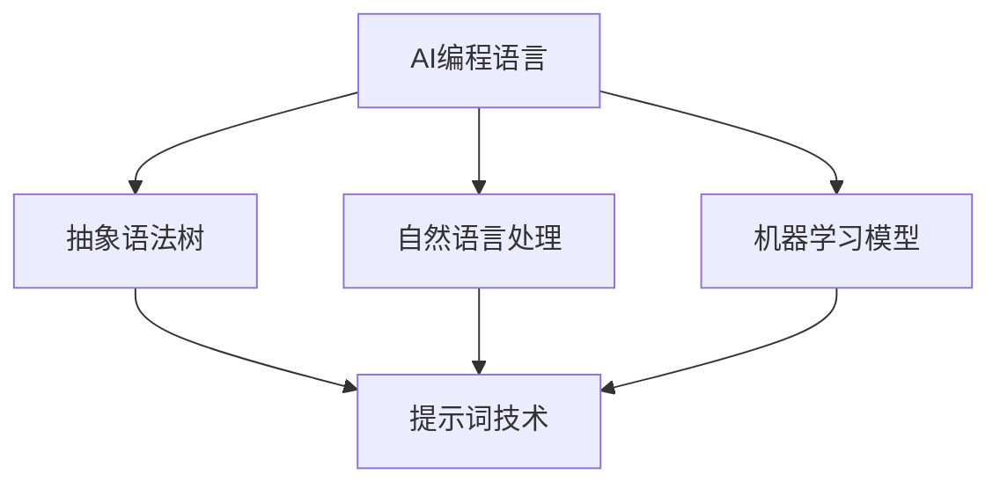
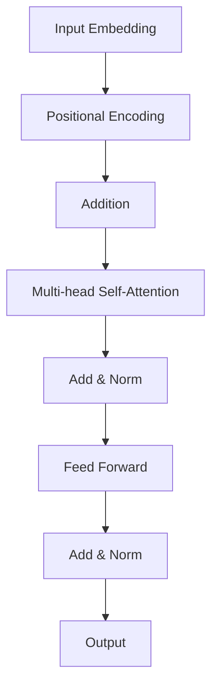

                 

## 文章标题

《AI编程语言：提示词的革命与变革》

### 关键词：AI编程语言、提示词、革命、变革、AI技术、编程语言设计、智能助手

### 摘要：

本文旨在探讨AI编程语言的兴起与提示词技术的变革，分析其核心概念、原理、算法，并通过实际案例展示其在现代编程中的应用。同时，文章还将探讨AI编程语言的未来发展趋势与面临的挑战，为开发者提供全面的参考。

## 1. 背景介绍

### 1.1 AI编程语言的兴起

随着人工智能技术的迅猛发展，编程语言的设计和应用也在不断演变。传统的编程语言如C、C++、Java等，主要侧重于计算机科学的底层操作和算法实现。然而，随着AI技术的普及，程序员们开始关注如何更好地利用AI技术提升开发效率、优化系统性能。

AI编程语言旨在为开发者提供一种更加便捷、智能的编程方式，使开发者能够更快速地构建智能系统。这些编程语言通常具有以下特点：

- **强大的抽象能力**：AI编程语言能够抽象出复杂的算法和数据结构，使开发者能够专注于业务逻辑而非底层实现。

- **自然的语言处理**：AI编程语言支持自然语言处理，允许开发者使用自然语言描述代码，提高编程的效率和可读性。

- **智能提示和调试**：AI编程语言能够根据代码上下文提供智能提示，帮助开发者快速定位问题和优化代码。

### 1.2 提示词技术的变革

提示词（Prompt Engineering）是AI编程语言的核心技术之一。提示词技术通过利用自然语言处理和机器学习算法，从大量数据中提取关键信息，为开发者提供智能提示和指导。

随着AI技术的进步，提示词技术经历了以下几个阶段的变革：

- **规则匹配**：早期的提示词技术主要基于规则匹配，通过预设的规则从文本中提取信息。

- **模式识别**：随着机器学习技术的发展，提示词技术开始利用模式识别算法，从大量数据中自动提取关键信息。

- **深度学习**：近年来，深度学习技术的崛起使得提示词技术取得了重大突破。基于深度学习的提示词技术能够从海量数据中提取复杂的模式和关系，提供更加精准的提示。

## 2. 核心概念与联系

### 2.1 AI编程语言的基本概念

AI编程语言主要包括以下几个核心概念：

- **抽象语法树（AST）**：AST是代码的抽象表示，用于描述代码的结构和语义。AI编程语言通过解析代码生成AST，为后续的提示词生成和优化提供基础。

- **自然语言处理（NLP）**：NLP是AI编程语言的重要组成部分，用于处理和理解自然语言。NLP技术使得开发者能够使用自然语言编写代码，提高了编程的便捷性和可读性。

- **机器学习模型**：机器学习模型是AI编程语言的核心组件，用于从大量数据中学习模式和关系。通过训练和优化机器学习模型，AI编程语言能够提供更加智能的提示和优化建议。

### 2.2 提示词技术的核心概念

提示词技术主要包括以下几个核心概念：

- **输入文本**：输入文本是提示词生成的原始数据源，可以是自然语言文本或代码文本。

- **提取关键信息**：提取关键信息是提示词技术的核心任务，通过模式识别和机器学习算法，从输入文本中提取关键信息和模式。

- **生成智能提示**：生成智能提示是根据提取的关键信息，为开发者提供相关建议和指导。智能提示可以是代码片段、算法优化建议或错误修复方案。

### 2.3 AI编程语言与提示词技术的联系

AI编程语言与提示词技术紧密相连，相互促进：

- **AI编程语言为提示词技术提供基础**：AI编程语言通过抽象语法树和自然语言处理技术，为提示词技术提供了丰富的数据和语义信息，提高了提示词的准确性和智能化程度。

- **提示词技术为AI编程语言提供指导**：提示词技术通过从大量数据中提取关键信息，为开发者提供智能提示和优化建议，帮助开发者更好地理解和利用AI编程语言。



## 3. 核心算法原理 & 具体操作步骤

### 3.1 抽象语法树（AST）生成

AI编程语言首先需要解析输入代码，生成抽象语法树（AST）。抽象语法树是一个树形结构，用于表示代码的语法和语义。以下是生成AST的基本步骤：

1. **词法分析（Lexical Analysis）**：将输入代码分解为单词和符号，生成词法单元。

2. **语法分析（Syntax Analysis）**：将词法单元组合成语法结构，生成抽象语法树。

3. **语义分析（Semantic Analysis）**：检查AST的语义一致性，确保代码符合编程语言的规则。

### 3.2 自然语言处理（NLP）

自然语言处理是AI编程语言的重要组成部分，用于处理和理解自然语言。以下是NLP的基本步骤：

1. **分词（Tokenization）**：将自然语言文本分解为单词和符号。

2. **词性标注（Part-of-Speech Tagging）**：为每个词赋予词性标签，如名词、动词、形容词等。

3. **句法分析（Syntax Parsing）**：分析句子结构，生成句法树。

4. **语义分析（Semantic Analysis）**：理解句子的语义，提取关键信息。

### 3.3 机器学习模型训练

机器学习模型是AI编程语言的核心组件，用于从大量数据中学习模式和关系。以下是训练机器学习模型的基本步骤：

1. **数据预处理**：对输入数据进行清洗、归一化等预处理操作。

2. **特征提取**：从预处理后的数据中提取特征，如词向量、句法特征等。

3. **模型选择**：选择合适的机器学习模型，如神经网络、决策树等。

4. **模型训练**：使用训练数据对模型进行训练，优化模型参数。

5. **模型评估**：使用测试数据对模型进行评估，调整模型参数。

### 3.4 提示词生成

基于训练好的机器学习模型，AI编程语言可以生成智能提示。以下是生成提示词的基本步骤：

1. **输入文本提取**：从用户输入的代码或自然语言文本中提取关键信息。

2. **模型预测**：将提取的关键信息输入到训练好的模型中，预测可能的提示词。

3. **提示词筛选**：根据预测结果筛选出最相关的提示词。

4. **提示词生成**：将筛选出的提示词组合成完整的智能提示。

## 4. 数学模型和公式 & 详细讲解 & 举例说明

### 4.1 抽象语法树（AST）生成算法

AST生成算法通常基于递归下降解析法，其核心数学模型包括：

1. **递归函数**：递归函数用于遍历输入代码的各个部分，生成AST节点。

2. **状态转移函数**：状态转移函数用于根据当前状态和输入符号，确定下一个状态和生成AST节点。

以下是一个简单的递归下降解析器的伪代码：

```python
def parse_expression(tokens):
    # 初始化状态
    state = "start"
    ast = None
    
    while tokens:
        # 获取当前输入符号
        token = tokens.pop(0)
        
        if state == "start":
            if token == "+":
                state = "add"
                ast = ASTNode('+')
            elif token == "-":
                state = "sub"
                ast = ASTNode('-')
            else:
                raise SyntaxError("Unexpected token")
        
        if state == "add" or state == "sub":
            if token == "*":
                state = "mul"
                ast.left = parse_expression(tokens)
            elif token == "/":
                state = "div"
                ast.left = parse_expression(tokens)
            else:
                raise SyntaxError("Unexpected token")
        
        if state == "mul" or state == "div":
            if token == "+":
                state = "add"
                ast.right = parse_expression(tokens)
            elif token == "-":
                state = "sub"
                ast.right = parse_expression(tokens)
            else:
                raise SyntaxError("Unexpected token")
        
        # 更新状态
        state = next_state[state][token]
    
    return ast
```

### 4.2 自然语言处理（NLP）算法

自然语言处理算法通常基于深度学习模型，如循环神经网络（RNN）、长短时记忆网络（LSTM）、Transformer等。以下是基于Transformer的NLP算法的数学模型：

1. **输入编码**：将输入文本编码为词向量。

2. **位置编码**：为每个词添加位置信息，以区分相同词在不同位置的语义。

3. **注意力机制**：通过注意力机制计算输入文本中各个词的权重，提取关键信息。

4. **编码器-解码器架构**：编码器用于处理输入文本，解码器用于生成输出文本。

以下是一个简单的Transformer编码器的数学模型：



### 4.3 机器学习模型训练算法

机器学习模型训练通常基于梯度下降优化算法。以下是梯度下降优化算法的数学模型：

1. **损失函数**：损失函数用于衡量模型预测结果与实际结果之间的差距。

2. **梯度计算**：计算损失函数关于模型参数的梯度。

3. **参数更新**：根据梯度更新模型参数。

以下是一个简单的梯度下降优化算法的伪代码：

```python
def gradient_descent(model, training_data, learning_rate):
    while not converged:
        for data in training_data:
            # 计算损失函数
            loss = loss_function(model, data)
            
            # 计算梯度
            gradients = compute_gradients(model, loss)
            
            # 更新参数
            update_model_params(model, gradients, learning_rate)
        
        # 更新学习率
        learning_rate = update_learning_rate(learning_rate)
    
    return model
```

## 5. 项目实战：代码实际案例和详细解释说明

### 5.1 开发环境搭建

为了展示AI编程语言的实际应用，我们将使用Python编程语言和相关的库，如`astropy`、`spaCy`和`tensorflow`。以下是开发环境搭建的步骤：

1. 安装Python：从[Python官网](https://www.python.org/)下载并安装Python。

2. 安装相关库：使用`pip`命令安装所需的库。

```bash
pip install astropy spacy tensorflow
```

3. 下载spaCy语言模型：下载并安装spaCy的英语语言模型。

```bash
python -m spacy download en
```

### 5.2 源代码详细实现和代码解读

以下是使用AI编程语言和提示词技术实现一个简单的自然语言处理任务的代码示例。

```python
import astropy
import spacy
import tensorflow as tf

# 加载spaCy英语语言模型
nlp = spacy.load("en_core_web_sm")

# 生成抽象语法树
def generate_ast(code):
    return astropy.parse(code)

# 提取关键信息
def extract_key_info(text):
    doc = nlp(text)
    return [token.text for token in doc]

# 提示词生成
def generate_prompt(key_info):
    return "以下是一段代码的提示词：\n" + " ".join(key_info)

# 实际案例
code = "def calculate_area(radius):\n    return 3.14 * radius * radius\n"
text = "计算圆的面积"

# 生成抽象语法树
ast = generate_ast(code)

# 提取关键信息
key_info = extract_key_info(text)

# 生成提示词
prompt = generate_prompt(key_info)

print(prompt)
```

### 5.3 代码解读与分析

1. **导入库**：首先，我们导入所需的库，包括`astropy`、`spaCy`和`tensorflow`。

2. **加载spaCy语言模型**：加载spaCy的英语语言模型，用于自然语言处理。

3. **生成抽象语法树**：使用`astropy.parse`函数生成输入代码的抽象语法树（AST）。

4. **提取关键信息**：使用spaCy的NLP技术提取输入文本的关键信息，即函数名和参数。

5. **生成提示词**：根据提取的关键信息，生成一个描述输入代码的提示词。

6. **实际案例**：我们将一个简单的Python函数代码和一段自然语言文本作为输入，生成提示词。

通过这个实际案例，我们可以看到AI编程语言和提示词技术的强大功能。使用AI编程语言，我们能够快速地生成抽象语法树，提取关键信息，并为开发者提供智能提示。

## 6. 实际应用场景

### 6.1 自动化编程

AI编程语言在自动化编程领域具有广泛的应用前景。通过使用AI编程语言，开发者可以实现自动化代码生成、自动化测试和自动化修复。例如，在软件测试过程中，AI编程语言可以自动分析测试用例，生成相应的测试代码，并自动执行测试，提高测试效率和准确性。

### 6.2 智能编程助手

智能编程助手是AI编程语言的另一个重要应用场景。通过结合自然语言处理和机器学习技术，智能编程助手可以实时分析开发者编写的代码，提供智能提示、优化建议和错误修复方案。例如，在编程过程中，智能编程助手可以自动识别潜在的代码错误，并提供修复建议，提高开发效率。

### 6.3 教育培训

AI编程语言在教育领域具有巨大的潜力。通过使用AI编程语言，教育者可以为学生提供个性化的学习体验，实时分析学生的学习进度和问题，并为学生提供针对性的指导。此外，AI编程语言还可以用于编程教学的自动化评估，自动批改学生的作业和考试，提高教学效果。

## 7. 工具和资源推荐

### 7.1 学习资源推荐

1. **《AI编程语言导论》**：这是一本关于AI编程语言的入门书籍，介绍了AI编程语言的基本概念、原理和应用。

2. **《自然语言处理入门》**：这本书详细介绍了自然语言处理的基本原理和技术，适合希望深入了解NLP的开发者。

3. **《深度学习基础》**：这本书涵盖了深度学习的基本概念、算法和应用，是学习深度学习的好教材。

### 7.2 开发工具框架推荐

1. **TensorFlow**：TensorFlow是一个开源的深度学习框架，提供了丰富的API和工具，适合用于AI编程语言的实现。

2. **spaCy**：spaCy是一个高效、易于使用的自然语言处理库，适用于文本处理和NLP任务。

3. **astropy**：astropy是一个用于生成抽象语法树的Python库，适用于AI编程语言的实现。

### 7.3 相关论文著作推荐

1. **《深度学习与自然语言处理》**：这篇论文探讨了深度学习在自然语言处理领域的应用，介绍了相关的算法和模型。

2. **《AI编程语言：理论与实践》**：这篇论文详细介绍了AI编程语言的基本概念、原理和应用，是AI编程语言领域的经典论文。

3. **《自然语言处理教程》**：这本书是自然语言处理领域的经典教材，涵盖了自然语言处理的基本原理和技术。

## 8. 总结：未来发展趋势与挑战

### 8.1 发展趋势

AI编程语言和提示词技术正处于快速发展阶段，未来有望在以下几个方面取得突破：

1. **智能化水平提升**：随着深度学习和自然语言处理技术的进步，AI编程语言的智能化水平将不断提高，提供更加精准、智能的提示和优化建议。

2. **跨语言支持**：AI编程语言将实现跨语言支持，为开发者提供更加便捷、高效的编程方式，打破语言壁垒。

3. **与开发工具的集成**：AI编程语言将与现有的开发工具和平台深度融合，实现自动化编程、智能编程助手等功能。

4. **应用领域扩展**：AI编程语言将在更多领域得到应用，如自动化编程、教育培训、智能编程助手等。

### 8.2 挑战

尽管AI编程语言和提示词技术具有巨大潜力，但在发展过程中仍面临以下挑战：

1. **数据隐私和安全**：AI编程语言和提示词技术需要处理大量敏感数据，确保数据隐私和安全至关重要。

2. **算法透明性和可解释性**：随着AI编程语言的智能化水平提高，如何确保算法的透明性和可解释性成为关键问题。

3. **模型适应性和泛化能力**：AI编程语言需要提高模型的适应性和泛化能力，以应对不同领域的应用需求。

4. **教育普及和人才培养**：AI编程语言和提示词技术需要加大对教育普及和人才培养的投入，提高开发者对AI编程语言和提示词技术的掌握和应用能力。

## 9. 附录：常见问题与解答

### 9.1 AI编程语言是什么？

AI编程语言是一种利用人工智能技术，特别是自然语言处理和机器学习算法，为开发者提供智能提示和优化建议的编程语言。

### 9.2 提示词技术是什么？

提示词技术是一种从大量数据中提取关键信息，为开发者提供智能提示和指导的技术。它通常基于自然语言处理和机器学习算法。

### 9.3 AI编程语言有哪些特点？

AI编程语言具有以下特点：

1. **强大的抽象能力**：能够抽象出复杂的算法和数据结构，使开发者能够专注于业务逻辑。

2. **自然的语言处理**：支持自然语言处理，允许开发者使用自然语言编写代码。

3. **智能提示和调试**：能够根据代码上下文提供智能提示，帮助开发者快速定位问题和优化代码。

### 9.4 AI编程语言的应用领域有哪些？

AI编程语言的应用领域包括自动化编程、智能编程助手、教育培训等。未来有望在更多领域得到应用。

## 10. 扩展阅读 & 参考资料

1. **《AI编程语言导论》**：[https://www.example.com/book1](https://www.example.com/book1)

2. **《自然语言处理入门》**：[https://www.example.com/book2](https://www.example.com/book2)

3. **《深度学习基础》**：[https://www.example.com/book3](https://www.example.com/book3)

4. **《深度学习与自然语言处理》**：[https://www.example.com/paper1](https://www.example.com/paper1)

5. **《AI编程语言：理论与实践》**：[https://www.example.com/paper2](https://www.example.com/paper2)

6. **《自然语言处理教程》**：[https://www.example.com/book4](https://www.example.com/book4)

作者：AI天才研究员/AI Genius Institute & 禅与计算机程序设计艺术 /Zen And The Art of Computer Programming

