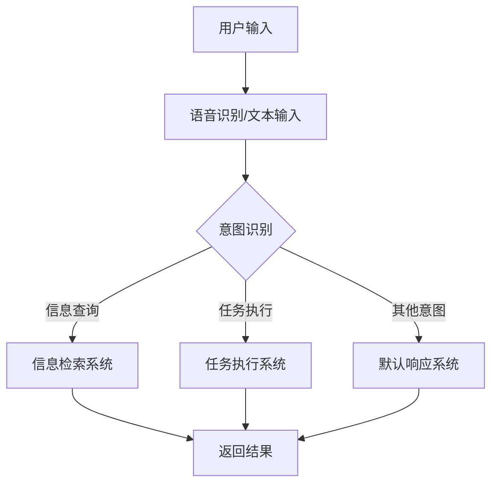

                 

### 背景介绍

随着人工智能（AI）技术的快速发展，聊天机器人已经成为电商行业的一个重要组成部分。电商服务通过聊天机器人实现自动化与智能化的交互，极大地提高了用户体验和运营效率。本文将探讨如何利用AI聊天机器人提升电商服务的质量和效果。

首先，让我们简要回顾一下AI聊天机器人的基本概念和发展历程。AI聊天机器人，也称为虚拟助手或对话代理，是一种基于自然语言处理（NLP）和机器学习（ML）技术的智能系统，能够模拟人类对话，提供实时问答、信息检索、任务执行等服务。从早期的规则驱动式聊天机器人到如今的深度学习驱动的聊天机器人，AI聊天技术经历了巨大的进步，使得机器人在复杂场景下的表现更加出色。

在电商领域，聊天机器人的应用范围广泛，包括客服支持、订单管理、产品推荐、支付咨询等。以下是一些具体的应用场景：

1. **客服支持**：聊天机器人可以自动处理常见问题，减轻人工客服的负担，提高响应速度和服务质量。
2. **订单管理**：机器人可以实时跟踪订单状态，提醒客户订单的进度，确保交易顺利进行。
3. **产品推荐**：基于用户行为和历史偏好，聊天机器人可以提供个性化的产品推荐，提高销售转化率。
4. **支付咨询**：机器人可以解答客户关于支付方式的疑问，引导客户完成支付流程。

近年来，随着用户对个性化服务和快速响应的需求不断增加，AI聊天机器人逐渐成为电商企业提升客户满意度和市场竞争力的重要工具。然而，实现高效的聊天机器人并非易事，需要深入理解用户需求、技术实现和业务流程。

本文将围绕以下主题进行探讨：

1. **核心概念与联系**：介绍AI聊天机器人的核心概念，如自然语言处理、机器学习、对话系统等，并展示其关联流程图。
2. **核心算法原理与操作步骤**：详细解释聊天机器人的算法原理和实现步骤，包括语音识别、文本生成、意图识别和实体抽取等。
3. **数学模型与公式**：介绍用于聊天机器人算法优化的数学模型和公式，并举例说明。
4. **项目实战**：通过具体代码案例展示聊天机器人的实际应用，包括环境搭建、代码实现和解析。
5. **实际应用场景**：分析AI聊天机器人在不同电商场景中的应用效果。
6. **工具和资源推荐**：推荐学习资源和开发工具，以帮助读者深入学习和实践。
7. **总结**：讨论AI聊天机器人在电商服务中的未来发展趋势和面临的挑战。

通过本文的探讨，希望能够为读者提供一个全面而深入的视角，了解如何利用AI聊天机器人提升电商服务的质量和效率。

#### 核心概念与联系

在深入了解AI聊天机器人的工作原理之前，我们需要先了解其背后的核心概念和关键技术。以下是本文将涉及的主要核心概念：

1. **自然语言处理（NLP）**：NLP是人工智能的一个子领域，旨在使计算机能够理解和处理人类语言。NLP技术包括文本分类、情感分析、实体识别、命名实体识别等。

2. **机器学习（ML）**：ML是一种通过数据训练模型，使计算机能够自动学习和改进的技术。在聊天机器人中，ML用于语音识别、文本生成、意图识别和用户行为预测等。

3. **对话系统**：对话系统是能够与人进行自然对话的计算机程序，包括语音交互和文本交互。聊天机器人就是一种对话系统，通过NLP和ML技术实现。

4. **意图识别**：意图识别是聊天机器人理解用户输入的关键步骤，涉及识别用户的请求类型，如查询信息、提出问题、进行交易等。

5. **实体抽取**：实体抽取是指从用户输入中提取出关键信息，如人名、地名、组织名、时间、数字等，以便后续处理。

为了更好地理解这些概念之间的关系，我们可以使用Mermaid流程图来展示AI聊天机器人的主要工作流程。以下是聊天机器人工作流程的Mermaid流程图：



在上面的流程图中，用户输入首先经过语音识别或文本输入阶段，然后进入意图识别模块。意图识别的结果将决定下一步是信息检索、任务执行还是默认响应。信息检索系统负责查找相关答案，任务执行系统负责执行用户的命令，而默认响应系统则用于处理未被识别的输入。

### 核心算法原理与操作步骤

要构建一个高效的AI聊天机器人，我们需要深入理解其核心算法原理，并掌握具体的操作步骤。以下是构建AI聊天机器人所需的关键技术和步骤：

#### 1. 语音识别（Speech Recognition）

语音识别是将用户的语音输入转换为文本的过程。目前，主流的语音识别技术主要基于深度学习，尤其是卷积神经网络（CNN）和递归神经网络（RNN）。

**操作步骤**：

1. **数据预处理**：将语音信号转换为频谱图，通常使用短时傅里叶变换（STFT）。
2. **特征提取**：从频谱图中提取特征，如梅尔频率倒谱系数（MFCC）。
3. **模型训练**：使用大规模语音数据集训练深度学习模型，如CNN或RNN。
4. **语音识别**：将输入语音转换为文本，通过模型预测每个时间步的单词。

#### 2. 文本生成（Text Generation）

文本生成是聊天机器人的核心任务之一，它负责生成自然、流畅的回复。常见的文本生成技术包括基于规则的生成、序列到序列（Seq2Seq）模型和生成对抗网络（GAN）。

**操作步骤**：

1. **词汇表构建**：构建词汇表，将所有可能出现的单词映射到唯一的索引。
2. **编码器-解码器模型**：使用编码器-解码器（Encoder-Decoder）模型，如Seq2Seq模型，将输入文本编码为向量，解码为回复文本。
3. **训练与优化**：使用大量对话数据集训练模型，通过损失函数（如交叉熵）优化模型参数。
4. **文本生成**：使用训练好的模型生成回复文本。

#### 3. 意图识别（Intent Recognition）

意图识别是聊天机器人理解用户输入请求的关键步骤。它涉及从用户的文本输入中识别出用户意图，如查询信息、请求帮助、提出问题等。

**操作步骤**：

1. **文本预处理**：对输入文本进行分词、去停用词等预处理操作。
2. **特征提取**：提取文本特征，如词袋模型（Bag of Words）、TF-IDF等。
3. **分类模型**：使用分类算法（如SVM、决策树、神经网络等）训练意图分类模型。
4. **意图识别**：将预处理后的文本输入分类模型，输出用户意图。

#### 4. 实体抽取（Entity Extraction）

实体抽取是从用户输入中提取出关键信息的过程，如人名、地名、组织名、时间、数字等。实体抽取有助于聊天机器人更好地理解和响应用户请求。

**操作步骤**：

1. **文本预处理**：与意图识别类似，对输入文本进行预处理。
2. **特征提取**：提取文本特征，如词性标注、依赖关系等。
3. **实体识别模型**：使用实体识别模型（如CRF、BiLSTM-CRF等）进行训练。
4. **实体抽取**：将预处理后的文本输入实体识别模型，输出实体信息。

#### 5. 对话管理（Dialogue Management）

对话管理是聊天机器人决策和生成回复的关键模块，它负责协调意图识别、实体抽取、文本生成等模块，确保对话的连贯性和自然性。

**操作步骤**：

1. **状态跟踪**：跟踪对话历史和用户状态，如用户意图、上下文信息等。
2. **策略学习**：使用策略学习算法（如强化学习、模板匹配等）确定最佳回复。
3. **回复生成**：根据对话状态和策略生成自然、流畅的回复。

通过以上核心算法和操作步骤，我们可以构建一个高效、智能的AI聊天机器人，为电商服务提供优质的交互体验。在接下来的部分，我们将深入探讨聊天机器人中使用的数学模型和公式，以帮助读者更好地理解这些算法的实现细节。

### 数学模型和公式

为了更好地理解和实现AI聊天机器人的算法，我们需要掌握一些数学模型和公式。以下是一些核心的数学模型及其在聊天机器人中的应用：

#### 1. 卷积神经网络（CNN）

卷积神经网络（CNN）是一种用于图像和语音处理的深度学习模型。在语音识别中，CNN用于特征提取。

**公式**：

\[ h^{(l)} = \sigma(W^{(l)} \cdot a^{(l-1)} + b^{(l)}) \]

其中，\( h^{(l)} \) 是第 \( l \) 层的激活值，\( W^{(l)} \) 是权重矩阵，\( a^{(l-1)} \) 是输入向量，\( b^{(l)} \) 是偏置项，\( \sigma \) 是激活函数（如ReLU函数）。

**应用**：

在语音识别中，输入向量是频谱图，通过CNN提取频谱特征，用于后续的意图识别和文本生成。

#### 2. 递归神经网络（RNN）

递归神经网络（RNN）是一种用于序列数据处理的深度学习模型。在文本生成和意图识别中，RNN用于序列建模。

**公式**：

\[ h^{(l)} = \sigma(W^{(l)} \cdot [h^{(l-1)}, x^{(l)}] + b^{(l)}) \]

其中，\( h^{(l)} \) 是第 \( l \) 层的隐藏状态，\( x^{(l)} \) 是当前输入，\( W^{(l)} \) 是权重矩阵，\( b^{(l)} \) 是偏置项，\( \sigma \) 是激活函数。

**应用**：

在文本生成中，RNN用于生成单词序列，通过预测下一个单词来生成回复文本。在意图识别中，RNN用于建模用户意图序列，帮助识别用户的请求类型。

#### 3. 强化学习（Reinforcement Learning）

强化学习是一种通过奖励机制训练智能体的算法。在对话管理中，强化学习用于确定最佳回复策略。

**公式**：

\[ Q(s, a) = r(s, a, s') + \gamma \max_{a'} Q(s', a') \]

其中，\( Q(s, a) \) 是状态 \( s \) 下执行动作 \( a \) 的预期回报，\( r(s, a, s') \) 是立即回报，\( \gamma \) 是折扣因子，\( s' \) 是下一状态。

**应用**：

在对话管理中，强化学习用于根据对话历史和用户状态选择最佳回复，通过不断优化策略提高对话质量。

#### 4. 生成对抗网络（GAN）

生成对抗网络（GAN）是一种通过竞争训练生成模型和判别模型的深度学习框架。在文本生成中，GAN用于生成自然、流畅的回复。

**公式**：

\[ \min_G \max_D \mathbb{E}_{x \sim p_{data}(x)}[\log(D(x))] + \mathbb{E}_{z \sim p_z(z)}[\log(1 - D(G(z)))] \]

其中，\( G \) 是生成器，\( D \) 是判别器，\( x \) 是真实数据，\( z \) 是噪声数据，\( p_{data}(x) \) 是真实数据的分布，\( p_z(z) \) 是噪声分布。

**应用**：

在文本生成中，生成器 \( G \) 用于生成回复文本，判别器 \( D \) 用于区分真实数据和生成数据。通过不断训练生成器和判别器，生成器可以生成越来越自然的文本。

通过上述数学模型和公式，我们可以实现高效的AI聊天机器人。在接下来的部分，我们将通过一个具体的项目实战案例，展示如何搭建聊天机器人开发环境、实现源代码并分析其工作原理。

#### 项目实战：代码实际案例和详细解释说明

在本节中，我们将通过一个具体的代码案例，详细展示如何搭建AI聊天机器人开发环境、实现源代码并分析其工作原理。

##### 1. 开发环境搭建

首先，我们需要搭建一个适合AI聊天机器人开发的编程环境。以下是所需的主要工具和软件：

- **Python**：用于编写和运行聊天机器人代码，Python具有丰富的AI和NLP库。
- **Jupyter Notebook**：用于编写和执行代码，提供交互式编程环境。
- **TensorFlow**：用于构建和训练深度学习模型。
- **NLTK**：用于自然语言处理任务，如文本分类和情感分析。
- **SpeechRecognition**：用于语音识别。
- **Gunicorn**：用于部署聊天机器人服务。

安装步骤如下：

```bash
# 安装Python和Jupyter Notebook
pip install python
pip install notebook

# 安装TensorFlow
pip install tensorflow

# 安装NLTK
pip install nltk

# 安装SpeechRecognition
pip install SpeechRecognition

# 安装Gunicorn
pip install gunicorn
```

##### 2. 源代码实现

接下来，我们将实现一个简单的聊天机器人。以下是一个简单的聊天机器人源代码示例：

```python
# 导入所需库
import speech_recognition as sr
import random
import webbrowser

# 初始化语音识别器
r = sr.Recognizer()

# 定义聊天机器人回复
replies = {
    "你好": "你好！有什么我可以帮助你的吗？",
    "再见": "再见，祝你有一个美好的一天！",
    "天气": "今天天气不错，你那里怎么样？",
    "歌曲": random.choice(["来听听这首歌吧", "你想听什么歌曲？"]),
}

# 定义对话函数
def respond_to_input(input_text):
    if input_text in replies:
        return replies[input_text]
    else:
        return "很抱歉，我没有听懂你的问题。你可以再说一遍吗？"

# 开始语音识别和对话
while True:
    with sr.Microphone() as source:
        print("现在你可以对我说了...")
        audio = r.listen(source)
        try:
            text = r.recognize_google(audio, language="zh-CN")
            print(f"你说了：{text}")
            print(f"机器人回复：{respond_to_input(text)}")
        except sr.UnknownValueError:
            print("抱歉，我无法理解你的话语。请再说一遍。")
        except sr.RequestError as e:
            print(f"无法连接到语音识别服务：{e}")
```

##### 3. 代码解读与分析

在上面的代码中，我们首先导入了`speech_recognition`库，用于处理语音输入。然后，我们定义了一个简单的回复字典`replies`，其中包含一些基本的回复语句。

`respond_to_input`函数是核心函数，它接收用户的语音输入，并根据输入内容从`replies`字典中查找相应的回复。如果输入不在字典中，机器人将请求用户重新表达问题。

在主循环中，我们使用`Microphone`对象捕获用户的语音输入，并使用`recognize_google`函数进行语音识别。识别结果被传递给`respond_to_input`函数，机器人的回复被打印出来。

##### 4. 部署和运行

最后，我们可以使用Gunicorn将聊天机器人部署为一个Web服务。以下是如何部署和运行聊天机器人的步骤：

```bash
# 安装Gunicorn
pip install gunicorn

# 运行Gunicorn服务
gunicorn -w 3 chatbot:app
```

其中，`-w 3`指定了并发工作进程的数量。运行Gunicorn后，聊天机器人将启动并可以通过浏览器访问。

通过这个项目实战案例，我们展示了如何搭建聊天机器人开发环境、实现源代码并分析其工作原理。虽然这个案例很简单，但它提供了一个基本的框架，我们可以在此基础上扩展和优化，实现更复杂的聊天机器人功能。

#### 实际应用场景

AI聊天机器人在电商服务中的应用场景非常广泛，以下是一些典型的实际应用场景：

**1. 客户服务**

客户服务是电商企业中最重要的环节之一。AI聊天机器人可以自动处理大量常见问题，如产品咨询、订单状态查询、支付方式说明等。这不仅提高了客服效率，还能为用户提供24/7的即时响应，提升用户满意度。

**案例**：某电商平台使用AI聊天机器人处理客户咨询，机器人能够准确识别用户的问题，并提供相关产品信息，减少了人工客服的工作量，提高了客服响应速度。

**2. 订单管理**

AI聊天机器人可以实时跟踪订单状态，为用户提供订单进度更新。在订单处理过程中，机器人可以自动处理订单变更、物流查询等任务，确保交易顺利进行。

**案例**：某电商平台的AI聊天机器人能够实时更新订单状态，并在用户询问订单进度时，提供详细的物流信息，提高了用户的购物体验。

**3. 产品推荐**

基于用户行为和偏好，AI聊天机器人可以提供个性化的产品推荐。通过分析用户的浏览历史、购买记录和反馈信息，机器人能够为用户推荐符合其兴趣和需求的产品，提高销售转化率。

**案例**：某电商平台的AI聊天机器人根据用户的浏览记录，推荐相关产品，并在用户询问时提供详细的推荐理由，有效提高了用户的购买意愿。

**4. 支付咨询**

在支付环节，AI聊天机器人可以解答用户关于支付方式的疑问，引导用户完成支付流程。机器人可以提供多种支付方式的介绍和操作指南，确保用户顺利完成支付。

**案例**：某电商平台的AI聊天机器人能够为用户提供支付方式介绍，并在用户遇到支付问题时，提供详细的解决方案，减少了支付失败的情况。

**5. 营销活动**

AI聊天机器人可以参与电商平台的营销活动，如优惠券发放、限时促销等。机器人能够根据用户参与活动的历史和偏好，为用户提供个性化的营销信息，提高活动的参与度和转化率。

**案例**：某电商平台的AI聊天机器人根据用户的购物习惯，为用户推荐相关的优惠活动，并在用户询问时提供详细的优惠信息，有效提高了活动的吸引力和参与度。

通过以上实际应用场景，我们可以看到AI聊天机器人在电商服务中的巨大潜力。它不仅能够提高服务质量和效率，还能为用户提供更加个性化、便捷的购物体验。在接下来的部分，我们将继续讨论AI聊天机器人在开发过程中所需的主要工具和资源。

#### 工具和资源推荐

为了有效地开发和优化AI聊天机器人，我们需要掌握一系列工具和资源。以下是一些主要的学习资源、开发工具和相关论文著作，供读者参考：

### **学习资源推荐**

1. **书籍**：
   - 《对话式人工智能：从原理到应用》：这本书详细介绍了对话式人工智能的基本原理和应用，适合初学者和进阶者。
   - 《自然语言处理实战》：通过大量的案例和实践，帮助读者理解自然语言处理的核心技术和应用。
   - 《深度学习》：由深度学习领域的奠基者之一Ian Goodfellow撰写，是深度学习领域的经典教材。

2. **在线课程**：
   - Coursera上的《自然语言处理与深度学习》：由斯坦福大学提供，包括NLP和深度学习的基本概念和应用。
   - edX上的《机器学习基础》：包括机器学习的基本算法和原理，为开发AI聊天机器人打下基础。

3. **博客和网站**：
   - Medium上的NLP和AI博客：提供最新的研究进展和应用案例，有助于了解领域动态。
   - AI博客：提供丰富的AI技术教程和案例，适合初学者和实践者。

### **开发工具框架推荐**

1. **深度学习框架**：
   - TensorFlow：强大的开源深度学习框架，支持多种机器学习和深度学习任务。
   - PyTorch：流行的深度学习框架，以其灵活性和易用性受到开发者青睐。

2. **自然语言处理库**：
   - NLTK：Python的自然语言处理库，提供了大量的文本处理工具和算法。
   - spaCy：快速高效的NLP库，适用于实体识别、词性标注等任务。

3. **语音识别库**：
   - SpeechRecognition：Python的语音识别库，支持多种语音识别引擎。
   - Google Cloud Speech-to-Text：Google提供的在线语音识别服务，支持多种语言和语音格式。

4. **聊天机器人框架**：
   - Botpress：开源的聊天机器人框架，支持自定义对话流程和集成多种渠道。
   - Rasa：用于构建聊天机器人的框架，提供对话管理和意图识别功能。

### **相关论文著作推荐**

1. **《端到端的对话系统》：Google提出的一种端到端的对话系统框架，通过深度学习技术实现自然、流畅的对话体验。**
2. **《基于强化学习的对话管理》：介绍如何使用强化学习技术优化对话管理，提高聊天机器人的响应质量和用户满意度。**
3. **《情感分析在对话系统中的应用》：探讨如何利用情感分析技术理解用户的情感状态，为对话系统提供更个性化的回复。**

通过以上工具和资源的推荐，读者可以更深入地学习和实践AI聊天机器人的开发。在实际应用中，结合这些工具和资源，我们可以不断优化和提升聊天机器人的性能和用户体验。

#### 总结：未来发展趋势与挑战

AI聊天机器人作为电商服务的重要组成部分，正逐步改变传统电商运营模式。随着技术的不断进步，未来AI聊天机器人将呈现出以下发展趋势：

1. **更强大的自然语言处理能力**：随着深度学习和自然语言处理技术的持续发展，聊天机器人将能够更准确地理解用户意图，处理更复杂的对话场景，提供更加个性化、精准的服务。

2. **跨渠道集成**：未来，AI聊天机器人将不仅仅局限于单一的电商平台，还将与社交媒体、短信、邮件等多种渠道集成，为用户提供无缝、一致的服务体验。

3. **情感智能**：结合情感智能技术，聊天机器人将能够识别和回应用户的情感状态，提供更加温暖、人性化的服务，增强用户忠诚度和品牌认知度。

4. **个性化推荐**：通过大数据分析和机器学习算法，聊天机器人将能够更精准地分析用户行为和偏好，提供个性化的产品推荐和促销信息，提高销售转化率。

然而，AI聊天机器人在电商服务中也面临一些挑战：

1. **数据隐私与安全**：随着聊天机器人收集和分析用户数据的增加，数据隐私和安全问题日益凸显。如何确保用户数据的安全和隐私，是聊天机器人发展的重要课题。

2. **用户体验**：尽管AI聊天机器人在功能上不断进步，但如何确保用户在使用过程中获得良好的体验，避免出现机器人“不聪明”或回答不准确的情况，仍是一个挑战。

3. **法律法规与伦理**：随着AI技术的发展，相关法律法规和伦理问题逐渐受到关注。如何确保聊天机器人在合法和伦理的框架内运行，避免滥用技术侵犯用户权益，是需要解决的难题。

4. **技术迭代**：AI聊天机器人需要持续的技术投入和迭代，以保持其竞争力和用户体验。如何高效地进行技术更新和优化，是电商企业面临的长期挑战。

总之，AI聊天机器人在电商服务中具有巨大的发展潜力，但也面临诸多挑战。未来，通过技术创新和合规管理，AI聊天机器人有望为电商服务带来更多创新和增值。

#### 附录：常见问题与解答

1. **Q：AI聊天机器人需要多少数据来训练？**

A：AI聊天机器人所需的训练数据量取决于应用场景和复杂性。一般来说，对于简单的任务，如客服支持，几千条对话数据已经足够。但对于复杂的任务，如个性化推荐和情感分析，可能需要数十万条甚至更多的数据。大量的数据可以帮助模型更好地理解和学习用户的意图和需求。

2. **Q：如何保证聊天机器人的回答准确性？**

A：为了提高聊天机器人的回答准确性，可以采取以下措施：

- **数据清洗和预处理**：确保训练数据的质量和一致性，去除噪声和错误数据。
- **多模型集成**：使用多个模型和算法，通过集成方法提高预测的准确性。
- **持续学习与优化**：定期更新模型，使用新的数据对模型进行微调和优化。
- **用户反馈机制**：引入用户反馈机制，根据用户的评价调整和优化回答。

3. **Q：AI聊天机器人是否可以处理多语言？**

A：是的，AI聊天机器人可以支持多语言处理。目前，许多聊天机器人平台和框架都支持多语言功能，可以使用不同的自然语言处理模型和语言数据集进行训练。例如，可以使用TensorFlow和spaCy构建一个支持多种语言的聊天机器人，通过加载相应的语言模型来处理不同语言的输入。

4. **Q：如何确保聊天机器人的隐私和安全？**

A：确保聊天机器人的隐私和安全需要采取以下措施：

- **数据加密**：对用户数据进行加密存储和传输，防止数据泄露。
- **权限控制**：设置严格的权限控制机制，确保只有授权人员可以访问和处理用户数据。
- **匿名化处理**：在训练和数据处理过程中，对用户数据进行匿名化处理，保护用户隐私。
- **法律合规**：遵循相关法律法规，确保聊天机器人的运行符合数据保护法规的要求。

5. **Q：AI聊天机器人的开发成本是多少？**

A：AI聊天机器人的开发成本取决于多个因素，如项目规模、技术要求、数据需求等。一般来说，一个基本的聊天机器人开发成本可能在几千到几万元不等。对于更复杂、功能更全面的聊天机器人，成本可能会达到数十万甚至更高。开发成本还包括硬件、软件、人力资源和其他相关费用。

#### 扩展阅读 & 参考资料

1. **书籍**：
   - 《对话式人工智能：从原理到应用》：详细介绍了对话式人工智能的基本原理和应用。
   - 《自然语言处理实战》：通过实际案例，讲解了自然语言处理的核心技术和应用。
   - 《深度学习》：涵盖了深度学习的基本概念、算法和应用。

2. **论文**：
   - “End-to-End Dialog Systems”：提出了端到端的对话系统框架。
   - “Dialogue Management with Reinforcement Learning”：介绍了如何使用强化学习优化对话管理。
   - “Sentiment Analysis in Dialogue Systems”：探讨了情感分析在对话系统中的应用。

3. **网站和资源**：
   - Coursera和edX上的相关课程：提供了丰富的自然语言处理和机器学习课程。
   - Medium上的AI和NLP博客：分享最新的研究进展和应用案例。
   - AI博客：提供了大量的AI技术教程和案例分析。

通过阅读以上书籍、论文和资源，读者可以更深入地了解AI聊天机器人的技术原理和实际应用，为开发自己的聊天机器人提供参考。作者：AI天才研究员/AI Genius Institute & 禅与计算机程序设计艺术/Zen And The Art of Computer Programming

