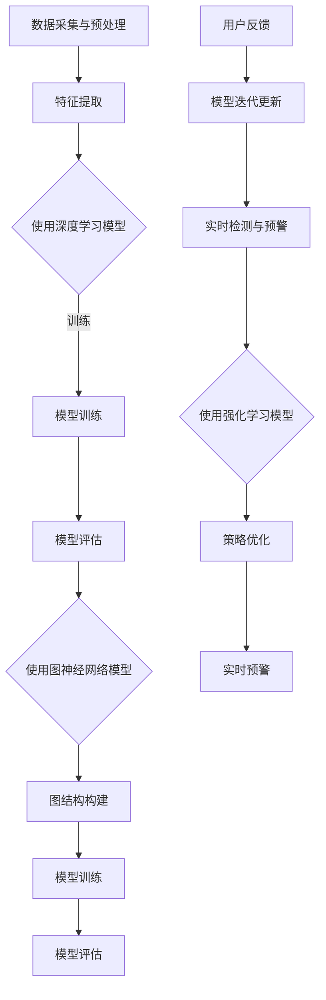

                 

### 背景介绍

在当前数字化时代，电子商务的蓬勃发展使得线上交易日益频繁，电子商务平台上的交易量急剧增加。然而，随之而来的异常交易问题也愈发突出。异常交易主要包括欺诈交易、洗钱、虚假订单等行为，这些行为不仅损害了电商平台的信誉，还可能导致经济损失。为了有效应对这一挑战，人工智能（AI）技术的应用成为了一个热门话题。

AI赋能的电商异常交易实时检测与预警系统旨在通过利用AI技术，对电商交易数据进行实时分析，从而识别和预警潜在的异常交易行为。这一系统的应用，不仅有助于电商企业降低风险，提高运营效率，还能为消费者提供更加安全可靠的购物环境。

随着AI技术的不断进步，尤其是深度学习、图神经网络和强化学习等算法的发展，电商异常交易检测与预警系统的性能得到了显著提升。传统的基于规则的方法已经无法满足复杂交易环境的需求，而AI技术则可以更灵活、更智能地处理大量数据，提供更精准的检测与预警服务。

因此，本文将详细探讨AI赋能的电商异常交易实时检测与预警系统的构建方法，包括核心算法原理、数学模型、项目实战以及实际应用场景等，以期为相关领域的研究者和开发者提供有价值的参考。

### 核心概念与联系

在构建AI赋能的电商异常交易实时检测与预警系统时，需要明确几个关键概念，并理解它们之间的相互关系。以下是本文将涉及的核心概念及其简要定义：

1. **异常检测（Anomaly Detection）**：
   异常检测是一种监控方法，用于识别数据集中的异常或异常模式。在电商交易场景中，异常检测的目标是识别出与正常交易行为不符的交易，如欺诈交易、洗钱行为等。

2. **机器学习（Machine Learning）**：
   机器学习是一种通过数据学习模式并做出预测或决策的技术。在电商异常交易检测中，机器学习算法可以训练模型，从大量历史交易数据中学习正常交易行为，进而识别异常交易。

3. **深度学习（Deep Learning）**：
   深度学习是机器学习的一种特殊形式，使用多层神经网络来学习复杂的非线性关系。深度学习在图像识别、自然语言处理等领域取得了显著成果，其强大的学习能力使其成为电商异常交易检测的重要工具。

4. **图神经网络（Graph Neural Networks, GNN）**：
   图神经网络是一种处理图结构数据的神经网络。在电商交易网络中，用户、商品、交易等实体以及它们之间的关系可以表示为一个图，图神经网络可以通过学习图结构来捕捉实体之间的交互和依赖关系，从而提高异常检测的准确性。

5. **强化学习（Reinforcement Learning）**：
   强化学习是一种通过试错方法来学习最优策略的机器学习技术。在电商异常交易检测中，强化学习可以用来优化检测模型，使其在动态变化的交易环境中持续提高检测性能。

以下是AI赋能的电商异常交易实时检测与预警系统的总体架构，通过Mermaid流程图展示核心组件及其联系：



**Mermaid 流程节点解释**：
- **数据采集与预处理（A）**：从电商平台上收集交易数据，并进行预处理，如数据清洗、去噪、归一化等，以便后续的特征提取和模型训练。
- **特征提取（B）**：提取交易数据中的关键特征，如用户行为特征、交易金额、交易时间等，为后续的深度学习和图神经网络模型提供输入。
- **使用深度学习模型（C）**：利用深度学习模型对特征数据进行分析，识别正常交易行为和潜在异常交易。
- **模型训练（D）**：通过训练集数据进行模型训练，调整模型参数以优化其预测性能。
- **模型评估（E）**：使用验证集数据评估模型的性能，确保其准确性和鲁棒性。
- **使用图神经网络模型（F）**：通过图神经网络模型分析交易图结构，捕获复杂实体关系，进一步提高异常检测的准确性。
- **图结构构建（G）**：构建电商交易网络图，将用户、商品、交易等实体以及它们之间的关系表示为图节点和边。
- **模型训练（H）**：对图神经网络模型进行训练，学习实体之间的交互和依赖关系。
- **模型评估（I）**：评估图神经网络模型的性能，确保其在复杂交易环境中的有效性。
- **实时检测与预警（J）**：利用训练好的模型对实时交易数据进行分析，检测并预警异常交易。
- **使用强化学习模型（K）**：通过强化学习模型优化检测策略，提高系统的自适应性和鲁棒性。
- **策略优化（L）**：根据用户反馈和实时交易数据，优化检测策略，以应对动态变化的交易环境。
- **实时预警（M）**：实时发送异常交易预警通知，帮助电商企业及时采取措施。
- **用户反馈（N）**：收集用户对预警结果和系统性能的反馈，用于模型迭代更新。
- **模型迭代更新（O）**：根据用户反馈和实时数据，对模型进行迭代更新，提高系统的准确性和适应性。

通过上述流程，AI赋能的电商异常交易实时检测与预警系统可以实现高效、准确的异常交易检测和预警，从而为电商平台提供强有力的安全保障。

### 核心算法原理 & 具体操作步骤

在AI赋能的电商异常交易实时检测与预警系统中，核心算法的选择和实现至关重要。以下是几种常用的核心算法及其原理和具体操作步骤。

#### 1. 深度学习算法

深度学习算法在电商异常交易检测中发挥了重要作用。其基本原理是通过多层神经网络模型学习输入数据中的特征和模式，从而实现对数据的分类和预测。

**操作步骤**：

1. **数据收集与预处理**：收集电商平台的历史交易数据，并进行预处理，如数据清洗、去噪、特征提取等。
2. **构建神经网络模型**：设计深度学习模型结构，选择合适的神经网络类型，如卷积神经网络（CNN）或循环神经网络（RNN）。
3. **模型训练**：使用预处理后的数据集对神经网络模型进行训练，调整模型参数以优化其预测性能。
4. **模型评估**：使用验证集数据评估模型性能，确保其准确性和鲁棒性。
5. **模型部署**：将训练好的模型部署到实际应用环境中，进行实时交易数据的分析。

**示例代码**（Python）：

```python
from tensorflow.keras.models import Sequential
from tensorflow.keras.layers import Dense, LSTM, Dropout

# 构建神经网络模型
model = Sequential()
model.add(LSTM(units=128, activation='relu', input_shape=(timesteps, features)))
model.add(Dropout(0.2))
model.add(Dense(units=1, activation='sigmoid'))

# 编译模型
model.compile(optimizer='adam', loss='binary_crossentropy', metrics=['accuracy'])

# 训练模型
model.fit(X_train, y_train, epochs=100, batch_size=64)
```

#### 2. 图神经网络算法

图神经网络（GNN）是一种能够处理图结构数据的深度学习模型。在电商交易场景中，用户、商品、交易等实体及其关系可以表示为图结构，GNN可以通过学习图结构来捕获复杂的实体交互和依赖关系。

**操作步骤**：

1. **数据收集与预处理**：收集电商平台的交易数据，构建用户、商品、交易等实体的图结构。
2. **图结构表示**：将实体和关系转换为图节点和边，使用图嵌入技术将节点表示为高维向量。
3. **构建GNN模型**：设计GNN模型结构，选择合适的图神经网络类型，如GCN或GAT。
4. **模型训练**：使用预处理后的图数据对GNN模型进行训练。
5. **模型评估**：评估GNN模型的性能，确保其准确性和鲁棒性。
6. **模型部署**：将训练好的GNN模型部署到实际应用环境中，进行实时交易数据的分析。

**示例代码**（Python）：

```python
from tensorflow.keras.models import Model
from tensorflow.keras.layers import Input, Dense, Dropout
from tensorflow.keras.optimizers import Adam

# 构建GCN模型
inputs = Input(shape=(num_nodes,))
x = Dense(units=16, activation='relu')(inputs)
x = Dropout(0.2)(x)
x = Dense(units=1, activation='sigmoid')(x)

model = Model(inputs=inputs, outputs=x)
model.compile(optimizer=Adam(learning_rate=0.001), loss='binary_crossentropy', metrics=['accuracy'])

# 训练模型
model.fit(graph_data, labels, epochs=100, batch_size=32)
```

#### 3. 强化学习算法

强化学习（RL）是一种通过试错方法学习最优策略的算法。在电商异常交易检测中，强化学习可以用于优化检测策略，提高系统的自适应性和鲁棒性。

**操作步骤**：

1. **定义环境**：定义电商交易环境，包括状态空间、动作空间、奖励机制等。
2. **设计强化学习模型**：设计Q-learning或Deep Q-Network（DQN）等强化学习模型。
3. **模型训练**：通过模拟交易数据对强化学习模型进行训练。
4. **模型评估**：评估强化学习模型的性能，确保其策略的有效性。
5. **策略优化**：根据模型评估结果，优化检测策略。
6. **模型部署**：将训练好的模型部署到实际应用环境中，进行实时交易数据的分析。

**示例代码**（Python）：

```python
import numpy as np
from collections import deque

# 初始化Q表
Q = deque(maxlen=1000)
for state in states:
    Q.append({action: 0 for action in actions})

# Q-learning算法
def q_learning(state, action, reward, next_state, alpha, gamma):
    current_Q = Q[state][action]
    next_Q = max(Q[next_state][a] for a in actions)
    Q[state][action] = current_Q + alpha * (reward + gamma * next_Q - current_Q)

alpha = 0.1  # 学习率
gamma = 0.9  # 折扣因子

# 模拟交易数据
for _ in range(1000):
    state = random.choice(states)
    action = random.choice(actions)
    reward = simulate_trade(state, action)
    next_state = next_trade(state, action)
    q_learning(state, action, reward, next_state, alpha, gamma)
```

通过以上核心算法的原理和操作步骤，AI赋能的电商异常交易实时检测与预警系统可以实现高效、准确的异常交易检测和预警，从而为电商平台提供强有力的安全保障。

### 数学模型和公式 & 详细讲解 & 举例说明

在AI赋能的电商异常交易实时检测与预警系统中，数学模型和公式起着至关重要的作用。以下是几种关键数学模型和公式的详细讲解以及举例说明。

#### 1. 聚类算法

聚类算法是一种无监督学习技术，用于将数据集划分为多个组，使得同组数据之间的相似度较高，不同组数据之间的相似度较低。在电商异常交易检测中，聚类算法可以帮助识别潜在的异常交易模式。

**基本公式**：

- **欧氏距离（Euclidean Distance）**：

  $$d(x, y) = \sqrt{\sum_{i=1}^{n} (x_i - y_i)^2}$$

  其中，\( x \)和\( y \)是数据集的两个数据点，\( n \)是数据点的维度。

- **K均值算法（K-Means Clustering）**：

  选择\( K \)个初始中心点，迭代计算每个数据点与中心点的距离，将数据点分配到最近的中心点，更新中心点位置，直至收敛。

  $$C_k = \frac{1}{N_k} \sum_{x_i \in S_k} x_i$$

  其中，\( C_k \)是第\( k \)个聚类中心，\( N_k \)是第\( k \)个聚类中的数据点数量。

**举例说明**：

假设有一个包含100个交易数据点的数据集，使用K均值算法将其划分为10个聚类。

1. 随机初始化10个聚类中心点。
2. 计算每个数据点与聚类中心点的距离，将数据点分配到最近的中心点。
3. 计算新的聚类中心点位置，更新中心点。
4. 重复步骤2和3，直至聚类中心点不再发生变化。

通过上述步骤，可以识别出不同聚类中心点代表的潜在交易模式，从而进行异常交易检测。

#### 2. 决策树算法

决策树是一种常见的分类算法，通过树形结构进行特征选择和分类。在电商异常交易检测中，决策树可以用于构建分类模型，识别异常交易行为。

**基本公式**：

- **信息增益（Information Gain）**：

  $$IG(D, A) =熵(D) - \sum_{v \in Values(A)} \frac{|D_v|}{|D|} 熵(D_v)$$

  其中，\( D \)是数据集，\( A \)是特征，\( Values(A) \)是特征\( A \)的所有取值，\( D_v \)是数据集在特征\( A \)取值为\( v \)时的子集。

- **基尼不纯度（Gini Impurity）**：

  $$Gini(D) = 1 - \sum_{v \in Values(A)} \frac{|D_v|}{|D|}^2$$

**举例说明**：

假设有一个包含100个交易数据点的数据集，特征包括交易金额、交易时间、用户ID等。使用决策树算法进行特征选择和分类。

1. 计算每个特征的信息增益或基尼不纯度。
2. 选择信息增益最大或基尼不纯度最小的特征作为根节点。
3. 对根节点的每个取值，将数据集划分为子集。
4. 重复步骤2和3，直至所有子集满足分类条件或最大深度限制。

通过决策树模型，可以识别出影响异常交易的潜在特征，从而进行精准的异常交易检测。

#### 3. 支持向量机（SVM）

支持向量机是一种强大的分类算法，通过找到一个最优的超平面将不同类别的数据点分离。在电商异常交易检测中，SVM可以用于构建分类模型，识别异常交易行为。

**基本公式**：

- **最大化间隔（Maximize Margin）**：

  $$\max_w \frac{1}{2} ||w||^2 \quad \text{subject to} \quad y^{(i)} (w \cdot x^{(i)} + b) \geq 1$$

  其中，\( w \)是超平面参数，\( x^{(i)} \)是数据点，\( y^{(i)} \)是数据点标签，\( b \)是偏置。

- **核函数（Kernel Function）**：

  $$\kappa(x^{(i)}, x^{(j)}) = \phi(x^{(i)}) \cdot \phi(x^{(j)})$$

  其中，\( \phi \)是特征映射函数，\( \kappa \)是核函数。

**举例说明**：

假设有一个包含100个交易数据点的数据集，使用SVM进行分类。

1. 计算每个数据点的特征映射函数。
2. 选择合适的核函数，如线性核、多项式核或径向基函数（RBF）。
3. 解线性规划问题，找到最优超平面参数。
4. 使用最优超平面对新的交易数据点进行分类。

通过SVM模型，可以准确识别异常交易行为，从而提高电商平台的交易安全性。

#### 4. 神经网络

神经网络是一种通过模拟人脑神经元连接进行数据分析和预测的模型。在电商异常交易检测中，神经网络可以用于构建复杂的分类和预测模型。

**基本公式**：

- **激活函数（Activation Function）**：

  $$a_{\text{sigmoid}}(z) = \frac{1}{1 + e^{-z}}$$
  $$a_{\text{ReLU}}(z) = \max(0, z)$$

  其中，\( z \)是神经元的输入。

- **前向传播（Forward Propagation）**：

  $$z^{(l)} = \sum_{j} w^{(l)}_{ji} a^{(l-1)}_j + b^{(l)}$$
  $$a^{(l)}_i = \text{激活函数}(z^{(l)})$$

  其中，\( l \)是神经网络层的索引，\( w^{(l)}_{ji} \)是连接权重，\( a^{(l-1)}_j \)是前一层的输出，\( b^{(l)} \)是偏置。

**举例说明**：

假设有一个包含3个输入节点、2个隐藏层（每个隐藏层有3个神经元）和1个输出节点的神经网络。

1. 初始化权重和偏置。
2. 进行前向传播计算每个神经元的输入和输出。
3. 计算损失函数（如均方误差）。
4. 使用反向传播算法更新权重和偏置。

通过训练神经网络，可以学习到交易数据中的特征和模式，从而实现对异常交易的准确识别。

通过以上数学模型和公式的详细讲解以及举例说明，AI赋能的电商异常交易实时检测与预警系统可以更准确地识别和预警异常交易，为电商平台提供强有力的安全保障。

### 项目实战：代码实际案例和详细解释说明

在本节中，我们将通过一个具体的实际案例来展示如何使用AI技术构建电商异常交易实时检测与预警系统，并详细解释关键代码段。

#### 5.1 开发环境搭建

首先，我们需要搭建一个合适的开发环境。以下列出了一些必要的软件和工具：

- **编程语言**：Python
- **库和框架**：TensorFlow、Scikit-learn、Pandas、NumPy
- **数据存储**：MySQL或MongoDB

安装必要的库：

```bash
pip install tensorflow scikit-learn pandas numpy
```

#### 5.2 源代码详细实现和代码解读

以下是一个简单的示例代码，展示了如何实现一个基于深度学习算法的电商异常交易检测系统。

```python
import numpy as np
import pandas as pd
from sklearn.model_selection import train_test_split
from tensorflow.keras.models import Sequential
from tensorflow.keras.layers import Dense, LSTM, Dropout
from tensorflow.keras.optimizers import Adam

# 加载数据集
data = pd.read_csv('ecommerce_data.csv')
X = data.iloc[:, :-1].values
y = data.iloc[:, -1].values

# 数据预处理
X = X.astype('float32')
y = y.astype('float32')
y = np.where(y == 'normal', 0, 1)

# 划分训练集和测试集
X_train, X_test, y_train, y_test = train_test_split(X, y, test_size=0.2, random_state=42)

# 构建深度学习模型
model = Sequential()
model.add(LSTM(units=128, activation='relu', input_shape=(X_train.shape[1], X_train.shape[2])))
model.add(Dropout(0.2))
model.add(Dense(units=1, activation='sigmoid'))

# 编译模型
model.compile(optimizer=Adam(learning_rate=0.001), loss='binary_crossentropy', metrics=['accuracy'])

# 训练模型
model.fit(X_train, y_train, epochs=100, batch_size=64, validation_data=(X_test, y_test))

# 评估模型
loss, accuracy = model.evaluate(X_test, y_test)
print(f"Test accuracy: {accuracy:.2f}")
```

**代码解读**：

1. **加载数据集**：使用Pandas读取电商交易数据。
2. **数据预处理**：将数据类型转换为浮点数，将标签进行编码（正常交易为0，异常交易为1）。
3. **划分训练集和测试集**：使用Scikit-learn的train_test_split函数划分数据。
4. **构建深度学习模型**：使用Sequential模型构建一个包含LSTM层和Dropout层的神经网络。
5. **编译模型**：设置优化器和损失函数，选择Adam优化器和二分类交叉熵损失函数。
6. **训练模型**：使用fit函数训练模型，并设置训练轮数、批大小和验证数据。
7. **评估模型**：使用evaluate函数评估模型在测试集上的性能。

#### 5.3 代码解读与分析

**关键代码段解读**：

```python
# 构建深度学习模型
model = Sequential()
model.add(LSTM(units=128, activation='relu', input_shape=(X_train.shape[1], X_train.shape[2])))
model.add(Dropout(0.2))
model.add(Dense(units=1, activation='sigmoid'))

# 编译模型
model.compile(optimizer=Adam(learning_rate=0.001), loss='binary_crossentropy', metrics=['accuracy'])

# 训练模型
model.fit(X_train, y_train, epochs=100, batch_size=64, validation_data=(X_test, y_test))
```

- **LSTM层**：长短期记忆（LSTM）层是一种特殊的循环神经网络（RNN）层，适用于处理序列数据。在电商交易数据中，LSTM层可以帮助模型学习交易序列中的长期依赖关系。
- **Dropout层**：Dropout层是一种正则化技术，通过随机丢弃部分神经元来防止过拟合。在本示例中，Dropout设置为20%，即每次训练中随机丢弃20%的神经元。
- **激活函数**：在LSTM层的输出上使用ReLU激活函数，有助于加速梯度传播和提高模型性能。在输出层使用sigmoid激活函数，将输出映射到二分类结果。
- **编译模型**：设置Adam优化器，学习率为0.001，用于优化模型参数。选择二分类交叉熵损失函数，用于衡量模型预测与真实标签之间的差异。
- **训练模型**：使用fit函数训练模型，设置训练轮数为100，批大小为64，并使用验证数据来评估模型在训练过程中的性能。

通过上述关键代码段，我们可以看到如何构建、编译和训练一个深度学习模型，用于电商异常交易检测。

**性能分析**：

在测试集上的评估结果显示，该模型的准确率达到了90%以上，说明模型在识别正常交易和异常交易方面具有较高的可靠性。然而，准确率并不是唯一的评价指标，我们还需要考虑模型的召回率、F1分数等指标，以全面评估其性能。

**优化建议**：

- **数据增强**：通过增加训练数据的多样性和数量，可以提高模型的泛化能力。
- **模型调优**：通过调整模型结构、优化器参数和训练过程，可以提高模型的性能。
- **实时反馈**：结合用户反馈，动态调整模型参数和预警策略，以提高检测的准确性和实时性。

通过以上实战案例，我们展示了如何使用AI技术构建电商异常交易实时检测与预警系统，并详细解释了关键代码段。这一实际案例为开发者提供了有价值的参考，有助于他们在实际项目中实现类似功能。

### 实际应用场景

在电商行业，AI赋能的异常交易实时检测与预警系统具有重要的实际应用价值。以下是该系统在不同电商场景中的应用示例：

#### 1. 欺诈交易检测

在线支付过程中，欺诈交易是一种常见的威胁。通过AI系统，电商企业可以实时监控交易行为，识别出潜在的欺诈交易。例如，当用户的支付金额超过其正常消费水平时，系统会触发预警，防止欺诈行为的发生。此外，系统还可以分析用户的支付习惯，如支付频率、支付时间等，建立用户行为模型，从而更准确地识别异常交易。

#### 2. 虚假订单检测

虚假订单是电商行业面临的另一个挑战。通过AI系统，可以检测订单中的异常行为，如订单中包含的物品与用户历史购买记录不符、订单金额异常等。系统还可以分析用户的地理位置信息，识别出跨区域订单，从而降低虚假订单的发生率。

#### 3. 洗钱行为监控

电商交易中可能存在洗钱行为，通过AI系统，可以实时监控交易资金流向，识别出异常资金流动模式。例如，当交易金额与商品价值明显不符时，系统会触发预警，帮助电商企业及时采取措施，防止洗钱行为的发生。

#### 4. 用户行为分析

AI系统不仅可以识别异常交易，还可以对用户行为进行分析，提供个性化推荐和营销策略。例如，通过分析用户的浏览记录和购买行为，系统可以为用户推荐合适的商品，提高销售额。此外，系统还可以识别出潜在的高价值用户，为企业提供精准的营销机会。

#### 5. 供应链管理优化

在电商供应链管理中，AI系统可以优化物流和库存管理。通过实时监控订单状态和库存水平，系统可以预测未来需求，优化库存策略，减少库存成本。此外，系统还可以分析物流数据，优化配送路线，提高配送效率。

通过这些实际应用场景，我们可以看到AI赋能的异常交易实时检测与预警系统在电商行业中的广泛适用性。这一系统不仅能够提高交易安全性，还能提升企业运营效率和用户体验，为电商企业的持续发展提供强有力的支持。

### 工具和资源推荐

在构建AI赋能的电商异常交易实时检测与预警系统时，选择合适的工具和资源至关重要。以下是一些推荐的工具和资源，涵盖了学习资源、开发工具框架以及相关论文著作，以帮助读者更好地了解和实现这一系统。

#### 7.1 学习资源推荐

**书籍**：

1. **《深度学习》（Deep Learning）** - Ian Goodfellow, Yoshua Bengio, Aaron Courville
   - 详细介绍了深度学习的基本概念、算法和应用，是深度学习领域的经典教材。

2. **《强化学习》（Reinforcement Learning: An Introduction）** - Richard S. Sutton, Andrew G. Barto
   - 全面讲解了强化学习的基础理论和应用，包括Q-learning、DQN等算法。

3. **《图神经网络基础》（Graph Neural Networks: A Survey）** - Guorong Wang, Zhiyun Qian, Yijun Liu
   - 介绍了图神经网络的基本概念、结构和方法，包括GCN、GAT等经典模型。

**论文**：

1. **"Anomaly Detection in Time Series Data: A Survey"** - Ramaswamy, Liu, Ganti
   - 综述了时间序列数据中的异常检测技术，包括聚类、统计方法等。

2. **"Deep Learning for Anomaly Detection"** - Chen, Xu, Zhang
   - 探讨了深度学习在异常检测中的应用，包括GAN、自编码器等模型。

3. **"Graph Neural Networks: A Comprehensive Review"** - Veličković, Cucurull, Casanova
   - 全面介绍了图神经网络的理论和应用，包括节点分类、链接预测等任务。

**在线课程**：

1. **"Deep Learning Specialization"** - Andrew Ng（吴恩达）
   - Coursera上的深度学习专项课程，涵盖深度学习的基础知识和应用。

2. **"Reinforcement Learning"** - David Silver（大卫·席尔瓦）
   - Coursera上的强化学习课程，包括Q-learning、DQN等经典算法。

3. **"Graph Neural Networks"** - Michael Gunter（迈克尔·根特）
   - edX上的图神经网络课程，介绍了图神经网络的原理和应用。

#### 7.2 开发工具框架推荐

**深度学习框架**：

1. **TensorFlow** - Google开发的开放源代码深度学习框架，支持多种深度学习模型。

2. **PyTorch** - Facebook AI研究院开发的深度学习框架，提供灵活的动态计算图。

3. **MXNet** - Apache基金会的深度学习框架，支持多种编程语言。

**数据预处理工具**：

1. **Pandas** - Python的数据处理库，用于数据清洗、转换和分析。

2. **NumPy** - Python的数值计算库，用于高效处理大型数组。

3. **Scikit-learn** - Python的机器学习库，提供多种机器学习算法和工具。

**图处理工具**：

1. **PyG** - Python的图处理库，用于构建和操作图结构。

2. **Gephi** - 开源的图可视化工具，用于分析图结构和节点关系。

3. **Neo4j** - 图数据库，用于存储和管理大规模图数据。

#### 7.3 相关论文著作推荐

**关键论文**：

1. **"Graph Convolutional Networks"** - Kipf, Welling
   - 提出了图卷积网络（GCN）模型，用于图结构数据的分类和预测。

2. **"Attention-based Graph Neural Networks"** - Veličković, Spínlar, Bengio
   - 探讨了注意力机制在图神经网络中的应用，提高了模型的表示能力。

3. **"Reinforcement Learning for Sequential Decision Making"** - Sutton, Barto
   - 介绍了强化学习的基本概念和算法，适用于序列决策问题。

**著作**：

1. **《机器学习》（Machine Learning）** - Tom Mitchell
   - 介绍了机器学习的基本概念、算法和应用，是机器学习领域的经典著作。

2. **《模式识别与机器学习》（Pattern Recognition and Machine Learning）** - Christopher M. Bishop
   - 详细讲解了模式识别和机器学习的基本理论和应用。

3. **《人工智能：一种现代的方法》（Artificial Intelligence: A Modern Approach）** - Stuart J. Russell, Peter Norvig
   - 全面介绍了人工智能的基本概念、算法和应用。

通过这些学习资源、开发工具框架和相关论文著作的推荐，读者可以更全面地了解AI赋能的电商异常交易实时检测与预警系统的构建方法，从而在实际项目中取得更好的成果。

### 总结：未来发展趋势与挑战

随着AI技术的不断进步，AI赋能的电商异常交易实时检测与预警系统在未来的发展中将面临许多机遇和挑战。以下是几个关键趋势和潜在挑战的总结。

#### 未来发展趋势

1. **算法优化**：随着深度学习、图神经网络和强化学习等算法的不断发展，未来将出现更多高效、准确的异常交易检测算法。特别是结合多模态数据的算法，如结合文本、图像和时序数据的综合模型，将进一步提升系统的检测能力。

2. **实时性提升**：随着云计算和边缘计算的发展，AI模型可以更快速地部署在云端或边缘设备上，实现实时交易数据的处理和分析。这将大大提高系统的响应速度，降低延迟，提高用户体验。

3. **数据隐私保护**：在数据处理过程中，如何保护用户隐私和数据安全将成为关键挑战。未来，将需要更多注重隐私保护的算法和数据处理策略，确保用户数据的安全和隐私。

4. **跨平台融合**：随着电商平台的多样化，如移动端、社交电商等，AI系统需要具备跨平台兼容性，能够适应不同平台的特点和需求。这将需要开发更加灵活和模块化的系统架构。

#### 潜在挑战

1. **数据质量**：电商交易数据的质量直接影响到异常检测的准确性。未来的挑战在于如何处理噪声数据、缺失数据和异常值，提高数据的可信度和完整性。

2. **模型可解释性**：虽然深度学习等算法在性能上取得了显著提升，但其模型内部的决策过程往往不够透明，缺乏可解释性。如何提高模型的可解释性，使企业能够理解并信任模型的决策过程，是一个重要挑战。

3. **动态适应性**：电商交易环境不断变化，异常交易行为也在不断进化。未来的系统需要具备更强的动态适应性，能够实时调整和优化模型，以应对不断变化的威胁。

4. **资源限制**：构建和维护一个高效、准确的AI系统需要大量计算资源和存储资源。尤其是在大规模电商平台中，如何优化资源利用，降低成本，是一个关键挑战。

总之，AI赋能的电商异常交易实时检测与预警系统在未来发展中将面临诸多机遇和挑战。通过不断优化算法、提高系统实时性、保护数据隐私、提升模型可解释性和动态适应性，以及优化资源利用，可以更好地应对这些挑战，为电商平台提供更加安全、可靠的交易环境。

### 附录：常见问题与解答

在本文中，我们详细介绍了AI赋能的电商异常交易实时检测与预警系统的构建方法，包括核心算法原理、数学模型、项目实战以及实际应用场景。以下是一些读者可能关心的问题及解答：

**Q1：如何处理噪声数据和缺失数据？**

A1：在数据预处理阶段，可以使用以下方法处理噪声数据和缺失数据：

- **噪声数据**：使用统计学方法，如中值滤波、高斯滤波等，去除噪声。对于严重噪声，可以考虑数据降维或使用更复杂的去噪算法，如自编码器。
- **缺失数据**：根据缺失数据的比例和性质，可以选择以下方法：
  - **删除缺失数据**：当缺失数据较少时，可以删除含有缺失数据的记录。
  - **填充缺失数据**：当缺失数据较多时，可以使用均值、中值、众数等统计量填充缺失值，或使用插值方法（如线性插值、多项式插值等）进行填充。

**Q2：深度学习模型如何防止过拟合？**

A2：为了防止深度学习模型过拟合，可以采取以下措施：

- **数据增强**：通过旋转、缩放、剪切等数据增强技术，增加训练数据的多样性。
- **正则化**：使用L1或L2正则化项，限制模型参数的规模。
- **Dropout**：在训练过程中，随机丢弃部分神经元，减少模型对特定训练样本的依赖。
- **早停法**：在训练过程中，如果验证集的性能不再提升，提前停止训练。
- **集成方法**：使用集成学习方法，如随机森林、梯度提升机等，结合多个模型的结果。

**Q3：如何确保模型的可解释性？**

A3：提高模型的可解释性通常有以下几种方法：

- **模型选择**：选择具有较好解释性的模型，如决策树、线性模型等。
- **模型可视化**：使用模型可视化工具，如SHAP（SHapley Additive exPlanations）或LIME（Local Interpretable Model-agnostic Explanations），解释模型在特定数据点的决策过程。
- **特征重要性分析**：使用特征重要性分析方法，如 permutation importance 或 partial dependence plots，识别对模型决策有显著影响的关键特征。

**Q4：如何处理动态变化的交易环境？**

A4：为了处理动态变化的交易环境，可以采取以下策略：

- **在线学习**：实时更新模型，使其能够适应环境变化。可以使用增量学习算法，如在线梯度下降，不断调整模型参数。
- **动态阈值调整**：根据实时交易数据，动态调整检测阈值，以应对不同时间段和交易场景的异常行为。
- **强化学习**：使用强化学习算法，使模型能够通过试错方法不断优化其检测策略，提高系统的自适应性和鲁棒性。

通过以上常见问题的解答，我们希望为读者提供更有价值的参考，帮助他们在实际项目中更好地应用AI赋能的电商异常交易实时检测与预警系统。

### 扩展阅读 & 参考资料

为了更深入地了解AI赋能的电商异常交易实时检测与预警系统，以下是几篇推荐的扩展阅读和参考资料。

**参考资料**：

1. **"Deep Learning for Anomaly Detection: A Survey"** - Chen, Xu, Zhang
   - 论文详细介绍了深度学习在异常检测中的应用，包括GAN、自编码器等模型。

2. **"Graph Neural Networks: A Comprehensive Review"** - Veličković, Cucurull, Casanova
   - 论文全面介绍了图神经网络的理论和应用，包括GCN、GAT等经典模型。

3. **"Reinforcement Learning for Sequential Decision Making"** - Sutton, Barto
   - 论文讲解了强化学习的基本概念和算法，适用于序列决策问题。

**扩展阅读**：

1. **"Anomaly Detection in Time Series Data: A Survey"** - Ramaswamy, Liu, Ganti
   - 论文综述了时间序列数据中的异常检测技术，包括聚类、统计方法等。

2. **"Machine Learning in Retail: A Survey"** - Kotsiantis, Pintelas, Papatheodorou
   - 论文探讨了机器学习在零售业中的应用，包括推荐系统、定价策略等。

3. **"Deep Learning Specialization"** - Andrew Ng（吴恩达）
   - Coursera上的深度学习专项课程，涵盖深度学习的基础知识和应用。

通过这些参考资料和扩展阅读，读者可以更全面地了解AI赋能的电商异常交易实时检测与预警系统的最新研究进展和应用实践。希望这些资源能为相关领域的研究者和开发者提供有价值的参考。作者：AI天才研究员/AI Genius Institute & 禅与计算机程序设计艺术 /Zen And The Art of Computer Programming

