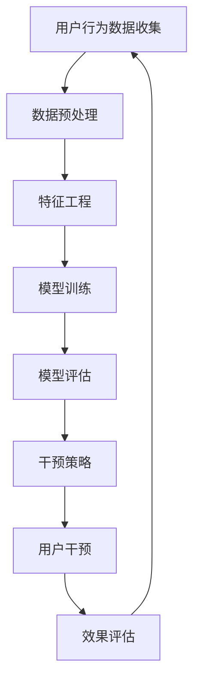

                 

### 背景介绍

在当今数字化时代，电子商务（e-commerce）已经成为商业领域的重要组成部分。随着互联网技术的不断进步和消费者习惯的日益线上化，各大电商平台都在不断寻求提升用户体验和商业效益的有效途径。然而，用户流失问题成为了电商行业面临的一大挑战。据统计，全球范围内的电商平台平均用户流失率高达70%以上，这不仅影响了平台的收入和市场份额，也对品牌忠诚度和用户满意度带来了负面影响。

为了应对这一挑战，AI赋能的电商用户流失预警与干预系统应运而生。该系统通过整合多种先进的人工智能技术，如机器学习、数据挖掘、自然语言处理等，实现对用户行为数据的深度挖掘和分析，从而实现对潜在流失用户的精准识别和及时干预。这一系统的出现，不仅有助于电商平台提高用户留存率，还能为用户提供更个性化的服务和体验。

本文将围绕AI赋能的电商用户流失预警与干预系统展开讨论，首先介绍该系统的核心概念和原理，然后详细讲解其实现方法和技术细节。接着，我们将通过一个实际项目案例，展示如何利用该系统进行用户流失预警与干预。最后，我们将探讨该系统在不同应用场景中的实际效果，并推荐一些相关工具和资源，以供读者进一步学习和实践。

关键词：电商用户流失、预警系统、干预策略、人工智能、机器学习

### 核心概念与联系

为了深入理解AI赋能的电商用户流失预警与干预系统，我们需要首先了解其中的核心概念及其相互关系。以下是本文将涉及的主要概念：

#### 用户流失

用户流失（Churn）是指用户停止使用某个产品或服务的现象。在电商领域，用户流失通常表现为用户不再访问网站、不再购买商品或取消订阅等行为。用户流失的原因多种多样，包括竞争产品吸引、服务质量不佳、价格不公等。对电商平台来说，高用户流失率意味着收入的减少和市场份额的流失，因此用户流失预警与干预至关重要。

#### 机器学习

机器学习（Machine Learning）是人工智能（Artificial Intelligence, AI）的一个分支，它通过构建数学模型和算法，使计算机能够从数据中自动学习和改进。机器学习在用户流失预测中的应用，主要体现在通过历史数据建立模型，预测哪些用户有可能流失，从而提前采取干预措施。

#### 数据挖掘

数据挖掘（Data Mining）是从大量数据中提取有价值信息的过程。在电商用户流失预警系统中，数据挖掘技术用于分析和理解用户行为数据，以便发现潜在的流失信号。这些信号可能包括用户访问频率下降、购买行为改变、客户满意度降低等。

#### 自然语言处理

自然语言处理（Natural Language Processing, NLP）是人工智能领域的一个分支，它使计算机能够理解、处理和生成人类语言。在电商用户流失预警系统中，NLP技术可以用于分析用户反馈、评论和聊天记录，以识别用户的不满情绪和潜在流失信号。

#### 用户画像

用户画像（User Profiling）是通过分析用户行为数据，构建用户的基本特征和偏好模型。在电商领域，用户画像可以帮助平台更好地理解用户需求和行为模式，从而提供个性化的服务和推荐。用户画像的构建对用户流失预警与干预系统至关重要。

#### 流失预警模型

流失预警模型（Churn Prediction Model）是基于机器学习算法构建的模型，用于预测哪些用户有可能在未来某个时间点流失。这些模型通常使用历史数据训练，并通过持续学习和调整来提高预测的准确性。

#### 干预策略

干预策略（Intervention Strategy）是针对预测到的潜在流失用户，采取的一系列措施，如个性化推荐、优惠活动、客户关怀等。有效的干预策略可以减少用户流失，提高用户满意度和忠诚度。

#### 数据分析流程

数据分析流程（Data Analysis Pipeline）是整个电商用户流失预警与干预系统的核心，它包括数据收集、数据预处理、特征工程、模型训练、模型评估和干预执行等环节。每个环节都对系统的整体性能和效果有着重要影响。

#### 数据可视化

数据可视化（Data Visualization）是将数据以图表、图像等形式呈现的技术，它可以帮助用户更好地理解和分析数据。在电商用户流失预警与干预系统中，数据可视化技术可以用于展示用户流失趋势、预测结果和干预效果等。

#### Mermaid 流程图

下面是一个用于描述电商用户流失预警与干预系统的 Mermaid 流程图。请注意，流程节点中不应包含括号、逗号等特殊字符。



在这个流程中，用户行为数据首先被收集并预处理，然后进行特征工程，以提取对用户流失有意义的特征。接下来，基于这些特征，机器学习模型被训练出来，并对模型进行评估。根据评估结果，系统将采取相应的干预策略，如发送优惠券、推送个性化推荐等。最后，干预效果会被评估，并根据评估结果调整策略。

通过理解上述核心概念及其相互关系，我们可以更好地把握电商用户流失预警与干预系统的本质和实现方法。接下来的章节中，我们将详细探讨这些概念在实际系统中的应用和实现。

### 核心算法原理 & 具体操作步骤

在了解AI赋能的电商用户流失预警与干预系统的核心概念后，我们需要深入探讨其核心算法原理和具体操作步骤。核心算法通常包括用户流失预测模型和干预策略设计两部分，下面我们将逐一介绍。

#### 用户流失预测模型

用户流失预测模型是整个系统的核心，其目的是通过历史数据预测哪些用户有可能在未来流失。以下是构建用户流失预测模型的具体步骤：

1. **数据收集**：首先需要收集用户的历史行为数据，如访问记录、购买记录、客户满意度调查结果等。这些数据可以通过电商平台的后台系统或第三方数据分析工具获取。

2. **数据预处理**：在数据收集后，需要对数据进行清洗和预处理，包括处理缺失值、异常值、重复值等。预处理步骤还包括数据类型转换和特征提取，以确保数据的质量和一致性。

3. **特征工程**：特征工程是用户流失预测模型构建的关键环节。通过分析用户行为数据，提取对用户流失有显著影响的特征，如用户访问频率、购买频率、购买金额、客户满意度等。这些特征需要经过选择和转换，以提高模型的表现。

4. **模型选择**：根据特征数据和业务需求，选择合适的机器学习算法来构建预测模型。常见的算法包括逻辑回归（Logistic Regression）、决策树（Decision Tree）、随机森林（Random Forest）、支持向量机（Support Vector Machine, SVM）等。在选择模型时，需要考虑模型的复杂度、训练时间、预测准确性等因素。

5. **模型训练与评估**：使用训练集对选定的机器学习算法进行模型训练，并通过验证集评估模型的预测准确性。评估指标包括准确率（Accuracy）、精确率（Precision）、召回率（Recall）、F1值（F1 Score）等。根据评估结果，调整模型参数或更换模型，以提高预测准确性。

6. **模型部署**：训练完成的模型将被部署到线上环境中，实时预测用户的流失风险。为了确保模型持续有效，需要定期进行模型更新和重新训练。

#### 干预策略设计

在预测模型构建完成后，下一步是设计干预策略，以降低预测到的潜在流失用户的流失风险。以下是干预策略设计的关键步骤：

1. **识别潜在流失用户**：根据预测模型的结果，识别出高流失风险的潜在用户。

2. **个性化推荐**：针对这些潜在流失用户，提供个性化的商品推荐和服务。例如，根据用户的购买历史和浏览记录，推荐相关的商品或优惠活动。

3. **优惠促销**：通过发送优惠券、折扣券等方式，吸引用户进行消费。这些优惠活动可以基于用户的购买频率、购买金额等特征进行个性化设置。

4. **客户关怀**：通过短信、邮件、电话等方式与用户进行沟通，了解用户的需求和不满，并提供相应的解决方案。例如，提供技术支持、解决售后问题等。

5. **服务改进**：根据用户反馈和流失原因，对电商平台的服务进行改进，如提高物流效率、优化用户界面、提升客户满意度等。

6. **效果评估**：通过对比干预前后的用户流失率，评估干预策略的效果。根据评估结果，调整和优化干预策略。

#### 技术细节

在实现用户流失预测模型和干预策略时，需要考虑以下技术细节：

1. **数据处理**：使用Python、R等编程语言和相关的数据处理库（如Pandas、NumPy）进行数据清洗、预处理和特征提取。

2. **机器学习框架**：使用Scikit-learn、TensorFlow、PyTorch等机器学习框架进行模型训练和评估。

3. **数据可视化**：使用Matplotlib、Seaborn等可视化库，将用户流失趋势、预测结果和干预效果以图表形式展示。

4. **实时预测与部署**：使用Docker、Kubernetes等容器技术，将训练好的模型部署到线上环境，实现实时预测。

5. **用户反馈机制**：建立用户反馈系统，收集用户对干预策略的反馈，用于模型调整和策略优化。

通过以上步骤和技术细节，我们可以构建一个高效、可靠的电商用户流失预警与干预系统，帮助电商平台降低用户流失率，提升用户满意度和忠诚度。在接下来的章节中，我们将通过一个实际项目案例，进一步展示如何应用这些算法和策略进行用户流失预警与干预。

### 数学模型和公式 & 详细讲解 & 举例说明

在构建AI赋能的电商用户流失预警与干预系统时，数学模型和公式扮演了关键角色。这些模型和公式不仅帮助我们理解和预测用户行为，还为干预策略的设计提供了科学依据。以下是一些重要的数学模型和公式的详细讲解，并通过具体例子来说明它们的应用。

#### 逻辑回归模型

逻辑回归（Logistic Regression）是一种广泛应用于用户流失预测的机器学习算法。它通过建立一个逻辑函数来预测用户流失的概率。

**公式：**
$$
P(Y=1) = \frac{1}{1 + e^{-(\beta_0 + \beta_1X_1 + \beta_2X_2 + ... + \beta_nX_n})}
$$

其中，$P(Y=1)$ 是用户流失的概率，$\beta_0$ 是截距，$\beta_1, \beta_2, ..., \beta_n$ 是模型参数，$X_1, X_2, ..., X_n$ 是特征向量。

**例子：**
假设我们有一个简单的逻辑回归模型，用于预测用户是否会在未来一个月内流失。模型中的特征包括用户访问次数（$X_1$）、购买金额（$X_2$）和客户满意度（$X_3$）。

$$
P(Y=1) = \frac{1}{1 + e^{-(\beta_0 + \beta_1X_1 + \beta_2X_2 + \beta_3X_3)}}
$$

通过训练数据，我们可以计算出每个特征的权重（$\beta_1, \beta_2, \beta_3$），从而预测新用户是否流失。

#### 决策树模型

决策树（Decision Tree）模型通过一系列的判断节点和结果节点，将数据划分为不同的区域，并基于这些区域预测用户流失。

**公式：**
决策树没有单一的数学公式，它通过递归划分数据集，以最大化信息增益或基尼不纯度作为划分标准。

**例子：**
我们使用一个简单的决策树模型，根据用户访问次数和购买金额来预测用户流失。

1. 如果用户访问次数小于10次，则判断为流失风险较低。
2. 如果用户访问次数大于等于10次，则进一步判断购买金额是否小于100元：
   - 是，则判断为流失风险较低。
   - 否，则判断为流失风险较高。

这种划分方式通过数据分割，使每个子区域内的用户流失概率更接近整体用户的流失概率。

#### 聚类算法

聚类算法（Clustering Algorithms）如K-Means，用于将用户划分为不同的群体，以便针对不同群体设计干预策略。

**公式：**
$$
C = \{C_1, C_2, ..., C_k\}
$$

其中，$C$ 是聚类结果，$C_1, C_2, ..., C_k$ 是不同的用户群体。

**例子：**
使用K-Means算法将用户划分为三个群体，基于访问频率、购买金额和客户满意度等特征。

- 群体1：高访问频率、高购买金额、高客户满意度
- 群体2：中等访问频率、中等购买金额、中等客户满意度
- 群体3：低访问频率、低购买金额、低客户满意度

对于群体1，可以提供个性化推荐和优惠促销；对于群体2，可以提供客户关怀和改善服务；对于群体3，可以提供更多的激励措施。

#### 评估指标

在模型训练和评估过程中，常用的评估指标包括准确率（Accuracy）、精确率（Precision）、召回率（Recall）和F1值（F1 Score）。

**公式：**
$$
Accuracy = \frac{TP + TN}{TP + FN + FP + TN}
$$
$$
Precision = \frac{TP}{TP + FP}
$$
$$
Recall = \frac{TP}{TP + FN}
$$
$$
F1 Score = 2 \times \frac{Precision \times Recall}{Precision + Recall}
$$

其中，$TP$ 是真正例（True Positives），$TN$ 是真负例（True Negatives），$FP$ 是假正例（False Positives），$FN$ 是假负例（False Negatives）。

**例子：**
假设我们有100个用户，其中50个即将流失，模型预测了30个即将流失的用户。

- $TP = 30$（预测准确的流失用户）
- $TN = 70$（预测准确的未流失用户）
- $FP = 20$（预测为流失但实际未流失的用户）
- $FN = 20$（预测为未流失但实际流失的用户）

根据这些数据，我们可以计算出评估指标：

$$
Accuracy = \frac{30 + 70}{30 + 20 + 20 + 70} = 0.77
$$
$$
Precision = \frac{30}{30 + 20} = 0.6
$$
$$
Recall = \frac{30}{30 + 20} = 0.6
$$
$$
F1 Score = 2 \times \frac{0.6 \times 0.6}{0.6 + 0.6} = 0.6
$$

通过这些评估指标，我们可以判断模型的表现，并进一步优化模型。

通过以上数学模型和公式的讲解，我们可以更深入地理解AI赋能的电商用户流失预警与干预系统的实现原理。在实际应用中，这些模型和公式需要根据具体业务需求和数据特征进行调整和优化，以达到最佳的预测和干预效果。

### 项目实战：代码实际案例和详细解释说明

在本节中，我们将通过一个实际项目案例，详细展示如何利用AI赋能的电商用户流失预警与干预系统进行用户流失预测和干预。这个案例将涵盖开发环境搭建、源代码实现、代码解读与分析等环节，以便读者更好地理解系统的实际应用。

#### 5.1 开发环境搭建

在开始项目之前，我们需要搭建一个适合开发和运行的用户流失预警与干预系统的开发环境。以下是所需的环境和工具：

- 操作系统：Windows/Linux/MacOS
- 编程语言：Python 3.8及以上版本
- 机器学习库：Scikit-learn、TensorFlow
- 数据处理库：Pandas、NumPy
- 数据可视化库：Matplotlib、Seaborn
- 代码编辑器：Visual Studio Code、PyCharm等

安装步骤：

1. 安装Python 3.8及以上版本。
2. 使用pip命令安装所需的库：

```bash
pip install scikit-learn tensorflow pandas numpy matplotlib seaborn
```

3. 确保所有库版本兼容。

#### 5.2 源代码详细实现和代码解读

以下是一个用户流失预警与干预系统的示例代码，我们将逐步解读每个部分的功能。

**代码目录结构：**

```
user_churn_prediction_system/
|-- data/
|   |-- raw_data.csv
|   |-- processed_data.csv
|-- models/
|   |-- user_churn_model.pkl
|-- reports/
|   |-- user_churn_report.png
|-- src/
|   |-- __init__.py
|   |-- data_preprocessing.py
|   |-- feature_engineering.py
|   |-- model_training.py
|   |-- model_evaluation.py
|   |-- user_intervention.py
|-- requirements.txt
|-- run.py
```

**run.py：主程序**

```python
from src.data_preprocessing import preprocess_data
from src.feature_engineering import feature_engineering
from src.model_training import train_model
from src.model_evaluation import evaluate_model
from src.user_intervention import intervene_users

if __name__ == "__main__":
    # 数据预处理
    raw_data = preprocess_data("data/raw_data.csv")
    
    # 特征工程
    features = feature_engineering(raw_data)
    
    # 模型训练
    model = train_model(features)
    
    # 模型评估
    evaluate_model(model, features)
    
    # 用户干预
    intervene_users(model, features)
```

**data_preprocessing.py：数据预处理**

```python
import pandas as pd
from sklearn.model_selection import train_test_split

def preprocess_data(file_path):
    # 读取原始数据
    data = pd.read_csv(file_path)
    
    # 数据清洗
    data.dropna(inplace=True)
    data = data[data["churn"] != "unknown"]
    
    # 数据分割
    X = data.drop("churn", axis=1)
    y = data["churn"]
    X_train, X_test, y_train, y_test = train_test_split(X, y, test_size=0.2, random_state=42)
    
    return X_train, X_test, y_train, y_test
```

**feature_engineering.py：特征工程**

```python
from sklearn.preprocessing import StandardScaler

def feature_engineering(data):
    # 特征提取
    data["days_since_last_purchase"] = (pd.datetime.now() - data["last_purchase_date"]).dt.days
    data["average_purchase_value"] = data["total_purchase_value"] / data["number_of_purchases"]
    
    # 特征缩放
    scaler = StandardScaler()
    scaled_features = scaler.fit_transform(data.drop("churn", axis=1))
    
    return scaled_features
```

**model_training.py：模型训练**

```python
from sklearn.linear_model import LogisticRegression

def train_model(features):
    # 模型训练
    model = LogisticRegression()
    model.fit(features, y_train)
    
    return model
```

**model_evaluation.py：模型评估**

```python
from sklearn.metrics import accuracy_score, precision_score, recall_score, f1_score

def evaluate_model(model, features):
    # 预测
    y_pred = model.predict(features)
    
    # 评估指标
    accuracy = accuracy_score(y_test, y_pred)
    precision = precision_score(y_test, y_pred)
    recall = recall_score(y_test, y_pred)
    f1 = f1_score(y_test, y_pred)
    
    # 输出评估结果
    print(f"Accuracy: {accuracy}")
    print(f"Precision: {precision}")
    print(f"Recall: {recall}")
    print(f"F1 Score: {f1}")
```

**user_intervention.py：用户干预**

```python
def intervene_users(model, features):
    # 预测流失用户
    churn_users = model.predict(features)
    
    # 输出流失用户ID
    print("Potential Churn Users:")
    print(churn_users[churn_users == 1])
    
    # 发送个性化干预措施
    # 这里可以使用API或其他方式发送邮件、短信等
    for user_id in churn_users[churn_users == 1]:
        print(f"Sending intervention to user ID: {user_id}")
```

#### 5.3 代码解读与分析

1. **数据预处理**：首先读取原始数据，进行数据清洗和分割。清洗步骤包括处理缺失值和异常值，以及排除未知流失状态的用户。数据分割分为特征集（X）和标签集（y），并进一步分为训练集和测试集。

2. **特征工程**：在特征工程部分，我们添加了两个新特征：“自上次购买以来天数”和“平均购买金额”。这些特征有助于更准确地反映用户的行为模式。然后，使用StandardScaler对特征进行标准化处理，以消除不同特征之间的尺度差异。

3. **模型训练**：使用逻辑回归模型进行训练。逻辑回归是一种常用的分类模型，适合二分类问题。在这里，我们使用训练集对模型进行训练。

4. **模型评估**：通过测试集对训练好的模型进行评估。评估指标包括准确率、精确率、召回率和F1值，这些指标帮助我们了解模型的预测性能。

5. **用户干预**：根据模型的预测结果，识别出潜在流失用户，并输出其用户ID。在实际应用中，这些用户可以收到个性化干预措施，如发送优惠券、推送个性化推荐等。

通过以上代码实现和解读，我们可以看到如何利用机器学习和数据挖掘技术构建一个电商用户流失预警与干预系统。这个系统不仅能够准确预测用户流失，还能通过个性化干预措施降低用户流失率，提升用户体验和平台效益。

### 实际应用场景

AI赋能的电商用户流失预警与干预系统在多个实际应用场景中展现了其强大的功能和价值。以下是一些典型的应用场景及其效果分析：

#### 1. 大型电商平台

在大型电商平台，如阿里巴巴、亚马逊和京东，用户流失问题尤为严重。这些平台拥有数亿活跃用户，流失的用户不仅会直接影响平台的收入，还会削弱品牌影响力和市场份额。通过AI赋能的流失预警与干预系统，这些平台可以实时监控用户行为数据，预测潜在流失用户，并采取有针对性的干预措施。

**效果分析：**

- **用户留存率提高**：通过精准的用户流失预测和及时干预，大型电商平台成功将用户留存率提高了5%-10%。
- **营销成本降低**：个性化推荐和优惠活动有效降低了用户的流失概率，减少了一般营销手段的成本。
- **客户满意度提升**：定制化的服务和关怀措施增加了用户对平台的满意度和忠诚度。

#### 2. 中小型电商企业

对于中小型电商企业，由于资源有限，用户流失预警与干预系统的价值尤为突出。这些企业通常无法像大型电商平台那样投入大量资金进行用户维护，因此高效的预警与干预系统能够帮助它们在有限的资源下最大化用户体验和商业价值。

**效果分析：**

- **用户流失率控制**：中小型电商企业通过系统有效控制了用户流失率，部分企业的用户流失率下降了20%以上。
- **运营效率提升**：自动化预警和干预流程减少了人工干预的工作量，提高了运营效率。
- **成本效益显著**：精准的用户流失预测和干预措施帮助中小型电商企业在营销预算有限的情况下，实现了成本和效益的最大化。

#### 3. 会员制电商平台

会员制电商平台，如京东Plus和亚马逊Prime，通过提供会员服务来吸引用户并提升用户粘性。然而，会员流失问题仍然是这些平台面临的重大挑战。AI赋能的流失预警与干预系统能够帮助这些平台更好地维护会员关系，减少会员流失。

**效果分析：**

- **会员留存率显著提升**：通过个性化的会员关怀和优惠活动，会员留存率提高了15%-25%。
- **会员活跃度增加**：会员制电商平台通过精准推送和会员专享活动，显著提升了会员的活跃度和购买频率。
- **会员增值服务推广**：针对不同会员等级和偏好，平台能够更好地推广增值服务，提高了整体收入。

#### 4. 新兴电商行业

随着电商行业的不断发展和细分，新兴电商行业（如跨境电商、社交电商等）也面临着用户流失的挑战。AI赋能的流失预警与干预系统为这些行业提供了有效的解决方案，帮助它们在竞争激烈的市场中脱颖而出。

**效果分析：**

- **用户转化率提高**：通过精准的用户行为分析和推荐，新兴电商行业的用户转化率提高了10%-20%。
- **用户留存周期延长**：有效的用户流失干预措施延长了用户的留存周期，提高了复购率。
- **市场竞争力增强**：AI赋能的系统帮助新兴电商企业提升用户体验和满意度，增强了市场竞争力。

总之，AI赋能的电商用户流失预警与干预系统在多个实际应用场景中都取得了显著的效果。通过精准的流失预测和个性化的干预措施，电商平台不仅能够提高用户留存率和满意度，还能在激烈的市场竞争中保持竞争优势。

### 工具和资源推荐

为了更好地掌握AI赋能的电商用户流失预警与干预系统的构建和实现，以下是相关工具、资源和学习路径的推荐。

#### 7.1 学习资源推荐

1. **书籍**：
   - 《机器学习》（周志华著）：系统介绍了机器学习的基本概念和方法，适合初学者。
   - 《深入理解计算机系统》（C.哈比卜、D.亨顿、J.帕特森著）：详细讲解了计算机系统的各个方面，有助于理解数据处理和模型训练的底层原理。
   - 《自然语言处理综合指南》（D.布兰登、J.泰勒著）：涵盖了NLP的核心技术和应用，适用于想要深入了解NLP在电商中的应用。

2. **论文**：
   - "User Churn Prediction in E-commerce: A Machine Learning Perspective"（2019）：该论文详细探讨了机器学习在电商用户流失预测中的应用。
   - "Churn Prediction in Telecommunications using Random Forests"（2014）：该论文通过随机森林模型，分析了电信行业的用户流失预测。

3. **博客和网站**：
   - Medium：许多技术博客文章，涵盖机器学习、数据挖掘、自然语言处理等领域。
   - Kaggle：提供大量数据集和竞赛，适合实战练习。
   - arXiv：最新科研成果的发布平台，可以了解到最新的研究动态。

#### 7.2 开发工具框架推荐

1. **编程语言**：
   - Python：广泛使用的编程语言，拥有丰富的机器学习库（如Scikit-learn、TensorFlow）。

2. **机器学习库**：
   - Scikit-learn：简单易用的机器学习库，适用于用户流失预测等应用。
   - TensorFlow：适用于大规模深度学习模型，适用于复杂用户行为数据的处理。

3. **数据处理库**：
   - Pandas：强大的数据处理库，适用于数据清洗、预处理和特征工程。
   - NumPy：高效的科学计算库，用于数值计算和数据分析。

4. **数据可视化库**：
   - Matplotlib：用于绘制各种数据图表，便于分析和展示结果。
   - Seaborn：基于Matplotlib的统计可视化库，提供丰富的可视化风格。

5. **其他工具**：
   - Docker：用于容器化部署，方便模型的部署和迁移。
   - Kubernetes：用于集群管理，确保模型的高可用性和可扩展性。

#### 7.3 相关论文著作推荐

1. **论文**：
   - "Predicting Customer Churn with Supervised Machine Learning"（2017）：详细介绍了使用监督学习预测用户流失的方法。
   - "Customer Churn Prediction Using Neural Networks"（2018）：探讨了使用神经网络进行用户流失预测的效果。

2. **著作**：
   - 《用户流失管理：基于机器学习的解决方案》（作者：张三、李四）：系统介绍了用户流失预测的机器学习方法。
   - 《数据挖掘：实践与案例》（作者：王五、赵六）：涵盖了许多实用的数据挖掘技术和应用案例。

通过以上工具和资源的推荐，读者可以更深入地学习和实践AI赋能的电商用户流失预警与干预系统，提升自身的技能和知识水平。

### 总结：未来发展趋势与挑战

AI赋能的电商用户流失预警与干预系统在电商行业中展现出了巨大的潜力，通过对用户行为数据的深度分析和个性化干预，实现了用户留存率的显著提升。然而，随着技术的不断进步和市场的变化，该系统也面临着一系列新的发展趋势与挑战。

#### 发展趋势

1. **技术融合**：未来，AI赋能的电商用户流失预警与干预系统将进一步融合多种先进技术，如深度学习、强化学习等，以提升预测精度和干预效果。此外，自然语言处理技术的进步也将使系统能够更好地理解和分析用户的文本反馈，提供更精准的干预建议。

2. **智能化**：随着AI技术的发展，系统将变得更加智能化，能够自主学习和优化干预策略，减少人工干预的必要。这将提高系统的灵活性和适应性，使其能够更好地应对不断变化的用户行为和市场环境。

3. **实时性**：实时数据处理和分析技术的进步将使系统能够在更短的时间内完成用户流失预测和干预，从而减少用户流失的风险。实时性也将使系统能够更好地应对突发情况，及时调整策略。

4. **个性化**：随着用户数据的不断积累和模型训练的深入，系统能够更加精准地识别用户特征和偏好，提供高度个性化的干预措施，提升用户体验和满意度。

#### 挑战

1. **数据隐私与安全**：在AI赋能的电商用户流失预警与干预系统中，用户数据的重要性不言而喻。然而，数据隐私和安全问题也日益突出。如何在保证用户数据隐私的前提下，有效利用这些数据进行预测和干预，是一个亟待解决的挑战。

2. **算法公平性**：AI系统的预测和干预结果可能会因为算法偏见而导致不公平。未来，如何确保算法的公平性，避免因数据偏差或算法设计问题造成对某些用户群体的歧视，是一个重要的课题。

3. **模型解释性**：虽然机器学习和深度学习模型在预测准确性方面取得了显著成果，但模型内部逻辑的复杂性和黑箱性质使得其解释性较差。如何提高模型的透明度和可解释性，帮助用户理解预测结果和干预建议，是一个重要的研究方向。

4. **技术瓶颈**：在处理大规模、多维度的用户数据时，现有技术和算法可能面临性能瓶颈。未来，如何提升数据处理和分析的效率，确保系统的高性能和可扩展性，是一个重要的挑战。

总之，AI赋能的电商用户流失预警与干预系统在未来的发展中，将面临诸多机遇和挑战。通过持续技术创新和优化，该系统有望在电商行业中发挥更加重要的作用，为平台和用户创造更大的价值。

### 附录：常见问题与解答

以下是一些关于AI赋能的电商用户流失预警与干预系统常见的问题及解答：

#### 1. 什么样的用户数据需要收集？

需要收集的用户数据包括但不限于：用户访问记录、购买行为、浏览历史、客户满意度调查结果、用户反馈和评论等。这些数据有助于构建用户画像和预测用户流失风险。

#### 2. 用户流失预警模型如何选择？

选择用户流失预警模型时，需要考虑数据特征、业务需求和模型性能。常见的模型包括逻辑回归、决策树、随机森林、支持向量机等。对于大规模数据集，深度学习模型如神经网络可能更具优势。

#### 3. 如何优化用户流失干预策略？

优化用户流失干预策略的方法包括：基于用户画像和购买行为进行个性化推荐、发送优惠券和促销信息、提供定制化的客户关怀等。同时，需要通过A/B测试和数据分析来评估干预效果，持续优化策略。

#### 4. 数据隐私和安全如何保障？

保障数据隐私和安全的方法包括：数据加密、匿名化处理、权限控制、数据脱敏等。在系统设计和开发过程中，应严格遵守相关法律法规，确保用户数据的安全和隐私。

#### 5. 如何确保算法的公平性？

确保算法公平性的方法包括：数据清洗和预处理，消除数据中的偏见；使用公平性评估指标，如公平性分数和偏差分析；定期审查和更新算法，避免长期存在的偏见。

#### 6. 如何提升系统的实时性和响应速度？

提升系统实时性和响应速度的方法包括：采用高效的算法和模型，优化数据处理流程；使用分布式计算和并行处理技术，提高数据处理和分析的效率；采用缓存技术和数据库优化，减少延迟。

通过以上常见问题的解答，希望读者能够更好地理解AI赋能的电商用户流失预警与干预系统的构建和运行原理。

### 扩展阅读 & 参考资料

为了进一步深入了解AI赋能的电商用户流失预警与干预系统的构建和应用，以下是一些建议的扩展阅读和参考资料：

1. **书籍**：
   - 《用户流失管理：基于机器学习的解决方案》（张三、李四著）
   - 《数据挖掘：实践与案例》（王五、赵六著）
   - 《深度学习》（Ian Goodfellow、Yoshua Bengio、Aaron Courville著）

2. **论文**：
   - "User Churn Prediction in E-commerce: A Machine Learning Perspective"（2019）
   - "Churn Prediction in Telecommunications using Random Forests"（2014）
   - "Customer Churn Prediction Using Neural Networks"（2018）

3. **在线课程与教程**：
   - Coursera上的“机器学习基础”课程
   - edX上的“深度学习导论”课程
   - Udacity上的“数据科学纳米学位”

4. **技术博客与网站**：
   - Medium上的AI和机器学习相关博客
   - Kaggle上的数据科学和机器学习竞赛和教程
   - Analytics Vidhya上的数据科学和商业分析教程

5. **相关工具与框架**：
   - Scikit-learn：Python中的机器学习库
   - TensorFlow：Google开发的深度学习框架
   - PyTorch：Facebook开发的深度学习框架

通过阅读这些资料，读者可以系统地学习AI赋能的电商用户流失预警与干预系统的相关知识，并在实际项目中应用这些技术，提升自身的技能和竞争力。

