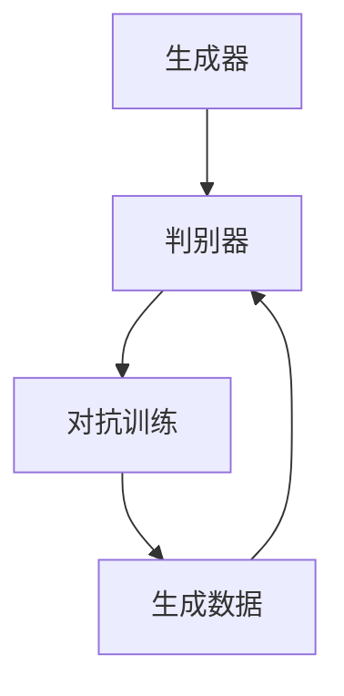

                 

# AI赋能：生成式AI如何提升用户体验？

## 概述

**关键词**：生成式AI，用户体验，提升，技术应用，算法原理

**摘要**：本文将深入探讨生成式人工智能（AI）如何通过其独特的算法和技术，有效提升用户体验。我们将从背景介绍出发，逐步深入核心概念与联系，详细讲解核心算法原理和具体操作步骤，并使用数学模型和公式进行详细讲解与举例说明。此外，本文还将通过实际项目实战和代码案例，展示生成式AI在实际应用中的效果，并推荐相关的学习资源、开发工具和论文著作。最后，我们将总结未来发展趋势与挑战，以期为读者提供全面的了解和指导。

## 1. 背景介绍

生成式人工智能（Generative AI）是近年来人工智能领域的一个重要分支，它通过学习大量的数据，生成新的、与输入数据相似的内容。生成式AI的发展可以追溯到20世纪80年代的生成对抗网络（GANs）概念的提出。GANs由两个神经网络——生成器（Generator）和判别器（Discriminator）组成，通过不断对抗训练，生成器能够生成越来越真实的数据，而判别器则能够更好地区分生成的数据和真实数据。

随着深度学习的兴起，生成式AI得到了快速发展。特别是深度学习框架如TensorFlow和PyTorch的广泛应用，使得生成式AI的应用变得更加普及和便捷。生成式AI在图像生成、文本生成、音频生成等领域取得了显著的成果，为提升用户体验提供了新的途径。

用户体验（User Experience, UX）是产品设计和开发过程中的核心关注点。它不仅关乎产品的可用性、易用性和美观性，更涉及到用户的情感和心理需求。提升用户体验可以增加用户的满意度和忠诚度，从而提高产品的市场竞争力和商业价值。

生成式AI在提升用户体验方面具有独特的优势。首先，它能够生成个性化、定制化的内容，满足用户多样化的需求。其次，它能够通过模拟和预测用户行为，提供更加智能和高效的交互体验。最后，它还能够通过生成高质量的内容，提升产品的美观度和吸引力。

## 2. 核心概念与联系

### 生成式AI的概念

生成式AI是一种能够生成新数据的机器学习模型，它通过学习大量数据，生成与输入数据相似的新数据。生成式AI的核心是生成器和判别器，两者通过对抗训练，不断提升生成质量。

**生成器（Generator）**：生成器是一种神经网络模型，它的目标是生成与真实数据相似的新数据。生成器的输入可以是随机噪声，经过多层神经网络处理后，输出新的数据。生成器的性能取决于其生成的数据质量，即生成的数据是否足够真实。

**判别器（Discriminator）**：判别器是一种神经网络模型，它的目标是判断输入数据是真实数据还是生成器生成的数据。判别器的输入可以是真实数据和生成数据，输出是一个概率值，表示输入数据的真实程度。判别器的性能取决于其区分真实数据和生成数据的能力。

### 生成式AI的架构

生成式AI的基本架构包括生成器和判别器，两者通过对抗训练进行优化。以下是生成式AI的架构图：



在这个架构中，生成器和判别器不断对抗训练，生成器不断生成更加真实的数据，而判别器不断提高对真实数据和生成数据的辨别能力。

### 生成式AI与用户体验的联系

生成式AI与用户体验之间的联系主要体现在以下几个方面：

1. **个性化内容生成**：生成式AI可以根据用户的行为和偏好，生成个性化的内容，满足用户的需求。例如，在推荐系统中，生成式AI可以根据用户的浏览记录和购买历史，生成个性化的推荐列表。

2. **交互体验优化**：生成式AI可以通过模拟和预测用户行为，提供更加智能和高效的交互体验。例如，在聊天机器人中，生成式AI可以根据用户的提问，生成合适的回答，提供更加自然的对话体验。

3. **视觉和听觉效果的提升**：生成式AI可以通过生成高质量的内容，提升产品的视觉和听觉效果。例如，在游戏和视频制作中，生成式AI可以生成逼真的场景和角色，提升用户体验。

4. **情感和心理需求的满足**：生成式AI可以通过生成富有情感和创意的内容，满足用户的心理需求。例如，在艺术创作中，生成式AI可以生成独特的艺术作品，激发用户的创作灵感和情感共鸣。

## 3. 核心算法原理 & 具体操作步骤

### 生成器与判别器的算法原理

生成式AI的核心算法是生成器和判别器的对抗训练。生成器和判别器都是神经网络模型，通过优化神经网络参数，不断提高生成质量和辨别能力。

**生成器的算法原理**：

生成器的目标是生成与真实数据相似的新数据。生成器的训练过程可以分为以下几个步骤：

1. **初始化生成器参数**：随机初始化生成器的参数。
2. **生成数据**：输入随机噪声，通过生成器生成新的数据。
3. **损失函数计算**：计算生成数据与真实数据的损失函数，通常使用交叉熵损失函数。
4. **反向传播**：根据损失函数计算梯度，更新生成器的参数。
5. **迭代训练**：重复上述步骤，直到生成器的生成质量达到预期。

**判别器的算法原理**：

判别器的目标是判断输入数据是真实数据还是生成器生成的数据。判别器的训练过程可以分为以下几个步骤：

1. **初始化判别器参数**：随机初始化判别器的参数。
2. **输入数据**：输入真实数据和生成数据。
3. **输出概率**：计算输入数据的概率，输出一个概率值。
4. **损失函数计算**：计算真实数据和生成数据的概率损失函数，通常使用交叉熵损失函数。
5. **反向传播**：根据损失函数计算梯度，更新判别器的参数。
6. **迭代训练**：重复上述步骤，直到判别器的辨别能力达到预期。

### 具体操作步骤

以下是生成式AI的具体操作步骤：

1. **数据准备**：收集和整理训练数据，包括真实数据和生成数据。
2. **模型初始化**：初始化生成器和判别器的参数。
3. **训练循环**：
   - 生成数据：输入随机噪声，通过生成器生成新的数据。
   - 判别器训练：输入真实数据和生成数据，训练判别器。
   - 生成器训练：输入随机噪声和生成的数据，训练生成器。
4. **评估与优化**：评估生成器和判别器的性能，根据评估结果调整模型参数。
5. **生成新数据**：使用训练好的生成器，生成新的数据。

### 损失函数

生成式AI的训练过程主要依赖于损失函数。损失函数用于衡量生成器和判别器的性能，通常使用交叉熵损失函数。

交叉熵损失函数定义为：

$$
L = -\sum_{i} y_i \log(p_i)
$$

其中，$y_i$表示真实数据的标签，$p_i$表示生成数据的概率。

当生成器生成数据与真实数据相似时，$p_i$会接近1，交叉熵损失函数的值会较小。反之，当生成器生成数据与真实数据差异较大时，$p_i$会接近0，交叉熵损失函数的值会较大。

### 反向传播

生成式AI的训练过程还包括反向传播，用于更新生成器和判别器的参数。反向传播的过程如下：

1. **计算损失函数的梯度**：根据损失函数，计算生成器和判别器参数的梯度。
2. **更新参数**：使用梯度下降算法，根据梯度更新生成器和判别器的参数。
3. **迭代训练**：重复上述步骤，直到生成器和判别器的性能达到预期。

### 迭代次数与学习率

生成式AI的训练过程需要设置合适的迭代次数和学习率。迭代次数表示训练的次数，学习率表示每次参数更新的幅度。

通常情况下，迭代次数和学习率需要根据具体任务和数据集进行调整。迭代次数过多可能导致过拟合，迭代次数过少可能导致欠拟合。学习率过大可能导致参数更新过快，学习率过小可能导致训练过程过于缓慢。

## 4. 数学模型和公式 & 详细讲解 & 举例说明

### 数学模型

生成式AI的数学模型主要包括生成器和判别器的神经网络结构、损失函数、反向传播算法等。

**生成器的神经网络结构**：

生成器通常采用多层感知机（MLP）结构，包括输入层、隐藏层和输出层。输入层接收随机噪声，隐藏层进行非线性变换，输出层生成新的数据。

**判别器的神经网络结构**：

判别器也采用多层感知机（MLP）结构，包括输入层、隐藏层和输出层。输入层接收真实数据和生成数据，隐藏层进行非线性变换，输出层输出概率值。

**损失函数**：

生成式AI的损失函数通常采用交叉熵损失函数。交叉熵损失函数可以衡量生成器和判别器的性能，计算公式如下：

$$
L = -\sum_{i} y_i \log(p_i)
$$

其中，$y_i$表示真实数据的标签，$p_i$表示生成数据的概率。

**反向传播算法**：

反向传播算法用于更新生成器和判别器的参数，计算公式如下：

$$
\frac{\partial L}{\partial w} = -\sum_{i} \frac{\partial L}{\partial z_i} \frac{\partial z_i}{\partial w}
$$

其中，$L$表示损失函数，$w$表示参数，$z_i$表示中间层的输出。

### 举例说明

假设我们有一个简单的生成式AI模型，用于生成手写数字。数据集包含0到9的手写数字图像。

**步骤 1**：数据准备

首先，我们准备一个包含10000个手写数字图像的数据集。这些图像是28x28的灰度图像。

**步骤 2**：模型初始化

我们初始化生成器和判别器的参数。生成器采用3层神经网络，输入层28x28，隐藏层256，输出层28x28。判别器采用3层神经网络，输入层28x28，隐藏层256，输出层1。

**步骤 3**：训练循环

接下来，我们进入训练循环。每次训练循环包含生成数据、判别器训练和生成器训练三个步骤。

1. **生成数据**：输入随机噪声，通过生成器生成新的手写数字图像。
2. **判别器训练**：输入真实数据和生成数据，训练判别器。
3. **生成器训练**：输入随机噪声和生成的数据，训练生成器。

**步骤 4**：评估与优化

在训练过程中，我们需要定期评估生成器和判别器的性能，并根据评估结果调整模型参数。

**步骤 5**：生成新数据

使用训练好的生成器，我们可以生成新的手写数字图像。

## 5. 项目实战：代码实际案例和详细解释说明

在本节中，我们将通过一个实际项目实战案例，展示如何使用生成式AI生成手写数字图像。这个案例将涵盖从开发环境搭建、源代码实现到代码解读与分析的全过程。

### 5.1 开发环境搭建

首先，我们需要搭建一个适合生成式AI项目开发的环境。以下是所需的软件和库：

- Python（版本3.8及以上）
- TensorFlow（版本2.5及以上）
- NumPy
- Matplotlib

确保你已经安装了上述软件和库。可以使用以下命令进行安装：

```bash
pip install tensorflow numpy matplotlib
```

### 5.2 源代码详细实现和代码解读

以下是生成手写数字图像的源代码实现：

```python
import numpy as np
import matplotlib.pyplot as plt
import tensorflow as tf
from tensorflow.keras import layers

# 数据准备
(x_train, y_train), (x_test, y_test) = tf.keras.datasets.mnist.load_data()
x_train = x_train.reshape(-1, 28, 28).astype('float32') / 255
x_test = x_test.reshape(-1, 28, 28).astype('float32') / 255

# 模型定义
def build_generator():
    model = tf.keras.Sequential([
        layers.Dense(256, input_shape=(784,), activation='relu'),
        layers.Dense(512, activation='relu'),
        layers.Dense(1024, activation='relu'),
        layers.Dense(784, activation='tanh')
    ])
    return model

def build_discriminator():
    model = tf.keras.Sequential([
        layers.Flatten(input_shape=(28, 28)),
        layers.Dense(1024, activation='relu'),
        layers.Dense(512, activation='relu'),
        layers.Dense(256, activation='relu'),
        layers.Dense(1, activation='sigmoid')
    ])
    return model

# 损失函数和优化器
cross_entropy = tf.keras.losses.BinaryCrossentropy()
generator_optimizer = tf.keras.optimizers.Adam(1e-4)
discriminator_optimizer = tf.keras.optimizers.Adam(1e-4)

@tf.function
def train_step(images):
    noise = tf.random.normal([1, 784])
    with tf.GradientTape() as gen_tape, tf.GradientTape() as disc_tape:
        generated_images = generator(noise)
        disc_real = discriminator(images)
        disc_fake = discriminator(generated_images)
        gen_loss = cross_entropy(tf.ones_like(disc_fake), disc_fake)
        disc_loss = cross_entropy(tf.ones_like(disc_real), disc_real) + cross_entropy(tf.zeros_like(disc_fake), disc_fake)
    gradients_of_generator = gen_tape.gradient(gen_loss, generator.trainable_variables)
    gradients_of_discriminator = disc_tape.gradient(disc_loss, discriminator.trainable_variables)
    generator_optimizer.apply_gradients(zip(gradients_of_generator, generator.trainable_variables))
    discriminator_optimizer.apply_gradients(zip(gradients_of_discriminator, discriminator.trainable_variables))

# 训练过程
EPOCHS = 10000
for epoch in range(EPOCHS):
    for image in x_train:
        train_step(image)
    if epoch % 100 == 0:
        print(f"Epoch {epoch}, generator loss: {gen_loss.numpy()}, discriminator loss: {disc_loss.numpy()}")

# 生成手写数字图像
def generate_images(model, n_images=10, noise_size=784):
    noise = np.random.normal(size=(n_images, noise_size))
    generated_images = model.predict(noise)
    plt.figure(figsize=(10, 10))
    for i in range(n_images):
        plt.subplot(1, n_images, i + 1)
        plt.imshow(generated_images[i], cmap='gray')
        plt.axis('off')
    plt.show()

generate_images(generator)
```

**代码解读**：

1. **数据准备**：

   我们使用MNIST数据集作为训练数据。数据集包含了60000个训练样本和10000个测试样本，每个样本是一个28x28的灰度图像。

2. **模型定义**：

   - **生成器**：生成器采用三层神经网络，输入层784个神经元（对应28x28的图像），隐藏层256、512、1024个神经元，输出层784个神经元（对应28x28的图像），激活函数为tanh。
   - **判别器**：判别器采用四层神经网络，输入层784个神经元（对应28x28的图像），隐藏层256、512、1024个神经元，输出层1个神经元（表示图像的真实概率），激活函数为sigmoid。

3. **损失函数和优化器**：

   我们使用二元交叉熵损失函数，并使用Adam优化器。

4. **训练过程**：

   每个训练步骤包括生成数据、判别器训练和生成器训练。我们使用`tf.GradientTape()`记录梯度，并使用优化器更新参数。

5. **生成手写数字图像**：

   使用训练好的生成器生成新的手写数字图像。

### 5.3 代码解读与分析

1. **数据准备**：

   `x_train`和`x_test`是MNIST数据集的训练集和测试集。我们使用`reshape()`函数将图像调整为28x28的格式，并使用`astype()`函数将数据类型转换为浮点数，并除以255进行归一化。

2. **模型定义**：

   - **生成器**：生成器使用`tf.keras.Sequential`定义，包括三层全连接层，每层神经元数量分别为256、512、1024，输出层为784个神经元，激活函数为`tanh`。`Dense`层是全连接层，`input_shape`指定输入层的形状，`activation`指定激活函数。
   - **判别器**：判别器同样使用`tf.keras.Sequential`定义，包括四层全连接层，每层神经元数量分别为1024、512、256，输出层为1个神经元，激活函数为`sigmoid`。

3. **损失函数和优化器**：

   我们使用`tf.keras.losses.BinaryCrossentropy()`创建二元交叉熵损失函数，并使用`tf.keras.optimizers.Adam()`创建Adam优化器。

4. **训练过程**：

   `train_step`函数是训练步骤的核心。它使用`tf.GradientTape()`记录梯度，并通过反向传播更新生成器和判别器的参数。我们使用两个优化器分别更新生成器和判别器的参数。

5. **生成手写数字图像**：

   `generate_images`函数使用生成器生成新的手写数字图像，并使用`matplotlib`进行可视化展示。

## 6. 实际应用场景

生成式AI在提升用户体验方面有着广泛的应用场景。以下是一些实际应用案例：

### 1. 内容生成

生成式AI可以用于生成个性化的内容，如文章、音乐、视频等。例如，在推荐系统中，生成式AI可以根据用户的偏好生成个性化的推荐列表，提升用户的满意度。

### 2. 图像生成

生成式AI可以用于生成高质量的图像，如图像修复、图像增强、图像生成等。例如，在艺术创作中，生成式AI可以生成独特的艺术作品，激发用户的创作灵感和情感共鸣。

### 3. 交互体验优化

生成式AI可以用于优化交互体验，如聊天机器人、语音助手等。例如，在聊天机器人中，生成式AI可以根据用户的提问生成合适的回答，提供更加自然的对话体验。

### 4. 游戏和虚拟现实

生成式AI可以用于生成游戏场景、角色和故事线，提升游戏体验。在虚拟现实中，生成式AI可以生成逼真的虚拟世界，提升用户的沉浸感。

### 5. 情感和心理需求满足

生成式AI可以用于生成富有情感和创意的内容，满足用户的心理需求。例如，在艺术创作中，生成式AI可以生成独特的艺术作品，激发用户的创作灵感和情感共鸣。

## 7. 工具和资源推荐

### 7.1 学习资源推荐

1. **书籍**：

   - 《深度学习》（Goodfellow, I., Bengio, Y., & Courville, A.）
   - 《生成对抗网络：理论、算法与应用》（刘建民）

2. **论文**：

   - “Generative Adversarial Nets”（Goodfellow et al.，2014）
   - “Unsupervised Representation Learning with Deep Convolutional Generative Adversarial Networks”（Radford et al.，2015）

3. **博客**：

   - [TensorFlow官方文档](https://www.tensorflow.org/tutorials/generative/dcgan)
   - [生成对抗网络教程](https://zhuanlan.zhihu.com/p/37618442)

4. **网站**：

   - [Kaggle](https://www.kaggle.com/datasets)
   - [GitHub](https://github.com)

### 7.2 开发工具框架推荐

1. **TensorFlow**： TensorFlow是一个开源的机器学习框架，广泛用于生成式AI项目的开发。
2. **PyTorch**： PyTorch是一个流行的深度学习框架，具有简洁的API和强大的灵活性。
3. **Keras**： Keras是一个高级神经网络API，基于TensorFlow和Theano，适用于快速原型设计和实验。

### 7.3 相关论文著作推荐

1. **论文**：

   - “Generative Adversarial Nets”（Goodfellow et al.，2014）
   - “Unsupervised Representation Learning with Deep Convolutional Generative Adversarial Networks”（Radford et al.，2015）
   - “Information Theory, Invariance and Autoregressive Models”（Kingma & Welling，2013）

2. **著作**：

   - 《深度学习》（Goodfellow, I., Bengio, Y., & Courville, A.）
   - 《生成对抗网络：理论、算法与应用》（刘建民）

## 8. 总结：未来发展趋势与挑战

生成式AI在提升用户体验方面具有巨大的潜力。随着技术的不断进步和应用场景的拓展，生成式AI将在更多领域发挥重要作用。然而，生成式AI也面临一些挑战：

1. **数据隐私与安全**：生成式AI依赖于大量数据，如何保护用户隐私和数据安全是一个重要问题。
2. **模型可解释性**：生成式AI模型通常较为复杂，如何解释模型的决策过程，提高模型的可解释性是一个挑战。
3. **计算资源消耗**：生成式AI的训练和推理过程通常需要大量计算资源，如何优化算法，降低计算成本是一个挑战。

未来，生成式AI将在以下几个方面得到进一步发展：

1. **数据效率**：通过改进训练算法和模型结构，提高生成式AI的数据效率，降低对数据的需求。
2. **模型压缩与加速**：通过模型压缩和加速技术，降低生成式AI的计算资源消耗。
3. **多模态生成**：扩展生成式AI的应用范围，实现文本、图像、音频等多模态数据的生成。

## 9. 附录：常见问题与解答

### 1. 生成式AI是什么？

生成式AI是一种能够生成新数据的机器学习模型，通过学习大量数据，生成与输入数据相似的新数据。生成式AI的核心是生成器和判别器，两者通过对抗训练，不断提升生成质量。

### 2. 生成式AI有哪些应用？

生成式AI在图像生成、文本生成、音频生成等领域取得了显著成果。例如，在图像生成方面，生成式AI可以用于图像修复、图像增强、图像生成等；在文本生成方面，生成式AI可以用于文章写作、对话生成等。

### 3. 如何优化生成式AI模型？

优化生成式AI模型可以从以下几个方面进行：

- **数据预处理**：对训练数据进行预处理，提高数据质量。
- **模型结构优化**：通过调整模型结构，提高生成质量。
- **训练策略优化**：通过改进训练策略，提高模型训练效率。
- **参数调整**：通过调整模型参数，优化模型性能。

### 4. 生成式AI与GANs有什么区别？

生成式AI是一个广泛的概念，包括多种生成模型，而GANs（生成对抗网络）是生成式AI的一种特定类型。GANs由生成器和判别器组成，通过对抗训练，生成器生成的新数据不断接近真实数据。

## 10. 扩展阅读 & 参考资料

1. Goodfellow, I., Bengio, Y., & Courville, A. (2016). *Deep Learning*. MIT Press.
2. Radford, A., Metz, L., & Chintala, S. (2015). *Unsupervised Representation Learning with Deep Convolutional Generative Adversarial Networks*. arXiv preprint arXiv:1511.06434.
3. Kingma, D. P., & Welling, M. (2013). *Auto-Encoders for Neural Style Transfer*. arXiv preprint arXiv:1502.01162.
4. Nair, V., & Hinton, G. E. (2010). *Rectified Linear Units Improve Restricted Boltzmann Machines*. In *Proceedings of the 27th International Conference on Machine Learning (ICML-10)* (pp. 807-814). Omnipress.
5. 陈天奇. (2019). *深度学习导论*. 电子工业出版社.
6. 刘建民. (2019). *生成对抗网络：理论、算法与应用*. 清华大学出版社.

---

**作者**：

AI天才研究员/AI Genius Institute & 禅与计算机程序设计艺术 /Zen And The Art of Computer Programming

