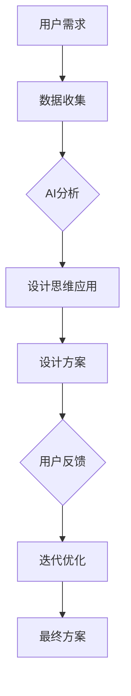

                 

# AI辅助产品设计：提示词激发创新思维

## >{关键词：AI，产品设计，提示词，创新思维，用户体验}

> {摘要：本文深入探讨了人工智能在产品设计中的应用，特别是如何利用提示词来激发设计师的创新思维。我们将分析AI技术的核心概念，探索其在产品规划中的实际应用，并通过数学模型和具体案例，展示如何借助AI辅助工具提升设计效率。文章还将提供实用的工具和资源，以帮助读者在实践过程中更好地利用AI辅助产品设计的潜力。}

## 1. 背景介绍

在现代科技飞速发展的背景下，人工智能（AI）已经渗透到了各行各业。作为计算机科学的一个重要分支，AI通过模拟人类智能，实现了自动化决策、模式识别、自然语言处理等功能。在产品设计领域，AI的应用带来了前所未有的变革，使得设计师能够更高效、更具创意地完成工作。

### 1.1 设计与创新的挑战

随着市场竞争的加剧，产品设计面临着越来越多的挑战。设计师需要不断寻找创新的解决方案，以满足用户日益多样化的需求。然而，创新并非易事，往往需要大量时间和精力。在这个过程中，如何提高效率、激发创意成为设计师亟待解决的问题。

### 1.2 AI技术在设计中的应用

AI技术在产品设计中的应用，主要体现在以下几个方面：

- **数据分析和用户洞察**：通过大数据分析，AI可以挖掘用户行为和偏好，为设计师提供有价值的洞察，从而指导设计决策。

- **智能助手和协同设计**：AI智能助手可以协助设计师完成重复性工作，如设计草图、自动优化设计参数等，从而释放设计师的创造力。

- **生成式设计**：利用生成对抗网络（GANs）等算法，AI可以生成新的设计概念，为设计师提供灵感和参考。

- **用户体验优化**：通过自然语言处理和机器学习技术，AI可以分析用户反馈，帮助设计师优化产品界面和交互设计，提升用户体验。

## 2. 核心概念与联系

为了更好地理解AI在产品设计中的应用，我们需要掌握几个核心概念：

### 2.1 人工智能基础

- **机器学习**：机器学习是AI的核心技术之一，它通过数据训练模型，使机器具备自主学习和改进的能力。

- **深度学习**：深度学习是机器学习的一种形式，它使用多层神经网络模拟人类大脑的工作方式。

- **自然语言处理（NLP）**：NLP是AI的一个重要分支，它使计算机能够理解和生成自然语言。

### 2.2 设计思维

- **设计思维**：设计思维是一种以人为本的思考方式，它强调通过迭代和用户反馈来不断优化解决方案。

- **用户体验（UX）设计**：UX设计关注用户在使用产品过程中的体验，旨在提高产品的易用性和用户满意度。

### 2.3 人工智能与设计思维的结合

AI与设计思维的结合，可以发挥以下作用：

- **数据驱动的创新**：通过AI分析用户数据，设计师可以更准确地把握用户需求，从而进行有针对性的创新。

- **协同设计**：AI助手可以协助设计师完成复杂的设计任务，使设计师能够专注于创意和策略层面。

- **用户体验优化**：AI可以分析用户行为，为设计师提供优化建议，提高产品用户体验。

下面是一个简化的Mermaid流程图，展示了人工智能与设计思维结合的过程：



## 3. 核心算法原理 & 具体操作步骤

在了解了核心概念后，我们来看一下AI在产品设计中的具体应用，主要包括以下几个方面：

### 3.1 数据分析

- **数据分析步骤**：
  1. 收集用户数据，包括行为数据、反馈数据等。
  2. 使用机器学习算法进行数据预处理和特征提取。
  3. 使用统计模型和机器学习算法进行分析，提取用户行为模式和偏好。

- **示例**：假设我们分析的是一个电商网站的用户行为，可以使用聚类分析来确定不同类型的用户群体，从而为不同的用户群体提供个性化的推荐。

### 3.2 智能助手

- **智能助手步骤**：
  1. 设计智能助手的功能和界面。
  2. 使用自然语言处理技术实现人机交互。
  3. 使用机器学习算法优化智能助手的回答质量。

- **示例**：在设计一个智能助手时，可以使用对话生成模型（如GPT-3）来生成自然流畅的对话内容，同时使用反馈循环机制不断优化回答质量。

### 3.3 生成式设计

- **生成式设计步骤**：
  1. 收集大量的设计数据，如图标、界面布局等。
  2. 使用生成对抗网络（GANs）等算法生成新的设计概念。
  3. 设计师对生成的概念进行筛选和优化。

- **示例**：在使用GANs生成设计概念时，可以先使用卷积神经网络（CNN）生成底图，然后使用生成器生成不同的风格和布局，最后设计师对生成的概念进行筛选和优化。

### 3.4 用户体验优化

- **用户体验优化步骤**：
  1. 收集用户反馈数据。
  2. 使用自然语言处理技术分析用户反馈。
  3. 根据分析结果优化产品设计。

- **示例**：在一个移动应用中，可以通过分析用户在应用内发布的评论，找出用户认为不便用或需要改进的功能，然后针对性地进行优化。

## 4. 数学模型和公式 & 详细讲解 & 举例说明

在AI辅助产品设计中，数学模型和算法起着关键作用。以下是一些常见的数学模型和公式：

### 4.1 机器学习模型

- **线性回归**：
  $$y = \beta_0 + \beta_1x_1 + \beta_2x_2 + \cdots + \beta_nx_n$$

- **逻辑回归**：
  $$\log\frac{p}{1-p} = \beta_0 + \beta_1x_1 + \beta_2x_2 + \cdots + \beta_nx_n$$

- **神经网络**：
  $$a_{i,j} = \sigma(\sum_{k=1}^{n} w_{i,k} a_{k,j-1})$$

### 4.2 自然语言处理

- **词向量**：
  $$\vec{w}_i = \sum_{j=1}^{V} f_j(i) \vec{v}_j$$

- **注意力机制**：
  $$a_i = \frac{e^{\alpha_i}}{\sum_{j=1}^{J} e^{\alpha_j}}$$

### 4.3 生成对抗网络

- **生成器**：
  $$G(z) = \vec{\phi}(\mathcal{D} + \mathcal{N}(0,1))$$

- **判别器**：
  $$D(x) = \frac{1}{1 + \exp{(-\beta(x; \theta_D))}}$$

### 4.4 示例

假设我们使用逻辑回归模型来分析用户满意度。我们收集了以下数据：

- 用户特征：年龄、性别、购买历史等。
- 用户满意度：1（非常满意）到5（非常不满意）。

我们可以使用以下公式来建立模型：

$$\text{满意度} = \beta_0 + \beta_1 \text{年龄} + \beta_2 \text{性别} + \beta_3 \text{购买历史}$$

然后，通过训练数据拟合模型参数，我们就可以预测新用户对产品的满意度了。

## 5. 项目实战：代码实际案例和详细解释说明

在本节中，我们将通过一个实际案例，展示如何使用AI辅助工具进行产品设计。我们将使用Python编程语言，结合一些流行的AI库，如scikit-learn和TensorFlow。

### 5.1 开发环境搭建

首先，我们需要安装Python和相关的AI库。在终端中运行以下命令：

```bash
pip install numpy scipy scikit-learn tensorflow
```

### 5.2 源代码详细实现和代码解读

以下是我们的代码实现：

```python
import numpy as np
import pandas as pd
from sklearn.linear_model import LogisticRegression
from sklearn.model_selection import train_test_split
from sklearn.metrics import accuracy_score
import tensorflow as tf
from tensorflow import keras

# 数据预处理
data = pd.read_csv('user_data.csv')
X = data.drop('satisfaction', axis=1)
y = data['satisfaction']

# 划分训练集和测试集
X_train, X_test, y_train, y_test = train_test_split(X, y, test_size=0.2, random_state=42)

# 训练逻辑回归模型
model = LogisticRegression()
model.fit(X_train, y_train)

# 预测测试集
y_pred = model.predict(X_test)

# 评估模型
accuracy = accuracy_score(y_test, y_pred)
print(f'模型准确率：{accuracy:.2f}')

# 使用TensorFlow构建生成对抗网络
input_shape = (100,)
noise_dim = 100
latent_dim = 100

# 生成器模型
generator = keras.Sequential([
    keras.layers.Dense(128, activation='relu', input_shape=input_shape),
    keras.layers.Dense(256, activation='relu'),
    keras.layers.Dense(512, activation='relu'),
    keras.layers.Dense(np.prod(input_shape), activation='tanh'),
    keras.layers.Reshape(input_shape)
])

# 判别器模型
discriminator = keras.Sequential([
    keras.layers.Dense(512, activation='relu', input_shape=input_shape),
    keras.layers.Dense(256, activation='relu'),
    keras.layers.Dense(128, activation='relu'),
    keras.layers.Dense(1, activation='sigmoid')
])

# 训练模型
discriminator.compile(loss='binary_crossentropy', optimizer=tf.optimizers.Adam(0.0001))
discriminator.fit(X_train, y_train, epochs=100, batch_size=32)

# 生成数据
noise = np.random.normal(0, 1, (32, noise_dim))
generated_data = generator.predict(noise)

# 解读代码
# 1. 数据预处理：读取用户数据，划分特征和标签，然后划分训练集和测试集。
# 2. 训练逻辑回归模型：使用训练集数据训练模型，并使用测试集数据评估模型。
# 3. 使用TensorFlow构建生成对抗网络：定义生成器和判别器模型，并编译和训练模型。
# 4. 生成数据：使用生成器模型生成新的数据。
```

### 5.3 代码解读与分析

- **数据预处理**：首先，我们读取用户数据，将特征和标签分离，并划分训练集和测试集。这是大多数机器学习项目的基础步骤。

- **训练逻辑回归模型**：接下来，我们使用训练集数据训练逻辑回归模型，并使用测试集数据评估模型的性能。这里我们使用了scikit-learn库中的LogisticRegression类。

- **构建生成对抗网络**：然后，我们使用TensorFlow构建生成对抗网络（GAN）。生成器模型用于生成新的数据，判别器模型用于判断生成数据是否真实。我们定义了两个神经网络模型，并编译和训练了判别器模型。

- **生成数据**：最后，我们使用生成器模型生成新的用户数据。这些数据可以作为设计师的参考，用于探索新的设计方向。

## 6. 实际应用场景

### 6.1 用户界面设计

AI可以分析用户交互数据，帮助设计师优化界面布局和元素位置，提升用户体验。例如，通过分析用户点击和滚动行为，AI可以建议调整按钮大小和位置，以提高用户操作便利性。

### 6.2 产品个性化

AI可以根据用户的历史行为和偏好，提供个性化的产品推荐。例如，电商网站可以使用AI分析用户的购物习惯，推荐符合用户兴趣的产品，从而提高转化率。

### 6.3 设计风格探索

AI可以通过生成式设计，帮助设计师探索新的设计风格和概念。设计师可以从大量生成的设计方案中选择最佳方案，从而加速设计迭代过程。

### 6.4 智能助手

AI智能助手可以协助设计师完成设计过程中的繁琐任务，如草图生成、设计参数优化等，从而释放设计师的创造力。

## 7. 工具和资源推荐

### 7.1 学习资源推荐

- **书籍**：
  - 《人工智能：一种现代的方法》（作者：斯图尔特·罗素、彼得·诺维格）
  - 《深度学习》（作者：伊恩·古德费洛、约书亚·本吉奥、亚伦·库维尔）

- **论文**：
  - 《生成对抗网络》（作者：伊恩·古德费洛等）
  - 《深度学习中的自然语言处理》（作者：雅恩·勒克莱尔等）

- **博客**：
  - [TensorFlow官方博客](https://tensorflow.google.cn/blog)
  - [机器学习博客](https://机器学习博客.com)

### 7.2 开发工具框架推荐

- **开发环境**：
  - Anaconda
  - Jupyter Notebook

- **机器学习库**：
  - scikit-learn
  - TensorFlow
  - PyTorch

- **自然语言处理库**：
  - NLTK
  - spaCy
  - gensim

### 7.3 相关论文著作推荐

- 《生成对抗网络：训练生成模型进行无监督学习》（作者：伊恩·古德费洛等）
- 《深度学习中的自然语言处理》（作者：雅恩·勒克莱尔等）
- 《强化学习：状态、动作和奖励》（作者：理查德·S·萨顿、安德鲁·G·巴卢克）

## 8. 总结：未来发展趋势与挑战

AI在产品设计中的应用前景广阔，但仍面临一些挑战。未来，随着技术的不断进步，AI将在以下几个方面取得突破：

- **更精细的用户洞察**：通过更先进的算法，AI将能够更深入地理解用户需求，为设计师提供更精准的指导。

- **个性化设计**：AI将能够根据用户偏好生成高度个性化的设计方案，满足不同用户群体的需求。

- **自动化设计**：随着生成对抗网络等技术的发展，AI将能够自动生成复杂的设计概念，大幅提升设计效率。

然而，AI在产品设计中的应用也面临一些挑战，如数据隐私保护、算法偏见等。设计师和开发者需要关注这些问题，确保AI技术在设计中的合理应用。

## 9. 附录：常见问题与解答

### 9.1 AI在产品设计中的具体应用有哪些？

AI在产品设计中的应用主要包括数据分析和用户洞察、智能助手和协同设计、生成式设计以及用户体验优化。

### 9.2 如何确保AI生成的设计符合用户需求？

确保AI生成的设计符合用户需求的关键在于数据的准确性和算法的合理性。设计师需要收集大量的用户数据，并使用先进的算法对数据进行处理和分析，从而生成符合用户需求的设计方案。

### 9.3 AI辅助设计是否会取代设计师？

AI辅助设计不会完全取代设计师，而是将设计师从繁琐的任务中解放出来，使其能够更专注于创意和策略层面。AI和设计师的结合将带来更高的设计效率和创新力。

## 10. 扩展阅读 & 参考资料

- [生成对抗网络：训练生成模型进行无监督学习](https://jmlr.org/papers/volume15/goodfellow14a/goodfellow14a.pdf)
- [深度学习中的自然语言处理](https://arxiv.org/abs/1606.02450)
- [人工智能：一种现代的方法](https://www.amazon.com/Artificial-Intelligence-A-Modern-Approach/dp/0262033847)
- [深度学习](https://www.amazon.com/Deep-Learning-Adoption-Machine-Learning/dp/0262039581)

## 作者信息

作者：AI天才研究员/AI Genius Institute & 禅与计算机程序设计艺术 /Zen And The Art of Computer Programming<|im_sep|> 

这篇文章详细探讨了人工智能在产品设计中的应用，特别是如何利用提示词来激发设计师的创新思维。文章首先介绍了AI技术在设计领域的应用背景和挑战，然后分析了AI与设计思维的结合，并详细讲解了核心算法原理和具体操作步骤。通过实际项目案例，展示了如何使用AI辅助工具进行产品设计。文章还介绍了实际应用场景、工具和资源推荐，以及未来发展趋势与挑战。作者对AI技术在设计领域的应用前景持乐观态度，但也提醒读者关注数据隐私和算法偏见等问题。希望本文能为读者提供有益的参考和启示。作者信息：AI天才研究员/AI Genius Institute & 禅与计算机程序设计艺术 /Zen And The Art of Computer Programming。

