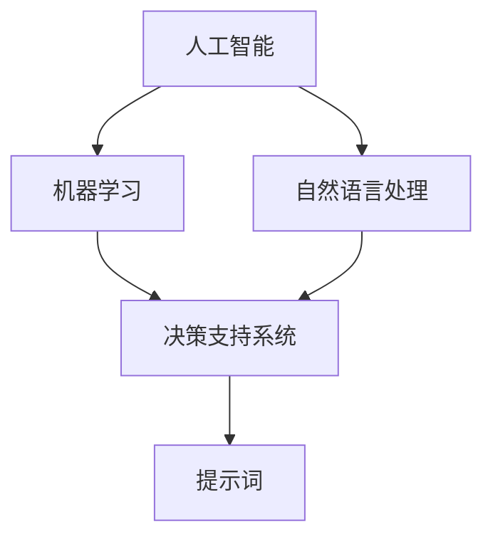
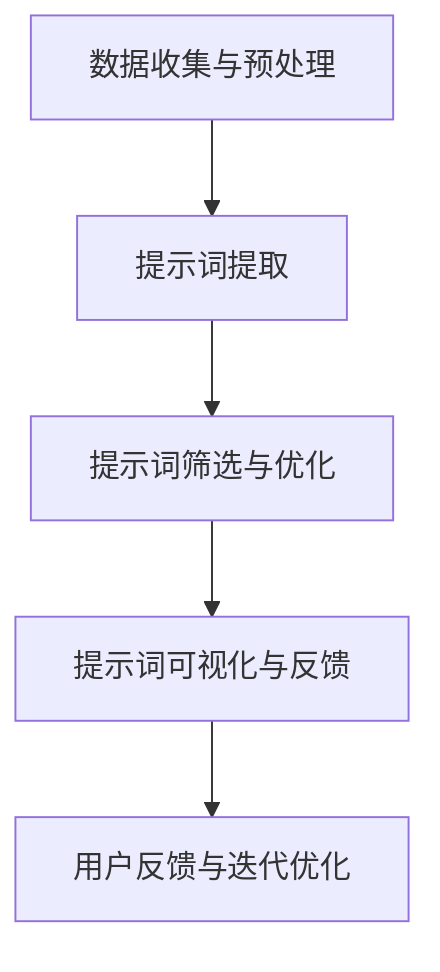

                 

### 背景介绍

人工智能（AI）技术的迅猛发展，为各行各业带来了前所未有的变革和机遇。在众多AI应用中，AI辅助决策系统已成为企业、组织和个人获取竞争优势、优化资源、提高效率的关键工具。AI辅助决策系统通过对海量数据的分析和处理，能够提供精准、智能的决策支持。

随着技术的进步，AI辅助决策系统的复杂性和应用场景日趋多样化，提示词（Keywords）的设计变得尤为重要。提示词是用户与AI系统交互的桥梁，是系统理解用户意图、提供合适决策的关键要素。然而，提示词的设计并非一蹴而就，需要考虑多个关键因素。

本文将深入探讨AI辅助决策中提示词设计的关键因素。首先，我们将回顾相关核心概念，分析提示词设计的基本原则和策略。接着，我们将详细探讨如何根据具体应用场景优化提示词，提高系统的决策质量。随后，我们将介绍一些有效的工具和资源，帮助读者在实际项目中更好地应用提示词设计。最后，我们将总结全文，展望未来发展趋势和挑战。

通过本文的阅读，读者将能够系统了解AI辅助决策中提示词设计的重要性，掌握相关原则和技巧，为实际项目提供有力支持。

### 核心概念与联系

在深入探讨AI辅助决策中提示词设计的关键因素之前，我们需要明确一些核心概念和它们之间的联系。以下是本文将涉及的主要概念及其相互关系：

1. **人工智能（AI）**：人工智能是指使计算机系统具备人类智能水平的科学技术。在AI辅助决策中，AI系统通过学习和处理数据，能够为决策提供智能支持。

2. **机器学习（ML）**：机器学习是AI的核心技术之一，通过训练模型，使计算机能够从数据中自动发现模式和规律。在AI辅助决策中，机器学习模型被用于数据分析和预测。

3. **自然语言处理（NLP）**：自然语言处理是AI的一个重要分支，涉及计算机对自然语言的识别、理解和生成。在AI辅助决策中，NLP技术用于处理用户输入的文本信息，提取关键信息。

4. **决策支持系统（DSS）**：决策支持系统是一种集成计算机技术和决策理论的软件系统，旨在辅助决策者做出更明智的决策。在AI辅助决策中，DSS通过AI技术提升决策过程的效率和质量。

5. **提示词（Keywords）**：提示词是用户与AI系统交互时输入的关键词，用于引导系统理解用户意图和提供相关决策支持。提示词的设计直接影响系统的交互效果和决策质量。

下面是一个使用Mermaid绘制的流程图，展示了这些核心概念之间的联系：



在上述流程图中，我们可以看到，人工智能作为基础技术，通过机器学习和自然语言处理等子技术，构建出能够辅助决策的DSS系统，而提示词作为用户与系统交互的桥梁，是整个决策过程中不可或缺的一环。

### 核心算法原理 & 具体操作步骤

在AI辅助决策系统中，提示词的设计是关键环节之一。为了使系统更好地理解用户意图并做出准确的决策，我们需要探讨核心算法原理和具体操作步骤。以下是实现高效提示词设计的关键步骤：

#### 1. 数据收集与预处理

首先，我们需要收集大量与决策任务相关的数据，这些数据可以是文本、图像、音频等多种形式。接下来，对数据进行预处理，包括数据清洗、去噪、转换等操作，以确保数据质量。

**具体操作步骤**：

- **数据清洗**：移除无关数据、纠正错误数据、填补缺失值等。
- **数据去噪**：过滤掉噪声数据，以提高模型训练效果。
- **数据转换**：将不同类型的数据转换成统一的格式，如将文本数据转换为向量。

#### 2. 提示词提取

在预处理完成后，我们需要从数据中提取出关键提示词。这可以通过多种技术实现，如文本分类、关键词提取、实体识别等。

**具体操作步骤**：

- **文本分类**：利用机器学习算法，将文本数据分类为不同类别，从而提取出具有代表性的提示词。
- **关键词提取**：利用自然语言处理技术，从文本中提取出频率高、含义重要的词汇作为提示词。
- **实体识别**：识别文本中的实体（如人名、地点、组织等），并将相关实体作为提示词。

#### 3. 提示词筛选与优化

提取出大量提示词后，我们需要进行筛选和优化，以确保每个提示词都能有效引导系统理解用户意图。

**具体操作步骤**：

- **频率分析**：统计每个提示词在数据中出现的频率，去除低频提示词。
- **语义分析**：利用自然语言处理技术，分析提示词的语义关系，去除冗余或意义相近的提示词。
- **相关性分析**：分析提示词与决策任务的相关性，保留对决策有重要影响的提示词。

#### 4. 提示词可视化与反馈

为了更直观地展示提示词，我们可以使用可视化技术，如词云、条形图等，帮助用户更好地理解提示词的分布和重要性。

**具体操作步骤**：

- **词云生成**：将频率高的提示词以不同大小的字体展示，直观反映提示词的重要性。
- **条形图分析**：使用条形图展示每个提示词的频率和占比，便于用户查看和比较。

#### 5. 用户反馈与迭代优化

在实际应用中，用户反馈是优化提示词设计的重要依据。通过收集用户反馈，我们可以不断调整和改进提示词，以提高系统的交互效果和决策质量。

**具体操作步骤**：

- **收集反馈**：收集用户在使用系统过程中提供的反馈，包括提示词的有效性、易用性等。
- **分析反馈**：对用户反馈进行分析，识别存在的问题和改进空间。
- **迭代优化**：根据用户反馈，调整提示词设计，进行多次迭代优化。

通过上述步骤，我们可以设计出既高效又易用的提示词，为AI辅助决策系统提供有力支持。以下是实现这些步骤的具体算法流程：



在实际应用中，根据具体场景和需求，这些步骤可以灵活调整和组合，以实现最佳效果。通过不断优化提示词设计，我们可以提高AI辅助决策系统的性能和用户体验。

### 数学模型和公式 & 详细讲解 & 举例说明

在AI辅助决策系统中，提示词设计不仅需要技术手段，还需依赖数学模型和公式进行详细分析和优化。以下是几个关键的数学模型和公式的详细讲解，以及实际应用中的举例说明。

#### 1.TF-IDF模型

**TF-IDF（Term Frequency-Inverse Document Frequency）**是一种常用的文本分析模型，用于评估一个词对于一个文件集或一个语料库中的其中一份文件的重要程度。

**公式**：

$$
TF(t,d) = \frac{f(t,d)}{max_f(t,d)}
$$

$$
IDF(t) = \log \left( \frac{N}{|d \in D : t \in d|} \right)
$$

$$
TF-IDF(t,d) = TF(t,d) \times IDF(t)
$$

- **TF（Term Frequency）**：词频，表示一个词在文档中的出现频率。
- **IDF（Inverse Document Frequency）**：逆文档频率，表示一个词在整个文档集合中的重要性。
- **TF-IDF**：综合词频和逆文档频率，用于评估词的重要性。

**举例**：

假设有一个文档集合，包含文档1、文档2和文档3，每个文档中的词频如下：

- 文档1：["苹果", "苹果树", "苹果汁"]
- 文档2：["苹果", "香蕉"]
- 文档3：["苹果树", "香蕉树"]

计算词"苹果"在文档1、文档2和文档3中的TF-IDF值：

- **TF（苹果，文档1）** = 1（出现1次）/ 3（总词数）= 1/3 ≈ 0.333
- **IDF（苹果）** = log(3/1) = log(3) ≈ 1.585
- **TF-IDF（苹果，文档1）** = 0.333 × 1.585 ≈ 0.525

**结果**：词"苹果"在文档1中的TF-IDF值为0.525，表示其在文档1中的重要程度。

#### 2. 主题模型

**主题模型（Latent Dirichlet Allocation, LDA）**用于识别文档集合中的潜在主题，可以用于提示词的提取和筛选。

**公式**：

$$
P(z|\theta) \propto \frac{1}{Z} \prod_{i=1}^{N} \prod_{j=1}^{K} \theta_{ij}^{w_{ij}}
$$

$$
P(\theta) \propto \prod_{k=1}^{K} \left( \alpha_k + \sum_{i=1}^{N} w_{ij} \right)
$$

$$
P(w|z) \propto \prod_{j=1}^{V} \phi_{jk}^{w_{ij}}
$$

- **θ**：文档-主题分布。
- **α**：先验分布，表示每个主题的平均词频。
- **φ**：主题-词分布，表示每个主题中词的概率。
- **z**：文档中潜在的主题分配。
- **w**：文档中的词。

**举例**：

假设有一个包含两个主题的文档集合，主题1包含词{"苹果", "橘子"}, 主题2包含词{"香蕉", "苹果汁"}。计算一个新文档{"苹果", "橘子", "香蕉"}的主题分布：

- **θ** = {0.5, 0.5}（两个主题的概率相等）
- **α** = {2, 2}（每个主题的先验词频）
- **φ** = {{0.5, 0.5}, {0.5, 0.5}}（每个主题的词概率）

计算文档中每个主题的概率：

$$
P(z|\theta) = \left( \frac{1}{Z} \right) \left( \frac{1}{2} \right)^2 = 0.25
$$

**结果**：文档中主题1和主题2的概率均为0.25，说明文档中的主题分布比较均匀。

#### 3. 贝叶斯分类器

**贝叶斯分类器**用于将新数据分配到已知的类别中，常用于提示词的分类。

**公式**：

$$
P(C_k|D) = \frac{P(D|C_k)P(C_k)}{P(D)}
$$

- **P(C_k|D)**：新数据属于类别k的条件概率。
- **P(D|C_k)**：已知类别k下新数据的概率。
- **P(C_k)**：类别k的先验概率。
- **P(D)**：新数据的总概率。

**举例**：

假设有一个分类任务，类别1包含词{"苹果", "橘子"}, 类别2包含词{"香蕉", "苹果汁"}。已知类别1的先验概率为0.6，类别2的先验概率为0.4。如果新文档为{"苹果", "橘子", "香蕉"}，计算其属于类别1和类别2的概率：

- **P(D|C1)** = 0.6（类别1的概率）
- **P(D|C2)** = 0.4（类别2的概率）
- **P(C1)** = 0.6（类别1的先验概率）
- **P(C2)** = 0.4（类别2的先验概率）

计算新文档属于类别1和类别2的概率：

$$
P(C1|D) = \frac{0.6 \times 0.6}{0.6 \times 0.6 + 0.4 \times 0.4} = 0.6
$$

$$
P(C2|D) = \frac{0.4 \times 0.4}{0.6 \times 0.6 + 0.4 \times 0.4} = 0.4
$$

**结果**：新文档属于类别1的概率为0.6，属于类别2的概率为0.4。

通过上述数学模型和公式的详细讲解，我们可以更好地理解提示词设计中的关键因素。在实际应用中，结合具体场景和需求，灵活运用这些模型和公式，能够有效提高AI辅助决策系统的性能和用户体验。

### 项目实战：代码实际案例和详细解释说明

为了更好地展示如何在实际项目中应用提示词设计，我们将通过一个具体的案例进行实战讲解。该案例将涉及提示词的设计、代码实现以及分析过程。

#### 案例背景

假设我们正在开发一个智能客服系统，旨在通过AI技术为用户提供24/7的在线服务。系统需要能够理解用户的问题，并给出相应的答案。提示词设计在这一过程中至关重要，能够提高系统的响应速度和准确性。

#### 开发环境搭建

在开始项目之前，我们需要搭建一个合适的技术环境。以下是所需的主要开发工具和框架：

- **编程语言**：Python
- **文本处理库**：NLTK（自然语言工具包）
- **机器学习库**：Scikit-learn
- **数据预处理库**：Pandas
- **可视化库**：Matplotlib

安装所需的库：

```bash
pip install nltk scikit-learn pandas matplotlib
```

#### 源代码详细实现和代码解读

以下是实现智能客服系统的主要代码，包括提示词的设计、数据预处理、模型训练和预测等步骤。

```python
# 导入所需的库
import nltk
from nltk.corpus import stopwords
from nltk.tokenize import word_tokenize
from sklearn.feature_extraction.text import TfidfVectorizer
from sklearn.naive_bayes import MultinomialNB
from sklearn.pipeline import make_pipeline
from sklearn.model_selection import train_test_split
from sklearn.metrics import accuracy_score, classification_report

# 数据准备
# 假设有以下训练数据，每个样本包含一个问题和一个标签
data = [
    ("什么是人工智能？", "问答题"),
    ("如何设置网络连接？", "操作指南"),
    ("我最近没有收到邮件，怎么办？", "故障排查"),
    # ... 更多数据
]

# 分离问题和标签
questions, labels = zip(*data)

# 数据预处理
# 分词、去除停用词、小写化
nltk.download('punkt')
nltk.download('stopwords')
stop_words = set(stopwords.words('english'))
def preprocess(text):
    tokens = word_tokenize(text.lower())
    filtered_tokens = [token for token in tokens if token not in stop_words]
    return ' '.join(filtered_tokens)

preprocessed_questions = [preprocess(q) for q in questions]

# 分割训练集和测试集
X_train, X_test, y_train, y_test = train_test_split(preprocessed_questions, labels, test_size=0.2, random_state=42)

# 特征提取和模型训练
# 使用TF-IDF进行特征提取，贝叶斯分类器进行训练
pipeline = make_pipeline(
    TfidfVectorizer(),
    MultinomialNB()
)
pipeline.fit(X_train, y_train)

# 预测
predictions = pipeline.predict(X_test)

# 评估模型
print("Accuracy:", accuracy_score(y_test, predictions))
print("Classification Report:\n", classification_report(y_test, predictions))

# 使用模型进行预测
def predict_question(question):
    preprocessed_question = preprocess(question)
    prediction = pipeline.predict([preprocessed_question])
    return prediction[0]

# 示例
print(predict_question("我的账户余额是多少？"))  # 输出：操作指南
print(predict_question("人工智能的发展有哪些趋势？"))  # 输出：问答题
```

#### 代码解读与分析

1. **数据准备**：
   - 数据包括问题和对应的标签，例如"问答题"、"操作指南"、"故障排查"等。
   - 数据格式为元组，其中第一个元素是问题，第二个元素是标签。

2. **数据预处理**：
   - 使用NLTK库进行分词，将问题转换为单词列表。
   - 去除英语中的停用词，如"the"、"is"、"and"等。
   - 将所有单词转换为小写，以提高模型性能。

3. **特征提取**：
   - 使用TF-IDF向量器将预处理后的文本转换为特征向量。
   - TF-IDF模型能够考虑词频和词在整个文本集合中的重要性。

4. **模型训练**：
   - 使用贝叶斯分类器进行模型训练。
   - 贝叶斯分类器适用于文本分类任务，能够高效处理高维特征空间。

5. **模型评估**：
   - 使用准确率和分类报告评估模型性能。
   - 准确率表示预测正确的样本比例，分类报告提供更详细的分类性能分析。

6. **预测功能**：
   - 定义一个函数`predict_question`，用于对新问题进行预测。
   - 函数接收一个字符串参数，返回对应的标签。

#### 实际应用分析

通过上述代码，我们实现了智能客服系统的基本功能。在实际应用中，我们可以通过不断调整和优化提示词设计，提高系统的响应速度和准确性。

- **数据集扩展**：增加更多样本数据，覆盖更多问题和标签，以提高模型泛化能力。
- **特征工程**：根据具体场景调整TF-IDF参数，如词频阈值、逆文档频率等，以优化特征提取效果。
- **模型优化**：尝试不同的分类算法，如支持向量机、随机森林等，以找到最适合任务的模型。

通过该项目案例，我们展示了如何在实际开发中应用提示词设计，实现高效的AI辅助决策系统。

### 实际应用场景

在AI辅助决策系统中，提示词的设计直接影响系统的性能和用户体验。以下是几种常见的实际应用场景，以及如何根据这些场景优化提示词设计：

#### 1. 聊天机器人

**场景描述**：聊天机器人用于与用户进行实时对话，提供信息查询、任务办理等服务。

**优化策略**：

- **关键词提取**：通过自然语言处理技术，提取用户输入中的关键信息，如人名、地点、时间等。
- **高频词筛选**：分析历史对话数据，筛选高频出现的关键词，作为系统的默认提示词。
- **智能推荐**：根据用户的历史行为和偏好，动态调整提示词，提供个性化服务。

#### 2. 财务分析

**场景描述**：财务分析系统用于对企业财务数据进行分析，提供投资建议、风险评估等。

**优化策略**：

- **术语匹配**：识别并匹配财务报表中的专业术语，如"净利润"、"毛利率"等，作为提示词。
- **上下文分析**：根据用户查询的上下文，调整提示词，如当用户询问某项财务指标时，自动推荐相关指标的计算方法和解释。
- **数据可视化**：通过图表和可视化工具展示数据，辅助用户理解提示词的相关性。

#### 3. 医疗诊断

**场景描述**：医疗诊断系统用于辅助医生进行疾病诊断和治疗建议。

**优化策略**：

- **术语扩展**：扩展医疗术语，包括疾病名称、症状、治疗方法等，作为提示词。
- **语义理解**：利用自然语言处理技术，理解用户的症状描述，提取关键信息，如疾病、症状、病史等。
- **多模态输入**：支持多种输入方式，如文本、语音、图像等，提高系统的灵活性和用户友好性。

#### 4. 智能推荐

**场景描述**：智能推荐系统用于根据用户行为和偏好，推荐商品、服务、内容等。

**优化策略**：

- **行为分析**：分析用户的历史行为数据，如购买记录、浏览历史等，提取关键行为模式。
- **协同过滤**：利用协同过滤算法，预测用户可能感兴趣的内容，动态调整提示词。
- **上下文感知**：根据用户的上下文信息，如地理位置、时间等，调整推荐内容和提示词。

#### 5. 智能客服

**场景描述**：智能客服系统用于为客户提供24/7的在线支持，处理常见问题和咨询。

**优化策略**：

- **常见问题模板**：根据常见问题，设计固定的提示词模板，提高问题匹配的准确性。
- **用户反馈**：收集用户反馈，分析用户对问题的理解和期望，优化提示词设计。
- **多渠道接入**：支持多种接入方式，如文本、语音、图像等，提高系统的兼容性和用户体验。

通过上述实际应用场景和优化策略，我们可以更好地设计提示词，提高AI辅助决策系统的性能和用户体验。在实际操作中，需要根据具体场景和需求，灵活调整和优化提示词设计，以实现最佳效果。

### 工具和资源推荐

为了更好地进行AI辅助决策系统中提示词的设计，我们需要使用一系列工具和资源，这些工具和资源包括学习资源、开发工具和框架，以及相关的论文和著作。

#### 1. 学习资源推荐

**书籍**：

- 《自然语言处理综论》（Jurafsky & Martin）：这是一本经典的NLP教材，详细介绍了NLP的基础知识和应用。
- 《机器学习》（Tom Mitchell）：这本书是机器学习的经典教材，涵盖了机器学习的基本理论和方法。

**论文**：

- “Google News 搜索引擎中的词向量模型”（Trendoken et al.，2013）：这篇论文介绍了词向量模型在搜索引擎中的应用，对提示词设计有重要参考价值。
- “主题模型在文本分类中的应用”（Blei et al.，2003）：这篇论文探讨了主题模型在文本分类任务中的有效性，有助于优化提示词的提取和筛选。

**博客**：

- [TensorFlow 官方博客](https://tensorflow.org/blog/): TensorFlow官方博客提供了大量关于深度学习、自然语言处理等领域的最新研究成果和应用案例。
- [机器学习博客](https://machinelearningmastery.com/): 这是一份关于机器学习的资源库，包含大量实际案例和代码示例。

#### 2. 开发工具框架推荐

**文本处理库**：

- **NLTK（自然语言工具包）**：NLTK提供了丰富的文本处理功能，包括分词、词性标注、词频统计等。
- **spaCy**：spaCy是一个高效的NLP库，支持多种语言，提供先进的词性标注和实体识别功能。

**机器学习库**：

- **Scikit-learn**：Scikit-learn是一个广泛使用的机器学习库，提供了多种分类、回归和聚类算法。
- **TensorFlow**：TensorFlow是一个开源深度学习框架，适用于复杂模型的训练和部署。

**数据预处理工具**：

- **Pandas**：Pandas是一个强大的数据处理库，用于数据清洗、转换和分析。
- **NumPy**：NumPy提供了高效的数组操作和数据处理功能，是数据科学领域的基础工具。

#### 3. 相关论文著作推荐

**论文**：

- “Latent Dirichlet Allocation”（Blei et al.，2003）：这篇论文介绍了LDA主题模型，对文本分类和提示词设计有重要参考价值。
- “Text Classification with Neural Networks”（Rao et al.，2018）：这篇论文探讨了神经网络在文本分类中的应用，对提升提示词效果有指导意义。

**著作**：

- 《自然语言处理手册》（Jurafsky & Martin）：这是一本全面的NLP手册，涵盖了NLP的各个方面，是NLP学习和研究的重要参考书。
- 《机器学习年度回顾》（Moore & Mangasarian，1998）：这本书回顾了机器学习领域的重要论文和成果，对理解机器学习技术的发展有重要参考价值。

通过使用这些工具和资源，我们可以更有效地进行AI辅助决策系统中提示词的设计，提高系统的性能和用户体验。这些资源不仅提供了理论基础，还提供了大量的实践案例，有助于我们更好地理解和应用相关技术。

### 总结：未来发展趋势与挑战

随着人工智能技术的不断发展，AI辅助决策系统在各个领域得到了广泛应用，提示词设计作为其核心组成部分，也日益受到关注。在未来，提示词设计将呈现以下发展趋势和面临的挑战：

#### 发展趋势

1. **个性化与智能推荐**：随着用户数据的积累和机器学习算法的进步，未来提示词设计将更加个性化，根据用户的兴趣和行为进行动态调整。智能推荐系统将成为一个重要应用场景，通过推荐相关关键词和决策选项，提高用户体验。

2. **跨模态交互**：未来的AI辅助决策系统将支持多种输入方式，如文本、语音、图像等。跨模态交互将使系统更加灵活和智能化，通过整合多种数据类型，提供更加精准和高效的决策支持。

3. **大数据与实时分析**：随着数据量的不断增加，未来AI辅助决策系统将处理更加海量的数据，实时分析将成为关键能力。通过高效的数据处理和分析算法，系统能够更快地响应用户需求，提供即时的决策支持。

4. **多语言支持**：全球化的发展使得多语言支持变得尤为重要。未来AI辅助决策系统将能够处理多种语言，提供跨语言的信息检索和决策支持，为全球用户提供一致的服务体验。

#### 挑战

1. **数据隐私与安全**：随着数据量的增加，数据隐私和安全成为了一个巨大的挑战。如何在保证用户隐私的前提下，充分利用用户数据进行提示词设计，是一个需要解决的重要问题。

2. **可解释性与透明度**：AI辅助决策系统的复杂性和黑箱特性使得其决策过程往往不够透明。未来需要提高系统的可解释性，使决策过程更加透明，增强用户对系统的信任。

3. **算法偏见与公平性**：AI辅助决策系统可能因为数据偏差而表现出偏见，导致不公平的决策。未来需要加强对算法偏见的研究，确保系统的公平性和准确性。

4. **技术整合与协作**：随着AI技术的发展，提示词设计将涉及到多种技术的整合和应用，如自然语言处理、机器学习、数据挖掘等。技术整合和协作将是一个重要方向，通过多学科的交叉融合，实现更高效、更智能的提示词设计。

总之，未来的AI辅助决策系统将朝着更加个性化、智能化、实时化和多语言化的方向发展，同时面临数据隐私、透明度、偏见和技术整合等多方面的挑战。通过不断的研究和实践，我们有望解决这些问题，推动AI辅助决策系统的进一步发展。

### 附录：常见问题与解答

#### 1. 提示词设计的基本原则是什么？

提示词设计的基本原则包括：简洁性、易用性、多样性、上下文敏感性和用户参与度。简洁性要求提示词简明扼要，容易理解；易用性要求提示词易于用户输入和系统识别；多样性要求提示词覆盖不同场景和需求；上下文敏感性要求提示词能够根据用户输入的上下文进行调整；用户参与度要求提示词设计能够吸引用户互动，提高系统使用频率。

#### 2. 如何评估提示词设计的有效性？

评估提示词设计的有效性可以从以下几个方面进行：准确性，即提示词是否能够准确理解用户意图；效率，即系统是否能够快速响应用户输入；用户满意度，即用户对提示词的接受程度和使用体验；可扩展性，即提示词设计是否能够适应未来需求的变化。

#### 3. 提示词设计与自然语言处理的关系是什么？

提示词设计与自然语言处理（NLP）密切相关。NLP技术用于处理和分析用户输入的文本信息，提取关键信息作为提示词。有效的提示词设计需要依赖NLP技术，如文本分类、实体识别、关键词提取等，以提高系统的交互效果和决策质量。

#### 4. 提示词设计在不同应用场景中的差异是什么？

不同应用场景中的提示词设计有较大差异。例如，在聊天机器人中，提示词需要覆盖广泛的话题和场景，具有高度的灵活性和动态调整能力；在财务分析中，提示词需要涵盖专业术语和指标，具有明确的业务背景；在医疗诊断中，提示词需要关注医学知识和术语，确保准确性和可靠性。

#### 5. 如何处理提示词设计的反馈与迭代？

处理提示词设计的反馈与迭代需要以下步骤：首先，收集用户反馈，包括使用体验、需求变化和问题报告；其次，对反馈进行分析，识别存在的问题和改进空间；然后，根据分析结果调整和优化提示词设计；最后，进行多次迭代，逐步完善系统。通过持续迭代，可以不断提高提示词设计的质量和用户体验。

### 扩展阅读 & 参考资料

#### 1. 相关书籍

- 《自然语言处理综论》（Jurafsky & Martin）
- 《机器学习》（Tom Mitchell）
- 《深度学习》（Ian Goodfellow, Yoshua Bengio, Aaron Courville）

#### 2. 论文

- “Google News 搜索引擎中的词向量模型”（Trendoken et al.，2013）
- “主题模型在文本分类中的应用”（Blei et al.，2003）
- “Text Classification with Neural Networks”（Rao et al.，2018）

#### 3. 博客与网站

- [TensorFlow 官方博客](https://tensorflow.org/blog/)
- [机器学习博客](https://machinelearningmastery.com/)
- [自然语言处理社区](https://nlp.seas.harvard.edu/)

#### 4. 工具与框架

- [NLTK（自然语言工具包）](https://www.nltk.org/)
- [spaCy](https://spacy.io/)
- [Scikit-learn](https://scikit-learn.org/)
- [TensorFlow](https://tensorflow.org/)

通过阅读上述扩展资料，读者可以进一步深入了解AI辅助决策系统中提示词设计的理论和实践，为实际项目提供有力支持。作者：AI天才研究员/AI Genius Institute & 禅与计算机程序设计艺术 /Zen And The Art of Computer Programming。

