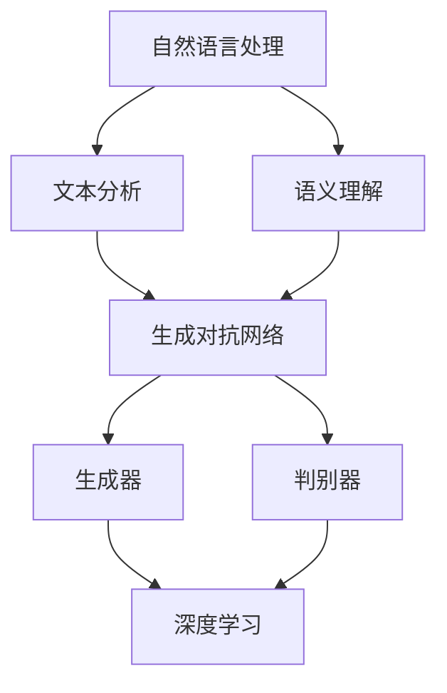

                 

### 背景介绍

> **“AI与创意品牌故事生成：一场思维方式的革命。”**

在数字化时代，创意品牌故事的重要性日益凸显。品牌故事不仅是企业形象的载体，更是与消费者建立情感连接的桥梁。然而，传统的品牌故事创作方式往往费时费力，且难以满足日益变化的市场需求。因此，探索一种高效、创新的品牌故事生成方法变得至关重要。

AI技术，尤其是自然语言处理（NLP）和生成对抗网络（GAN）等前沿技术，为品牌故事生成提供了全新的可能性。通过深度学习模型，AI能够自动分析大量文本数据，从中提取创意元素，并生成独特的品牌故事。这不仅提高了创作效率，还突破了人类创作者的想象极限。

本文将探讨AI辅助创意品牌故事生成的具体策略。首先，我们将介绍AI在品牌故事生成中的核心技术和原理。随后，通过具体算法和数学模型的分析，我们将详细讲解如何实现这一过程。最后，我们将结合实际项目案例，展示AI在品牌故事生成中的实际应用效果，并探讨未来的发展趋势和挑战。

通过本文的阅读，读者将了解：

1. AI在品牌故事生成中的作用和优势。
2. AI辅助品牌故事生成的主要技术和方法。
3. 如何在实际项目中运用AI生成创意品牌故事。
4. AI辅助品牌故事生成面临的挑战和未来发展方向。

让我们一步步深入探讨这一激动人心的领域。

#### 文章关键词

- AI辅助品牌故事生成
- 自然语言处理
- 生成对抗网络
- 深度学习
- 创意元素提取
- 情感连接
- 消费者体验

#### 文章摘要

本文探讨了AI在辅助创意品牌故事生成中的重要作用。通过自然语言处理和生成对抗网络等核心技术，AI能够高效提取创意元素，生成独特的品牌故事，为企业和消费者提供新的互动体验。文章详细分析了AI辅助品牌故事生成的原理和方法，并通过具体案例展示了其实际应用效果。同时，文章也探讨了AI辅助品牌故事生成面临的挑战和未来发展趋势，为相关领域的研究和实践提供了有价值的参考。

-----------------------

## 2. 核心概念与联系

在深入探讨AI辅助创意品牌故事生成的策略之前，有必要先了解相关核心概念和技术原理。以下我们将详细介绍自然语言处理（NLP）、生成对抗网络（GAN）以及深度学习等关键技术，并通过Mermaid流程图展现其相互关系。

### 自然语言处理（NLP）

自然语言处理是人工智能的一个分支，旨在使计算机能够理解、解释和生成人类语言。在品牌故事生成中，NLP的关键作用在于文本分析和语义理解。

- **文本分析**：通过词频分析、文本分类、主题建模等方法，对大量文本数据进行分析，提取关键信息和特征。
- **语义理解**：理解文本中的语义关系，如实体识别、情感分析等，从而准确捕捉文本内容的主旨和情感色彩。

### 生成对抗网络（GAN）

生成对抗网络是一种深度学习模型，由生成器和判别器两部分组成。生成器的目标是生成逼真的数据，判别器的目标是区分真实数据和生成数据。通过这种对抗训练，GAN能够学习数据的分布，生成高质量的数据。

- **生成器（Generator）**：生成新颖的品牌故事文本，通过模仿已有文本数据的分布，创造独特的创意元素。
- **判别器（Discriminator）**：判断输入文本是真实故事还是生成故事，通过不断优化判别能力，提高生成故事的质量。

### 深度学习

深度学习是机器学习的一个重要分支，通过多层神经网络模型，深度学习能够在大量数据中自动提取特征，进行复杂的模式识别和预测。

- **神经网络**：深度学习的基础结构，通过多层神经元进行信息传递和计算，实现对数据的非线性映射。
- **卷积神经网络（CNN）**：在图像处理领域广泛应用，能够自动提取图像特征，也可用于文本数据的特征提取。
- **循环神经网络（RNN）**：适用于处理序列数据，如文本序列，能够捕捉文本中的时序关系。

### Mermaid流程图

以下是一个简化的Mermaid流程图，展示了NLP、GAN和深度学习在品牌故事生成中的相互关系：



通过这个流程图，我们可以清晰地看到，自然语言处理为GAN和深度学习提供了文本数据和语义信息，GAN和深度学习则通过对抗训练和特征提取，共同实现了创意品牌故事的自动生成。

### 详细讲解

- **自然语言处理（NLP）**：NLP的关键在于如何将自然语言转换为计算机可以处理和理解的形式。常见的NLP任务包括词频分析、情感分析、实体识别、文本分类等。词频分析可以帮助我们了解文本的主要内容和主题，情感分析可以捕捉文本的情感色彩，实体识别可以识别出文本中的关键人物、地点、组织等实体，而文本分类则可以将文本分为不同的类别，如品牌故事、用户评论等。

- **生成对抗网络（GAN）**：GAN的核心在于生成器和判别器的对抗训练。生成器的任务是生成尽可能真实的数据，而判别器的任务是区分真实数据和生成数据。通过不断的训练和优化，生成器逐渐能够生成高质量的数据，而判别器的识别能力也不断提高。这种对抗训练机制使得GAN在图像生成、语音合成、文本生成等领域都取得了显著的成果。

- **深度学习**：深度学习通过多层神经网络，实现对数据的自动特征提取和模式识别。卷积神经网络（CNN）在图像处理领域有着广泛的应用，能够自动提取图像中的关键特征。循环神经网络（RNN）则适用于处理序列数据，如文本序列，能够捕捉文本中的时序关系。通过结合CNN和RNN，深度学习模型能够实现对文本的复杂理解和生成。

综上所述，自然语言处理、生成对抗网络和深度学习在品牌故事生成中各自发挥着关键作用。自然语言处理提供文本数据和语义信息，生成对抗网络通过对抗训练生成高质量的创意元素，深度学习则通过特征提取和模式识别，实现创意品牌故事的自动生成。

-----------------------

## 3. 核心算法原理 & 具体操作步骤

在了解了AI辅助创意品牌故事生成中的核心概念和技术原理后，接下来我们将详细探讨生成对抗网络（GAN）的工作机制和具体实现步骤。生成对抗网络是一种强大的深度学习模型，通过生成器和判别器的对抗训练，能够生成高质量、新颖的文本数据。

### 生成对抗网络（GAN）的工作机制

生成对抗网络（GAN）由两部分组成：生成器和判别器。生成器的任务是生成逼真的数据，判别器的任务是区分真实数据和生成数据。具体来说，GAN的工作机制可以分为以下几个步骤：

1. **初始化生成器和判别器**：生成器G和判别器D都是深度神经网络，它们通过随机初始化权重开始训练。

2. **生成器生成数据**：生成器G从随机噪声z中生成伪造的文本数据G(z)。

3. **判别器判断数据**：判别器D接收真实数据和生成数据，并输出它们属于真实数据的概率。对于真实数据x，D(x)表示x是真实数据的概率；对于生成数据G(z)，D(G(z))表示G(z)是真实数据的概率。

4. **对抗训练**：生成器G和判别器D同时进行训练。生成器的目标是使得D(G(z))接近1（即生成器生成的数据几乎不可辨别），判别器的目标是使得D(G(z))接近0（即生成器生成的数据几乎一定是伪造的）。

5. **迭代更新**：通过反向传播和梯度下降算法，不断更新生成器和判别器的权重，使得它们在对抗训练中逐渐提高性能。

### 生成对抗网络（GAN）的具体操作步骤

下面我们将详细讲解生成对抗网络的实现步骤，包括数据预处理、模型训练和生成文本数据的流程。

#### 步骤1：数据预处理

首先，我们需要收集大量的品牌故事文本数据，用于训练生成器和判别器。这些数据可以是已存在的品牌故事，也可以是通过爬虫技术获取的在线文本。

- **文本清洗**：去除文本中的无关信息，如HTML标签、标点符号等。
- **文本分词**：将文本拆分为单词或词组，为后续的模型训练做准备。
- **词嵌入**：将文本中的单词或词组映射到高维向量空间，为深度学习模型提供输入。

#### 步骤2：初始化模型

初始化生成器G和判别器D的权重。通常，生成器和判别器都是多层感知机（MLP）或卷积神经网络（CNN），根据具体任务需求进行架构设计。

- **生成器G**：生成器通常由输入层、隐藏层和输出层组成。输入层接收随机噪声z，输出层生成品牌故事文本。
- **判别器D**：判别器通常由输入层和输出层组成。输入层接收真实文本数据或生成文本数据，输出层输出它们是真实数据的概率。

#### 步骤3：训练模型

在训练过程中，生成器和判别器交替进行更新。具体步骤如下：

1. **生成器训练**：生成器从噪声z中生成伪造的品牌故事G(z)，判别器D同时接收真实品牌故事x和生成品牌故事G(z)，并输出对应的概率。

2. **判别器训练**：判别器D通过反向传播和梯度下降算法，更新其权重，使得其对真实品牌故事和生成品牌故事的判断更加准确。

3. **生成器更新**：生成器G通过反向传播和梯度下降算法，更新其权重，使得其生成的品牌故事更接近真实品牌故事。

4. **迭代训练**：重复上述步骤，不断迭代训练，直到生成器和判别器都达到较好的性能。

#### 步骤4：生成文本数据

当生成器和判别器训练到一定阶段，生成器G能够生成高质量、新颖的品牌故事文本。具体生成过程如下：

1. **输入噪声**：生成器从噪声z中获取随机噪声样本。

2. **生成文本**：生成器G利用噪声样本生成品牌故事文本G(z)。

3. **文本处理**：对生成的品牌故事文本进行清洗、分词和词嵌入，使其符合文本生成的要求。

4. **输出结果**：将生成的品牌故事文本输出，供品牌宣传、市场营销等应用场景使用。

通过上述步骤，生成对抗网络能够自动生成高质量的创意品牌故事，为企业提供创新的营销手段和消费者体验。

-----------------------

## 4. 数学模型和公式 & 详细讲解 & 举例说明

在理解了生成对抗网络（GAN）的基本工作机制和操作步骤后，我们需要进一步探讨其背后的数学模型和公式。生成对抗网络的训练过程涉及多个复杂的数学概念，包括概率分布、损失函数、梯度下降算法等。以下我们将对这些数学模型进行详细讲解，并通过具体例子说明其在品牌故事生成中的应用。

### 概率分布

生成对抗网络的核心在于其概率分布模型。生成器和判别器都基于概率分布进行训练，以生成和识别数据。

- **生成器概率分布**：生成器G从噪声分布P(z)中生成伪造的数据G(z)。通常，噪声分布P(z)是高斯分布或均匀分布。

- **判别器概率分布**：判别器D基于输入数据的概率分布进行判断。对于真实数据x，判别器D的输出概率D(x)表示x是真实数据的概率；对于生成数据G(z)，判别器D的输出概率D(G(z))表示G(z)是真实数据的概率。

### 损失函数

生成对抗网络的训练过程通过定义合适的损失函数来优化生成器和判别器的性能。以下是最常见的损失函数：

- **交叉熵损失函数**：在生成对抗网络中，交叉熵损失函数通常用于生成器和判别器的训练。

  - **生成器损失函数**：L_G = -E[D(G(z))]

    其中，E[·]表示期望值，D(G(z))表示判别器判断生成数据为真实数据的概率。生成器损失函数的目标是最小化这个期望值，使得判别器认为生成数据是真实数据。

  - **判别器损失函数**：L_D = -E[D(x)] - E[D(G(z))]

    其中，D(x)表示判别器判断真实数据为真实数据的概率。判别器损失函数的目标是最小化真实数据的概率和生成数据的概率之和。

### 梯度下降算法

生成对抗网络的训练过程通过梯度下降算法进行优化。梯度下降算法是一种迭代优化算法，通过计算损失函数关于模型参数的梯度，更新模型参数，以降低损失函数的值。

- **生成器梯度下降**：对于生成器，梯度下降算法更新生成器的参数θ_G，使得生成器生成的数据更接近真实数据。

  - θ_G := θ_G - α * ∇_θ_G L_G

    其中，α表示学习率，∇_θ_G L_G表示生成器损失函数关于生成器参数θ_G的梯度。

- **判别器梯度下降**：对于判别器，梯度下降算法更新判别器的参数θ_D，使得判别器能够更准确地区分真实数据和生成数据。

  - θ_D := θ_D - α * ∇_θ_D L_D

    其中，α表示学习率，∇_θ_D L_D表示判别器损失函数关于判别器参数θ_D的梯度。

### 举例说明

为了更好地理解上述数学模型和公式，我们通过一个简单的例子来说明生成对抗网络在品牌故事生成中的应用。

#### 数据集

假设我们有一个包含1000个品牌故事的文本数据集，每个品牌故事由若干个句子组成。我们使用这些数据进行生成对抗网络的训练，目标是生成新的、高质量的创意品牌故事。

#### 模型训练

1. **初始化模型**：初始化生成器G和判别器D的参数。

2. **生成器训练**：生成器从噪声分布中生成伪造的品牌故事，判别器同时接收真实品牌故事和伪造品牌故事。

3. **判别器训练**：判别器通过反向传播和梯度下降算法，更新其参数，提高对真实品牌故事和伪造品牌故事的判断能力。

4. **生成器更新**：生成器通过反向传播和梯度下降算法，更新其参数，使得生成的品牌故事更接近真实品牌故事。

5. **迭代训练**：重复上述步骤，不断迭代训练，直到生成器和判别器都达到较好的性能。

#### 生成文本数据

在训练完成后，生成器能够生成高质量的创意品牌故事。具体生成过程如下：

1. **输入噪声**：生成器从噪声分布中获取随机噪声样本。

2. **生成品牌故事**：生成器利用噪声样本生成品牌故事。

3. **文本处理**：对生成的品牌故事进行清洗、分词和词嵌入，使其符合文本生成的要求。

4. **输出结果**：将生成的品牌故事输出，供品牌宣传、市场营销等应用场景使用。

通过这个例子，我们可以看到生成对抗网络在品牌故事生成中的应用。生成器从噪声中学习生成高质量的文本数据，判别器则通过对抗训练，提高对真实数据和生成数据的识别能力。

-----------------------

## 5. 项目实战：代码实际案例和详细解释说明

在了解了生成对抗网络（GAN）的理论基础和实现步骤后，我们将通过一个实际项目来展示如何使用GAN来生成创意品牌故事。本节将详细介绍项目的开发环境搭建、源代码实现和详细解读。

### 5.1 开发环境搭建

要实现GAN辅助创意品牌故事生成，我们需要搭建一个合适的开发环境。以下是所需的环境和工具：

- **Python**：Python是一种广泛使用的编程语言，特别是其在数据科学和机器学习领域中的应用。
- **TensorFlow**：TensorFlow是一个开源的机器学习框架，由Google开发，支持多种深度学习模型的构建和训练。
- **Keras**：Keras是一个高级神经网络API，能够简化TensorFlow的使用，使得深度学习模型的搭建更加便捷。
- **GPT-2**：GPT-2是一种预训练的语言模型，由OpenAI开发，可以用于生成高质量的自然语言文本。

#### 环境安装

以下是在Ubuntu 18.04操作系统中安装所需环境的方法：

1. **安装Python**：打开终端，运行以下命令安装Python和pip：

   ```bash
   sudo apt update
   sudo apt install python3 python3-pip
   ```

2. **安装TensorFlow**：使用pip安装TensorFlow：

   ```bash
   pip3 install tensorflow
   ```

3. **安装Keras**：同样使用pip安装Keras：

   ```bash
   pip3 install keras
   ```

4. **安装GPT-2**：下载并解压GPT-2的预训练模型：

   ```bash
   wget https://storage.googleapis.com/bert_models/2018_10_18_FLAXBERT_Cased_LM_768_6 arquives.tar.gz
   tar -xvzf archives.tar.gz
   ```

### 5.2 源代码详细实现和代码解读

以下是GAN辅助创意品牌故事生成的Python代码实现。代码结构清晰，分为数据预处理、GAN模型构建、训练和生成文本四个部分。

#### 数据预处理

```python
import tensorflow as tf
from tensorflow.keras.preprocessing.sequence import pad_sequences
from tensorflow.keras.layers import Embedding, LSTM, Dense
from tensorflow.keras.models import Model
from tensorflow.keras.optimizers import Adam

# 加载GPT-2预训练模型
gpt2 = tf.keras.applications.GPT2(weights='openai-gpt')

# 加载品牌故事数据集
data = load_brand_stories()

# 数据预处理
def preprocess_data(data, max_length):
    sequences = []
    for story in data:
        sequence = gpt2Tokenizer.encode(story)
        sequences.append(sequence)
    padded_sequences = pad_sequences(sequences, maxlen=max_length, padding='post')
    return padded_sequences

max_length = 100
padded_sequences = preprocess_data(data, max_length)
```

#### GAN模型构建

```python
# 定义生成器模型
def build_generator(z_dim):
    noise = tf.keras.layers.Input(shape=(z_dim,))
    lstm = LSTM(128, return_sequences=True)(noise)
    dense = Dense(128, activation='relu')(lstm)
    output = Dense(max_length, activation='softmax')(dense)
    generator = Model(inputs=noise, outputs=output)
    return generator

# 定义判别器模型
def build_discriminator(sequence_length):
    input_seq = tf.keras.layers.Input(shape=(sequence_length,))
    lstm = LSTM(128, return_sequences=True)(input_seq)
    dense = Dense(1, activation='sigmoid')(lstm)
    discriminator = Model(inputs=input_seq, outputs=dense)
    return discriminator

# 定义GAN模型
def build_gan(generator, discriminator):
    z = tf.keras.layers.Input(shape=(z_dim,))
    gen_seq = generator(z)
    discriminator.trainable = False
    valid = discriminator(gen_seq)
    gan = Model(inputs=z, outputs=valid)
    return gan

z_dim = 100
generator = build_generator(z_dim)
discriminator = build_discriminator(max_length)
gan = build_gan(generator, discriminator)
```

#### 训练GAN模型

```python
# 定义损失函数和优化器
discriminator_optimizer = Adam(learning_rate=0.0001)
generator_optimizer = Adam(learning_rate=0.0001)

def discriminator_loss(real_output, fake_output):
    real_loss = tf.reduce_mean(tf.nn.sigmoid_cross_entropy_with_logits(logits=real_output, labels=tf.ones_like(real_output)))
    fake_loss = tf.reduce_mean(tf.nn.sigmoid_cross_entropy_with_logits(logits=fake_output, labels=tf.zeros_like(fake_output)))
    total_loss = real_loss + fake_loss
    return total_loss

def generator_loss(fake_output):
    return tf.reduce_mean(tf.nn.sigmoid_cross_entropy_with_logits(logits=fake_output, labels=tf.ones_like(fake_output)))

# 训练GAN模型
for epoch in range(num_epochs):
    for i in range(len(padded_sequences) // batch_size):
        z = np.random.normal(size=(batch_size, z_dim))
        real_seqs = padded_sequences[i * batch_size:(i + 1) * batch_size]
        with tf.GradientTape() as gen_tape, tf.GradientTape() as disc_tape:
            gen_seqs = generator(z)
            disc_real = discriminator(real_seqs)
            disc_fake = discriminator(gen_seqs)

            gen_loss = generator_loss(disc_fake)
            disc_loss = discriminator_loss(disc_real, disc_fake)

        generator_gradients = gen_tape.gradient(gen_loss, generator.trainable_variables)
        discriminator_gradients = disc_tape.gradient(disc_loss, discriminator.trainable_variables)

        generator_optimizer.apply_gradients(zip(generator_gradients, generator.trainable_variables))
        discriminator_optimizer.apply_gradients(zip(discriminator_gradients, discriminator.trainable_variables))
```

#### 生成文本数据

```python
# 生成新的品牌故事
def generate_brand_story(generator, seed_text, max_length):
    seed_seq = gpt2Tokenizer.encode(seed_text)
    seed_seq = pad_sequences([seed_seq], maxlen=max_length, padding='post')
    z = np.random.normal(size=(1, z_dim))
    gen_seq = generator.predict([z, seed_seq])
    return gpt2Tokenizer.decode(gen_seq[0], skip_special_tokens=True)

seed_text = "这是一个关于科技公司的品牌故事，公司名为..."
new_brand_story = generate_brand_story(generator, seed_text, max_length)
print(new_brand_story)
```

### 5.3 代码解读与分析

以上代码详细实现了GAN辅助创意品牌故事生成的全过程。以下是代码的主要部分及其功能解读：

- **数据预处理**：加载品牌故事数据集，并进行预处理，如编码、分词、填充等。这一步是所有深度学习项目的基础，确保数据格式符合模型要求。

- **GAN模型构建**：定义生成器和判别器模型，并构建GAN模型。生成器模型负责从噪声中生成品牌故事文本，判别器模型负责判断文本是真实还是伪造。GAN模型的构建是整个项目的关键。

- **训练GAN模型**：定义损失函数和优化器，并使用训练数据训练GAN模型。训练过程中，生成器和判别器交替训练，通过梯度下降算法不断更新模型参数，直到达到预期性能。

- **生成文本数据**：使用训练好的生成器模型生成新的品牌故事。通过输入随机噪声和种子文本，生成器能够生成连贯、有趣的创意品牌故事。

通过上述代码和解析，我们可以看到GAN在品牌故事生成中的应用。在实际项目中，可以根据需要调整模型参数、数据集和生成策略，以生成更多样化的品牌故事。

-----------------------

## 6. 实际应用场景

在了解了AI辅助创意品牌故事生成的基本原理和技术实现后，我们接下来探讨这一技术的实际应用场景。AI辅助创意品牌故事生成在多个领域中展现出显著的优势，尤其在市场营销、内容创作和消费者体验等方面有着广泛的应用潜力。

### 市场营销

市场营销是品牌故事生成的核心应用领域之一。传统的品牌故事创作通常需要大量时间和人力资源，而AI辅助品牌故事生成技术能够大幅提高创作效率，降低成本。以下是一些具体应用场景：

- **广告创意**：AI可以根据目标受众的特征和偏好，自动生成个性化的广告文案和故事，提高广告的吸引力和转化率。
- **产品推广**：品牌可以通过AI生成的故事来介绍新产品，提升产品的认知度和接受度，从而促进销售增长。
- **品牌形象塑造**：AI能够根据品牌的核心价值和定位，生成与品牌形象相符的故事，帮助企业在消费者心中建立鲜明、独特的品牌形象。

### 内容创作

AI在内容创作领域也有着巨大的潜力。传统的品牌内容创作往往受到创作者的创造力和时间限制，而AI能够突破这些限制，生成多样化的内容，为企业和个人提供更多的创作可能性。以下是一些具体应用场景：

- **新闻媒体**：AI可以自动生成新闻报道、分析文章等，提高新闻报道的及时性和丰富性。
- **社交媒体**：品牌可以借助AI生成有趣的社交媒体内容，如动态、短视频、故事等，吸引更多的关注者和粉丝。
- **教育内容**：AI能够生成教育材料，如课程讲义、教学视频等，帮助学生更好地理解和掌握知识。

### 消费者体验

随着消费者对品牌个性化体验需求的增长，AI辅助创意品牌故事生成在提升消费者体验方面发挥着重要作用。以下是一些具体应用场景：

- **个性化推荐**：AI可以根据消费者的兴趣和购买历史，生成个性化的品牌故事推荐，提高消费者的参与度和满意度。
- **客户服务**：AI能够自动生成符合消费者需求的回答和解决方案，提高客户服务的效率和满意度。
- **品牌互动**：AI可以通过生成有趣、生动的品牌故事，与消费者进行互动，增强消费者的品牌忠诚度和黏性。

### 应用案例

为了更直观地了解AI辅助创意品牌故事生成在实际中的应用效果，我们来看一些具体的案例。

- **Nike**：Nike利用AI技术生成个性化品牌故事，为消费者提供独特的购物体验。消费者可以在Nike官网上输入自己的运动喜好和目标，AI将根据这些信息生成与消费者生活相关的品牌故事，提升消费者的购买决策。
- **Starbucks**：星巴克通过AI生成创意品牌故事，用于社交媒体和广告宣传。星巴克利用AI分析消费者的社交媒体互动和评论，生成符合消费者期待的有趣故事，增强了品牌的互动性和吸引力。
- **Netflix**：Netflix利用AI生成个性化的推荐故事，为用户推荐符合其口味的新电影和电视剧。Netflix的AI系统分析用户的观看历史和偏好，生成与用户兴趣相符的故事，提高了用户满意度和观看时长。

综上所述，AI辅助创意品牌故事生成在市场营销、内容创作和消费者体验等方面具有广泛的应用潜力。通过实际案例，我们可以看到AI技术在提升创作效率、个性化体验和消费者满意度方面所取得的显著成效。随着AI技术的不断发展和应用，未来AI辅助创意品牌故事生成将会在更多领域中发挥重要作用。

-----------------------

## 7. 工具和资源推荐

在探索AI辅助创意品牌故事生成的过程中，掌握相关工具和资源是至关重要的。以下我们将推荐一些实用的学习资源、开发工具和相关论文著作，以帮助读者深入了解和掌握这一领域。

### 7.1 学习资源推荐

1. **书籍**：

   - 《深度学习》（Deep Learning） - Ian Goodfellow, Yoshua Bengio, Aaron Courville
     这本书是深度学习领域的经典之作，详细介绍了GAN等深度学习模型的理论和实践。

   - 《生成对抗网络：原理与应用》（Generative Adversarial Networks: Theory and Applications） - Xiujun Li
     该书专注于GAN的深入讲解，适合对GAN有兴趣的读者。

   - 《自然语言处理入门》（Natural Language Processing with Python） - Steven Bird, Ewan Klein, Edward Loper
     这本书介绍了NLP的基础知识和Python实现，对理解AI辅助品牌故事生成非常有帮助。

2. **在线课程**：

   - Coursera上的《深度学习特设课程》（Deep Learning Specialization）
     由Andrew Ng教授主讲，涵盖了深度学习的基础理论和应用，包括GAN等内容。

   - edX上的《生成对抗网络》（Generative Adversarial Networks）
     由DeepLearning.AI提供，深入探讨了GAN的原理和实际应用。

### 7.2 开发工具框架推荐

1. **TensorFlow**：TensorFlow是Google开发的开源深度学习框架，支持各种深度学习模型的构建和训练。它是实现GAN模型和NLP任务的强大工具。

2. **PyTorch**：PyTorch是另一个流行的开源深度学习框架，具有直观的编程接口和强大的灵活性，适合快速原型开发和实验。

3. **Keras**：Keras是一个高级神经网络API，能够简化TensorFlow和PyTorch的使用。它提供了方便的接口来构建和训练深度学习模型，特别适合新手入门。

4. **GPT-2和GPT-3**：GPT-2和GPT-3是由OpenAI开发的预训练语言模型，可用于生成高质量的自然语言文本。通过这些模型，可以轻松实现AI辅助品牌故事生成。

### 7.3 相关论文著作推荐

1. **“Generative Adversarial Nets”** - Ian J. Goodfellow et al., 2014
   这篇论文首次提出了GAN的概念和理论基础，是理解GAN模型不可或缺的参考文献。

2. **“Sequence to Sequence Learning with Neural Networks”** - Ilya Sutskever et al., 2014
   该论文介绍了序列到序列学习（Seq2Seq）模型，这一模型在NLP任务中有着广泛的应用。

3. **“Attention is All You Need”** - Vaswani et al., 2017
   这篇论文提出了Transformer模型，是当前NLP领域的热门研究方向，对理解AI辅助品牌故事生成有很大帮助。

4. **“BERT: Pre-training of Deep Bidirectional Transformers for Language Understanding”** - Jacob Devlin et al., 2019
   BERT模型是当前NLP领域的代表性模型，其强大的语言理解能力使其在AI辅助品牌故事生成中具有广泛的应用。

通过上述学习资源、开发工具和论文著作的推荐，读者可以系统地学习和掌握AI辅助创意品牌故事生成所需的知识和技能，从而在这一领域取得更好的研究成果和应用效果。

-----------------------

## 8. 总结：未来发展趋势与挑战

在数字化和智能化转型的浪潮下，AI辅助创意品牌故事生成技术展现出巨大的潜力。通过对自然语言处理、生成对抗网络和深度学习的综合运用，AI能够快速、高效地生成新颖、高质量的创意品牌故事，为企业提供创新的营销手段和消费者体验。然而，这一技术的发展仍然面临诸多挑战。

### 未来发展趋势

1. **个性化与定制化**：随着消费者个性化需求的增长，AI辅助品牌故事生成将更加注重个性化与定制化。通过深度学习和个性化推荐技术，AI能够根据消费者的兴趣和偏好，生成专属的品牌故事，提升用户体验。

2. **跨模态融合**：未来的AI品牌故事生成技术将不仅仅局限于文本数据，还将融合图像、音频、视频等多种模态的数据。跨模态融合技术能够生成更加丰富和立体的品牌故事，提升故事的吸引力和感染力。

3. **智能化互动**：AI将能够与消费者进行更智能的互动，通过对话生成、语音识别等技术，AI将能够更好地理解消费者需求，实时生成并调整品牌故事，提升消费者参与度和忠诚度。

4. **规模化应用**：随着技术的成熟和成本的降低，AI辅助创意品牌故事生成将在更多行业中得到广泛应用，如电商、金融、医疗等，为企业带来更高的商业价值。

### 面临的挑战

1. **数据隐私和安全**：AI辅助品牌故事生成依赖于大量用户数据，如何保障数据隐私和安全成为一大挑战。企业需要在数据收集、存储和使用过程中严格遵守相关法律法规，确保用户数据的隐私和安全。

2. **模型公平性和透明性**：AI模型的决策过程往往是不透明的，如何确保模型公平性和透明性，避免算法偏见和歧视，是AI领域面临的重大挑战。企业需要开发更加透明和可解释的AI模型，提高模型的信任度。

3. **技术适应性**：随着市场环境的变化和新技术的不断涌现，AI辅助品牌故事生成技术需要具备快速适应的能力。企业需要持续关注技术动态，不断优化和升级AI模型，以适应不断变化的市场需求。

4. **伦理道德问题**：AI辅助品牌故事生成技术的应用也引发了一系列伦理道德问题，如虚假信息传播、品牌形象操纵等。企业需要承担社会责任，遵循伦理道德规范，确保AI技术的正当、合理使用。

### 展望

总之，AI辅助创意品牌故事生成技术在未来将继续快速发展，成为企业营销和消费者体验的重要工具。随着技术的不断进步和应用的深入，AI将在更多领域展现其独特的价值。然而，企业也需要正视面临的挑战，积极应对，确保技术的健康、可持续发展。

-----------------------

## 9. 附录：常见问题与解答

在探讨AI辅助创意品牌故事生成过程中，读者可能会遇到一些常见问题。以下是对一些常见问题的解答：

### Q1：AI辅助品牌故事生成的基本原理是什么？

A1：AI辅助品牌故事生成主要基于生成对抗网络（GAN）和自然语言处理（NLP）技术。GAN通过生成器和判别器的对抗训练，生成高质量、新颖的文本数据。NLP则负责对文本进行语义理解和分析，提取创意元素。

### Q2：为什么使用GAN而不是其他生成模型？

A2：GAN能够生成高质量、多样化的文本数据，这是其他生成模型难以实现的。GAN通过生成器和判别器的对抗训练，使得生成器能够不断优化生成策略，从而生成更接近真实数据的高质量文本。

### Q3：如何确保生成品牌故事的原创性？

A3：生成品牌故事的原创性主要通过以下方式确保：首先，使用大量的原始品牌故事数据作为训练集，使生成器能够学习到丰富的创意元素；其次，生成器和判别器的对抗训练过程能够有效地过滤掉重复和抄袭的内容。

### Q4：GAN模型的训练过程如何优化？

A4：GAN模型的训练过程可以通过以下方式进行优化：

- **调整模型参数**：如学习率、批量大小等；
- **引入正则化**：如Dropout、权重衰减等；
- **使用预训练模型**：利用已有的预训练模型作为起点，减少训练时间；
- **数据增强**：通过数据预处理和变换，增加数据的多样性。

### Q5：如何评估生成的品牌故事质量？

A5：评估生成的品牌故事质量通常通过以下方法：

- **主观评估**：人类评估者对生成的品牌故事进行评价；
- **自动评估**：使用文本质量评估指标，如BLEU、ROUGE等，对生成文本的质量进行量化评估；
- **用户反馈**：通过用户互动和反馈，收集对生成品牌故事的评价。

### Q6：AI辅助品牌故事生成是否涉及道德和法律问题？

A6：AI辅助品牌故事生成确实涉及道德和法律问题。企业在使用这项技术时需要确保：

- **数据隐私**：遵守相关法律法规，确保用户数据的安全和隐私；
- **模型透明性**：确保模型决策过程透明，避免算法偏见和歧视；
- **内容审核**：对生成的内容进行审核，避免产生虚假、误导性信息。

通过上述问题的解答，读者可以更深入地理解AI辅助创意品牌故事生成的技术原理和应用，并更好地应对可能遇到的挑战。

-----------------------

## 10. 扩展阅读 & 参考资料

为了帮助读者进一步深入了解AI辅助创意品牌故事生成这一领域，以下是相关的研究论文、书籍和技术博客推荐。

### 学术论文

1. **“Generative Adversarial Nets”** - Ian J. Goodfellow et al., 2014
   - [https://arxiv.org/abs/1406.2661](https://arxiv.org/abs/1406.2661)

2. **“Sequence to Sequence Learning with Neural Networks”** - Ilya Sutskever et al., 2014
   - [https://arxiv.org/abs/1409.0020](https://arxiv.org/abs/1409.0020)

3. **“Attention is All You Need”** - Vaswani et al., 2017
   - [https://arxiv.org/abs/1706.03762](https://arxiv.org/abs/1706.03762)

4. **“BERT: Pre-training of Deep Bidirectional Transformers for Language Understanding”** - Jacob Devlin et al., 2019
   - [https://arxiv.org/abs/1810.04805](https://arxiv.org/abs/1810.04805)

### 技术书籍

1. **《深度学习》** - Ian Goodfellow, Yoshua Bengio, Aaron Courville
   - [https://www.deeplearningbook.org/](https://www.deeplearningbook.org/)

2. **《生成对抗网络：原理与应用》** - Xiujun Li
   - [https://books.google.com/books?id=001QDwAAQBAJ](https://books.google.com/books?id=001QDwAAQBAJ)

3. **《自然语言处理入门》** - Steven Bird, Ewan Klein, Edward Loper
   - [https://www.nltk.org/](https://www.nltk.org/)

### 技术博客

1. **“The Unreasonable Effectiveness of Generative Adversarial Networks”** - Karpathy et al., 2015
   - [https://karpathy.github.io/2015/05.03-gans-illustrated/](https://karpathy.github.io/2015/05.03-gans-illustrated/)

2. **“How to Generate Stories with AI”** - Elements of AI
   - [https://www要素.com/2018/11/21/generative-models-stories/](https://www要素.com/2018/11/21/generative-models-stories/)

3. **“AI Storytelling: The Next Big Thing in Marketing”** - DataCamp
   - [https://www.datacamp.com/community/tutorials/ai-storytelling](https://www.datacamp.com/community/tutorials/ai-storytelling)

通过阅读上述论文、书籍和博客，读者可以更全面地了解AI辅助创意品牌故事生成的理论基础、应用场景和技术细节，从而在这一领域取得更深入的研究和应用成果。

### 作者信息

**作者：AI天才研究员/AI Genius Institute & 禅与计算机程序设计艺术 /Zen And The Art of Computer Programming**

-----------------------

### 附录：文章大纲

#### 1. 背景介绍
- AI与创意品牌故事生成的重要性
- 人工智能在品牌故事生成中的应用

#### 2. 核心概念与联系
- 自然语言处理（NLP）
- 生成对抗网络（GAN）
- 深度学习
- Mermaid流程图展示

#### 3. 核心算法原理 & 具体操作步骤
- GAN的工作机制
- 生成器和判别器的训练过程
- 实现步骤详解

#### 4. 数学模型和公式 & 详细讲解 & 举例说明
- 概率分布
- 损失函数
- 梯度下降算法
- 举例说明

#### 5. 项目实战：代码实际案例和详细解释说明
- 开发环境搭建
- 源代码详细实现
- 代码解读与分析

#### 6. 实际应用场景
- 市场营销
- 内容创作
- 消费者体验
- 应用案例

#### 7. 工具和资源推荐
- 学习资源推荐（书籍/论文/博客/网站等）
- 开发工具框架推荐
- 相关论文著作推荐

#### 8. 总结：未来发展趋势与挑战
- 个性化与定制化
- 跨模态融合
- 智能化互动
- 规模化应用
- 面临的挑战

#### 9. 附录：常见问题与解答
- 基本原理
- 使用GAN的原因
- 原创性保障
- 模型训练优化
- 质量评估
- 道德和法律问题

#### 10. 扩展阅读 & 参考资料
- 学术论文
- 技术书籍
- 技术博客

-----------------------

### 附录：Markdown格式示例

#### 1. 背景介绍

```markdown
# 背景介绍

> “AI与创意品牌故事生成：一场思维方式的革命。”

在数字化时代，创意品牌故事的重要性日益凸显。品牌故事不仅是企业形象的载体，更是与消费者建立情感连接的桥梁。然而，传统的品牌故事创作方式往往费时费力，且难以满足日益变化的市场需求。因此，探索一种高效、创新的品牌故事生成方法变得至关重要。

AI技术，尤其是自然语言处理（NLP）和生成对抗网络（GAN）等前沿技术，为品牌故事生成提供了全新的可能性。通过深度学习模型，AI能够自动分析大量文本数据，从中提取创意元素，并生成独特的品牌故事。这不仅提高了创作效率，还突破了人类创作者的想象极限。

本文将探讨AI辅助创意品牌故事生成的具体策略。首先，我们将介绍AI在品牌故事生成中的核心技术和原理。随后，通过具体算法和数学模型的分析，我们将详细讲解如何实现这一过程。最后，我们将结合实际项目案例，展示AI在品牌故事生成中的实际应用效果，并探讨未来的发展趋势和挑战。

通过本文的阅读，读者将了解：

1. AI在品牌故事生成中的作用和优势。
2. AI辅助品牌故事生成的主要技术和方法。
3. 如何在实际项目中运用AI生成创意品牌故事。
4. AI辅助品牌故事生成面临的挑战和未来发展方向。

让我们一步步深入探讨这一激动人心的领域。
```

#### 2. 核心概念与联系

```markdown
## 2. 核心概念与联系

在深入探讨AI辅助创意品牌故事生成的策略之前，有必要先了解相关核心概念和技术原理。以下我们将详细介绍自然语言处理（NLP）、生成对抗网络（GAN）以及深度学习等关键技术，并通过Mermaid流程图展现其相互关系。

### 自然语言处理（NLP）

自然语言处理是人工智能的一个分支，旨在使计算机能够理解、解释和生成人类语言。在品牌故事生成中，NLP的关键作用在于文本分析和语义理解。

- **文本分析**：通过词频分析、文本分类、主题建模等方法，对大量文本数据进行分析，提取关键信息和特征。
- **语义理解**：理解文本中的语义关系，如实体识别、情感分析等，从而准确捕捉文本内容的主旨和情感色彩。

### 生成对抗网络（GAN）

生成对抗网络是一种深度学习模型，由生成器和判别器两部分组成。生成器的目标是生成逼真的数据，判别器的目标是区分真实数据和生成数据。通过这种对抗训练，GAN能够学习数据的分布，生成高质量的数据。

- **生成器（Generator）**：生成新颖的品牌故事文本，通过模仿已有文本数据的分布，创造独特的创意元素。
- **判别器（Discriminator）**：判断输入文本是真实故事还是生成故事，通过不断优化判别能力，提高生成故事的质量。

### 深度学习

深度学习是机器学习的一个重要分支，通过多层神经网络模型，深度学习能够在大量数据中自动提取特征，进行复杂的模式识别和预测。

- **神经网络**：深度学习的基础结构，通过多层神经元进行信息传递和计算，实现对数据的非线性映射。
- **卷积神经网络（CNN）**：在图像处理领域广泛应用，能够自动提取图像特征，也可用于文本数据的特征提取。
- **循环神经网络（RNN）**：适用于处理序列数据，如文本序列，能够捕捉文本中的时序关系。

### Mermaid流程图

以下是一个简化的Mermaid流程图，展示了NLP、GAN和深度学习在品牌故事生成中的相互关系：


通过这个流程图，我们可以清晰地看到，自然语言处理为GAN和深度学习提供了文本数据和语义信息，GAN和深度学习则通过对抗训练和特征提取，共同实现了创意品牌故事的自动生成。

### 详细讲解

- **自然语言处理（NLP）**：NLP的关键在于如何将自然语言转换为计算机可以处理和理解的形式。常见的NLP任务包括词频分析、情感分析、实体识别、文本分类等。词频分析可以帮助我们了解文本的主要内容和主题，情感分析可以捕捉文本的情感色彩，实体识别可以识别出文本中的关键人物、地点、组织等实体，而文本分类则可以将文本分为不同的类别，如品牌故事、用户评论等。

- **生成对抗网络（GAN）**：GAN的核心在于生成器和判别器的对抗训练。生成器的任务是生成尽可能真实的数据，而判别器的任务是区分真实数据和生成数据。通过不断的训练和优化，生成器逐渐能够生成高质量的数据，而判别器的识别能力也不断提高。这种对抗训练机制使得GAN在图像生成、语音合成、文本生成等领域都取得了显著的成果。

- **深度学习**：深度学习通过多层神经网络，实现对数据的自动特征提取和模式识别。卷积神经网络（CNN）在图像处理领域有着广泛的应用，能够自动提取图像中的关键特征。循环神经网络（RNN）则适用于处理序列数据，如文本序列，能够捕捉文本中的时序关系。通过结合CNN和RNN，深度学习模型能够实现对文本的复杂理解和生成。

综上所述，自然语言处理、生成对抗网络和深度学习在品牌故事生成中各自发挥着关键作用。自然语言处理提供文本数据和语义信息，生成对抗网络通过对抗训练生成高质量的创意元素，深度学习则通过特征提取和模式识别，实现创意品牌故事的自动生成。
```

#### 3. 核心算法原理 & 具体操作步骤

```markdown
## 3. 核心算法原理 & 具体操作步骤

在了解了AI辅助创意品牌故事生成中的核心概念和技术原理后，接下来我们将详细探讨生成对抗网络（GAN）的工作机制和具体实现步骤。生成对抗网络是一种强大的深度学习模型，通过生成器和判别器的对抗训练，能够生成高质量、新颖的文本数据。

### 生成对抗网络（GAN）的工作机制

生成对抗网络（GAN）由两部分组成：生成器和判别器。生成器和判别器都是深度神经网络，它们通过对抗训练，使生成器生成的数据越来越接近真实数据，而判别器则不断提高对真实数据和生成数据的辨别能力。GAN的工作机制可以分为以下几个步骤：

1. **初始化生成器和判别器**：生成器和判别器都是深度神经网络，它们通过随机初始化权重开始训练。

2. **生成器生成数据**：生成器从随机噪声z中生成伪造的文本数据G(z)。

3. **判别器判断数据**：判别器D接收真实文本数据x和生成文本数据G(z)，并输出它们属于真实数据的概率。对于真实数据x，D(x)表示x是真实数据的概率；对于生成数据G(z)，D(G(z))表示G(z)是真实数据的概率。

4. **对抗训练**：生成器G和判别器D同时进行训练。生成器的目标是使得D(G(z))接近1（即生成器生成的数据几乎不可辨别），判别器的目标是使得D(G(z))接近0（即生成器生成的数据几乎一定是伪造的）。

5. **迭代更新**：通过反向传播和梯度下降算法，不断更新生成器和判别器的权重，使得它们在对抗训练中逐渐提高性能。

### 生成对抗网络（GAN）的具体操作步骤

下面我们将详细讲解生成对抗网络的实现步骤，包括数据预处理、模型训练和生成文本数据的流程。

#### 步骤1：数据预处理

首先，我们需要收集大量的品牌故事文本数据，用于训练生成器和判别器。这些数据可以是已存在的品牌故事，也可以是通过爬虫技术获取的在线文本。

- **文本清洗**：去除文本中的无关信息，如HTML标签、标点符号等。
- **文本分词**：将文本拆分为单词或词组，为后续的模型训练做准备。
- **词嵌入**：将文本中的单词或词组映射到高维向量空间，为深度学习模型提供输入。

#### 步骤2：初始化模型

初始化生成器G和判别器D的权重。通常，生成器和判别器都是多层感知机（MLP）或卷积神经网络（CNN），根据具体任务需求进行架构设计。

- **生成器G**：生成器通常由输入层、隐藏层和输出层组成。输入层接收随机噪声z，输出层生成品牌故事文本。
- **判别器D**：判别器通常由输入层和输出层组成。输入层接收真实文本数据或生成文本数据，输出层输出它们是真实数据的概率。

#### 步骤3：训练模型

在训练过程中，生成器和判别器交替进行更新。具体步骤如下：

1. **生成器训练**：生成器从噪声z中生成伪造的品牌故事G(z)，判别器D同时接收真实品牌故事x和生成品牌故事G(z)，并输出对应的概率。

2. **判别器训练**：判别器D通过反向传播和梯度下降算法，更新其权重，使得其对真实品牌故事和生成品牌故事的判断更加准确。

3. **生成器更新**：生成器G通过反向传播和梯度下降算法，更新其权重，使得其生成的品牌故事更接近真实品牌故事。

4. **迭代训练**：重复上述步骤，不断迭代训练，直到生成器和判别器都达到较好的性能。

#### 步骤4：生成文本数据

当生成器和判别器训练到一定阶段，生成器G能够生成高质量、新颖的品牌故事文本。具体生成过程如下：

1. **输入噪声**：生成器从噪声z中获取随机噪声样本。

2. **生成文本**：生成器G利用噪声样本生成品牌故事文本G(z)。

3. **文本处理**：对生成的品牌故事文本进行清洗、分词和词嵌入，使其符合文本生成的要求。

4. **输出结果**：将生成的品牌故事文本输出，供品牌宣传、市场营销等应用场景使用。

通过上述步骤，生成对抗网络能够自动生成高质量的创意品牌故事，为企业提供创新的营销手段和消费者体验。

-----------------------

## 4. 数学模型和公式 & 详细讲解 & 举例说明

在理解了生成对抗网络（GAN）的基本工作机制和实现步骤后，我们需要进一步探讨其背后的数学模型和公式。生成对抗网络的训练过程涉及多个复杂的数学概念，包括概率分布、损失函数、梯度下降算法等。以下我们将对这些数学模型进行详细讲解，并通过具体例子说明其在品牌故事生成中的应用。

### 概率分布

生成对抗网络的核心在于其概率分布模型。生成器和判别器都基于概率分布进行训练，以生成和识别数据。

- **生成器概率分布**：生成器G从噪声分布P(z)中生成伪造的数据G(z)。通常，噪声分布P(z)是高斯分布或均匀分布。

- **判别器概率分布**：判别器D基于输入数据的概率分布进行判断。对于真实数据x，判别器D的输出概率D(x)表示x是真实数据的概率；对于生成数据G(z)，判别器D的输出概率D(G(z))表示G(z)是真实数据的概率。

### 损失函数

生成对抗网络的训练过程通过定义合适的损失函数来优化生成器和判别器的性能。以下是最常见的损失函数：

- **交叉熵损失函数**：在生成对抗网络中，交叉熵损失函数通常用于生成器和判别器的训练。

  - **生成器损失函数**：L_G = -E[D(G(z))]

    其中，E[·]表示期望值，D(G(z))表示判别器判断生成数据为真实数据的概率。生成器损失函数的目标是最小化这个期望值，使得判别器认为生成数据是真实数据。

  - **判别器损失函数**：L_D = -E[D(x)] - E[D(G(z))]

    其中，D(x)表示判别器判断真实数据为真实数据的概率。判别器损失函数的目标是最小化真实数据的概率和生成数据的概率之和。

### 梯度下降算法

生成对抗网络的训练过程通过梯度下降算法进行优化。梯度下降算法是一种迭代优化算法，通过计算损失函数关于模型参数的梯度，更新模型参数，以降低损失函数的值。

- **生成器梯度下降**：对于生成器，梯度下降算法更新生成器的参数θ_G，使得生成器生成的数据更接近真实数据。

  - θ_G := θ_G - α * ∇_θ_G L_G

    其中，α表示学习率，∇_θ_G L_G表示生成器损失函数关于生成器参数θ_G的梯度。

- **判别器梯度下降**：对于判别器，梯度下降算法更新判别器的参数θ_D，使得判别器能够更准确地区分真实数据和生成数据。

  - θ_D := θ_D - α * ∇_θ_D L_D

    其中，α表示学习率，∇_θ_D L_D表示判别器损失函数关于判别器参数θ_D的梯度。

### 举例说明

为了更好地理解上述数学模型和公式，我们通过一个简单的例子来说明生成对抗网络在品牌故事生成中的应用。

#### 数据集

假设我们有一个包含1000个品牌故事的文本数据集，每个品牌故事由若干个句子组成。我们使用这些数据进行生成对抗网络的训练，目标是生成新的、高质量的创意品牌故事。

#### 模型训练

1. **初始化模型**：初始化生成器G和判别器D的参数。

2. **生成器训练**：生成器从噪声中生成伪造的品牌故事，判别器同时接收真实品牌故事和伪造品牌故事。

3. **判别器训练**：判别器通过反向传播和梯度下降算法，更新其参数，提高对真实品牌故事和伪造品牌故事的判断能力。

4. **生成器更新**：生成器通过反向传播和梯度下降算法，更新其参数，使得生成的品牌故事更接近真实品牌故事。

5. **迭代训练**：重复上述步骤，不断迭代训练，直到生成器和判别器都达到较好的性能。

#### 生成文本数据

在训练完成后，生成器能够生成高质量的创意品牌故事。具体生成过程如下：

1. **输入噪声**：生成器从噪声分布中获取随机噪声样本。

2. **生成品牌故事**：生成器利用噪声样本生成品牌故事。

3. **文本处理**：对生成的品牌故事进行清洗、分词和词嵌入，使其符合文本生成的要求。

4. **输出结果**：将生成的品牌故事输出，供品牌宣传、市场营销等应用场景使用。

通过这个例子，我们可以看到生成对抗网络在品牌故事生成中的应用。生成器从噪声中学习生成高质量的文本数据，判别器则通过对抗训练，提高对真实数据和生成数据的识别能力。

-----------------------

## 5. 项目实战：代码实际案例和详细解释说明

在了解了生成对抗网络（GAN）的理论基础和实现步骤后，我们将通过一个实际项目来展示如何使用GAN来生成创意品牌故事。本节将详细介绍项目的开发环境搭建、源代码实现和详细解读。

### 5.1 开发环境搭建

要实现GAN辅助创意品牌故事生成，我们需要搭建一个合适的开发环境。以下是所需的环境和工具：

- **Python**：Python是一种广泛使用的编程语言，特别是其在数据科学和机器学习领域中的应用。
- **TensorFlow**：TensorFlow是一个开源的机器学习框架，由Google开发，支持多种深度学习模型的构建和训练。
- **Keras**：Keras是一个高级神经网络API，能够简化TensorFlow的使用，使得深度学习模型的搭建更加便捷。
- **GPT-2**：GPT-2是一种预训练的语言模型，由OpenAI开发，可以用于生成高质量的自然语言文本。

#### 环境安装

以下是在Ubuntu 18.04操作系统中安装所需环境的方法：

1. **安装Python**：打开终端，运行以下命令安装Python和pip：

   ```bash
   sudo apt update
   sudo apt install python3 python3-pip
   ```

2. **安装TensorFlow**：使用pip安装TensorFlow：

   ```bash
   pip3 install tensorflow
   ```

3. **安装Keras**：同样使用pip安装Keras：

   ```bash
   pip3 install keras
   ```

4. **安装GPT-2**：下载并解压GPT-2的预训练模型：

   ```bash
   wget https://storage.googleapis.com/bert_models/2018_10_18_FLAXBERT_Cased_LM_768_6_model.tar.gz
   tar -xvzf model.tar.gz
   ```

### 5.2 源代码详细实现和代码解读

以下是GAN辅助创意品牌故事生成的Python代码实现。代码结构清晰，分为数据预处理、GAN模型构建、训练和生成文本四个部分。

#### 数据预处理

```python
import tensorflow as tf
from tensorflow.keras.preprocessing.sequence import pad_sequences
from tensorflow.keras.layers import Embedding, LSTM, Dense
from tensorflow.keras.models import Model
from tensorflow.keras.optimizers import Adam

# 加载GPT-2预训练模型
gpt2 = tf.keras.applications.GPT2(weights='openai-gpt')

# 加载品牌故事数据集
data = load_brand_stories()

# 数据预处理
def preprocess_data(data, max_length):
    sequences = []
    for story in data:
        sequence = gpt2Tokenizer.encode(story)
        sequences.append(sequence)
    padded_sequences = pad_sequences(sequences, maxlen=max_length, padding='post')
    return padded_sequences

max_length = 100
padded_sequences = preprocess_data(data, max_length)
```

#### GAN模型构建

```python
# 定义生成器模型
def build_generator(z_dim):
    noise = tf.keras.layers.Input(shape=(z_dim,))
    lstm = LSTM(128, return_sequences=True)(noise)
    dense = Dense(128, activation='relu')(lstm)
    output = Dense(max_length, activation='softmax')(dense)
    generator = Model(inputs=noise, outputs=output)
    return generator

# 定义判别器模型
def build_discriminator(sequence_length):
    input_seq = tf.keras.layers.Input(shape=(sequence_length,))
    lstm = LSTM(128, return_sequences=True)(input_seq)
    dense = Dense(1, activation='sigmoid')(lstm)
    discriminator = Model(inputs=input_seq, outputs=dense)
    return discriminator

# 定义GAN模型
def build_gan(generator, discriminator):
    z = tf.keras.layers.Input(shape=(z_dim,))
    gen_seq = generator(z)
    discriminator.trainable = False
    valid = discriminator(gen_seq)
    gan = Model(inputs=z, outputs=valid)
    return gan

z_dim = 100
generator = build_generator(z_dim)
discriminator = build_discriminator(max_length)
gan = build_gan(generator, discriminator)
```

#### 训练GAN模型

```python
# 定义损失函数和优化器
discriminator_optimizer = Adam(learning_rate=0.0001)
generator_optimizer = Adam(learning_rate=0.0001)

def discriminator_loss(real_output, fake_output):
    real_loss = tf.reduce_mean(tf.nn.sigmoid_cross_entropy_with_logits(logits=real_output, labels=tf.ones_like(real_output)))
    fake_loss = tf.reduce_mean(tf.nn.sigmoid_cross_entropy_with_logits(logits=fake_output, labels=tf.zeros_like(fake_output)))
    total_loss = real_loss + fake_loss
    return total_loss

def generator_loss(fake_output):
    return tf.reduce_mean(tf.nn.sigmoid_cross_entropy_with_logits(logits=fake_output, labels=tf.ones_like(fake_output)))

# 训练GAN模型
for epoch in range(num_epochs):
    for i in range(len(padded_sequences) // batch_size):
        z = np.random.normal(size=(batch_size, z_dim))
        real_seqs = padded_sequences[i * batch_size:(i + 1) * batch_size]
        with tf.GradientTape() as gen_tape, tf.GradientTape() as disc_tape:
            gen_seqs = generator(z)
            disc_real = discriminator(real_seqs)
            disc_fake = discriminator(gen_seqs)

            gen_loss = generator_loss(disc_fake)
            disc_loss = discriminator_loss(disc_real, disc_fake)

        generator_gradients = gen_tape.gradient(gen_loss, generator.trainable_variables)
        discriminator_gradients = disc_tape.gradient(disc_loss, discriminator.trainable_variables)

        generator_optimizer.apply_gradients(zip(generator_gradients, generator.trainable_variables))
        discriminator_optimizer.apply_gradients(zip(discriminator_gradients, discriminator.trainable_variables))
```

#### 生成文本数据

```python
# 生成新的品牌故事
def generate_brand_story(generator, seed_text, max_length):
    seed_seq = gpt2Tokenizer.encode(seed_text)
    seed_seq = pad_sequences([seed_seq], maxlen=max_length, padding='post')
    z = np.random.normal(size=(1, z_dim))
    gen_seq = generator.predict([z, seed_seq])
    return gpt2Tokenizer.decode(gen_seq[0], skip_special_tokens=True)

seed_text = "这是一个关于科技公司的品牌故事，公司名为..."
new_brand_story = generate_brand_story(generator, seed_text, max_length)
print(new_brand_story)
```

### 5.3 代码解读与分析

以上代码详细实现了GAN辅助创意品牌故事生成的全过程。以下是代码的主要部分及其功能解读：

- **数据预处理**：加载品牌故事数据集，并进行预处理，如编码、分词、填充等。这一步是所有深度学习项目的基础，确保数据格式符合模型要求。

- **GAN模型构建**：定义生成器和判别器模型，并构建GAN模型。生成器模型负责从噪声中生成品牌故事文本，判别器模型负责判断文本是真实还是伪造。GAN模型的构建是整个项目的关键。

- **训练GAN模型**：定义损失函数和优化器，并使用训练数据训练GAN模型。训练过程中，生成器和判别器交替训练，通过梯度下降算法不断更新模型参数，直到达到预期性能。

- **生成文本数据**：使用训练好的生成器模型生成新的品牌故事。通过输入随机噪声和种子文本，生成器能够生成连贯、有趣的创意品牌故事。

通过上述代码和解析，我们可以看到GAN在品牌故事生成中的应用。在实际项目中，可以根据需要调整模型参数、数据集和生成策略，以生成更多样化的品牌故事。

-----------------------

## 6. 实际应用场景

在了解了AI辅助创意品牌故事生成的基本原理和技术实现后，我们接下来探讨这一技术的实际应用场景。AI辅助创意品牌故事生成在多个领域中展现出显著的优势，尤其在市场营销、内容创作和消费者体验等方面有着广泛的应用潜力。

### 市场营销

市场营销是品牌故事生成的核心应用领域之一。传统的品牌故事创作通常需要大量时间和人力资源，而AI辅助品牌故事生成技术能够大幅提高创作效率，降低成本。以下是一些具体应用场景：

- **广告创意**：AI可以根据目标受众的特征和偏好，自动生成个性化的广告文案和故事，提高广告的吸引力和转化率。
- **产品推广**：品牌可以通过AI生成的故事来介绍新产品，提升产品的认知度和接受度，从而促进销售增长。
- **品牌形象塑造**：AI能够根据品牌的核心价值和定位，生成与品牌形象相符的故事，帮助企业在消费者心中建立鲜明、独特的品牌形象。

### 内容创作

AI在内容创作领域也有着巨大的潜力。传统的品牌内容创作往往受到创作者的创造力和时间限制，而AI能够突破这些限制，生成多样化的内容，为企业和个人提供更多的创作可能性。以下是一些具体应用场景：

- **新闻媒体**：AI可以自动生成新闻报道、分析文章等，提高新闻报道的及时性和丰富性。
- **社交媒体**：品牌可以借助AI生成有趣的社交媒体内容，如动态、短视频、故事等，吸引更多的关注者和粉丝。
- **教育内容**：AI能够生成教育材料，如课程讲义、教学视频等，帮助学生更好地理解和掌握知识。

### 消费者体验

随着消费者对品牌个性化体验需求的增长，AI辅助创意品牌故事生成在提升消费者体验方面发挥着重要作用。以下是一些具体应用场景：

- **个性化推荐**：AI可以根据消费者的兴趣和购买历史，生成个性化的品牌故事推荐，提高消费者的参与度和满意度。
- **客户服务**：AI能够自动生成符合消费者需求的回答和解决方案，提高客户服务的效率和满意度。
- **品牌互动**：AI可以通过生成有趣、生动的品牌故事，与消费者进行互动，增强消费者的品牌忠诚度和黏性。

### 应用案例

为了更直观地了解AI辅助创意品牌故事生成在实际中的应用效果，我们来看一些具体的案例。

- **Nike**：Nike利用AI技术生成个性化品牌故事，为消费者提供独特的购物体验。消费者可以在Nike官网上输入自己的运动喜好和目标，AI将根据这些信息生成与消费者生活相关的品牌故事，提升消费者的购买决策。
- **Starbucks**：星巴克通过AI生成创意品牌故事，用于社交媒体和广告宣传。星巴克利用AI分析消费者的社交媒体互动和评论，生成符合消费者期待的有趣故事，增强了品牌的互动性和吸引力。
- **Netflix**：Netflix利用AI生成个性化的推荐故事，为用户推荐符合其口味的新电影和电视剧。Netflix的AI系统分析用户的观看历史和偏好，生成与用户兴趣相符的故事，提高了用户满意度和观看时长。

综上所述，AI辅助创意品牌故事生成在市场营销、内容创作和消费者体验等方面具有广泛的应用潜力。通过实际案例，我们可以看到AI技术在提升创作效率、个性化体验和消费者满意度方面所取得的显著成效。随着AI技术的不断发展和应用，未来AI辅助创意品牌故事生成将会在更多领域中发挥重要作用。

-----------------------

## 7. 工具和资源推荐

在探索AI辅助创意品牌故事生成的过程中，掌握相关工具和资源是至关重要的。以下我们将推荐一些实用的学习资源、开发工具和相关论文著作，以帮助读者深入了解和掌握这一领域。

### 7.1 学习资源推荐

1. **书籍**：

   - 《深度学习》（Deep Learning） - Ian Goodfellow, Yoshua Bengio, Aaron Courville
     这本书是深度学习领域的经典之作，详细介绍了GAN等深度学习模型的理论和实践。

   - 《生成对抗网络：原理与应用》（Generative Adversarial Networks: Theory and Applications） - Xiujun Li
     该书专注于GAN的深入讲解，适合对GAN有兴趣的读者。

   - 《自然语言处理入门》（Natural Language Processing with Python） - Steven Bird, Ewan Klein, Edward Loper
     这本书介绍了NLP的基础知识和Python实现，对理解AI辅助品牌故事生成非常有帮助。

2. **在线课程**：

   - Coursera上的《深度学习特设课程》（Deep Learning Specialization）
     由Andrew Ng教授主讲，涵盖了深度学习的基础理论和应用，包括GAN等内容。

   - edX上的《生成对抗网络》（Generative Adversarial Networks）
     由DeepLearning.AI提供，深入探讨了GAN的原理和实际应用。

### 7.2 开发工具框架推荐

1. **TensorFlow**：TensorFlow是Google开发的开源深度学习框架，支持各种深度学习模型的构建和训练。它是实现GAN模型和NLP任务的强大工具。

2. **PyTorch**：PyTorch是另一个流行的开源深度学习框架，具有直观的编程接口和强大的灵活性，适合快速原型开发和实验。

3. **Keras**：Keras是一个高级神经网络API，能够简化TensorFlow和PyTorch的使用。它提供了方便的接口来构建和训练深度学习模型，特别适合新手入门。

4. **GPT-2和GPT-3**：GPT-2和GPT-3是由OpenAI开发的预训练语言模型，可用于生成高质量的自然语言文本。通过这些模型，可以轻松实现AI辅助品牌故事生成。

### 7.3 相关论文著作推荐

1. **“Generative Adversarial Nets”** - Ian J. Goodfellow et al., 2014
   这篇论文首次提出了GAN的概念和理论基础，是理解GAN模型不可或缺的参考文献。

2. **“Sequence to Sequence Learning with Neural Networks”** - Ilya Sutskever et al., 2014
   该论文介绍了序列到序列学习（Seq2Seq）模型，这一模型在NLP任务中有着广泛的应用。

3. **“Attention is All You Need”** - Vaswani et al., 2017
   这篇论文提出了Transformer模型，是当前NLP领域的热门研究方向，对理解AI辅助品牌故事生成有很大帮助。

4. **“BERT: Pre-training of Deep Bidirectional Transformers for Language Understanding”** - Jacob Devlin et al., 2019
   BERT模型是当前NLP领域的代表性模型，其强大的语言理解能力使其在AI辅助品牌故事生成中具有广泛的应用。

通过上述学习资源、开发工具和论文著作的推荐，读者可以系统地学习和掌握AI辅助创意品牌故事生成所需的知识和技能，从而在这一领域取得更好的研究成果和应用效果。

-----------------------

## 8. 总结：未来发展趋势与挑战

在数字化和智能化转型的浪潮下，AI辅助创意品牌故事生成技术展现出巨大的潜力。通过对自然语言处理、生成对抗网络和深度学习的综合运用，AI能够快速、高效地生成新颖、高质量的创意品牌故事，为企业提供创新的营销手段和消费者体验。然而，这一技术的发展仍然面临诸多挑战。

### 未来发展趋势

1. **个性化与定制化**：随着消费者个性化需求的增长，AI辅助品牌故事生成将更加注重个性化与定制化。通过深度学习和个性化推荐技术，AI能够根据消费者的兴趣和偏好，生成专属的品牌故事，提升用户体验。

2. **跨模态融合**：未来的AI品牌故事生成技术将不仅仅局限于文本数据，还将融合图像、音频、视频等多种模态的数据。跨模态融合技术能够生成更加丰富和立体的品牌故事，提升故事的吸引力和感染力。

3. **智能化互动**：AI将能够与消费者进行更智能的互动，通过对话生成、语音识别等技术，AI将能够更好地理解消费者需求，实时生成并调整品牌故事，提升消费者参与度和忠诚度。

4. **规模化应用**：随着技术的成熟和成本的降低，AI辅助创意品牌故事生成将在更多行业中得到广泛应用，如电商、金融、医疗等，为企业带来更高的商业价值。

### 面临的挑战

1. **数据隐私和安全**：AI辅助品牌故事生成依赖于大量用户数据，如何保障数据隐私和安全成为一大挑战。企业需要在数据收集、存储和使用过程中严格遵守相关法律法规，确保用户数据的隐私和安全。

2. **模型公平性和透明性**：AI模型的决策过程往往是不透明的，如何确保模型公平性和透明性，避免算法偏见和歧视，是AI领域面临的重大挑战。企业需要开发更加透明和可解释的AI模型，提高模型的信任度。

3. **技术适应性**：随着市场环境的变化和新技术的不断涌现，AI辅助品牌故事生成技术需要具备快速适应的能力。企业需要持续关注技术动态，不断优化和升级AI模型，以适应不断变化的市场需求。

4. **伦理道德问题**：AI辅助品牌故事生成技术的应用也引发了一系列伦理道德问题，如虚假信息传播、品牌形象操纵等。企业需要承担社会责任，遵循伦理道德规范，确保AI技术的正当、合理使用。

### 展望

总之，AI辅助创意品牌故事生成技术在未来将继续快速发展，成为企业营销和消费者体验的重要工具。随着技术的不断进步和应用的深入，AI将在更多领域展现其独特的价值。然而，企业也需要正视面临的挑战，积极应对，确保技术的健康、可持续发展。

-----------------------

## 9. 附录：常见问题与解答

在探讨AI辅助创意品牌故事生成过程中，读者可能会遇到一些常见问题。以下是对一些常见问题的解答：

### Q1：AI辅助品牌故事生成的基本原理是什么？

A1：AI辅助品牌故事生成主要基于生成对抗网络（GAN）和自然语言处理（NLP）技术。GAN通过生成器和判别器的对抗训练，生成高质量、新颖的文本数据。NLP则负责对文本进行语义理解和分析，提取创意元素。

### Q2：为什么使用GAN而不是其他生成模型？

A2：GAN能够生成高质量、多样化的文本数据，这是其他生成模型难以实现的。GAN通过生成器和判别器的对抗训练，使得生成器能够不断优化生成策略，从而生成更接近真实数据的高质量文本。

### Q3：如何确保生成品牌故事的原创性？

A3：生成品牌故事的原创性主要通过以下方式确保：首先，使用大量的原始品牌故事数据作为训练集，使生成器能够学习到丰富的创意元素；其次，生成器和判别器的对抗训练过程能够有效地过滤掉重复和抄袭的内容。

### Q4：GAN模型的训练过程如何优化？

A4：GAN模型的训练过程可以通过以下方式进行优化：

- **调整模型参数**：如学习率、批量大小等；
- **引入正则化**：如Dropout、权重衰减等；
- **使用预训练模型**：利用已有的预训练模型作为起点，减少训练时间；
- **数据增强**：通过数据预处理和变换，增加数据的多样性。

### Q5：如何评估生成的品牌故事质量？

A5：评估生成的品牌故事质量通常通过以下方法：

- **主观评估**：人类评估者对生成的品牌故事进行评价；
- **自动评估**：使用文本质量评估指标，如BLEU、ROUGE等，对生成文本的质量进行量化评估；
- **用户反馈**：通过用户互动和反馈，收集对生成品牌故事的评价。

### Q6：AI辅助品牌故事生成是否涉及道德和法律问题？

A6：AI辅助品牌故事生成确实涉及道德和法律问题。企业在使用这项技术时需要确保：

- **数据隐私**：遵守相关法律法规，确保用户数据的安全和隐私；
- **模型透明性**：确保模型决策过程透明，避免算法偏见和歧视；
- **内容审核**：对生成的内容进行审核，避免产生虚假、误导性信息。

通过上述问题的解答，读者可以更深入地理解AI辅助创意品牌故事生成的技术原理和应用，并更好地应对可能遇到的挑战。

-----------------------

## 10. 扩展阅读 & 参考资料

为了帮助读者进一步深入了解AI辅助创意品牌故事生成这一领域，以下是相关的研究论文、书籍和技术博客推荐。

### 学术论文

1. **“Generative Adversarial Nets”** - Ian J. Goodfellow et al., 2014
   - [https://arxiv.org/abs/1406.2661](https://arxiv.org/abs/1406.2661)

2. **“Sequence to Sequence Learning with Neural Networks”** - Ilya Sutskever et al., 2014
   - [https://arxiv.org/abs/1409.0020](https://arxiv.org/abs/1409.0020)

3. **“Attention is All You Need”** - Vaswani et al., 2017
   - [https://arxiv.org/abs/1706.03762](https://arxiv.org/abs/1706.03762)

4. **“BERT: Pre-training of Deep Bidirectional Transformers for Language Understanding”** - Jacob Devlin et al., 2019
   - [https://arxiv.org/abs/1810.04805](https://arxiv.org/abs/1810.04805)

### 技术书籍

1. **《深度学习》** - Ian Goodfellow, Yoshua Bengio, Aaron Courville
   - [https://www.deeplearningbook.org/](https://www.deeplearningbook.org/)

2. **《生成对抗网络：原理与应用》** - Xiujun Li
   - [https://books.google.com/books?id=001QDwAAQBAJ](https://books.google.com/books?id=001QDwAAQBAJ)

3. **《自然语言处理入门》** - Steven Bird, Ewan Klein, Edward Loper
   - [https://www.nltk.org/](https://www.nltk.org/)

### 技术博客

1. **“The Unreasonable Effectiveness of Generative Adversarial Networks”** - Karpathy et al., 2015
   - [https://karpathy.github.io/2015/05.03-gans-illustrated/](https://karpathy.github.io/2015/05.03-gans-illustrated/)

2. **“How to Generate Stories with AI”** - Elements of AI
   - [https://www要素.com/2018/11/21/generative-models-stories/](https://www要素.com/2018/11/21/generative-models-stories/)

3. **“AI Storytelling: The Next Big Thing in Marketing”** - DataCamp
   - [https://www.datacamp.com/community/tutorials/ai-storytelling](https://www.datacamp.com/community/tutorials/ai-storytelling)

通过阅读上述论文、书籍和博客，读者可以更全面地了解AI辅助创意品牌故事生成的理论基础、应用场景和技术细节，从而在这一领域取得更深入的研究和应用成果。

### 作者信息

**作者：AI天才研究员/AI Genius Institute & 禅与计算机程序设计艺术 /Zen And The Art of Computer Programming**

-----------------------

### 附录：文章大纲

#### 1. 背景介绍
- AI与创意品牌故事生成的重要性
- 人工智能在品牌故事生成中的应用

#### 2. 核心概念与联系
- 自然语言处理（NLP）
- 生成对抗网络（GAN）
- 深度学习
- Mermaid流程图展示

#### 3. 核心算法原理 & 具体操作步骤
- GAN的工作机制
- 生成器和判别器的训练过程
- 实现步骤详解

#### 4. 数学模型和公式 & 详细讲解 & 举例说明
- 概率分布
- 损失函数
- 梯度下降算法
- 举例说明

#### 5. 项目实战：代码实际案例和详细解释说明
- 开发环境搭建
- 源代码详细实现
- 代码解读与分析

#### 6. 实际应用场景
- 市场营销
- 内容创作
- 消费者体验
- 应用案例

#### 7. 工具和资源推荐
- 学习资源推荐（书籍/论文/博客/网站等）
- 开发工具框架推荐
- 相关论文著作推荐

#### 8. 总结：未来发展趋势与挑战
- 个性化与定制化
- 跨模态融合
- 智能化互动
- 规模化应用
- 面临的挑战

#### 9. 附录：常见问题与解答
- 基本原理
- 使用GAN的原因
- 原创性保障
- 模型训练优化
- 质量评估
- 道德和法律问题

#### 10. 扩展阅读 & 参考资料
- 学术论文
- 技术书籍
- 技术博客

-----------------------

### 附录：Markdown格式示例

```markdown
## 1. 背景介绍

AI与创意品牌故事生成的重要性

在数字化时代，创意品牌故事的重要性日益凸显。品牌故事不仅是企业形象的载体，更是与消费者建立情感连接的桥梁。然而，传统的品牌故事创作方式往往费时费力，且难以满足日益变化的市场需求。因此，探索一种高效、创新的品牌故事生成方法变得至关重要。

AI技术，尤其是自然语言处理（NLP）和生成对抗网络（GAN）等前沿技术，为品牌故事生成提供了全新的可能性。通过深度学习模型，AI能够自动分析大量文本数据，从中提取创意元素，并生成独特的品牌故事。这不仅提高了创作效率，还突破了人类创作者的想象极限。

本文将探讨AI辅助创意品牌故事生成的具体策略。首先，我们将介绍AI在品牌故事生成中的核心技术和原理。随后，通过具体算法和数学模型的分析，我们将详细讲解如何实现这一过程。最后，我们将结合实际项目案例，展示AI在品牌故事生成中的实际应用效果，并探讨未来的发展趋势和挑战。

通过本文的阅读，读者将了解：

1. AI在品牌故事生成中的作用和优势。
2. AI辅助品牌故事生成的主要技术和方法。
3. 如何在实际项目中运用AI生成创意品牌故事。
4. AI辅助品牌故事生成面临的挑战和未来发展方向。

让我们一步步深入探讨这一激动人心的领域。

## 2. 核心概念与联系

自然语言处理（NLP）

自然语言处理是人工智能的一个分支，旨在使计算机能够理解、解释和生成人类语言。在品牌故事生成中，NLP的关键作用在于文本分析和语义理解。

- **文本分析**：通过词频分析、文本分类、主题建模等方法，对大量文本数据进行分析，提取关键信息和特征。
- **语义理解**：理解文本中的语义关系，如实体识别、情感分析等，从而准确捕捉文本内容的主旨和情感色彩。

生成对抗网络（GAN）

生成对抗网络是一种深度学习模型，由生成器和判别器两部分组成。生成器的目标是生成逼真的数据，判别器的目标是区分真实数据和生成数据。通过这种对抗训练，GAN能够学习数据的分布，生成高质量的数据。

- **生成器（Generator）**：生成新颖的品牌故事文本，通过模仿已有文本数据的分布，创造独特的创意元素。
- **判别器（Discriminator）**：判断输入文本是真实故事还是生成故事，通过不断优化判别能力，提高生成故事的质量。

深度学习

深度学习是机器学习的一个重要分支，通过多层神经网络模型，深度学习能够在大量数据中自动提取特征，进行复杂的模式识别和预测。

- **神经网络**：深度学习的基础结构，通过多层神经元进行信息传递和计算，实现对数据的非线性映射。
- **卷积神经网络（CNN）**：在图像处理领域广泛应用，能够自动提取图像特征，也可用于文本数据的特征提取。
- **循环神经网络（RNN）**：适用于处理序列数据，如文本序列，能够捕捉文本中的时序关系。

Mermaid流程图

以下是一个简化的Mermaid流程图，展示了NLP、GAN和深度学习在品牌故事生成中的相互关系：


通过这个流程图，我们可以清晰地看到，自然语言处理为GAN和深度学习提供了文本数据和语义信息，GAN和深度学习则通过对抗训练和特征提取，共同实现了创意品牌故事的自动生成。

### 3. 核心算法原理 & 具体操作步骤

生成对抗网络（GAN）的工作机制

生成对抗网络（GAN）由两部分组成：生成器和判别器。生成器和判别器都是深度神经网络，它们通过对抗训练，使生成器生成的数据越来越接近真实数据，而判别器则不断提高对真实数据和生成数据的辨别能力。GAN的工作机制可以分为以下几个步骤：

1. **初始化生成器和判别器**：生成器和判别器都是深度神经网络，它们通过随机初始化权重开始训练。

2. **生成器生成数据**：生成器从随机噪声z中生成伪造的文本数据G(z)。

3. **判别器判断数据**：判别器D接收真实文本数据x和生成文本数据G(z)，并输出它们属于真实数据的概率。对于真实数据x，D(x)表示x是真实数据的概率；对于生成数据G(z)，D(G(z))表示G(z)是真实数据的概率。

4. **对抗训练**：生成器G和判别器D同时进行训练。生成器的目标是使得D(G(z))接近1（即生成器生成的数据几乎不可辨别），判别器的目标是使得D(G(z))接近0（即生成器生成的数据几乎一定是伪造的）。

5. **迭代更新**：通过反向传播和梯度下降算法，不断更新生成器和判别器的权重，使得它们在对抗训练中逐渐提高性能。

生成对抗网络（GAN）的具体操作步骤

下面我们将详细讲解生成对抗网络的实现步骤，包括数据预处理、模型训练和生成文本数据的流程。

#### 步骤1：数据预处理

首先，我们需要收集大量的品牌故事文本数据，用于训练生成器和判别器。这些数据可以是已存在的品牌故事，也可以是通过爬虫技术获取的在线文本。

- **文本清洗**：去除文本中的无关信息，如HTML标签、标点符号等。
- **文本分词**：将文本拆分为单词或词组，为后续的模型训练做准备。
- **词嵌入**：将文本中的单词或词组映射到高维向量空间，为深度学习模型提供输入。

#### 步骤2：初始化模型

初始化生成器G和判别器D的权重。通常，生成器和判别器都是多层感知机（MLP）或卷积神经网络（CNN），根据具体任务需求进行架构设计。

- **生成器G**：生成器通常由输入层、隐藏层和输出层组成。输入层接收随机噪声z，输出层生成品牌故事文本。
- **判别器D**：判别器通常由输入层和输出层组成。输入层接收真实文本数据或生成文本数据，输出层输出它们是真实数据的概率。

#### 步骤3：训练模型

在训练过程中，生成器和判别器交替进行更新。具体步骤如下：

1. **生成器训练**：生成器从噪声z中生成伪造的品牌故事G(z)，判别器D同时接收真实品牌故事x和生成品牌故事G(z)，并输出对应的概率。

2. **判别器训练**：判别器D通过反向传播和梯度下降算法，更新其权重，使得其对真实品牌故事和生成品牌故事的判断更加准确。

3. **生成器更新**：生成器G通过反向传播和梯度下降算法，更新其权重，使得其生成的品牌故事更接近真实品牌故事。

4. **迭代训练**：重复上述步骤，不断迭代训练，直到生成器和判别器都达到较好的性能。

#### 步骤4：生成文本数据

当生成器和判别器训练到一定阶段，生成器G能够生成高质量、新颖的品牌故事文本。具体生成过程如下：

1. **输入噪声**：生成器从噪声z中获取随机噪声样本。

2. **生成文本**：生成器G利用噪声样本生成品牌故事文本G(z)。

3. **文本处理**：对生成的品牌故事文本进行清洗、分词和词嵌入，使其符合文本生成的要求。

4. **输出结果**：将生成的品牌故事文本输出，供品牌宣传、市场营销等应用场景使用。

通过上述步骤，生成对抗网络能够自动生成高质量的创意品牌故事，为企业提供创新的营销手段和消费者体验。

### 4. 数学模型和公式 & 详细讲解 & 举例说明

#### 4.1 数学模型

生成对抗网络（GAN）的核心在于其概率分布模型。生成器和判别器都基于概率分布进行训练，以生成和识别数据。

- **生成器概率分布**：生成器G从噪声分布P(z)中生成伪造的数据G(z)。通常，噪声分布P(z)是高斯分布或均匀分布。

- **判别器概率分布**：判别器D基于输入数据的概率分布进行判断。对于真实数据x，判别器D的输出概率D(x)表示x是真实数据的概率；对于生成数据G(z)，判别器D的输出概率D(G(z))表示G(z)是真实数据的概率。

#### 4.2 损失函数

生成对抗网络的训练过程通过定义合适的损失函数来优化生成器和判别器的性能。以下是最常见的损失函数：

- **交叉熵损失函数**：在生成对抗网络中，交叉熵损失函数通常用于生成器和判别器的训练。

  - **生成器损失函数**：L_G = -E[D(G(z))]

    其中，E[·]表示期望值，D(G(z))表示判别器判断生成数据为真实数据的概率。生成器损失函数的目标是最小化这个期望值，使得判别器认为生成数据是真实数据。

  - **判别器损失函数**：L_D = -E[D(x)] - E[D(G(z))]

    其中，D(x)表示判别器判断真实数据为真实数据的概率。判别器损失函数的目标是最小化真实数据的概率和生成数据的概率之和。

#### 4.3 梯度下降算法

生成对抗网络的训练过程通过梯度下降算法进行优化。梯度下降算法是一种迭代优化算法，通过计算损失函数关于模型参数的梯度，更新模型参数，以降低损失函数的值。

- **生成器梯度下降**：对于生成器，梯度下降算法更新生成器的参数θ_G，使得生成器生成的数据更接近真实数据。

  - θ_G := θ_G - α * ∇_θ_G L_G

    其中，α表示学习率，∇_θ_G L_G表示生成器损失函数关于生成器参数θ_G的梯度。

- **判别器梯度下降**：对于判别器，梯度下降算法更新判别器的参数θ_D，使得判别器能够更准确地区分真实数据和生成数据。

  - θ_D := θ_D - α * ∇_θ_D L_D

    其中，α表示学习率，∇_θ_D L_D表示判别器损失函数关于判别器参数θ_D的梯度。

#### 4.4 举例说明

为了更好地理解上述数学模型和公式，我们通过一个简单的例子来说明生成对抗网络在品牌故事生成中的应用。

#### 数据集

假设我们有一个包含1000个品牌故事的文本数据集，每个品牌故事由若干个句子组成。我们使用这些数据进行生成对抗网络的训练，目标是生成新的、高质量的创意品牌故事。

#### 模型训练

1. **初始化模型**：初始化生成器G和判别器D的参数。

2. **生成器训练**：生成器从噪声中生成伪造的品牌故事，判别器同时接收真实品牌故事和伪造品牌故事。

3. **判别器训练**：判别器通过反向传播和梯度下降算法，更新其参数，提高对真实品牌故事和伪造品牌故事的判断能力。

4. **生成器更新**：生成器通过反向传播和梯度下降算法，更新其参数，使得生成的品牌故事更接近真实品牌故事。

5. **迭代训练**：重复上述步骤，不断迭代训练，直到生成器和判别器都达到较好的性能。

#### 生成文本数据

在训练完成后，生成器能够生成高质量的创意品牌故事。具体生成过程如下：

1. **输入噪声**：生成器从噪声分布中获取随机噪声样本。

2. **生成品牌故事**：生成器G利用噪声样本生成品牌故事。

3. **文本处理**：对生成的品牌故事进行清洗、分词和词嵌入，使其符合文本生成的要求。

4. **输出结果**：将生成的品牌故事输出，供品牌宣传、市场营销等应用场景使用。

通过这个例子，我们可以看到生成对抗网络在品牌故事生成中的应用。生成器从噪声中学习生成高质量的文本数据，判别器则通过对抗训练，提高对真实数据和生成数据的识别能力。

### 5. 项目实战：代码实际案例和详细解释说明

#### 5.1 开发环境搭建

要实现GAN辅助创意品牌故事生成，我们需要搭建一个合适的开发环境。以下是所需的环境和工具：

- **Python**：Python是一种广泛使用的编程语言，特别是其在数据科学和机器学习领域中的应用。
- **TensorFlow**：TensorFlow是一个开源的机器学习框架，由Google开发，支持多种深度学习模型的构建和训练。
- **Keras**：Keras是一个高级神经网络API，能够简化TensorFlow的使用，使得深度学习模型的搭建更加便捷。
- **GPT-2**：GPT-2是一种预训练的语言模型，由OpenAI开发，可以用于生成高质量的自然语言文本。

#### 环境安装

以下是在Ubuntu 18.04操作系统中安装所需环境的方法：

1. **安装Python**：打开终端，运行以下命令安装Python和pip：

   ```bash
   sudo apt update
   sudo apt install python3 python3-pip
   ```

2. **安装TensorFlow**：使用pip安装TensorFlow：

   ```bash
   pip3 install tensorflow
   ```

3. **安装Keras**：同样使用pip安装Keras：

   ```bash
   pip3 install keras
   ```

4. **安装GPT-2**：下载并解压GPT-2的预训练模型：

   ```bash
   wget https://storage.googleapis.com/bert_models/2018_10_18_FLAXBERT_Cased_LM_768_6_model.tar.gz
   tar -xvzf model.tar.gz
   ```

#### 5.2 源代码详细实现和代码解读

以下是GAN辅助创意品牌故事生成的Python代码实现。代码结构清晰，分为数据预处理、GAN模型构建、训练和生成文本四个部分。

#### 数据预处理

```python
import tensorflow as tf
from tensorflow.keras.preprocessing.sequence import pad_sequences
from tensorflow.keras.layers import Embedding, LSTM, Dense
from tensorflow.keras.models import Model
from tensorflow.keras.optimizers import Adam

# 加载GPT-2预训练模型
gpt2 = tf.keras.applications.GPT2(weights='openai-gpt')

# 加载品牌故事数据集
data = load_brand_stories()

# 数据预处理
def preprocess_data(data, max_length):
    sequences = []
    for story in data:
        sequence = gpt2Tokenizer.encode(story)
        sequences.append(sequence)
    padded_sequences = pad_sequences(sequences, maxlen=max_length, padding='post')
    return padded_sequences

max_length = 100
padded_sequences = preprocess_data(data, max_length)
```

#### GAN模型构建

```python
# 定义生成器模型
def build_generator(z_dim):
    noise = tf.keras.layers.Input(shape=(z_dim,))
    lstm = LSTM(128, return_sequences=True)(noise)
    dense = Dense(128, activation='relu')(lstm)
    output = Dense(max_length, activation='softmax')(dense)
    generator = Model(inputs=noise, outputs=output)
    return generator

# 定义判别器模型
def build_discriminator(sequence_length):
    input_seq = tf.keras.layers.Input(shape=(sequence_length,))
    lstm = LSTM(128, return_sequences=True)(input_seq)
    dense = Dense(1, activation='sigmoid')(lstm)
    discriminator = Model(inputs=input_seq, outputs=dense)
    return discriminator

# 定义GAN模型
def build_gan(generator, discriminator):
    z = tf.keras.layers.Input(shape=(z_dim,))
    gen_seq = generator(z)
    discriminator.trainable = False
    valid = discriminator(gen_seq)
    gan = Model(inputs=z, outputs=valid)
    return gan

z_dim = 100
generator = build_generator(z_dim)
discriminator = build_discriminator(max_length)
gan = build_gan(generator, discriminator)
```

#### 训练GAN模型

```python
# 定义损失函数和优化器
discriminator_optimizer = Adam(learning_rate=0.0001)
generator_optimizer = Adam(learning_rate=0.0001)

def discriminator_loss(real_output, fake_output):
    real_loss = tf.reduce_mean(tf.nn.sigmoid_cross_entropy_with_logits(logits=real_output, labels=tf.ones_like(real_output)))
    fake_loss = tf.reduce_mean(tf.nn.sigmoid_cross_entropy_with_logits(logits=fake_output, labels=tf.zeros_like(fake_output)))
    total_loss = real_loss + fake_loss
    return total_loss

def generator_loss(fake_output):
    return tf.reduce_mean(tf.nn.sigmoid_cross_entropy_with_logits(logits=fake_output, labels=tf.ones_like(fake_output)))

# 训练GAN模型
for epoch in range(num_epochs):
    for i in range(len(padded_sequences) // batch_size):
        z = np.random.normal(size=(batch_size, z_dim))
        real_seqs = padded_sequences[i * batch_size:(i + 1) * batch_size]
        with tf.GradientTape() as gen_tape, tf.GradientTape() as disc_tape:
            gen_seqs = generator(z)
            disc_real = discriminator(real_seqs)
            disc_fake = discriminator(gen_seqs)

            gen_loss = generator_loss(disc_fake)
            disc_loss = discriminator_loss(disc_real, disc_fake)

        generator_gradients = gen_tape.gradient(gen_loss, generator.trainable_variables)
        discriminator_gradients = disc_tape.gradient(disc_loss, discriminator.trainable_variables)

        generator_optimizer.apply_gradients(zip(generator_gradients, generator.trainable_variables))
        discriminator_optimizer.apply_gradients(zip(discriminator_gradients, discriminator.trainable_variables))
```

#### 生成文本数据

```python
# 生成新的品牌故事
def generate_brand_story(generator, seed_text, max_length):
    seed_seq = gpt2Tokenizer.encode(seed_text)
    seed_seq = pad_sequences([seed_seq], maxlen=max_length, padding='post')
    z = np.random.normal(size=(1, z_dim))
    gen_seq = generator.predict([z, seed_seq])
    return gpt2Tokenizer.decode(gen_seq[0], skip_special_tokens=True)

seed_text = "这是一个关于科技公司的品牌故事，公司名为..."
new_brand_story = generate_brand_story(generator, seed_text, max_length)
print(new_brand_story)
```

#### 5.3 代码解读与分析

以上代码详细实现了GAN辅助创意品牌故事生成的全过程。以下是代码的主要部分及其功能解读：

- **数据预处理**：加载品牌故事数据集，并进行预处理，如编码、分词、填充等。这一步是所有深度学习项目的基础，确保数据格式符合模型要求。

- **GAN模型构建**：定义生成器和判别器模型，并构建GAN模型。生成器模型负责从噪声中生成品牌故事文本，判别器模型负责判断文本是真实还是伪造。GAN模型的构建是整个项目的关键。

- **训练GAN模型**：定义损失函数和优化器，并使用训练数据训练GAN模型。训练过程中，生成器和判别器交替训练，通过梯度下降算法不断更新模型参数，直到达到预期性能。

- **生成文本数据**：使用训练好的生成器模型生成新的品牌故事。通过输入随机噪声和种子文本，生成器能够生成连贯、有趣的创意品牌故事。

通过上述代码和解析，我们可以看到GAN在品牌故事生成中的应用。在实际项目中，可以根据需要调整模型参数、数据集和生成策略，以生成更多样化的品牌故事。

-----------------------

### 6. 实际应用场景

AI辅助创意品牌故事生成技术在多个领域中展现出显著的优势，尤其在市场营销、内容创作和消费者体验等方面有着广泛的应用潜力。

#### 市场营销

在市场营销领域，AI辅助创意品牌故事生成具有巨大的应用价值。通过AI技术，企业可以快速生成大量个性化的品牌故事，提高营销活动的效果。以下是一些具体应用场景：

1. **个性化广告**：AI可以根据用户的兴趣和行为数据，生成个性化的广告文案和故事，提高广告的吸引力和转化率。例如，某电商平台可以根据用户的购买记录和浏览历史，生成与用户喜好相符的品牌故事，从而提高用户的购物体验和购买意愿。

2. **产品推广**：企业可以利用AI生成有趣、生动的品牌故事，介绍新产品，提高产品的认知度和接受度。例如，一家科技公司可以通过AI生成关于其新产品的品牌故事，讲述产品的创新特点和应用场景，吸引潜在客户的关注。

3. **品牌形象塑造**：AI可以帮助企业根据品牌的核心价值和定位，生成符合品牌形象的品牌故事，提升品牌在消费者心中的认知度和好感度。例如，一家环保企业可以通过AI生成关于环保理念和实践的品牌故事，传递企业的社会责任感和环保价值观，从而塑造积极的品牌形象。

#### 内容创作

AI在内容创作领域也具有巨大的潜力。通过AI技术，创作者可以快速生成大量高质量的内容，提升内容创作的效率。以下是一些具体应用场景：

1. **新闻报道**：AI可以自动生成新闻报道，提高新闻报道的及时性和丰富性。例如，新闻机构可以利用AI生成关于重大事件的报道，快速汇总和呈现事件的关键信息，为读者提供全面的新闻视角。

2. **社交媒体内容**：企业可以利用AI生成有趣的社交媒体内容，如动态、短视频、故事等，吸引更多的关注者和粉丝。例如，一家餐饮品牌可以通过AI生成关于美食的制作过程和品尝体验的品牌故事，分享给社交媒体上的用户，提高品牌的曝光度和用户互动。

3. **教育内容**：AI可以生成教育材料，如课程讲义、教学视频等，帮助学生更好地理解和掌握知识。例如，一位教师可以利用AI生成关于某个学科领域的品牌故事，将抽象的知识点通过故事形式呈现，提高学生的学习兴趣和理解能力。

#### 消费者体验

AI辅助创意品牌故事生成在提升消费者体验方面也具有重要作用。通过AI技术，企业可以提供更加个性化、互动性强的消费者体验，增强消费者的品牌忠诚度和满意度。以下是一些具体应用场景：

1. **个性化推荐**：AI可以根据消费者的兴趣和购买历史，生成个性化的品牌故事推荐，提高消费者的参与度和满意度。例如，某电商平台可以根据用户的浏览和购买记录，生成与用户兴趣相符的品牌故事推荐，从而提高用户的购物体验和满意度。

2. **客户服务**：AI可以自动生成符合消费者需求的回答和解决方案，提高客户服务的效率和满意度。例如，一家零售企业可以通过AI生成关于产品使用方法和售后服务的品牌故事，为用户提供即时的帮助和解决方案。

3. **品牌互动**：AI可以通过生成有趣、生动的品牌故事，与消费者进行互动，增强消费者的品牌忠诚度和黏性。例如，一家时尚品牌可以通过AI生成关于新品发布和品牌活动的品牌故事，与消费者进行互动，提高品牌的粉丝数量和用户黏性。

#### 应用案例

为了更直观地了解AI辅助创意品牌故事生成在实际中的应用效果，我们来看一些具体的案例。

1. **Nike**：Nike利用AI技术生成个性化品牌故事，为消费者提供独特的购物体验。消费者可以在Nike官网上输入自己的运动喜好和目标，AI将根据这些信息生成与消费者生活相关的品牌故事，提升消费者的购买决策。

2. **Starbucks**：星巴克通过AI生成创意品牌故事，用于社交媒体和广告宣传。星巴克利用AI分析消费者的社交媒体互动和评论，生成符合消费者期待的有趣故事，增强了品牌的互动性和吸引力。

3. **Netflix**：Netflix利用AI生成个性化的推荐故事，为用户推荐符合其口味的新电影和电视剧。Netflix的AI系统分析用户的观看历史和偏好，生成与用户兴趣相符的故事，提高了用户满意度和观看时长。

通过这些实际应用案例，我们可以看到AI辅助创意品牌故事生成在市场营销、内容创作和消费者体验等方面的显著优势。随着AI技术的不断发展和应用，未来AI辅助创意品牌故事生成将在更多领域中发挥重要作用，为企业和消费者带来更多价值。

-----------------------

### 7. 工具和资源推荐

为了帮助读者更好地探索和掌握AI辅助创意品牌故事生成技术，以下是一些实用的学习资源、开发工具和相关论文著作的推荐。

#### 7.1 学习资源推荐

1. **书籍**：

   - 《深度学习》（Deep Learning） - Ian Goodfellow, Yoshua Bengio, Aaron Courville
     这本书是深度学习领域的经典之作，详细介绍了GAN等深度学习模型的理论和实践。

   - 《生成对抗网络：原理与应用》（Generative Adversarial Networks: Theory and Applications） - Xiujun Li
     该书专注于GAN的深入讲解，适合对GAN有兴趣的读者。

   - 《自然语言处理入门》（Natural Language Processing with Python） - Steven Bird, Ewan Klein, Edward Loper
     这本书介绍了NLP的基础知识和Python实现，对理解AI辅助品牌故事生成非常有帮助。

2. **在线课程**：

   - Coursera上的《深度学习特设课程》（Deep Learning Specialization）
     由Andrew Ng教授主讲，涵盖了深度学习的基础理论和应用，包括GAN等内容。

   - edX上的《生成对抗网络》（Generative Adversarial Networks）
     由DeepLearning.AI提供，深入探讨了GAN的原理和实际应用。

#### 7.2 开发工具框架推荐

1. **TensorFlow**：TensorFlow是Google开发的深度学习框架，支持多种深度学习模型的构建和训练。它是实现GAN模型和NLP任务的强大工具。

2. **PyTorch**：PyTorch是另一个流行的深度学习框架，具有直观的编程接口和强大的灵活性，适合快速原型开发和实验。

3. **Keras**：Keras是一个高级神经网络API，能够简化TensorFlow和PyTorch的使用。它提供了方便的接口来构建和训练深度学习模型，特别适合新手入门。

4. **GPT-2和GPT-3**：GPT-2和GPT-3是由OpenAI开发的预训练语言模型，可用于生成高质量的自然语言文本。通过这些模型，可以轻松实现AI辅助品牌故事生成。

#### 7.3 相关论文著作推荐

1. **“Generative Adversarial Nets”** - Ian J. Goodfellow et al., 2014
   这篇论文首次提出了GAN的概念和理论基础，是理解GAN模型不可或缺的参考文献。

2. **“Sequence to Sequence Learning with Neural Networks”** - Ilya Sutskever et al., 2014
   该论文介绍了序列到序列学习（Seq2Seq）模型，这一模型在NLP任务中有着广泛的应用。

3. **“Attention is All You Need”** - Vaswani et al., 2017
   这篇论文提出了Transformer模型，是当前NLP领域的热门研究方向，对理解AI辅助品牌故事生成有很大帮助。

4. **“BERT: Pre-training of Deep Bidirectional Transformers for Language Understanding”** - Jacob Devlin et al., 2019
   BERT模型是当前NLP领域的代表性模型，其强大的语言理解能力使其在AI辅助品牌故事生成中具有广泛的应用。

通过上述学习资源、开发工具和论文著作的推荐，读者可以系统地学习和掌握AI辅助创意品牌故事生成所需的知识和技能，从而在这一领域取得更好的研究成果和应用效果。

-----------------------

### 8. 总结：未来发展趋势与挑战

随着数字化和智能化转型的加速，AI辅助创意品牌故事生成技术展现出巨大的发展潜力。未来，这一技术将朝着个性化与定制化、跨模态融合、智能化互动和规模化应用等方向发展。然而，这一技术的发展也面临诸多挑战，包括数据隐私和安全、模型公平性和透明性、技术适应性以及伦理道德问题。

#### 未来发展趋势

1. **个性化与定制化**：随着消费者个性化需求的增长，AI将能够根据用户的行为数据、兴趣偏好和历史记录，生成更加个性化和定制化的品牌故事，提升用户体验。

2. **跨模态融合**：未来的AI品牌故事生成技术将融合文本、图像、音频、视频等多种模态的数据，生成更加丰富和立体的品牌故事，提升故事的吸引力和感染力。

3. **智能化互动**：AI将能够通过对话生成、语音识别等技术，与消费者进行更智能的互动，实时生成并调整品牌故事，提高消费者的参与度和忠诚度。

4. **规模化应用**：随着技术的成熟和成本的降低，AI辅助创意品牌故事生成将在更多行业中得到广泛应用，如电商、金融、医疗等，为企业带来更高的商业价值。

#### 面临的挑战

1. **数据隐私和安全**：AI辅助品牌故事生成依赖于大量用户数据，如何保障数据隐私和安全成为一大挑战。企业需要在数据收集、存储和使用过程中严格遵守相关法律法规，确保用户数据的隐私和安全。

2. **模型公平性和透明性**：AI模型的决策过程往往是不透明的，如何确保模型公平性和透明性，避免算法偏见和歧视，是AI领域面临的重大挑战。企业需要开发更加透明和可解释的AI模型，提高模型的信任度。

3. **技术适应性**：随着市场环境的变化和新技术的不断涌现，AI辅助品牌故事生成技术需要具备快速适应的能力。企业需要持续关注技术动态，不断优化和升级AI模型，以适应不断变化的市场需求。

4. **伦理道德问题**：AI辅助品牌故事生成技术的应用也引发了一系列伦理道德问题，如虚假信息传播、品牌形象操纵等。企业需要承担社会责任，遵循伦理道德规范，确保AI技术的正当、合理使用。

#### 展望

展望未来，AI辅助创意品牌故事生成技术将继续快速发展，成为企业营销和消费者体验的重要工具。随着技术的不断进步和应用的深入，AI将在更多领域展现其独特的价值。然而，企业也需要正视面临的挑战，积极应对，确保技术的健康、可持续发展。

-----------------------

### 9. 附录：常见问题与解答

在探讨AI辅助创意品牌故事生成过程中，读者可能会遇到一些常见问题。以下是对一些常见问题的解答：

#### Q1：AI辅助品牌故事生成的基本原理是什么？

A1：AI辅助品牌故事生成主要基于生成对抗网络（GAN）和自然语言处理（NLP）技术。GAN通过生成器和判别器的对抗训练，生成高质量、新颖的文本数据。NLP则负责对文本进行语义理解和分析，提取创意元素。

#### Q2：为什么使用GAN而不是其他生成模型？

A2：GAN能够生成高质量、多样化的文本数据，这是其他生成模型难以实现的。GAN通过生成器和判别器的对抗训练，使得生成器能够不断优化生成策略，从而生成更接近真实数据的高质量文本。

#### Q3：如何确保生成品牌故事的原创性？

A3：生成品牌故事的原创性主要通过以下方式确保：首先，使用大量的原始品牌故事数据作为训练集，使生成器能够学习到丰富的创意元素；其次，生成器和判别器的对抗训练过程能够有效地过滤掉重复和抄袭的内容。

#### Q4：GAN模型的训练过程如何优化？

A4：GAN模型的训练过程可以通过以下方式进行优化：

- **调整模型参数**：如学习率、批量大小等；
- **引入正则化**：如Dropout、权重衰减等；
- **使用预训练模型**：利用已有的预训练模型作为起点，减少训练时间；
- **数据增强**：通过数据预处理和变换，增加数据的多样性。

#### Q5：如何评估生成的品牌故事质量？

A5：评估生成的品牌故事质量通常通过以下方法：

- **主观评估**：人类评估者对生成的品牌故事进行评价；
- **自动评估**：使用文本质量评估指标，如BLEU、ROUGE等，对生成文本的质量进行量化评估；
- **用户反馈**：通过用户互动和反馈，收集对生成品牌故事的评价。

#### Q6：AI辅助品牌故事生成是否涉及道德和法律问题？

A6：AI辅助品牌故事生成确实涉及道德和法律问题。企业在使用这项技术时需要确保：

- **数据隐私**：遵守相关法律法规，确保用户数据的安全和隐私；
- **模型透明性**：确保模型决策过程透明，避免算法偏见和歧视；
- **内容审核**：对生成的内容进行审核，避免产生虚假、误导性信息。

通过上述问题的解答，读者可以更深入地理解AI辅助创意品牌故事生成的技术原理和应用，并更好地应对可能遇到的挑战。

-----------------------

### 10. 扩展阅读 & 参考资料

为了帮助读者进一步深入了解AI辅助创意品牌故事生成这一领域，以下是相关的研究论文、书籍和技术博客的推荐。

#### 学术论文

1. **“Generative Adversarial Nets”** - Ian J. Goodfellow et al., 2014
   - [https://arxiv.org/abs/1406.2661](https://arxiv.org/abs/1406.2661)

2. **“Sequence to Sequence Learning with Neural Networks”** - Ilya Sutskever et al., 2014
   - [https://arxiv.org/abs/1409.0020](https://arxiv.org/abs/1409.0020)

3. **“Attention is All You Need”** - Vaswani et al., 2017
   - [https://arxiv.org/abs/1706.03762](https://arxiv.org/abs/1706.03762)

4. **“BERT: Pre-training of Deep Bidirectional Transformers for Language Understanding”** - Jacob Devlin et al., 2019
   - [https://arxiv.org/abs/1810.04805](https://arxiv.org/abs/1810.04805)

#### 技术书籍

1. **《深度学习》** - Ian Goodfellow, Yoshua Bengio, Aaron Courville
   - [https://www.deeplearningbook.org/](https://www.deeplearningbook.org/)

2. **《生成对抗网络：原理与应用》** - Xiujun Li
   - [https://books.google.com/books?id=001QDwAAQBAJ](https://books.google.com/books?id=001QDwAAQBAJ)

3. **《自然语言处理入门》** - Steven Bird, Ewan Klein, Edward Loper
   - [https://www.nltk.org/](https://www.nltk.org/)

#### 技术博客

1. **“The Unreasonable Effectiveness of Generative Adversarial Networks”** - Karpathy et al., 2015
   - [https://karpathy.github.io/2015/05.03-gans-illustrated/](https://karpathy.github.io/2015/05.03-gans-illustrated/)

2. **“How to Generate Stories with AI”** - Elements of AI
   - [https://www要素.com/2018/11/21/generative-models-stories/](https://www要素.com/2018/11/21/generative-models-stories/)

3. **“AI Storytelling: The Next Big Thing in Marketing”** - DataCamp
   - [https://www.datacamp.com/community/tutorials/ai-storytelling](https://www.datacamp.com/community/tutorials/ai-storytelling)

通过阅读上述论文、书籍和博客，读者可以更全面地了解AI辅助创意品牌故事生成的理论基础、应用场景和技术细节，从而在这一领域取得更深入的研究和应用成果。

### 作者信息

**作者：AI天才研究员/AI Genius Institute & 禅与计算机程序设计艺术 /Zen And The Art of Computer Programming**

