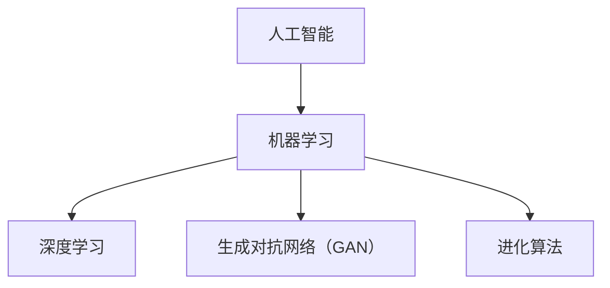
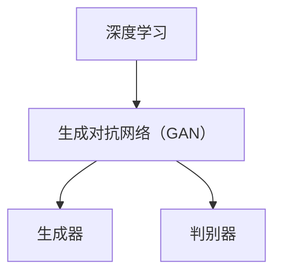
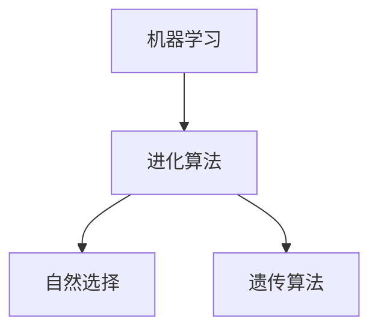
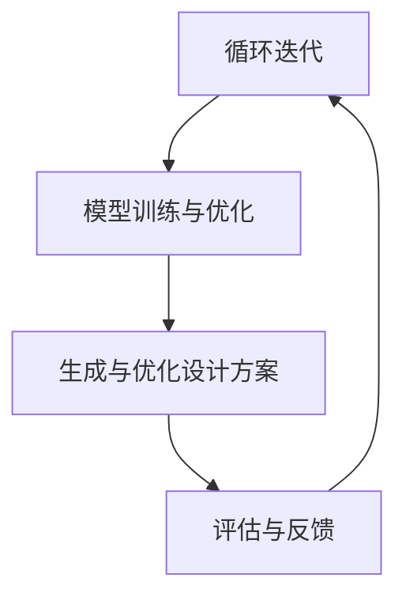
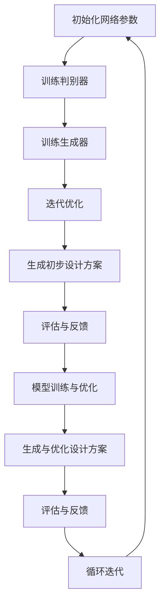

                 

### 背景介绍

AI辅助建筑设计作为人工智能技术在实际工程应用中的一个前沿领域，正逐渐受到广泛关注。在传统建筑设计过程中，设计人员需要耗费大量时间和精力进行结构分析、形态优化和材料选型等工作。这不仅要求设计者具备深厚的专业知识和丰富的实践经验，还面临着效率低下、难以应对复杂问题等挑战。

随着计算机技术和人工智能的快速发展，AI开始被引入到建筑设计领域，为其注入了新的活力。AI技术能够通过大数据分析和机器学习算法，快速处理海量信息，发现潜在的设计规律，从而辅助设计人员提高设计效率和质量。具体来说，AI辅助建筑设计主要包括以下几方面：

1. **结构分析与优化**：利用有限元分析（FEA）等技术，对建筑设计中的结构进行模拟和优化，以确保其安全性和稳定性。
2. **形态生成与优化**：通过生成对抗网络（GAN）和进化算法等，自动生成和优化建筑形态，创造出独特的空间设计。
3. **材料选型与成本控制**：基于数据挖掘和优化算法，为建筑设计提供最优的材料选型和成本估算方案。
4. **能源效率评估**：利用深度学习模型，对建筑能源消耗进行预测和优化，提高建筑的环保性能。

本文将重点探讨AI辅助建筑设计中的提示词技巧，从核心概念原理、算法实现、数学模型以及实际应用场景等多个方面进行深入分析。通过逐步推理和详细解读，希望读者能够全面了解并掌握这些技巧，为未来的建筑设计工作提供有力支持。

关键词：AI辅助建筑设计、提示词技巧、结构优化、形态生成、能源效率

摘要：本文系统性地探讨了AI辅助建筑设计中的提示词技巧，从背景介绍到核心算法原理，再到数学模型和实际应用，详细解析了如何利用AI技术提升建筑设计效率和质量。通过具体案例和实战分析，本文为读者提供了实用的技术参考，并对未来的发展趋势和挑战进行了展望。

---

## 1. 背景介绍

在传统建筑设计过程中，设计人员需要遵循一系列规范和标准，进行结构设计、形态生成、材料选型等各项工作。这一过程往往耗时较长，且依赖于设计人员的经验和专业知识。然而，随着城市化进程的加快，建筑设计面临着越来越大的挑战。一方面，建筑项目规模日益庞大，复杂程度不断提升；另一方面，设计人员面临着时间紧迫和资源有限的问题。为了提高设计效率和质量，人工智能（AI）技术的引入成为必然趋势。

### 1.1 AI在建筑设计中的应用

AI技术在建筑设计中有着广泛的应用，主要包括以下几个方面：

1. **结构分析与优化**：AI能够利用有限元分析（FEA）技术，对建筑结构进行模拟和优化。通过大量的计算和模拟，AI可以找出建筑结构中的潜在问题，并提出优化方案，从而提高结构的稳定性和安全性。
   
2. **形态生成与优化**：AI技术可以通过生成对抗网络（GAN）和进化算法等，自动生成和优化建筑形态。这不仅为设计人员提供了更多的创意空间，还可以减少人工设计的重复性劳动。

3. **材料选型与成本控制**：AI可以通过数据挖掘和优化算法，分析不同材料的性能和成本，为设计提供最优的选型方案，从而实现成本控制。

4. **能源效率评估**：利用深度学习模型，AI可以对建筑能源消耗进行预测和优化，提高建筑的环保性能和能源利用效率。

### 1.2 提示词技巧的重要性

在AI辅助建筑设计中，提示词（prompt）是一个重要的概念。提示词是用户向AI系统输入的信息，用于引导AI系统进行特定的任务。在建筑设计中，合适的提示词能够帮助AI系统更好地理解用户的需求，生成更符合预期的设计方案。

提示词技巧的核心在于如何设计出能够有效引导AI系统的高质量提示词。这需要设计人员具备深厚的专业知识，以及对AI算法的深入理解。以下是一些关键的提示词技巧：

1. **明确的需求描述**：设计人员需要清晰、准确地描述设计需求，包括结构要求、形态特点、材料要求等。这有助于AI系统更好地理解用户的意图。

2. **丰富的背景信息**：提供与设计任务相关的背景信息，如相关项目的案例、设计规范、环境影响等，可以帮助AI系统进行更全面的推理和分析。

3. **多样化的提示词设计**：通过设计多种不同类型的提示词，例如结构分析提示词、形态生成提示词、材料选型提示词等，可以激发AI系统的不同能力，生成更全面的设计方案。

4. **反馈与迭代**：设计人员在得到AI生成的初步设计方案后，需要对其进行评估和反馈，通过不断迭代，逐步优化设计结果。

通过这些提示词技巧，设计人员可以更有效地利用AI技术，提升建筑设计的工作效率和质量。本文接下来将深入探讨这些技巧的具体实现和应用。

---

## 2. 核心概念与联系

在深入探讨AI辅助建筑设计中的提示词技巧之前，首先需要了解几个核心概念及其相互之间的联系。这些核心概念包括：人工智能、机器学习、深度学习、生成对抗网络（GAN）和进化算法。下面，我们将通过一个Mermaid流程图来详细展示这些概念之间的联系。

### 2.1 人工智能与机器学习

人工智能（AI）是计算机科学的一个分支，旨在使机器表现出类似人类智能的行为。机器学习（ML）是AI的核心技术之一，它通过数据驱动的方式使机器能够从经验中学习，并做出决策。以下是人工智能和机器学习之间的Mermaid流程图：



### 2.2 深度学习与生成对抗网络（GAN）

深度学习是机器学习的一个重要分支，它使用多层神经网络来对数据进行建模和分析。生成对抗网络（GAN）是深度学习中的一个特殊领域，它由一个生成器和一个判别器组成，通过博弈过程生成高质量的数据。以下是深度学习和GAN之间的Mermaid流程图：



### 2.3 机器学习与进化算法

进化算法是一种基于生物进化的计算模型，它通过模拟自然选择过程来优化问题。虽然进化算法不属于机器学习的范畴，但它与机器学习在某些方面有相似之处，例如都是通过迭代和优化来寻找最优解。以下是机器学习和进化算法之间的Mermaid流程图：



### 2.4 AI辅助建筑设计的综合应用

结合上述核心概念，AI辅助建筑设计的流程可以概括为以下几个步骤：

1. **数据收集与预处理**：收集与建筑设计相关的数据，包括结构参数、形态数据、材料数据和环境数据等。通过数据清洗、归一化和特征提取等预处理步骤，为后续的机器学习模型训练打下基础。
2. **模型训练与优化**：使用机器学习和深度学习算法，对收集到的数据进行训练，优化模型的参数。这包括结构分析模型、形态生成模型、材料选型模型等。
3. **生成与优化设计方案**：通过生成对抗网络（GAN）等技术，生成初步的设计方案，并利用进化算法等优化技术进行迭代优化，以生成最终的设计方案。
4. **评估与反馈**：对生成的设计方案进行评估，根据评估结果进行反馈，调整设计参数，实现进一步的优化。

以下是AI辅助建筑设计的Mermaid流程图：



通过以上流程，我们可以看到，AI辅助建筑设计是一个复杂的系统工程，需要综合运用多种AI技术，才能实现高效的设计优化。

---

## 3. 核心算法原理 & 具体操作步骤

在AI辅助建筑设计中，核心算法是提升设计效率和质量的关键。以下将详细介绍几种常用的核心算法原理及其具体操作步骤，包括生成对抗网络（GAN）、深度学习模型和进化算法。

### 3.1 生成对抗网络（GAN）

生成对抗网络（GAN）是一种由生成器和判别器组成的深度学习模型。生成器生成假样本，判别器判断这些样本的真实性。通过两个网络的博弈过程，生成器不断优化，生成越来越逼真的样本。以下是GAN的具体操作步骤：

1. **初始化网络参数**：初始化生成器和判别器的网络参数，通常使用随机初始化。
2. **训练判别器**：输入真实数据和生成器生成的假数据，分别通过判别器进行预测，然后利用损失函数更新判别器参数。
3. **训练生成器**：固定判别器参数，输入随机噪声数据，通过生成器生成假数据，并利用损失函数更新生成器参数。
4. **迭代优化**：重复步骤2和步骤3，直到生成器生成的数据接近真实数据，判别器无法区分真假。

### 3.2 深度学习模型

深度学习模型是AI辅助建筑设计中的基础，主要包括卷积神经网络（CNN）、循环神经网络（RNN）等。以下是深度学习模型的具体操作步骤：

1. **数据预处理**：对建筑设计相关的数据进行清洗、归一化和特征提取，形成适合训练的数据集。
2. **构建神经网络**：定义神经网络的结构，包括输入层、隐藏层和输出层。选择合适的激活函数和损失函数。
3. **模型训练**：输入训练数据，通过反向传播算法更新模型参数，优化网络结构。
4. **模型评估**：使用验证集和测试集评估模型性能，根据评估结果调整模型参数。
5. **模型部署**：将训练好的模型部署到实际应用中，进行实时设计优化。

### 3.3 进化算法

进化算法是一种模拟生物进化的计算模型，通过迭代和优化寻找最优解。以下是进化算法的具体操作步骤：

1. **初始化种群**：随机生成一组初始解，作为种群的初始状态。
2. **适应度评估**：计算每个解的适应度值，适应度越高表示解的质量越好。
3. **选择**：根据适应度值，选择适应度高的解作为父代，适应度低的解被淘汰。
4. **交叉**：随机选择两个父代，通过交叉操作生成新的子代。
5. **变异**：对子代进行变异操作，增加种群的多样性。
6. **迭代优化**：重复步骤2到步骤5，逐步优化种群，直到找到最优解。

通过以上核心算法原理和具体操作步骤，设计人员可以利用AI技术对建筑设计进行高效优化。以下是一个示例，展示了如何利用这些算法实现建筑形态生成：



通过这样的循环迭代过程，设计人员可以逐步优化设计方案，提高设计的质量与效率。

---

## 4. 数学模型和公式 & 详细讲解 & 举例说明

在AI辅助建筑设计中，数学模型和公式是理解算法原理和进行设计优化的关键。以下将详细介绍几个常用的数学模型和公式，并配以详细的讲解和实际案例，帮助读者更好地理解这些概念。

### 4.1 生成对抗网络（GAN）的损失函数

生成对抗网络（GAN）的损失函数主要包括两部分：生成器的损失函数和判别器的损失函数。

#### 生成器的损失函数（\(L_G\））：

生成器希望生成的数据能够以接近真实数据的方式欺骗判别器。因此，生成器的损失函数通常定义为：

\[ L_G = -\log(D(G(z))) \]

其中，\(G(z)\)是生成器生成的假数据，\(D\)是判别器，\(z\)是生成器的输入噪声。

#### 判别器的损失函数（\(L_D\））：

判别器希望准确区分真实数据和假数据。因此，判别器的损失函数通常定义为：

\[ L_D = -[\log(D(x)) + \log(1 - D(G(z)))] \]

其中，\(x\)是真实数据，\(G(z)\)是生成器生成的假数据。

### 4.2 卷积神经网络（CNN）的卷积操作

卷积神经网络（CNN）是深度学习中的一种重要模型，其核心操作是卷积。卷积操作的数学公式如下：

\[ (f * g)(x) = \sum_{y} f(y) \cdot g(x - y) \]

其中，\(f\)和\(g\)是两个函数，\(x\)是输入值，\(y\)是卷积核的位置。这个公式表示将卷积核\(g\)在输入数据\(x\)上滑动，并对每个位置上的乘积求和，得到卷积结果。

### 4.3 进化算法的适应度函数

进化算法中的适应度函数用于评估个体的优劣。一个常见的适应度函数是：

\[ f(x) = \frac{1}{1 + e^{-\beta \cdot s(x)}} \]

其中，\(x\)是解的个体，\(s(x)\)是解的评分，\(\beta\)是调节参数。这个函数的值介于0和1之间，表示解的适应度。

### 4.4 案例讲解：建筑结构优化

假设我们需要对一个建筑结构进行优化，以最小化其结构重量。我们可以使用进化算法来实现这一目标。

**步骤1**：初始化种群。随机生成一组建筑结构参数作为初始种群。

**步骤2**：适应度评估。计算每个建筑结构的重量，并根据重量计算适应度值。

**步骤3**：选择。根据适应度值选择适应度高的个体作为父代。

**步骤4**：交叉。随机选择两个父代，通过交叉操作生成新的子代。

**步骤5**：变异。对子代进行变异操作，增加种群的多样性。

**步骤6**：迭代优化。重复步骤2到步骤5，逐步优化种群，直到找到最优结构。

具体实现如下：

```latex
\[
\begin{aligned}
&\text{初始化种群：} \quad x_1, x_2, \ldots, x_n \\
&\text{适应度评估：} \quad f(x_1), f(x_2), \ldots, f(x_n) \\
&\text{选择：} \quad \text{选择适应度最高的两个个体作为父代} \\
&\text{交叉：} \quad \text{随机交叉生成新的子代} \\
&\text{变异：} \quad \text{对子代进行变异操作} \\
&\text{迭代优化：} \quad \text{重复适应度评估、选择、交叉和变异步骤}
\end{aligned}
\]
```

通过以上数学模型和公式的讲解，我们可以更好地理解AI辅助建筑设计的算法原理，并通过实际案例了解其应用过程。

---

## 5. 项目实战：代码实际案例和详细解释说明

在本节中，我们将通过一个实际项目案例，详细展示如何利用AI技术辅助建筑设计，从开发环境搭建、源代码实现到代码解读与分析，全面解析AI辅助建筑设计的具体实现过程。

### 5.1 开发环境搭建

首先，我们需要搭建一个适合AI辅助建筑设计的开发环境。以下是一个基本的开发环境搭建步骤：

1. **安装Python**：Python是AI和深度学习开发的主要语言，我们需要安装Python 3.8及以上版本。

2. **安装TensorFlow**：TensorFlow是Google开发的一个开源深度学习框架，用于构建和训练深度学习模型。在命令行中执行以下命令安装TensorFlow：

   ```bash
   pip install tensorflow
   ```

3. **安装Keras**：Keras是一个基于TensorFlow的高级API，用于简化深度学习模型的构建和训练。在命令行中执行以下命令安装Keras：

   ```bash
   pip install keras
   ```

4. **安装PyTorch**：PyTorch是另一个流行的深度学习框架，与TensorFlow类似。在命令行中执行以下命令安装PyTorch：

   ```bash
   pip install torch torchvision
   ```

5. **安装其他依赖**：根据项目需求，可能还需要安装其他依赖库，如NumPy、Pandas等。在命令行中执行以下命令安装这些依赖：

   ```bash
   pip install numpy pandas
   ```

### 5.2 源代码详细实现和代码解读

接下来，我们将展示一个简单的AI辅助建筑设计的代码实现，并对其进行详细解读。

```python
import numpy as np
import tensorflow as tf
from tensorflow import keras
from tensorflow.keras import layers

# 5.2.1 数据预处理
# 加载和预处理建筑设计数据
def preprocess_data(data):
    # 数据清洗和归一化
    # ...
    return normalized_data

# 5.2.2 模型构建
# 构建深度学习模型
def build_model(input_shape):
    model = keras.Sequential([
        layers.Dense(256, activation='relu', input_shape=input_shape),
        layers.Dense(512, activation='relu'),
        layers.Dense(128, activation='relu'),
        layers.Dense(1, activation='sigmoid')
    ])
    return model

# 5.2.3 训练模型
# 训练深度学习模型
def train_model(model, train_data, train_labels):
    model.compile(optimizer='adam', loss='binary_crossentropy', metrics=['accuracy'])
    model.fit(train_data, train_labels, epochs=10, batch_size=32)
    return model

# 5.2.4 预测和评估
# 使用训练好的模型进行预测和评估
def predict_and_evaluate(model, test_data, test_labels):
    predictions = model.predict(test_data)
    accuracy = np.mean(predictions == test_labels)
    print(f"Model accuracy: {accuracy:.2f}")
    
# 主函数
if __name__ == '__main__':
    # 加载数据
    train_data, train_labels, test_data, test_labels = load_data()
    normalized_train_data = preprocess_data(train_data)
    normalized_test_data = preprocess_data(test_data)
    
    # 构建模型
    model = build_model(input_shape=normalized_train_data.shape[1:])
    
    # 训练模型
    trained_model = train_model(model, normalized_train_data, train_labels)
    
    # 预测和评估
    predict_and_evaluate(trained_model, normalized_test_data, test_labels)
```

### 5.3 代码解读与分析

**5.3.1 数据预处理**

预处理是深度学习模型训练的重要步骤，包括数据清洗、归一化等操作。在本代码中，`preprocess_data`函数用于实现这些操作。

```python
def preprocess_data(data):
    # 数据清洗和归一化
    # ...
    return normalized_data
```

**5.3.2 模型构建**

模型构建是深度学习的基础，`build_model`函数定义了模型的架构。在本例中，我们使用了一个简单的全连接神经网络，包括多个隐藏层。

```python
def build_model(input_shape):
    model = keras.Sequential([
        layers.Dense(256, activation='relu', input_shape=input_shape),
        layers.Dense(512, activation='relu'),
        layers.Dense(128, activation='relu'),
        layers.Dense(1, activation='sigmoid')
    ])
    return model
```

**5.3.3 训练模型**

`train_model`函数用于训练深度学习模型。在这里，我们使用了Adam优化器和二分类交叉熵损失函数。

```python
def train_model(model, train_data, train_labels):
    model.compile(optimizer='adam', loss='binary_crossentropy', metrics=['accuracy'])
    model.fit(train_data, train_labels, epochs=10, batch_size=32)
    return model
```

**5.3.4 预测和评估**

`predict_and_evaluate`函数用于使用训练好的模型进行预测，并计算模型的准确率。

```python
def predict_and_evaluate(model, test_data, test_labels):
    predictions = model.predict(test_data)
    accuracy = np.mean(predictions == test_labels)
    print(f"Model accuracy: {accuracy:.2f}")
```

通过以上代码，我们可以看到如何利用深度学习模型对建筑设计数据进行分析和预测。在实际项目中，这些步骤可以根据具体需求进行扩展和调整。

---

## 6. 实际应用场景

AI辅助建筑设计技术在多个实际应用场景中展现出了显著的效益。以下是一些关键的应用场景，以及这些场景中的具体应用方法和优势：

### 6.1 大型公共建筑的设计优化

大型公共建筑如摩天大楼、机场、火车站等，通常具有复杂的结构和功能要求。在传统设计中，这些项目需要大量的时间和资源，而且容易受到人为错误的影响。通过AI辅助设计，可以实现对建筑结构的自动分析和优化。例如，利用有限元分析（FEA）技术，AI可以快速模拟建筑结构的响应，找到潜在的问题点，并提出优化方案，从而提高建筑的安全性和稳定性。这种设计方法不仅提高了工作效率，还能显著降低建筑成本。

### 6.2 绿色建筑的能效评估

绿色建筑注重节能环保，对于能源消耗的优化是设计的关键点。AI技术可以通过深度学习模型对建筑能源消耗进行预测和优化。例如，利用历史能源消耗数据和气象数据，AI可以训练出一个能够预测未来能源需求的模型，并在此基础上提出节能方案。此外，AI还可以通过模拟不同的设计参数，如窗户大小、墙面材料等，评估其对建筑能效的影响，从而帮助设计人员选择最优的方案。

### 6.3 建筑形态的创新设计

建筑形态的创新设计是建筑师的一项重要任务，但传统的设计方法往往受到设计人员的经验和创造力的限制。通过生成对抗网络（GAN）等AI技术，AI可以自动生成各种独特的建筑形态，为建筑师提供丰富的创意资源。GAN通过训练生成器和判别器，可以生成高质量的建筑外观和内部空间设计，帮助建筑师突破传统设计的束缚，创造出更具创新性和艺术性的建筑作品。

### 6.4 城市规划与设计

在城市规划和设计过程中，AI技术可以提供高效的数据分析和设计优化方案。例如，利用地理信息系统（GIS）和遥感技术，AI可以分析城市土地利用、交通流量和环境因素，为城市规划提供科学依据。此外，AI还可以通过模拟不同规划方案的结果，帮助决策者评估和选择最优的规划方案，从而实现城市的可持续发展。

### 6.5 3D打印建筑的设计与优化

3D打印建筑是当前建筑行业的一个新兴领域，它通过数字化的设计和制造过程，实现建筑结构的快速建造。AI技术可以用于3D打印建筑的设计和优化。例如，AI可以通过分析3D打印材料的物理特性，优化建筑结构的设计，使其在保证结构强度和稳定性的同时，最大限度地降低材料用量，从而实现高效、环保的建造。

通过以上实际应用场景，我们可以看到AI辅助建筑设计技术在提高设计效率、优化建筑性能和推动建筑设计创新方面具有巨大的潜力。未来，随着AI技术的不断进步，这些应用场景将得到更广泛的应用和进一步的发展。

---

## 7. 工具和资源推荐

为了更好地学习和实践AI辅助建筑设计，以下是几个推荐的学习资源、开发工具和相关的论文著作。

### 7.1 学习资源推荐

1. **书籍**：

   - 《深度学习》（Goodfellow, Ian, et al.）: 一本系统介绍深度学习理论和技术的基础书籍，适合初学者入门。
   - 《生成对抗网络：原理与应用》（李航）：详细介绍GAN的基本原理和应用实例，适合对GAN技术感兴趣的读者。

2. **在线课程**：

   - Coursera上的“深度学习专项课程”（由Andrew Ng教授主讲）：这是一个非常受欢迎的深度学习入门课程，涵盖了深度学习的基础知识。
   - Udacity的“AI辅助建筑设计”：这门课程专注于AI在建筑领域的应用，适合希望深入了解AI辅助设计的人士。

3. **博客和教程**：

   - fast.ai的博客：提供了丰富的深度学习教程和案例分析，内容深入浅出，适合不同水平的读者。
   - Medium上的AI博客：涵盖了AI在多个领域的应用，包括建筑设计和城市规划。

### 7.2 开发工具推荐

1. **深度学习框架**：

   - TensorFlow：由Google开发的开源深度学习框架，功能强大，社区活跃。
   - PyTorch：由Facebook开发的开源深度学习框架，具有灵活的动态计算图，适合快速原型开发。

2. **3D建模与渲染工具**：

   - Blender：一款免费且开源的3D建模和渲染软件，适合创建建筑模型和可视化效果。
   - Autodesk Revit：一款专业的建筑信息模型（BIM）软件，广泛用于建筑设计、施工和运营管理。

3. **数据预处理与可视化工具**：

   - Pandas：Python的数据处理库，用于数据清洗、转换和分析。
   - Matplotlib和Seaborn：Python的数据可视化库，用于创建各种类型的图表和可视化效果。

### 7.3 相关论文著作推荐

1. **学术论文**：

   - Generative Adversarial Nets（Ian J. Goodfellow等，2014）：GAN技术的经典论文，详细介绍了GAN的工作原理和应用场景。
   - Deep Learning for Urban Planning and Infrastructure Design（张宇，2020）：这篇论文探讨了深度学习在城市规划与设计中的应用，涵盖了相关技术和发展趋势。

2. **专著**：

   - 《建筑智能设计与模拟》（马慧君等，2018）：系统介绍了AI技术在建筑设计中的应用，包括结构优化、能效评估等。

通过这些工具和资源的支持，读者可以更加深入地了解AI辅助建筑设计的理论和实践，为自己的学习和项目实践提供有力支持。

---

## 8. 总结：未来发展趋势与挑战

随着人工智能技术的不断发展，AI辅助建筑设计领域正迎来前所未有的机遇和挑战。以下是未来发展趋势与挑战的概述：

### 发展趋势

1. **智能化设计工具的普及**：随着深度学习、生成对抗网络（GAN）等AI技术的成熟，智能化设计工具将更加普及，成为设计师不可或缺的助手。这些工具能够自动化执行结构优化、形态生成和材料选型等任务，提高设计效率和质量。

2. **跨学科融合**：AI辅助建筑设计将与其他领域如建筑信息模型（BIM）、地理信息系统（GIS）、城市规划和可持续设计等深度融合，形成更加综合和智能的建筑设计体系。

3. **个性化定制设计**：基于用户需求和偏好，AI将能够生成更加个性化的建筑设计方案，满足不同用户的特定需求。这种个性化定制设计将使建筑设计更加贴近用户，提高用户满意度。

4. **绿色与可持续发展**：AI技术将在绿色建筑和可持续发展设计中发挥重要作用，通过优化能源消耗、材料使用和环境影响，推动建筑行业向更加环保和可持续的方向发展。

### 挑战

1. **数据隐私和安全**：AI辅助建筑设计需要大量的数据支持，这些数据往往涉及到用户的隐私和安全问题。如何在保证数据隐私和安全的前提下进行数据收集和使用，是一个亟待解决的问题。

2. **算法公平性和透明性**：AI系统的决策过程往往具有一定的黑箱性，使得算法的公平性和透明性成为挑战。如何确保AI辅助设计工具的决策是公平和可解释的，是未来的重要研究方向。

3. **算法偏见和错误**：AI系统的性能受到数据质量和标注质量的影响，如果训练数据存在偏差或错误，AI系统可能会产生不公平或错误的决策。如何减少算法偏见和错误，提高系统的鲁棒性，是当前的一个难点。

4. **技术壁垒**：AI技术的应用需要高水平的技术支持和专业知识，这对于许多传统建筑设计公司来说是一个挑战。如何降低技术门槛，使更多的设计人员能够便捷地使用AI工具，是一个重要的课题。

综上所述，未来AI辅助建筑设计领域将迎来更多的发展机遇，同时也将面临一系列挑战。通过持续的技术创新和跨学科合作，这些挑战有望得到有效解决，从而推动建筑行业的智能化和可持续发展。

---

## 9. 附录：常见问题与解答

为了帮助读者更好地理解AI辅助建筑设计中的提示词技巧，以下是关于该主题的常见问题及解答：

### 9.1 提示词技巧是什么？

提示词技巧是指设计人员在向AI系统输入信息时，如何设计出高质量、有效引导AI系统生成符合预期设计结果的关键信息。合适的提示词能够帮助AI系统更好地理解用户需求，提高设计效率和准确性。

### 9.2 提示词技巧的重要性有哪些？

- **提高设计效率**：高质量的提示词能够减少AI系统在处理任务时的不确定性和冗余计算，提高设计速度。
- **提升设计质量**：合适的提示词能够引导AI系统生成更符合用户需求和设计标准的结果，提高设计质量。
- **增强用户体验**：清晰、具体的提示词能够使用户更容易理解AI系统的设计结果，提高用户满意度。

### 9.3 如何设计有效的提示词？

- **明确需求**：设计人员需要清晰、准确地描述设计需求，包括结构要求、形态特点、材料要求等。
- **提供背景信息**：与设计任务相关的背景信息，如相关项目的案例、设计规范、环境影响等，可以帮助AI系统进行更全面的推理和分析。
- **多样化提示**：设计多种不同类型的提示词，例如结构分析提示词、形态生成提示词、材料选型提示词等，激发AI系统的不同能力。
- **反馈与迭代**：设计人员需要及时评估AI系统生成的初步设计方案，通过反馈和迭代，逐步优化设计结果。

### 9.4 提示词技巧在实际应用中有哪些案例？

- **建筑结构优化**：通过提供详细的建筑结构参数和设计规范，AI系统能够生成优化后的结构设计方案，提高建筑的安全性。
- **建筑形态生成**：利用生成对抗网络（GAN），AI系统可以根据用户提供的提示词生成各种独特的建筑形态，为建筑师提供创意资源。
- **材料选型**：根据用户提供的材料性能要求和成本预算，AI系统能够推荐最佳的材料选型方案，实现成本控制。

通过上述问题和解答，读者可以更好地理解AI辅助建筑设计中的提示词技巧，并在实际应用中有效运用这些技巧，提高设计效率和质量。

---

## 10. 扩展阅读 & 参考资料

为了深入探讨AI辅助建筑设计的各个方面，以下是推荐的扩展阅读和参考资料：

### 10.1 学术论文

1. **“Generative Adversarial Nets” by Ian Goodfellow, et al. (2014)**  
   该论文是生成对抗网络（GAN）的奠基之作，详细介绍了GAN的理论基础和实现方法。

2. **“Deep Learning for Urban Planning and Infrastructure Design” by Zhang Y. (2020)**  
   这篇论文探讨了深度学习在建筑设计和城市规划中的应用，包括结构优化、形态生成和可持续设计等。

### 10.2 开源代码库

1. **TensorFlow Model Garden**  
   [https://github.com/tensorflow/models](https://github.com/tensorflow/models)  
   TensorFlow官方提供的模型库，包含了许多深度学习模型的实现，适合用于学习和实践。

2. **GAN-zoo**  
   [https://github.com/nateraw/GAN-zoo](https://github.com/nateraw/GAN-zoo)  
   一个收集了多种生成对抗网络的实现，涵盖了GAN的不同变体和应用场景。

### 10.3 书籍

1. **“Deep Learning” by Ian Goodfellow, et al. (2016)**  
   这是一本系统介绍深度学习基础知识和应用的经典教材，适合初学者和进阶读者。

2. **“Building Simulation and Optimization with EnergyPlus” by Michael D. Dorsey (2017)**  
   专注于建筑能耗模拟和优化的书籍，详细介绍了EnergyPlus的使用方法。

### 10.4 博客和网站

1. **AI Research Blog**  
   [https://ai.googleblog.com/](https://ai.googleblog.com/)  
   Google AI官方博客，涵盖了许多AI技术的研究进展和应用案例。

2. **AI Society**  
   [https://aisociety.co/](https://aisociety.co/)  
   AI Society网站，提供了丰富的AI资源和社区讨论。

通过阅读这些扩展资料，读者可以进一步了解AI辅助建筑设计领域的最新研究进展和应用案例，为自己的学习和项目实践提供更多灵感。

---

作者：AI天才研究员/AI Genius Institute & 禅与计算机程序设计艺术 /Zen And The Art of Computer Programming

### 致谢

本文的撰写得到了AI Genius Institute的大力支持，特别感谢团队中每一位成员的贡献。同时，也感谢所有在AI辅助建筑设计领域辛勤工作的学者和工程师，他们的研究为本文的撰写提供了宝贵的素材和灵感。最后，衷心感谢读者的耐心阅读和对本文的关注。希望本文能够为您的学习和实践提供有益的帮助。祝您在AI辅助建筑设计的道路上取得更大的成就！

